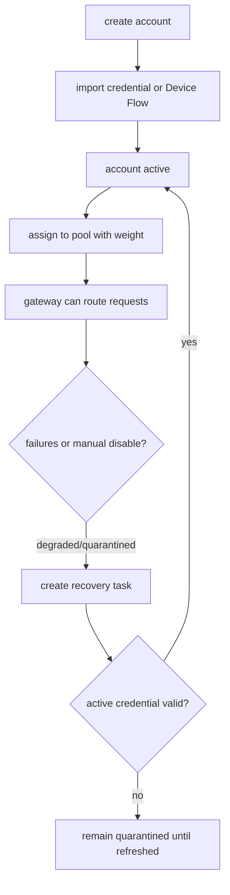
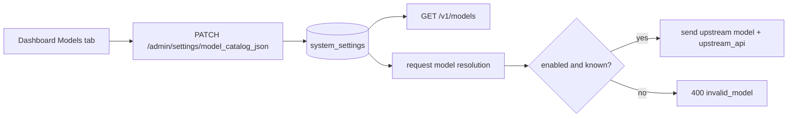

# Features and Usage Guide

This guide is for administrators and operators. It covers account management, model catalog configuration, dashboard usage, Admin APIs, environment variables, security boundaries, and future improvements.

## Account Management



### Create Account

In the dashboard **Accounts** tab, click **+ Add Account** to create an account.

| Field | Description |
| --- | --- |
| `Account Name` | Display name for the account |
| `Account Source` | `personal`, `org_business_seat`, or `enterprise_seat` |
| `GitHub Login` | Associated GitHub username |
| `Max Concurrency` | Maximum concurrent requests, default 1 |

After creation, assign the account to one or more pools before it can receive routed traffic.

### Credential Import and Login Flow

GitHub Device Flow is recommended. It uses the official authorization page, then encrypts and stores the GitHub OAuth token and Copilot bearer token under the selected account.

Device Flow steps:

1. Use the default VS Code OAuth Client ID, or set `GITHUB_OAUTH_CLIENT_ID` if you need an override.
2. In the Accounts table, click **Device Flow** for the target account.
3. Open the GitHub authorization link and enter or confirm the user code.
4. Return to the dashboard and click **Complete Login**.
5. The system encrypts the tokens and moves the account to `active` once the credential is valid.

Manual token import:

1. Click **Login** for the target account in the Accounts table.
2. Paste the token and click **Import**.
3. The token is encrypted with AES-256-GCM using `CREDENTIAL_MASTER_KEY`.

### Multi-Account Isolation

Each GitHub Copilot account has its own account row, encrypted credential payload, token cache entry, pool membership, and sticky routing target. The gateway selects an account first, then loads credentials by `account_id`; no global Copilot token is shared.

Use separate pools and route policies to isolate tenants, teams, environments, or risk tiers.

### Delete and Recover

Clicking **Delete** on an account cascades through credentials, routing affinities, pool memberships, recovery tasks, and Copilot seat mappings.

Use **Recover** in the dashboard or call `POST /admin/accounts/{id}/recover` to create a recovery task. The worker validates that an active credential exists and is not expired, then resets risk counters and restores `active`; failures keep or move the account to `quarantined`.

## Model Catalog Configuration

The model catalog maps exposed model names seen by clients to real upstream model IDs, controls whether each model is visible, and can select whether a model uses the upstream Chat Completions or Responses API. GitHub Copilot upstream is not globally Responses by default: `upstream_api` wins; Copilot-refreshed `vendor=OpenAI` models and known `gpt-5.5` automatically use Responses; known chat-only vendors/model families such as Gemini, Anthropic, and Grok automatically use Chat Completions; other models follow the downstream request protocol.



Example configuration:

```json
[
  {"exposed":"gpt-4o","upstream":"gpt-4o","enabled":true},
  {"exposed":"gpt-4o-mini","upstream":"gpt-4o-mini","enabled":true},
  {"exposed":"gpt-5.5","upstream":"gpt-5.5","upstream_api":"responses","enabled":true},
  {"exposed":"claude-sonnet","upstream":"claude-sonnet-4-20250514","enabled":true},
  {"exposed":"o3-mini","upstream":"o3-mini","enabled":false}
]
```

Models with `enabled=false`, or models absent from the catalog, are not returned by `/v1/models` and requests for them return `400 bad_request` with `invalid_model`.
`upstream_api` is optional and supports `chat_completions` and `responses`; when omitted, the gateway infers from Copilot model metadata, sending `vendor=OpenAI` and known `gpt-5.5` to upstream Responses, known chat-only vendors/model families such as Gemini to Chat Completions, and all remaining models by downstream request protocol.

If `model_catalog_json` is not configured, default models are exposed. If it is configured as an empty array, no models are exposed; this is intentional.

## Dashboard Overview

| Tab | Description |
| --- | --- |
| Overview | Account, pool, client profile, and event counters |
| Accounts | Create, inspect, disable, recover, delete, and import credentials |
| Pools | View pool configuration, membership, weights, and health status |
| Clients | View client profiles and their defaults |
| Metrics | View request, token, AI Credit, USD, and cache hit rate statistics over a time window |
| Events | View audit log entries for admin operations |
| GitHub Orgs | View organization seat mappings and Copilot plan status |
| Settings | Manage system settings and feature flags |
| Models | View and configure exposed/upstream/upstream_api/enabled model catalog entries |

## Admin API Endpoints

All Admin APIs require `Authorization: Bearer {admin_token}`.

### Accounts

| Method | Endpoint | Description |
| --- | --- | --- |
| `POST` | `/admin/accounts` | Create an account |
| `GET` | `/admin/accounts` | List accounts |
| `DELETE` | `/admin/accounts/{id}` | Delete an account and cascade cleanup |
| `POST` | `/admin/accounts/{id}/disable` | Mark as quarantined and remove from routing |
| `POST` | `/admin/accounts/{id}/recover` | Create a recovery task |
| `POST` | `/admin/accounts/{id}/credentials` | Import account credentials |
| `POST` | `/admin/accounts/{id}/device-flow/start` | Start GitHub Device Flow |
| `POST` | `/admin/accounts/{id}/device-flow/complete` | Complete GitHub Device Flow |

Create account request:

```json
{
  "name": "my-account",
  "provider": "copilot",
  "account_source": "personal",
  "github_login": "octocat",
  "max_concurrency": 1,
  "priority": 100
}
```

Import credential request:

```json
{
  "token": "ghu_xxxxxxxxxxxxxxxxxxxx",
  "type": "login_token",
  "source": "manual"
}
```

### Pools

| Method | Endpoint | Description |
| --- | --- | --- |
| `GET` | `/admin/pools` | List pools |
| `POST` | `/admin/pools` | Create a pool |
| `POST` | `/admin/pools/{id}/accounts/{accountId}` | Assign an account to a pool, optionally with weight |
| `DELETE` | `/admin/pools/{id}/accounts/{accountId}` | Remove an account from a pool |

### Settings

| Method | Endpoint | Description |
| --- | --- | --- |
| `GET` | `/admin/settings` | List settings |
| `GET` | `/admin/settings/{key}` | Read one setting |
| `PATCH` | `/admin/settings/{key}` | Update or create a setting |

Update setting request:

```json
{
  "value": "true"
}
```

### GitHub Orgs and Metrics

| Method | Endpoint | Description |
| --- | --- | --- |
| `GET` | `/admin/github/orgs` | List configured GitHub organizations |
| `POST` | `/admin/github/orgs/{id}/sync-metrics` | Run manual Copilot Metrics sync for one org |

The worker periodically syncs metrics when `copilot_metrics_sync_enabled` is enabled and an org token or `GITHUB_TOKEN` is available.

### Usage and Cost Statistics

The gateway writes every successful request to `usage_ledger`. With the real Copilot provider, it parses the upstream `usage` and `copilot_usage` fields and records input tokens, cached input tokens, cache write tokens, output tokens, reasoning tokens, `nano_aiu`, estimated AI Credits, and estimated USD.

| Metric | Description |
| --- | --- |
| Input Tokens | Total input tokens sent to the model |
| Cached Input | Input tokens served by upstream cache reads |
| Cache Write | Tokens written to the upstream prompt cache |
| Output Tokens | Model output tokens |
| Reasoning Tokens | Reasoning tokens consumed by reasoning models |
| AI Credits | Derived from Copilot `total_nano_aiu`; `1_000_000_000 nano_aiu = 1 AI Credit` |
| Estimated USD | `AI Credits * 0.01`, used for approximate cost display |
| Cache Hit Rate | `cached_input_tokens / input_tokens`, useful for checking sticky/cache affinity effectiveness |

The dashboard Metrics tab supports quick windows and custom `from/to` date ranges. It shows global totals and breaks down requests, AI Credits, USD, token classes, and cache hit rate by client profile. `/admin/usage/summary` and `/admin/usage/by-client` return the same aggregate fields and support `granularity=auto|raw|hourly|daily`. Auto mode chooses raw rows, hourly rollups, or daily rollups based on the selected range.

## Environment Variables

| Variable | Description |
| --- | --- |
| `CREDENTIAL_MASTER_KEY` | 32 raw bytes or 64 hex characters used to encrypt all stored credentials |
| `DASHBOARD_DIR` | Directory containing built dashboard assets served by admin |
| `GITHUB_TOKEN` | Optional fallback token for the metrics sync worker |
| `GITHUB_OAUTH_CLIENT_ID` | Optional override for the GitHub OAuth App client ID used by dashboard Device Flow; defaults to the built-in GitHub OAuth Client ID |
| `GITHUB_OAUTH_SCOPES` | Device Flow scopes, default `read:user` |
| `PROVIDER` | VM deploy defaults to `copilot`; local development compose defaults to `fake` for smoke tests |

Generate a test encryption key:

```bash
openssl rand -hex 32
```

Example `.env`:

```env
CREDENTIAL_MASTER_KEY=a1b2c3d4e5f6a1b2c3d4e5f6a1b2c3d4e5f6a1b2c3d4e5f6a1b2c3d4e5f6
```

The default development key is for local testing only and must not be used in production.

## Security Notes

- All credentials are encrypted at rest using AES-256-GCM.
- Account, credential, and settings write operations are audit logged.
- Plaintext tokens must not appear in logs, the dashboard, or ordinary API responses.
- Admin APIs require a bearer token.
- Deleting an account cascades associated data including routing affinities and credentials.

## Gateway Integration

On each request, the gateway resolves the exposed model name and maps it to the upstream model before calling the provider.

1. The client sends an exposed model name.
2. The gateway resolves exposed to upstream through the model catalog.
3. If the model is missing or disabled, it returns `400 bad_request` with `invalid_model`.
4. If resolution succeeds, the request is routed to the provider using route policies and pool/account state.

## Next Steps

- Batch account import, bulk delete, and bulk pool assignment.
- Route policy CRUD and dashboard editing.
- Event-driven router config refresh using PostgreSQL notify or Redis pub/sub.
- Versioned migration table instead of replaying SQL files.
- Encrypted org-level metrics tokens instead of a global environment fallback.
- Separate Prometheus metrics endpoints for admin and worker.
- Risk scoring, automated quarantine, and more granular route policies.
