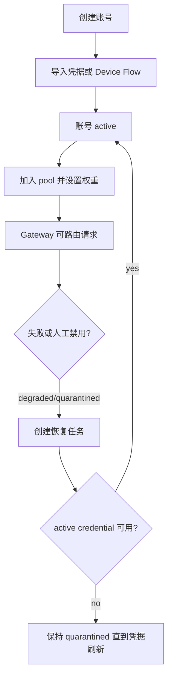
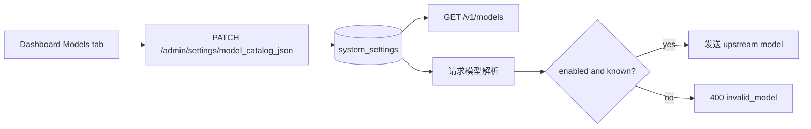

# 功能与使用指南

本文面向管理员和运维人员，说明账号管理、模型目录、Dashboard、Admin API、环境变量、安全边界和后续增强项。

## 1. 账号管理



### 创建账号

在 Dashboard 的 **Accounts** 页点击 **+ Add Account** 创建账号。

| 字段 | 说明 |
| --- | --- |
| `Account Name` | 账号显示名 |
| `Account Source` | `personal`、`org_business_seat` 或 `enterprise_seat` |
| `GitHub Login` | 关联的 GitHub 用户名 |
| `Max Concurrency` | 最大并发请求数，默认 1 |

账号创建后需要加入一个或多个 pool，才会进入可路由候选集。

### 凭据导入与登录流程

推荐使用 GitHub Device Flow。该流程使用官方授权页面完成登录，然后把 GitHub OAuth token 和 Copilot bearer token 加密保存到对应账号。

Device Flow 步骤

1. 使用默认 VS Code OAuth Client ID，或在需要覆盖时设置 `GITHUB_OAUTH_CLIENT_ID`。
2. 在 Accounts 表中点击目标账号的 **Device Flow**。
3. 打开 GitHub 授权链接，输入或确认 user code。
4. 回到 Dashboard 点击 **Complete Login**。
5. 系统加密保存 token，账号凭据有效后转为 `active`。

手工 token 导入

1. 在 Accounts 表中点击目标账号的 **Login**。
2. 粘贴 token 并点击 **Import**。
3. token 会使用 `CREDENTIAL_MASTER_KEY` 通过 AES-256-GCM 加密保存。

### 多账号隔离

每个 GitHub Copilot 账号都有独立 account row、加密凭据 payload、token cache entry、pool membership 和 sticky routing target。Gateway 先选账号，再按 `account_id` 加载凭据；不会共享全局 Copilot token。

建议用独立 pool 和 route policy 隔离租户、团队、环境或风险等级。

### 删除与恢复

点击账号行的 **Delete** 会级联删除凭据、routing affinity、pool membership、recovery task 和 Copilot seat 映射。

使用 Dashboard 的 **Recover** 或调用 `POST /admin/accounts/{id}/recover` 可以创建恢复任务。Worker 验证 active credential 未过期后会重置风险计数并恢复 `active`；失败则保持或进入 `quarantined`。

## 2. 模型目录配置

模型目录把客户端看到的 exposed model 映射到真实上游模型 ID，并控制模型是否对外暴露。



示例配置

```json
[
  {"exposed":"gpt-4o","upstream":"gpt-4o","enabled":true},
  {"exposed":"gpt-4o-mini","upstream":"gpt-4o-mini","enabled":true},
  {"exposed":"claude-sonnet","upstream":"claude-sonnet-4-20250514","enabled":true},
  {"exposed":"o3-mini","upstream":"o3-mini","enabled":false}
]
```

`enabled=false` 或未出现在目录中的模型不会出现在 `/v1/models`，请求时返回 `400 bad_request` 和 `invalid_model`。

如果没有配置 `model_catalog_json`，系统会暴露默认模型；如果配置为空数组，则不暴露任何模型，这是有意行为。

## 3. Dashboard 概览

| 页面 | 说明 |
| --- | --- |
| Overview | 账号、池、client profile 和事件计数 |
| Accounts | 创建、查看、禁用、恢复、删除和导入凭据 |
| Pools | 查看 pool 配置、membership、权重和健康状态 |
| Clients | 查看 client profile 和默认策略 |
| Metrics | 按时间窗口查看请求、token、AI Credits、USD 和 cache 命中率统计 |
| Events | 查看 admin 操作审计日志 |
| GitHub Orgs | 查看组织 seat 映射和 Copilot plan 状态 |
| Settings | 管理系统配置和 feature flags |
| Models | 查看和配置 exposed/upstream/enabled 模型目录 |

## 4. Admin API 端点

所有 Admin API 都要求 `Authorization: Bearer {admin_token}`。

### 账号

| 方法 | 端点 | 说明 |
| --- | --- | --- |
| `POST` | `/admin/accounts` | 创建账号 |
| `GET` | `/admin/accounts` | 列出账号 |
| `DELETE` | `/admin/accounts/{id}` | 删除账号并级联清理 |
| `POST` | `/admin/accounts/{id}/disable` | 标记为 quarantined 并移出路由 |
| `POST` | `/admin/accounts/{id}/recover` | 创建恢复任务 |
| `POST` | `/admin/accounts/{id}/credentials` | 导入账号凭据 |
| `POST` | `/admin/accounts/{id}/device-flow/start` | 启动 GitHub Device Flow |
| `POST` | `/admin/accounts/{id}/device-flow/complete` | 完成 GitHub Device Flow |

创建账号请求

```json
{
  "name": "my-account",
  "provider": "copilot",
  "account_source": "personal",
  "github_login": "octocat",
  "max_concurrency": 1,
  "priority": 100
}
```

导入凭据请求

```json
{
  "token": "ghu_xxxxxxxxxxxxxxxxxxxx",
  "type": "login_token",
  "source": "manual"
}
```

### 池

| 方法 | 端点 | 说明 |
| --- | --- | --- |
| `GET` | `/admin/pools` | 列出 pool |
| `POST` | `/admin/pools` | 创建 pool |
| `POST` | `/admin/pools/{id}/accounts/{accountId}` | 将账号加入 pool，可设置 weight |
| `DELETE` | `/admin/pools/{id}/accounts/{accountId}` | 从 pool 移除账号 |

### 设置

| 方法 | 端点 | 说明 |
| --- | --- | --- |
| `GET` | `/admin/settings` | 列出系统设置 |
| `GET` | `/admin/settings/{key}` | 读取一个设置 |
| `PATCH` | `/admin/settings/{key}` | 更新或创建设置 |

更新 setting 请求

```json
{
  "value": "true"
}
```

### GitHub 组织与指标

| 方法 | 端点 | 说明 |
| --- | --- | --- |
| `GET` | `/admin/github/orgs` | 列出配置的 GitHub 组织 |
| `POST` | `/admin/github/orgs/{id}/sync-metrics` | 手动同步一个 org 的 Copilot Metrics |

Worker 在 `copilot_metrics_sync_enabled` 启用且 org token 或 `GITHUB_TOKEN` 可用时，会定时同步 metrics。

### 用量与费用统计

Gateway 会把每次成功请求写入 `usage_ledger`。真实 Copilot provider 会解析上游返回的标准 `usage` 和 `copilot_usage` 字段，记录 input、cached input、cache write、output、reasoning tokens、`nano_aiu`、估算 AI Credits 和估算 USD。

| 指标 | 说明 |
| --- | --- |
| Input Tokens | 发送给模型的输入 token 总量 |
| Cached Input | 上游 cache read 命中的输入 token |
| Cache Write | 写入上游 prompt cache 的 token |
| Output Tokens | 模型输出 token |
| Reasoning Tokens | 推理模型消耗的 reasoning token |
| AI Credits | 从 Copilot `total_nano_aiu` 折算，`1_000_000_000 nano_aiu = 1 AI Credit` |
| Estimated USD | `AI Credits * 0.01`，用于近似费用展示 |
| Cache Hit Rate | `cached_input_tokens / input_tokens`，用于观察 sticky/cache affinity 效果 |

Dashboard Metrics 页支持 quick window 和自定义 `from/to` 日期范围，展示全局统计，并按 client profile 列出请求量、AI Credits、USD、各类 token 和 cache hit rate。`/admin/usage/summary` 与 `/admin/usage/by-client` 返回同一组汇总字段，并支持 `granularity=auto|raw|hourly|daily`。auto 模式会按范围选择 raw、hourly rollup 或 daily rollup。

## 5. 环境变量

| Variable | 说明 |
| --- | --- |
| `CREDENTIAL_MASTER_KEY` | 32 字节原始 key 或 64 位 hex，用于加密所有凭据 |
| `DASHBOARD_DIR` | admin 服务静态 Dashboard 资源目录 |
| `GITHUB_TOKEN` | metrics worker 的 fallback token |
| `GITHUB_OAUTH_CLIENT_ID` | Dashboard Device Flow 使用的 GitHub OAuth App client ID，可选覆盖；默认使用内置 GitHub OAuth Client ID |
| `GITHUB_OAUTH_SCOPES` | Device Flow 请求 scopes，默认 `read:user` |
| `PROVIDER` | 设置为 `copilot` 使用真实 provider，默认 `fake` 用于本地 smoke test |

生成测试加密 key

```bash
openssl rand -hex 32
```

示例 `.env`

```env
CREDENTIAL_MASTER_KEY=a1b2c3d4e5f6a1b2c3d4e5f6a1b2c3d4e5f6a1b2c3d4e5f6a1b2c3d4e5f6
```

默认开发 key 仅用于本地测试，不应进入生产。

## 6. 安全说明

- 所有凭据使用 AES-256-GCM 静态加密。
- 账号、凭据和 settings 写操作会进入审计日志。
- 明文 token 不应出现在日志、Dashboard 或普通 API 响应中。
- Admin API 必须带 bearer token。
- 删除账号会级联清理关联数据，包括 routing affinity 和 credentials。

## 7. Gateway 集成

Gateway 在每次请求中解析 exposed model，并在发送上游 provider 前映射为 upstream model。

1. 客户端发送 exposed model。
2. Gateway 调用模型目录解析 exposed 到 upstream。
3. 找不到或 disabled 时返回 `400 bad_request` 和 `invalid_model`。
4. 解析成功后按 route policy 和 pool/account 状态路由到 provider。

## 8. 后续增强

- 批量账号导入、批量删除和批量 pool 分配。
- Route policy CRUD 与 Dashboard 编辑。
- 基于 PostgreSQL notify 或 Redis pub/sub 的事件驱动 router config refresh。
- 迁移版本表，替代重复 replay SQL 文件。
- org-level metrics token 加密存储，替代全局环境变量 fallback。
- admin/worker 独立 Prometheus metrics endpoint。
- 风险评分、自动 quarantine 和更细粒度的 route policy。
