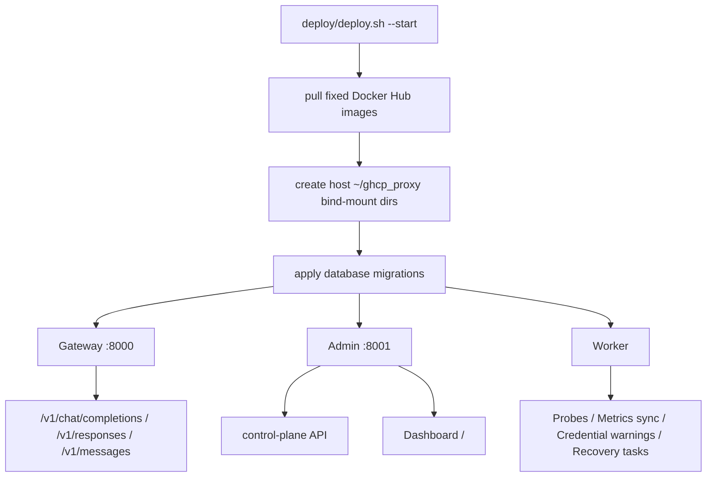

# GHCP Pool Proxy

GHCP Pool Proxy is a gateway and control-plane system for controlled GitHub Copilot account resources.

## Documentation Index

| Description | Link |
| --- | --- |
| Architecture | [docs/architecture.en.md](docs/architecture.en.md) |
| Operations | [docs/operations.en.md](docs/operations.en.md) |
| Protocol | [docs/protocol.en.md](docs/protocol.en.md) |
| Routing | [docs/routing.en.md](docs/routing.en.md) |

## Current Capabilities

- The gateway exposes OpenAI Chat Completions, OpenAI Responses API, and Anthropic Messages endpoints.
- The model catalog is controlled by `model_catalog_json`, including exposed names, upstream model IDs, Copilot `name/vendor` metadata, `upstream_api`, and `enabled` status.
- GitHub Copilot upstream endpoint selection is mixed: `upstream_api` can override per model; `vendor=OpenAI` / `Azure OpenAI` and `gpt*`/o-series use upstream Responses; Gemini, Anthropic/Claude/Opus/Haiku/Sonnet, Microsoft MAI, Grok/xAI, and other non-OpenAI families use upstream Chat Completions; unknown models fall back to the downstream protocol.
- The router selects pools by model and route policy, then applies sticky affinity, overflow, pool/account/seat filtering, concurrency constraints, and weighted selection.
- Route policies support `request_format`, enabling protocol-level routing for `openai_chat`, `openai_responses`, and `anthropic_messages`.
- Pools support `allocation_mode=shared/user_binding/session_binding`. User-binding pools bind by `user_id`, session-binding pools bind by `session_id`; bindings live in PostgreSQL, are cached in Redis, support pool-level `binding_max_concurrency` and idle TTL, and can be released from expanded pool details in the dashboard.
- The gateway loads routing configuration on startup and refreshes pool, account membership, and route policy snapshots from PostgreSQL every 30 seconds.
- Admin and Worker are separate commands. Admin serves control-plane APIs and the dashboard, while Worker runs probes, metrics sync, credential warnings, and recovery tasks.
- The dashboard is designed for operations workflows and covers overview, accounts, pools, clients, metrics, events, settings, and the model catalog; organization-related backend capability is retained, but the current UI does not expose it.

## Quick Start



Use the deployment script from the release repository [pczhao1210/ghcp-pool-proxy](https://github.com/pczhao1210/ghcp-pool-proxy) to start the stack on a Linux VM. It checks Docker/Docker Compose dependencies, creates host `~/ghcp_proxy` persistent directories and bind-mounts PostgreSQL/Redis data directories into containers, pulls fixed Docker Hub images, starts PostgreSQL/Redis/gateway/admin/worker, and writes hourly logs under `~/ghcp_proxy/logs` with 30-day retention by default. VM deployments use the GitHub Copilot provider by default.

Fetch or update the release package with Git, then start it:

```bash
if [ -d ghcp-pool-proxy/.git ]; then
  cd ghcp-pool-proxy && git pull --ff-only
else
  git clone https://github.com/pczhao1210/ghcp-pool-proxy.git && cd ghcp-pool-proxy
fi
chmod +x deploy/deploy.sh
deploy/deploy.sh --start
```

Or download only the runtime deployment files with `curl`:

```bash
mkdir -p ghcp-pool-proxy/deploy && cd ghcp-pool-proxy
curl -fsSL -o deploy/deploy.sh https://raw.githubusercontent.com/pczhao1210/ghcp-pool-proxy/main/deploy/deploy.sh
curl -fsSL -o deploy/docker-compose.vm.yml https://raw.githubusercontent.com/pczhao1210/ghcp-pool-proxy/main/deploy/docker-compose.vm.yml
chmod +x deploy/deploy.sh
deploy/deploy.sh --start
```

If you are already inside the release package directory, run:

```bash
deploy/deploy.sh --start
```

On first run, the script generates host file `~/ghcp_proxy/.env` containing `ADMIN_TOKEN`, `PROVIDER=copilot`, `CREDENTIAL_MASTER_KEY`, and the database password. Keep this file private, and do not rotate `CREDENTIAL_MASTER_KEY` casually after storing credentials.

### Rebuild After Schema Changes

Recent versions changed the database schema, including pool binding, user/session binding, model catalog, and routing fields. Existing old data directories should not be reused directly. Before upgrading to this version, reset PostgreSQL and Redis data, then start again and reconfigure accounts, credentials, pools, client profiles, route policies, and the model catalog in the dashboard.

For VM deployments:

```bash
deploy/deploy.sh --stop
GHCP_RESET_CONFIRM=reset deploy/deploy.sh --reset
deploy/deploy.sh --start
```

For local development:

```bash
./start.sh --reset
```

Reset deletes runtime data but preserves the host `.env`. Before resetting, record any required account setup, client API keys, pool/route policy settings, and model mappings. After reset, log in Copilot accounts again and reconfigure the dashboard.

Tail hourly file logs:

```bash
deploy/deploy.sh --logs
```

Stop VM services while preserving persistent data:

```bash
deploy/deploy.sh --stop
```

The deployment script uses fixed images:

- `pczhao1210/ghcp-pool-proxy:gateway-latest`
- `pczhao1210/ghcp-pool-proxy:admin-latest`
- `pczhao1210/ghcp-pool-proxy:worker-latest`

## Runtime Entrypoints

| Entrypoint | Purpose |
| --- | --- |
| `cmd/gateway` | Client-facing model protocol gateway. |
| `cmd/admin` | Control-plane API and dashboard backend. |
| `cmd/worker` | Health probes, sync jobs, and recovery tasks. |

## Access URLs

| Service | URL | Notes |
| --- | --- | --- |
| Gateway | `http://localhost:8000` | Serves `/v1/chat/completions`, `/v1/responses`, `/v1/messages`, and `/v1/models`. |
| Admin API | `http://localhost:8001/admin/*` | Requires `Authorization: Bearer <ADMIN_TOKEN>`. |
| Dashboard | `http://localhost:8001/` | Static assets are served by admin; the page calls Admin API internally. |
| Metrics | `http://localhost:8000/metrics` | Gateway Prometheus text metrics. |

## GitHub Copilot Onboarding

- Multiple GitHub Copilot accounts are isolated through separate `accounts`, encrypted credentials, token cache entries, pool memberships, and route policies.
- The Accounts page supports `Device Flow`, which authorizes through GitHub's official device flow and stores the resulting Copilot bearer token encrypted under that account.
- Set `PROVIDER=copilot` for the real Copilot provider. Device Flow defaults to the built-in GitHub OAuth Client ID; set `GITHUB_OAUTH_CLIENT_ID` only when you need an override.
- See [docs/operations.en.md](docs/operations.en.md) for detailed procedures.

## Metrics Endpoint

Gateway `GET /metrics` exposes internal counters in Prometheus text format.

After successful requests, the gateway writes a proxy-side usage ledger with input tokens, cached input tokens, cache write tokens, output tokens, reasoning tokens, Copilot `nano_aiu`, estimated AI Credits, and estimated USD. The dashboard Metrics tab shows request volume, AI Credits, USD, cache hit rate, cached input, cache write, output, and reasoning statistics over a selected window.

`/metrics` exposes the same runtime counters, including `ghcp_cache_read_tokens_total`, `ghcp_cache_write_tokens_total`, `ghcp_reasoning_tokens_total`, `ghcp_nano_aiu_total`, `ghcp_ai_credits_micro_total`, `ghcp_estimated_usd_micros_total`, and `ghcp_cache_hit_ratio_permille`. The micro/micros/permille suffixes are integer scaling units so the current text metrics implementation can keep integer output.
