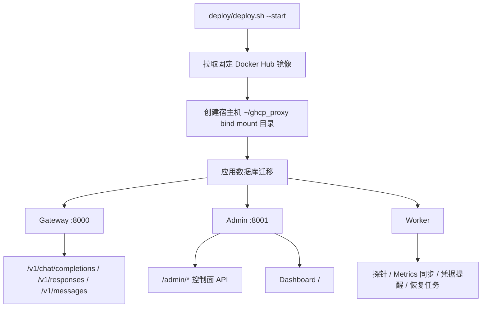

# GHCP Pool Proxy

GHCP Pool Proxy 是一个面向受控 GitHub Copilot 账号资源的网关与控制平面系统。

## 文档入口

| 说明 | 链接 |
| --- | --- |
| Architecture | [docs/architecture.zh.md](docs/architecture.zh.md) |
| Operations | [docs/operations.zh.md](docs/operations.zh.md) |
| Protocol | [docs/protocol.zh.md](docs/protocol.zh.md) |
| Routing | [docs/routing.zh.md](docs/routing.zh.md) |

## 当前能力

- Gateway 已提供 OpenAI Chat Completions、OpenAI Responses API、Anthropic Messages 三类入口。
- 模型目录由 `model_catalog_json` 控制，支持暴露名、上游模型 ID、Copilot `name/vendor` 元数据、`upstream_api` 和 `enabled` 启停。
- GitHub Copilot 上游 endpoint 采用混合选择：`upstream_api` 可按模型显式覆盖；`vendor=OpenAI` / `Azure OpenAI` 与 `gpt*`/o-series 走上游 Responses；Gemini、Anthropic/Claude/Opus/Haiku/Sonnet、Microsoft MAI、Grok/xAI 等非 OpenAI 家族走上游 Chat Completions；其它模型按下游协议兜底。
- Router 支持按模型与 route policy 选择池，并执行 sticky 亲和、overflow、pool/account/seat 过滤、并发约束和权重选择。
- route policy 已支持 `request_format`，可按 `openai_chat`、`openai_responses`、`anthropic_messages` 做协议级分流。
- Pool 已支持 `allocation_mode=shared/user_binding/session_binding`。`user_binding` 按 `user_id` 独占账号，`session_binding` 按 `session_id` 独占账号；绑定存 PostgreSQL，Redis 缓存热路由状态，支持 pool 级 `binding_max_concurrency` 和 idle TTL，也可在 Dashboard 的 pool 展开详情中手动释放。
- Gateway 启动时加载路由配置，并每 30 秒从 PostgreSQL 刷新 pool、账号关系和 route policy 快照。
- Admin 和 Worker 已拆分为独立命令入口；Admin 提供控制面 API 并服务 Dashboard，Worker 执行探针、指标同步、凭据提醒和恢复任务。
- Dashboard 面向运维场景，覆盖概览、账号、池、客户端、指标、事件、设置和模型目录；组织相关能力暂保留在后端，当前 UI 暂不展示。
- Dashboard Overview 支持按 Gateway Public URL 生成 Claude Code、Codex 或 curl 启动脚本，可勾选 custom headers 并自动生成随机 `X-GHCP-Session-ID`。

## 快速开始



推荐使用发布仓库 [pczhao1210/ghcp-pool-proxy](https://github.com/pczhao1210/ghcp-pool-proxy) 中的部署脚本在 Linux VM 上启动。脚本会检查 Docker/Docker Compose 等依赖，在宿主机创建 `~/ghcp_proxy` 持久化目录并把 PostgreSQL/Redis 数据目录 bind mount 到容器，拉取固定 Docker Hub 镜像，启动 PostgreSQL/Redis/gateway/admin/worker，并按小时把日志落盘到 `~/ghcp_proxy/logs`，默认保留 30 天。VM 部署默认使用 GitHub Copilot provider。

通过 Git 获取或更新发布包后启动：

```bash
if [ -d ghcp-pool-proxy/.git ]; then
  cd ghcp-pool-proxy && git pull --ff-only
else
  git clone https://github.com/pczhao1210/ghcp-pool-proxy.git && cd ghcp-pool-proxy
fi
chmod +x deploy/deploy.sh
deploy/deploy.sh --start
```

也可以只用 `curl` 下载运行期部署文件后启动：

```bash
mkdir -p ghcp-pool-proxy/deploy && cd ghcp-pool-proxy
curl -fsSL -o deploy/deploy.sh https://raw.githubusercontent.com/pczhao1210/ghcp-pool-proxy/main/deploy/deploy.sh
curl -fsSL -o deploy/docker-compose.vm.yml https://raw.githubusercontent.com/pczhao1210/ghcp-pool-proxy/main/deploy/docker-compose.vm.yml
chmod +x deploy/deploy.sh
deploy/deploy.sh --start
```

如果已经在发布包目录内，可以直接运行：

```bash
deploy/deploy.sh --start
```

首次运行会生成宿主机文件 `~/ghcp_proxy/.env`，其中包含 `ADMIN_TOKEN`、`PROVIDER=copilot`、`CREDENTIAL_MASTER_KEY` 和数据库密码。请妥善保存该文件，尤其不要在已有数据的情况下随意更换 `CREDENTIAL_MASTER_KEY`。

### Schema 变更后的重建

近期版本调整了数据库 schema，包括 pool binding、user/session binding、模型目录和路由相关字段。已有旧数据目录不能直接复用；升级到该版本前请先 reset PostgreSQL 和 Redis 数据，再重新启动并在 Dashboard 中重新配置账号、凭据、pool、client profile、route policy 和模型目录。

VM 部署可执行：

```bash
deploy/deploy.sh --stop
GHCP_RESET_CONFIRM=reset deploy/deploy.sh --reset
deploy/deploy.sh --start
```

本地开发环境可执行：

```bash
./start.sh --reset
```

reset 会删除运行数据，但会保留宿主机 `.env`。请在 reset 前确认已记录必要的账号配置、client API key、pool/route policy 和模型映射；reset 后需要重新登录 Copilot 账号并重新配置 Dashboard。

查看按小时落盘的服务日志：

```bash
deploy/deploy.sh --logs
```

停止 VM 服务但保留持久化数据：

```bash
deploy/deploy.sh --stop
```

部署脚本使用固定镜像：

- `pczhao1210/ghcp-pool-proxy:gateway-latest`
- `pczhao1210/ghcp-pool-proxy:admin-latest`
- `pczhao1210/ghcp-pool-proxy:worker-latest`

## 运行入口

| 入口 | 说明 |
| --- | --- |
| `cmd/gateway` | 对外模型协议网关。 |
| `cmd/admin` | 控制面 API 与 Dashboard 后端。 |
| `cmd/worker` | 健康探针、同步与恢复任务。 |

## 访问入口

| 服务 | 地址 | 说明 |
| --- | --- | --- |
| Gateway | `http://localhost:8000` | 提供 `/v1/chat/completions`、`/v1/responses`、`/v1/messages`、`/v1/models`。 |
| Admin API | `http://localhost:8001/admin/*` | 需要 `Authorization: Bearer <ADMIN_TOKEN>`。 |
| Dashboard | `http://localhost:8001/` | 由 admin 服务静态资源，页面内请求 Admin API。 |
| Metrics | `http://localhost:8000/metrics` | Gateway Prometheus 文本指标。 |

## GitHub Copilot 上线

- 多个 GitHub Copilot 账号通过独立 `accounts`、独立加密凭据、独立 token cache、pool membership 和 route policy 隔离。
- Dashboard 的 Accounts 页支持 `Device Flow`，通过 GitHub 官方 device flow 授权账号，再换取并加密保存该账号的 Copilot bearer token。
- 使用真实 Copilot provider 时设置 `PROVIDER=copilot`。Device Flow 默认使用内置 GitHub OAuth Client ID；只有需要覆盖时才设置 `GITHUB_OAUTH_CLIENT_ID`。
- 详细流程见 [docs/operations.zh.md](docs/operations.zh.md)。

## 指标端点

Gateway `GET /metrics` 以 Prometheus 文本格式暴露内部计数器。

请求成功后，Gateway 会记录 proxy-side usage ledger，包括 input tokens、cached input tokens、cache write tokens、output tokens、reasoning tokens、Copilot `nano_aiu`、估算 AI Credits 和 USD。Dashboard 的 Metrics 页按时间窗口展示请求量、AI Credits、USD、cache 命中率、cached input、cache write、output 和 reasoning 统计。

`/metrics` 也会暴露同一批运行时计数，包括 `ghcp_cache_read_tokens_total`、`ghcp_cache_write_tokens_total`、`ghcp_reasoning_tokens_total`、`ghcp_nano_aiu_total`、`ghcp_ai_credits_micro_total`、`ghcp_estimated_usd_micros_total` 和 `ghcp_cache_hit_ratio_permille`。其中 micro/micros/permille 是整数缩放，便于当前文本指标实现保持整数输出。
