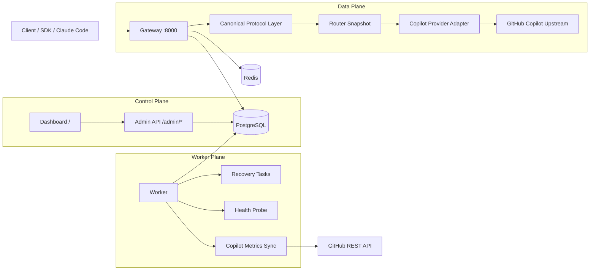
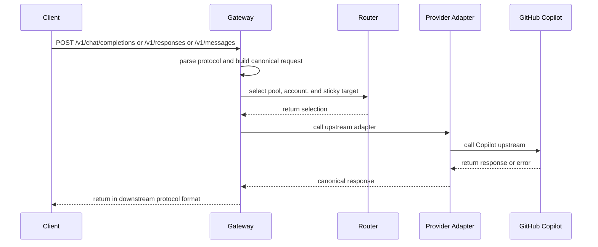
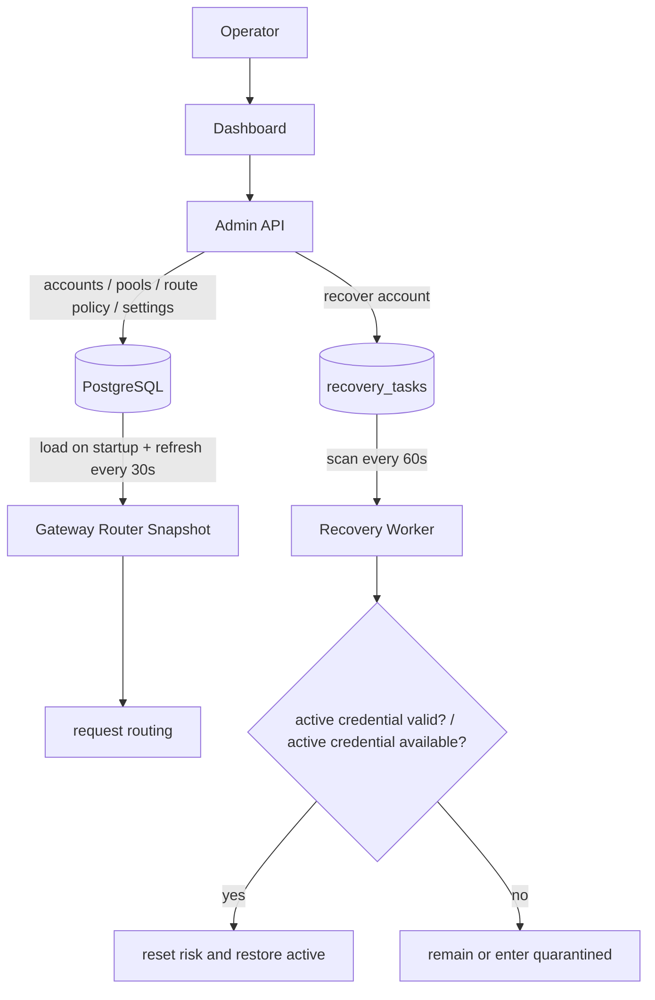
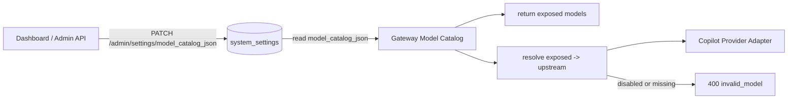
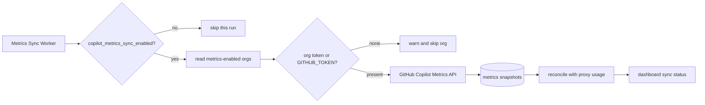
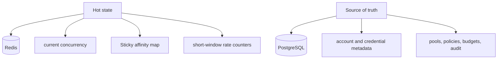

# Architecture

GHCP Pool Proxy decouples downstream model protocol endpoints from upstream Copilot account resources. Clients see OpenAI / Anthropic-compatible APIs, while the system internally coordinates canonical DTOs, router, provider adapter, and control plane for account selection, health management, budget control, and observability.

## Architecture Goals

- Expose model protocols externally, not a general GitHub CLI or SDK operation API.
- Keep the gateway stateless; put hot state in Redis and source-of-truth state in PostgreSQL.
- Routing decisions prioritize health, budget, risk, concurrency, and seat status; sticky affinity is only a soft preference.
- Account lifecycle, recovery, org/seat sync, and Copilot Metrics sync live in the control plane and worker, outside the request hot path.

## Overall Structure

## Request Path

## Config Refresh and Recovery Flow

## Model Catalog Flow

## Copilot Metrics Sync Flow

## Layer Responsibilities

### Gateway

- Receives OpenAI Chat Completions, OpenAI Responses API, and Anthropic Messages requests.
- Converts requests into a canonical request model.
- Handles authentication, global budget checks, model catalog mapping, routing, account-level budget checks, streaming proxying, and error mapping.
- Loads router snapshots at startup and periodically refreshes pools, account memberships, and route policies from PostgreSQL.
- Records traces, latency, token usage, sticky metrics, provider errors, and usage ledger entries.

### Canonical Protocol Layer

- Absorbs request-format differences across protocols.
- Normalizes tool calls, streaming events, model aliases, and response structures.
- Keeps only internal abstractions and prevents client-specific formats from leaking into the provider layer.

### Router

- Selects accounts based on protocol, model, route policy, pool state, account state, and concurrency limits.
- Supports sticky affinity, rebind, and overflow.
- Filters out inactive pools, inactive accounts, unavailable org/enterprise seats, and over-concurrency accounts.
- Sorts candidate accounts by risk, current concurrency, pool membership weight, and account priority.

### Copilot Provider Adapter

- Converts canonical requests into upstream-compatible requests.
- Hides upstream error-code differences and normalizes 401, 403, 429, 5xx, and network timeouts.
- Handles upstream access only and does not perform client protocol adaptation.

### Admin / Worker

- Admin handles accounts, credential import, pools, client profiles, settings, GitHub org sync entrypoints, audit queries, and dashboard static assets.
- Worker handles account recovery tasks, credential expiry warnings, health probes, and scheduled Copilot Metrics sync.
- Admin API requires a bearer token. Dashboard static pages are served by admin at root and call `/admin/*` with the admin token.

## Storage Boundaries

- PostgreSQL stores accounts, credential metadata, pools, policies, budgets, audit events, and recovery tasks.
- PostgreSQL also stores `system_settings`, model catalog configuration, GitHub org data, metrics snapshots, and proxy usage ledger entries.
- Redis stores concurrency counters, short-TTL affinity mappings, rate-limit counters, and distributed locks.
- Plaintext credentials are never stored; sensitive content must be encrypted and masked.

## Key Boundaries

- The data plane does not directly execute general GitHub operations.
- Routing decisions use proxy-side real-time state and do not depend on Copilot Metrics in the hot path.
- Sticky session is a soft constraint; health, budget, risk, and seat validity always take priority.
- Single-machine and clustered deployments share the same state-boundary design so the system can scale smoothly.
