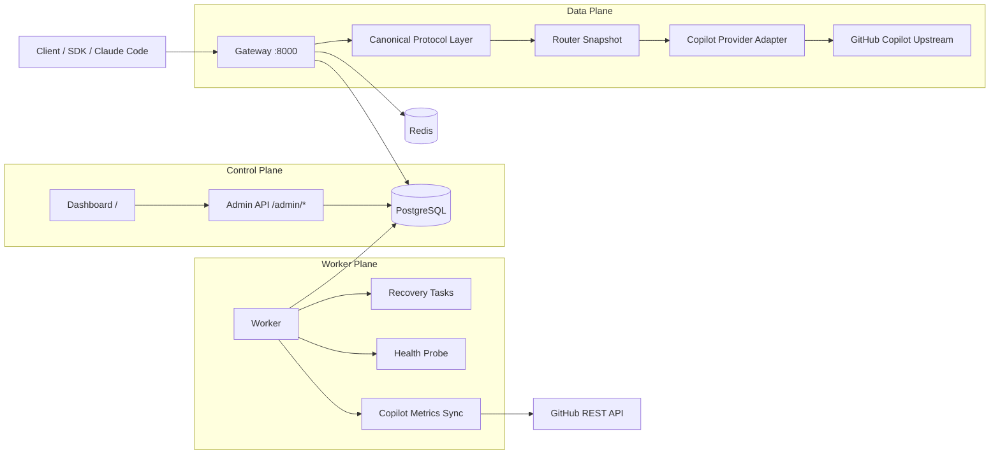
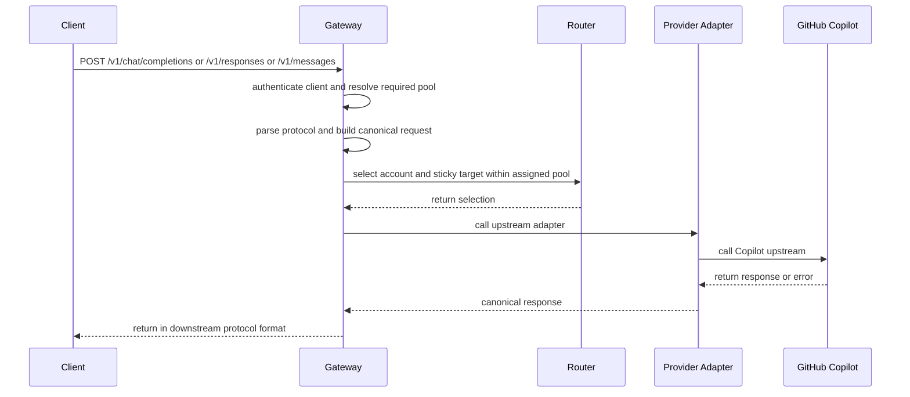
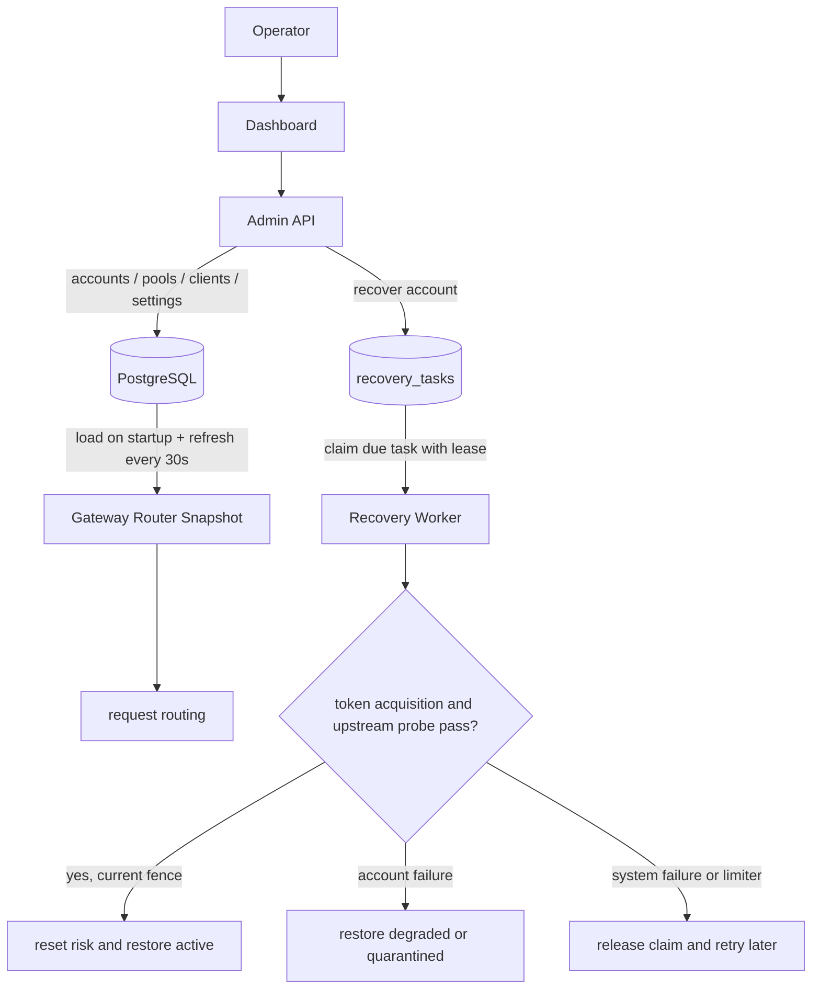
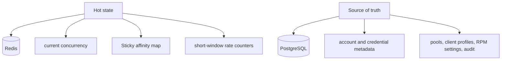

# Architecture

GHCP Pool Proxy decouples downstream model protocol endpoints from upstream Copilot account resources. Clients see OpenAI / Anthropic-compatible APIs, while the system internally coordinates canonical DTOs, router, provider adapter, and control plane for account selection, health management, rate limiting, and observability.

## Contents

- [Architecture Goals](#architecture-goals)
- [Project Scope](#project-scope)
- [Overall Structure](#overall-structure)
- [Request Path](#request-path)
- [Config Refresh and Recovery Flow](#config-refresh-and-recovery-flow)
- [Model Catalog Flow](#model-catalog-flow)
- [Copilot Metrics Sync Flow](#copilot-metrics-sync-flow)
- [Layer Responsibilities](#layer-responsibilities)
- [Storage Boundaries](#storage-boundaries)
- [Key Boundaries](#key-boundaries)

## Architecture Goals

- Expose model protocols externally, not a general GitHub CLI or SDK operation API.
- Keep the gateway stateless; put hot state in Redis and source-of-truth state in PostgreSQL.
- Routing decisions prioritize health, RPM limits, risk, concurrency, and seat status; sticky affinity is only a soft preference.
- Account lifecycle, recovery, org/seat sync, and Copilot Metrics sync live in the control plane and worker, outside the request hot path.

## Project Scope

The public surface consists of OpenAI Chat Completions, OpenAI Responses, Anthropic Messages, and model-discovery APIs. Admin provides the authenticated control plane and serves the operations dashboard; Worker owns probes, recovery, retention, and synchronization work.

GitHub Copilot is the only model provider. GitHub CLI, SDK, REST, and GraphQL access are limited to credential bootstrap and control-plane workflows, never exposed as a client operation API or invoked per model request.

## Overall Structure

```mermaid
flowchart LR
  Client["Client / SDK / Claude Code"] --> Gateway["Gateway :8000"]

  subgraph DataPlane["Data Plane"]
    Gateway --> Canonical["Canonical Protocol Layer"]
    Canonical --> Router["Router Snapshot"]
    Router --> Provider["Copilot Provider Adapter"]
    Provider --> Copilot["GitHub Copilot Upstream"]
  end

  subgraph ControlPlane["Control Plane"]
    Dashboard["Dashboard /"] --> Admin["Admin API /admin/*"]
    Admin --> Postgres[(PostgreSQL)]
  end

  subgraph WorkerPlane["Worker Plane"]
    Worker["Worker"] --> Recovery["Recovery Tasks"]
    Worker --> Probe["Health Probe"]
    Worker --> MetricsSync["Copilot Metrics Sync"]
  end

  Gateway --> Redis[(Redis)]
  Gateway --> Postgres
  Worker --> Postgres
  MetricsSync --> GitHubAPI["GitHub REST API"]
```

## Request Path

```mermaid
sequenceDiagram
  participant C as Client
  participant G as Gateway
  participant R as Router
  participant P as Provider Adapter
  participant U as GitHub Copilot

  C->>G: POST /v1/chat/completions or /v1/responses or /v1/messages
  G->>G: authenticate client and resolve required pool
  G->>G: parse protocol and build canonical request
  G->>R: select account and sticky target within assigned pool
  R-->>G: return selection
  G->>P: call upstream adapter
  P->>U: call Copilot upstream
  U-->>P: return response or error
  P-->>G: canonical response
  G-->>C: return in downstream protocol format
```

## Config Refresh and Recovery Flow

```mermaid
flowchart TD
  Operator["Operator"] --> Dashboard["Dashboard"]
  Dashboard --> Admin["Admin API"]
  Admin -->|"accounts / pools / clients / settings"| PG[(PostgreSQL)]
  PG -->|"load on startup + refresh every 30s"| Snapshot["Gateway Router Snapshot"]
  Snapshot --> Router["request routing"]

  Admin -->|"recover account"| Task[(recovery_tasks)]
  Task -->|"claim due task with lease"| Worker["Recovery Worker"]
  Worker --> Cred{"token acquisition and upstream probe pass?"}
  Cred -->|"yes, current fence"| Active["reset risk and restore active"]
  Cred -->|"account failure"| Quarantined["restore degraded or quarantined"]
  Cred -->|"system failure or limiter"| Retry["release claim and retry later"]
```

Token acquisition alone does not re-admit a degraded account. Probe scheduling, recovery states, and operator actions are owned by [operations](operations.en.md#account-onboarding-grouping-and-offboarding); routing eligibility is owned by [routing](routing.en.md#candidate-filtering).

## Model Catalog Flow

Admin imports Copilot model metadata into the global catalog; Gateway resolves exposed names to upstream IDs/APIs. Catalog visibility is separate from per-account entitlement. [Operations](operations.en.md#model-id-mapping-aliases-and-hidden-models) owns refresh/edit procedures; [protocol](protocol.en.md#upstream-api-selection) owns inference and conversion rules.

## Copilot Metrics Sync Flow

Admin and the scheduler enqueue durable synchronization requests. Worker claims them with leases and fencing before persisting GitHub metrics or seat snapshots. This is an asynchronous control-plane workflow, never a request-routing dependency; operational timing and failure handling are in [operations](operations.en.md#usage-and-cache-observability).

## Layer Responsibilities

### Gateway

- Receives OpenAI Chat Completions, OpenAI Responses API, and Anthropic Messages requests.
- Converts requests into a canonical request model.
- Handles authentication, model catalog mapping, routing, atomic global/account RPM admission, streaming proxying, and error mapping.
- Loads router snapshots at startup and periodically refreshes pools, account memberships, and active bindings from PostgreSQL.
- Records traces, latency, token usage, sticky metrics, provider errors, and usage ledger entries.

### Canonical Protocol Layer

- Absorbs request-format differences across protocols.
- Normalizes tool calls, streaming events, model aliases, and response structures.
- Keeps only internal abstractions and prevents client-specific formats from leaking into the provider layer.

### Router

- Uses the authenticated client profile's required pool and selects an eligible account within that pool.
- Supports sticky affinity, rebind, and overflow.
- Filters out inactive pools, inactive accounts, unavailable org/enterprise seats, and over-concurrency accounts.
- For `require_fresh` profiles, also filters accounts without current complete evidence for the resolved upstream model and API.
- Sorts candidate accounts by risk, current concurrency, pool membership weight, and account priority.

### Copilot Provider Adapter

- Converts canonical requests into upstream-compatible requests.
- Hides upstream error-code differences and normalizes 401, 403, 429, 5xx, and network timeouts.
- Handles upstream access only and does not perform client protocol adaptation.

### Upstream Authentication Profiles

- Upstream authentication profiles are credential metadata and are independent of downstream client profiles. Codex still enters through Responses and Claude Code still enters through Messages; neither client selects or overrides the upstream identity.
- The encrypted credential payload carries `auth_profile` and `token_mode`. Legacy payloads default to the VS Code identity, using Copilot exchange when a GitHub OAuth token is present and static bearer mode otherwise.
- The `vscode` profile exchanges the GitHub OAuth token for a short-lived Copilot bearer and sends the fixed VS Code/Copilot Chat identity. The `opencode` profile uses its GitHub OAuth token directly and sends the fixed OpenCode identity.
- Gateway and Worker carry the resolved profile with the existing cached token and credential generation. Normal requests add no profile lookup, probe, retry, or network call; unknown profile or mode values fail closed.
- A direct-OAuth `401` expires the rejected generation under an account lock and broadcasts credential-cache invalidation. The generation comparison protects a newer credential, while expiring all older active credentials prevents silent fallback to a previous VS Code identity.

### Admin / Worker

- Admin handles accounts, credential import, pools, client profiles, settings, GitHub org sync request entrypoints, audit queries, and dashboard static assets.
- Worker handles account recovery tasks, credential expiry warnings, health probes, and claimed metrics/seat synchronization. A dedicated Kubernetes Worker role receives the GitHub sync token file.
- Admin API requires a bearer token. Dashboard static pages are served by admin at root and call `/admin/*` with the admin token.

## Storage Boundaries

```mermaid
flowchart TD
  Hot["Hot state"] --> Redis[(Redis)]
  Cold["Source of truth"] --> Postgres[(PostgreSQL)]
  Hot --> Concurrency["current concurrency"]
  Hot --> Affinity["Sticky affinity map"]
  Hot --> RateLimit["short-window rate counters"]
  Cold --> Accounts["account and credential metadata"]
  Cold --> Policies["pools, client profiles, RPM settings, audit"]
```

- PostgreSQL stores accounts, credential metadata and versions, pools, client profiles, durable bindings, provider attempts, RPM settings, audit events, recovery tasks, organization-sync requests, and usage ledger/rollup entries.
- PostgreSQL also stores `system_settings`, model catalog configuration, GitHub org data, metrics snapshots, and the durable Redis coordination epoch.
- Redis protocol v2 stores concurrency leases, short-TTL affinity and binding mappings, RPM and probe rate-limit counters, distributed locks, invalidation events, and the active coordination manifest.
- Gateway may lose its local Router snapshot, ordering counters, token cache, or bounded usage materialization queue without losing source-of-truth or cross-instance coordination state.
- Plaintext credentials are never stored; sensitive content must be encrypted and masked.
- Credential payloads use AES-256-GCM under the deployment master key. Client authentication uses key hashes; any revealable secret material is encrypted. Sticky/prompt-prefix inputs are stored only as hashes; bodies and credentials do not belong in logs.

## Key Boundaries

- The data plane does not directly execute general GitHub operations.
- Admin uses a configured bearer token, not JWT/OIDC/enterprise SSO. Control-plane writes and secret reveal require audit persistence. General policy engines, multi-region routing and tenant BI remain outside scope.
- Routing decisions use proxy-side real-time state and do not depend on Copilot Metrics in the hot path.
- Sticky session is a soft constraint; health, RPM limits, risk, and seat validity always take priority.
- The runtime package supports single-machine Docker Compose plus a cluster entry point. Kubernetes provides single-replica production, dual-Gateway staging, and an explicitly disposable `test` overlay with in-cluster PostgreSQL/Redis. The Azure Bicep guide is limited to VNet/subnets, AKS, PostgreSQL, and Managed Redis; it is not a complete multi-replica production platform with ingress, monitoring, backup, evidence inventory, or destroy automation.
- A release manifest binds one public app version, Git SHA, four runtime-role digests, and the migration schema. Compatibility evidence uses that app version; both VM and Kubernetes deploy the manifest digests directly.
- The model catalog is global; `require_fresh` profiles additionally enforce account-specific model/API evidence from the immutable request snapshot, while `allow_unknown` profiles retain compatibility behavior.
