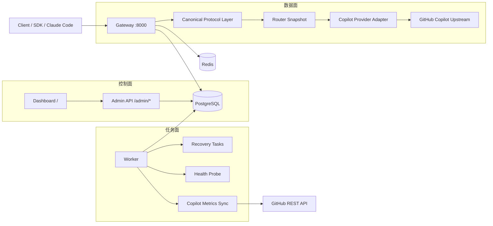
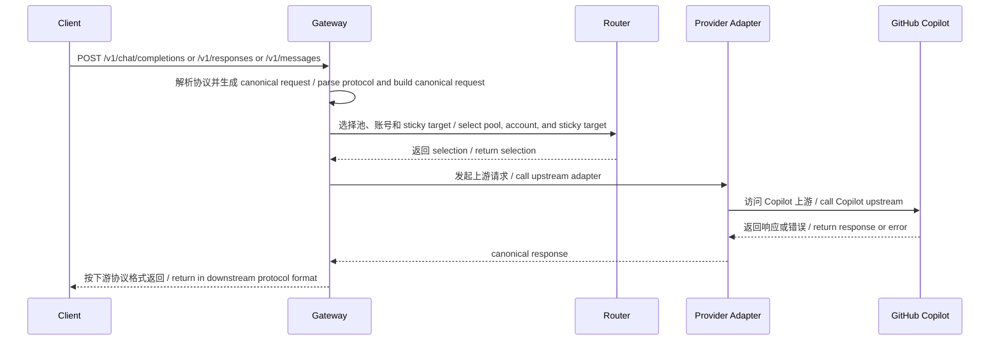
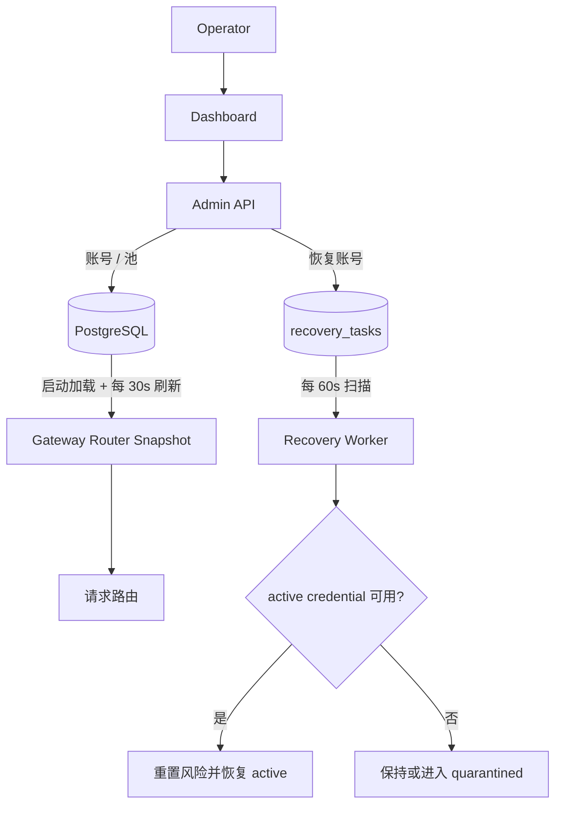
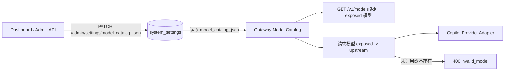
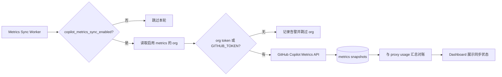
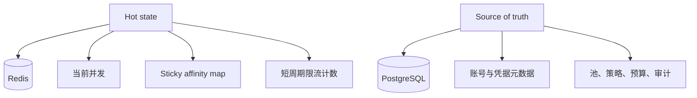

# 架构设计

GHCP Pool Proxy 的核心目标是把下游模型协议入口和上游 Copilot 账号资源解耦。客户端只看到 OpenAI / Anthropic 兼容接口，内部通过 canonical DTO、router、provider adapter 和 control plane 协同完成账号选择、健康管理、预算控制和可观测治理。

## 架构目标

- 对外暴露模型协议，不暴露通用 GitHub CLI 或 SDK 操作 API。
- Gateway 保持无状态，热状态进入 Redis，冷状态进入 PostgreSQL。
- 路由决策优先考虑健康、预算、风险、并发和 seat 状态，sticky 亲和只是软优先级。
- 账号生命周期、恢复、org/seat 同步和 Copilot Metrics 同步放在控制面和 worker，避免进入请求热路径。

## 总体结构

## 请求路径

## 配置刷新与恢复链路

## 模型目录链路

## Copilot Metrics 同步链路

## 分层职责

### Gateway

- 接收 OpenAI Chat Completions、OpenAI Responses API 和 Anthropic Messages 请求。
- 统一转换成 canonical request。
- 执行认证、全局预算检查、模型目录映射、路由、账号级预算检查、流式转发和错误回写。
- 启动时加载 router 快照，并定期从 PostgreSQL 刷新 pool、账号关系和 route policy。
- 记录 trace、latency、token、sticky、provider error 和 usage ledger。

### Canonical 协议层

- 吸收不同协议的请求格式差异。
- 统一工具调用、流式事件、模型别名和响应结构。
- 只保留内部需要的抽象，不把客户端格式泄漏到 provider 层。

### 路由器

- 依据协议、模型、route policy、池状态、账号状态和并发上限选定账号。
- 支持 sticky 亲和、重绑定和 overflow。
- 路由时剔除非 active pool、非 active 账号、不可用 org/enterprise seat 和超并发账号。
- 候选账号按风险、当前并发、pool membership weight 和账号 priority 排序。

### Copilot Provider 适配层

- 负责把 canonical request 转换成上游可接受的请求。
- 屏蔽上游错误码差异，标准化 401、403、429、5xx 和网络超时。
- 只处理上游接入，不承担客户端协议适配。

### 控制面与任务面

- Admin 负责账号、凭据导入、池、客户端 profile、settings、GitHub org 同步入口、审计查询和 Dashboard 静态资源服务。
- Worker 负责账号恢复任务、凭据过期提醒、健康探针和 Copilot Metrics 定时同步。
- Admin API 需要 bearer token；Dashboard 静态页面由 admin 根路径服务，页面内调用 `/admin/*` 时附带管理员 token。

## 存储分工

- PostgreSQL 保存账号、凭据元数据、池、策略、预算、审计和恢复任务。
- PostgreSQL 还保存 `system_settings`、模型目录配置、GitHub org 信息、metrics snapshots 和 proxy usage ledger。
- Redis 保存并发计数、短 TTL 亲和关系、限流计数和分布式锁。
- 凭据明文不入库，敏感内容必须经过加密和脱敏流程。

## 关键边界

- 数据面不直接执行通用 GitHub 操作。
- 路由决策使用代理侧实时状态，不依赖 Copilot Metrics 做热路径判断。
- sticky session 是软约束，健康、预算、风险和 seat 有效性始终优先。
- 单机部署和集群部署共享同一套状态边界设计，便于平滑扩展。
