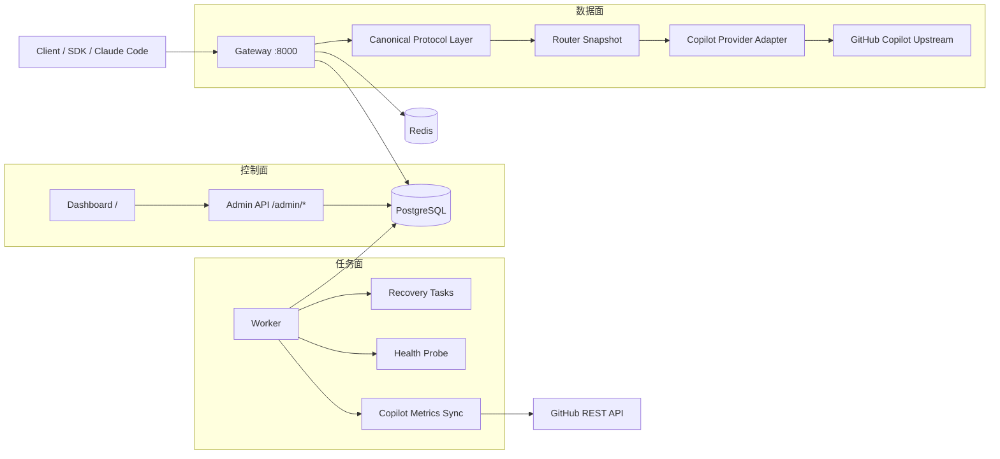
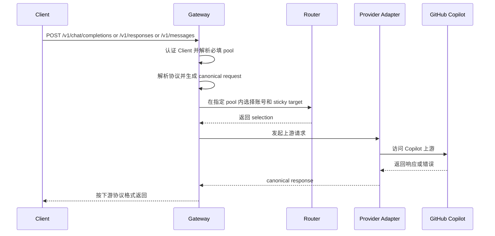
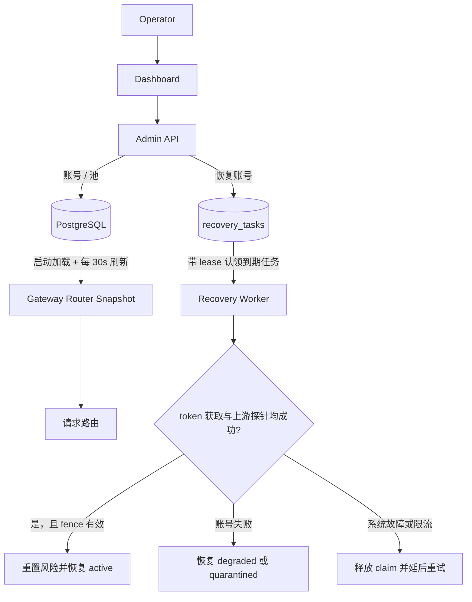
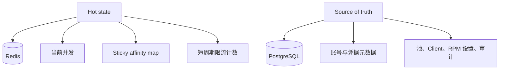

# 架构设计

GHCP Pool Proxy 的核心目标是把下游模型协议入口和上游 Copilot 账号资源解耦。客户端只看到 OpenAI / Anthropic 兼容接口，内部通过 canonical DTO、router、provider adapter 和 control plane 协同完成账号选择、健康管理、限流和可观测治理。

## 目录

- [架构目标](#架构目标)
- [项目范围](#项目范围)
- [总体结构](#总体结构)
- [请求路径](#请求路径)
- [配置刷新与恢复链路](#配置刷新与恢复链路)
- [模型目录链路](#模型目录链路)
- [Copilot Metrics 同步链路](#copilot-metrics-同步链路)
- [分层职责](#分层职责)
- [存储分工](#存储分工)
- [关键边界](#关键边界)

## 架构目标

- 对外暴露模型协议，不暴露通用 GitHub CLI 或 SDK 操作 API。
- Gateway 保持无状态，热状态进入 Redis，冷状态进入 PostgreSQL。
- 路由决策优先考虑健康、RPM 限流、风险、并发和 seat 状态，sticky 亲和只是软优先级。
- 账号生命周期、恢复、org/seat 同步和 Copilot Metrics 同步放在控制面和 worker，避免进入请求热路径。

## 项目范围

对外接口包括 OpenAI Chat Completions、OpenAI Responses、Anthropic Messages 和模型发现。Admin 提供需认证的控制面并服务运维 Dashboard；Worker 负责探针、恢复、retention 与同步任务。

唯一模型上游是 GitHub Copilot。GitHub CLI、SDK、REST 与 GraphQL 只用于凭据初始化和控制面流程，不会作为客户端操作 API 暴露，也不会在每次模型请求中执行。

## 总体结构

```mermaid
flowchart LR
  Client["Client / SDK / Claude Code"] --> Gateway["Gateway :8000"]

  subgraph DataPlane["数据面"]
    Gateway --> Canonical["Canonical Protocol Layer"]
    Canonical --> Router["Router Snapshot"]
    Router --> Provider["Copilot Provider Adapter"]
    Provider --> Copilot["GitHub Copilot Upstream"]
  end

  subgraph ControlPlane["控制面"]
    Dashboard["Dashboard /"] --> Admin["Admin API /admin/*"]
    Admin --> Postgres[(PostgreSQL)]
  end

  subgraph WorkerPlane["任务面"]
    Worker["Worker"] --> Recovery["Recovery Tasks"]
    Worker --> Probe["Health Probe"]
    Worker --> MetricsSync["Copilot Metrics Sync"]
  end

  Gateway --> Redis[(Redis)]
  Gateway --> Postgres
  Worker --> Postgres
  MetricsSync --> GitHubAPI["GitHub REST API"]
```

## 请求路径

```mermaid
sequenceDiagram
  participant C as Client
  participant G as Gateway
  participant R as Router
  participant P as Provider Adapter
  participant U as GitHub Copilot

  C->>G: POST /v1/chat/completions or /v1/responses or /v1/messages
  G->>G: 认证 Client 并解析必填 pool
  G->>G: 解析协议并生成 canonical request
  G->>R: 在指定 pool 内选择账号和 sticky target
  R-->>G: 返回 selection
  G->>P: 发起上游请求
  P->>U: 访问 Copilot 上游
  U-->>P: 返回响应或错误
  P-->>G: canonical response
  G-->>C: 按下游协议格式返回
```

## 配置刷新与恢复链路

```mermaid
flowchart TD
  Operator["Operator"] --> Dashboard["Dashboard"]
  Dashboard --> Admin["Admin API"]
  Admin -->|"账号 / 池"| PG[(PostgreSQL)]
  PG -->|"启动加载 + 每 30s 刷新"| Snapshot["Gateway Router Snapshot"]
  Snapshot --> Router["请求路由"]

  Admin -->|"恢复账号"| Task[(recovery_tasks)]
  Task -->|"带 lease 认领到期任务"| Worker["Recovery Worker"]
  Worker --> Cred{"token 获取与上游探针均成功?"}
  Cred -->|"是，且 fence 有效"| Active["重置风险并恢复 active"]
  Cred -->|"账号失败"| Quarantined["恢复 degraded 或 quarantined"]
  Cred -->|"系统故障或限流"| Retry["释放 claim 并延后重试"]
```

仅获取 token 不会让 degraded 账号重新入池。探针调度、恢复状态与操作步骤由[运维](operations.zh.md#1-账号上线分组与下线)维护，路由资格由[路由规则](routing.zh.md#候选账号过滤)维护。

## 模型目录链路

Admin 将 Copilot 模型元数据导入全局目录，Gateway 将 exposed 名称解析为 upstream ID/API。目录可见性与逐账号 entitlement 分离；刷新/编辑步骤由[运维](operations.zh.md#2-模型-id-映射别名与隐藏模型)维护，推断与转换规则由[协议](protocol.zh.md#上游-api-选择)维护。

## Copilot Metrics 同步链路

Admin 与调度器写入持久同步请求，Worker 使用 lease/fence 认领后保存 GitHub metrics 或 seat snapshot。这是异步控制面流程，不作为请求路由依赖；调度与故障处理详见[运维](operations.zh.md#用量与-cache-观测)。

## 分层职责

### Gateway

- 接收 OpenAI Chat Completions、OpenAI Responses API 和 Anthropic Messages 请求。
- 统一转换成 canonical request。
- 执行认证、模型目录映射、路由、全局及账号级 RPM 原子准入、流式转发和错误回写。
- 启动时加载 router 快照，并定期从 PostgreSQL 刷新 pool、账号关系和 active binding。
- 记录 trace、latency、token、sticky、provider error 和 usage ledger。

### Canonical 协议层

- 吸收不同协议的请求格式差异。
- 统一工具调用、流式事件、模型别名和响应结构。
- 只保留内部需要的抽象，不把客户端格式泄漏到 provider 层。

### 路由器

- 使用认证后 client profile 的必填 pool，并只在该 pool 内选择可用账号。
- 支持 sticky 亲和、重绑定和 overflow。
- 路由时剔除非 active pool、非 active 账号、不可用 org/enterprise seat 和超并发账号。
- 对 `require_fresh` profile，还会剔除没有解析后 upstream model/API 的当前完整证据的账号。
- 候选账号按风险、当前并发、pool membership weight 和账号 priority 排序。

### Copilot Provider 适配层

- 负责把 canonical request 转换成上游可接受的请求。
- 屏蔽上游错误码差异，标准化 401、403、429、5xx 和网络超时。
- 只处理上游接入，不承担客户端协议适配。

### 上游认证 Profile

- 上游认证 profile 是凭据元数据，与下游 client profile 完全分离。Codex 仍走 Responses，Claude Code 仍走 Messages；二者都不能选择或覆盖上游身份。
- 加密 credential payload 保存 `auth_profile` 和 `token_mode`。旧 payload 默认使用 VS Code 身份：存在 GitHub OAuth token 时采用 Copilot exchange，否则采用 static bearer。
- `vscode` profile 会把 GitHub OAuth token 兑换为短期 Copilot bearer，并发送固定 VS Code/Copilot Chat 身份；`opencode` profile 直接使用 GitHub OAuth token，并发送固定 OpenCode 身份。
- Gateway 与 Worker 让解析后的 profile 随现有 token cache 和 credential generation 一起流转。正常请求不增加 profile 查询、探测、重试或网络调用；未知 profile 或 mode 会 fail closed。
- direct OAuth 收到 `401` 后，在账号锁内按 generation 失效并广播 credential cache invalidation。generation 比较保护较新的凭据，同时使更早的 active credential 一并过期，避免静默回退到旧 VS Code 身份。

### 控制面与任务面

- Admin 负责账号、凭据导入、池、客户端 profile、settings、GitHub org 同步入口、审计查询和 Dashboard 静态资源服务。
- Worker 负责账号恢复任务、凭据过期提醒、健康探针和 Copilot Metrics 定时同步。
- Admin API 需要 bearer token；Dashboard 静态页面由 admin 根路径服务，页面内调用 `/admin/*` 时附带管理员 token。

## 存储分工

```mermaid
flowchart TD
  Hot["Hot state"] --> Redis[(Redis)]
  Cold["Source of truth"] --> Postgres[(PostgreSQL)]
  Hot --> Concurrency["当前并发"]
  Hot --> Affinity["Sticky affinity map"]
  Hot --> RateLimit["短周期限流计数"]
  Cold --> Accounts["账号与凭据元数据"]
  Cold --> Policies["池、Client、RPM 设置、审计"]
```

- PostgreSQL 保存账号、凭据元数据与版本、池、Client、持久 binding、provider attempt、RPM 设置、审计、恢复任务、组织同步请求和 usage ledger/rollup。
- PostgreSQL 还保存 `system_settings`、模型目录配置、GitHub org 信息、metrics snapshots 与持久 Redis coordination epoch。
- Redis protocol v2 保存并发 lease、短 TTL affinity/binding、RPM 和 probe 限流计数、分布式锁、失效事件和 active coordination manifest。
- Gateway 的本地 Router 快照、排序计数、token cache 或有界 usage materialization 队列可以丢失，不会丢失事实源或跨实例协调状态。
- 凭据明文不入库，敏感内容必须经过加密和脱敏流程。

## 关键边界

- Admin 使用配置的 bearer token，不提供 JWT/OIDC/企业 SSO；控制面写操作与 Secret 展示需要持久审计。通用策略引擎、多区域路由和租户 BI 仍不在范围内。
- Credential payload 使用部署 master key 下的 AES-256-GCM 加密；Client 鉴权使用 key 哈希，可再次展示的 Secret 材料加密保存。Sticky/prompt-prefix 输入仅存哈希，不在日志中保存正文或凭据。
- 数据面不直接执行通用 GitHub 操作。
- 路由决策使用代理侧实时状态，不依赖 Copilot Metrics 做热路径判断。
- sticky session 是软约束，健康、RPM 限流、风险和 seat 有效性始终优先。
- 运行包同时支持单机 Docker Compose 与集群部署入口。Kubernetes 提供单副本 production、双 Gateway staging，以及包含集群内 PostgreSQL/Redis 的明确一次性 `test` overlay。Azure Bicep 向导仅覆盖 VNet/subnet、AKS、PostgreSQL 和 Managed Redis，不是包含 Ingress、监控、备份、evidence inventory 或 destroy 自动化的完整多副本生产平台。
- release manifest 将公开 app version、Git SHA、四个 runtime role digest 与 migration schema 绑定；兼容 evidence 使用该 app version，VM 与 Kubernetes 都直接部署 manifest digest。
- 模型目录是全局配置；`require_fresh` profile 会使用不可变请求快照中的账号模型/API 证据过滤候选，`allow_unknown` profile 保持兼容行为。
