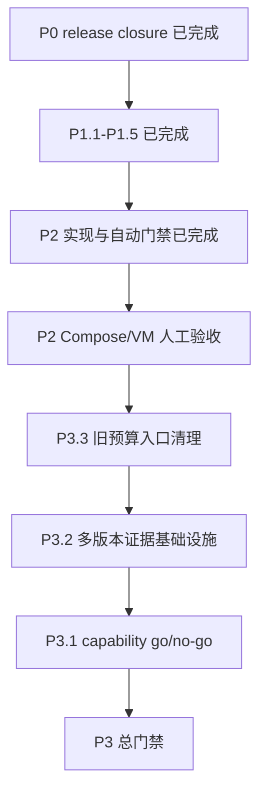

# GHCP Pool Proxy Phase 7 兼容性开发计划

> 归档说明：本文保留当时的实施记录、日期和结论，不作为当前运行时或发布状态的事实源。当前边界见[兼容性路线图](../plans/compatibility-roadmap.zh.md)，静态合同见[兼容矩阵](../../compatibility/README.zh.md)。

> 状态：P2、P3 与 `phase7c-2026-08-18.1` release closure 已完成
>
> 事实快照：2026-08-18
>
> 源码身份：`phase7c-2026-08-18.1` freeze SHA 为 `f903c45220c486f959414574d5a30cdba93467b3`；最终 release identity 以外置 manifest 与 attestation 为准
>
> 当前候选：matrix `phase7c-2026-08-18.1`、build `2026.08.18.1`、schema 19
>
> 最近完成：Codex `.3` release closure；freeze SHA `a0f75fdce0e1770da041c0fd2a3400b2799c97c3`
>
> 最近完成：P1.1 usage ledger durable materialization/rebuild，未发布 schema 19 合同更新
>
> 最终确认：P1.1 于 2026-08-16 通过 disposable PostgreSQL 16 验收与 `make validate`
>
> 最近规划：P1.2-P1.5 已拆分为可独立验收的实现切片；Claude evidence 必须按 matrix entry 隔离
>
> 最近完成：P1.2 Redis ambiguous concurrency lease 的 read-after-write/reconciliation
>
> 最近完成：P1.3 Dashboard 异步正确性
>
> 最近完成：P1.4 兼容性观测与 beta decision
>
> 最近完成：P1.5.4 静态 Claude candidate 冻结
>
> 最近完成：P1.5.5 immutable release evidence 闭环；P1 全部完成
>
> 最近完成：P2.1.1 九格测试注册表；3 条 native 和 6 条 shim path 已由 test-only registry 锁定
>
> 最近完成：P2.1.2 九格文本/lifecycle/error/cancel；每格已锁定 canonical route、下游 wire、usage、正常/异常终态和交付取消
>
> 最近完成：P2.1 完整 3x3 协议合同；11 个顶层矩阵测试通过
>
> 最近完成：P2.2.1 versioned Responses typed union；parser、validator 与 writer 共用 contract discriminator，P2.1 wire baseline 保持不变
>
> 最近完成：P2.2.2 的 Chat parser、downstream writer、Provider request builder 与非流式 response owner 抽取
>
> 最近完成：P2.3.1 Admin API client 与读取路径收口；Dashboard 16 tests/build 通过
>
> 当前诊断：P2、P3.3、P3.2 和 P3.1 已完成实现；Claude Code `2.1.225`/`2.1.226`/`2.1.233` 在 resume 时改为 `claude-opus-5`，与唯一 Sonnet runtime contract 冲突，均保持 `unsupported`
>
> 最近完成：Phase 7C 四角色 immutable release manifest、schema 6 fixed-CLI report、schema 2 attestation 与 release parity 已闭环
>
> 下一最小步骤：仅在新版本、matrix/schema/build 或明确批准的新 capability 出现时，建立独立 release 任务；可选目标环境 Copilot 检查不阻断本次 closure

本文是 Phase 7 的当前执行入口。它只保留仍然有效的架构决策、代码事实、发布门禁和后续任务，不再把历史审计过程与当前 backlog 混写。

事实优先级如下：

1. [migrations](../../migrations/) 决定已部署 schema；当前为 schema 19。
2. 当前代码和可复现测试决定已实现行为。
3. [compatibility/matrix.json](../../compatibility/matrix.json) 决定静态客户端合同和最高候选等级。
4. 非提交的 release evidence attestation 决定某个不可变 release 的 effective level。
5. [架构文档](../architecture.zh.md)、[兼容性说明](../../compatibility/README.zh.md) 和本文决定产品边界与后续顺序。
6. [人工验证](../runbooks/manual-validation.zh.md) 记录真实 Copilot 账号、凭据、Provider probe 和 deployed-Gateway 的可选人工验证。

## 1. 当前结论

- Phase 7A 的协议正确性、安全边界、能力采集和运行时 entitlement 已按冻结合同完成。
- Codex `0.147.0 + gpt-5.5 + Responses` 的静态等级为 `candidate_native`；`.3` 的外置 attestation 已为 freeze SHA `a0f75fdce0e1770da041c0fd2a3400b2799c97c3` 派生 `verified_native`。
- 历史 `.4` matrix 中 Claude Code `2.1.226 + claude-sonnet-4-20250514 + Messages` 曾为 `candidate_native`，其外置 schema 2 attestation 只对该不可变 release 派生 `verified_native`；当前 P3 schema 3 matrix 因 resume 模型漂移将 Claude 三档全部标为 `unsupported`。
- 当前自动发布门禁要求 clean fixed-CLI report、不可变 release manifest 和 schema 2 attestation。`phase7c-2026-08-18.1` 已满足该门禁；真实 Copilot 环境报告仍是可选人工证据，不阻断本次 release。
- 静态 matrix、版本控制中的源码和外置 release artifact 是不同层级的事实源；`release-manifest.env` 的历史 rehearsal 不得作为后续 `.3` release 输入。
- usage ledger、Redis concurrency lease、Dashboard 异步正确性、兼容性观测、P2 结构收口、P3 证据基础设施及 `phase7c-2026-08-18.1` release closure 均已完成。后续不再存在本计划内的必需实现或发布 gate。
- `.4` 四角色 release set 已推送并通过自动 release gate；runtime bundle/GitHub publish 与真实 Copilot environment 检查未执行，不得据此声明目标环境已部署。此前 `.3` manifest/report/attestation 仅是历史 rehearsal，不能作为 `.4` 或后续 release 的 evidence。

## 2. 范围与冻结边界

### 2.1 保持不变的架构边界

- 唯一模型上游仍为 GitHub Copilot。
- Gateway 继续通过 typed canonical DTO 隔离客户端协议和 Provider，不引入任意 raw body 或任意 header 透传。
- Claude Code 正式路径固定为 Messages 到 Copilot Messages。
- Codex 正式路径固定为 Responses 到 Copilot Responses。
- 跨协议路径只能标记为降级转换，不能成为正式客户端的 native 验收依据。
- 能力发现、CLI 验证、账号能力探测和兼容等级判定不得进入 Gateway 请求热路径。
- Router 不跨 pool fallback；模型请求发送后不得透明换账号重放。
- cache affinity 是软偏好，健康、预算、风险、并发、seat 和 model entitlement 始终优先。
- `require_fresh` 只读取请求开始时的不可变 capability snapshot；请求中途不重新探测或因证据过期而截断已接纳流量。

### 2.2 冻结的协议决策

| 主题 | 当前合同 |
| --- | --- |
| Responses 终态 | 只有 `response.completed` 或 `response.incomplete` 形成完整终态；item/content/reasoning done 和 `[DONE]` 都不是成功证据。 |
| Messages 终态 | 必须出现合法 `message_stop`；EOF、`[DONE]` 或只有 `message_delta` 均失败。 |
| Chat 终态 | 必须有 `[DONE]` 或已验证的非空最终 `finish_reason`。 |
| 未知语义 | 未知顶层字段、item、block、event、nested union 或不可投影语义 fail closed，并返回方向和路径。 |
| 原生保真 | 固定客户端使用的 wire shape 必须 typed 表达；不使用 raw frame 透传来绕过 canonical contract。 |
| Usage | 区分 `missing`、`upstream`、`estimated`；缺失时客户端不输出伪造零对象，预算 reservation 保守 retained。 |
| 下游交付 | writer failure、取消、终态冲突和交付不确定记录为 `outcome_unknown`，不得记 durable success。 |
| 模型目录 | Codex 只发布 matrix 允许的 `gpt-5.5 -> gpt-5.5 / responses`；Claude Code 目录在候选合同完成前保持为空。 |
| Utility | `count_tokens`、`compact` 和 WebSocket 在没有 Copilot 原生证据时保持不支持，不做近似模拟。 |

### 2.3 Release evidence 政策

- 静态 matrix 不直接声明 `verified_native`。
- `candidate_native` 只有绑定 clean schema 5 `cli_end_to_end` report、同一 Git SHA 的四角色 release manifest、schema 19 和 schema 2 attestation 后，才能为该不可变 release 派生 `verified_native`。
- `COMPAT_ENVIRONMENT_REPORT` 是可选输入；主动提供时仍必须通过 build、Git SHA、schema、时间和摘要校验。
- 未执行真实 Copilot 人工检查时，应明确记录“可选人工检查未执行”，但不得重新把它提升为当前 release 阻断。
- fixed CLI、matrix revision、Gateway build 或 schema 任一变化都需要新的 report 和 attestation，旧证据不得继承。

## 3. 当前开发进度

### 3.1 阶段总览

| 阶段 | 状态 | 当前事实 |
| --- | --- | --- |
| Phase 7A 协议与安全基线 | 已完成 | 严格终态、未知语义拒绝、writer error、usage source、配置 fail-closed、Secret 最小化和 raw payload 脱敏已有代码与测试。 |
| Phase 7A release closure | 已完成 | Codex `.3` 历史 release 与 `phase7c-2026-08-18.1` 均已绑定 clean report、四角色 release manifest、schema 2 attestation 并通过最终 release gate；后续 release 必须独立重复该流程。 |
| Phase 7B 模型发现与 entitlement | 已完成 | Codex 目录、schema 19 能力快照、Worker 采集、Admin/Dashboard capability 视图、Router/binding `require_fresh` 已落地。 |
| Phase 7B 可靠性与观测 | 已完成 | P1.1 durable materialization/rebuild、P1.2 Redis ambiguous lease reconciliation、P1.3 Dashboard async correctness、P1.4 compatibility observability 与 P1.5 Claude Code native candidate/evidence 均已完成。 |
| Phase 7B 协议覆盖与结构收口 | 已完成 | 完整 3x3 合同、协议状态机/attempt coordinator、Dashboard API client 和 legacy shell migration body 清理均已完成；P2.4 Compose/VM 人工验收已由用户确认通过。 |
| Phase 7C 证据驱动能力与精简 | 已完成 | P3.3 已删除旧预算入口；P3.2 已实现多版本 provenance；P3.1 以 no-go 保持 utility、WebSocket 和高级 typed item 关闭；`phase7c-2026-08-18.1` 已完成 release evidence。 |

### 3.2 已完成的实现

| 能力 | 状态与边界 | 主要代码锚点 |
| --- | --- | --- |
| 严格 JSON/SSE 终态 | 按 Codex 0.147.0、Claude Code 2.1.226 和当前 typed contract 完成；异常 EOF 不合成成功。 | [internal/provider/copilot/provider.go](../../internal/provider/copilot/provider.go)、[internal/provider/copilot/anthropic_messages.go](../../internal/provider/copilot/anthropic_messages.go) |
| 请求、响应和流语义验证 | 三层 validator 覆盖三条 native path 和六个 shim 方向；不可表达语义在 dispatch 或写出前失败。 | [internal/protocol/validation.go](../../internal/protocol/validation.go)、[internal/protocol/validation_test.go](../../internal/protocol/validation_test.go) |
| Usage presence/source | canonical、Provider、attempt、ledger 和预算结算可区分 `missing/upstream/estimated`。 | [internal/protocol/canonical.go](../../internal/protocol/canonical.go)、[internal/api/gateway/server.go](../../internal/api/gateway/server.go) |
| 下游交付 P0 | JSON/SSE writer error 可传播；交付不确定不记录成功。此项不等于 usage ledger 已具备崩溃后零丢失。 | [internal/api/gateway/server.go](../../internal/api/gateway/server.go)、[internal/protocol/stream.go](../../internal/protocol/stream.go) |
| Usage durable materialization | `FinalizeProviderAttempt` 与 attempt-backed outbox 同一事务提交；writer 对 attempt 只触发 materializer，usage-rollup 先 recover 再 rollup/prune。expired lease 可重领，重复/既有异常 ledger 显式 `conflict`。 | [internal/store/postgres/usage_materialization.go](../../internal/store/postgres/usage_materialization.go)、[internal/workers/usage_rollup.go](../../internal/workers/usage_rollup.go)、[internal/api/admin/server.go](../../internal/api/admin/server.go) |
| Redis ambiguous concurrency lease | account/global/probe reserve 具有 typed outcome、同一 owner 的一次 read-after-write、owner-safe refresh/release 和 protocol-v2 probe 专用释放；unresolved outcome 在 Gateway dispatch 前 fail closed。正常路径每种 reservation 只进入一次 reserve script。 | [internal/store/redis/store.go](../../internal/store/redis/store.go)、[internal/store/redis/cluster_integration_test.go](../../internal/store/redis/cluster_integration_test.go)、[internal/api/gateway/server.go](../../internal/api/gateway/server.go) |
| Dashboard async correctness | usage summary/by-client 在同一 request generation 原子提交；events 与 Copilot model refresh 都使用 latest-request fencing。旧 success/error/abort 不会覆盖当前状态或清理新 loading，模型账号切换会取消旧 refresh。 | [web/dashboard/src/async-request.ts](../../web/dashboard/src/async-request.ts)、[web/dashboard/src/App.tsx](../../web/dashboard/src/App.tsx) |
| Compatibility observability | matrix 在 Gateway/Admin 启动期构建 immutable snapshot；Gateway 以闭合 enums 记录 accepted/rejected/downgrade、capability、permission、terminal/EOF/writer 决策；Admin/Dashboard 只展示安全静态 matrix 和 `unattested`/`missing` evidence 状态。 | [internal/compatibility/observation.go](../../internal/compatibility/observation.go)、[internal/compatibility/runtime_snapshot.go](../../internal/compatibility/runtime_snapshot.go)、[internal/api/gateway/server.go](../../internal/api/gateway/server.go)、[internal/api/admin/server.go](../../internal/api/admin/server.go)、[web/dashboard/src/App.tsx](../../web/dashboard/src/App.tsx) |
| 兼容矩阵与 evidence 合同 | matrix schema 3 分离 runtime contract/version entry；fake collector schema 6 绑定 CLI/runtime provenance；attestation schema 2 保持 immutable release binding。 | [internal/compatibility](../../internal/compatibility/)、[cmd/compatfakecollect](../../cmd/compatfakecollect/)、[cmd/compatevidence](../../cmd/compatevidence/)、[Makefile](../../Makefile) |
| Codex `.3` release evidence | freeze SHA、四角色 digest manifest、clean fixed-CLI report 与无环境报告的 schema 2 attestation 已绑定；effective level 为 `verified_native`。 | [compatibility/matrix.json](../../compatibility/matrix.json)、[人工验证](../runbooks/manual-validation.zh.md)、[Makefile](../../Makefile) |
| Model catalog 单一服务端合同 | Admin 写入前严格校验，Gateway、collector 和 Dashboard 消费同一规范化 DTO；前端默认 catalog 和 API 推断已删除。 | [internal/modelcatalog](../../internal/modelcatalog/)、[internal/api/admin](../../internal/api/admin/) |
| 账号模型能力闭环 | schema 19、capability-sync、lease/evidence fencing、Admin 查询与刷新、Dashboard account/pool 四态已完成。 | [internal/workers](../../internal/workers/)、[internal/store/postgres](../../internal/store/postgres/)、[web/dashboard](../../web/dashboard/) |
| Router/binding entitlement | 普通、sticky、required-account、binding create/restore、Redis admission 和预算重选共享同一请求级 allowlist。 | [internal/router/router.go](../../internal/router/router.go)、[internal/store/postgres/bindings.go](../../internal/store/postgres/bindings.go) |
| 配置与安全 P0 | 非法显式环境值拒绝启动；org-sync Secret 最小化；原始上游 HTTP/SSE 正文不进入错误链或 ledger。 | [internal/config](../../internal/config/)、[deploy/k8s](../../deploy/k8s/)、[internal/provider/copilot](../../internal/provider/copilot/) |
| Dashboard capability 异步状态 | capability 查询和刷新使用 latest-request fencing。该结论不覆盖 usage、events 和 model refresh。 | [web/dashboard/src/async-request.ts](../../web/dashboard/src/async-request.ts) |

### 3.3 当前客户端状态

| 客户端 | 固定版本与模型 | 静态等级 | 当前能力 | 当前阻断 |
| --- | --- | --- | --- | --- |
| Codex | `0.147.0` / `gpt-5.5` / Responses | `candidate_native` | text、streaming、reasoning；完整 Codex 模型目录；`.3` release attestation 对 freeze SHA 派生 `verified_native`。 | 新 build、matrix、schema 或 CLI 版本均需新的 clean report、manifest、attestation 和 release gate；当前 release 的 optional real-Copilot 检查未执行。 |
| Claude Code | `2.1.225` / `2.1.226` / `2.1.233` / Messages | `unsupported` | 三档首次 Sonnet 调用后，`--resume` 都请求未获合同支持的 `claude-opus-5`；不发布 Claude Code 专用目录或 Sonnet candidate。历史 `.4` evidence 不适用于当前 matrix。 | 需要独立 Opus catalog/profile/pool/entitlement、exact workflow 和新的 release evidence，不能复用 Sonnet 证据。 |

Codex 的 `text_non_stream`、`serial_tool`、`parallel_tool` 和 `tool_result_continuation` 当前保持 component-only：Codex local dynamic tools 使用 app-server JSON-RPC callback，HTTP Responses Gateway 不具备该 callback transport，因此 catalog 明确关闭 `function_tools`。不得为通过门禁而伪造这一能力。

### 3.4 已确认但尚未完成的缺口

| 缺口 | 当前事实 | 规划优先级 |
| --- | --- | --- |
| P2 Compose/VM runtime 验收 | 完成 | 用户已确认 P2.4 人工验收通过；已记录的隔离 Compose 空库输出显示 schema `19`，重复 runner 为 `applied=[]`。 | P2 阶段退出。 |
| Utility/高级传输 | `count_tokens`、compact、WebSocket 和更多高级 item 没有 Copilot 原生证据。 | P3 / evidence-gated |
| 多 CLI 版本证据 | matrix 可表达 exact version，但同一路由多版本会冲突于 runtime lookup；collector 每个 family 只从 `PATH` 解析一个 CLI，不能证明 previous/current/candidate 并存。 | P3.2 |
| Direct budget mutation API | `Checker.RecordUsage` / `RecordDetailedUsage` 不在 Gateway 接口中，仓库内无 production caller；只剩定义与单元测试。 | P3.3 |
| `github_teams` schema overhang | 有表和外键，但没有完整 CRUD/sync/UI。已确认不进入近期 Phase 7 目标。 | Deferred |

## 4. 按优先级排序的开发计划

### P0：完成 Codex `.3` release closure

状态：**完成于 2026-08-16**。P0 没有未满足门禁；后续 release 不得复用此 evidence，必须生成同一 immutable identity 的新制品。

执行记录：

| 子任务 | 状态 | 已记录证据 |
| --- | --- | --- |
| P0.1 源码 freeze | 完成 | commit `a0f75fdce0e1770da041c0fd2a3400b2799c97c3` 已推送到 `origin/cluster-deployment`；`make validate` 与 `make compat-validate` 通过。 |
| P0.2 四角色 release set | 完成 | build `2026.08.16.3`、schema 19 和四个 Docker digest 已写入外置 manifest。 |
| P0.3 fixed Codex report | 完成 | schema 5、source tree `clean`、`cli_end_to_end`、Codex entry `passed`。 |
| P0.4 attestation/release gate | 完成 | schema 2 attestation 未绑定 environment report；Codex entry effective level 为 `verified_native`；`make release-validate` 通过。 |

P0 是当前 release 的唯一发布阻断；该里程碑没有混入 usage outbox、Redis reconciliation、完整 3x3 或结构重构。

#### P0.1 审查并冻结源码（完成）

子任务：

1. 审查当前 10 个已修改文件和人工验证手册，确认 optional-evidence 政策、matrix `.3` 和文档表述一致。
2. 同步仍与当前 Router entitlement 事实冲突的总计划表述；不修改无关代码。
3. 运行 `git diff --check`、`make compat-validate` 和 `make validate`。
4. 形成一个 clean commit，记录新的 immutable Git SHA；未经明确请求不由自动化代理提交。
5. 再次确认 `git status --short --untracked-files=all` 为空。

完成标准：

- matrix revision 固定为 `phase7a-2026-08-16.3`，Gateway build 固定为 `2026.08.16.3`，target schema 固定为 19。
- 冻结 SHA 上 `make validate` 通过。
- freeze 后不再修改源码、matrix 或固定 CLI fixture；任何修改都重新开始 P0.1。

#### P0.2 构建四角色 release set（完成）

子任务：

1. 从冻结 SHA 构建并推送 Gateway、Admin、Worker 和 Migration 四个镜像。
2. 生成 `.3` release manifest，记录四个不可变 digest、同一 Git SHA、`RELEASE_APP_VERSION=2026.08.16.3` 和 schema 19。
3. 校验 release parity，禁止 tag 漂移或角色间 SHA/schema 不一致。

完成标准：

- 四个角色都有 digest，且均可追溯到冻结 SHA。
- `.2` rehearsal manifest 不再作为 `.3` 输入。
- `scripts/release_parity_validate.sh` 对 `.3` manifest 通过。

#### P0.3 采集 clean fixed Codex CLI report（完成）

子任务：

1. 在冻结 SHA 上运行 `compat-fake-collect`，使用 Codex 0.147.0 和 build `2026.08.16.3`。
2. 确认 report schema 5、mode `cli_end_to_end`、repository state `clean`。
3. 确认所有 CLI-required 场景已执行；component-only 场景保留明确原因，不伪装为 CLI callback coverage。
4. 检查报告不包含 API key、token、cookie、Authorization、完整 prompt 或原始响应正文。

完成标准：

- report Git SHA、matrix revision、Gateway build 和 schema 与 `.3` release manifest 完全一致。
- 所有 required scenario 通过，报告在 TTL 内。

#### P0.4 创建 attestation 并执行最终门禁（完成）

子任务：

1. 用 `.3` matrix、release manifest 和 clean fake report 生成 schema 2 attestation。
2. 不提供 environment report 时验证 optional-evidence 路径；若主动提供，必须一并校验其摘要和 identity。
3. 运行 `make release-validate`。
4. 保存 release manifest、report 和 attestation 的安全外置副本，不提交包含环境证据的制品。

P0 停止条件：

- clean `.3` source SHA；
- 四角色 digest manifest；
- clean schema 5 `cli_end_to_end` report；
- schema 2 attestation；
- `make release-validate` 退出码为 0。

上述条件已满足；`.3` 的 Codex matrix entry 已由 attestation 派生 `verified_native`。Claude Code 继续保持 `unsupported`，不会因 Codex release 自动升级。

### P1：release 后的可靠性与下一客户端闭环

P1 按以下顺序执行。每项都先写反例测试，再做单一实现切片，最后扩大一次验证范围。

#### P1 剩余任务执行总览（2026-08-18）

P1.1-P1.5.5 已完成。fake-CLI registry 已按 exact client/version 隔离，固定 Claude Code 的异常终态由显式非流式恢复合同覆盖；`.4` clean report、manifest、schema 2 attestation 和 release gate 已闭环。

| 顺序 | 任务 | 状态 | 首个可反证检查 | 退出门禁 | 依赖 |
| --- | --- | --- | --- | --- | --- |
| 1 | P1.2 Redis ambiguous lease | 完成 | Lua 完成写入后由客户端注入 timeout，确认同一 lease 可被 inspect 恢复且不会二次占用容量。 | 单 Redis、Redis Cluster、epoch 切换和命令数门禁通过。 | P1.1 已完成；不依赖 Dashboard。 |
| 2 | P1.3 Dashboard 异步正确性 | 完成 | 用 deferred response 让旧 generation 最后返回，确认旧结果不能提交。 | Node 状态测试和 Dashboard build 通过。 | 不改变 Admin API；复用现有 `LatestRequest`。 |
| 3 | P1.4 兼容性观测与 beta decision | 完成 | 对 accepted/rejected/ignored/unknown 建立穷举表，任一未映射分支使测试失败。 | 指标标签、Admin DTO、Dashboard 和敏感信息负向测试通过。 | P1.2 指标命名稳定；P1.3 latest-request helper 可复用。 |
| 4 | P1.5 Claude Code candidate | 完成 | Claude candidate 不得用 Codex scenario registry 通过 fake-CLI validator。 | 独立 Claude 合同、目录、entitlement、clean report、manifest、attestation 和 release gate 通过。 | `.4` 外置 release evidence 已闭环。 |

统一约束：

1. 每个编号切片只打开一个行为面；同一反例通过后才进入下一个编号。
2. P1.2 不新增 PostgreSQL migration，P1.3 不提前执行 P2.3 API client 重构，P1.4 不把 release evidence 改成数据库事实源，P1.5 不顺带启动完整 3x3 或 `count_tokens`。
3. 最窄测试通过后只扩大一次到受影响 package/前端 build；仅在共享兼容合同、Redis Cluster 或 release identity 被触及时运行对应聚合门禁。
4. 真实 Copilot、credential 和 deployed-Gateway 检查继续是可选人工证据；任何未执行项都必须明确记录，不能伪装为自动门禁。

P1.2 于 2026-08-17 完成：temporary Redis 7 实际执行 account/global/probe response-loss、reconcile-after-cancellation、owner mismatch、一次 reserve/零 inspect 正常路径及 protocol-v2 probe release 反例；`make test-redis-cluster` 覆盖 protocol-v2、load 与 primary failover；`go test ./internal/store/redis ./internal/api/gateway ./internal/health ./internal/workers -count=1` 与 `git diff --check` 通过。Gateway 的 unresolved outcome HTTP 反例断言 `503`、一次 reservation、零 Provider dispatch。未执行真实 Copilot、credential 或 deployed Gateway 检查，它们与 Redis 可靠性合同无关，继续由 [人工验证](../runbooks/manual-validation.zh.md) 管理。下一最小步骤是 P1.3.1 的 Dashboard request coordinator 反例。

P1.3 于 2026-08-17 完成：`LatestRequest` 增加只结算当前 generation 的 helper；usage summary/by-client 使用同一 query 和 controller 原子提交，events/model refresh 使用相同 fencing，模型账号切换、token 清除与卸载会取消旧请求。`npm --prefix web/dashboard test`（11 tests）与 `npm --prefix web/dashboard run build` 通过。未执行 browser/real Admin backend 检查：本地 Vite proxy 无 Admin 服务，浏览器 route interception 在此环境无法形成可靠延迟响应；该项是可选人工验证，不替代已通过的 Node 竞态回归。下一最小步骤是 P1.4.1 taxonomy。

P1.4 于 2026-08-17 完成：Gateway/Admin 在启动期从静态 matrix 构建 immutable snapshot，热路径只做内存 lookup 与受控原子计数。观测覆盖 accepted/rejected/declared downgrade、unknown beta、semantic incompatibility、capability stale/mismatch、permission denied、normalized terminal、abnormal EOF 和 JSON/SSE writer failure；所有 labels 均由 snapshot 与 closed enum 产生。Admin/Dashboard 只展示 matrix identity、静态 level 与安全 `unattested` evidence / `missing` fixed-CLI smoke 状态，不读取或泄漏 release report、attestation、credential、路径或原始 payload。`go test ./internal/compatibility ./internal/observability ./internal/router ./internal/api/gateway ./internal/api/admin ./cmd/gateway ./cmd/admin -count=1`、Dashboard tests/build、`make compat-validate` 和 `git diff --check` 通过。受控 microbenchmark 三次运行：单次计数 $5.394$-$7.268\mu s$，四次计数 $21.450$-$21.798\mu s$，低于已批准的 $50\mu s$ 上限；未执行端到端基准吞吐回归和真实 Copilot/CLI smoke，因为它们需独立 release identity 或可用固定 CLI。下一最小步骤是 P1.5.1。

P1.5.1-P1.5.4 于 2026-08-17 完成：fake-CLI scenario registry、validator、collector 和 schema 5 evidence 已按 exact family/version 隔离；测试内 Claude candidate matrix 只选择 Claude workflows，拒绝 Codex contract 交叉复用，且 `go test ./internal/compatibility ./cmd/compatfakecollect -count=1` 通过。固定 `claude 2.1.226` 的 text、stream transport、multi-turn、tool continuation、thinking、prompt-cache/beta、cancel/usage、429、permission denied、5xx、network error、credential isolation、typed request 和 `count_tokens` 非依赖 workflows 通过；异常 empty stream、premature EOF、duplicate terminal 也已纳入 17 条 required `cli_end_to_end` workflows。三条均先验证 Gateway 输出合法 `event:error` / `error.type=api_error` 且无 `message_stop`，再验证 CLI 只发起一次 `stream:true` 请求和一次明确的 `stream:false` 恢复请求；不得把第一条异常流本身记为成功。Claude 2.1.233（SHA-256 `55d281096f57d411ebbdd94dbf5e9ff3accb7c05713e37348c2c11d4b83bf9d9`）也表现一致，证明先前的退出 0 / success JSON 是恢复结果，不是忽略错误终态。Gateway 的 Responses refusal -> Anthropic SSE 反例仍断言标准 `event:error` / `error.type=api_error`，并拒绝泄漏内部 `stream_error`。测试内 `require_fresh` entitlement、精确 Anthropic catalog、Redis sticky rebind/admission 以及 PostgreSQL session binding cache-miss restore 通过。P1.5.4 分配 matrix `phase7a-2026-08-17.4` 与 build `2026.08.17.4`，升级 Claude entry 为 `candidate_native`，并让 `format=claude-code` 只发布精确 `claude-sonnet-4-20250514 / anthropic_messages` mapping；static matrix 和专用目录过滤测试通过。2026-08-18 的源码门禁补充覆盖 Claude Code `2.1.226` 在中断后返回 `is_error:true` / `terminal_reason:aborted_streaming` 的合法错误 result；取消断言改为结构化拒绝成功 result，两个 cancellation/usage workflow 与分类测试连续 10 次通过，随后 `make validate` 通过。旧 `13a515438fee6aa65b712557497913779cc7e6d6` 镜像和临时 manifest 因后续测试修复失效，不能作为最终 evidence。P1.5.5 随后在 clean freeze 上完成 `.4` 四角色 digest manifest、schema 5 fixed-CLI report、schema 2 attestation 与 `make release-validate`；Claude 17/17 required workflows、Codex 15/15 required workflows 全部通过，两个 entry 的 effective level 均为 `verified_native`，remote digest 与 OCI version/revision parity 通过。真实 Copilot Messages、environment report、runtime bundle publish 和目标环境部署未执行，继续作为非阻断可选检查。下一最小步骤是 P2.1 的九格测试注册表。

#### P1.1 Usage ledger 最终零丢失（完成）

状态：**完成并于 2026-08-16 最终确认**。finalized provider attempt 到 usage ledger 最终零丢失；内存队列只保留为低延迟触发器，不再是唯一事实源。

执行记录：

| 范围 | 已完成事实 |
| --- | --- |
| Schema 19 合同 | `001_init.sql` 与 `019_cluster_runtime.sql` 增加 `usage_materialization_outbox`、完整 ledger payload、claim lease、fence、retry/error/conflict 状态；未新增 schema 20。旧 checksum 的本地 schema 19 开发库必须重建。 |
| 原子 finalization | provider attempt terminal update 与 outbox enqueue 在同一 PostgreSQL 事务中提交；stale `outcome_unknown` reconciliation 也会补齐 outbox。 |
| Materialization | claim 使用 `FOR UPDATE SKIP LOCKED`、lease 和 fence；ledger insert 与 outbox `materialized` 状态在同一事务内完成。queue full、crash 或 shutdown 后由 usage-rollup worker 恢复。 |
| Exactly-once/fail-closed | attempt ID 是 durable identity；相同 request 的不同 attempt 各自 materialize；非 outbox ledger、重复 ledger 都标记 `conflict`，不静默覆盖或二次写入。 |
| 运维面 | `GET /admin/usage/materialization` 只返回 backlog 状态、最老待处理时间和最后成功时间；Worker 发布 pending/running/error/conflict、oldest age、materialized total 与 last-success 低基数指标。 |
| 数据库验收 | disposable PostgreSQL 16：全量 `go test ./internal/migration -count=1`、全量 `go test ./internal/store/postgres -count=1`、Admin endpoint、expired lease reclaim、同 request 多 attempt、conflict 与无 writer recovery 均通过；验收数据库已删除。 |
| 最终聚合门禁 | `gofmt -d`（本切片 Go 文件）、`git diff --check`、`make lint` 和 `make validate` 全部通过。`make validate` 覆盖全仓 Go race、Dashboard tests/build、compatibility、fixed CLI（117.989 秒）和 Kubernetes manifest/shell checks。 |

未执行的可选检查：没有真实 Copilot、credential 或 deployed Gateway 检查；它们与 P1.1 数据库合同无关，继续由 [人工验证](../runbooks/manual-validation.zh.md) 管理。

子任务：

1. 冻结 materialization identity：一个 finalized attempt 只能对应一个 ledger 结果，重复消费必须幂等。
2. 设计 attempt-backed outbox/materializer；项目未发布，因此在 schema 19 的 `001`/`019` 合同中同步更新表、状态和索引。
3. 将 queue full、进程崩溃、PostgreSQL 暂时失败和 shutdown timeout 变成可恢复状态。
4. 增加 Worker 扫描或等价恢复路径，从 finalized attempt 补写缺失 ledger。
5. 保持 rollup、预算 replay 和 usage source 语义一致，禁止重放导致双记账。
6. 增加 `pending/rebuilt/conflict/age` 低基数指标和运维查询。

完成标准：

- 在 queue full、数据库失败和进程强杀故障注入后，所有 finalized attempt 最终都有且只有一条 ledger materialization。
- 重启和重复扫描不增加 usage。
- 无法 materialize 的记录保持显式 pending/error，不静默丢弃。

最窄验证：

```bash
go test ./internal/store/postgres \
  -run 'TestUsageWriter|TestProviderAttemptJournalAndUsageDeduplication|Test.*Materializ' \
  -count=1
```

#### P1.2 Redis ambiguous lease read-after-write/reconciliation（完成）

状态：**完成于 2026-08-17**。

已确认策略：Lua 可能已执行但客户端未收到结果时，按 lease identity read-after-write，并提供 owner-safe reconciliation。当前 `ReserveConcurrency`、`ReserveGlobalConcurrency` 和 `ReserveProbeCapacity` 只把 Redis 错误返回给调用方；Gateway 会释放本地 Router 选择，但无法判断 Redis ZSET 中是否已经存在该 lease。

性能边界：正常成功路径不得增加 Redis round trip；只有 outcome-unknown 路径允许一次有界 inspect/reconcile。不得因此重放模型请求。

最小反例：通过 go-redis hook 或测试代理先执行 reserve Lua、再向调用方返回 timeout。测试必须先证明 Redis 中已存在 lease、调用方却只看到普通错误；修复后同一 identity 被恢复为成功，容量仍为 1。

##### P1.2.1 结果合同与 lease identity

状态：**完成**。

1. 用显式结果替换 reserve 的 bool/error 歧义，至少区分 `reserved`、`rejected`、`binding_conflict`、`definite_failure` 和 `outcome_unknown`；只有最后一种进入 read-after-write。
2. 冻结 lease identity 为 scope/account、lease ID、owner ID 和 coordination epoch/fence。owner 与 epoch 必须参与 inspect、refresh、release 和 reconcile，不能只依赖可碰撞或跨 epoch 复用的裸 lease ID。
3. 为 account concurrency、global concurrency 和 probe capacity 各加入“执行成功、响应丢失”反例；probe 的恢复不得再次消耗 start-rate window。
4. 结果分类只依据受控 Redis/transport error enum，不把原始错误文本写入 metric label。

停止条件：结果状态穷举测试通过；旧 bool tuple 不再决定 ambiguous 路径；尚未接入 Gateway 时不继续修改路由行为。

##### P1.2.2 原子 inspect、refresh、release 与 reconcile

状态：**完成**。

1. 在与 lease ZSET 相同 hash slot 内保存 owner/fence 元数据；protocol v2 必须保持 Redis Cluster slot-safe，protocol v1 与 v2 使用同一 ownership 语义。
2. 增加单次原子 inspect：先清理过期 member，再返回 `present_owned`、`absent`、`owner_mismatch` 或 `outcome_unknown`，以及恢复当前并发数所需的受控字段。
3. refresh/release 改为 owner-safe：identity 完全匹配才续租或删除；已不存在视为幂等完成，owner/fence 不匹配必须 fail closed 且不得触碰新 lease。
4. reconcile 只允许三种收口：owned lease 恢复成功；明确 absent 安全失败；再次不确定时不 release、不重试 reserve，等待 TTL 自动回收。
5. epoch 切换后只读取当前 Store 已确认的 keyspace；旧 epoch lease 由旧 keyspace TTL 回收，禁止跨 epoch 删除。

性能合同：正常 reserve 仍为一次 `EVALSHA` round trip；脚本内部增加的元数据操作不增加客户端往返。ambiguous 路径最多再执行一次 inspect；只有 inspect 已恢复且请求随后取消时才允许一次 owner-safe release。

##### P1.2.3 Gateway、health/recovery 与指标接入

状态：**完成**。

1. Gateway 在 provider dispatch 前处理 typed reserve result：恢复成功才创建 refresh goroutine；明确拒绝沿用现有重选规则；ambiguous 后明确 absent 或仍不确定均安全失败，不发送模型请求。
2. read-after-write 使用 `context.WithoutCancel` 派生的短超时上下文，避免客户端取消阻止状态确认；总故障路径仍有固定时间上限。
3. health scheduler 和 recovery worker 的 probe lease 使用同一 identity/reconcile 合同；未确认 ownership 时不得调用 release。
4. refresh 发现 `absent`、`owner_mismatch` 或 epoch mismatch 时取消 lease context；release 保持幂等并只释放本 owner/fence。
5. 增加低基数指标：ambiguous、recovered、absent、expired、owner_mismatch、reconcile_failure；label 只允许 `scope`、`operation` 和 reason enum。

不得改变：Router 不跨 pool fallback；provider dispatch 后不换账号重放；unresolved ambiguous lease 只靠 TTL 回收，不增加非持久内存队列作为事实源。

##### P1.2.4 故障、Cluster 与性能验收

状态：**完成**。

1. 单 Redis 覆盖重复 reserve、响应丢失、inspect 再次失败、客户端取消、refresh/release 幂等和 TTL expiry。
2. Redis Cluster 覆盖 MOVED/连接丢失后的 read-after-write、epoch 切换、同 lease 重试和 owner mismatch；测试清理只能删除本测试 identity。
3. 用 Redis hook 断言正常成功/拒绝路径只有一个客户端命令，ambiguous 路径最多 reserve + inspect；不得用环境噪声掩盖命令数回归。
4. Gateway 反例必须断言 unresolved 状态下 provider dispatch 次数为 0，且本地 Router reservation 已释放。

最窄验证：

```bash
go test ./internal/store/redis \
  -run 'TestGlobalConcurrencyLeaseWithRedis|TestProtocolV2WithRedisCluster|Test.*Ambiguous|Test.*LeaseOwner' \
  -count=1

go test ./internal/api/gateway ./internal/health ./internal/workers \
  -run 'Test.*Ambiguous|Test.*ConcurrencyLease|Test.*Probe.*Lease' \
  -count=1
```

扩大门禁：

```bash
make test-redis-cluster
make validate
```

完成标准：

- “Lua 已执行、响应丢失”不会造成错误释放、重复容量或无法解释的永久泄漏；未确认 lease 最迟由 TTL 回收。
- 同一 lease ID 重试幂等。
- 正常路径吞吐和 Redis 命令数不回归；故障路径额外操作有明确上限。
- 可选真实 Copilot 检查不属于本任务；Redis Cluster 门禁不可省略。

#### P1.3 Dashboard 异步正确性（完成）

状态：**完成于 2026-08-17**。

当前反例边界：usage summary 与 by-client 独立提交并共同覆盖 range metadata；events 没有 generation fencing；model refresh 在 `fetch` 抛出异常时不会执行 loading cleanup。现有 Dashboard 测试使用 Node 原生 runner，不默认引入 jsdom 或第二套前端测试框架。

##### P1.3.1 可测试的 latest-request coordinator

状态：**完成**。

1. 在 [web/dashboard/src/async-request.ts](../../web/dashboard/src/async-request.ts) 上扩展可注入的 latest-request runner，统一 start、abort、active check、error 和 finally；保留现有 `LatestRequest` API，避免提前做 P2.3 API client 重构。
2. 用 deferred promise 测试旧请求晚到、abort、网络错误和 stale finally；stale success/error/finally 均不能提交当前状态。
3. 401 只允许当前 token generation 清理认证状态；旧 token 的迟到 401 不得清除用户刚输入的新 token。

##### P1.3.2 Usage 与 events 原子提交

状态：**完成**。

1. 将 usage summary 和 by-client 合并为同一 generation 的 `loadUsageSnapshot`：捕获不可变 query，使用同一 AbortController，并在两个响应都成功且仍 active 时一次提交数据和 range metadata。
2. 新筛选、token 变化、手动 refresh 和卸载必须取消旧 usage generation；旧响应不得清空新数据或覆盖 granularity/range label。
3. events 按 view 建立独立 generation；快速切换 `changes -> all -> changes` 时只提交最后一次选择，`refreshAll` 必须复用同一 loader。
4. abort 不显示错误；当前 generation 的网络错误保留旧数据并结束 loading；未授权按当前 generation 统一收口。

##### P1.3.3 Model refresh 与生命周期收口

状态：**完成**。

1. model refresh 增加独立 `LatestRequest`，将 success/error/loading cleanup 放入 active-only `try/catch/finally`。
2. 重复点击、账号切换、token 变化和卸载取消旧 refresh；旧请求不得打开 editor、覆盖 account ID 或关闭新请求的 loading。
3. success、HTTP error、JSON decode error、network error 和 abort 五条路径都有状态测试。

##### P1.3.4 前端验收

状态：**完成**。

最窄验证：

```bash
npm --prefix web/dashboard test
npm --prefix web/dashboard run build
```

若只靠纯 coordinator 测试无法反证 App 接线，再增加最小 React 状态 harness；默认不引入浏览器级依赖。P1.3 不拆分整个 `App.tsx`，该结构工作保留给 P2.3。

完成标准：

- usage、events 和 model refresh 只接受当前 request generation 的结果。
- usage summary、by-client 和 range metadata 永远来自同一 query generation。
- pending/error/loading 在 success、error 和 abort 三条路径都能收口。
- 未执行的可选浏览器检查必须记录，但 Node 测试与 production build 是必需门禁。

#### P1.4 兼容性观测与 beta decision（完成）

状态：**完成于 2026-08-17**。

收益与热路径预算：该任务使每个固定 client/model/pool 的接受、拒绝和降级都有受控原因。实现最多允许每个已接纳请求 4 次、dispatch 前拒绝请求 2 次低基数原子计数；不得增加网络/数据库/文件 I/O、payload 二次解析或任意字符串 label。基准门禁为受控 benchmark 中吞吐回归小于 1% 且新增 p95 小于 50 微秒；若无法满足，必须缩减指标点而不是默认采样任意请求。P1.4.2 开始前需由用户接受这一预算。

##### P1.4.1 决策 taxonomy 与不可变运行时索引

状态：**完成**。

1. 冻结 decision enum：`accepted`、`rejected`、`ignored_by_declared_downgrade`、`unknown`；`unknown` 只表示内部未分类并触发告警，不能作为允许请求的默认值。
2. 冻结 route enum：`native`、`converted`、`blocked`；terminal enum 覆盖原生终态、合法 normalization、abnormal EOF、writer failure 和 conflicting terminal。
3. 从启动时已验证的 matrix 构建不可变 entry index；请求热路径只做内存 tuple lookup，不读取文件、PostgreSQL、Redis 或远端能力。
4. 为 beta allowlist、Codex declared downgrade、protocol validator、capability state 和 provider permission error建立穷举映射测试；新增 enum 时编译或测试必须失败，禁止散落字符串。

##### P1.4.2 Gateway/Provider/Worker 指标接入

状态：**完成**。

1. 在现有决策点记录 beta accepted/rejected/ignored、native/converted/blocked、terminal normalization、abnormal EOF、writer failure、capability stale/mismatch 和 permission denied。
2. P1.2 的 lease 指标保持独立 namespace；兼容性指标只引用受控关联 reason，不重复创建第二套 ambiguous lease 事实。
3. label allowlist 仅包含 client family、matrix entry、model、API、pool 和 reason enum；未匹配固定合同的值统一归一为 `unknown`，不得使用原始 User-Agent、URL、header、prompt、token、account name 或错误正文。
4. 增加 metric handler 负向测试，使用敏感 marker 证明日志和 `/metrics` 均不泄漏原始 payload。

##### P1.4.3 Admin compatibility snapshot 与 evidence identity

状态：**完成**。

1. Admin 启动时构造只读 compatibility snapshot，返回 matrix revision、Gateway build、schema、静态 level、route/capability reason 和可选 attestation identity；请求时不重新读取 artifact。
2. release evidence 缺失时明确返回 `unattested`，不能从 static `candidate_native` 推导 `verified_native`；显式提供但 identity/digest 不匹配时 fail closed。
3. 运行时只保留 attestation 派生的安全摘要与 fixed-CLI smoke 状态/时间，不向 API 返回 report body、CLI path、credential、环境详情或原始 digest 输入内容。
4. Dashboard/运行时 snapshot 只是外置 attestation 的只读解释面，不写回 PostgreSQL，也不成为新的 release 事实源。

##### P1.4.4 Dashboard 解释视图与验收

状态：**完成**。

1. 增加 compatibility 视图，按 entry 展示 native/degraded/blocked、受控 reason、matrix revision、build、schema、evidence 状态和时间；不得展示 credential 或原始 payload。
2. 请求生命周期复用 P1.3 的 latest-request coordinator，切换 entry 或 refresh 时旧响应不能覆盖当前视图。
3. fixed-CLI smoke 只展示 `passed/failed/stale/missing` 和不可变 identity；一次 component test 或真实 Copilot probe 不能伪装成 release smoke。

最窄验证：

```bash
go test ./internal/observability ./internal/provider/copilot ./internal/api/gateway ./internal/api/admin ./internal/compatibility -count=1
npm --prefix web/dashboard test
npm --prefix web/dashboard run build
```

扩大门禁：

```bash
make compat-validate
make validate
```

完成标准：

- 任一 client/model/pool 被拒绝或降级时，都能由受控 reason 解释。
- 已接受、已拒绝和显式忽略的 beta 不再共用一个不可区分计数。
- Dashboard 显示 matrix revision、Gateway build、schema 和 evidence 时间，但不显示 credential 或原始 payload。
- 指标热路径满足已接受的次数与性能预算；optional real-Copilot 检查未执行时明确显示 `missing`，不阻断自动门禁。

#### P1.5 Claude Code 原生候选闭环

状态：**完成**。

近期目标固定为 Claude Code `2.1.226`、`claude-sonnet-4-20250514` 和原生 Messages；如需更换版本或模型，必须先提交新的 matrix revision。

终态合同：官方 Anthropic SSE 允许流内 `event:error`；fixed Claude Code `2.1.226` 和资格候选 `2.1.233` 均先接收 Gateway 的合法 `event:error` / `api_error`（无 `message_stop`），再以一次 `stream:false` 请求恢复。资格 harness 要求显式 `CLAUDE_CODE_QUALIFICATION_PATH` 与 `CLAUDE_CODE_QUALIFICATION_VERSION`，并断言原始错误帧、一次流式请求和一次非流式恢复请求；退出 0 / success JSON 只在第二次请求成功后允许。

##### P1.5.1 按 entry 隔离 fake-CLI evidence 合同

状态：**完成于 2026-08-17**。

1. 将 scenario contract、expected evidence、workflow references 和 validator 改为按 matrix entry 或 exact family/version 查询；报告中的每个 entry 独立计算 scenario set 与 coverage。
2. 保持 Codex 0.147.0 当前 scenario 名称、component-only 原因和 CLI workflow 语义不变，先用回归测试证明新实现不会改变 Codex 合同。
3. 增加负向测试：Claude candidate 使用 Codex tests、缺少 Claude registry、版本不精确或 scenario 交叉复用时必须失败。
4. 只要 serialized report shape 不变，保持 schema 5；若新增 entry contract ID/digest 等字段，则先显式升级 report schema，并同步 attestation validator，禁止静默改变 schema 5 语义。

完成证据：测试内 candidate matrix 的 collector 只选择 Claude 2.1.226 references；Claude evidence 使用 Codex scenarios、未注册版本或交叉 workflow 会被 validator 拒绝。Codex schema 5 report 与现有 component-only 语义回归通过；生产 matrix 保持 `unsupported`。

##### P1.5.2 固定 Claude CLI wire 与场景合同

状态：**完成于 2026-08-17**。

1. 扩展现有 `TestFixedCLIClaudeCodeTextContract`，用 fake Gateway 捕获并 typed 断言 headers、beta、`context_management`、system/messages、stream lifecycle 和模型 identity。
2. 建立 Claude 2.1.226 独立场景：非流式/流式文本、多轮、tool use/result continuation、thinking/signature、prompt cache、取消、usage/lease release、429、permission denied、5xx、network error、empty stream、premature EOF、duplicate terminal、credential isolation 和 typed request。
3. 每个场景同时断言 CLI 最终行为和 Gateway 发往 fake Copilot Messages 的 typed request/event；只跑 Provider component test 不得标记 `cli_end_to_end`。
4. `count_tokens` 保持稳定 unsupported，并加入 CLI 目标工作流不会依赖其成功的反例；不得实现近似 token 计数来通过门禁。
5. 任一 beta、cache、thinking 或 tool 语义无法无损表达时，缩减 matrix capability 声明或保持 `unsupported`，不能用 raw passthrough 绕过 canonical DTO。

完成证据：`TestFixedCLIClaudeCodeEmptyStreamRecoveryScenario`、`TestFixedCLIClaudeCodePrematureEOFRecoveryScenario` 和 `TestFixedCLIClaudeCodeDuplicateTerminalRecoveryScenario` 都先断言 Gateway 输出 `event:error` / `api_error` 且无 `message_stop`，随后断言 exact CLI 一次流式失败后只用一次非流式请求恢复。三者均作为 Claude 2.1.226 的 required `cli_end_to_end` scenarios 注册；2.1.233 使用 `CLAUDE_CODE_QUALIFICATION_PATH=/home/azureuser/.local/share/claude/versions/2.1.233 CLAUDE_CODE_QUALIFICATION_VERSION=2.1.233 go test ./internal/api/gateway -run '^TestClaudeCodeQualificationRecoversAbnormalStreamsWithNonStreamingRequest$' -count=1 -v` 同样通过。

已完成补充：`TestFixedCLIClaudeCodeDoesNotRequireCountTokensScenario` 使用 exact Claude CLI 成功完成目标 workflow，且 Gateway 未收到任何 `count_tokens` path；因此 `count_tokens` 保持 unsupported，未添加近似实现或 evidence scenario。

##### P1.5.3 专用 profile/pool、entitlement 与模型目录

状态：**完成；生产升级等待 P1.5.4 静态冻结**。

1. 使用测试内 candidate matrix 建立 `claude-code-candidate` profile/pool，profile 必须是 `require_fresh`，不得复用 Codex pool 或跨 pool fallback。
2. 覆盖 fresh/stale/unknown/mismatch capability、binding create/restore、sticky rebind 和 Redis admission；只有 fresh Messages entitlement 可 dispatch。
3. Claude 专用目录只发布精确 `claude-sonnet-4-20250514 -> claude-sonnet-4-20250514 / anthropic_messages`，能力 metadata 只声明 P1.5.2 已证明的集合。
4. 保留 `format=claude-code` 在生产 matrix 为 `unsupported` 时返回空目录的回归；只有所有候选测试通过后才修改真实 matrix。

完成证据：测试内 `claude-code-candidate`/`require_fresh` Messages route 覆盖 fresh dispatch、unknown/stale/mismatch 零 dispatch、unresolved Redis admission 零 dispatch、非 fresh sticky target rebind 到 fresh account、以及清除 Redis session cache 后由 PostgreSQL 恢复同一 active fresh binding。后两项于 disposable PostgreSQL 16 / Redis 7 环境实际通过；production matrix 与目录仍保持 `unsupported`/空结果。

##### P1.5.4 静态 candidate 冻结

状态：**完成于 2026-08-17**。

1. 为下一 freeze 分配新的 matrix revision 和 Gateway build；不得预先复用 `.3` 或在源码仍变化时锁定编号。
2. 将 Claude entry 从 `unsupported` 改为 `candidate_native`，同时校正 request fields、headers、stream events、enabled/disabled capabilities；未被 fixed CLI 场景证明的能力必须关闭。
3. 更新专用目录、配置示例和中英文兼容文档；明确 candidate 只适合受控验证，尚未等于 release `verified_native`。
4. 运行 static matrix、target、fake collector 和 capability target 测试；任何旧 `.3` report/manifest/attestation 均因新 identity 失效。

完成证据：分配 matrix `phase7a-2026-08-17.4` 与 build `2026.08.17.4`，Claude entry 升级为 `candidate_native`；`format=claude-code` 只返回精确 `claude-sonnet-4-20250514 / anthropic_messages` 映射，空/错误 upstream API 归一化后仍受该白名单约束。`make compat-validate`、专用目录过滤和 format-precedence 测试通过。配置中的 profile/pool/catalog 是数据库控制面状态，静态 config example 无需增加凭据或候选账号。

##### P1.5.5 Immutable release evidence 闭环

状态：**完成于 2026-08-18**。

1. 在 clean freeze SHA 上构建四角色 digest manifest；安装并校验 exact Claude Code 2.1.226 与仍在 matrix 中的其他 candidate CLI。
2. 生成 clean fake-CLI report。一个 report 可以包含 Codex 与 Claude entry，但每个 entry 必须有独立 scenario evidence、CLI provenance 和结果，不能继承另一 entry 的 effective level。
3. 生成新的 attestation 并运行 release gate；matrix revision、build、schema、Git SHA、四角色 digest 和 report TTL 必须完全一致。
4. 真实 Copilot Messages 检查继续作为 [人工验证](../runbooks/manual-validation.zh.md) 的可选人工证据，单独记录执行/未执行，不写入日志或 git。

完成证据：clean schema 5 report 分别通过 Claude Code `2.1.226` 的 17/17 与 Codex `0.147.0` 的 15/15 required workflows；schema 2 attestation 为两个 static `candidate_native` entry 派生 `verified_native`。`make release-validate` 同时通过 matrix/build/schema/Git identity、四角色 remote digest 和 OCI version/revision parity。证据文件保持外置且不提交。真实 Copilot environment report、runtime bundle publish 与目标环境部署未执行，不阻断本次自动门禁。下一最小步骤是 P2.1 的九格测试注册表。

候选阶段最窄验证：

```bash
go test ./internal/compatibility ./cmd/compatfakecollect \
  -run 'Test.*Claude|Test.*Scenario|Test.*FakeCLI' \
  -count=1

go test ./internal/api/gateway ./internal/provider/copilot ./internal/router \
  -run 'TestFixedCLIClaude|Test.*Anthropic|Test.*Claude|Test.*Entitlement' \
  -count=1

make compat-validate
make validate
```

release 阶段门禁沿用第 6.2 节命令，但必须使用新的 build、manifest、report 和 attestation 路径。

完成标准：

- matrix entry 从 `unsupported` 明确升级为 `candidate_native`，且静态校验、固定 CLI、capability entitlement 和原生 Messages route 全部通过。
- 对应不可变 release 的 clean report、manifest、attestation 和 release gate 通过后，才派生该 entry 的 `verified_native`。
- `count_tokens` 在没有原生证据时继续明确不支持。
- exact Claude CLI 不可用、任一 required 场景失败或 evidence identity 不一致时，P1.5 保持未完成且不得发布模型。

### P2：Phase 7B 覆盖完善与结构收口

状态：**完成（2026-08-18）；P2.4 Compose/VM 手工 gate 已由用户确认通过。**

P2 只完善冻结行为的覆盖和代码所有权，不新增客户端、模型、协议能力、PostgreSQL schema、部署拓扑或第三方依赖。P2 默认不修改 [compatibility/matrix.json](../../compatibility/matrix.json)、Gateway build 或 release evidence；若实现中发现必须改变这些事实源，应停止当前切片并建立独立 release 任务，不能把行为变更伪装成结构重构。

#### P2 执行总览

默认单工作流顺序为 P2.1 -> P2.2 -> P2.3 -> P2.4 -> P2 总门禁。P2.3、P2.4 与协议代码没有依赖，可由不同 owner/worktree 并行，但同一工作流仍按默认顺序关闭，避免同时扩大验收面。

| 顺序 | 任务 | 状态 | 首个可反证检查 | 退出门禁 | 依赖 |
| --- | --- | --- | --- | --- | --- |
| 1 | P2.1 完整 3x3 协议合同 | 完成 | 九格注册表锁定 9 个唯一 `(request_format, upstream_api)` 组合和 3/6 native/converted 分类；11 项表驱动覆盖通过。 | 九格的支持/拒绝面、正常/异常终态和 dispatch 边界均由表驱动集成测试锁定。 | P1.5 已完成。 |
| 2 | P2.2 协议与 attempt lifecycle 拆分 | 完成 | Chat、Messages、Responses 的 parser/upstream/downstream state 与 attempt journal/settlement 已分别抽取；三包非 fixed-CLI 聚合通过。 | parser/provider/writer 按协议拥有状态；attempt coordinator 独立；可观察 wire 与 durable 行为不变。 | P2.1 完成；P1.1/P1.2 已完成。 |
| 3 | P2.3 Dashboard API client 收口 | 完成 | Admin client 统一读取与全部 CRUD；Quick Start 序列化已抽为纯函数并有精确测试。 | `App.tsx` 不再直接调用 `fetch`，认证/错误/解析只有一个实现，配置生成器有稳定序列化测试。 | P1.3 已完成。 |
| 4 | P2.4 删除 legacy shell migration body | 完成 | 自动 runner、shell static boundary、release parity、Kubernetes overlay/migration smoke 已通过；Compose/VM runtime 手动验收已由用户确认。 | 两个 shell只编排 manifest-backed runner；Compose、VM parity 和 Kubernetes migration 路径通过。 | manifest runner/schema 19 已稳定。 |

统一执行约束：

1. 每个子编号先增加或选择一个能失败的反例，再做一个最小实现移动；同一反例通过前不打开下一行为面。
2. 每个切片开始时记录 Git SHA/工作树、涉及模块、冻结合同、必需门禁和退出条件；只审查该边界，新增的独立问题进入 follow-up。
3. P2.1/P2.2 不提升 shim 或客户端兼容等级；P2.3 不改变 Admin API wire shape；P2.4 不修改 SQL、manifest、schema version 或部署拓扑。
4. 最窄测试通过后只扩大一次到受影响 package 或前端 build；P2 总门禁只在四项均关闭后执行。
5. 真实 Copilot、credential、runtime bundle publish 和目标环境部署不属于 P2 自动门禁；未执行时必须记录，但不得阻断纯覆盖/结构任务或冒充已验证。

##### P2 完成记录（2026-08-18）

- P2.1、P2.2、P2.3 和 P2.4 实现均已完成；九格合同、协议 owner、attempt coordinator、Dashboard client 和 manifest-backed migration runner 已各自收口。
- 正确 Claude Code、Codex 与 Node provenance 下的 `make validate`、`make k8s-test` 和 `git diff --check` 已通过；此前 `PATH` 隔离导致的 Codex/Node 失败已判定为无效环境，不再是当前 blocker。
- 用户已确认 `B-P2-MANUAL` 通过，P2 阶段退出。已提供的脱敏附件运行隔离 Compose PostgreSQL/migration，空库迁移输出 schema `19`，第二次 runner 输出 `starting_schema=19 target_schema=19 applied=[]`，命令 exit code 为 `0`。附件末尾的 history-count 比较命令在粘贴时损坏，故本记录不从该输出断言 count comparison；P2 手工 gate 的通过状态来自用户明确确认，而非对附件缺失部分的推断。
- P2.4 的手动说明、固定镜像/manifest/`.env`/DSN/持久化路径与 schema `18 -> 19` 的安全边界继续保留在 [人工验证](../runbooks/manual-validation.zh.md)，供后续 release 或运行包复验；它们不再阻塞 P3。

#### P2.1 完整 3x3 协议契约矩阵

当前基线：[internal/protocol/validation_test.go](../../internal/protocol/validation_test.go) 已验证六个 shim 方向的公共文本语义和 losslessness 拒绝，[internal/api/gateway](../../internal/api/gateway/) 与 [internal/provider/copilot](../../internal/provider/copilot/) 已分别覆盖三条 native path；缺口是一个贯穿 parser -> validator -> fake Provider -> response/stream writer -> delivery lifecycle 的统一九格合同。

冻结矩阵如下：

| 下游 request format \ 上游 API | Chat Completions | Responses | Anthropic Messages |
| --- | --- | --- | --- |
| OpenAI Chat | native | converted | converted |
| OpenAI Responses | converted | native | converted |
| Anthropic Messages | converted | converted | native |

##### P2.1.1 九格测试注册表

状态：**完成于 2026-08-18**。

1. 在 Gateway 测试包建立 test-only registry，以 [internal/protocol/canonical.go](../../internal/protocol/canonical.go) 的三个 `RequestFormat` 和三个 upstream API 常量生成笛卡尔积；每格记录 route、入口 path、fake upstream endpoint、请求/响应 fixture 和预期结果。
2. 注册表自检必须拒绝缺格、重复格、错误对角线或未分类 route，并断言恰好 3 个 native、6 个 converted。
3. 复用现有 parser、validator 和 fake Provider helper；不要新增生产运行时 registry，也不要把该九格注册表写入静态客户端 evidence matrix。

完成证据：新增 [internal/api/gateway/protocol_matrix_test.go](../../internal/api/gateway/protocol_matrix_test.go) 的 test-only registry，固定每格的下游 format/entry path、目标 upstream API/path、最小 request/response/stream fixture 和预期 route；`go test ./internal/api/gateway -run '^TestProtocolMatrixRegistry$' -count=1` 通过。该 registry 不进入生产运行时或 `compatibility/matrix.json`。

下一最小步骤：P2.1.2 先为九格接入基础非流式和流式 fixture，断言下游 wire、canonical upstream route 与唯一正常终态。

##### P2.1.2 公共文本、usage 与 lifecycle

状态：**完成于 2026-08-18**。

1. 每格覆盖非流式和流式文本、system/developer 输入、多轮历史、usage `missing/upstream`、正常终态、异常 EOF、上游 HTTP/流内错误和客户端取消。
2. 每个语义在注册表中明确标记 `preserve`、`normalize`、`reject_before_dispatch` 或 `stream_error_without_success`；不要求不可保真的 shim 强行正向通过。
3. 正向用例同时断言 fake Copilot 收到的 endpoint/typed body、下游 content type/wire shape、唯一成功终态和 usage presence/source。
4. 负向请求必须断言 token lookup/Provider dispatch 为 0；响应或流阶段的不兼容必须断言没有下游成功终态、attempt 不记 durable success、预算与 concurrency lease 正确释放或保守结算。
5. 取消用例必须覆盖 Provider dispatch 前和流式交付中两条边界，禁止通过超时碰巧结束来代替显式取消断言。

完成证据：`TestProtocolMatrixBasicLifecycle` 对九格分别执行 non-stream 与 stream 最小文本请求；`TestProtocolMatrixSystemAndHistory` 对九格分别验证 Chat 保留 system/developer 消息、Responses 将 developer text 归入 canonical `System` 并保留 source item 顺序、Messages 保留 top-level `System` 与有序 `SourceMessages`。三者断言 format/model/upstream API 的 canonical dispatch、下游 JSON/SSE wire、usage 与对应唯一成功终态。`TestProtocolMatrixPrematureEOF` 对九格注入文本后无 `Done` 的 upstream close；`TestProtocolMatrixUpstreamStreamError` 对九格注入文本后流内 upstream error。两者均断言 Chat 无 `[DONE]`、Responses 有 `response.failed` 而无 `response.completed`、Messages 有 `event:error/api_error` 而无 `message_stop`，并使每个 attempt 只以 `outcome_unknown` finalization 收口。`TestProtocolMatrixClientCancelDuringStream` 对九格在 Provider dispatch 后取消客户端 context，验证 Provider 停止、Router concurrency 回到零且 attempt 保持 `outcome_unknown`。`go test ./internal/api/gateway -run '^TestProtocolMatrix(ClientCancelDuringStream|SystemAndHistory|UpstreamStreamError|PrematureEOF|BasicLifecycle|Registry)$' -count=1 -v` 通过。下一最小步骤是 P2.1.3 的 media/tool 公共交集。

##### P2.1.3 媒体与 function tool 公共交集

状态：**完成于 2026-08-18**。

1. 对当前 canonical DTO 已支持且能无损表达的 image/media 形状逐格记录正向或拒绝结果；不得为了填满正向格扩展媒体能力。
2. 对允许的格完成一次 function tool 声明 -> tool call -> tool result continuation 闭环，断言 ID、name、arguments、result 关联、顺序和终态；并行控制只在源/目标均可表达时保留。
3. 对不能保留的 image detail、tool result image、strict、namespace/custom/MCP 和错误结果语义使用现有 path-aware validator fail closed。

停止条件：九格对 media/tool 都有显式结论；所有正向结论来自已实现 typed contract，所有负向结论证明未伪装成功。

完成证据：`TestProtocolMatrixUserImage` 对九格验证当前 typed DTO 已支持的 user text/image 公共交集，覆盖 Chat `image_url`、Responses `input_image` 和 Messages `image` source，且 canonical `Messages` 保留图片。`TestProtocolMatrixFunctionToolLoop` 对九格验证基础 function declaration、下游 `tool_calls`/`function_call`/`tool_use` wire、stable call ID，以及同 ID `tool_result` continuation 的 canonical tool call/result 关联。`go test ./internal/api/gateway -run '^TestProtocolMatrix(FunctionToolLoop|UserImage)$' -count=1 -v` 通过。只覆盖 function/image 公共交集；detail、strict、namespace/custom/MCP、thinking/signature、cache、file/citation 和高级工具仍由 P2.1.4 显式 fail-closed。

##### P2.1.4 高级语义负向矩阵与验收

状态：**完成于 2026-08-18**。

1. 只为已有字段、已观察 wire 或冻结合同增加 reasoning/thinking、signature、状态型 item、cache control、file/citation 和高级工具反例；不枚举未经批准的理论 payload。
2. 请求层错误包含 conversion 方向和 canonical path；response/stream 层错误在写出不兼容成功语义前终止。
3. native path 保留已证明的高级语义；shim 通过公共交集测试不得修改 matrix level、catalog capability 或 release attestation。

完成证据：`TestProtocolMatrixRejectsUnrepresentableAdvancedRequest` 对六条 shim 分别注入 Chat reasoning、Responses reasoning item 和 Messages thinking/signature 请求，断言 `400`、解码后的方向/canonical path 与零 Provider dispatch。`TestProtocolMatrixRejectsUnrepresentableAdvancedResponse` 和 `TestProtocolMatrixRejectsUnrepresentableAdvancedStreamEvent` 分别对六条 shim 注入不可投影的 Chat audio/reasoning、Responses reasoning item 和 Messages thinking/signature，断言 `502` 或受控 stream error、无 private marker 泄漏、无成功终态和 `outcome_unknown` attempt。`go test ./internal/api/gateway -run '^TestProtocolMatrixRejectsUnrepresentableAdvanced(Response|StreamEvent)$' -count=1 -v` 于终端恢复后通过。下一最小步骤是运行 P2.1 最窄 suite；通过后关闭 P2.1 并进入 P2.2.1 的 typed union/wire baseline。

最窄验证：

```bash
go test ./internal/protocol \
  -run 'TestProtocolMatrixRegistry|TestCrossProtocol|TestCommonSemantics|TestValidate(Request|Response|StreamEvent)' \
  -count=1

go test ./internal/api/gateway \
  -run 'TestProtocolMatrix' \
  -count=1
```

扩大门禁：

```bash
env -u POSTGRES_DSN -u MIGRATION_TEST_DSN -u TEST_REDIS_ADDR \
  go test ./internal/protocol ./internal/provider/copilot ./internal/api/gateway -count=1
make compat-test
make validate
```

完成标准：

- 九格均有明确的请求、响应、stream、usage、terminal、error 和 cancellation 支持/拒绝面。
- 三条 native path 保持当前 typed fidelity；六条 shim 只提供有测试证明的公共交集。
- 负向用例证明请求未 dispatch，或响应/流未被伪装为成功。
- 未修改静态 matrix/build/schema，因此不运行 `make release-validate`；若这些身份发生变化，P2.1 退出并转入独立 release closure。

P2.1 完成证据（2026-08-18）：`go test ./internal/api/gateway -list '^TestProtocolMatrix$|^TestProtocolMatrix[A-Za-z]+$'` 发现 11 个顶层矩阵测试；`go test ./internal/api/gateway -run '^TestProtocolMatrix' -count=1 -v` 以 exit 0 通过。覆盖九格注册表、non-stream/stream text、system/developer/history、usage、normal terminal、premature EOF、upstream stream error、client cancel、user image、function tool continuation，以及六条 shim 的高级 request/response/stream fail-closed。未运行 P2.1 的 package/aggregate gate；这些属于 P2.2.1 baseline 后的扩大验证。下一最小步骤是 P2.2.1。

#### P2.2 R-02 协议与 attempt lifecycle 拆分

状态：**完成于 2026-08-18**。

结构收益是让每个状态机和 delivery lifecycle 有单一 owner。运行时预算为零新增网络/数据库/Redis 往返、零额外 retry/probe、零 payload 二次序列化；若抽象引入额外 body copy、动态反射分派或请求热路径 I/O，应缩小抽取而不是接受性能回归。

##### P2.2.1 冻结 typed union 与 wire 基线

状态：**完成于 2026-08-18**。

1. 以现有 canonical DTO 为唯一跨协议模型，按 Chat、Responses、Messages 整理受支持的 request item、response item、stream event、status 和 terminal discriminator；禁止建立第二套 canonical DTO。
2. 为 union 表增加内部 contract version/fixture identity，仅用于强制测试在 union 变化时显式更新，不引入运行时协议协商。
3. parser、validator 和 writer 共享闭合 discriminator/terminal enum；未知值继续 fail closed，并由穷举测试证明新增 kind 不会静默落入 default success。
4. 用 P2.1 fixture 锁定下游请求、上游 body、非流式响应、SSE frame 顺序、usage 和错误 envelope。使用精确 JSON 结构/事件序列断言，不引入 snapshot 库。

停止条件：当前 wire 基线可独立运行且通过；本步骤不移动生产控制流。

完成证据：新增 [internal/protocol/contract.go](../../internal/protocol/contract.go) 的 `phase7-p2.2.1` contract，封闭 Responses input/output kind 与三协议 native success terminal；[internal/api/gateway/parsers.go](../../internal/api/gateway/parsers.go)、[internal/protocol/validation.go](../../internal/protocol/validation.go) 和 [internal/protocol/stream.go](../../internal/protocol/stream.go) 的目标分支已引用同一 discriminator。`go test ./internal/api/gateway ./internal/protocol -run 'Test(CurrentCanonicalContractIsClosed|ParseResponses|Validate(Response|StreamEvent)|OpenAIResponsesStreamWriter)' -count=1` 通过。下一最小步骤是以 P2.1 wire matrix 为护栏，开始 P2.2.2 Chat parser/state/writer 的单 owner 抽取。

##### P2.2.2 Chat 状态机抽取

状态：**完成于 2026-08-18**。

1. 先从 Gateway parser 中移动 Chat parsing/normalization，再移动 Copilot Chat request/response/SSE state，最后移动下游 Chat stream writer；每次只移动一个 owner 并立即运行 Chat native 加两条目标/来源 shim 测试。
2. 保留现有 Provider 和 `StreamWriter` facade，调用方签名不变；新文件只拥有 Chat-specific state 和 transition。
3. 对 `[DONE]`、非空 `finish_reason`、tool call identity、usage-only chunk、EOF 和 writer failure 保持原有严格合同。

完成证据：Chat request parser、message DTO、content/role/tool-call validator 已从 [internal/api/gateway/parsers.go](../../internal/api/gateway/parsers.go) 移至 [internal/api/gateway/chat_parser.go](../../internal/api/gateway/chat_parser.go)；共享 `openAITool`、Anthropic DTO 与通用 request helper 留在原 owner。Chat downstream writer 的 response ID、tool identity 与 SSE serialization 已从 [internal/protocol/stream.go](../../internal/protocol/stream.go) 移至 [internal/protocol/chat_stream.go](../../internal/protocol/chat_stream.go)，`StreamWriter` 仅保留 facade 与 write/flush 基础设施。Provider Chat request builder 与非流式 response 入口已从 [internal/provider/copilot/provider.go](../../internal/provider/copilot/provider.go) 分别移至 [internal/provider/copilot/chat_request.go](../../internal/provider/copilot/chat_request.go) 和 [internal/provider/copilot/chat_response.go](../../internal/provider/copilot/chat_response.go)，继续复用 shared adapter/tool/param/envelope/usage helper。共享 4 KiB read buffer、8 MiB event 上限和 EOF flush 已移至 [internal/provider/copilot/sse_framing.go](../../internal/provider/copilot/sse_framing.go)；Chat finish/tool/usage state 与 event parser 已移至 [internal/provider/copilot/chat_sse.go](../../internal/provider/copilot/chat_sse.go)，Responses 保留独立状态。`go test ./internal/api/gateway -run 'Test(ParseChatCompletions|CompatibilityOpenAIChatSDKPayload|ProtocolMatrix)' -count=1`、`go test ./internal/protocol -run 'Test(OpenAIChatStreamWriter|StreamWriterPropagates|StreamWriterRejectsShortWrite)' -count=1`、`go test ./internal/provider/copilot -run 'Test(BuildChatRequest|ProviderSends|StreamInjectsIncludeUsage)' -count=1`、`go test ./internal/provider/copilot -run 'Test(ParseUpstreamResponse|CompleteUsesChat|ProviderRejects|ParseSSEStream)' -count=1` 和 `go test ./internal/provider/copilot -run 'Test(ParseSSEStream|ProcessChatSSEBuffer|ProcessResponsesSSEBuffer|StreamInjectsIncludeUsage)' -count=1` 均通过。下一最小步骤是 P2.2.3 Messages 状态机抽取。

##### P2.2.3 Messages 状态机抽取

状态：**完成于 2026-08-18**。

1. 复用已拆出的 [internal/provider/copilot/anthropic_messages.go](../../internal/provider/copilot/anthropic_messages.go) 和 Anthropic stream parser，不重复封装 Provider。
2. 移动剩余 Gateway Messages parser 与下游 Messages writer/state，保持 `message_start -> content blocks -> message_delta -> message_stop` 顺序和流内 `event:error` 合同。
3. 锁定 thinking/signature、tool use/result、prompt-cache beta、usage、duplicate terminal 和 premature EOF 反例。

完成证据：Messages request DTO 与入口已从 [internal/api/gateway/parsers.go](../../internal/api/gateway/parsers.go) 移至 [internal/api/gateway/messages_parser.go](../../internal/api/gateway/messages_parser.go)，保持共享 validator/helper 的同包复用；Anthropic downstream writer state 与 lifecycle 已从 [internal/protocol/stream.go](../../internal/protocol/stream.go) 移至 [internal/protocol/anthropic_stream.go](../../internal/protocol/anthropic_stream.go)，`StreamWriter` 只保留 facade 和一个协议 state 指针。Provider 的 [internal/provider/copilot/anthropic_messages.go](../../internal/provider/copilot/anthropic_messages.go) 与 [internal/provider/copilot/anthropic_stream.go](../../internal/provider/copilot/anthropic_stream.go) 继续是上游 owner。`go test ./internal/api/gateway -run '^TestParseMessages' -count=1` 和 `go test ./internal/protocol -run 'TestAnthropicStreamWriter' -count=1` 均通过。下一最小步骤是 P2.2.4 Responses 状态机抽取。

##### P2.2.4 Responses 状态机抽取

状态：**完成于 2026-08-18**。

1. Responses 是最后且最大的协议切片；依次移动 Gateway parser、Copilot Responses request/non-stream/SSE state 和下游 Responses writer。
2. 保留 native response/item/content identity、output index、reasoning summary、tool adapter、incomplete terminal 和 Responses Lite normalization。
3. `response.completed`/`response.incomplete` 仍是唯一成功终态；item/content done、reasoning done 和 `[DONE]` 不得在重构后升级为成功。

完成证据：[internal/api/gateway/responses_parser.go](../../internal/api/gateway/responses_parser.go) 拥有 Responses request 入口与 Codex Lite provenance；[internal/provider/copilot/responses_request.go](../../internal/provider/copilot/responses_request.go) 与 [internal/provider/copilot/responses_response.go](../../internal/provider/copilot/responses_response.go) 分别拥有上游 request builder 和非流式 response parser；Responses SSE state 已显式命名为 `responsesSSEState`；[internal/protocol/responses_stream.go](../../internal/protocol/responses_stream.go) 拥有下游 output/identity/tool/reasoning state 与 event dispatch。`go test ./internal/api/gateway -run '^TestParseResponses' -count=1`、`go test ./internal/provider/copilot -run 'Test(BuildResponses|ProviderSendsNormalizedResponsesLiteTools|BuildChatRequestAdaptsResponses|ProviderRejectsInvalidResponsesToolChoice)' -count=1`、`go test ./internal/provider/copilot -run 'Test(ParseUpstreamResponsesResponse|CompleteUsesResponses|ProviderSendsResponses)' -count=1`、`go test ./internal/provider/copilot -run 'Test(ParseResponsesSSEStream|ProcessResponsesSSEBuffer)' -count=1` 和 `go test ./internal/protocol -run '^TestOpenAIResponsesStreamWriter' -count=1` 均通过。下一最小步骤是 P2.2.5 attempt coordinator。

每个协议切片停止条件：对应 P2.1 三格、parser/provider/writer package 测试和字节/结构化 wire 基线通过；失败时只修复当前协议，不并行移动下一协议。

##### P2.2.5 Attempt dispatch/delivery/finalize coordinator

状态：**完成于 2026-08-18**。

1. 在 `internal/api/gateway` 包内先提取 coordinator，避免新建跨包公共 API；它只拥有 create/reserve acknowledgement、dispatch transition、delivery outcome、budget finalization 和 attempt terminal finalization 的顺序。
2. Router 选择、capability/admission、Provider 协议逻辑和 PostgreSQL materializer 实现保持在现有 owner；coordinator 只调用既有接口，不把 durable outbox 搬回 Gateway。
3. 用 fake recorder 穷举 pre-dispatch reject、success、provider error、abnormal EOF、client cancel、JSON writer failure、SSE writer failure 和 finalization error，断言 `create -> dispatching -> exactly one terminal finalize` 或合法 pre-dispatch reject。
4. 保持 `outcome_unknown`、missing usage reservation retained、owner-safe lease release 和 materializer trigger 语义；模型请求发送后仍不得换账号透明重放。

完成证据：[internal/api/gateway/attempt_coordinator.go](../../internal/api/gateway/attempt_coordinator.go) 已拥有 attempt create、dispatch transition、terminal finalization 与预算 settlement 的唯一实现；[internal/api/gateway/server.go](../../internal/api/gateway/server.go) 保留 HTTP/routing/admission 和 delivery 编排。`go test ./internal/api/gateway -run 'TestGatewayRecordsDurableProviderAttemptFor(NonStream|Stream)Completion|TestGatewayClientCancel|TestGateway.*Attempt' -count=1` 通过，证明 create -> dispatch -> exactly one terminal finalize、stream/non-stream completion 与取消保持既有语义。Redis lease script/ownership 未变，`make test-redis-cluster` 对本切片不适用。下一最小步骤是 P2.3.2 Dashboard CRUD direct fetch 迁移。

最窄验证按当前移动的协议选择：

```bash
go test ./internal/api/gateway ./internal/protocol ./internal/provider/copilot \
  -run 'Test(Parse|Build|Process|Write|Stream|ProtocolMatrix|.*Attempt|.*Writer|.*EOF|.*Terminal)' \
  -count=1
```

Attempt/durable 扩大验证使用 disposable schema-19 PostgreSQL：

```bash
POSTGRES_DSN="$DISPOSABLE_SCHEMA19_DSN" \
  go test ./internal/store/postgres \
  -run 'TestProviderAttempt|Test.*Materializ' \
  -count=1

go test ./internal/api/gateway ./internal/budget ./internal/store/postgres -count=1
make validate
```

完成标准：

- 每个协议的 parser、upstream state 和 downstream writer 有独立 owner/测试，热点文件不再同时实现多个协议主状态机。
- Gateway attempt coordinator 有独立状态序列测试，`server.go` 只负责编排 HTTP、routing/admission 和 coordinator 调用。
- Provider interface、canonical DTO、公开 JSON/SSE、错误 envelope、usage、预算、lease 和 durable materialization 行为不变。
- 若实际 coordinator 移动触及 Redis lease script/ownership 合同，额外运行 `make test-redis-cluster`；纯函数移动不把该环境门禁强加给无关切片。

#### P2.3 R-03 Dashboard API client 收口

状态：**完成于 2026-08-18**。

当前基线：[web/dashboard/src/async-request.ts](../../web/dashboard/src/async-request.ts) 已提供正确的 generation fencing，但 [web/dashboard/src/App.tsx](../../web/dashboard/src/App.tsx) 仍包含多处直接 `fetch`、认证 header、401、error envelope、JSON parsing 和 loading lifecycle。

##### P2.3.1 单一 Admin API client

状态：**完成于 2026-08-18**。

1. 新建小型 typed Admin API client，接受可注入 `fetch`、token snapshot、原始 `AbortSignal` 和 request init，统一 auth header、JSON body/content type、204/空 body、JSON decode 与网络错误。
2. 定义单一 typed error，保留 HTTP status、受控 error code 和用户可显示 message；按固定优先级解析 `error/message/detail/hint`，禁止各页面自行猜测 envelope。
3. API client 不直接修改 React/token 状态。401 返回 typed unauthorized；调用方只有在原始 `AbortController` 仍是 active generation 且请求使用的 token 仍是当前 token 时才清理认证。
4. AbortError 原样分类为取消，不转成页面错误；不得给 `LatestRequest` 传 signal-shaped substitute，active check/finish 继续使用原始 controller。

首个测试使用 fake fetch 覆盖 success JSON、204/空 body、HTTP error envelope、malformed JSON、network error、abort 和 stale 401；测试先于 App 调用迁移。

已完成子里程碑：新增 [web/dashboard/src/admin-api.ts](../../web/dashboard/src/admin-api.ts)，以可注入 fetch 统一 token header、JSON/204 空 body、HTTP envelope 与 abort 传播；401 仍以 typed error 返回，由 App 在 active request generation 内清理认证状态。新增 [web/dashboard/tests/admin-api.test.mjs](../../web/dashboard/tests/admin-api.test.mjs)，覆盖 auth header、JSON、204、401 nested envelope、abort 和 message/detail/hint 优先级。`fetchCurrentJSON`、通用 `fetchJSON`、capability view 和 capability refresh 已改用该 client，覆盖 compatibility/events/usage/model refresh、overview/accounts/pools/settings/config 读取及 capability request generation。`npm --prefix web/dashboard test`（16 tests）和 `npm --prefix web/dashboard run build` 通过。P2.3.1 的基础 client 合同完成；下一最小步骤是 P2.3.2 按 accounts/pools/client profiles/config/model catalog 逐域迁移剩余 CRUD direct fetch。

##### P2.3.2 Read loader 与 CRUD 分批迁移

状态：**完成于 2026-08-18**。

1. 第一批迁移 capability、compatibility、usage、events 和 model refresh，保留 P1.3 的 latest-request、原子 usage snapshot 和 active-only state commit。
2. 第二批按 accounts、pools、client profiles、runtime config/model catalog 逐域迁移 CRUD；每迁移一域即删除该域旧 helper/error 分支并运行 Node tests/build。
3. 页面组件继续拥有表单、loading、success/error 呈现；API client 不演变为状态库、缓存层或第二套 request coordinator。
4. 完成时 [web/dashboard/src/App.tsx](../../web/dashboard/src/App.tsx) 不再直接调用 `fetch`，且不存在第二个通用 JSON/error helper。

完成证据：accounts（含 Device Flow 202/429）、pools/assignment/release、client profiles/API key、settings/runtime config/secret 和 model catalog 全部改用 `AdminAPI` facade；`AdminAPI.requestResponse` 保留成功响应 status，以锁定 Device Flow 等待语义；本地 `headers`、`formatAPIError` 与 direct `fetch` 已删除。`npm --prefix web/dashboard test`（21 tests）、`npm --prefix web/dashboard run build` 和 `! rg -n 'fetch\(' web/dashboard/src/App.tsx` 均通过。下一最小步骤是 P2.3.3 Quick Start pure functions。

##### P2.3.3 配置生成与页面纯函数

状态：**完成于 2026-08-18**。

1. 将 `gatewayPublicBaseURL`、`buildQuickStartScript` 和 shell quoting 移到纯 TypeScript 模块；保留现有 QuickStart client/header 类型和输出文案。
2. 为 Claude Code、Codex 和通用 curl/config 输出增加精确 serialization 测试，覆盖 URL 尾斜杠、空/特殊字符、required headers、session ID 和 shell quoting。
3. 只提取能由输入决定的配置/分组函数；不做 UI/CSS 重设计、不全面拆组件、不引入状态库、请求库、snapshot 库、jsdom 或第二套测试 runner。

完成证据：[web/dashboard/src/quick-start.ts](../../web/dashboard/src/quick-start.ts) 拥有 gateway URL canonicalization、Claude/Codex/curl script、header/session resolution 和 shell quoting；[web/dashboard/tests/quick-start.test.mjs](../../web/dashboard/tests/quick-start.test.mjs) 精确覆盖尾斜杠、特殊字符、required user/session headers 与 Codex header mapping。`npm --prefix web/dashboard test`（21 tests）和 `npm --prefix web/dashboard run build` 通过。下一最小步骤是 P2.4.1 disposable PostgreSQL runner 基线。

最窄及扩大验证：

```bash
npm --prefix web/dashboard test
npm --prefix web/dashboard run build
! rg -n 'fetch\(' web/dashboard/src/App.tsx
make validate
```

完成标准：

- 认证、401、error envelope、abort、空 body 和 response parsing 只有一个实现。
- 所有 latest-request loader 保持 stale success/error/finally 不提交；usage summary/by-client/range metadata 仍来自同一 generation。
- `App.tsx` 中直接 `fetch` 搜索无结果，页面组件不复制 loading lifecycle。
- Claude/Codex 配置生成输出由纯函数测试锁定；Admin API 和可见 UI 行为不变。

#### P2.4 R-04 删除旁路的 shell migration 实现

状态：**待人工验收（2026-08-18）；实现、runner、release parity 与 Kubernetes overlay 已验证，Compose/VM runtime 流程见 [人工验证](../runbooks/manual-validation.zh.md)。**

当前有效路径固定为 `apply_migrations_if_needed -> run_migration_runner -> migration image -> cmd/migrate -> internal/migration.Run -> migrations/manifest.yaml`。删除只针对已经没有 caller 的 shell schema 推断/DDL body；DSN 文件、migration 专用身份、Compose/Kubernetes 编排和 release manifest parity 必须保留。

##### P2.4.1 删除前 runner 反例基线

1. 在 disposable PostgreSQL 16 上运行现有空库并发初始化、unmarked/marked legacy、schema 18 -> 19、部分 schema、legacy usage/sticky residue 和 newer unmarked schema 测试。
2. 断言成功路径由 `migration_history`、checksum、advisory lock 和 schema marker 收口；失败路径不依赖 shell 自行猜测 schema。
3. 用 `bash -n` 和静态引用搜索确认 `reconcile_database_schema`/`apply_smooth_schema_upgrade` 没有 caller，而两个 `apply_migrations_if_needed` 都只调用 `run_migration_runner`。

最窄基线：

```bash
bash -n start.sh deploy/deploy.sh
MIGRATION_TEST_DSN="$DISPOSABLE_POSTGRES_DSN" \
  go test ./internal/migration -run '^TestRun' -count=1
```

##### P2.4.2 删除准确边界

1. 从 [start.sh](../../start.sh) 删除 `database_migrated`、schema helper、全部 `*_schema_current`、`target_schema_current`、`apply_migration_file`、`target_schema_version`、`database_schema_version`、`set_database_schema_version`、`infer_legacy_schema_version`、`apply_smooth_schema_upgrade`、`apply_init_schema` 和 `reconcile_database_schema`。
2. 从 [deploy/deploy.sh](../../deploy/deploy.sh) 删除同组 schema helper/`*_schema_current`，以及 `apply_migration_file`、`database_schema_version`、`set_database_schema_version`、`infer_legacy_schema_version`、`apply_smooth_schema_upgrade`、`apply_init_schema` 和 `reconcile_database_schema`；保留 active `target_schema_version`，因为 `run_migration_runner` 仍调用它。
3. 同步删除只被上述 dead body 使用的常量/helper，但保留 `db_psql` 等仍被 seed/运维路径调用的函数，以及 release bundle 中的 SQL、manifest 和 schema marker。
4. 禁止把任何 011-018 DDL 迁到另一个 shell；所有 schema 识别、计划、checksum、lock 和执行继续只由 Go runner/manifest 控制。

##### P2.4.3 编排与部署矩阵验收

1. 对 `deploy/docker-compose.yml` 和 `deploy/docker-compose.vm.yml` 使用 disposable volume/数据库执行 migration service，覆盖空库、18 -> 19 和重复运行幂等；不得触碰现有开发/生产数据卷。
2. 运行 release parity，证明四角色 manifest 中 schema、migration image 和 VM/Kubernetes 渲染一致。
3. 运行 Kubernetes manifest validation 和 disposable test overlay，确认独立 migration Job 先于应用启动且应用 readiness 不承担 migration。
4. 目标环境部署、备份恢复和真实凭据不属于本代码清理；Compose/VM/Kubernetes 的可复现 migration 路径属于必需门禁，环境不可用时 P2.4 保持未完成并记录阻断。

完成/未完成证据（2026-08-18）：[start.sh](../../start.sh) 与 [deploy/deploy.sh](../../deploy/deploy.sh) 已删除 legacy schema inference、inline 011-018 DDL 和旁路升级 body；两个 active `apply_migrations_if_needed` 只调用 `run_migration_runner`，deploy 保留 runner 所需 `target_schema_version`。`bash -n start.sh deploy/deploy.sh scripts/migrate.sh`、legacy helper zero-match static search、以 disposable PostgreSQL 16 执行的 `go test ./internal/migration -run '^TestRun' -count=1`、`bash scripts/release_parity_validate.sh release-manifest.env.example`、`make k8s-validate` 和 `make k8s-test` 均通过。Kubernetes 首次 rollout 发现 Gateway/Admin image 未打包 runtime compatibility matrix；[Dockerfile](../../Dockerfile) 已为两者复制 `compatibility/` 并设置绝对 `CAPABILITY_SYNC_MATRIX_PATH`，镜像内容检查和重跑 Kubernetes migration/四 Deployment rollout/三协议 smoke 均通过。模拟环境不能替代 VM 运行包的固定镜像、release manifest、`.env`、DSN 文件挂载与宿主机持久化目录路径；未执行的 Compose/VM 空库、18 -> 19、重复运行流程已转为 [人工验证](../runbooks/manual-validation.zh.md) 的中文人工验收。这是 P2.4 与 P2 阶段退出的唯一剩余必需 gate。

扩大门禁：

```bash
bash -n start.sh deploy/deploy.sh scripts/migrate.sh
bash scripts/release_parity_validate.sh release-manifest.env.example
make k8s-validate
make k8s-test
make validate
```

完成标准：

- [start.sh](../../start.sh) 和 [deploy/deploy.sh](../../deploy/deploy.sh) 不再包含 schema inference、inline legacy DDL 或 011-018 顺序执行 body。
- 所有 schema 决策只由 [migrations/manifest.yaml](../../migrations/manifest.yaml)、[cmd/migrate](../../cmd/migrate/) 和 [internal/migration](../../internal/migration/) 控制。
- 空库、legacy、18 -> 19、并发、部分/更新 schema fail-closed、Compose、VM parity 和 Kubernetes overlay 全部通过。
- DSN 仍通过权限为 `0600` 的临时文件挂载，shell 输出不泄漏 DSN/credential，migration role 边界不变。

#### P2 总门禁与阶段退出

四项全部完成后只执行一次阶段级扩大验证：

```bash
git diff --check
make k8s-test
make validate
```

P2 完成必须同时满足：

1. P2.1-P2.4 状态均为完成，并在本文件记录实际日期、Git SHA、执行命令、未执行检查和下一最小步骤。
2. 九格合同、协议状态机、attempt lifecycle、Dashboard API client 和 migration runner 各有单一可定位 owner；没有并行事实源。
3. 对外 JSON/SSE、Admin API、CLI compatibility、schema 19、release identity、预算/lease/materialization 和部署顺序没有非计划变更。
4. 若 P2.2 实际触及 Redis lease ownership，则 `make test-redis-cluster` 也是必需门禁；否则记录“不适用”及原因。
5. `make release-validate` 不属于结构收口门禁；只有 matrix/build/schema/release artifact 变化时才生成新的不可变 release evidence。

P2 closure 更新（2026-08-18，工作树基线 `f1cd3f1`）：`git diff --check`、`make k8s-test` 和在固定 Claude Code `2.1.226`、Codex `0.147.0` 与 NVM Node `v24.16.0` provenance 下的 `make validate` 均以 exit 0 通过。后者覆盖 lint、全 Go race tests、Dashboard 21 tests/build、compatibility matrix、fixed CLI suite 与 Kubernetes manifest validation。P2.2 未触及 Redis lease script/ownership，`make test-redis-cluster` 不适用。用户已确认 P2.4 Compose/VM 人工验收通过；已附隔离 Compose 空库迁移与重复 runner 输出，第二次运行没有应用 migration。P2 至此完成，进入 P3.3。

### P3：证据驱动的能力与低风险精简

状态：**实现完成（2026-08-18）；新的 release evidence 未生成。**

P3 的目标不是默认扩大协议面，而是先删除已确认无 caller 的旧入口，再让多版本证据可复现，最后对每项高级能力独立作出 `implement` 或 `no-go` 决策。`no-go` 且保持 matrix 禁用是合法完成结果；没有原生 Copilot 证据时不得用本地近似、跨协议 shim 或客户端 fallback 冒充支持。

#### P3 执行总览

默认单工作流顺序为 P2 人工验收 -> P3.3 -> P3.2 -> P3.1 -> P3 总门禁。P3.1 的只读证据收集可以提前准备，但不得提前修改代码或事实源。

| 顺序 | 任务 | 状态 | 首个可反证检查 | 退出门禁 | 依赖 |
| --- | --- | --- | --- | --- | --- |
| 0 | P3 进入门禁 | 完成 | P2.4 人工验收已由用户确认通过。 | P2 状态已改为完成；P3 可实施。 | P2 自动门禁已完成。 |
| 1 | P3.3 删除旧预算直接记账入口 | 完成 | `Checker.RecordDetailedUsage` 仅有定义和测试 caller；Gateway `BudgetChecker` 不暴露该方法。 | 已删除双记账入口；reservation/finalize、usage ledger、reconciler 回归通过。 | P3 进入门禁。 |
| 2 | P3.2 多 CLI 版本证据基础设施 | 完成 | 同一 profile/model/API 的第二版本会使 `NewRuntimeSnapshot` 冲突；单一 `PATH` 命令不能证明两个 exact version。 | schema 3 以 runtime contract 去重；0600 manifest 绑定每个 exact CLI/runtime；三档 Claude 都有明确 fail-closed 状态。 | P3.3 已完成。 |
| 3 | P3.1 Utility/高级传输逐项决策 | 完成（no-go） | matrix 仍禁用 `count_tokens`、`compact`、WebSocket，且仓库没有原生 Copilot capability artifact。 | `count_tokens`、compact、WebSocket 和高级 item 均保持关闭，未伪造实现。 | P3.2 已完成。 |

统一约束：

1. P3.2 一次只处理一个 client family；首个切片先增加一个相邻 exact version，证明双版本工具链后再扩到三档，不同时引入 Claude Code 与 Codex 六个版本。
2. P3.1 一次只处理一个 capability；`count_tokens`、compact、WebSocket 和高级 item 不共享完成声明、证据或 release 晋级。
3. P3 不新增请求热路径探测、数据库 capability 查询、透明重试或跨账号重放。静态合同继续在启动期构建为内存快照，请求期保持 O(1) lookup。
4. 任何 matrix、Gateway build、report/attestation schema 或 release artifact 变化都生成新的 immutable release evidence；不得继承 `.3`/`.4` 证据。
5. WebSocket 或其它增加长连接、序列化、队列、重连或代理资源成本的能力，在实现前必须量化吞吐、p95、每连接内存、goroutine/FD、队列上限和失败恢复成本，并由用户接受该预算。

#### P3.3 删除无 production caller 的预算入口

状态：**完成（2026-08-18）**。

当前事实：`internal/budget.Checker.RecordUsage` 只转调 `RecordDetailedUsage`；后者直接调用 Redis counter mutation。两者不属于 Gateway `BudgetChecker` 接口，仓库内没有 production caller，且 Go `internal` 边界不构成对仓库外的公共扩展 API。生产记账已由 attempt-bound `Reserve/Finalize/Release`、provider attempt journal 和 reconciler 拥有。

执行切片：

1. P3.3.1 在冻结工作树上用精确 symbol/search 记录零 production caller；把 `internal/api/gateway` 的最小接口和 `internal/workers` finalizer 作为反例，确认它们只依赖 reservation/finalization。
2. P3.3.2 删除 `Checker.RecordUsage`、`Checker.RecordDetailedUsage`、只为其服务的 `recordBudgetUsage` 及对应 dead test；不顺带删除 PostgreSQL `UsageRecorder`、attempt materialization 或仍有独立 caller 的 Redis Store API。
3. P3.3.3 运行预算 reservation/finalize、Gateway budget rejection/settlement 和 Worker reconciliation 测试；若发现任何 production caller，停止删除并把该 caller 的 ownership 作为独立任务处理。

最窄门禁：

```bash
go test ./internal/budget ./internal/api/gateway ./internal/workers -count=1
```

完成证据：已删除 `Checker.RecordUsage`、`Checker.RecordDetailedUsage` 和 `recordBudgetUsage`，并删除唯一 dead test/test double；PostgreSQL `UsageRecorder`、attempt materialization 和 Redis Store API 未改。`go test ./internal/budget ./internal/api/gateway ./internal/workers -skip '^TestFixedCLI' -count=1` 通过，direct mutation symbol search 仅剩 PostgreSQL `UsageRecorder.RecordUsage`。公开 JSON/SSE、Redis key/protocol、usage ledger 和配置未改变。

#### P3.2 多 CLI 版本门禁

状态：**完成（2026-08-18）；Claude 三档均因已观察到的模型合同漂移保持 `unsupported`。**

##### P3.2.1 冻结版本窗口与失败基线

1. 对一个 client family 明确 previous/current/candidate 的 exact semantic version、安装来源、不可变 executable、解释器/runtime、模型、profile/pool 和预期静态等级；禁止从 `latest`、浮动包管理器标签或当前 `PATH` 猜测。
2. 新版本先以 `unsupported` 或隔离测试 fixture 进入，不复制旧版本 `candidate_native`。先记录 request field、header、event、terminal、error、capability 和 CLI workflow 差异，再决定是否晋级。
3. 增加两个失败基线：同一路由合同的第二版本不能生成 runtime snapshot；同一 family 的两个版本不能由当前单命令 provenance source 同时证明。基线必须先失败，再进入 schema/tooling 修改。

完成证据：首个 family 冻结为官方 npm Claude Code `2.1.225` / `2.1.226` / `2.1.233`，运行时为 NVM Node `v24.16.0`。matrix schema 3 将 runtime contract 与 exact version entry 分离，三个 entry 共享一个 Messages/Sonnet contract；`TestRuntimeSnapshotDeduplicatesVersionsUsingSharedContract` 锁定同一 profile/model/API 只生成一个 route key。

##### P3.2.2 分离运行时合同与版本证据

1. 将兼容矩阵升级为新 schema：运行时合同拥有 profile、pool、endpoint、model/API、capability 和 wire contract；exact client-version entry 引用运行时合同并拥有 family、version、install source、static level 和 evidence identity。
2. 相同 wire/capability 的多个版本共享一个运行时合同，`NewRuntimeSnapshot` 只为该合同建立一个 O(1) route key。运行指标标记 contract/family，不在请求无法可信识别版本时伪造 exact client-version label。
3. 若两个版本需要不同 wire/capability 行为，必须由请求自身可验证地判别并建立独立合同；否则使用独立 client profile，或将其中一个版本保持 unsupported。禁止依赖可伪造 User-Agent 在热路径切换安全语义。
4. matrix、fake report、environment report 和 release attestation 的 schema 迁移必须有旧 schema 拒绝/新 schema round-trip/重复 route contract/未知 version entry 测试；不新增 PostgreSQL migration。

完成证据：Gateway 指标按 runtime contract ID（而非请求期不可可信识别的 version）标记，Admin 单独列出 version/static-level，Worker capability target 按 resolved native contract 去重。`go test ./internal/compatibility ./cmd/compatcheck ./cmd/compatfakecollect ./cmd/compatevidence ./cmd/worker ./internal/api/admin ./internal/api/gateway ./internal/workers -skip '^TestFixedCLI' -count=1` 通过。

##### P3.2.3 显式多版本 CLI provenance

1. collector 增加非提交、权限 `0600` 的 per-entry executable manifest，例如由 `COMPAT_CLI_BINARIES_FILE` 指定；每个 version entry 绑定绝对 executable path、命令、期望版本和 SHA-256。
2. 对 Node 等解释器驱动的 launcher，同时记录并验证 runtime command/version/digest；每个 entry 使用隔离且显式的执行环境，不能让一个 `PATH` 中的同名命令替代另一版本。
3. collector 串行执行每个 exact entry 的 scenario contract，失败、skip、版本不符、runtime 缺失或 digest 不符都不发布 report。collector 不负责联网安装或升级 CLI。

完成证据：fake report 升为 schema 6，记录 CLI/runtime command、version 和 SHA-256。`COMPAT_CLI_BINARIES_FILE` 指向非提交 `0600` manifest；`compat-test` 和 `compat-fake-collect` 均使用绝对路径与显式 Node runtime，不再从 ambient `PATH` 发现 candidate CLI。manifest resolver 的权限、digest、version 和环境注入测试通过；开发态 schema 6 report 曾以每条 exact provenance 通过 collector/compatcheck，但 source tree 为 dirty，不能作为 release evidence。

##### P3.2.4 逐版本资格与发布

1. 首个实现切片只给当前 family 增加一个相邻版本；通过 matrix/runtime/collector 单元测试和该 exact CLI 的完整 required workflow 后，再加入第三档。
2. previous/current/candidate 各自拥有 scenario contract、CLI/runtime provenance、report entry 和 effective level；测试定义可以复用，但执行结果、digest、时间和 attestation 不得继承。
3. candidate 失败只使自身保持 unsupported，不降低 current/previous 已冻结合同；删除旧版本支持必须是独立 matrix 变更并生成新 evidence。
4. 若新版本引入当前 typed contract 不可表达的能力，停止 P3.2；该能力转入 P3.1 独立取证，不能在“版本升级”名义下顺带放宽 validator。

完成结果：三档 Claude 在首次带 `--model claude-sonnet-4-20250514` 的调用后，`--resume` 都向 Gateway 请求 `claude-opus-5`。严格 multi-turn workflow 已按第一轮 dispatch 边界验证 resume 的 model 与 transcript；三档均失败这一共享 Sonnet contract，故各自 static level 为 `unsupported`。未增加 Opus catalog entry/profile/pool，未通过 User-Agent 切换热路径，也未保留错误 candidate 声明。Codex `0.147.0` 仍是唯一 candidate；manifest-aware `make compat-test` 以其独立 CLI/runtime provenance 通过。

最窄与扩大门禁：

```bash
go test ./internal/compatibility ./cmd/compatcheck ./cmd/compatfakecollect ./cmd/compatevidence -count=1
make compat-validate
make validate
```

冻结 release 时，再使用每个 exact CLI/runtime 的外置 manifest 生成 clean fake report、release manifest 和 attestation，并运行 `make release-validate`。真实 Copilot environment report 仍是可选发布输入；但任何新增 capability 的原生证据必须按 P3.1 独立满足。

P3.2 退出标准：一个获批 family 的三档 exact version 均有显式静态状态；所有受支持档都有独立 `cli_end_to_end` evidence；runtime snapshot 无重复 route key，且请求热路径没有版本探测、额外 I/O 或按不可信 header 切换合同。

#### P3.1 Utility endpoint 与高级传输

状态：**完成（no-go，2026-08-18）。**

##### P3.1.0 能力证据入口

每项能力必须先形成一个脱敏、非提交、可哈希的 capability artifact，绑定 exact client/version、Gateway build/Git SHA、model、原生 upstream API/path、请求字段或握手、响应/event/terminal、usage、错误、取消和采集时间。设计文档、公共协议同名端点、单次 `200` 或客户端 fallback 都不是 Copilot 原生证据。artifact 不得包含 credential、prompt、tool argument 或原始敏感 body；启用能力的 release evidence 必须绑定其 SHA-256。

证据不足时只记录 `no-go`、保留 endpoint 未注册或 capability disabled，并以负向测试锁定；不得创建“先实现再找证据”的代码路径。

##### P3.1.1 Messages `count_tokens`

- 只接受原生 Messages 路由和可信 Copilot token-count endpoint；返回必须是非负整数 `input_tokens`，畸形响应映射为上游协议错误。
- 不允许字符估算、Chat/Responses shim 或普通 generation 模拟。该调用不写普通生成 usage；账号选择、entitlement、RPM/concurrency、取消与审计边界必须在实现前单独冻结。
- 首个反例是固定 Claude Code workflow 在 endpoint 未注册时仍完成当前受支持场景；只有新获批 workflow 明确依赖原生计数，才进入实现。

##### P3.1.2 Responses compact

- 只接受原生 Responses compact path；请求、compaction output item、identity、usage 和错误均进入 typed contract，不能由 Gateway 自行摘要。
- dispatch 前必须冻结 attempt、预算 reservation/finalize、取消和重复提交语义；任何不确定结果不得透明重试或换账号重放。
- 首个反例锁定普通 `/v1/responses` 不能接受 compact-only item，且未注册 `/v1/responses/compact` 不会落入 generation handler。

##### P3.1.3 Responses WebSocket

- 只有 fixed Codex 证明确实使用该 transport、Copilot 提供匹配的原生握手/frame 合同，且相对 HTTP/SSE 有已量化收益时才进入实现。
- 合同必须覆盖 Gateway auth、upgrade、origin/子协议、最大 frame、ping/idle、背压队列、客户端取消、半开连接、重连/恢复、usage terminal、attempt finalize 和 lease release；Gateway 不透明重放已 dispatch 的模型请求。
- HTTP/SSE 始终保留，WebSocket 默认关闭。实现前先提交容量与延迟报告并取得用户批准；Ingress/Kubernetes 变更和真实长连接 drain 验收属于该切片的必需 gate。

##### P3.1.4 高级 typed item

MCP、computer/shell、file/citation、custom/namespace tool 和新 reasoning 类型逐项建立独立 issue。每项都需要 fixed client 的脱敏真实 wire shape 与 Copilot 原生 lifecycle 证据，再扩展 parser/canonical/provider/writer 和九格负向矩阵；未知字段继续 fail closed。需要客户端本地 callback 或工具执行器的能力不得由 Gateway 伪造执行。

每项能力的退出结果二选一：

1. `no-go`：记录缺失证据或不接受的成本，matrix 保持 disabled，负向测试通过，不产生 release 变更。
2. `implement`：最窄协议/Provider/Gateway 测试、固定 CLI workflow、必要的 Redis/Kubernetes/性能门禁和新的 immutable release evidence 全部通过，且文档只声明实际启用的 exact contract。

完成结果：没有任何 capability artifact 证明 Copilot 原生 `count_tokens`、Responses compact、Responses WebSocket 或新的 MCP/computer/shell/file/citation/custom/namespace/reasoning lifecycle。WebSocket 也没有经用户批准的吞吐、p95、连接内存、goroutine/FD 与背压预算。因此四类能力均为 `no-go`：对应 endpoint 仍未注册，matrix capability 继续 disabled，未增加近似计数、代理 compaction、长连接、热路径探测或高级 item 投影。

#### P3 总门禁与阶段退出

P3 只在以下条件同时满足时关闭：

1. P2 人工验收已完成；P3.3 已删除确认无 caller 的双记账入口。
2. P3.2 对获批 client family 完成三档 exact version，或记录用户批准的缩小窗口及原因；每个版本有独立静态状态和 evidence。
3. P3.1 获批清单中的每项能力均有明确 `no-go` 或 `implement` 结果；未在清单中的未来能力不阻断本阶段。
4. `git diff --check` 与 `make validate` 通过。matrix/build/report schema 改变时必须运行新制品上的 `make release-validate`；触及 Redis protocol、Kubernetes/WebSocket 或目标环境时，分别追加 `make test-redis-cluster`、`make k8s-test` 或对应人工验收。
5. 本文件记录实际 Git SHA、版本窗口、capability artifact digest、执行命令、未执行检查、性能批准和下一最小步骤。新发现但不在冻结清单的问题进入 follow-up，不重开 P3。

P3 完成证据（2026-08-18，实施工作树基线 `f1cd3f1`）：P3.3 最窄 budget/Gateway/Worker 回归通过；P3.2 schema 3、manifest resolver、Gateway contract-ID 指标、Admin/Worker consumer 与 `make compat-test` 均通过；P3.1 保持 no-go。三档 Claude 的 exact npm executable/runtime provenance 和 resume model 漂移均记录在非提交的开发态检查中，因合同不匹配没有用于 release evidence。`COMPAT_GATEWAY_BUILD=2026.08.18.1 COMPAT_CLI_BINARIES_FILE=/var/tmp/ghcp-p3-cli/cli-binaries.json make validate` 以 exit 0 通过，覆盖 lint、全 Go race tests、Dashboard 21 tests/build、schema 3 static validation、manifest-aware candidate workflow 和 Kubernetes manifest validation。

Release closure（2026-08-19）：干净 freeze `f903c45220c486f959414574d5a30cdba93467b3` 的四角色镜像已推送，并由非提交 manifest 绑定 build `2026.08.18.1`、schema 19 及 Gateway `sha256:854221add812`、Admin `sha256:54c445da8166`、Worker `sha256:084c0a531a10`、Migration `sha256:34e52388cba4`。权限为 `0600` 的 per-entry CLI manifest 生成 schema 6 clean fixed-CLI report；schema 2 attestation 为唯一 candidate `codex-0.147.0-gpt-5.5` 派生 `verified_native`。`make release-validate` 和 release parity 均以 exit 0 通过。未执行真实 Copilot target-environment report、runtime bundle publish 或目标环境部署；它们是可选/独立运维任务，不阻断本次 release closure。后续只有新的 immutable build、matrix/schema 变化或获批 capability 才启动新的 release task。

#### Deferred：GitHub team 功能

`github_teams` 和 `accounts.team_id` 当前保留，但 team CRUD、sync、Admin API 和 Dashboard 不在近期 Phase 7 范围。后续必须单独选择“完整实现”或“通过新 migration 删除”，不能只删 Go/TypeScript 字段留下 schema overhang。

## 5. 执行顺序与依赖



执行约束：

- P0/P1 与 P2 自动门禁已完成；P2 人工验收关闭前只允许 P3 规划和只读证据准备。
- P3.3 先删除已确认无 caller 的旧入口，为后续能力定义唯一 attempt-bound 预算路径。
- P3.2 先解决 runtime contract 与 version evidence 的身份分离，再增加第二、第三个 exact CLI；不得用版本专属 profile 复制掩盖同合同冲突。
- P3.1 每项能力独立冻结证据、成本和停止条件；公共协议存在同名接口不构成启动理由。
- 任一切片达到退出标准后停止；新的 CLI 版本、item 或 transport 进入下一独立切片，不扩大当前验收面。

## 6. 验证与发布门禁

### 6.1 每个代码切片

优先运行能反证当前假设的最窄测试，再扩大到受影响 package，最后按 blast radius 运行一次聚合门禁。

```bash
env -u POSTGRES_DSN -u MIGRATION_TEST_DSN -u TEST_REDIS_ADDR \
  go test ./internal/protocol ./internal/provider/copilot ./internal/api/gateway -count=1

npm --prefix web/dashboard test
npm --prefix web/dashboard run build
```

涉及共享兼容合同、路由或部署制品时再运行：

```bash
make validate
make test-redis-cluster
make k8s-test
```

`make validate` 是 commit-level aggregate gate，不等于 release evidence gate。Redis Cluster 和 Kubernetes 测试只在改动触及对应合同或 release gate 要求时运行。

### 6.2 `.4` release 命令顺序

以下路径中的 report 和 attestation 必须位于安全的非提交位置：

```bash
git status --short --untracked-files=all
git diff --check
make compat-validate
make validate

COMPAT_GATEWAY_BUILD=2026.08.17.4 \
COMPAT_FAKE_CLI_REPORT=/absolute/path/compat-fake-cli-2026.08.17.4.json \
make compat-fake-collect

COMPAT_RELEASE_MANIFEST=/absolute/path/release-manifest-2026.08.17.4.env \
COMPAT_FAKE_CLI_REPORT=/absolute/path/compat-fake-cli-2026.08.17.4.json \
COMPAT_RELEASE_EVIDENCE=/absolute/path/compat-release-evidence-2026.08.17.4.json \
make compat-evidence-create

COMPAT_RELEASE_MANIFEST=/absolute/path/release-manifest-2026.08.17.4.env \
COMPAT_FAKE_CLI_REPORT=/absolute/path/compat-fake-cli-2026.08.17.4.json \
COMPAT_RELEASE_EVIDENCE=/absolute/path/compat-release-evidence-2026.08.17.4.json \
make release-validate
```

只有可选人工环境报告存在时才增加：

```bash
COMPAT_ENVIRONMENT_REPORT=/absolute/path/compat-environment-2026.08.16.3.json
```

### 6.3 验证证据记录规则

- 历史通过结果必须记录执行日期、Git SHA、matrix revision、build、schema 和必要环境，不能写成当前工作树永久通过。
- `.3` freeze 已在 2026-08-16 重新执行 `make validate`、clean fixed-CLI collection 和 `make release-validate`；Redis Cluster、Kubernetes runtime 等未被本次 P0 改动触及的历史结果仍不得冒充 `.3` release evidence。
- 新协议形状只有绑定客户端版本、脱敏 frame、预期语义和独立 issue 后，才能进入 backlog；不得重新开启无边界协议枚举。
- 真实账号或凭据结果不得进入 git、日志、audit、metrics label 或 usage ledger。

## 7. 缺口编号映射

本表保留原审计编号，供 issue、commit 和测试追踪；详细历史过程不再重复写入执行计划。

| 编号 | 当前状态 | 后续归属 |
| --- | --- | --- |
| G-01、G-12 | 完成 | 保留严格终态回归。 |
| G-02、G-03 | 按冻结合同完成 | 新 wire shape 走独立 issue；完整九格进入 P2.1。 |
| G-04 | 完成 | Usage durable materialization 已由 G-18/P1.1 收口。 |
| G-05 | P0 完成 | attempt delivery/materialize 结构收口进入 P1.1、P2.2。 |
| G-06 | 完成 | 保留 P1.4 compatibility decision/terminal 观测回归。 |
| G-07、G-08 | 合同与 Codex `.3` evidence 已完成 | 新 release 重新执行 P0。 |
| G-09 | 完成 | 保留 capability snapshot 和 binding 回归。 |
| G-10 | 完成 | Codex 与 Claude 独立 candidate/evidence 合同均已闭环。 |
| G-11 | 有意不支持 | P3.1。 |
| G-13 | 完成 | 保留单一 model catalog contract。 |
| G-14、G-15、G-16、G-17 | 完成 | 保留配置、安全、脱敏和 snapshot 交错回归。 |
| G-18 | 完成 | attempt-backed outbox/rebuild 已实现；保留 durable materialization 回归。 |
| G-19 | 完成 | read-after-write/reconciliation 与 Redis Cluster 门禁已通过。 |
| G-20 | 完成 | capability、usage/events/model refresh 与 Admin API client 已由 P1.3/P2.3 收口。 |
| R-01、R-05、R-06 | 完成 | 保留单一事实源和统一验证入口。 |
| R-02 | 完成 | P2.2 已拆分协议状态与 attempt coordinator。 |
| R-03 | 完成 | P1.3/P2.3 已完成 Dashboard async 与 Admin API client 收口。 |
| R-04 | 实现完成、待人工验收 | P2.4 只剩 Compose/VM runtime gate。 |
| R-07 | 已确认无 production caller | P3.3 删除旧预算直接记账入口。 |
| R-08 | 暂缓 | Deferred，单独产品与 migration 决策。 |

## 8. 计划维护规则

- 只在第 3 节更新当前事实，只在第 4 节调整未来任务，避免新增第二套“当前状态”或“下一步”。
- 每个任务只使用 `未开始`、`进行中`、`阻塞`、`完成` 四种状态，并附代码或验证证据。
- 完成项从 backlog 移入第 3 节；第 7 节只更新编号映射，不追加长篇实施日志。
- 每完成一个里程碑、子任务或发布门禁，必须在同一工作周期更新本文件：记录状态、immutable identity、实际执行的验证、未执行的可选检查和下一最小步骤。
- 优先级变化必须说明触发条件：发布阻断、已观察回归、明确产品目标、可靠性合同或独立批准的问题。
- 停止条件通过后结束当前切片；新发现但不属于冻结边界的问题进入独立 backlog，不移动当前 goalpost。

## 9. 已确认的规划决策

2026-08-16 已确认：

1. `.3` Codex evidence/attestation closure 是当前唯一 P0；观测、3x3 和重构不阻断本次 release。
2. Usage ledger 目标为 finalized attempt 到 ledger 最终零丢失。
3. Redis ambiguous concurrency lease 采用仅在 outcome-unknown 路径执行的 read-after-write/reconciliation。
4. Claude Code 原生支持继续作为近期目标，但使用独立 candidate 和 release evidence，不阻断 Codex `.3`。
5. GitHub team 完整功能不进入近期 Phase 7；schema overhang 保留到独立产品与 migration 决策。

2026-08-17 P1 剩余任务规划新增：

6. P1 默认验收顺序为 P1.2 -> P1.3 -> P1.4 -> P1.5；P1.2/P1.3 可独立准备，但不跨越各自停止条件。
7. Claude fake-CLI evidence 必须按 exact matrix entry 隔离；在隔离、wire 场景和 entitlement 全部通过前，真实 matrix 保持 `unsupported`。
8. P1.3 默认继续使用 Node 原生测试和纯 request coordinator，不提前引入完整浏览器测试栈或执行 P2.3 重构。
9. P1.4 只允许内存 lookup 与有界原子计数；其“每请求最多 4 次计数、吞吐回归小于 1%、新增 p95 小于 50 微秒”预算需在实施 P1.4.2 前由用户接受。

2026-08-18 P3 规划新增：

10. P2 当前只剩 [人工验证](../runbooks/manual-validation.zh.md) 的 Compose/VM 中文人工验收；P3 规划不构成跨越该 gate 的实施批准。
11. P3 默认顺序为 P3.3 -> P3.2 -> P3.1：先移除双记账入口，再建立多版本证据基础设施，最后逐能力作 `implement`/`no-go` 决策。
12. P3.2 采用“运行时合同与 exact version evidence 分离”的新 matrix schema；不通过 User-Agent 在热路径选择安全合同，不为相同合同复制 profile/pool。
13. P3.1 的默认结果是保持禁用。任何 utility、WebSocket 或高级 item 都必须有独立 Copilot 原生 capability artifact；WebSocket 还需用户接受量化后的吞吐、延迟与资源成本。
14. P3.3 只删除 `internal/budget.Checker` 的旧直接记账入口及其 dead helper/test，不扩大到 PostgreSQL usage、Redis Store 或其它仍有 caller 的 API。