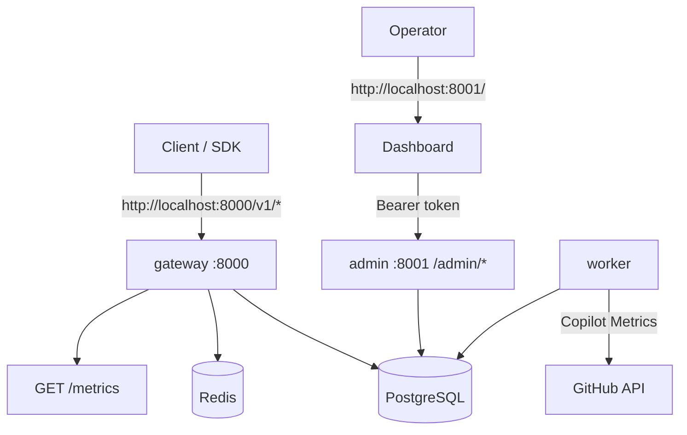
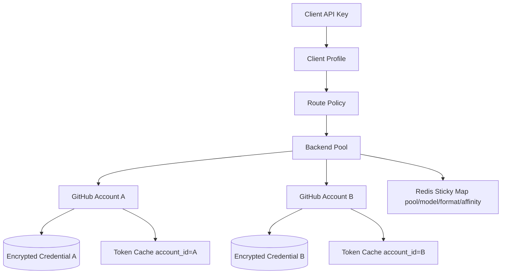
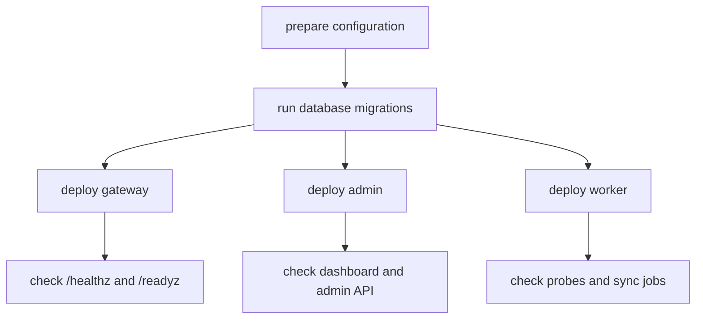
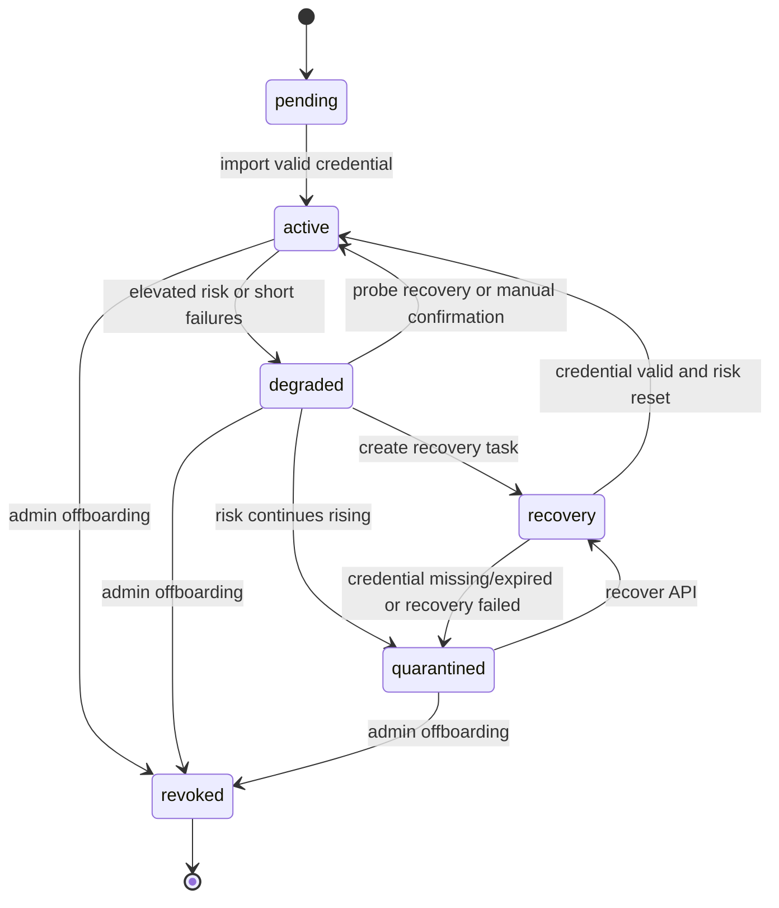
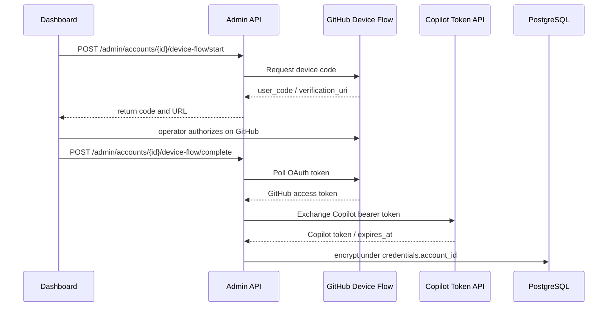
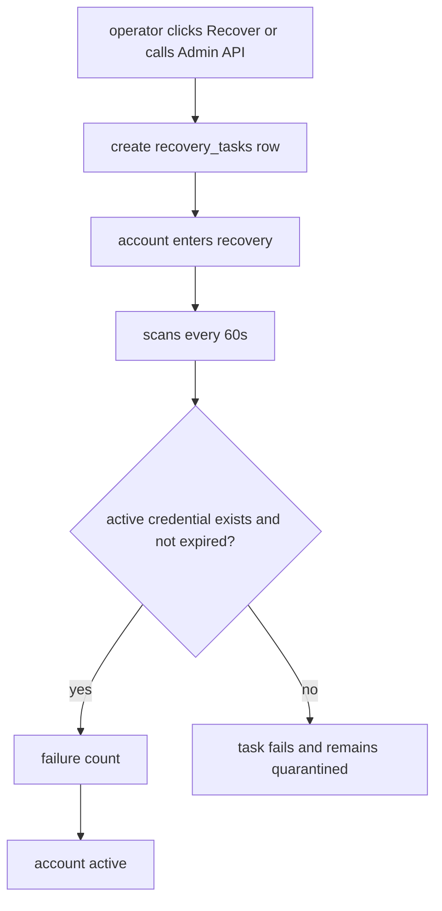
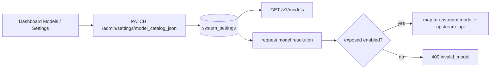
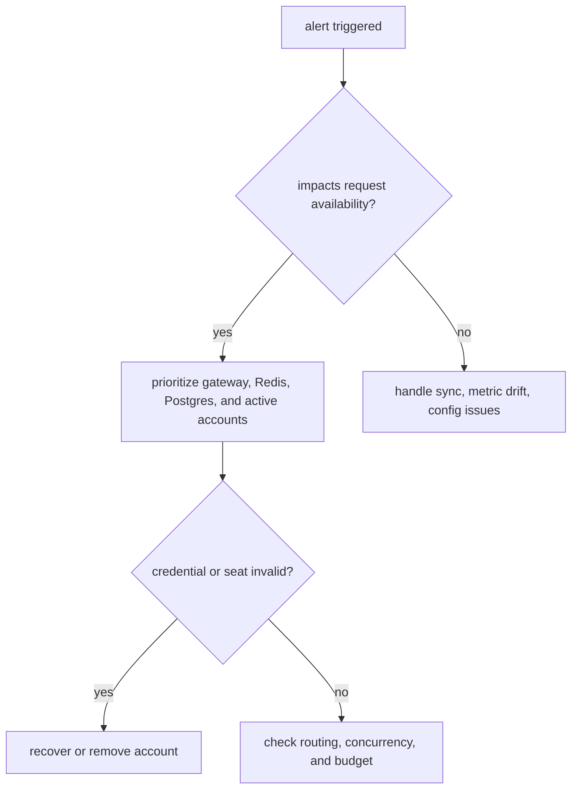
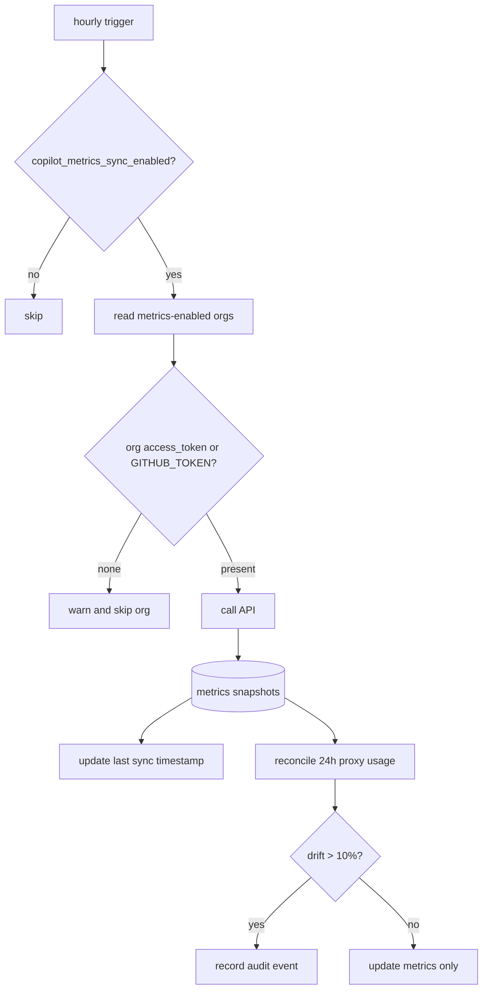
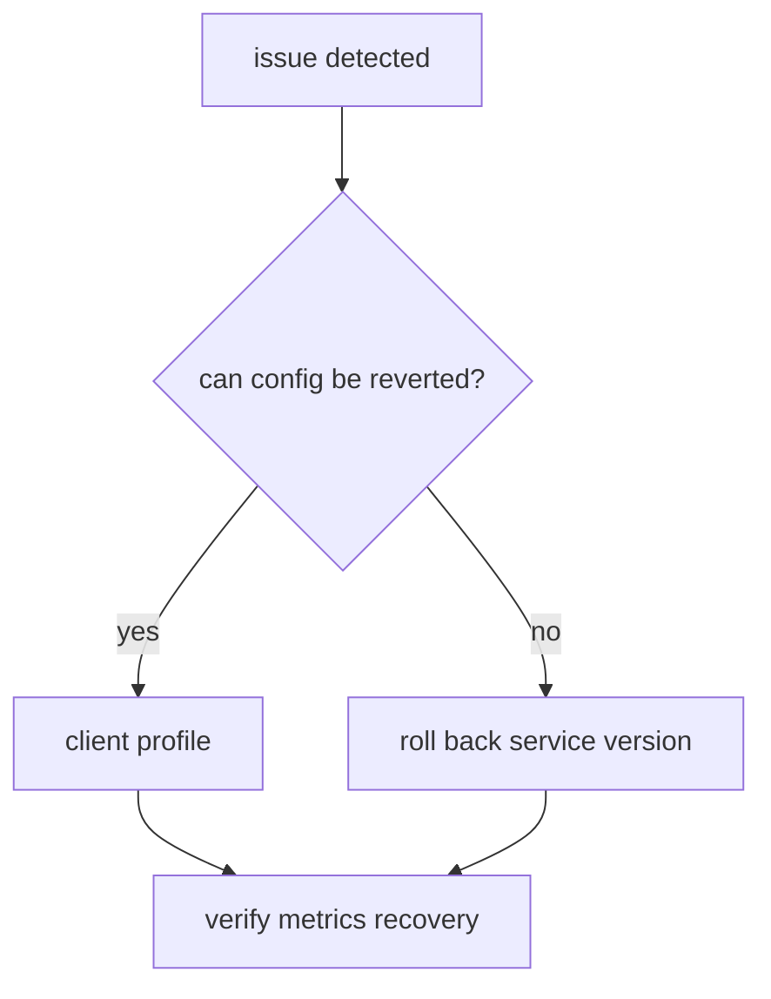

# Operations Guide

This guide supports daily operations for single-machine deployments and future clustered deployments, focusing on startup, migrations, monitoring, alerts, and troubleshooting.

## Runtime Topology



## VM Deployment

Use `deploy/deploy.sh` from the release package to deploy on a Linux VM. The script consumes fixed Docker Hub images and does not run source builds, tests, or smoke checks.

```bash
deploy/deploy.sh --start
```

Startup flow:

- Checks Linux, Docker, Docker Compose, `curl`, and related dependencies.
- Creates the default persistent root at host `~/ghcp_proxy` and bind-mounts PostgreSQL/Redis data directories into containers.
- Generates host file `~/ghcp_proxy/.env` on first run with the admin token, `PROVIDER=copilot`, database password, and `CREDENTIAL_MASTER_KEY`.
- Pulls `pczhao1210/ghcp-pool-proxy:gateway-latest`, `admin-latest`, `worker-latest`, plus PostgreSQL and Redis images.
- Starts PostgreSQL and Redis, then waits for health checks.
- Reads migration SQL from the published admin image and applies database migrations.
- Starts gateway, admin, and worker.
- Starts a log collector that writes compose logs hourly to `~/ghcp_proxy/logs/ghcp-proxy-YYYYMMDD-HH.log` with 30-day retention by default.

Tail logs:

```bash
deploy/deploy.sh --logs
```

Stop services while preserving persistent data:

```bash
deploy/deploy.sh --stop
```

VM Docker persistence:

- PostgreSQL data is stored under `~/ghcp_proxy/data/postgres` by default.
- Redis AOF data is stored under `~/ghcp_proxy/data/redis` by default.
- Logs are stored under `~/ghcp_proxy/logs`, split hourly, with `LOG_RETENTION_DAYS=30` by default.
- Deployment secrets and ports are stored in `~/ghcp_proxy/.env`. Do not rotate `CREDENTIAL_MASTER_KEY` casually after storing credentials.
- These are host paths. PostgreSQL and Redis use them through Docker Compose bind mounts; persistent directories are not created inside the images.

## Main Configuration

| Variable / Setting | Description |
| --- | --- |
| `GATEWAY_ADDR` | Gateway listen address |
| `ADMIN_ADDR` | Admin listen address |
| `ADMIN_TOKEN` | Admin API authentication token |
| `POSTGRES_DSN` | PostgreSQL connection string |
| `REDIS_ADDR` | Redis address |
| `PROVIDER` | Upstream provider type, `copilot` by default for VM deployment |
| `CREDENTIAL_MASTER_KEY` | Credential encryption master key |
| `GITHUB_OAUTH_CLIENT_ID` | Optional override for the GitHub OAuth App client ID used by dashboard Device Flow. Defaults to the built-in GitHub OAuth Client ID. |
| `GITHUB_OAUTH_SCOPES` | Device Flow scopes, default `read:user` |
| `GITHUB_LOGIN_BASE_URL` | GitHub login base URL, default `https://github.com` |
| `GITHUB_API_BASE_URL` | GitHub API base URL, default `https://api.github.com` |
| `COPILOT_TOKEN_URL` | Copilot bearer token exchange endpoint |
| `GITHUB_TOKEN` | Fallback token for worker GitHub Copilot Metrics sync |
| `DASHBOARD_DIR` | Dashboard static asset directory served by admin |
| `model_catalog_json` | Controls exposed names, upstream model IDs, upstream API, and enabled status |
| `LOG_LEVEL` / `LOG_FORMAT` | Log level and format |

## Multi-Account Environment Isolation

The current implementation isolates GitHub Copilot accounts across account records, credentials, pools, and hot state.



- Each account is a separate `accounts` row, credentials are bound through `credentials.account_id`, and no global Copilot token is used.
- After Device Flow, the account's own GitHub OAuth token and Copilot bearer token are stored as encrypted payload under that account only.
- Before a request, the gateway reads `account_id` from router selection, then loads and caches the token by that `account_id`.
- Pool membership is managed by `pool_accounts`; route policies control which models, protocols, or tenants route to which account pool.
- Redis sticky keys include pool, model, request format, and affinity hash; sticky only affects account reuse within the same scope.
- Organization/enterprise seat accounts should fill `account_source`, `org_id`, and `seat_status`; the router filters unavailable seats.

Recommended isolation practices:

1. Split pools by tenant, purpose, or risk tier, such as `team-a-copilot`, `team-b-copilot`, and `sandbox-copilot`.
2. Run Device Flow separately for each GitHub account and do not reuse manual tokens.
3. Bind client profiles or route policies to fixed pools to avoid sharing account pools across teams.
4. Periodically sync Business/Enterprise seat status and move invalid accounts to `quarantined` or `revoked`.
5. Use a dedicated `CREDENTIAL_MASTER_KEY` in production; do not use the compose default development key.

## Dashboard and Admin Authentication

- Dashboard static pages are served by admin at root, default `http://localhost:8001/`.
- `/admin/*` APIs require `Authorization: Bearer <ADMIN_TOKEN>`.
- The dashboard attaches the admin token to API requests; static pages themselves should not carry sensitive data.
- In container images, dashboard dist is copied to `/srv/dashboard`; `DASHBOARD_DIR` can point to a custom build.

## Release and Migration



- Run database migrations before deploying services.
- Prefer admin workflows for changing route policies, client profiles, and budget thresholds.
- In multi-instance deployments, Redis and PostgreSQL must be available before services start.

## Daily Checks

| Check | Description |
| --- | --- |
| `GET /healthz` | Liveness check |
| `GET /readyz` | Readiness check |
| `GET /metrics` | Gateway metrics check |
| Dashboard | Inspect account status, pool status, error events, usage, cost, cache hit rate, and sync status |

## Usage, Cost, and Cache Observability

After successful requests, the gateway writes a proxy-side `usage_ledger` row. With the real Copilot provider, it parses upstream `usage` and `copilot_usage` fields and records input tokens, cached input tokens, cache write tokens, output tokens, reasoning tokens, `nano_aiu`, estimated AI Credits, and estimated USD.

The dashboard Metrics tab shows these key indicators over the selected window:

| Metric | Operational use |
| --- | --- |
| AI Credits / Estimated USD | Approximate Copilot usage-based billing consumption for the window |
| Cache Hit Rate | Shows whether sticky/cache affinity is producing cache reads |
| Cached Input / Cache Write | Separates cache read savings from cache write cost |
| Reasoning Tokens | Identifies cost sources from reasoning models or high-reasoning requests |
| Token Details | Preserves upstream token type, count, and batch cost in ledger `token_details` |

Prometheus text metrics also include cached/cache read tokens, cache write tokens, reasoning tokens, nano AIU, AI Credits micro, estimated USD micros, and cache hit ratio permille. If cache hit rate stays low, check client profile sticky mode, route policies, session headers, and rebind/overflow metrics.

Query granularity:

| Granularity | Description |
| --- | --- |
| `raw` | Reads `usage_ledger` directly, request-accurate and best for short ranges |
| `hourly` | Reads `usage_rollup_hourly`, useful for multi-day trend queries |
| `daily` | Reads `usage_rollup_daily`, useful for long-term trends and cost reconciliation |
| `auto` | Uses raw within 24h, hourly within 90 days, and daily beyond 90 days |

Admin APIs support absolute date ranges: `/admin/usage/summary?from=2026-06-01&to=2026-06-23&granularity=auto`. Date-only `to` values use half-open range semantics and are advanced to the next UTC midnight, so `to=2026-06-23` includes the full June 23 day. The Usage Rollup Worker runs every five minutes and processes data up to `now()-2m` to avoid edge jitter from freshly written requests.

## Current Operations Workflows

### Account Onboarding, Grouping, and Offboarding



State meanings:

| State | Description |
| --- | --- |
| `pending` | Waiting for validation after account creation |
| `active` | Credential is valid and account can be routed |
| `degraded` | Short failures or elevated risk; deweighted or limited |
| `recovery` | Recovery task in progress |
| `quarantined` | Routing paused until recovery or credential reimport |
| `revoked` | Fully offboarded, no automatic recovery |

Onboarding

1. Create the account in the dashboard or Admin API.
2. Use Device Flow or manual credential import for GitHub Copilot login credentials.
3. Worker runs the first probe; success keeps `active`, while failure may move to `degraded` or `quarantined`.
4. Add the account to one or more pools so it can be routed.

Device Flow:



API examples:

```bash
curl -s http://localhost:8001/admin/accounts/{account_id}/device-flow/start \
  -H "Authorization: Bearer dev-admin-token" \
  -X POST

curl -s http://localhost:8001/admin/accounts/{account_id}/device-flow/complete \
  -H "Authorization: Bearer dev-admin-token" \
  -H "Content-Type: application/json" \
  -d '{"device_code":"DEVICE_CODE_FROM_START"}'
```

If complete returns `202` with `error=authorization_pending`, the user has not finished GitHub authorization yet; call complete again later. If it returns `409 expired_token`, start again.

Grouping

1. Create a pool and set default model, priority, and sticky policy.
2. Add accounts to the pool and verify max concurrency, weights, and routing priority.
3. Use route policies to control protocol, model, and pool matching; sticky should not override health, budget, or seat validity.

Offboarding

1. First move the account to `quarantined` or `revoked` to stop new routing.
2. Clear pool memberships and sticky affinity so it is not selected again.
3. For full deletion, use `DELETE /admin/accounts/{id}` to cascade credentials, pool memberships, and affinity records.
4. For temporary removal, use `quarantined` and restore to `active` after recovery.

Recovery task flow:



### Model ID Mapping, Aliases, and Hidden Models

| Field | Description |
| --- | --- |
| `exposed` | Model name visible to clients |
| `upstream` | Actual upstream model ID sent to GitHub Copilot |
| `upstream_api` | Optional upstream endpoint: `chat_completions` or `responses` |
| `name` | Optional display name refreshed from Copilot `/models` |
| `vendor` | Optional model vendor refreshed from Copilot `/models`; `OpenAI` infers Responses |
| `enabled` | Whether the model is returned by `/v1/models` and allowed in requests |

GitHub Copilot upstream endpoint selection is mixed, not globally Responses by default. Selection order is: model catalog `upstream_api` wins; Copilot-refreshed `vendor=OpenAI` models and known `gpt-5.5` use upstream Responses; other models follow the downstream request protocol, where `/v1/responses` uses Responses and Chat-compatible requests use Chat Completions.



Example configuration:

```json
[
  {"exposed":"gpt-4o","upstream":"gpt-4o","enabled":true},
  {"exposed":"claude-sonnet","upstream":"claude-sonnet-4-20250514","enabled":true},
  {"exposed":"o3","upstream":"o3-mini","enabled":false}
]
```

### GitHub Login Token Expiry and Refresh

GitHub Copilot login credentials can expire or become invalid. PATs may have custom expiry dates, and tokens unused for over one year may be removed by GitHub. Expired or revoked tokens usually return `401` on next use.

- Check whether `credentials.expires_at` is approaching.
- Warn administrators before tokens expire so they can refresh or reimport credentials.
- After invalidation, degrade the account first, then reimport a new token and restore `active`.

## Alert Priority



| Priority | Description |
| --- | --- |
| High | Insufficient active accounts, gateway 5xx, Redis P99 spike, Postgres pool exhaustion, seat invalidation |
| Medium | Persistently low sticky hit rate, abnormal rebind/overflow, Copilot Metrics sync delay |
| Low | Dashboard display issues, non-critical statistic delays |

## Troubleshooting

### Account Cannot Be Routed

1. Check whether the account is still `active`.
2. Check whether concurrency has reached the limit.
3. Check budget, risk score, and seat status.
4. Check whether the sticky target needs rebind.

### Low Sticky Hit Rate

1. Confirm that sticky is enabled in client profile or route policy.
2. Check whether `sticky_session_header`, Claude Code/Codex session headers, or the derived affinity key are stable.
3. Check whether overflow triggers frequently.
4. Check whether account additions/removals caused large affinity migration.

### Copilot Metrics Sync Delay

1. Check whether worker is alive.
2. Check whether `copilot_metrics_sync_enabled` is enabled.
3. Check whether org access token or `GITHUB_TOKEN` is available.
4. Check GitHub API status and whether Postgres writes are blocked.

Metrics sync path:



## Rollback Principles



- Prefer configuration rollback before binary rollback.
- After rollback, verify request success rate, routing distribution, and account status.
- Every recovery or removal operation should leave an audit trail.
