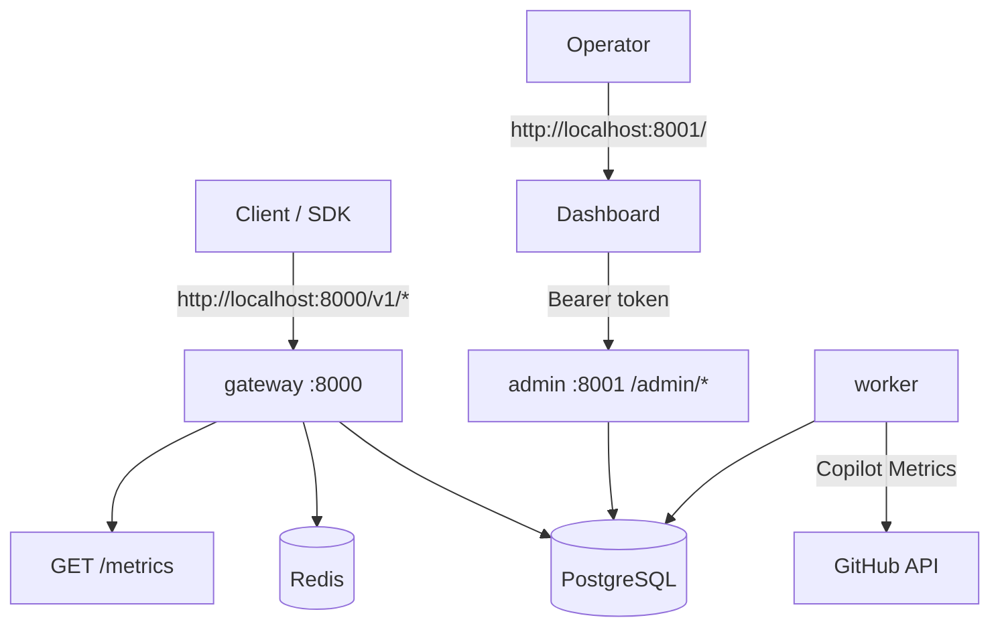
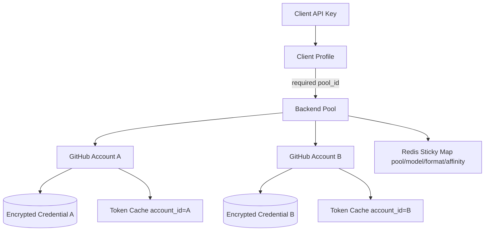
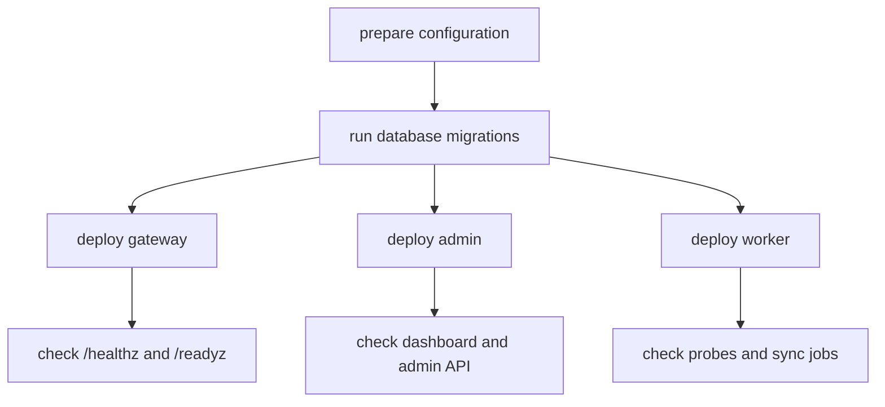
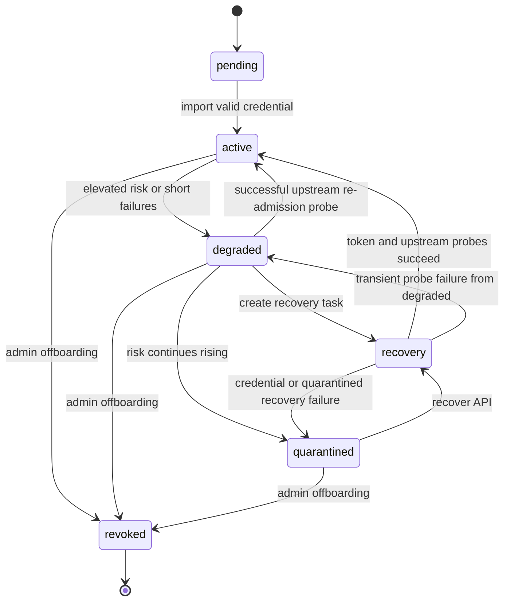
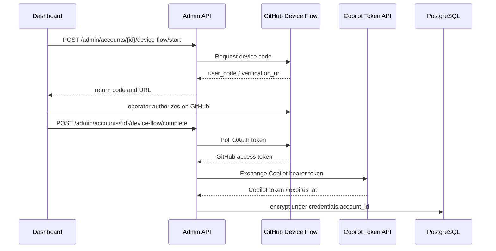
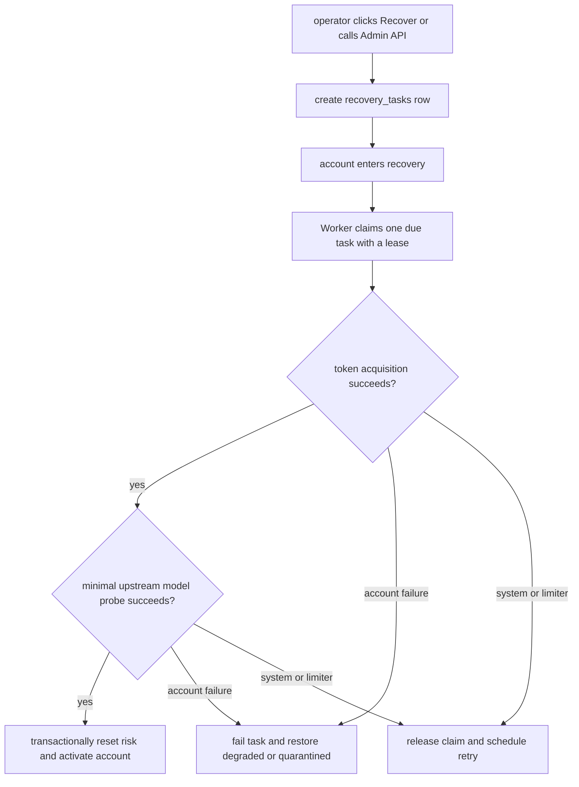
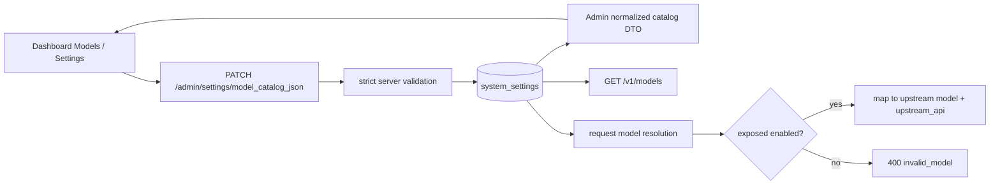
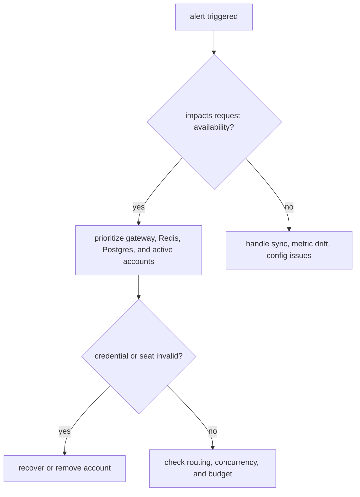
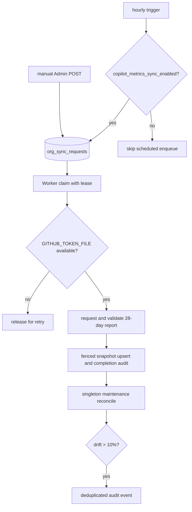
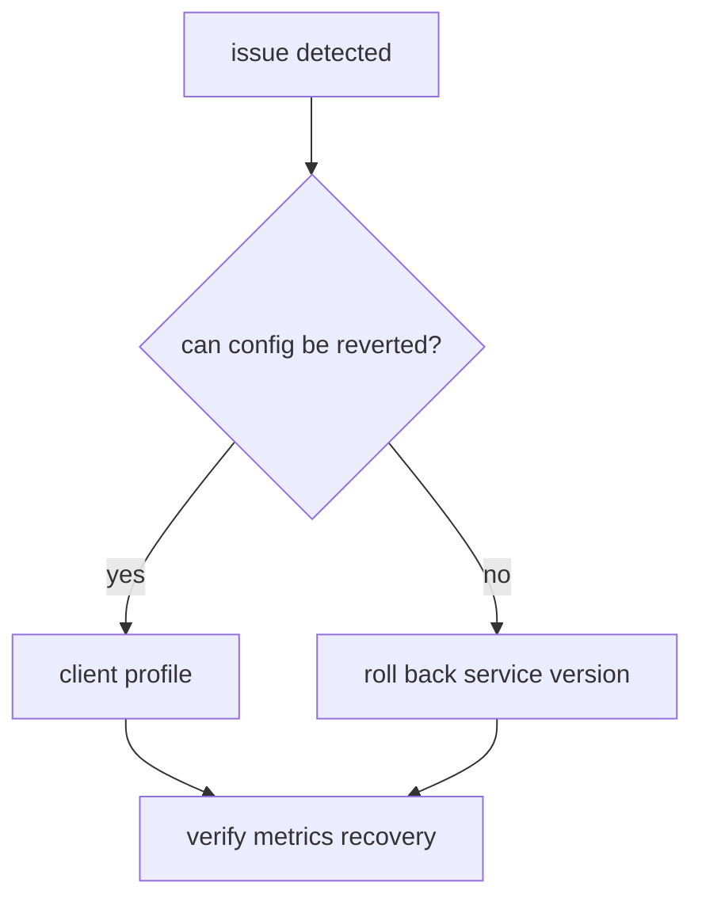

# Operations Guide

This guide covers the delivered VM and Kubernetes deployment paths, shared-state multi-process behavior, startup, migrations, monitoring, alerts, and troubleshooting.

## Contents

- [Runtime Topology](#runtime-topology)
- [VM Deployment](#vm-deployment)
- [Cluster Deployment](#cluster-deployment)
- [Main Configuration](#main-configuration)
- [Multi-Account Environment Isolation](#multi-account-environment-isolation)
- [Dashboard and Admin Authentication](#dashboard-and-admin-authentication)
- [Control-Plane API Groups](#control-plane-api-groups)
- [Release and Migration](#release-and-migration)
- [Daily Checks](#daily-checks)
- [Gateway Error Mapping](#gateway-error-mapping)
- [Usage, Cost, and Cache Observability](#usage-cost-and-cache-observability)
- [Operations Workflows](#operations-workflows)
- [Alert Priority](#alert-priority)
- [Troubleshooting](#troubleshooting)
- [Rollback Principles](#rollback-principles)

## Runtime Topology


```mermaid
flowchart TD
  Operator["Operator"] -->|"http://localhost:8001/"| Dashboard["Dashboard"]
  Dashboard -->|"Bearer token"| Admin["admin :8001 /admin/*"]
  Client["Client / SDK"] -->|"http://localhost:8000/v1/*"| Gateway["gateway :8000"]
  Gateway --> PG[(PostgreSQL)]
  Gateway --> Redis[(Redis)]
  Admin --> PG
  Worker["worker"] --> PG
  Worker -->|"Copilot Metrics"| GitHub["GitHub API"]
  Gateway --> Metrics["GET /metrics"]
```

## VM Deployment

Use `deploy/deploy.sh` from the release package to deploy on a Linux VM. The script consumes fixed Docker Hub images and does not run source builds, tests, or smoke checks.

Both VM and cluster entry points accept `--release-manifest FILE`, `--install-missing`, and the `deploy` action alias. `RELEASE_MANIFEST` is the shared environment form; `RELEASE_MANIFEST_FILE` remains a compatibility alias. Missing prerequisites prompt before installation unless `--install-missing` is supplied. Cluster `--yes` accepts deployment confirmations but does not imply installation consent; VM data deletion still requires `GHCP_RESET_CONFIRM=reset`.

```bash
deploy/deploy.sh --start
```

Startup flow:

- Checks Linux, Docker, Docker Compose, `curl`, and related dependencies.
- Creates the default persistent root at host `~/ghcp_proxy` and bind-mounts PostgreSQL/Redis data directories into containers.
- Creates `~/ghcp_proxy/config.yaml` and `~/ghcp_proxy/.env` automatically on first start; `generate-config` can create the YAML in advance. Neither command overwrites an existing file.
- Stops when an existing persistent directory is missing its YAML, rather than silently restoring default configuration.
- Validates the bundled non-sensitive release manifest against the bundled schema, derives and directly pulls the four runtime `repository@sha256:...` references from that manifest, and also pulls the PostgreSQL and Redis images.
- Starts PostgreSQL and Redis, then waits for health checks.
- Runs the dedicated manifest-backed migration image with a file-mounted DSN. Empty databases receive `001_init.sql`; recognized schema versions 1 through 9 reconcile through `010_legacy_schema_reconciliation.sql`; version 10 and later use their numbered migration path. Partial schemas and unmarked version-10-or-later schemas fail closed.
- Starts gateway, admin, and worker.
- Starts a log collector that writes compose logs hourly to `~/ghcp_proxy/logs/ghcp-proxy-YYYYMMDD-HH.log` with 30-day retention by default.

Tail logs:

```bash
deploy/deploy.sh --logs
```

Stop services while preserving persistent data:

```bash
deploy/deploy.sh --stop
```

Reset VM PostgreSQL and Redis data while preserving `.env` and `config.yaml`:

```bash
GHCP_RESET_CONFIRM=reset deploy/deploy.sh --reset
deploy/deploy.sh --start
```

For local development, use `./start.sh --reset`; it resets Docker Compose volumes and rebuilds the database from the current `migrations/001_init.sql`.

For source-tree validation, `./start.sh --new` runs Go tests unless `--skip-tests` is set, rebuilds the app images, recreates gateway/admin/worker, and runs HTTP smoke checks. The smoke client profile has a concrete `pool_id`: with `PROVIDER=fake` it targets the seeded local smoke pool; with `PROVIDER=copilot` it targets the first active shared pool when one exists. The smoke payload includes stable `user` and `session` identifiers so binding-pool errors are easier to diagnose.

VM Docker persistence:

- PostgreSQL data is stored under `~/ghcp_proxy/data/postgres` by default.
- Redis AOF data is stored under `~/ghcp_proxy/data/redis` by default.
- Logs are stored under `~/ghcp_proxy/logs`, split hourly, with `LOG_RETENTION_DAYS=30` by default.
- Logs consume disk in two places: Docker `json-file` keeps up to about `50 MB × 3` per container in the VM Compose file (about 750 MB across five services), while the hourly collector duplicates service output under `~/ghcp_proxy/logs` for 30 days with no byte cap. The source-development Compose file relies on Docker daemon defaults and has no Compose-level rotation limit.
- `~/ghcp_proxy/config.yaml` contains non-secret startup settings and is maintained as mode `0644` so unprivileged service containers can read its bind mount.
- Deployment secrets and ports are stored in `~/ghcp_proxy/.env`. Do not rotate `CREDENTIAL_MASTER_KEY` casually after storing credentials.
- `~/ghcp_proxy/.env` records the current release package `SCHEMA_VERSION` for operations visibility; the installed database version is stored in `system_settings.schema_version`.
- These are host paths. PostgreSQL and Redis use them through Docker Compose bind mounts; persistent directories are not created inside the images.

### 100-Account Single-VM Sizing

The accounts table, Admin API, and dashboard do not impose a hard total-account limit, so 100 accounts do not require a wider database field or a raised batch limit. Account records themselves are small; size capacity by concurrent model requests and SSE streams rather than by registered accounts. New accounts default to concurrency `6`, which gives 100 accounts a theoretical 600 shared-account slots. Binding pools default to concurrency `10`, giving 100 users that each bind one account a theoretical 1000 binding slots. These are account-side ceilings, not recommended single-VM operating points.

RPM defaults are `60` per account and `6000` globally, matching the sum of 100 account limits. The global budget accepts at most 6000 starts in a rolling minute, or about 100 starts/second if evenly distributed. A Redis Lua script atomically removes expired entries, counts, and admits a start; attempts rejected in a full window do not consume more window capacity. The gateway does not wait in a server-side queue: it returns 429 immediately and expects clients to retry with backoff and jitter, avoiding queued requests holding connections and memory. RPM limits starts but does not cap active streams, and client traffic still has no gateway-wide active-request lease. Daily token and AI Credits budgets remain disabled by default and can be enabled independently.

The following sizes assume PostgreSQL, Redis, gateway, admin, and worker all run on one VM and the workload is interactive coding rather than sustained batch traffic. They are starting points for load testing, not unbenchmarked throughput guarantees.

| Workload | vCPU / RAM | Persistent data disk | Intended range |
| --- | --- | --- | --- |
| Light load | `2 vCPU / 4 GiB` | `20 GB SSD / 2000 IOPS` | Development, trial use, or normally no more than about 20 active requests; limited compute and retention headroom |
| Recommended 100-account baseline | `4 vCPU / 8 GiB` | `128–256 GiB / 3000 IOPS` | About 20–80 active requests, normal interactive coding traffic, and colocated data services |
| 100 RPS validation profile | `16 vCPU / 32 GiB` | `256–512 GiB / 3000 IOPS` | Use only with a workload-specific latency test; ledger batching, incremental rollups, partition retention, and log sampling are active |
| I/O-constrained profile | `16–32 vCPU / 32–64 GiB` | `>=5000 IOPS` | Use only when measurements show sustained disk queue or latency saturation; disk capacity does not replace write-path checks |

Default capacity controls for 100 accounts:

| Control | Default | Operational intent |
| --- | --- | --- |
| New account `max_concurrency` | `6` | Support parallel tools and subagents on shared traffic while retaining per-account protection |
| New binding-pool `binding_max_concurrency` | `10` | Allow one bound user to run a group of subagents; an unavailable or saturated bound account still does not rebind automatically |
| Account / global RPM | `60` / `6000` | Allow 100 accounts to reach their individual RPM limits; the atomic sliding window rejects excess starts without a server-side wait queue |
| PostgreSQL pool | `12` per process, at most `36` across gateway/admin/worker | Leave headroom under PostgreSQL's usual connection budget and reduce per-connection RAM pressure |
| Token probes | `5` concurrent, `2` starts/second | Drain a 100-account startup backlog in roughly a minute without an external API spike |
| Usage writer | queue `10000`, batch `500`, threshold `100`, interval `250ms` | Existing batching is already conservative; tune only from queue age, drops, and COPY latency |
| Logging | `info`, successful-request sample `0.01` | Keep errors while limiting CPU and disk amplification |

Migration 018 changes only the database defaults. It does not rewrite existing account or pool concurrency. A Dashboard-saved `budget_max_rpm_global` also continues to override the new `6000` startup fallback, so existing deployments that saved `600` must change it explicitly.

On Azure, place PostgreSQL, Redis AOF, and application logs on a dedicated data disk so they do not contend with the OS disk. Premium SSD v2 includes a `3000 IOPS / 125 MB/s` baseline and allows capacity and performance to be configured separately, so test the 100-RPS profile within that baseline instead of assuming `8000–12000 IOPS` is required. With capacity-coupled Premium SSD v1, P20 provides `512 GiB / 2300 IOPS / 150 MB/s` and P30 provides `1 TiB / 5000 IOPS / 200 MB/s`; use measurements of disk latency and queue depth to select the tier. Also verify that the selected VM's aggregate data-disk IOPS and throughput limits meet the disk configuration.

During a steady load test, target sustained disk IOPS below 60–70% of the quota, PostgreSQL commit latency p95 below `5 ms`, and no persistent disk-queue growth. If the workload misses those targets at 3000 IOPS, first verify that ledger writes are batched, rollups no longer rescan data, and successful request logs are sampled before increasing the disk tier. Production capacity must also leave room for snapshots, WAL, and backups rather than allocating the entire data disk to PostgreSQL.

Use a sustained `6000 RPM`, or `100 RPS`, as the upper-bound disk model. Measurements on 2026-08-06 against PostgreSQL 16 and the current schema used representative successful records: one ledger heap row was about `360 B`; 100-row and 500-row batches generated `40000 B` and `196760 B` of WAL, or about `394–400 B/request`; one indexed user-binding TTL touch generated about `568 B` of WAL. The current user-binding hot path normally touches PostgreSQL once when a request enters and once when it finishes, while a long stream renews every 30 seconds as well.

| Write source | Sustained `100 RPS` estimate | Notes |
| --- | --- | --- |
| Raw ledger heap | About `35 KiB/s`, `3.11 GB/day`, or `21.8 GB` over seven days | One row per completed request; incremental BRIN growth is small |
| Ledger WAL | About `39 KiB/s` or `3.46 GB/day` | A threshold of 100 usually means about one COPY commit/second, not one transaction per request |
| User-binding touch WAL | About `111 KiB/s` or `9.81 GB/day` | Assumes two touches per request, plus `active_streams / 30` renewals per second |
| Combined PostgreSQL WAL | Usually about `150–170 KiB/s` or `13–15 GB/day` | Includes renewal headroom for 256 active streams; excludes checkpoint full-page images and vacuum/rollup bursts |

WAL is normally recycled, so `13–15 GB/day` is not permanent daily growth. If WAL archiving is enabled on the same disk, reserve an additional `archive days × daily WAL`, or preferably place archives on separate storage. Group commit, page cache, checkpoints, and autovacuum determine physical I/O: budget roughly `200–600 IOPS` for steady traffic and about `1500 IOPS` for rollup, vacuum, checkpoint, and AOF-rewrite bursts. The colocated deployment therefore still recommends at least `3000 IOPS / 125 MB/s`, targeting sustained use below 60–70% of the quota. `128 GB` is the operational minimum; `256 GB` gives better room for WAL, Redis AOF, logs, snapshots, and recovery. If request duration saturates concurrency or the gateway's 256 upstream connections first, actual sustainable RPS and disk writes will be below this upper bound.

Primary bottlenecks and scaling order:

1. **Disk capacity and write latency**: the gateway sends usage through a bounded queue and batches `usage_ledger` writes with PostgreSQL `COPY`, but PostgreSQL still generates data pages and WAL. Redis uses AOF `everysec`, and both Docker JSON logs and the hourly log collector consume disk. By default the worker retains seven UTC-day raw partitions, 90 UTC-day hourly-rollup partitions, and the current month plus 13 complete prior months of monthly-partitioned daily rollups; pruning only drops whole partitions. A 20-GB disk still lacks headroom for WAL, snapshots, and recovery, so expand to at least 128–256 GiB and alert at 70% utilization. Stable operation inside the 3000-IOPS baseline is a load-test target for sustained 100 RPS, not an unbenchmarked throughput guarantee.
2. **RAM**: 4 GiB must hold the host, five containers, PostgreSQL cache, Redis data, connection buffers, and request bodies. Long conversations, concurrent streams, and dashboard aggregation raise peaks. Move to 16 GiB when resident memory stays above 75%, swap is used, or OOM events occur; do not use swap as normal traffic capacity.
3. **CPU**: registered account count consumes almost no CPU. JSON protocol conversion, SSE event forwarding, logging, database queries, and background rollups grow with request and event rate. With two cores, gateway competes directly with PostgreSQL and worker. Move from four to eight cores, or separate the data services, when CPU stays above 70% or the run queue remains above the vCPU count.
4. **Redis/PostgreSQL round trips and connections**: a model request performs several Redis routing, concurrency, and sticky/binding operations. Binding traffic also touches PostgreSQL to refresh or allocate bindings. Usage enters the gateway's bounded in-memory queue, flushes immediately when backlog reaches 100 records, is capped at 500 records per COPY, and otherwise waits at most 250 ms. Gateway, admin, and worker each default to at most 12 PostgreSQL connections, for a theoretical single-VM total of 36. When connection acquisition waits or database latency grows, inspect slow queries, binding traffic, queue drops, and storage latency before increasing the pool.
5. **Long connections and network**: SSE often uses little CPU while holding sockets, memory, and account concurrency for a long time. The Copilot HTTP transport defaults to at most 256 connections per host, so one gateway process cannot realize either 600 shared slots or 1000 binding slots. On 4C8G, investigate sustained `ghcp_copilot_active_streams > 80`; treat about 128 as a conservative scale-out boundary rather than raising the 256 transport ceiling first. Separate gateway from PostgreSQL/Redis and then scale gateway horizontally for further growth.

Use sustained 10–15 minute signals rather than one-minute spikes: CPU above 70%, resident memory above 75% or any swap, active streams above 80, PostgreSQL acquisition waits with pools near 12, Redis p95 above about `5 ms`, usage queue above 2000 or oldest age above one second, or any usage-record drop. These are investigation and load-test triggers, not independent proof that a larger VM is the only fix.

Scale in this order: first upgrade the current VM to 4C8G and expand the disk, then observe at least one representative work week. If database write latency dominates, move PostgreSQL to dedicated SSD storage or a managed instance first. If CPU, active SSE streams, or per-host connections dominate, add gateway instances next. More gateway instances do not add account-side capacity, and every instance must share PostgreSQL and Redis.

## Cluster Deployment

Use the cluster entry point from the runtime package; it consumes the same immutable release manifest as the VM deployment:

```bash
deploy/deploy-cluster.sh local apply
deploy/deploy-cluster.sh azure apply
```

`local` checks Docker, Kind, kubectl, and Kustomize, offers to install missing Linux components with the detected package manager and `sudo` when required, then creates or reuses the `ghcp-local` Kind cluster. It applies the disposable `test` overlay with in-cluster PostgreSQL and Redis. Treat it as migration, readiness, and protocol validation only; deleting the Kind cluster deletes its data.

`azure` checks Azure CLI, kubectl, Kustomize, and jq, then interactively selects `create` or `reuse` for the resource group, VNet, AKS subnet, delegated PostgreSQL subnet, private-endpoint subnet, AKS, PostgreSQL Flexible Server, and Azure Managed Redis. Bracketed prompt values are accepted on Enter. Interactive reuse lists visible resource groups, same-region networks/services, and subnets from the selected VNet as numbered choices; Enter selects `[1]`, while `0` allows manual input. Non-interactive reuse requires the resource-group name and complete ARM IDs in environment variables. Reuse fails on mismatched resource type, subscription, resource region, state, subnet, or service contract; the resource group's metadata location is only the default resource region. Creation compiles `deploy/azure/main.bicep`, runs Azure what-if, and requires an explicit confirmation before apply. The script restores the caller's original Azure subscription on exit.

For a new AKS cluster, Bicep creates a user-assigned control-plane identity, grants its principal the built-in Network Contributor role at the node-subnet scope, and makes cluster creation depend on that assignment. The operator therefore needs permission to create managed identities and role assignments on that subnet. Reusing Redis does not change its SKU or database policy, but the deployment still creates a private endpoint, private DNS zone/link, and zone group for the selected VNet; the operator needs the corresponding network and private-link permissions.

After infrastructure resolution, the script obtains the AKS context, writes namespace-scoped application and migration Secrets from hidden inputs, renders release-manifest digests, runs the migration Job, applies workloads, waits for rollout, and performs the configured smoke checks. Temporary parameter and Secret files use mode `0600` and are removed on exit. Do not put credentials in command-line arguments, shell history, checked-in parameter files, or logs.

This Azure baseline provisions only VNet/subnets, AKS, PostgreSQL, Managed Redis, and their required private connectivity. A successful Bicep build, fake render, or what-if is not live-environment acceptance. Before production apply, independently approve and validate subscription/region quota, Azure Policy, subnet permissions, DNS, ingress/TLS, observability, backup/restore, HA, cost, and rollback ownership. The entry point does not provide destroy automation.

## Main Configuration

Configuration has two authorities. Local source deployments use the ignored repository `config.yaml` created by `start.sh`; VM deployments use `~/ghcp_proxy/config.yaml` created by `deploy.sh generate-config`. Provider endpoints, OAuth endpoints, timeouts, connection/queue sizing, and logging are startup-only YAML settings: Dashboard displays their effective values as read-only, and changes require a process restart. Deployment secrets, host paths, ports, listen addresses, and database/Redis addresses remain in `~/ghcp_proxy/.env`. Custom deployments follow environment > YAML > built-in defaults; VM Compose injects deployment values from `.env` and reads application startup settings from YAML.

Budgets, feature flags, model catalog, gateway public URL, client/GitHub fallback keys, and usage retention are stored in PostgreSQL and remain editable in Dashboard. For retention, a DB value overrides the YAML or environment startup fallback, which overrides the built-in default. Worker refreshes retention before each maintenance pass, currently every five minutes; no restart is required. Lowering a non-zero window can permanently drop older complete partitions, while `0` disables pruning for that tier.

Dashboard Events opens in the focused `Changes` view, which excludes routine credential-expiry and auto-reactivation-start notifications before pagination. `All events` preserves access to the complete audit stream. The credential warning worker now records at most one audit event for each `credential_id + expires_at`; renewing a credential creates a new warning cycle. Existing duplicate rows are retained rather than deleted.

The recommended Copilot compatibility flags are `copilot_compat_anthropic_beta_enabled`, `copilot_compat_thinking_tool_choice_enabled`, `copilot_compat_cache_control_enabled`, and `copilot_compat_vision_header_enabled`. Migration 015 seeds all four as `true`; Gateway treats missing/unreadable values as enabled and caches a resolved value for up to 60 seconds. These flags control reviewed request compatibility rules, not selection of the upstream wire protocol. Anthropic models use native Messages by default and are rolled back per model with `upstream_api=chat_completions`.

| Variable / Setting | Description |
| --- | --- |
| `GATEWAY_ADDR` | Gateway listen address |
| `gateway.read_timeout` | Maximum time to read a request, default `30s` |
| `gateway.read_header_timeout` | Maximum time to read request headers, default `5s` |
| `gateway.write_timeout` | Overall response write timeout; default `0s` keeps long SSE streams open |
| `gateway.idle_timeout` | Keep-alive idle timeout, default `120s` |
| `GATEWAY_BIND_ADDR` / `ADMIN_BIND_ADDR` | VM host interfaces for published Gateway/Admin ports; both default to `127.0.0.1`. Use SSH forwarding or a TLS-terminating private ingress; never expose plaintext Admin on an untrusted network. |
| `WORKER_METRICS_ADDR` | Worker health and retention-metrics listen address, default `:8002`; VM Compose publishes it only on host `127.0.0.1` |
| `WORKER_ROLES` | Comma-separated Worker loops: `all` (default), `credential-warning`, `health`, `metrics-sync`, `usage-rollup`, `provider-attempts`, `budget-recovery`, `binding-expiry`, or `capability-sync`. Both Compose baselines pass this variable through. Kubernetes runs `metrics-sync` in the dedicated `ghcp-org-sync-worker`; only the production Copilot overlay adds `capability-sync` to the general Worker, while fake-provider overlays omit it. `budget-recovery` requires Redis readiness; capability fencing uses PostgreSQL and does not require Redis. |
| `ORG_SYNC_ENABLED` | Enables GitHub organization metrics and seat sync. Defaults to `false`; when disabled, the Worker does not process sync work and the related Admin API routes return `404`. VM writes a missing value without replacing an existing `.env` value. Kind and Azure pass the same environment variable to their Kustomize runtime ConfigMap. |
| `CAPABILITY_SYNC_MATRIX_PATH` | Versioned compatibility matrix used by `capability-sync`; source default `compatibility/matrix.json`, packaged Worker default `/srv/ghcp/compatibility/matrix.json` |
| `CAPABILITY_SYNC_INTERVAL` / `CAPABILITY_SYNC_RUN_TIMEOUT` / `CAPABILITY_SYNC_LEASE_DURATION` | Capability collection cadence and fencing deadlines; defaults `1h`, `10m`, and `11m` |
| `CAPABILITY_EVIDENCE_TTL` | Persisted account-model evidence freshness window, default `24h`; must exceed the sync interval |
| `ADMIN_ADDR` | Admin listen address |
| `admin.read_timeout` / `ADMIN_READ_TIMEOUT` | Maximum time to read a complete Admin request, default `30s` |
| `admin.read_header_timeout` / `ADMIN_READ_HEADER_TIMEOUT` | Maximum time to read Admin request headers, default `5s` |
| `admin.write_timeout` / `ADMIN_WRITE_TIMEOUT` | Maximum Admin response write duration, default `60s` |
| `admin.idle_timeout` / `ADMIN_IDLE_TIMEOUT` | Admin keep-alive idle timeout, default `120s` |
| `ADMIN_TOKEN` | Admin API authentication token |
| `POSTGRES_DSN` | PostgreSQL connection string |
| `REDIS_ADDR` | Redis address |
| `REDIS_CLIENT_MODE` | Redis topology: `single`, `sentinel`, or `cluster` |
| `REDIS_PROTOCOL_VERSION` | Redis writer protocol: `1` by default; `2` only through the drained-writer Admin cutover procedure |
| `REDIS_ADDRS` | Sentinel or Cluster seed endpoints; required instead of `REDIS_ADDR` for those modes |
| `REDIS_TLS` | Enable native Redis TLS; non-Cluster modes also require `REDIS_TLS_SERVER_NAME` |
| `SCHEMA_VERSION` | Target schema version for the current release package; written to `.env` by `deploy.sh`, while the installed DB version is stored in `system_settings.schema_version` |
| `maintenance.raw_retention_days` | Raw-ledger daily partition fallback, default `7`; set to `0` to disable automatic pruning |
| `maintenance.hourly_retention_days` | Hourly-rollup UTC daily partition fallback, default `90`; set to `0` to disable automatic pruning |
| `maintenance.daily_retention_months` | Complete prior daily-rollup month fallback, default `13`, in addition to the current month; set to `0` to disable automatic pruning |
| `maintenance.partition_ahead_days` | Number of ledger daily partitions the worker creates ahead, default `7` |
| `usage_writer.queue_size` | Gateway in-memory usage queue capacity, default `10000` |
| `usage_writer.batch_size` | Maximum records per COPY, default `500` |
| `usage_writer.flush_threshold` | Burst backlog that triggers an immediate batch, default `100`, capped at batch size |
| `usage_writer.flush_interval` | Maximum wait below the threshold, default `250ms`; use `100ms` only as a low-latency load-test profile |
| `usage_writer.enqueue_timeout` | Maximum enqueue wait when the queue is full, default `50ms` |
| `usage_writer.write_timeout` | Timeout for one COPY attempt, default `5s` |
| `logging.success_sample_rate` | Successful access-log sample rate, default `0.01`; errors are always logged |
| `provider.type` | Upstream provider type, `copilot` by default for VM deployment |
| `provider.base_url` / `provider.timeout` | Optional Copilot endpoint override and upstream timeout |
| `postgres_pool.max_open_connections` | Maximum PostgreSQL connections opened by each application process, default `12` |
| `CREDENTIAL_MASTER_KEY` | Credential encryption master key |
| `github.oauth_client_id` | Optional override for the GitHub OAuth App client ID used by dashboard Device Flow. Defaults to the built-in GitHub OAuth Client ID. |
| `github.oauth_scopes` | Device Flow scopes, default `read:user` |
| `github.login_base_url` | GitHub login base URL, default `https://github.com` |
| `github.api_base_url` | GitHub API base URL, default `https://api.github.com` |
| `github.copilot_token_url` | Copilot bearer token exchange endpoint |
| `GITHUB_TOKEN_FILE` | Read-only GitHub token file for the `metrics-sync` Worker role; no `GITHUB_TOKEN` or database-setting fallback is used |
| `DASHBOARD_DIR` | Dashboard static asset directory served by admin |
| `model_catalog_json` | Strict model catalog contract for exposed names, upstream model IDs, upstream API, and enabled status; invalid JSON, unknown fields, empty IDs, duplicate exposed IDs, and unknown APIs are rejected before storage |
| `logging.level` / `logging.format` | Log level and format |

## Multi-Account Environment Isolation

The current implementation isolates GitHub Copilot accounts across account records, credentials, pools, and hot state.


```mermaid
flowchart TD
  Client["Client API Key"] --> Profile["Client Profile"]
  Profile -->|"required pool_id"| Pool["Backend Pool"]
  Pool --> AccountA["GitHub Account A"]
  Pool --> AccountB["GitHub Account B"]
  AccountA --> CredA[(Encrypted Credential A)]
  AccountB --> CredB[(Encrypted Credential B)]
  AccountA --> CacheA["Token Cache account_id=A"]
  AccountB --> CacheB["Token Cache account_id=B"]
  Pool --> Sticky["Redis Sticky Map pool/model/format/affinity"]
```

- Each account is a separate `accounts` row, credentials are bound through `credentials.account_id`, and no global Copilot token is used.
- After Device Flow, the account's own GitHub OAuth token and Copilot bearer token are stored as encrypted payload under that account only.
- Before a request, the gateway reads `account_id` from router selection, then loads and caches the token by that `account_id`.
- Pool membership is managed by `pool_accounts`; each account belongs to at most one pool and each client profile points to exactly one pool.
- Redis sticky keys include pool, model, request format, and affinity hash; sticky only affects account reuse within the same scope.
- Organization/enterprise seat accounts should fill `account_source`, `org_id`, and `seat_status`; the router filters unavailable seats.
- Per-account model evidence is published into the Router snapshot. Set a client profile to `require_fresh` for fail-closed account/model/API filtering; `allow_unknown` remains the compatibility default.

For `require_fresh`, the Dashboard Capabilities page must show fresh evidence for at least one active account. Unknown, stale, or mismatch evidence can leave the route unavailable. With `allow_unknown`, model access differences can still reach the provider, so keep those pools homogeneous. A Copilot `403` is classified as `permission_denied` and may increase that account's risk state.

Recommended isolation practices:

1. Split pools by tenant, purpose, risk tier, and model access, such as `team-a-copilot`, `team-b-copilot`, and `sandbox-copilot`.
2. Run Device Flow separately for each GitHub account and do not reuse manual tokens.
3. Assign each client profile to its concrete pool to prevent accidental cross-team account sharing.
4. Periodically sync Business/Enterprise seat status and move invalid accounts to `quarantined` or `revoked`.
5. Use a dedicated `CREDENTIAL_MASTER_KEY` in production; do not use the compose default development key.

## Dashboard and Admin Authentication

- Dashboard static pages are served by admin at root, default `http://localhost:8001/`. VM releases publish this port on host loopback only; use the documented SSH tunnel or a private TLS ingress.
- `/admin/*` APIs require `Authorization: Bearer <ADMIN_TOKEN>`.
- The dashboard attaches the admin token to API requests; static pages themselves should not carry sensitive data.
- In container images, dashboard dist is copied to `/srv/dashboard`; `DASHBOARD_DIR` can point to a custom build.

## Control-Plane API Groups

All endpoints below require the Admin bearer token. The detailed request and response contracts are defined by the handlers and tests; this index is for operations navigation.

| Area | Endpoints |
| --- | --- |
| Accounts and credentials | `/admin/accounts`, account state actions, credential import, and Device Flow |
| Pools and bindings | `/admin/pools`, account assignments, pool-account details, and binding release |
| Client profiles and settings | `/admin/client-profiles`, `/admin/settings`, and model-catalog configuration |
| GitHub organization data | organization, seat, metrics, and synchronization-request endpoints |
| Operations views | usage summaries, client usage, compatibility, model capabilities, and audit events |

## Release and Migration


```mermaid
flowchart TD
  A["prepare configuration"] --> B["run database migrations"]
  B --> C["deploy gateway"]
  B --> D["deploy admin"]
  B --> E["deploy worker"]
  C --> F["check /healthz and /readyz"]
  D --> G["check dashboard and admin API"]
  E --> H["check probes and sync jobs"]
```

- Run database migrations before deploying services.
- Prefer admin workflows for changing pool membership, client profiles, and budget thresholds.
- In multi-instance deployments, Redis and PostgreSQL must be available before services start. If the initial Redis ping or a later command fails, readiness returns `503`; budget and distributed concurrency checks fail closed, while sticky affinity and binding caches fall back to ordinary routing or PostgreSQL. The retained Redis client resumes normal operation automatically after recovery.
- The schema contract uses `backend_pools.allocation_mode` values `shared`, `user_binding`, and `session_binding`; user bindings use `user_id_*` columns, while session bindings use the separate `account_session_bindings` table.

## Daily Checks

| Check | Description |
| --- | --- |
| `GET /healthz` | Liveness check |
| `GET /readyz` | Readiness check |
| `GET /version` | Public Gateway `version` and `build_time`; excludes commits, configuration, and credentials |
| `GET /metrics` | Gateway metrics check with `Authorization: Bearer <ADMIN_TOKEN>` |
| Dashboard | Inspect account status, pool status, error events, usage, cost, cache hit rate, and sync status |

Every Gateway response carries `X-Request-ID`. The access log and `provider request dispatch` event use the same `request_id`; the latter also records `request_format`, `model`, `upstream_api`, `pool_id`, `account_id`, `client_profile_id`, `client_version`, `runtime_version`, `responses_lite`, and `stream`, but never the request body, credentials, Authorization, or configuration values. Confirm the running version, then search the VM hourly logs using the request ID observed by the client:

```bash
curl -fsS http://127.0.0.1:8000/version
grep -R --fixed-strings '<request-id>' ~/ghcp_proxy/logs
```

## Gateway Error Mapping

Clients receive standard AI gateway semantics through `external_status`, `external_code`, and a neutral `external_message`. The gateway log event `gateway error mapped` preserves operational fields: `internal_status`, `internal_code`, `internal_message`, `external_status`, `external_code`, `external_message`, and, when available, context such as `model`, `account_id`, `pool_id`, and `redis_rebind_reason`.

| Internal status / code | Internal condition | External status / code | External message | Operations note |
| --- | --- | --- | --- | --- |
| `413 invalid_request_error` | JSON request body exceeds `32 MiB` | `413 invalid_request_error` | Request body limit message | Reduce embedded images, tool payloads, or conversation history before retrying |
| `503 no_available_accounts` / `503 user_binding_exhausted` / `503 session_binding_exhausted` | Empty routing candidates, exhausted internal concurrency, or no binding-pool capacity | `429 rate_limited` | `rate limit exceeded; please retry later` | Use `internal_message`, `account_id`, and `pool_id` to distinguish capacity, binding, and concurrency causes |
| `503 route_unavailable` / `503 client_pool_not_configured` | Assigned client pool missing, inactive, or unavailable | `503 service_unavailable` | `model route unavailable` or client-pool configuration message | Check the client profile `pool_id`, pool status, and model catalog configuration |
| `400 missing_user_id` / `400 invalid_user_id` | User-binding pool lacks or receives an invalid `user_id` | `400 invalid_request_error` | `user identifier is required` / `user identifier is invalid` | Prefer OpenAI `user` or Anthropic `metadata.user_id` / `metadata.user` |
| `400 missing_session_id` / `400 invalid_session_id` | Session-binding pool lacks or receives an invalid `session_id` | `400 invalid_request_error` | `session identifier is required` / `session identifier is invalid` | Prefer `metadata.session_id` / `metadata.session`, or header `X-GHCP-Session-ID` |
| `503 user_binding_unavailable` / `503 session_binding_unavailable` | Binding dependency failure, such as PostgreSQL or cache access | `503 service_unavailable` | `service temporarily unavailable` | Check PostgreSQL, Redis, and binding table state |
| `503 budget_unavailable` | Rate-limit or budget state is unreadable | `503 service_unavailable` | `gateway limit state unavailable` | Check budget checker, Redis/PostgreSQL, and configuration sync |
| `429 global_rate_limited` / `429 account_rate_limited` | Global or internal resource-level RPM limit hit | `429 rate_limited` | `rate limit exceeded; please retry later` | Resource scope is hidden from clients; logs retain global/account granularity |
| `429 global_budget_exhausted` / `429 account_budget_exhausted` | Global or internal resource-level token / AI Credits daily budget exhausted | `429 budget_exhausted` | `quota exceeded` | Clients see standard quota exhaustion; logs retain budget scope |
| `502 upstream_error` | Upstream model provider failure | `502 upstream_error` | `model provider error` | Internal logs and usage ledger keep the original failure classification |
| `500 stream_error` | SSE writer or streaming response initialization failed | `500 stream_error` | `stream response unavailable` | Check response writing, proxying, and client connection state |
| Unmapped internal code | Other errors passed through the mapping function | Same as internal | Same as internal | Default passthrough; review new error types for neutralization needs |

Upstream Copilot 4xx responses are classified before account health is updated. Authentication, permission, rate-limit, quota, network, and 5xx failures can still affect risk. Invalid request and generic upstream 4xx classifications are recorded in metrics and usage, but they do not increase account risk because they usually come from request shape, model compatibility, or client parameters rather than account health. A model-entitlement rejection may arrive as `403 permission_denied`; the gateway records it against the selected account and does not fail over to another account. For streaming calls, an upstream SSE read error or premature EOF before a completion marker is treated as a failed request and must not be emitted as a successful `[DONE]` terminator. Client cancellation interrupts blocked stream event delivery, closes the upstream response, and releases local and Redis concurrency reservations. Chat accepts `[DONE]` or EOF after a validated non-empty final `finish_reason`. Responses requires `response.completed` or `response.incomplete`; `response.output_text.done`, `response.content_part.done`, and `response.output_item.done` never prove response-level completion on their own.

If clients receive `budget_exhausted`, check the gateway log fields `internal_code`, `account_id`, and `pool_id`, then inspect Redis counters such as `budget:daily:account:<account_id>:<yyyymmdd>` and `budget:daily:global:<yyyymmdd>`. Daily token and AI Credits caps are only active when the Dashboard Config value or corresponding `BUDGET_MAX_DAILY_*` environment value is greater than `0`.

## Usage, Cost, and Cache Observability

After a request completes, the gateway puts proxy-side usage into a bounded queue and writes up to 500 records or 250 ms at a time to the daily-partitioned `usage_ledger` with PostgreSQL `COPY`. With the real Copilot provider, it parses upstream `usage` and `copilot_usage` fields and records input tokens, cached input tokens, cache write tokens, output tokens, reasoning tokens, `nano_aiu`, estimated AI Credits, and estimated USD.

The dashboard Metrics tab shows these key indicators over the selected window:

| Metric | Operational use |
| --- | --- |
| AI Credits / Estimated USD | Approximate Copilot usage-based billing consumption for the window |
| Cache Hit Rate | Shows whether sticky/cache affinity is producing cache reads |
| Cached Input / Cache Write | Separates cache read savings from cache write cost |
| Reasoning Tokens | Identifies cost sources from reasoning models or high-reasoning requests |
| Token Details | Preserves upstream token type, count, and batch cost in ledger `token_details` |

Prometheus text metrics also include cached/cache read tokens, cache write tokens, reasoning tokens, nano AIU, AI Credits micro, estimated USD micros, and cache hit ratio permille. If cache hit rate stays low, check client profile sticky policy, affinity strategy, session headers, and rebind/overflow metrics.

When validating the 3000-IOPS target, also watch the gateway usage-write queue:

| Metric | Acceptance signal |
| --- | --- |
| `ghcp_usage_queue_depth` / `ghcp_usage_queue_capacity` | Depth must not trend upward or remain near the `10000` capacity |
| `ghcp_usage_queue_rejected_total{reason="full"}` | Must remain `0` in a steady load test; growth means database throughput is behind request throughput |
| `ghcp_usage_records_dropped_total` | Must remain `0` for every reason; includes enqueue failures and records lost when shutdown draining times out |
| `ghcp_usage_batches_total{status="error"}` | Must remain `0`; growth indicates COPY timeout or database write failure |
| `ghcp_usage_batch_duration_count` / `ghcp_usage_batch_duration_microseconds_total` / `ghcp_usage_batch_duration_microseconds_max` | Tracks COPY count, average, and worst case; correlate sustained growth with PostgreSQL commit latency and disk queue |
| `ghcp_usage_queue_oldest_age_milliseconds` / `ghcp_usage_queue_residence_microseconds_max` | Must not keep growing across multiple flush intervals |
| `ghcp_usage_batch_retries_total` / `ghcp_usage_batch_consecutive_failures` | Retries should not grow in steady state and consecutive failures should be `0` |
| `ghcp_usage_batch_last_success_timestamp` | Must keep advancing so a shallow but stalled queue is visible |
| `ghcp_usage_last_batch_size` | At 100 RPS, steady state is normally tens of records per 250 ms, up to `500` during bursts |
| `ghcp_usage_records_written_total` | Must continue to track completed requests that require accounting |
| `ghcp_usage_partitions_dropped_total{granularity="raw|hourly|daily"}` | Advances by whole partitions at expiry and must not be replaced by large DELETE operations |
| `ghcp_usage_retention_errors_total` / `ghcp_usage_retention_last_success_timestamp` | Retention errors should stay at `0`, and last success should advance about every five minutes |

Scrape retention metrics from the worker at `http://127.0.0.1:8002/metrics`; usage-writer and Copilot transport metrics remain on the gateway `/metrics` endpoint and require `Authorization: Bearer <ADMIN_TOKEN>`. Use the Copilot transport metrics to decide whether the current per-host limit of `256` connections actually needs to increase:

| Metric | Acceptance signal |
| --- | --- |
| `ghcp_copilot_http_responses_total{protocol="h2"}` | Normal production traffic should be predominantly HTTP/2; track the `http/1.1` downgrade share |
| `ghcp_copilot_connection_wait_milliseconds_bucket` | Calculate GetConn p95 from the histogram; sustained waits are evidence of pool saturation |
| `ghcp_copilot_connections_acquired_total{reused,was_idle}` | Derives connection reuse and idle-reuse rates |
| `ghcp_copilot_open_tcp_connections` | Consider raising the limit only when this approaches `256` while connection wait also rises |
| `ghcp_copilot_active_requests{kind}` / `ghcp_copilot_active_streams` | Separates ordinary requests from long-lived SSE occupancy |
| `ghcp_copilot_dial_duration_*` / `ghcp_copilot_tls_handshake_duration_*` | Distinguishes pool wait, TCP dial, and TLS handshake latency |
| `ghcp_copilot_tls_negotiated_total{protocol}` | Verifies that TLS ALPN negotiates `h2` |

Treat the workload as stable at 3000 IOPS only when these queue signals remain healthy, sustained disk IOPS stay below 60–70% of quota, PostgreSQL commit latency p95 is below `5 ms`, and disk queue depth does not trend upward. The `ingested_at` incremental-rollup watermark ensures queued records arriving after a short database interruption still reach hourly and daily rollups.

Query granularity:

| Granularity | Description |
| --- | --- |
| `raw` | Reads the partitioned `usage_ledger` table, request-accurate and best for short ranges inside the default seven-day retention window |
| `hourly` | Reads UTC-day-partitioned `usage_rollup_hourly`, retained for 90 days by default and useful for multi-day trends |
| `daily` | Reads UTC-month-partitioned `usage_rollup_daily`, retaining the current month and 13 complete prior months by default for long-term trends and reconciliation |
| `auto` | Uses raw within one hour, hourly within 90 days, and daily beyond 90 days, so the default 24-hour dashboard does not scan a full day of raw ledger data |

Admin APIs support absolute date ranges: `/admin/usage/summary?from=2026-06-01&to=2026-06-23&granularity=auto`. Date-only `to` values use half-open range semantics and are advanced to the next UTC midnight, so `to=2026-06-23` includes the full June 23 day. The Usage Rollup Worker runs every five minutes and processes data up to `now()-2m` to avoid edge jitter from freshly written requests. Raw pruning uses `min(now-retention, rollup watermark)` as its safe boundary, while hourly and daily retention only drops complete UTC day/month partitions. Schema `19` has no auxiliary legacy ledger table or compatibility view; an upgrade refuses to continue until any legacy ledger has been emptied by the prior retention window.

Retention can be changed under Dashboard Config without restarting services. The UI asks for confirmation when a new non-zero value shortens the current window because the next maintenance pass can make that deletion irreversible.

## Operations Workflows

### Account Onboarding, Grouping, and Offboarding


```mermaid
stateDiagram-v2
  [*] --> pending
  pending --> active: import valid credential
  active --> degraded: elevated risk or short failures
  active --> revoked: admin offboarding
  degraded --> active: successful upstream re-admission probe
  degraded --> recovery: create recovery task
  degraded --> quarantined: risk continues rising
  degraded --> revoked: admin offboarding
  quarantined --> recovery: recover API
  quarantined --> revoked: admin offboarding
  recovery --> active: token and upstream probes succeed
  recovery --> degraded: transient probe failure from degraded
  recovery --> quarantined: credential or quarantined recovery failure
  revoked --> [*]
```

State meanings:

| State | Description |
| --- | --- |
| `pending` | Waiting for validation after account creation |
| `active` | Credential is valid and account can be routed |
| `degraded` | Short failures or elevated risk; deweighted or limited |
| `recovery` | Recovery task in progress |
| `quarantined` | Routing paused until recovery or credential reimport |
| `revoked` | Fully offboarded, no automatic recovery |

Token acquisition alone does not prove that the account can run a model. A successful token probe only lowers risk and may make a degraded account eligible for re-admission; only a successful upstream model probe changes it back to `active`. Probe requests use dedicated Worker paths and do not consume client usage, budget, RPM, sticky affinity, or bindings. PostgreSQL claims and health-version fencing reject stale completions, and Redis enforces global concurrency and start-rate limits across Worker instances. Limiter deferrals update only the next due time, avoiding per-second attempt and audit writes.

Onboarding

1. Create the account in the dashboard or Admin API.
2. Use Device Flow or manual credential import for GitHub Copilot login credentials.
3. Worker runs the first probe; success keeps `active`, while failure may move to `degraded` or `quarantined`.
4. Add the account to one pool so it can be routed; a move atomically replaces that membership.

Device Flow:


```mermaid
sequenceDiagram
  participant D as Dashboard
  participant A as Admin API
  participant G as GitHub Device Flow
  participant C as Copilot Token API
  participant P as PostgreSQL

  D->>A: POST /admin/accounts/{id}/device-flow/start
  A->>G: Request device code
  G-->>A: user_code / verification_uri
  A-->>D: return code and URL
  D->>G: operator authorizes on GitHub
  D->>A: POST /admin/accounts/{id}/device-flow/complete
  A->>G: Poll OAuth token
  G-->>A: GitHub access token
  A->>C: Exchange Copilot bearer token
  C-->>A: Copilot token / expires_at
  A->>P: encrypt under credentials.account_id
```

API examples:

```bash
curl -s http://localhost:8001/admin/accounts/{account_id}/device-flow/start \
  -H "Authorization: Bearer dev-admin-token" \
  -X POST

curl -s http://localhost:8001/admin/accounts/{account_id}/device-flow/complete \
  -H "Authorization: Bearer dev-admin-token" \
  -H "Content-Type: application/json" \
  -d '{"device_code":"DEVICE_CODE_FROM_START"}'
```

If complete returns `202` with `error=authorization_pending`, the user has not finished GitHub authorization yet; call complete again later. If it returns `409 expired_token`, start again.

Account model capability evidence:

```bash
curl -s "http://localhost:8001/admin/accounts/{account_id}/model-capabilities?model=gpt-5.5&upstream_api=responses" \
  -H "Authorization: Bearer dev-admin-token"

curl -s "http://localhost:8001/admin/pools/{pool_id}/model-capabilities?model=gpt-5.5&upstream_api=responses" \
  -H "Authorization: Bearer dev-admin-token"

curl -s http://localhost:8001/admin/accounts/{account_id}/model-capabilities/refresh \
  -H "Authorization: Bearer dev-admin-token" \
  -X POST
```

Capability queries classify evidence as `fresh`, `stale`, `unknown`, or `mismatch`. `fresh` requires model visibility, a passed probe, unexpired evidence, and an evidence version equal to the latest fully completed Worker run. A refresh returns `202`; Admin persists the request and the `capability-sync` Worker consumes it under the existing PostgreSQL lease and credential-generation fencing. Admin never probes Copilot in the request path. A completed refresh references its evidence version; an incomplete run records `failed/sync_failed` without exposing the upstream error. Pool consistency is true only when every active account in the active membership set has `fresh` evidence for the requested model and API. Responses and audit entries contain no credential generation or raw upstream body.

Grouping

1. Create a pool and choose its allocation mode and load-balancing strategy.
2. Add or move accounts from the Pool page and verify max concurrency, weights, and binding state. Release active bindings before moving accounts.
3. Assign each client to one concrete pool. Sticky remains a within-pool preference and cannot override health, budget, or seat validity.

Offboarding

1. First move the account to `quarantined` or `revoked` to stop new routing.
2. Clear pool memberships and sticky affinity so it is not selected again.
3. For full deletion, use `DELETE /admin/accounts/{id}` to cascade credentials, pool memberships, and affinity records.
4. For temporary removal, use `quarantined` and restore to `active` after recovery.

Recovery task flow:


```mermaid
flowchart TD
  A["operator clicks Recover or calls Admin API"] --> B["create recovery_tasks row"]
  B --> C["account enters recovery"]
  C --> D["Worker claims one due task with a lease"]
  D --> E{"token acquisition succeeds?"}
  E -->|"yes"| F{"minimal upstream model probe succeeds?"}
  F -->|"yes"| G["transactionally reset risk and activate account"]
  E -->|"account failure"| H["fail task and restore degraded or quarantined"]
  F -->|"account failure"| H
  E -->|"system or limiter"| I["release claim and schedule retry"]
  F -->|"system or limiter"| I
```

### Model ID Mapping, Aliases, and Hidden Models

| Field | Description |
| --- | --- |
| `exposed` | Model name visible to clients |
| `upstream` | Actual upstream model ID sent to GitHub Copilot |
| `upstream_api` | Optional upstream endpoint: `chat_completions`, `responses`, or `anthropic_messages`; release-matrix entries must set it explicitly |
| `name` | Optional display name refreshed from Copilot `/models` |
| `vendor` | Optional model vendor refreshed from Copilot `/models`; `OpenAI` infers Responses and `Anthropic` infers Messages |
| `enabled` | Whether the model is returned by `/v1/models` and allowed in requests |

GitHub Copilot upstream endpoint selection is mixed, not globally Responses by default. The server normalizes an explicit `upstream_api`; when it is omitted for a non-release entry, the single server catalog contract infers it from `vendor`, `upstream`, `name`, and `exposed`. Admin GET returns the normalized catalog plus `upstream_api_explicit`, and Dashboard consumes that DTO without maintaining its own vendor or API inference rules.

The catalog is global. For `require_fresh` client profiles, Router and binding paths additionally require fresh per-account model evidence; `allow_unknown` profiles retain the legacy permissive policy. Release validation requires exact matrix/profile/pool references and fresh evidence for every active or binding-reserved account.


```mermaid
flowchart LR
  A["Dashboard Models / Settings"] --> B["PATCH /admin/settings/model_catalog_json"]
  B --> V["strict server validation"]
  V --> C[(system_settings)]
  C --> I["Admin normalized catalog DTO"]
  I --> A
  C --> D["GET /v1/models"]
  C --> E["request model resolution"]
  E --> F{"exposed enabled?"}
  F -->|"yes"| G["map to upstream model + upstream_api"]
  F -->|"no"| H["400 invalid_model"]
```

Example configuration:

```json
[
  {"exposed":"gpt-4o","upstream":"gpt-4o","enabled":true},
  {"exposed":"claude-sonnet","upstream":"claude-sonnet-4-20250514","enabled":true},
  {"exposed":"o3","upstream":"o3-mini","enabled":false}
]
```

### GitHub Login Token Expiry and Refresh

GitHub Copilot login credentials can expire or become invalid. PATs may have custom expiry dates, and tokens unused for over one year may be removed by GitHub. Expired or revoked tokens usually return `401` on next use.

- Check whether `credentials.expires_at` is approaching.
- Warn administrators before tokens expire so they can refresh or reimport credentials.
- After invalidation, degrade the account first, then reimport a new token and restore `active`.

## Alert Priority


```mermaid
flowchart TD
  A["alert triggered"] --> B{"impacts request availability?"}
  B -->|"yes"| C["prioritize gateway, Redis, Postgres, and active accounts"]
  B -->|"no"| D["handle sync, metric drift, config issues"]
  C --> E{"credential or seat invalid?"}
  E -->|"yes"| F["recover or remove account"]
  E -->|"no"| G["check routing, concurrency, and budget"]
```

| Priority | Description |
| --- | --- |
| High | Insufficient active accounts, gateway 5xx, Redis P99 spike, Postgres pool exhaustion, seat invalidation |
| Medium | Persistently low sticky hit rate, abnormal rebind/overflow, Copilot Metrics sync delay |
| Low | Dashboard display issues, non-critical statistic delays |

## Troubleshooting

### Account Cannot Be Routed

1. Check whether the account is still `active`.
2. Check whether concurrency has reached the limit.
3. Check budget, risk score, and seat status.
4. Check whether the sticky target needs rebind.

### Low Sticky Hit Rate

1. Confirm that sticky is enabled in the client profile.
2. Check whether `sticky_session_header`, Claude Code/Codex session headers, or the derived affinity key are stable.
3. Check whether overflow triggers frequently.
4. Check whether account additions/removals caused large affinity migration.

### Copilot Metrics Sync Delay

1. Check whether `ghcp-org-sync-worker` is alive and ready.
2. Check `/admin/github/orgs/{id}/sync-requests` for a pending request, lease retry, or last error.
3. Check whether `copilot_metrics_sync_enabled` is enabled for scheduled work and whether `GITHUB_TOKEN_FILE` is mounted in the sync Worker.
4. Check the usage-report metadata request and every signed report download; an invalid or partial report is retried without replacing the latest snapshot.
5. Check PostgreSQL request claims, snapshot upserts, and maintenance lease errors.

Metrics sync path:


```mermaid
flowchart TD
  A["hourly trigger"] --> B{"copilot_metrics_sync_enabled?"}
  B -->|"yes"| Q[(org_sync_requests)]
  B -->|"no"| C["skip scheduled enqueue"]
  D["manual Admin POST"] --> Q
  Q --> E["Worker claim with lease"]
  E --> F{"GITHUB_TOKEN_FILE available?"}
  F -->|"no"| G["release for retry"]
  F -->|"yes"| H["request and validate 28-day report"]
  H --> I["fenced snapshot upsert and completion audit"]
  I --> J["singleton maintenance reconcile"]
  J --> K{"drift > 10%?"}
  K -->|"yes"| L["deduplicated audit event"]
```

## Rollback Principles


```mermaid
flowchart TD
  A["issue detected"] --> B{"can config be reverted?"}
  B -->|"yes"| C["client profile"]
  B -->|"no"| D["roll back service version"]
  C --> E["verify metrics recovery"]
  D --> E
```

- Prefer configuration rollback before binary rollback.
- After rollback, verify request success rate, routing distribution, and account status.
- Every recovery or removal operation should leave an audit trail.
