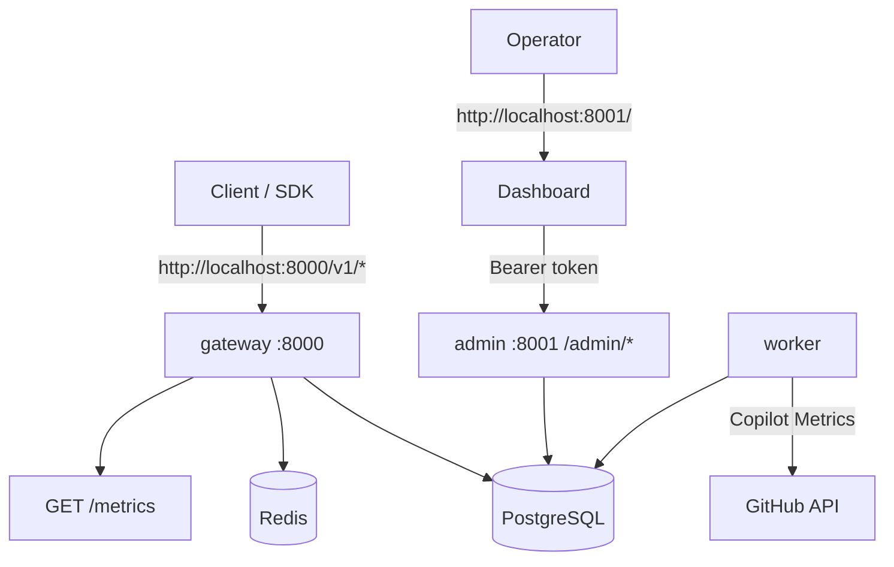
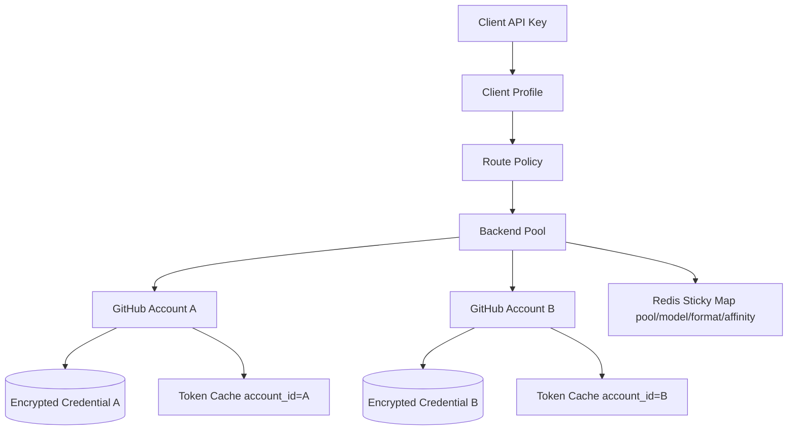
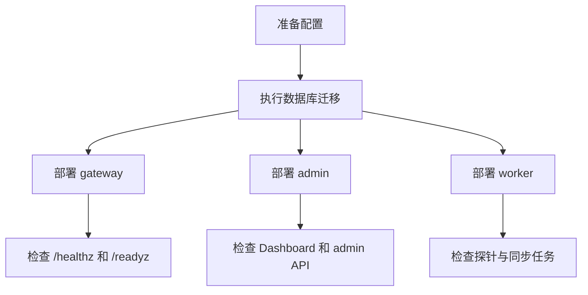
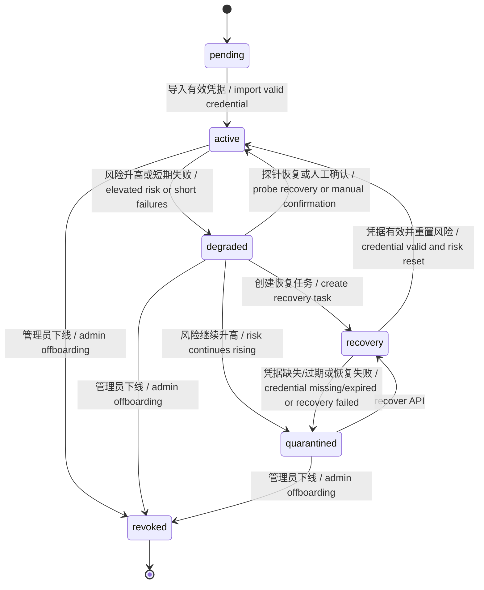
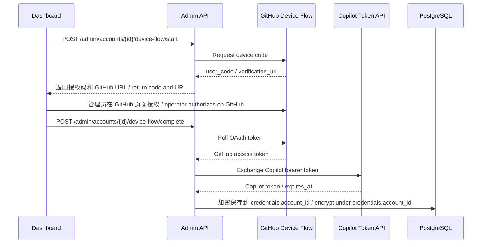
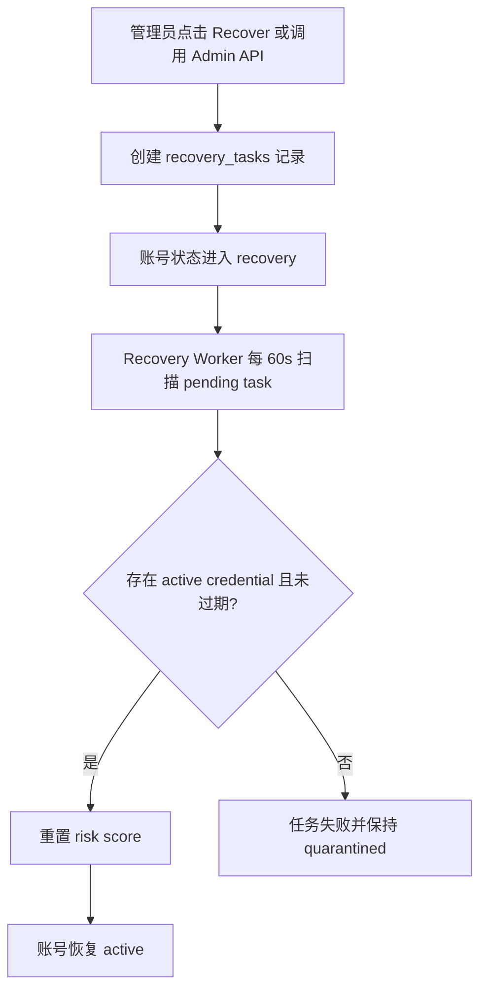
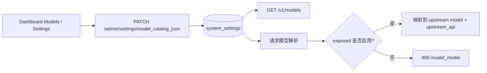
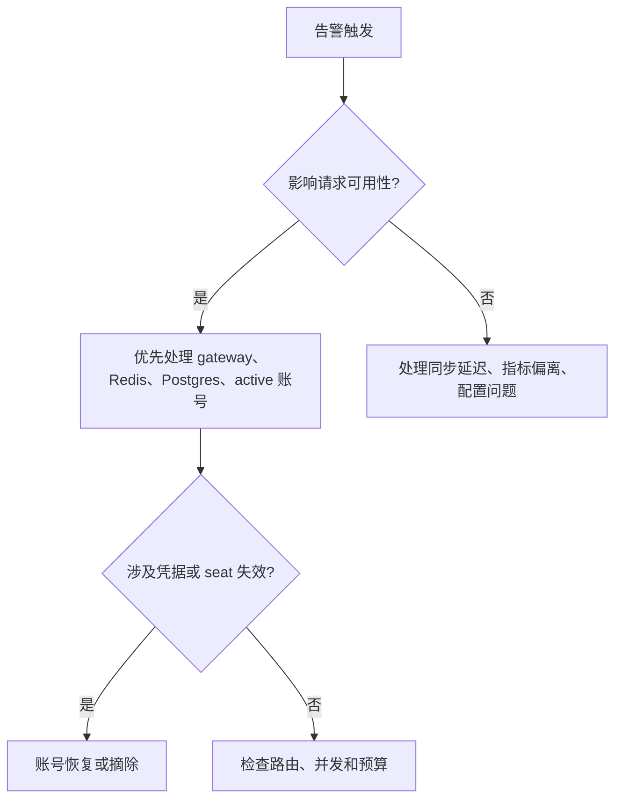
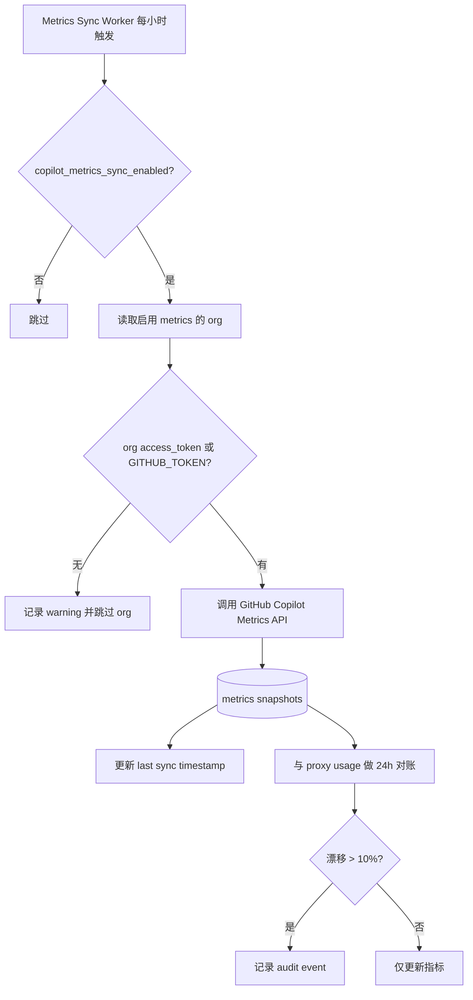
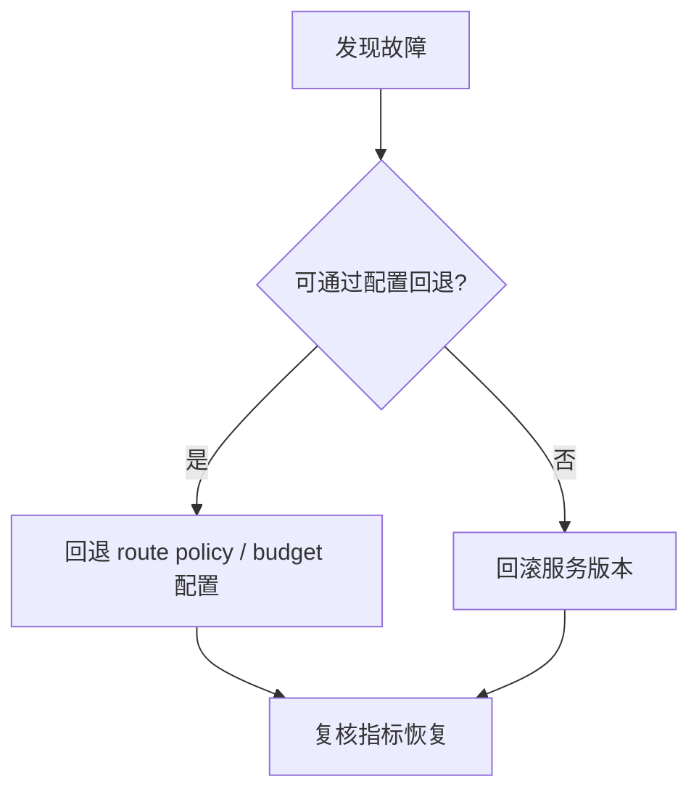

# 运维说明

本文档面向单机部署和后续集群化部署的日常运维，重点覆盖启动、迁移、监控、告警和常见故障处理。

## 运行拓扑



## VM 部署

推荐使用发布包中的 `deploy/deploy.sh` 在 Linux VM 上部署。脚本使用固定 Docker Hub 镜像，不包含源码构建、测试或 smoke test 流程。

```bash
deploy/deploy.sh --start
```

启动流程：

- 检查 Linux、Docker、Docker Compose、`curl` 等依赖。
- 在宿主机创建默认持久化目录 `~/ghcp_proxy`，并把 PostgreSQL/Redis 数据目录作为 bind mount 挂入容器。
- 首次运行生成宿主机文件 `~/ghcp_proxy/.env`，保存 admin token、`PROVIDER=copilot`、数据库密码和 `CREDENTIAL_MASTER_KEY`。
- 拉取 `pczhao1210/ghcp-pool-proxy:gateway-latest`、`admin-latest`、`worker-latest` 以及 PostgreSQL/Redis 镜像。
- 启动 PostgreSQL 和 Redis，等待健康检查通过。
- 从已发布 admin 镜像内读取数据库迁移 SQL 并执行迁移。
- 启动 gateway、admin 和 worker。
- 启动日志采集器，把 compose 日志按小时写入 `~/ghcp_proxy/logs/ghcp-proxy-YYYYMMDD-HH.log`，默认保留 30 天。

查看日志：

```bash
deploy/deploy.sh --logs
```

停止服务但保留持久化数据：

```bash
deploy/deploy.sh --stop
```

VM Docker 持久化：

- PostgreSQL 数据默认保存在 `~/ghcp_proxy/data/postgres`。
- Redis AOF 数据默认保存在 `~/ghcp_proxy/data/redis`。
- 日志默认保存在 `~/ghcp_proxy/logs`，按小时分段，`LOG_RETENTION_DAYS` 默认值为 `30`。
- 部署密钥和端口配置保存在 `~/ghcp_proxy/.env`。已有凭据数据后不要随意替换 `CREDENTIAL_MASTER_KEY`。
- 以上路径都是宿主机路径；PostgreSQL 和 Redis 通过 Docker Compose bind mount 使用这些目录，不是在镜像内部创建持久化目录。

## 主要配置

| Variable / Setting | 说明 |
| --- | --- |
| `GATEWAY_ADDR` | gateway 监听地址 |
| `ADMIN_ADDR` | admin 监听地址 |
| `ADMIN_TOKEN` | admin API 鉴权 token |
| `POSTGRES_DSN` | PostgreSQL 连接串 |
| `REDIS_ADDR` | Redis 地址 |
| `PROVIDER` | 上游 provider 类型，VM 部署默认 `copilot` |
| `CREDENTIAL_MASTER_KEY` | 凭据加密主密钥 |
| `GITHUB_OAUTH_CLIENT_ID` | Dashboard Device Flow 登录 Copilot 账号的 GitHub OAuth App client ID，可选覆盖项；默认使用内置 GitHub OAuth Client ID。 |
| `GITHUB_OAUTH_SCOPES` | Device Flow scopes，默认 `read:user` |
| `GITHUB_LOGIN_BASE_URL` | GitHub 登录域名，默认 `https://github.com` |
| `GITHUB_API_BASE_URL` | GitHub API 域名，默认 `https://api.github.com` |
| `COPILOT_TOKEN_URL` | Copilot bearer token 换取端点 |
| `GITHUB_TOKEN` | worker 同步 GitHub Copilot Metrics 的 fallback token |
| `DASHBOARD_DIR` | admin 服务 Dashboard 静态资源目录 |
| `model_catalog_json` | 控制暴露名、上游模型 ID、上游 API 和启停状态 |
| `LOG_LEVEL` / `LOG_FORMAT` | 日志级别和格式 |

## 多账号环境隔离

当前实现把 GitHub Copilot 账号隔离在账号、凭据、池和热状态四个层面。



- 每个账号是一条独立 `accounts` 记录，凭据通过 `credentials.account_id` 绑定，不使用全局 Copilot token。
- Device Flow 完成后保存的是该账号自己的 GitHub OAuth token 和 Copilot bearer token，加密 payload 只挂在该账号下。
- Gateway 在请求前从 router selection 取 `account_id`，再按该 `account_id` 读取和缓存 token。
- pool membership 使用 `pool_accounts` 管理，route policy 控制哪些模型、协议或租户可路由到哪个账号池。
- Redis sticky key 包含 pool、model、request format 和 affinity hash，sticky 只影响同一 scope 下的账号复用。
- 组织/企业 seat 账号应填写 `account_source`、`org_id`、`seat_status`，router 会过滤不可用 seat。

建议隔离做法

1. 按租户、用途或风险等级拆 pool，例如 `team-a-copilot`、`team-b-copilot`、`sandbox-copilot`。
2. 每个 GitHub 账号单独 Device Flow 登录，不复用任何手工 token。
3. 给 client profile 或 route policy 绑定固定 pool，避免不同团队共享账号池。
4. 对 Business/Enterprise seat 定期同步 seat 状态，失效账号进入 `quarantined` 或 `revoked`。
5. 生产环境使用独立 `CREDENTIAL_MASTER_KEY`，不要使用 compose 默认开发 key。

## Dashboard 与 Admin 鉴权

- Dashboard 静态页面由 admin 服务根路径提供，默认访问 `http://localhost:8001/`。
- `/admin/*` API 统一要求 `Authorization: Bearer <ADMIN_TOKEN>`。
- Dashboard 会把管理员 token 附加到 API 请求；静态页面本身不应承载敏感数据。
- 容器镜像中 Dashboard dist 会复制到 `/srv/dashboard`，也可通过 `DASHBOARD_DIR` 指向自定义构建产物。

## 发布与迁移



- 迁移顺序应先数据库后服务。
- 变更 route policy、client profile 和预算阈值应优先通过 admin 完成。
- 多实例部署时，Redis 和 PostgreSQL 必须先于服务可用。

## 日常检查

| Check | 说明 |
| --- | --- |
| `GET /healthz` | 存活检查 |
| `GET /readyz` | 就绪检查 |
| `GET /metrics` | Gateway 指标检查 |
| Dashboard | 查看账号状态、池状态、错误事件、用量、费用、cache 命中率和同步状态 |

## Gateway 错误映射

客户端按标准 AI 网关语义接收 `external_status`、`external_code` 和中性 `external_message`。Gateway 日志事件 `gateway error mapped` 保留内部排障字段：`internal_status`、`internal_code`、`internal_message`、`external_status`、`external_code`、`external_message`，并在可用时附带 `model`、`account_id`、`pool_id`、`redis_rebind_reason` 等上下文。

| Internal status / code | 内部场景 | External status / code | External message | 运维说明 |
| --- | --- | --- | --- | --- |
| `503 no_available_accounts` / `503 user_binding_exhausted` | 路由候选为空、账号并发耗尽、user-binding 无可分配容量 | `429 rate_limited` | `rate limit exceeded; please retry later` | 看 `internal_message`、`account_id`、`pool_id` 区分容量、绑定或并发原因 |
| `503 route_unavailable` | 没有可用路由或模型路由配置不可用 | `503 service_unavailable` | `model route unavailable` | 检查 route policy、pool 状态和模型目录 |
| `400 missing_user_binding_owner` | user-binding pool 请求缺少稳定用户标识 | `400 invalid_request_error` | `user identifier is required` | 新客户端优先传 OpenAI `user` 或 Anthropic `metadata.user_id` / `metadata.user` |
| `400 invalid_user_binding_owner` | 用户标识非法，例如长度超限 | `400 invalid_request_error` | `user identifier is invalid` | 检查客户端传入的用户标识归一化结果 |
| `503 user_binding_unavailable` | user-binding 依赖 PostgreSQL 或缓存访问失败 | `503 service_unavailable` | `service temporarily unavailable` | 检查 PostgreSQL、Redis 和绑定表状态 |
| `503 budget_unavailable` | 限流或预算状态不可读 | `503 service_unavailable` | `gateway limit state unavailable` | 检查 budget checker、Redis/PostgreSQL 和配置同步 |
| `429 global_rate_limited` / `429 account_rate_limited` | 全局或内部资源级 RPM 命中 | `429 rate_limited` | `rate limit exceeded; please retry later` | 对外不暴露资源层级；日志保留 global/account 粒度 |
| `429 global_budget_exhausted` / `429 account_budget_exhausted` | 全局或内部资源级 token / AI Credits 日预算耗尽 | `429 budget_exhausted` | `quota exceeded` | 对外按标准配额耗尽处理；日志保留预算层级 |
| `502 upstream_error` | 上游模型提供方错误 | `502 upstream_error` | `model provider error` | 内部日志和 usage ledger 保留原始错误分类 |
| `500 stream_error` | SSE writer 或流式响应初始化失败 | `500 stream_error` | `stream response unavailable` | 检查响应写出、代理和客户端连接状态 |
| 未显式映射的 internal code | 其它走映射函数的错误 | 与 internal 相同 | 与 internal 相同 | 默认透传；新增错误类型时应评估是否需要中性化 |

## 用量、费用与 Cache 观测

Gateway 在成功请求后写入 proxy-side `usage_ledger`。真实 Copilot provider 会解析上游响应中的 `usage` 和 `copilot_usage`，记录 input、cached input、cache write、output、reasoning tokens、`nano_aiu`、估算 AI Credits 和估算 USD。

Dashboard Metrics 页按窗口展示以下关键指标：

| 指标 | 运维用途 |
| --- | --- |
| AI Credits / Estimated USD | 估算当前窗口的 Copilot usage-based billing 消耗 |
| Cache Hit Rate | 观察 sticky/cache affinity 是否带来 cache read 命中 |
| Cached Input / Cache Write | 区分 cache read 收益和 cache 写入成本 |
| Reasoning Tokens | 识别 reasoning 模型或高推理请求的成本来源 |
| Token Details | 通过 ledger 中的 `token_details` 保留上游 token type、count 和 batch cost |

Prometheus 文本指标中也包含 cached/cache read tokens、cache write tokens、reasoning tokens、nano AIU、AI Credits micro、estimated USD micros 和 cache hit ratio permille。若 cache hit rate 持续偏低，应检查 client profile sticky mode、route policy、session header 以及 rebind/overflow 指标。

查询粒度：

| Granularity | 说明 |
| --- | --- |
| `raw` | 直接查询 `usage_ledger`，精确到每次请求，适合短时间范围 |
| `hourly` | 查询 `usage_rollup_hourly`，适合中期趋势和多天查询 |
| `daily` | 查询 `usage_rollup_daily`，适合长期趋势和账务对账 |
| `auto` | 24h 内使用 raw，90 天内使用 hourly，超过 90 天使用 daily |

Admin API 支持绝对日期范围：`/admin/usage/summary?from=2026-06-01&to=2026-06-23&granularity=auto`。日期格式的 `to` 会按闭开区间处理为下一天 00:00 UTC，因此 `to=2026-06-23` 会包含 6 月 23 日整天。Usage Rollup Worker 每 5 分钟处理到 `now()-2m`，避免刚写入的请求产生边界抖动。

## 当前运维流程

### 1. 账号上线、分组与下线



状态含义

| State | 说明 |
| --- | --- |
| `pending` | 创建账号后待验证 |
| `active` | 凭据有效，可用于路由 |
| `degraded` | 短期失败或风险上升，降权或限流 |
| `recovery` | 恢复任务处理中 |
| `quarantined` | 暂停路由，等待恢复或重新导入凭据 |
| `revoked` | 彻底下线，不再自动恢复 |

账号上线:

1. 在 Dashboard 或 Admin API 创建账号。
2. 使用 Device Flow 或手工凭据导入 GitHub Copilot 登录凭据。
3. Worker 进行首次 probe；成功后保持 `active`，失败则可能进入 `degraded` 或 `quarantined`。
4. 将账号加入一个或多个 pool，完成可路由准备。

Device Flow:



API 示例

```bash
curl -s http://localhost:8001/admin/accounts/{account_id}/device-flow/start \
  -H "Authorization: Bearer dev-admin-token" \
  -X POST

curl -s http://localhost:8001/admin/accounts/{account_id}/device-flow/complete \
  -H "Authorization: Bearer dev-admin-token" \
  -H "Content-Type: application/json" \
  -d '{"device_code":"DEVICE_CODE_FROM_START"}'
```

如果 complete 返回 `202` 且 `error=authorization_pending`，表示用户还没有在 GitHub 页面完成授权；稍后再次调用 complete。若返回 `409 expired_token`，重新 start。

账号分组:

1. 创建 pool，并设置默认模型、优先级和 sticky 策略。
2. 把账号加入 pool，确认最大并发、权重和路由优先级。
3. 通过 route policy 控制协议、模型和 pool 命中；sticky 不应覆盖健康、预算和 seat 有效性。

账号下线:

1. 先将账号状态切到 `quarantined` 或 `revoked`，暂停新请求路由。
2. 清理 pool 关系和 sticky affinity，避免继续被选中。
3. 彻底删除时使用 `DELETE /admin/accounts/{id}` 级联删除凭据、pool 关系与 affinity 记录。
4. 临时下线可先进入 `quarantined`，待恢复后再切回 `active`。

恢复任务链路



### 2. 模型 ID 映射、别名与隐藏模型

| 字段 | 说明 |
| --- | --- |
| `exposed` | 客户端看到的模型名 |
| `upstream` | 实际发往 GitHub Copilot 的上游模型 ID |
| `upstream_api` | 可选，上游 endpoint：`chat_completions` 或 `responses` |
| `name` | 可选，从 Copilot `/models` 刷新的显示名称 |
| `vendor` | 可选，从 Copilot `/models` 刷新的模型供应商；`OpenAI` 会自动推导为 Responses |
| `enabled` | 是否暴露给 `/v1/models`，以及是否允许请求 |

GitHub Copilot 上游 endpoint 采用混合选择，不是全局默认 Responses。选择顺序是：模型目录中的 `upstream_api` 优先；然后归一化 Copilot `/models` 刷新的 `vendor`，其中 `OpenAI` / `Azure OpenAI` 走上游 Responses，Google、Anthropic、Microsoft、xAI 走上游 Chat Completions；如果 vendor 为空，再从 `upstream`、`name`、`exposed` 推断，`gpt*`/o-series 归 OpenAI，`gemini*` 归 Google，`claude*`/`opus*`/`haiku*`/`sonnet*` 归 Anthropic，`MAI*` 归 Microsoft，`grok*`/`xai*` 归 xAI；其他模型按下游请求协议选择。



示例配置

```json
[
  {"exposed":"gpt-4o","upstream":"gpt-4o","enabled":true},
  {"exposed":"claude-sonnet","upstream":"claude-sonnet-4-20250514","enabled":true},
  {"exposed":"o3","upstream":"o3-mini","enabled":false}
]
```

### 3. GitHub 登录令牌过期与刷新

GitHub Copilot 登录凭据存在过期和失效风险。PAT 可能有自定义过期时间，未使用超过 1 年的 token 也可能被 GitHub 自动清理；过期或撤销后通常在下次使用时返回 `401`。

- 检查 `credentials.expires_at` 是否即将到期。
- 对即将失效的 token 提前提醒管理员刷新或重新导入。
- 失效后先做账号降级，再用新 token 重新导入并恢复 `active`。

## 告警优先级



| Priority | 说明 |
| --- | --- |
| High | active 账号不足、gateway 5xx、Redis P99 激增、Postgres 连接池耗尽、seat 失效 |
| Medium | sticky hit 率持续偏低、rebind/overflow 异常、Copilot Metrics 同步延迟 |
| Low | Dashboard 展示异常、非关键统计延迟 |

## 常见故障

### 账号不可路由

1. 检查账号是否仍为 `active`。
2. 检查并发是否达到上限。
3. 检查预算、risk score 和 seat 状态。
4. 检查 sticky target 是否需要重绑定。

### sticky 命中率偏低

1. 确认 client profile 或 route policy 是否启用了 sticky。
2. 检查 `sticky_session_header`、Claude Code/Codex session header 或派生 affinity key 是否稳定。
3. 检查 overflow 是否频繁触发。
4. 检查新增或摘除账号是否导致大量 affinity 迁移。

### Copilot Metrics 同步延迟

1. 检查 worker 是否存活。
2. 检查 `copilot_metrics_sync_enabled` 是否启用。
3. 检查 org access token 或 `GITHUB_TOKEN` 是否可用。
4. 检查 GitHub API 返回状态和 Postgres 写入是否受阻。

Metrics 同步路径



## 回滚原则



- 优先回退配置，再回退二进制。
- 回滚后要复核请求成功率、路由分布和账号状态。
- 任何恢复或摘除操作都应保留审计痕迹。
