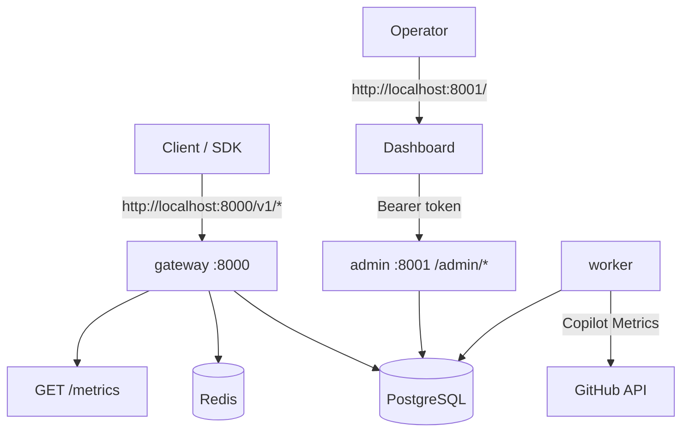
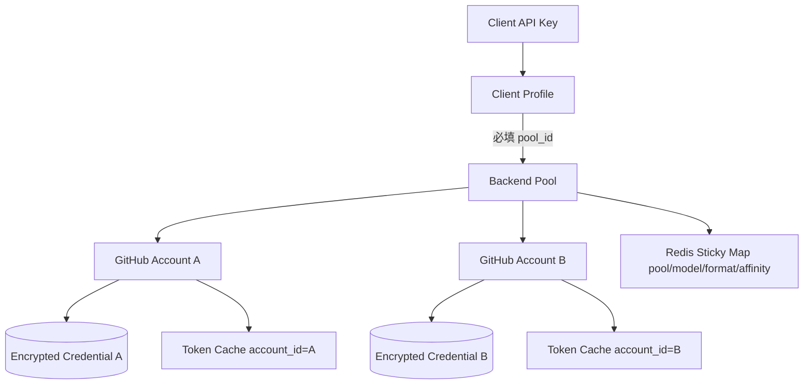
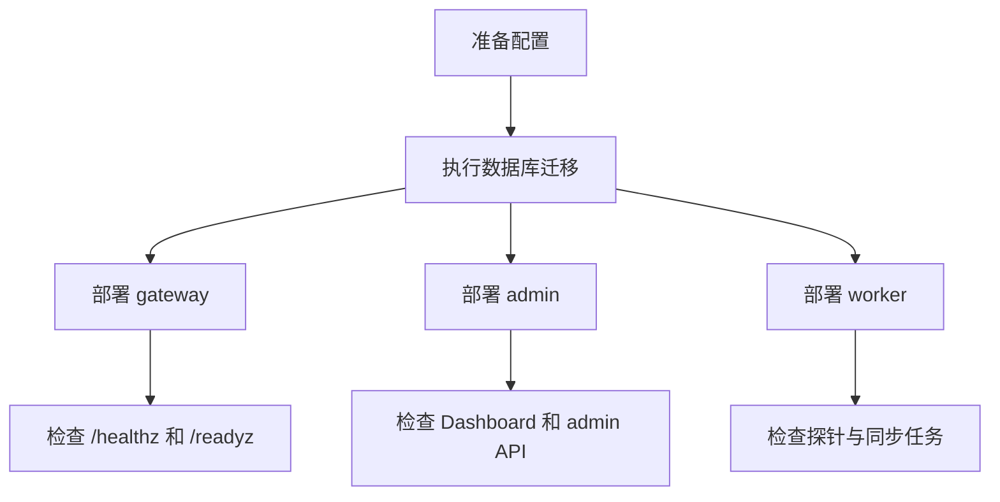
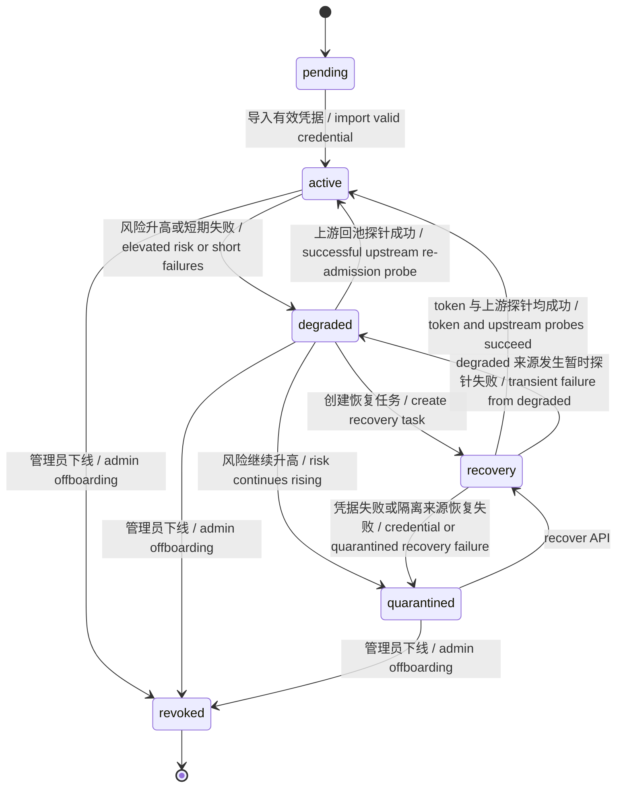
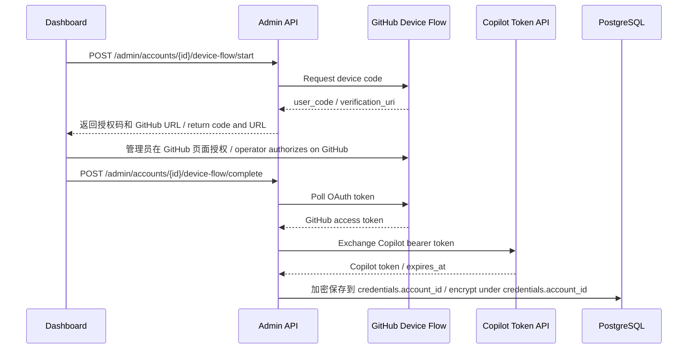
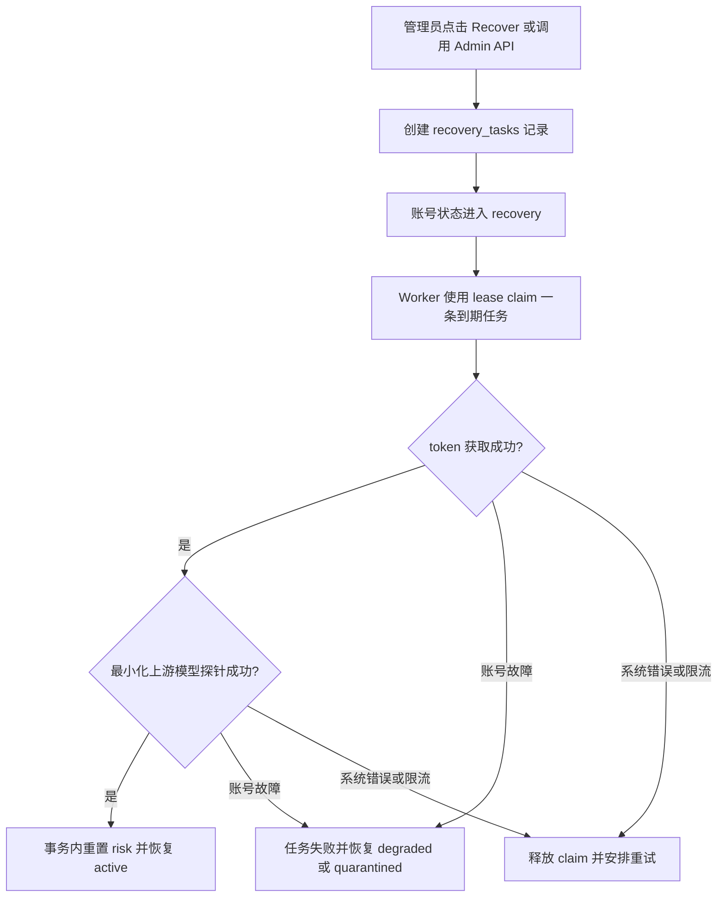
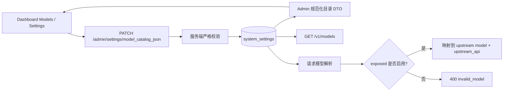
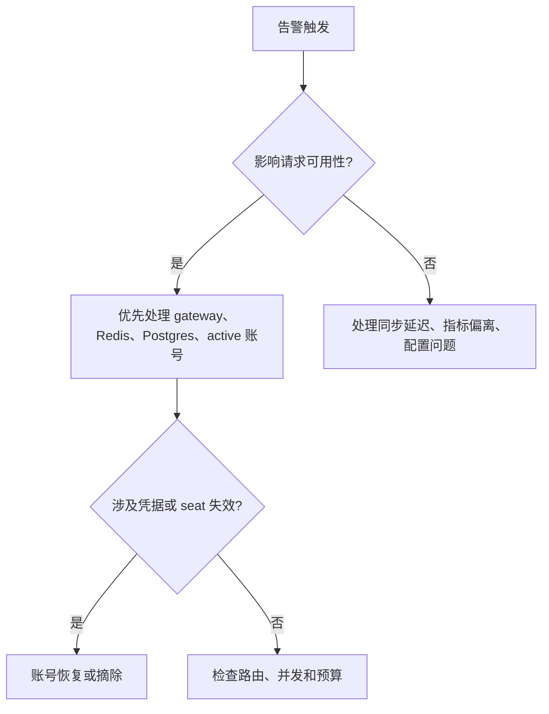
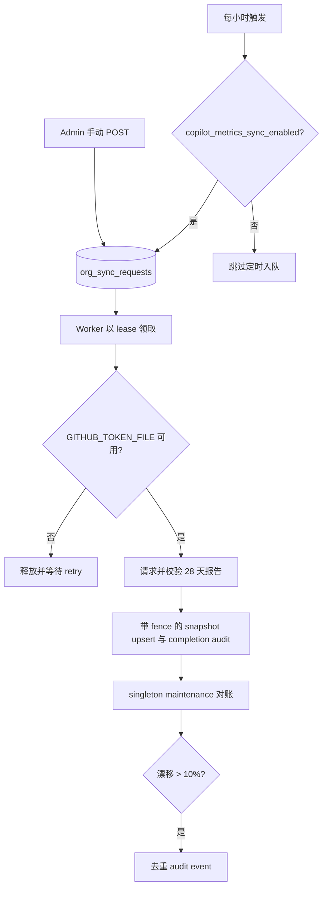
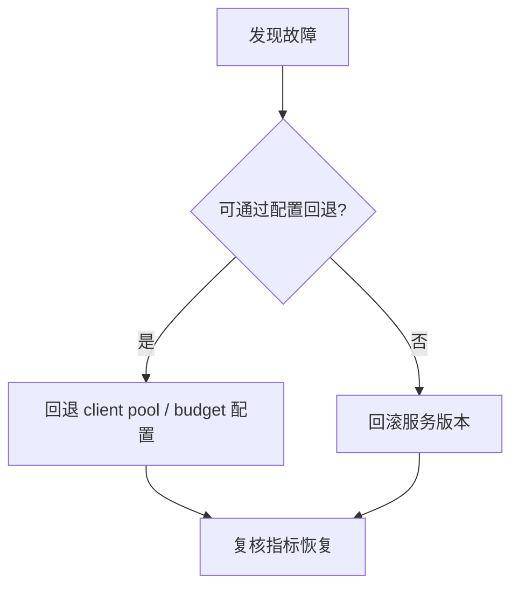

# 运维说明

本文档覆盖已交付的 VM 与 Kubernetes 部署路径、多进程共享状态、启动、迁移、监控、告警和常见故障处理。

## 目录

- [运行拓扑](#运行拓扑)
- [VM 部署](#vm-部署)
- [集群部署](#集群部署)
- [主要配置](#主要配置)
- [多账号环境隔离](#多账号环境隔离)
- [Dashboard 与 Admin 鉴权](#dashboard-与-admin-鉴权)
- [控制面 API 分组](#控制面-api-分组)
- [发布与迁移](#发布与迁移)
- [日常检查](#日常检查)
- [Gateway 错误映射](#gateway-错误映射)
- [用量、费用与 Cache 观测](#用量费用与-cache-观测)
- [运维流程](#运维流程)
- [告警优先级](#告警优先级)
- [常见故障](#常见故障)
- [回滚原则](#回滚原则)

## 运行拓扑


```mermaid
flowchart TD
  Operator["Operator"] -->|"http://localhost:8001/"| Dashboard["Dashboard"]
  Dashboard -->|"Bearer token"| Admin["admin :8001 /admin/*"]
  Client["Client / SDK"] -->|"http://localhost:8000/v1/*"| Gateway["gateway :8000"]
  Gateway --> PG[(PostgreSQL)]
  Gateway --> Redis[(Redis)]
  Admin --> PG
  Worker["worker"] --> PG
  Worker -->|"Copilot Metrics"| GitHub["GitHub API"]
  Gateway --> Metrics["GET /metrics"]
```

## VM 部署

推荐使用发布包中的 `deploy/deploy.sh` 在 Linux VM 上部署。脚本使用固定 Docker Hub 镜像，不包含源码构建、测试或 smoke test 流程。

VM 与集群入口都支持 `--release-manifest FILE`、`--install-missing` 和 `deploy` 动作别名；共享的环境变量形式为 `RELEASE_MANIFEST`，`RELEASE_MANIFEST_FILE` 保留为兼容别名。缺少前置组件时默认先请求确认，只有显式传入 `--install-missing` 才允许非交互安装。集群 `--yes` 只接受部署确认，不代表同意安装；VM 删除数据仍必须设置 `GHCP_RESET_CONFIRM=reset`。

```bash
deploy/deploy.sh --start
```

启动流程：

- 检查 Linux、Docker、Docker Compose、`curl` 等依赖。
- 在宿主机创建默认持久化目录 `~/ghcp_proxy`，并把 PostgreSQL/Redis 数据目录作为 bind mount 挂入容器。
- 首次启动自动生成 `~/ghcp_proxy/config.yaml` 和 `~/ghcp_proxy/.env`；也可提前通过 `generate-config` 创建 YAML。两者都不会覆盖已有文件。
- 已有持久化目录中 YAML 缺失时会停止启动，避免静默恢复默认配置。
- 校验随包非敏感 release manifest 与 schema 一致，从 manifest 派生并直接拉取四个 runtime `repository@sha256:...` 引用，同时拉取 PostgreSQL/Redis 镜像。
- 启动 PostgreSQL 和 Redis，等待健康检查通过。
- 使用 file-mounted DSN 运行专用 manifest-backed migration 镜像。空库应用 `001_init.sql`；已识别的 schema 版本 1 到 9 通过 `010_legacy_schema_reconciliation.sql` 修复；版本 10 及以上使用对应编号 migration 路径。部分 schema，以及缺少 marker 但带有版本 10 及以上特征的 schema，会 fail-closed。
- 启动 gateway、admin 和 worker。
- 启动日志采集器，把 compose 日志按小时写入 `~/ghcp_proxy/logs/ghcp-proxy-YYYYMMDD-HH.log`，默认保留 30 天。

查看日志：

```bash
deploy/deploy.sh --logs
```

停止服务但保留持久化数据：

```bash
deploy/deploy.sh --stop
```

重置 VM 数据库和 Redis 数据但保留 `.env` 与 `config.yaml`：

```bash
GHCP_RESET_CONFIRM=reset deploy/deploy.sh --reset
deploy/deploy.sh --start
```

本地开发环境使用 `./start.sh --reset`，它会执行 Docker Compose volume reset 后按当前 `migrations/001_init.sql` 重建数据库。

源码树验证可使用 `./start.sh --new`。它默认运行 Go 测试，除非显式传入 `--skip-tests`，随后重建应用镜像、重建 gateway/admin/worker 容器并执行 HTTP smoke check。smoke client profile 有具体 `pool_id`：`PROVIDER=fake` 时指向本地 seed 的 smoke pool；`PROVIDER=copilot` 时优先指向第一个 active shared pool。smoke payload 会带稳定的 `user` 和 `session` 标识，便于定位 binding pool 错误。

VM Docker 持久化：

- PostgreSQL 数据默认保存在 `~/ghcp_proxy/data/postgres`。
- Redis AOF 数据默认保存在 `~/ghcp_proxy/data/redis`。
- 日志默认保存在 `~/ghcp_proxy/logs`，按小时分段，`LOG_RETENTION_DAYS` 默认值为 `30`。
- 日志会占用两处磁盘：VM Compose 的 Docker `json-file` 每容器最多约 `50 MB × 3`（五个服务合计约 750 MB），小时日志采集器还会把同一批服务输出复制到 `~/ghcp_proxy/logs`，按 30 天清理但没有字节上限。源码开发 Compose 依赖 Docker daemon 默认值，本身没有配置轮转上限。
- `~/ghcp_proxy/config.yaml` 只保存非敏感启动配置，脚本会将其维持为 `0644`，使非 root 服务容器能够读取 bind mount。
- 部署密钥和端口配置保存在 `~/ghcp_proxy/.env`。已有凭据数据后不要随意替换 `CREDENTIAL_MASTER_KEY`。
- `~/ghcp_proxy/.env` 会写入当前发布包的 `SCHEMA_VERSION`，便于运维确认目标 schema 版本；数据库实际已安装版本记录在 `system_settings.schema_version`。
- 以上路径都是宿主机路径；PostgreSQL 和 Redis 通过 Docker Compose bind mount 使用这些目录，不是在镜像内部创建持久化目录。

### 100 账号单机规格

当前账号表、Admin API 和 Dashboard 没有账号总数硬上限，100 个账号不需要扩大数据库字段或解除批量限制。账号记录本身占用很小；容量应按同时活跃的模型请求和 SSE 流估算，而不是按已录入账号数估算。新账号默认并发为 `6`，100 个账号理论上有 600 个 shared 账号槽位；绑定池默认并发为 `10`，100 个各自绑定一个账号的用户理论上有 1000 个绑定槽位。这些都是账号侧上限，不是单机推荐工作点。

单账号 RPM 默认为 `60`，全局为 `6000`，与 100 个账号的账号级上限总和对齐。全局值表示滚动一分钟最多接纳 6000 次启动，若均匀分布最多约 100 次/秒。Redis Lua 脚本会原子完成过期清理、计数和接纳，某个窗口已经拒绝的尝试不会继续占用该窗口额度。Gateway 不在服务端排队等待窗口；窗口满时立即返回 429，由客户端退避并加入抖动后重试，避免等待请求继续占用连接和内存。RPM 只限制启动量，不能限制活跃流；当前客户端流量仍没有 gateway 级全局 active-request lease。Daily token 和 AI Credits 预算默认关闭，可按需单独启用。

以下规格假设 PostgreSQL、Redis、gateway、admin 和 worker 都运行在同一台 VM，流量形态为交互式编程而非持续批处理。它们是压测前的起始建议，不是未经实测的吞吐保证。

| 场景 | vCPU / RAM | 持久化数据盘 | 适用范围 |
| --- | --- | --- | --- |
| 轻载 | `2 vCPU / 4 GiB` | `20 GB SSD / 2000 IOPS` | 开发、试运行或通常不超过约 20 条活跃请求；资源余量和数据保留空间较小 |
| 100 账号推荐基线 | `4 vCPU / 8 GiB` | `128–256 GiB / 3000 IOPS` | 约 20–80 条活跃请求、常见交互式编程流量、单机共置数据库 |
| 100 RPS 验证规格 | `16 vCPU / 32 GiB` | `256–512 GiB / 3000 IOPS` | 仅在目标负载延迟压测通过时使用；ledger 批量写、增量 rollup、分区保留和日志采样均保持启用 |
| I/O 受限规格 | `16–32 vCPU / 32–64 GiB` | `>=5000 IOPS` | 仅在实测持续触发磁盘队列或延迟告警时使用；磁盘容量不能替代写路径检查 |

100 账号的默认容量控制：

| 控制项 | 默认值 | 运维意图 |
| --- | --- | --- |
| 新账号 `max_concurrency` | `6` | 支持普通 shared 流量中的并行工具和 sub-agent，同时保留账号级保护 |
| 新绑定池 `binding_max_concurrency` | `10` | 允许同一绑定用户运行一组 sub-agent；绑定账号不可用或满载时仍不会自动换号 |
| 单账号 / 全局 RPM | `60` / `6000` | 允许 100 个账号各自达到账号级 RPM；滑动窗口原子拒绝超额启动，不提供服务端等待队列 |
| PostgreSQL pool | 每进程 `12`，gateway/admin/worker 合计最多 `36` | 为 PostgreSQL 常见连接预算留余量，并降低连接内存压力 |
| Token probe | 并发 `5`、每秒启动 `2` | 约一分钟清空 100 账号启动积压，避免外部 API 突发 |
| Usage writer | queue `10000`、batch `500`、threshold `100`、interval `250ms` | 现有批处理已经保守；只根据队列年龄、丢弃和 COPY 延迟调整 |
| 日志 | `info`、成功请求采样 `0.01` | 保留错误信息，同时限制 CPU 与磁盘放大 |

Migration 018 只修改数据库列默认值，不会重写现有账号或 pool 的并发配置。Dashboard 已保存的 `budget_max_rpm_global` 也会继续覆盖新的 `6000` 启动 fallback，因此已有部署若保存过 `600`，需要显式修改。

Azure 上推荐把 PostgreSQL、Redis AOF 和应用日志放到独立数据盘，不与 OS 盘争用。Premium SSD v2 的基线为 `3000 IOPS / 125 MB/s`，容量与性能可分别配置，因此应先在该基线内验证 100 RPS 规格，而不是假定需要 `8000–12000 IOPS`。若使用容量绑定性能的 Premium SSD v1，P20 为 `512 GiB / 2300 IOPS / 150 MB/s`，P30 为 `1 TiB / 5000 IOPS / 200 MB/s`；根据磁盘延迟和队列深度实测选择档位。还需确认所选 VM 的总数据盘 IOPS/吞吐上限不低于磁盘配置。

目标是在稳定压测中让磁盘 IOPS 持续低于配额的 60–70%，并同时满足 PostgreSQL commit latency p95 `<5 ms`、磁盘队列无持续增长。若 3000 IOPS 下无法满足这些指标，应先确认 ledger 是否已批量写入、rollup 是否仍重复扫描和成功日志是否已采样，再考虑提高磁盘档位。生产环境还应预留快照、WAL 和备份空间，不能把整块数据盘都分配给 PostgreSQL。

以 `6000 RPM` 持续跑满、稳定完成 `100 RPS` 为磁盘上界进行估算。2026-08-06 在 PostgreSQL 16 的当前 schema 上用代表性成功记录实测：ledger heap 行约 `360 B`；100 行和 500 行批次分别产生 `40000 B` 和 `196760 B` WAL，即约 `394–400 B/请求`；一次带索引的 user-binding TTL touch 产生约 `568 B` WAL。当前 user-binding 热路径通常在请求进入和结束时各 touch 一次，长流还会每 30 秒续租一次。

| 写入来源 | `100 RPS` 持续估算 | 说明 |
| --- | --- | --- |
| Raw ledger heap | 约 `35 KiB/s`、`3.11 GB/天`、7 天约 `21.8 GB` | 每个完成请求一行；BRIN 索引增量很小 |
| Ledger WAL | 约 `39 KiB/s`、`3.46 GB/天` | threshold 100 时通常约每秒一次 COPY commit，而不是每请求一次事务 |
| User-binding touch WAL | 约 `111 KiB/s`、`9.81 GB/天` | 按每请求两次 touch；另加 `active_streams / 30` 次续租/秒 |
| PostgreSQL WAL 合计 | 通常约 `150–170 KiB/s`、`13–15 GB/天` | 包含 256 条活跃长流的续租余量；不含 checkpoint full-page image、vacuum 和 rollup 突发 |

WAL 默认循环复用，`13–15 GB/天` 不等于每天永久增加这些空间；若启用 WAL 归档并保存在同一数据盘，则必须额外按“归档天数 × 每天 WAL”预留，生产上更适合把归档放到独立存储。物理 I/O 还会受到 group commit、页缓存、checkpoint 和 autovacuum 合并影响：该负载的稳态经验预算约 `200–600 IOPS`，rollup、vacuum、checkpoint 和 AOF rewrite 突发预算约 `1500 IOPS`。因此单机共置部署仍以 `3000 IOPS / 125 MB/s` 为推荐下限，目标是持续使用不超过配额的 60–70%；`128 GB` 是最低可运营容量，`256 GB` 更适合保留 WAL、Redis AOF、日志、快照和恢复余量。若请求平均时长使并发或单 gateway 的 256 个上游连接先饱和，实际可持续 RPS 和磁盘写入会低于上述上界。

主要瓶颈及扩展顺序：

1. **磁盘容量和写延迟**：Gateway 通过有界队列和 PostgreSQL `COPY` 批量写 `usage_ledger`，PostgreSQL 仍会产生数据页和 WAL；Redis 使用 AOF `everysec`，Docker JSON 日志和按小时收集的日志也会占盘。Worker 默认保留 7 天 UTC 日分区 raw 数据、90 天 UTC 日分区 hourly rollup，以及当前月加之前 13 个完整自然月的 monthly-partitioned daily rollup；清理只 `DROP` 完整分区。20 GB 仍缺少 WAL、快照和故障恢复余量，应扩到至少 128–256 GiB，并为磁盘使用率设置 70% 告警。持续 100 RPS 的优化目标是压测后稳定运行在 3000 IOPS 基线内，不是未经实测的吞吐承诺。
2. **RAM**：4 GiB 需要同时容纳宿主机、五个容器、PostgreSQL cache、Redis 数据、连接 buffer 和请求体。长会话、并发流和 Dashboard 聚合会增加峰值。常驻内存持续超过 75%、开始使用 swap 或出现 OOM 时升到 16 GiB；不要依赖 swap 承载正常流量。
3. **CPU**：账号数量本身几乎不消耗 CPU；JSON 协议转换、SSE 事件转发、日志、数据库查询和后台 rollup 随请求/事件速率增长。2 核容易让 gateway 与 PostgreSQL/worker 相互争抢。CPU 持续超过 70% 或 run queue 持续高于 vCPU 数时，从 4 核升到 8 核，或把数据服务迁出 VM。
4. **Redis/PostgreSQL 往返与连接**：一次模型请求会经过多次 Redis 路由、并发、sticky/binding 操作，binding 流量还会访问 PostgreSQL 刷新或分配绑定。usage 先进入 Gateway 的有界内存队列，积压达到 100 条时立即组批、单批最多 500 条，否则最多等待 250 ms 后 `COPY`。gateway、admin、worker 默认各自最多打开 12 个 PostgreSQL 连接，单机理论合计 36 个；连接获取等待或数据库延迟升高时，先检查慢查询、binding 流量、队列丢弃和存储延迟，再决定是否增大连接池。
5. **长连接和网络**：SSE 大部分时间不消耗整核 CPU，但会长期占用 socket、内存和账号并发。Copilot HTTP transport 单主机默认最多 256 个连接，所以 600 个 shared 槽位或 1000 个 binding 槽位都不能由一个 gateway 进程同时兑现。4C8G 上 `ghcp_copilot_active_streams` 持续超过 80 时应开始排查；约 128 条应视为偏保守的扩容边界，而不是先提高 256 的 transport ceiling。继续增长时先拆分 gateway 与 PostgreSQL/Redis，再水平扩展 gateway。

使用持续 10–15 分钟的信号，不按一分钟尖峰扩容：CPU 超过 70%、常驻内存超过 75% 或出现 swap、活跃流超过 80、PostgreSQL pool 接近 12 且出现获取等待、Redis p95 高于约 `5 ms`、usage queue 超过 2000 或最老记录超过一秒、以及任何 usage record 丢弃。这些是排查和压测触发线，不表示只能通过升级 VM 解决。

建议按以下顺序扩展：先把当前 VM 升到 4C8G 并扩盘，观察至少一个工作周；若瓶颈集中在数据库写延迟，先迁移 PostgreSQL 到独立 SSD 或托管实例；若 CPU、活跃 SSE 或单主机连接数成为瓶颈，再增加 gateway 实例。增加 gateway 实例不会增加账号侧容量，且所有实例必须共享 PostgreSQL 和 Redis。

## 集群部署

使用运行包中的集群入口；它与 VM 部署使用同一份不可变 release manifest：

```bash
deploy/deploy-cluster.sh local apply
deploy/deploy-cluster.sh azure apply
```

`local` 会检查 Docker、Kind、kubectl 和 Kustomize；Linux 缺少组件时，它会说明安装内容并请求确认，再使用检测到的包管理器和必要的 `sudo` 安装。随后创建或复用 `ghcp-local` Kind 集群，并应用含集群内 PostgreSQL/Redis 的一次性 `test` overlay。该模式只用于 migration、readiness 和协议验证；删除 Kind 集群会同时删除数据。

`azure` 会检查 Azure CLI、kubectl、Kustomize 和 jq，再交互式为 resource group、VNet、AKS subnet、PostgreSQL delegated subnet、private-endpoint subnet、AKS、PostgreSQL Flexible Server 和 Azure Managed Redis 选择 `create` 或 `reuse`。提示中的方括号值可通过直接回车采用。交互式复用会列出当前可见的 resource group、同区域网络/服务和所选 VNet 内的 subnet，并支持输入编号选择；直接回车选择 `[1]`，输入 `0` 可改为手工填写。非交互复用仍要求通过环境变量提供 resource group 名称和完整 ARM ID。资源类型、subscription、资源区域、状态、subnet 或服务契约不符时会停止，resource group 的元数据 location 只作为默认资源区域。新建资源会编译 `deploy/azure/main.bicep`、执行 Azure what-if，并在 apply 前要求显式确认。退出时脚本会恢复调用者原来的 Azure subscription。

新建 AKS 时，Bicep 会创建 user-assigned control-plane identity，在 node subnet 范围为其 principal 授予内置 Network Contributor，并让 AKS 创建依赖该授权。因此操作者必须能创建 managed identity，并有权在该 subnet 创建 role assignment。复用 Redis 不会改变其 SKU 或数据库策略，但本部署仍会为所选 VNet 创建 private endpoint、private DNS zone/link 与 zone group；操作者必须具备对应网络与 private-link 权限。

基础设施解析完成后，脚本会获取 AKS context，用隐藏输入生成 namespace 级 application/migration Secret，以 release manifest digest 渲染资源，依次执行 migration Job、工作负载 apply、rollout 等待和已配置的 smoke check。临时参数与 Secret 文件权限为 `0600`，退出时删除。不要把凭据放入命令行参数、shell history、已提交的参数文件或日志。

该 Azure 基线只创建 VNet/subnet、AKS、PostgreSQL、Managed Redis 及所需私网连接。Bicep build、fake render 或 what-if 成功不等于真实环境验收。生产 apply 前必须独立批准并验证 subscription/region quota、Azure Policy、subnet 权限、DNS、Ingress/TLS、可观测性、备份恢复、HA、成本与回滚责任；当前入口不提供 destroy 自动化。

## 主要配置

配置分为两类权威来源。本地源码部署使用 `start.sh` 创建且被 Git 忽略的仓库 `config.yaml`；VM 部署使用 `deploy.sh generate-config` 创建的 `~/ghcp_proxy/config.yaml`。Provider/OAuth 端点、超时、连接池与队列容量和日志是 YAML 启动配置，Dashboard 只读展示 effective value，修改后必须重启。部署密钥、宿主机路径、端口、监听地址以及 PostgreSQL/Redis 地址保存在 `~/ghcp_proxy/.env`。自定义部署遵循“环境变量 > YAML > 内置默认值”；VM Compose 从 `.env` 注入部署值，并从 YAML 读取应用启动配置。

预算、Feature Flags、模型目录、Gateway Public URL、Client/GitHub fallback key 和 usage retention 存在 PostgreSQL，可在 Dashboard 热更新。Retention 的优先级为 DB 覆盖值高于 YAML/环境变量启动 fallback，再高于内置默认值。Worker 会在每次 maintenance pass 前刷新 retention，当前周期为 5 分钟，无需重启。缩短非零窗口可能永久删除更老的完整分区；设为 `0` 表示关闭该层清理。

Dashboard Events 默认打开聚焦后的 `Changes` 视图，在分页前排除例行的凭据过期通知和自动回池启动通知；`All events` 仍可查看完整审计流水。凭据告警 worker 现在对每个 `credential_id + expires_at` 最多写一条审计事件，凭据续期后会进入新的告警周期。已有重复行会保留，不做删除。

推荐开启的 Copilot 兼容开关是 `copilot_compat_anthropic_beta_enabled`、`copilot_compat_thinking_tool_choice_enabled`、`copilot_compat_cache_control_enabled` 和 `copilot_compat_vision_header_enabled`。Migration 015 会把四项都写为 `true`；Gateway 对缺失/读取失败也按开启处理，并把结果缓存最多 60 秒。这些开关只控制已审查的请求兼容规则，不选择上游 wire protocol。Anthropic 模型默认走原生 Messages；要回滚某个模型，可设置 `upstream_api=chat_completions`。

| Variable / Setting | 说明 |
| --- | --- |
| `GATEWAY_ADDR` | gateway 监听地址 |
| `gateway.read_timeout` | 读取完整请求的最长时间，默认 `30s` |
| `gateway.read_header_timeout` | 读取请求头的最长时间，默认 `5s` |
| `gateway.write_timeout` | 整体响应写入超时；默认 `0s`，允许长时间 SSE 流 |
| `gateway.idle_timeout` | keep-alive 空闲超时，默认 `120s` |
| `GATEWAY_BIND_ADDR` / `ADMIN_BIND_ADDR` | VM 发布 Gateway/Admin 端口使用的宿主机接口；两者默认均为 `127.0.0.1`。应使用 SSH 转发或终止 TLS 的私有入口，绝不能在不可信网络上明文暴露 Admin。 |
| `WORKER_METRICS_ADDR` | Worker 健康检查和 retention 指标监听地址，默认 `:8002`；VM Compose 仅映射到宿主机 `127.0.0.1` |
| `WORKER_ROLES` | 逗号分隔的 Worker 循环：`all`（默认）、`credential-warning`、`health`、`metrics-sync`、`usage-rollup`、`provider-attempts`、`budget-recovery`、`binding-expiry` 或 `capability-sync`。两套 Compose 基线都会透传该变量。Kubernetes 将 `metrics-sync` 放入专用 `ghcp-org-sync-worker`；只有 production Copilot overlay 会在 general Worker 中增加 `capability-sync`，fake-provider overlay 不启用。`budget-recovery` 必须依赖 Redis 就绪；能力 fencing 使用 PostgreSQL，不要求 Redis。 |
| `ORG_SYNC_ENABLED` | 是否开启 GitHub 组织 Metrics 与 seat 同步，默认 `false`。关闭时 Worker 不会处理同步任务，相关 Admin API 返回 `404`。VM 会补写缺失值但不替换已有 `.env` 值；Kind 和 Azure 也会将同一环境变量传入 Kustomize runtime ConfigMap。 |
| `CAPABILITY_SYNC_MATRIX_PATH` | `capability-sync` 使用的版本化兼容矩阵；源码默认 `compatibility/matrix.json`，打包 Worker 默认 `/srv/ghcp/compatibility/matrix.json` |
| `CAPABILITY_SYNC_INTERVAL` / `CAPABILITY_SYNC_RUN_TIMEOUT` / `CAPABILITY_SYNC_LEASE_DURATION` | 能力采集周期和 fencing deadline；默认分别为 `1h`、`10m`、`11m` |
| `CAPABILITY_EVIDENCE_TTL` | 持久化 account-model evidence 的 freshness 窗口，默认 `24h`，必须长于采集周期 |
| `ADMIN_ADDR` | admin 监听地址 |
| `admin.read_timeout` / `ADMIN_READ_TIMEOUT` | 读取完整 Admin 请求的最长时间，默认 `30s` |
| `admin.read_header_timeout` / `ADMIN_READ_HEADER_TIMEOUT` | 读取 Admin 请求头的最长时间，默认 `5s` |
| `admin.write_timeout` / `ADMIN_WRITE_TIMEOUT` | Admin 响应写入的最长时间，默认 `60s` |
| `admin.idle_timeout` / `ADMIN_IDLE_TIMEOUT` | Admin keep-alive 空闲超时，默认 `120s` |
| `ADMIN_TOKEN` | admin API 鉴权 token |
| `POSTGRES_DSN` | PostgreSQL 连接串 |
| `REDIS_ADDR` | Redis 地址 |
| `REDIS_CLIENT_MODE` | Redis 拓扑：`single`、`sentinel` 或 `cluster` |
| `REDIS_PROTOCOL_VERSION` | Redis writer protocol：默认 `1`；只能通过已 drain writer 的 Admin cutover 切到 `2` |
| `REDIS_ADDRS` | Sentinel 或 Cluster seed endpoint；这些 mode 必须使用它而不是 `REDIS_ADDR` |
| `REDIS_TLS` | 开启 Redis 原生 TLS；非 Cluster mode 还必须设置 `REDIS_TLS_SERVER_NAME` |
| `SCHEMA_VERSION` | 当前发布包目标 schema 版本；由 `deploy.sh` 写入 `.env`，DB 已安装版本以 `system_settings.schema_version` 为准 |
| `maintenance.raw_retention_days` | raw ledger 日分区保留 fallback，默认 `7`；设为 `0` 关闭自动清理 |
| `maintenance.hourly_retention_days` | hourly rollup UTC 日分区保留 fallback，默认 `90`；设为 `0` 关闭自动清理 |
| `maintenance.daily_retention_months` | daily rollup 完整自然月保留 fallback，默认 `13`，另保留当前月；设为 `0` 关闭自动清理 |
| `maintenance.partition_ahead_days` | Worker 提前创建 ledger 日分区的天数，默认 `7` |
| `usage_writer.queue_size` | Gateway usage 内存队列容量，默认 `10000` |
| `usage_writer.batch_size` | 单次 COPY 最大记录数，默认 `500` |
| `usage_writer.flush_threshold` | 突发积压达到该数量时立即组批，默认 `100`，不会超过 batch size |
| `usage_writer.flush_interval` | 未达到 threshold 时的最长等待，默认 `250ms`；`100ms` 仅作为低延迟压测 profile |
| `usage_writer.enqueue_timeout` | 队列满时单次入队最长等待，默认 `50ms` |
| `usage_writer.write_timeout` | 单次 COPY 写入超时，默认 `5s` |
| `logging.success_sample_rate` | 成功 access log 采样率，默认 `0.01`；错误请求始终记录 |
| `provider.type` | 上游 provider 类型，VM 部署默认 `copilot` |
| `provider.base_url` / `provider.timeout` | 可选 Copilot 端点覆盖与上游超时 |
| `postgres_pool.max_open_connections` | 每个应用进程最大 PostgreSQL 连接数，默认 `12` |
| `CREDENTIAL_MASTER_KEY` | 凭据加密主密钥 |
| `github.oauth_client_id` | Dashboard Device Flow 登录 Copilot 账号的 GitHub OAuth App client ID，可选覆盖项；默认使用内置 GitHub OAuth Client ID。 |
| `github.oauth_scopes` | Device Flow scopes，默认 `read:user` |
| `github.login_base_url` | GitHub 登录域名，默认 `https://github.com` |
| `github.api_base_url` | GitHub API 域名，默认 `https://api.github.com` |
| `github.copilot_token_url` | Copilot bearer token 换取端点 |
| `GITHUB_TOKEN_FILE` | `metrics-sync` Worker role 使用的只读 GitHub token 文件；不使用 `GITHUB_TOKEN` 或数据库 setting fallback |
| `DASHBOARD_DIR` | admin 服务 Dashboard 静态资源目录 |
| `model_catalog_json` | 暴露名、上游模型 ID、上游 API、启停状态、可选 Copilot 有效 token limits（`context_window_tokens`、`max_prompt_tokens`、`max_output_tokens`、`max_non_streaming_output_tokens`）和 `long_context_supported` 的严格目录合同；仅当 `/models` 声明 `billing.token_prices.long_context.max_prompt_tokens` 时，Copilot refresh 才写入该能力，并自动采用更大的 prompt limit 和推导后的 context window。非法 JSON、未知字段、负数或溢出 limit、空 ID、重复 exposed ID 和未知 API 会在落库前被拒绝。该字段是目录元数据，客户端仍需选择长上下文请求语义。 |
| `logging.level` / `logging.format` | 日志级别和格式 |

## 多账号环境隔离

当前实现把 GitHub Copilot 账号隔离在账号、凭据、池和热状态四个层面。


```mermaid
flowchart TD
  Client["Client API Key"] --> Profile["Client Profile"]
  Profile -->|"必填 pool_id"| Pool["Backend Pool"]
  Pool --> AccountA["GitHub Account A"]
  Pool --> AccountB["GitHub Account B"]
  AccountA --> CredA[(Encrypted Credential A)]
  AccountB --> CredB[(Encrypted Credential B)]
  AccountA --> CacheA["Token Cache account_id=A"]
  AccountB --> CacheB["Token Cache account_id=B"]
  Pool --> Sticky["Redis Sticky Map pool/model/format/affinity"]
```

- 每个账号是一条独立 `accounts` 记录，凭据通过 `credentials.account_id` 绑定，不使用全局 Copilot token。
- Device Flow 完成后保存的是该账号自己的 GitHub OAuth token 和 Copilot bearer token，加密 payload 只挂在该账号下。
- Gateway 在请求前从 router selection 取 `account_id`，再按该 `account_id` 读取和缓存 token。
- pool membership 使用 `pool_accounts` 管理；每个账号最多属于一个 pool，每个 client profile 必须指向一个 pool。
- Redis sticky key 包含 pool、model、request format 和 affinity hash，sticky 只影响同一 scope 下的账号复用。
- 组织/企业 seat 账号应填写 `account_source`、`org_id`、`seat_status`，router 会过滤不可用 seat。
- 账号级模型证据会发布到 Router 快照。普通 client profile 默认使用 `allow_unknown`，Dashboard 不暴露 entitlement 选择；受控白名单 profile 可通过后端配置/API 保留 `require_fresh`，对账号/model/API 执行 fail-closed 过滤。

使用 `require_fresh` 时，应通过 Admin capability API 或 Worker 同步状态确认至少一个 active 账号具有 fresh 证据；unknown、stale 或 mismatch 可能让 route 不可用。使用 `allow_unknown` 时，模型权限差异仍可能到达 Provider，因此这类 pool 应保持同质。Copilot `403` 会分类为 `permission_denied`，并可能增加该账号的 risk。

建议隔离做法

1. 按租户、用途、风险等级和模型权限拆 pool，例如 `team-a-copilot`、`team-b-copilot`、`sandbox-copilot`。
2. 每个 GitHub 账号单独 Device Flow 登录，不复用任何手工 token。
3. 给每个 client profile 分配具体 pool，避免意外共享其它团队的账号。
4. 对 Business/Enterprise seat 定期同步 seat 状态，失效账号进入 `quarantined` 或 `revoked`。
5. 生产环境使用独立 `CREDENTIAL_MASTER_KEY`，不要使用 compose 默认开发 key。

## Dashboard 与 Admin 鉴权

- Dashboard 静态页面由 admin 服务根路径提供，默认访问 `http://localhost:8001/`。VM 运行包仅在宿主机回环接口发布该端口，请使用文档中的 SSH 隧道或私有 TLS 入口。
- `/admin/*` API 统一要求 `Authorization: Bearer <ADMIN_TOKEN>`。
- Dashboard 会把管理员 token 附加到 API 请求；静态页面本身不应承载敏感数据。
- 容器镜像中 Dashboard dist 会复制到 `/srv/dashboard`，也可通过 `DASHBOARD_DIR` 指向自定义构建产物。

## 控制面 API 分组

下列端点都需要 Admin bearer token。精确请求和响应合同以 handler 与测试为准；此处只提供运维导航索引。

| 区域 | 端点 |
| --- | --- |
| 账号与凭据 | `/admin/accounts`、账号状态操作、凭据导入和 Device Flow |
| Pool 与 binding | `/admin/pools`、账号 assignment、pool-account 详情和 binding release |
| Client 与设置 | `/admin/client-profiles`、`/admin/settings` 和模型目录配置 |
| GitHub 组织数据 | org、seat、metrics 与同步请求端点 |
| 运维视图 | usage 汇总、按 client 用量、兼容性、模型能力和审计事件 |

## 发布与迁移


```mermaid
flowchart TD
  A["准备配置"] --> B["执行数据库迁移"]
  B --> C["部署 gateway"]
  B --> D["部署 admin"]
  B --> E["部署 worker"]
  C --> F["检查 /healthz 和 /readyz"]
  D --> G["检查 Dashboard 和 admin API"]
  E --> H["检查探针与同步任务"]
```

- 迁移顺序应先数据库后服务。
- 变更 pool membership、client profile 和预算阈值应优先通过 admin 完成。
- 多实例部署时，Redis 和 PostgreSQL 必须先于服务可用。Redis 初始 ping 或后续命令失败时，readiness 返回 `503`；预算和分布式并发检查 fail-closed，sticky 亲和与绑定缓存则回退到普通路由或 PostgreSQL。保留的 Redis client 会在依赖恢复后自动恢复正常操作。
- 当前 schema contract 中，`backend_pools.allocation_mode` 允许 `shared`、`user_binding`、`session_binding`；user binding 使用 `user_id_*` 列，session binding 使用独立的 `account_session_bindings` 表。

## 日常检查

| Check | 说明 |
| --- | --- |
| `GET /healthz` | 存活检查 |
| `GET /readyz` | 就绪检查 |
| `GET /version` | 公开的 Gateway `version` 与 `build_time`，不包含 commit、配置或凭据 |
| `GET /metrics` | 携带 `Authorization: Bearer <ADMIN_TOKEN>` 的 Gateway 指标检查 |
| Dashboard | 查看账号状态、池状态、错误事件、用量、费用、cache 命中率和同步状态 |

每个 Gateway 响应都会返回 `X-Request-ID`。访问日志和 `provider request dispatch` 事件使用同一 `request_id`；后者还包含 `request_format`、`model`、`upstream_api`、`pool_id`、`account_id`、`client_profile_id`、`client_version`、`runtime_version`、`responses_lite` 和 `stream`，但不记录请求 body、credential、Authorization 或配置内容。可先确认运行版本，再按客户端看到的 request ID 检索 VM 小时日志：

```bash
curl -fsS http://127.0.0.1:8000/version
grep -R --fixed-strings '<request-id>' ~/ghcp_proxy/logs
```

## Gateway 错误映射

客户端按标准 AI 网关语义接收 `external_status`、`external_code` 和中性 `external_message`。Gateway 日志事件 `gateway error mapped` 保留内部排障字段：`internal_status`、`internal_code`、`internal_message`、`external_status`、`external_code`、`external_message`，并在可用时附带 `model`、`account_id`、`pool_id`、`redis_rebind_reason` 等上下文。

| Internal status / code | 内部场景 | External status / code | External message | 运维说明 |
| --- | --- | --- | --- | --- |
| `413 invalid_request_error` | JSON 请求体超过 `32 MiB` | `413 invalid_request_error` | 请求体上限提示 | 缩小内嵌图片、tool payload 或会话历史后重试 |
| `503 no_available_accounts` / `503 user_binding_exhausted` / `503 session_binding_exhausted` | 路由候选为空、账号并发耗尽、绑定池无可分配容量 | `429 rate_limited` | `rate limit exceeded; please retry later` | 看 `internal_message`、`account_id`、`pool_id` 区分容量、绑定或并发原因 |
| `503 route_unavailable` / `503 client_pool_not_configured` | Client 指定 pool 缺失、非 active 或不可用 | `503 service_unavailable` | `model route unavailable` 或 Client-Pool 配置提示 | 检查 client profile `pool_id`、pool 状态和模型目录 |
| `400 missing_user_id` / `400 invalid_user_id` | user-binding pool 缺少或传入非法 `user_id` | `400 invalid_request_error` | `user identifier is required` / `user identifier is invalid` | 优先传 OpenAI `user` 或 Anthropic `metadata.user_id` / `metadata.user` |
| `400 missing_session_id` / `400 invalid_session_id` | session-binding pool 缺少或传入非法 `session_id` | `400 invalid_request_error` | `session identifier is required` / `session identifier is invalid` | 优先传 `metadata.session_id` / `metadata.session`，或 header `X-GHCP-Session-ID` |
| `503 user_binding_unavailable` / `503 session_binding_unavailable` | 绑定依赖 PostgreSQL 或缓存访问失败 | `503 service_unavailable` | `service temporarily unavailable` | 检查 PostgreSQL、Redis 和绑定表状态 |
| `503 budget_unavailable` | 限流或预算状态不可读 | `503 service_unavailable` | `gateway limit state unavailable` | 检查 budget checker、Redis/PostgreSQL 和配置同步 |
| `429 global_rate_limited` / `429 account_rate_limited` | 全局或内部资源级 RPM 命中 | `429 rate_limited` | `rate limit exceeded; please retry later` | 对外不暴露资源层级；日志保留 global/account 粒度 |
| `429 global_budget_exhausted` / `429 account_budget_exhausted` | 全局或内部资源级 token / AI Credits 日预算耗尽 | `429 budget_exhausted` | `quota exceeded` | 对外按标准配额耗尽处理；日志保留预算层级 |
| `502 upstream_error` | 上游模型提供方错误 | `502 upstream_error` | `model provider error` | 内部日志和 usage ledger 保留原始错误分类 |
| `500 stream_error` | SSE writer 或流式响应初始化失败 | `500 stream_error` | `stream response unavailable` | 检查响应写出、代理和客户端连接状态 |
| 未显式映射的 internal code | 其它走映射函数的错误 | 与 internal 相同 | 与 internal 相同 | 默认透传；新增错误类型时应评估是否需要中性化 |

上游 Copilot 4xx 响应会先分类，再决定是否影响账号健康。认证、权限、限流、配额、网络和 5xx 失败仍可能增加 risk；`invalid_request` 和通用 `upstream_4xx` 会记录到指标和 usage，但不会增加账号 risk，因为它们通常来自请求形态、模型兼容性或客户端参数，而不是账号健康问题。模型权限拒绝可能表现为 `403 permission_denied`；Gateway 会把它记录到被选账号且不会换号。流式请求中，上游 SSE 读取错误，或在完成标记前提前 EOF，都会按失败请求处理，不能伪装成成功的 `[DONE]` 结束事件。客户端取消会中断阻塞的流事件发送、关闭上游响应，并释放本地和 Redis 并发占用。Chat 接受 `[DONE]`，或在已校验的非空最终 `finish_reason` 后以 EOF 完成。Responses 必须收到 `response.completed` 或 `response.incomplete`；`response.output_text.done`、`response.content_part.done` 和 `response.output_item.done` 都不能单独证明 response 已完成。

如果客户端收到 `budget_exhausted`，先看 gateway 日志里的 `internal_code`、`account_id` 和 `pool_id`，再检查 Redis 计数，例如 `budget:daily:account:<account_id>:<yyyymmdd>` 和 `budget:daily:global:<yyyymmdd>`。Daily token 和 AI Credits 上限只有在 Dashboard Config 值或对应 `BUDGET_MAX_DAILY_*` 环境变量大于 `0` 时才会启用。

## 用量、费用与 Cache 观测

Gateway 在请求完成后把 proxy-side usage 放入有界队列，按最多 500 条或 250 ms 使用 PostgreSQL `COPY` 写入按日分区的 `usage_ledger`。真实 Copilot provider 会解析上游响应中的 `usage` 和 `copilot_usage`，记录 input、cached input、cache write、output、reasoning tokens、`nano_aiu`、估算 AI Credits 和估算 USD。

Dashboard Metrics 页按窗口展示以下关键指标：

| 指标 | 运维用途 |
| --- | --- |
| AI Credits / Estimated USD | 估算当前窗口的 Copilot usage-based billing 消耗 |
| Cache Hit Rate | 观察 sticky/cache affinity 是否带来 cache read 命中 |
| Cached Input / Cache Write | 区分 cache read 收益和 cache 写入成本 |
| Reasoning Tokens | 识别 reasoning 模型或高推理请求的成本来源 |
| Token Details | 通过 ledger 中的 `token_details` 保留上游 token type、count 和 batch cost |

Prometheus 文本指标中也包含 cached/cache read tokens、cache write tokens、reasoning tokens、nano AIU、AI Credits micro、estimated USD micros 和 cache hit ratio permille。若 cache hit rate 持续偏低，应检查 client profile sticky policy、affinity strategy、session header 以及 rebind/overflow 指标。

验证 3000 IOPS 目标时，还应同时观察 Gateway 的 usage 写队列：

| 指标 | 判定 |
| --- | --- |
| `ghcp_usage_queue_depth` / `ghcp_usage_queue_capacity` | 深度不应持续增长或长期接近容量 `10000` |
| `ghcp_usage_queue_rejected_total{reason="full"}` | 稳态压测应保持 `0`；增长表示数据库吞吐已经落后于请求速率 |
| `ghcp_usage_records_dropped_total` | 所有 reason 均应为 `0`；包含入队失败和关闭 drain 超时造成的明确丢弃 |
| `ghcp_usage_batches_total{status="error"}` | 应保持 `0`；增长表示 COPY 超时或数据库写失败 |
| `ghcp_usage_batch_duration_count` / `ghcp_usage_batch_duration_microseconds_total` / `ghcp_usage_batch_duration_microseconds_max` | 用于观察 COPY 次数、平均值和最坏值；持续抬升时关联 PostgreSQL commit latency 与磁盘队列 |
| `ghcp_usage_queue_oldest_age_milliseconds` / `ghcp_usage_queue_residence_microseconds_max` | 不应跨多个 flush 周期持续增长 |
| `ghcp_usage_batch_retries_total` / `ghcp_usage_batch_consecutive_failures` | 稳态应无增长且连续失败为 `0` |
| `ghcp_usage_batch_last_success_timestamp` | 应持续更新，避免“队列看似较浅但写入已停止” |
| `ghcp_usage_last_batch_size` | 100 RPS 稳态通常约为每 250 ms 数十条；突发时最多 `500` |
| `ghcp_usage_records_written_total` | 应与完成并需要记账的请求数持续对齐 |
| `ghcp_usage_partitions_dropped_total{granularity="raw|hourly|daily"}` | 到期时按完整分区增长，不应出现大范围 DELETE |
| `ghcp_usage_retention_errors_total` / `ghcp_usage_retention_last_success_timestamp` | retention error 应为 `0`，最近成功时间应每约 5 分钟推进 |

Retention 指标从 Worker 的 `http://127.0.0.1:8002/metrics` 抓取；Usage Writer 和 Copilot Transport 指标仍从 Gateway `/metrics` 抓取，并需携带 `Authorization: Bearer <ADMIN_TOKEN>`。Copilot Transport 指标用于判断是否真的需要提高当前每主机 `256` 个连接上限：

| 指标 | 判定 |
| --- | --- |
| `ghcp_copilot_http_responses_total{protocol="h2"}` | 正常生产流量应以 HTTP/2 为主；同时观察 `http/1.1` 降级比例 |
| `ghcp_copilot_connection_wait_milliseconds_bucket` | 由 histogram 计算 GetConn p95；持续等待才说明连接池可能饱和 |
| `ghcp_copilot_connections_acquired_total{reused,was_idle}` | 用于计算连接复用率和 idle reuse 比例 |
| `ghcp_copilot_open_tcp_connections` | 接近 `256` 且 connection wait 同时升高时才考虑扩容连接上限 |
| `ghcp_copilot_active_requests{kind}` / `ghcp_copilot_active_streams` | 区分普通请求和长期 SSE 流占用 |
| `ghcp_copilot_dial_duration_*` / `ghcp_copilot_tls_handshake_duration_*` | 区分连接池等待、TCP 建连和 TLS 握手问题 |
| `ghcp_copilot_tls_negotiated_total{protocol}` | 验证 TLS ALPN 是否协商为 `h2` |

只有当上述队列指标健康、磁盘 IOPS 持续低于配额 60–70%、PostgreSQL commit latency p95 `<5 ms` 且磁盘队列不增长时，才能认为当前流量可稳定运行在 3000 IOPS。`ingested_at` 作为增量 rollup 水位，确保数据库短暂中断后晚到的队列记录仍会进入 hourly/daily 汇总。

查询粒度：

| Granularity | 说明 |
| --- | --- |
| `raw` | 查询已分区的 `usage_ledger` 主表，精确到每次请求，适合默认 7 天保留窗口内的短时间范围 |
| `hourly` | 查询 UTC 日分区的 `usage_rollup_hourly`，默认保留 90 天，适合中期趋势和多天查询 |
| `daily` | 查询 UTC 月分区的 `usage_rollup_daily`，默认保留当前月和之前 13 个完整自然月，适合长期趋势和账务对账 |
| `auto` | 1h 内使用 raw，90 天内使用 hourly，超过 90 天使用 daily；默认 24h Dashboard 不扫描整日 raw ledger |

Admin API 支持绝对日期范围：`/admin/usage/summary?from=2026-06-01&to=2026-06-23&granularity=auto`。日期格式的 `to` 会按闭开区间处理为下一天 00:00 UTC，因此 `to=2026-06-23` 会包含 6 月 23 日整天。Usage Rollup Worker 每 5 分钟处理到 `now()-2m`，避免刚写入的请求产生边界抖动；raw 清理使用 `min(now-retention, rollup watermark)` 作为安全边界，hourly/daily 则只删除完整 UTC 日/月分区。schema `19` 不再保留辅助 legacy ledger 或兼容 view；若升级前 legacy ledger 尚未被前一保留窗口清空，migration 会拒绝继续执行。

Retention 可在 Dashboard Config 中直接修改，无需重启。若新的非零值缩短当前窗口，界面会要求二次确认，因为下一轮 maintenance 执行后的分区删除不可恢复。

## 运维流程

### 1. 账号上线、分组与下线


```mermaid
stateDiagram-v2
  [*] --> pending
  pending --> active: 导入有效凭据 / import valid credential
  active --> degraded: 风险升高或短期失败 / elevated risk or short failures
  active --> revoked: 管理员下线 / admin offboarding
  degraded --> active: 上游回池探针成功 / successful upstream re-admission probe
  degraded --> recovery: 创建恢复任务 / create recovery task
  degraded --> quarantined: 风险继续升高 / risk continues rising
  degraded --> revoked: 管理员下线 / admin offboarding
  quarantined --> recovery: recover API
  quarantined --> revoked: 管理员下线 / admin offboarding
  recovery --> active: token 与上游探针均成功 / token and upstream probes succeed
  recovery --> degraded: degraded 来源发生暂时探针失败 / transient failure from degraded
  recovery --> quarantined: 凭据失败或隔离来源恢复失败 / credential or quarantined recovery failure
  revoked --> [*]
```

状态含义

| State | 说明 |
| --- | --- |
| `pending` | 创建账号后待验证 |
| `active` | 凭据有效，可用于路由 |
| `degraded` | 短期失败或风险上升，降权或限流 |
| `recovery` | 恢复任务处理中 |
| `quarantined` | 暂停路由，等待恢复或重新导入凭据 |
| `revoked` | 彻底下线，不再自动恢复 |

仅成功获取 token 不能证明账号可以运行模型。token probe 成功只会降低 risk，并可能让 degraded 账号具备回池资格；只有真实上游模型探针成功才会将账号改回 `active`。探针使用独立 Worker 路径，不消耗客户端 usage、budget、RPM、sticky affinity 或 binding。PostgreSQL claim 与 health version fencing 会拒绝旧结果，Redis 在多个 Worker 实例间执行全局并发和启动速率限制。限流等待只更新下次到期时间，不会每秒增加 attempt 或写 audit。

账号上线:

1. 在 Dashboard 或 Admin API 创建账号。
2. 使用 Device Flow 或手工凭据导入 GitHub Copilot 登录凭据。
3. Worker 进行首次 probe；成功后保持 `active`，失败则可能进入 `degraded` 或 `quarantined`。
4. 将账号加入一个 pool，完成可路由准备；移动操作会原子替换该 membership。

Device Flow:


```mermaid
sequenceDiagram
  participant D as Dashboard
  participant A as Admin API
  participant G as GitHub Device Flow
  participant C as Copilot Token API
  participant P as PostgreSQL

  D->>A: POST /admin/accounts/{id}/device-flow/start
  A->>G: Request device code
  G-->>A: user_code / verification_uri
  A-->>D: 返回授权码和 GitHub URL / return code and URL
  D->>G: 管理员在 GitHub 页面授权 / operator authorizes on GitHub
  D->>A: POST /admin/accounts/{id}/device-flow/complete
  A->>G: Poll OAuth token
  G-->>A: GitHub access token
  A->>C: Exchange Copilot bearer token
  C-->>A: Copilot token / expires_at
  A->>P: 加密保存到 credentials.account_id / encrypt under credentials.account_id
```

API 示例

```bash
curl -s http://localhost:8001/admin/accounts/{account_id}/device-flow/start \
  -H "Authorization: Bearer dev-admin-token" \
  -X POST

curl -s http://localhost:8001/admin/accounts/{account_id}/device-flow/complete \
  -H "Authorization: Bearer dev-admin-token" \
  -H "Content-Type: application/json" \
  -d '{"device_code":"DEVICE_CODE_FROM_START"}'
```

如果 complete 返回 `202` 且 `error=authorization_pending`，表示用户还没有在 GitHub 页面完成授权；稍后再次调用 complete。若返回 `409 expired_token`，重新 start。

账号模型能力证据：

```bash
curl -s "http://localhost:8001/admin/accounts/{account_id}/model-capabilities?model=gpt-5.5&upstream_api=responses" \
  -H "Authorization: Bearer dev-admin-token"

curl -s "http://localhost:8001/admin/pools/{pool_id}/model-capabilities?model=gpt-5.5&upstream_api=responses" \
  -H "Authorization: Bearer dev-admin-token"

curl -s http://localhost:8001/admin/accounts/{account_id}/model-capabilities/refresh \
  -H "Authorization: Bearer dev-admin-token" \
  -X POST
```

能力查询把证据分为 `fresh`、`stale`、`unknown` 和 `mismatch`。`fresh` 要求模型可见、probe 通过、证据未过期，并且 evidence version 等于最近一次完整 Worker run。刷新接口返回 `202`；Admin 只持久化请求，由 `capability-sync` Worker 在既有 PostgreSQL lease 和 credential generation fencing 下消费，Admin 请求路径不会直接探测 Copilot。完成的刷新会引用对应 evidence version；不完整 run 只记录 `failed/sync_failed`，不暴露上游错误。只有 active membership 中每个 active 账号对指定 model/API 都有 `fresh` 证据时，pool consistency 才为 true。响应与 audit 不包含 credential generation 或原始上游正文。

账号分组:

1. 创建 pool，并选择 allocation mode 与 load-balancing strategy。
2. 在 Pool 页添加或移动账号，确认最大并发、权重和 binding 状态；移动前先 Release active binding。
3. 给每个 Client 分配一个具体 pool。Sticky 只在该 pool 内生效，不能覆盖健康、预算和 seat 有效性。

账号下线:

1. 先将账号状态切到 `quarantined` 或 `revoked`，暂停新请求路由。
2. 清理 pool 关系和 sticky affinity，避免继续被选中。
3. 彻底删除时使用 `DELETE /admin/accounts/{id}` 级联删除凭据、pool 关系与 affinity 记录。
4. 临时下线可先进入 `quarantined`，待恢复后再切回 `active`。

恢复任务链路


```mermaid
flowchart TD
  A["管理员点击 Recover 或调用 Admin API"] --> B["创建 recovery_tasks 记录"]
  B --> C["账号状态进入 recovery"]
  C --> D["Worker 使用 lease claim 一条到期任务"]
  D --> E{"token 获取成功?"}
  E -->|"是"| F{"最小化上游模型探针成功?"}
  F -->|"是"| G["事务内重置 risk 并恢复 active"]
  E -->|"账号故障"| H["任务失败并恢复 degraded 或 quarantined"]
  F -->|"账号故障"| H
  E -->|"系统错误或限流"| I["释放 claim 并安排重试"]
  F -->|"系统错误或限流"| I
```

### 2. 模型 ID 映射、别名与隐藏模型

| 字段 | 说明 |
| --- | --- |
| `exposed` | 客户端看到的模型名 |
| `upstream` | 实际发往 GitHub Copilot 的上游模型 ID |
| `upstream_api` | 可选，上游 endpoint：`chat_completions`、`responses` 或 `anthropic_messages`；release matrix 条目必须显式设置 |
| `name` | 可选，从 Copilot `/models` 刷新的显示名称 |
| `vendor` | 可选，从 Copilot `/models` 刷新的模型供应商；`OpenAI` 自动推导为 Responses，`Anthropic` 自动推导为 Messages |
| `enabled` | 是否暴露给 `/v1/models`，以及是否允许请求 |

GitHub Copilot 上游 endpoint 采用混合选择，不是全局默认 Responses。服务端会规范化显式 `upstream_api`；非发布条目省略该字段时，由唯一的服务端目录合同根据 `vendor`、`upstream`、`name` 和 `exposed` 推断。Admin GET 返回规范化目录和 `upstream_api_explicit`，Dashboard 只消费该 DTO，不再维护自己的 vendor 或 API 推断规则。

模型目录是全局配置。对于 `require_fresh` client profile，Router 和 binding 路径还会要求逐账号的新鲜模型证据；`allow_unknown` profile 保留旧的宽松策略。发布校验要求 matrix/profile/pool 引用精确匹配，并覆盖每个 active 或 binding-reserved 账号的新鲜证据。


```mermaid
flowchart LR
  A["Dashboard Models / Settings"] --> B["PATCH /admin/settings/model_catalog_json"]
  B --> V["服务端严格校验"]
  V --> C[(system_settings)]
  C --> I["Admin 规范化目录 DTO"]
  I --> A
  C --> D["GET /v1/models"]
  C --> E["请求模型解析"]
  E --> F{"exposed 是否启用?"}
  F -->|"是"| G["映射到 upstream model + upstream_api"]
  F -->|"否"| H["400 invalid_model"]
```

示例配置

```json
[
  {"exposed":"gpt-4o","upstream":"gpt-4o","enabled":true},
  {"exposed":"claude-sonnet","upstream":"claude-sonnet-4-20250514","enabled":true},
  {"exposed":"o3","upstream":"o3-mini","enabled":false}
]
```

### 3. GitHub 登录令牌过期与刷新

GitHub Copilot 登录凭据存在过期和失效风险。PAT 可能有自定义过期时间，未使用超过 1 年的 token 也可能被 GitHub 自动清理；过期或撤销后通常在下次使用时返回 `401`。

- 检查 `credentials.expires_at` 是否即将到期。
- 对即将失效的 token 提前提醒管理员刷新或重新导入。
- 失效后先做账号降级，再用新 token 重新导入并恢复 `active`。

## 告警优先级


```mermaid
flowchart TD
  A["告警触发"] --> B{"影响请求可用性?"}
  B -->|"是"| C["优先处理 gateway、Redis、Postgres、active 账号"]
  B -->|"否"| D["处理同步延迟、指标偏离、配置问题"]
  C --> E{"涉及凭据或 seat 失效?"}
  E -->|"是"| F["账号恢复或摘除"]
  E -->|"否"| G["检查路由、并发和预算"]
```

| Priority | 说明 |
| --- | --- |
| High | active 账号不足、gateway 5xx、Redis P99 激增、Postgres 连接池耗尽、seat 失效 |
| Medium | sticky hit 率持续偏低、rebind/overflow 异常、Copilot Metrics 同步延迟 |
| Low | Dashboard 展示异常、非关键统计延迟 |

## 常见故障

### 账号不可路由

1. 检查账号是否仍为 `active`。
2. 检查并发是否达到上限。
3. 检查预算、risk score 和 seat 状态。
4. 检查 sticky target 是否需要重绑定。

### sticky 命中率偏低

1. 确认 client profile 是否启用了 sticky。
2. 检查 `sticky_session_header`、Claude Code/Codex session header 或派生 affinity key 是否稳定。
3. 检查 overflow 是否频繁触发。
4. 检查新增或摘除账号是否导致大量 affinity 迁移。

### Copilot Metrics 同步延迟

1. 检查 `ghcp-org-sync-worker` 是否存活且 ready。
2. 调用 `/admin/github/orgs/{id}/sync-requests` 检查 pending 请求、lease retry 或 last error。
3. 检查定时任务的 `copilot_metrics_sync_enabled`，以及 sync Worker 是否挂载 `GITHUB_TOKEN_FILE`。
4. 检查 usage report 元数据请求和所有签名下载；无效或不完整的报告会被 retry，不会覆盖最新快照。
5. 检查 PostgreSQL request claim、snapshot upsert 和 maintenance lease 错误。

Metrics 同步路径


```mermaid
flowchart TD
  A["每小时触发"] --> B{"copilot_metrics_sync_enabled?"}
  B -->|"是"| Q[(org_sync_requests)]
  B -->|"否"| C["跳过定时入队"]
  D["Admin 手动 POST"] --> Q
  Q --> E["Worker 以 lease 领取"]
  E --> F{"GITHUB_TOKEN_FILE 可用?"}
  F -->|"否"| G["释放并等待 retry"]
  F -->|"是"| H["请求并校验 28 天报告"]
  H --> I["带 fence 的 snapshot upsert 与 completion audit"]
  I --> J["singleton maintenance 对账"]
  J --> K{"漂移 > 10%?"}
  K -->|"是"| L["去重 audit event"]
```

## 回滚原则


```mermaid
flowchart TD
  A["发现故障"] --> B{"可通过配置回退?"}
  B -->|"是"| C["回退 client pool / budget 配置"]
  B -->|"否"| D["回滚服务版本"]
  C --> E["复核指标恢复"]
  D --> E
```

- 优先回退配置，再回退二进制。
- 回滚后要复核请求成功率、路由分布和账号状态。
- 任何恢复或摘除操作都应保留审计痕迹。
