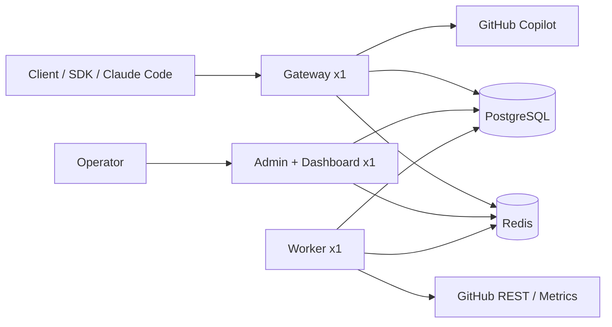
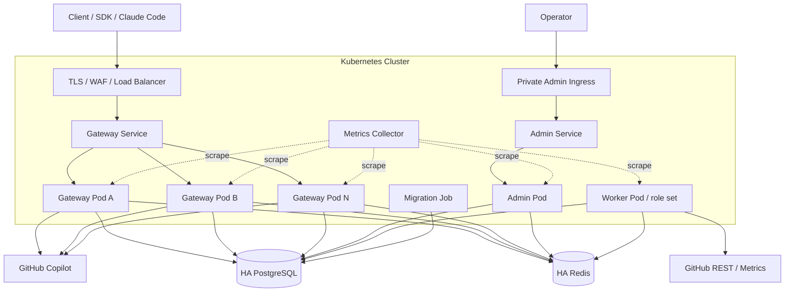
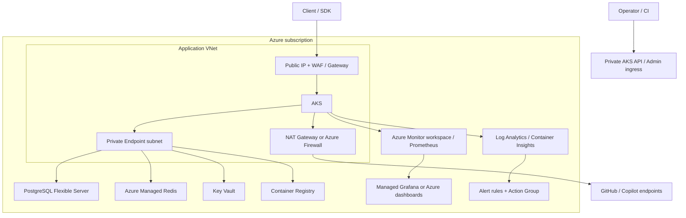

# 集群化改造参考方案

本文以仓库实现为基线，给出把 GHCP Pool Proxy 从单机 Docker Compose 改造成 Kubernetes 集群部署的技术思路、实施顺序和验收标准。仓库已完成第 1 至 6 阶段的应用、migration、Kubernetes、Redis protocol-v2、schema-19 contract 和 release identity 产物；`deploy/k8s` 提供 production、staging 与自包含 test overlay。自动扩缩容和目标环境生产验收仍是实施方案，不表示已经交付。

**当前状态：阶段 1 至 6 的应用、migration、Redis protocol-v2、Kubernetes 清单和本地回归均已完成。** 当前工作树还实现了 release-set manifest，以及有限的 `deploy/deploy-cluster.sh` + `deploy/azure/main.bicep` 基线：可交互创建或复用 VNet/subnet、AKS、PostgreSQL Flexible Server 与 Azure Managed Redis，并在 apply 前执行 what-if；本轮验证未创建或修改实际 Azure/Kubernetes 资源。目标环境的基础设施 HA、灾备、备份恢复演练、平台安全、Ingress/HPA、平台监控看板与告警仍由云服务商或运营方负责，且必须独立验收。

文中使用以下标记区分事实与方案：

- **当前**：可由现有代码、配置或部署产物验证的行为。
- **目标**：集群化完成后应达到的状态。
- **改造**：从当前状态到目标状态需要新增或调整的工作。

## 方案批准门禁

本文是设计提案和实施前评审材料，不是已批准的实施指令。在用户明确确认“计划完整并批准开始实施”之前，不得开始或保留以下产物和操作：

- 应用代码、migration、Dockerfile、Kubernetes manifest、Bicep/IaC、部署脚本或 CI/CD 实现。
- Azure/Kubernetes 资源创建、修改、what-if、apply、发布、迁移、压测或故障演练。
- 为实现预留但未在 Git 中体现的本地资源定义、Secret、参数文件或部署状态。

批准记录至少包含批准人、日期、批准范围、首个允许进入的阶段、目标 environment/profile、已接受例外、例外到期时间和复审日期。架构计划批准后才能开始阶段 1；Azure apply 仍需独立的 resolved plan、what-if 和环境发布批准。任何改变数据一致性、认证、网络暴露、生产 HA、RPO/RTO 或 destroy 边界的修改都使相关批准失效，必须重新评审。

门禁分为三层，不能相互替代：

1. **方案批准**：批准本文的架构边界、推荐默认值、工作顺序和失败条件，允许开始阶段 1；不要求此时已有 live Azure inventory、实现产物或环境测试证据。
2. **阶段 0 环境冻结**：为具体 subscription/region/profile 填入精确 API/SKU/CIDR/resource ID/SLO/cost/owner。只有对应 workstream 的值冻结后，才能生成可 apply 的 resolved plan；这类值可以在方案批准后继续保持 `proposed`。
3. **操作批准**：apply、release 和 destroy 分别批准绑定到精确 hash 的操作 artifact；旧批准不能授权新的 what-if、镜像、inventory 或删除列表。

因此，“计划完整”表示所有未知值都有明确 owner、默认建议、冻结时点、验证方法和失败行为，而不是在尚未实施时伪造测试结果。方案级决策随用户对本文的明确批准生效；环境级决策仍在阶段 0 逐项签署。

## 目录

- [集群化改造参考方案](#集群化改造参考方案)
  - [方案批准门禁](#方案批准门禁)
  - [目录](#目录)
  - [方案目标与边界](#方案目标与边界)
    - [目标](#目标)
    - [保持不变的业务边界](#保持不变的业务边界)
    - [平台边界](#平台边界)
  - [当前基线](#当前基线)
  - [计划交付物状态](#计划交付物状态)
  - [目标架构](#目标架构)
  - [Azure 部署基线](#azure-部署基线)
    - [资源范围与拓扑](#资源范围与拓扑)
    - [资源复用与创建契约](#资源复用与创建契约)
    - [部署档位与容量起点](#部署档位与容量起点)
    - [网络与私有访问](#网络与私有访问)
    - [Redis 客户端拓扑与高可用](#redis-客户端拓扑与高可用)
    - [Azure Managed Redis 兼容性](#azure-managed-redis-兼容性)
    - [Redis 持久化与可移植备份](#redis-持久化与可移植备份)
    - [身份密钥与镜像供应链](#身份密钥与镜像供应链)
    - [部署脚本与 IaC](#部署脚本与-iac)
    - [Azure 监控扩容与成本](#azure-监控扩容与成本)
    - [容易遗漏的生产前置项](#容易遗漏的生产前置项)
    - [实施输入与冻结清单](#实施输入与冻结清单)
  - [工作负载与副本策略](#工作负载与副本策略)
  - [共享状态与数据层](#共享状态与数据层)
  - [必须完成的应用改造](#必须完成的应用改造)
    - [Readiness 与 Router revision](#readiness-与-router-revision)
    - [优雅摘流](#优雅摘流)
    - [配置传播](#配置传播)
    - [本地缓存与排序状态](#本地缓存与排序状态)
    - [Usage 写入与请求身份](#usage-写入与请求身份)
  - [入口流量与 SSE](#入口流量与-sse)
  - [Kubernetes 资源设计](#kubernetes-资源设计)
    - [Pod 与容器](#pod-与容器)
    - [Service 与网络](#service-与网络)
    - [Migration Job](#migration-job)
    - [可用性资源](#可用性资源)
  - [Worker 多副本协调](#worker-多副本协调)
  - [配置与凭据传播](#配置与凭据传播)
  - [可观测性与扩缩容](#可观测性与扩缩容)
    - [运行目标与验收证据](#运行目标与验收证据)
    - [必备指标](#必备指标)
    - [Gateway HPA](#gateway-hpa)
    - [告警优先级](#告警优先级)
  - [发布、迁移与回滚](#发布迁移与回滚)
    - [Schema 兼容策略](#schema-兼容策略)
    - [Redis 状态协议兼容策略](#redis-状态协议兼容策略)
    - [发布顺序](#发布顺序)
    - [回滚原则](#回滚原则)
  - [仓库与交付策略](#仓库与交付策略)
  - [分阶段实施](#分阶段实施)
  - [故障语义](#故障语义)
  - [验收标准](#验收标准)
    - [正确性](#正确性)
    - [发布与故障](#发布与故障)
    - [Worker 与数据](#worker-与数据)
    - [性能与运维](#性能与运维)
  - [主要代码改造位置](#主要代码改造位置)
  - [待确认决策](#待确认决策)
  - [相关文档](#相关文档)

## 方案目标与边界

集群化首先解决单机进程故障、滚动发布和容量伸缩，不改变模型协议和账号池的产品语义。

### 目标

- 持久 `economy/production` 环境的 Gateway 至少双副本运行，单个 Pod 或节点退出时，新请求仍可进入其他副本；阶段 2 的单副本 `dev` 只做非 HA 等价验证。
- PostgreSQL 继续作为事实源，Redis 继续作为预算、并发 lease、sticky 和短 TTL 状态的共享层。
- 发布过程先迁移 schema，再滚动应用；Gateway 能先摘流、再等待活跃 SSE 请求结束。
- 发布集合固定为同一 Git SHA 构建的 `gateway-latest`、`admin-latest`、`worker-latest` 和 `migration-latest`。非敏感 `release-manifest.env` 绑定四个 immutable digest 与 target schema，且必须满足 `Compose schema = Kubernetes schema = release manifest schema`；VM 与 Kubernetes 都从该 manifest 使用 digest 后才执行 migration 和 rollout。
- 配置、凭据失效和 Router 版本在副本间可观测地收敛。
- Worker 从单副本安全运行起步，在任务 claim 和租约机制完成后再按任务类型扩容。
- 应用以结构化 stdout 写入平台日志管道，并暴露运行健康和依赖状态；平台负责查询、看板、告警、保留和成本控制。

### 保持不变的业务边界

- 对外仍提供 `/v1/chat/completions`、`/v1/responses` 和 `/v1/messages`。
- Client profile 仍固定归属一个 pool；集群化不增加账号级模型权限识别，权限不同的账号仍需拆分 pool。
- Provider 失败仍直接返回映射后的错误，不在入口或 Gateway 中透明换账号重放模型 POST。
- sticky 是 Redis 中的软亲和，不要求负载均衡器使用 cookie 或源 IP 会话保持。
- 初始方案不包含多地域写入、跨集群一致性、通用策略引擎或租户级 BI。
- 不包含基础设施可用区/跨区域拓扑、数据库或 Redis 副本运维、备份恢复、灾备演练、WAF/网络/RBAC/密钥管理等应用外安全防护，也不交付 HPA、日志查询或 Dashboard。

### 平台边界

方案以标准 Kubernetes 能力为应用层基准，优先交付 Azure 实现：AKS 承载无状态 Gateway/Admin/Worker，Azure Database for PostgreSQL Flexible Server 与 Azure Managed Redis 位于 AKS 生命周期之外。PostgreSQL 和 Redis 不作为持久 profile 的 in-cluster StatefulSet 部署，也不使用 AKS PVC 承载其生产数据。唯一例外是已实现的 disposable `deploy/k8s/overlays/test`：它以 `emptyDir` 启动单 PostgreSQL 与单 Redis，只用于 CI、migration 和协议功能验证。

Azure、其他云或自建 Kubernetes 只要提供应用可连接的 Kubernetes、PostgreSQL、Redis 和日志管道，即可映射本运行契约。资源创建、节点/可用区/副本 HA、网络与安全、备份恢复和 Log Analytics 查询/看板属于平台/运营职责；本项目只要求这些依赖可用并通过应用 health/readiness 反映状态。

## 当前基线

下表记录当前代码基线。Gateway 已把权威和跨实例协调状态外置到 PostgreSQL/Redis；阶段 1 至 6 的仓库级交付和本地验证均已落地。表中的“主要缺口”只描述目标环境、平台或尚未承诺的扩展能力。

| 组件 | 当前实现 | 对集群化的意义 | 主要缺口 |
| --- | --- | --- | --- |
| Gateway | 无业务数据卷的数据面进程；`/readyz` 要求 PostgreSQL、Redis coordination protocol 与已加载的 Router snapshot；draining 后停止接流并 flush usage writer | Pod 可替换；权威状态与跨实例裁决不依赖进程内存 | 目标 staging/production 仍需验证入口、SSE drain 和节点故障容量 |
| Router | PostgreSQL 事实源的完整 snapshot，Redis invalidation 加速、30 秒轮询兜底；本地 reservation/排序只作优化 | 配置读取可本地化，Redis binding/concurrency 仍是跨 Pod 最终裁决 | round-robin 仍是近似全局公平；若业务要求严格全局顺序，需单独引入共享游标 |
| Budget / concurrency | Redis protocol-v2 的幂等 reservation/finalization、`{budget}` 同槽 Lua 与 owner-safe concurrency lease | 所有 Gateway 共享预算和并发硬门禁，Redis 不可用时 fail closed | 选定托管 Redis 的 failover、容量与恢复边界仍需目标环境验收 |
| Redis client | 显式 `single`、`sentinel`、`cluster` factory；TLS/SNI、拓扑 health、per-primary inventory、版本化 key/Lua/manifest | 同一 Gateway 镜像可连接非分片或 Cluster Redis，且 Cluster writer 不使用 v1 key | Azure 服务选择、Entra token 认证和生产 HA 运维仍属平台 workstream |
| Sticky / binding | PostgreSQL 持久 binding 加 Redis generation-aware reservation/tombstone 与 cache-aware affinity | 不依赖入口 session cookie；跨 Pod create/release/expiry 可幂等收敛 | 仍需目标环境的长时、多副本流量证据 |
| Token cache | 最长 30 秒本地 token cache；Redis 可续租 owner lease、Pub/Sub 失效与 PostgreSQL credential version CAS | 本地缓存可丢失或滞后，不会覆盖更新后的凭据 | 真实 Copilot 限流、凭据轮换和长时接管仍需环境演练 |
| Admin | 单进程 Dashboard 与 Admin API；已有独立 `/healthz`、`/readyz`；metrics/seat POST 仅创建或复用 durable request 并返回 `202 + status_url` | 主要状态写入 PostgreSQL，探针可供 Kubernetes 使用 | Admin 仍是单副本；跨副本设备授权和管理面会话需要在扩容前单独验证 |
| Worker | general Worker 与专用 `metrics-sync` Worker 分离；组织同步使用 PostgreSQL request claim/fence、snapshot unique upsert、seat generation 和 maintenance lease | 任务 owner 可在 Pod 消失后由 lease takeover；专用 role 可最小化 GitHub token Secret 暴露 | 仍需在目标 staging 进行多副本故障接管与外部 GitHub 限流验收 |
| Usage writer | PostgreSQL provider-attempt journal、schema-19 ledger identity 与 Redis budget reservation/recovery；进程内批队列只负责 materialization 优化 | 模糊提交可按 attempt identity 处理；异常 dispatch 保守保留 reservation，不重放模型 POST | 目标环境仍需冻结 usage durability/RPO 和容量阈值 |
| 部署 | VM/local Docker Compose；Kustomize production、staging 与自包含 `test` overlay；独立 migration Job；release manifest digest rewrite | Compose 继续作为功能回归基线；`make k8s-test` 覆盖无外部数据服务的单节点等价路径 | 尚未交付 Ingress、HPA、Azure IaC、平台级流水线和目标环境多副本验收 |



当前 VM 运行包由 `deploy/deploy.sh` 和 `deploy/docker-compose.vm.yml` 启动一个 Gateway、一个 Admin、一个 Worker、PostgreSQL 和 Redis；启动前会校验 bundled `release-manifest.env` 的 schema，并直接拉取四个 manifest digest。本地开发使用 `start.sh` 与 `deploy/docker-compose.yml`。这两种方式以及 K8s `test` overlay 都是功能回归基线，不等同于持久多副本验收环境。

2026-08-20 本地 Compose 基线维护：开发 Compose 的 migration target/phase 现分别默认跟随当前 schema `19` 与 `expand`，因此直接运行 `docker compose ... ps/exec/logs` 不再要求先导出只供 migration 使用的变量；`start.sh` 的显式迁移值仍覆盖默认值。`env -u MIGRATION_TARGET_VERSION -u MIGRATION_PHASE docker compose -f deploy/docker-compose.yml config --quiet`、`ps` 和 active-credential PostgreSQL `exec` 查询均通过。`scripts/release_parity_validate.sh` 新增默认 target 与 `migrations/schema_version` 一致性断言；完整 `make release-validate`、VM、Redis Cluster 和 Kubernetes 门禁本次未运行。下一最小步骤是在下次 schema 升级时由 release parity 同步阻止 Compose 默认值漂移。

## 计划交付物状态

下表区分已提交的仓库产物与仍待环境批准的交付。已提交的 Kubernetes 清单仅可通过渲染和受控集群验证；它们不表示已经创建了任何 Azure 或 Kubernetes 资源。

| 产物 | 当前状态 | 计划目标 | 解锁条件 | 验收证据 |
| --- | --- | --- | --- | --- |
| `docs/plans/cluster-deployment.zh.md` | 集群化架构、阶段、门禁和验收事实源 | 维护环境冻结与后续阶段的批准边界 | 进入 Azure/生产 workstream 前更新批准记录 | 批准记录与文档 commit |
| `deploy/azure/main.bicep` | 已提交有限 resource-group 基线：VNet/三个 subnet、AKS、PostgreSQL、Managed Redis、Private DNS/Endpoint 可按 create/reuse 输出统一 ID | 完整 subscription-scope 模块、监控、身份、Ingress/Egress、备份与 evidence inventory 仍是后续目标 | 目标环境冻结 region/SKU/CIDR/ownership 后才可 apply | Bicep build、交互 dry-run；目标环境另需 ARM validate/what-if 与网络验收 |
| `deploy/deploy-cluster.sh` | 已提交 local Kind 与有限 Azure 交互入口；检查/安装前置组件、验证复用 ID、执行 what-if、写中心 Secret 并调用有序 rollout | 完整 doctor/签名 plan/inventory/destroy/恢复编排仍是后续目标 | 实际 apply 仍需独立环境与操作批准 | shell lint、fake Azure reuse/create render、脱敏参数与目标环境 smoke |
| `deploy/k8s/` | 已提交 production、staging、test Kustomize overlay、Deployment/Service、Migration Job、NetworkPolicy、PDB、可选 ServiceMonitor 和 release-manifest digest rewrite | test 可在集群内运行一次性 PostgreSQL/Redis；持久环境继续使用外部数据服务；HPA/生产多副本留待后续阶段 | 选定集群、CNI、外部数据服务与 Secret 系统后执行持久环境验证 | `make k8s-validate`、`make release-validate`、`make k8s-test`、三节点 staging/Redis Cluster 回归 |
| Migration image/runner | 已提交 `cmd/migrate`、manifest runner 与独立最小权限 migration image/Job | 空库与升级路径使用单 session lock runner | 发布环境提供 DDL DSN Secret | 空库/legacy/部分失败/并发 Job 测试 |
| 集群应用改造 | 阶段 1 正确性改造已提交：readiness、draining、原子预算、凭据 CAS、协调 epoch 与 Worker roles | 多副本与平台故障演练留待后续阶段 | 选定环境的等价回归 | 单元、集成、故障注入和多副本验收 |
| Azure/Kubernetes 实际资源 | 未由仓库或本轮工作创建 | 经批准的环境资源 | 独立 resolved plan、what-if 与环境发布批准 | deployment output、inventory、health 与 smoke 证据 |

本轮只审查仓库和文档；没有读取任何 live Azure subscription/resource inventory、quota、Policy、价格报价或实际 `what-if`。文中的 Azure 能力与 sizing 仅是待验证建议，不能作为已有资源、区域可用性或成本承诺的证据。

## 目标架构



目标拓扑遵循以下原则：

1. Gateway、Admin 和 Worker Pod 不挂载业务数据卷；Pod 被替换后只从 PostgreSQL、Redis 和启动配置恢复。
2. PostgreSQL 与 Redis 位于应用 Pod 生命周期之外，并具备备份、故障切换、连接加密和容量监控。
3. Gateway 与 Admin 使用不同入口。Admin 入口应限制到管理网络或身份代理，不与公开模型流量共用暴露策略。
4. Migration 是发布流水线中的一次性 Job，使用与应用同一 commit 构建的专用 migration 镜像，不由每个应用 Pod 在启动时并发执行。
5. 所有镜像使用不可变 tag 或 digest；同一轮发布中的 Pod 使用一致的 schema 兼容范围和凭据密钥版本。

## Azure 部署基线

Azure 是首个支持的集群平台实现，但 Azure 资源编排与 Kubernetes 应用清单保持分层：Bicep 管理 Azure control plane 资源，Kustomize 管理 namespace 内工作负载。AKS 不承载 PostgreSQL 或 Redis 数据卷。

### 资源范围与拓扑



完整平台编排的目标资源范围如下。未来目标接口 `cluster_deploy.sh` 对每项都支持显式 `create` 或 `reuse`，可选资源支持 `skip`；当前有限入口只覆盖前述 VNet/subnet、AKS、PostgreSQL 与 Managed Redis，且同样不得仅凭同名资源自动判定复用。

| 资源 | 默认目标 | 可复用输入 | 必须验证的契约 |
| --- | --- | --- | --- |
| Resource Group | 每环境独立，或复用受控 RG | resource ID/name | region、Azure Policy、锁、标签和部署权限 |
| AKS | AKS Standard mode；生产使用 Standard pricing tier | AKS resource ID | OIDC/Workload Identity、网络插件、API 可达性、node pool 容量、升级版本和监控能力 |
| VNet/subnet | 应用 VNet，至少区分 AKS node 与 private endpoint subnet | VNet/subnet resource ID | CIDR 不重叠、剩余地址、NSG/UDR、DNS、peering 和创建 private endpoint 的权限 |
| PostgreSQL | Azure Database for PostgreSQL Flexible Server | server resource ID | engine/schema 兼容、TLS、网络模式、HA、备份、连接上限、维护窗口和 migration 权限 |
| Redis | Azure Managed Redis create/reuse；集群外 Redis/Sentinel/Cluster 仅 reuse | Azure database resource ID，或签名的 external service contract URI | client mode、TLS/DNS、policy/keyspace、HA owner/quorum、slot/replica、可用内存、连接/吞吐、认证、网络可达性和 failover evidence |
| Redis export landing | 独立、只用于 Import/Export 的 Storage account/container | storage/container ARM ID | public endpoint 服务限制、禁止匿名访问、SAS 生命周期、空容器隔离、landing retention 和清理告警 |
| Redis backup archive | workload 生命周期之外的私有、不可变 Storage container | storage/container ARM ID | Private Endpoint、RBAC、versioning、soft delete、GRS/GZRS、immutability/retention 和 restore staging 权限 |
| ACR | 每组织或环境复用/创建 | registry resource ID | AKS kubelet identity 有 pull 权限、禁用匿名拉取、镜像 digest 和网络可达性 |
| Key Vault | 每环境创建或复用 | vault resource ID | RBAC、purge protection、private access、CSI/Workload Identity 和密钥轮换权限 |
| Deployment evidence store | 独立 bootstrap stack 中的受保护 Storage container + Key Vault signing key | storage/container ARM ID、versionless key URI | Entra-only data plane、versioning、soft delete、immutability/retention、签名验证、break-glass 和跨本地状态恢复 |
| Log Analytics | 可按区域/组织复用 | workspace resource ID | 数据驻留、retention、daily cap、DCR 和写入权限 |
| Azure Monitor workspace | Managed Prometheus 指标库 | workspace resource ID | region、AKS data collection endpoint/rule 和 Grafana/告警读取权限 |
| Managed Grafana | 生产建议，可选 | workspace resource ID | Entra RBAC、private access、数据源链接和审计日志 |
| Action Group | 所有持久环境必需 | action group resource ID | 接收人/系统、严重度路由、抑制和演练流程 |
| Gateway Ingress/WAF | 按模型 API 的公网/私网需求独立选择 | gateway/frontend/WAF resource ID | SSE buffering、idle timeout、请求体限制、TLS 证书、WAF 例外和 drain 行为 |
| Admin Ingress/identity proxy | 默认私网，与 Gateway 入口独立 | gateway/frontend/proxy resource ID | Entra/OIDC、管理网络、独立 TLS/DNS/WAF、短请求 timeout、审计和 emergency revoke |
| 固定出站 | NAT Gateway；受限网络使用 Azure Firewall | NAT/Firewall resource ID | 公网 IP、SNAT 容量、FQDN 规则、日志和 GitHub/Copilot 可达性 |

环境之间默认隔离 PostgreSQL、Redis、Key Vault 和 namespace。共享 AKS、ACR、VNet、监控 workspace 可以降低成本，但必须通过 namespace、RBAC、NetworkPolicy、配额、日志维度和资源命名防止跨环境影响。生产与 dev/test 不共享 PostgreSQL 或 Redis。

### 资源复用与创建契约

复用不是“资源存在即可”。脚本在 what-if 前执行只读检查，并生成一份不含 Secret 的 resolved plan：

1. 验证 tenant、subscription、resource provider、region、SKU/feature availability、quota 和 Azure Policy assignment。
2. 对复用资源校验 ARM resource ID、类型、provisioning state 和调用者权限；名称搜索只用于提示，不作为选择依据。
3. 验证 AKS/VNet/PostgreSQL/Redis 位于可互通网络；创建前检查 CIDR、Private DNS link、UDR 和 peering，不自动修改未声明管理权的共享网络。
4. 对复用 AKS 验证受支持 Kubernetes 版本、OIDC issuer、Workload Identity、NetworkPolicy、Secrets Store CSI、node pool min/max、可调度余量和私有 API 运维路径。
5. 对复用数据服务执行 TLS/DNS/认证探测和只读能力检查；数据库 migration 使用独立身份，不能复用应用 DML 账号。
6. 对复用监控资源验证写入与查询 RBAC、retention 和 cost cap；只有显式允许时才为复用资源新增 diagnostic setting 或 alert。
7. 为新建资源加统一 `environment`、`application`、`owner`、`costCenter`、`managedBy` 和 `deploymentId` 标签；复用资源不擅自覆盖原标签或资源锁。
8. destroy 只处理本次 deployment ID 明确创建的资源；复用资源、共享 RG/VNet/workspace 和其中其他对象永不级联删除。

三种 ownership mode 的语义必须固定：

- `create`：IaC 对资源及明确列出的子资源负责，允许在后续部署中更新；deployment inventory 记录完整 ARM ID、模板 hash、父资源、保护策略和创建时间。
- `reuse`：Azure 资源引用完整 ARM ID，Kubernetes 对象引用本文定义的 canonical object key，默认只读；任何受管 child 都必须另有精确 target key/type/action 的 time-bound management grant，不允许 `manage-reused-*` wildcard 或“同类资源”等隐式范围。
- `skip`：不创建、不引用也不配置该能力。任何下游依赖仍要求 endpoint、DNS、identity 或 alert destination 时必须在 plan 阶段失败，不能生成空值后继续 apply。

Parent mode 不向 child 传播所有权。复用 parent 下新建的 child 记录 `ownership=deployment`、`createdByDeploymentId` 和自己的 deletion policy；只可更新/删除该精确 child，不能修改或删除 parent。既有 child 使用 `ownership=external`，默认 `action=none/deletionPolicy=Retain`。每次 plan 为所有 entry 计算有限集合 `action=none|create|update|replace|delete`；`replace/delete` 还要验证反向依赖为空、management grant 未过期和 owner 批准。父子 mode、依赖闭包或授权冲突时 fail closed。

首版 management grant 对 `ownership=external` 只允许精确字段的 `update`；不允许 `replace/delete`，workload destroy 永不删除 external entry。若要移除外部对象，必须由其原 owner 在本 deployment 之外执行独立变更。复用 parent 下由本 deployment `create` 的 child 属于 deployment，可按自己的批准与 deletion policy 删除。

资源清单必须覆盖所有独立 ownership 与销毁边界，不能只记录顶层服务：

| 范围 | 必须单独记录的资源 |
| --- | --- |
| 身份与授权 | user-assigned identity、federated credential、role assignment、Kubernetes ServiceAccount/RoleBinding |
| 网络 | VNet、subnet、NSG、route table/UDR、NAT Gateway、public IP、Firewall、Private Endpoint/connection、Private DNS zone/link、DNS resolver/ruleset |
| 数据与密钥 | PostgreSQL server/database、Redis cluster/database、Redis export landing/archive account/container、Key Vault、secret/certificate 引用、backup/restore policy、immutability policy、resource lock |
| 镜像与入口 | ACR、pull/push role、WAF policy、gateway/ingress、frontend IP、DNS record、certificate ownership |
| 监控 | Log Analytics、Azure Monitor workspace、DCE、DCR、DCRA、diagnostic setting、alert rule、Action Group、dashboard/Grafana link |
| Kubernetes | target cluster fingerprint、namespace、quota、NetworkPolicy、Deployment/Job/Service、ServiceAccount/RBAC、PDB、HPA、monitoring object 和发布 revision |

同一 environment 的 plan/apply/destroy 使用部署锁和 immutable resolved-plan hash 防止并发操作。Azure destroy 只能按 inventory 中 `ownership=deployment` 且与当前 tenant/subscription/deployment ID/template lineage 匹配的完整 ARM ID 删除；禁止根据名称、标签或前缀推断所有权。

Resolved inventory 的公共字段至少包含 `schemaVersion`、`environment`、`logicalName`、`provider=arm|kubernetes|external`、`resourceType`、`resourceKey`、`parentResourceKey`、`mode=create|reuse|skip`、`ownership=deployment|external`、`action`、`managed`、`createdByDeploymentId`、`managementGrantId`、`dependencies[]`、`deletionPolicy`、`deploymentId`、`templateHash`、`parameterHash`、`createdAt` 和 `lastVerifiedAt`。ARM entry 的 `resourceKey` 是规范化完整 ARM ID；Kubernetes entry 使用 `clusterFingerprint/apiGroup/version/kind/namespace/name`，cluster-scoped 对象用 `_cluster` namespace，并另存 `clusterArmId`、`kubeSystemNamespaceUID`、apply 后的 `objectUID`、`fieldManager` 和 `manifestHash`。`clusterFingerprint` 由 AKS ARM ID 与 `kube-system` namespace UID 组成，可识别同名 AKS 重建。External entry 仅允许 `mode=reuse`、`ownership=external`、`action=none`、`deletionPolicy=Retain`，`resourceKey` 是签名 contract 的 content-addressed URI/digest；contract 保存脱敏 topology、CA fingerprint、HA/SLA owner 和验证方法，Secret 仍只由 Key Vault 引用。顶层 shorthand 只能帮助输入；plan 必须把 agent pool、Private Endpoint/zone group、DNS link、federated credential、RBAC、DCE/DCR/DCRA、diagnostic setting、alert、Gateway/Admin ingress、证书、DNS record 和每个 Kubernetes 对象展开成独立 inventory entry，再允许 apply。

Kubernetes apply/destroy 只能连接 inventory 指定且 fingerprint 完全匹配的 cluster。删除前从 API server 重新读取对象并同时验证 `objectUID`、deployment lineage annotation、field manager/manifest ownership 和 deletion policy；名称相同但 UID 不同、对象被外部接管或 hash/managed-field 冲突时拒绝，不删除“后来重建”的对象。Namespace 默认 `Retain`；只有 inventory 证明由本 deployment 创建、其中不存在非本 deployment 对象且有独立 delete approval 时才可删除。Kubernetes 对象不经过 ARM what-if，因此脚本必须生成独立 server-side dry-run/diff 和精确 delete manifest，并把其 hash 一并绑定 operation approval。

权威 inventory、resolved plan、what-if、deployment output 和验收 evidence bundle 保存到阶段 0 选定的受保护 Azure Storage artifact container：该 storage account 位于工作负载 deployment/destroy 边界之外，启用 Entra RBAC、blob versioning、soft delete 和生产 retention/immutability；本地 `.cluster-deploy/` 只作可删除缓存，Azure deployment history 只作交叉核对。若权威 inventory 丢失、签名/hash 不匹配或无法与 Azure 实际资源 reconciliation，`destroy` 必须拒绝，不能从标签或名称重建后直接删除。

Evidence store 通过独立、显式批准的 `bootstrap-evidence` stack 创建或复用，不允许 `skip`，也不属于任何 workload environment destroy。版本控制的非敏感 environment registry 固定 tenant/subscription、storage/container ARM ID、versionless signing-key URI 和公钥 fingerprint；bootstrap 完成后先上传并 read-back 验证自身 inventory，才允许 workload plan。签名使用 Key Vault 中 non-exportable P-256 key 与 `ES256`，manifest 保存完整 `kid`/key version；验证端信任 registry 中的公钥 fingerprint。轮换时 registry 同时信任 old/new key，重签活动 inventory 后再撤销旧 key。若本地缓存丢失，registry 定位 blob versions，签名与 Azure 实际资源 reconciliation 后只能恢复 plan/validate；apply/destroy 仍需新的操作批准。

如果资源位于不同 subscription，脚本还必须检查 provider registration、跨 subscription Private DNS link/RBAC 和策略限制。不同 tenant 的资源复用不作为首版支持范围。

### 部署档位与容量起点

下面是首轮压测前的起始值，不是容量承诺。Azure SKU 会随 region、quota 和代际变化，脚本必须在部署时解析当前可用 SKU，不能静默替换为更贵或不具备相同可靠性的规格。

profile 只提供建议起点，不是可直接 apply 的模糊规格。每次 resolved plan 必须冻结精确 SKU、API version、Kubernetes version、zone、节点数、存储、备份、连接上限和价格估算；不可用时 plan 失败并要求重新批准，不能自动选择“同级”资源。

| 项目 | `dev` | `economy`（非严格生产） | `production` |
| --- | --- | --- | --- |
| 适用范围 | 开发、CI、短期验证 | 可接受维护中断和数据面短时不可用的小流量环境 | 有明确 SLO、告警和值班的生产环境 |
| AKS pricing tier | Free，无 control-plane SLA | Free 或显式选择 Standard；必须记录是否接受无 SLA | Standard；需要 LTS 才选 Premium |
| AKS node pool | 1 个 combined system 节点；仅用于单节点功能验证 | 2 个 system 节点，必要时增加 user pool | 由运营方选定 worker node、可用区与扩缩策略；应用只要求 Gateway 可跨节点部署 |
| AKS VM 起点 | 当前 region 可用、满足 system pool 规则的最小非 B-series 4-vCPU SKU，通常从 D4as/D4ds 同级测试 | D4as/D4ds 同级起步，按 SSE 并发加 user pool | 最新 GA D4ds/D8ds 同级起步，以负载测试和 zone 容量决定 |
| Gateway | 1 副本，仅功能验证 | 2 副本；PDB 只能防自愿中断，不能弥补节点不足 | 最少 3 副本并跨 node/zone；HPA 上限受数据层连接预算约束 |
| PostgreSQL | Burstable B1ms/B2s 同级、32 GiB、HA off、7 天备份 | Burstable B2ms 同级、64 GiB、HA off、7-14 天备份 | General Purpose 2-4 vCore 起步、128 GiB 起、zone-redundant HA、14-35 天备份 |
| PostgreSQL pool | 不使用内置 PgBouncer，严格限制应用总连接 | Burstable 不支持内置 PgBouncer；按最大 Pod 数硬算连接预算 | 启用并压测内置 PgBouncer，应用 DSN 使用 pooler 端口；保留直连 migration endpoint |
| Managed Redis | `B0` 1 GiB，仅单节点测试；不要求 HA | `B3` 3 GiB、HA 双节点起步 | `B5` 6 GiB 到 `B10` 12 GiB、HA 双节点起步；只有 benchmark 证明需要分片时才启用 Cluster |
| Redis 容量 | 允许测试数据随环境销毁 | `B3` 3 GiB；以 observed memory、ops 和 p95 决定是否升档 | `B5` 6 GiB（约 500 RPS）至 `B10` 12 GiB（约 1000 RPS）；同时满足 `peak_used / 0.8 * 1.3`、ops、带宽和连接限制 |
| Redis durability | 允许测试数据随环境销毁；Redis 热状态可由 PostgreSQL 重建 | 由运营方决定 persistence/export | 由运营方决定 persistence/export、备份和恢复策略；应用不以 Redis RDB 作为权威事实 |
| 网络 | 可用受限公网入口；数据服务仍优先 private endpoint | 固定出站，API server 限制来源；数据服务 private | private AKS API、private endpoint、受控 FQDN egress、WAF 和跨 zone |
| 日志与监控 | 应用 stdout 写入 Log Analytics；单节点功能测试可使用最小日志配置 | 同左；平台决定查询、看板、告警和保留 | 同左；平台决定 Log Analytics、仪表板、告警与容量策略 |

`dev` 的单 Gateway 配合单节点 Kubernetes、单 PostgreSQL 和单 Redis 是受支持的功能等价、CI 或短期验证档；它明确不提供应用冗余或节点故障容量保证。持久环境应至少双 Gateway 并跨节点部署；节点/故障域的基础设施 HA 由运营方负责。

`deploy/k8s/overlays/test` 是该功能验证档的自包含实现：它以 `emptyDir` 启动集群内单 PostgreSQL、单 Redis，Service DNS 与 Docker Compose 保持为 `postgres:5432`、`redis:6379`，并复用同一 migration 与应用 base。该例外只适用于 disposable test/CI；production、staging 和任何持久 profile 仍要求集群外、由运营方负责的 PostgreSQL 与 Redis。

约束说明：

- AKS Free 适用于 dev/test，不提供 financially backed uptime SLA；任何 `economy` 使用都必须由业务方接受该风险。生产使用 Standard pricing tier。
- AKS system pool 不使用 B-series。生产至少两个 system node，建议三个；VM 起点至少满足当前 AKS 的 system pool CPU/内存限制。
- PostgreSQL Burstable 使用 CPU credit，持续负载可能造成超时；必须监控 `CPU Credits Remaining`。它不支持 Flexible Server 内置 PgBouncer，因此只适合低并发和可中断环境。
- PostgreSQL storage type、网络模式和部分备份选项创建后不易或不能变更；storage 只能扩不能缩。启用 autogrow 不能替代容量告警。
- Azure Managed Redis 参考价格页显示 Balanced `B0/B3/B5/B10` 为 1/3/6/12 GiB；页面建议所有 production 场景开启 HA 双节点，且 B0/B1 可能不具备全部能力。服务约保留 20% 内存；部分缩容路径不受支持，选型时不要只看当前数据量。
- Managed Redis persistence 依赖 HA，因此 non-HA profile 必须拒绝 RDB/AOF。生产 RDB `1h` 与 daily Export 是不同恢复层，cost/sizing artifact 必须分别计算性能影响、landing/archive 存储、跨区复制和 restore drill。
- B0/B1 等小 Redis SKU 的 CPU/Server Load 百分比对短任务较敏感，应结合 p95 latency、ops/sec、连接、eviction 和持续窗口判断，不因单点尖峰盲目扩容。

容量评估至少采集以下基线，再决定生产 SKU：

| 范围 | 必测输入 | 扩容依据 |
| --- | --- | --- |
| Gateway | request rate、active request/SSE、首 token 与总时长、CPU/内存、queue depth | 目标并发/单 Pod 安全并发，保留一个节点或一个 zone 的故障余量 |
| PostgreSQL | 总连接、acquire latency、TPS、慢查询、IOPS、storage growth、WAL/backup | 最大副本连接预算、p95 query latency、存储/IO 水位和 HA failover 表现 |
| Redis | used memory、ops/sec、CPU、server load、latency、connections、evictions | `nominal_memory >= peak_used / 0.8 * 1.3`，同时满足连接与带宽限制 |
| 网络 | 出站连接、SNAT port、SSE 时长、Ingress/NAT/Firewall throughput | 最大并发连接与 scale-out 后总 SNAT 消耗，避免只按 Mbps sizing |
| 账号池 | 可用账号、账号并发、预算和 provider rate limit | 账号容量不足时扩 Pod 无效，应扩账号池或限流 |

### 网络与私有访问

建议的地址空间至少预留以下子网；实际 CIDR 由企业 IPAM 决定，并给节点升级 surge、node autoscaler、private endpoint 和未来 peering 留余量：

- `snet-aks-nodes`：AKS node IP。Azure CNI Overlay 的 pod CIDR 与 VNet、service CIDR、on-prem 和 peered VNet 均不得重叠。
- `snet-private-endpoints`：Managed Redis、Key Vault、ACR，以及选择 Private Link 模式时的 PostgreSQL endpoint。
- `snet-postgresql`：仅在 PostgreSQL private access/VNet integration 模式使用，委派给 `Microsoft.DBforPostgreSQL/flexibleServers`；最小 `/28`，生产按 HA、replica 和增长预留更大空间。
- `AzureFirewallSubnet`：只有选择 Azure Firewall 时创建，名称和最小 CIDR 遵循 Azure 约束。

PostgreSQL 网络模式必须在创建前明确选择，不能在脚本中模糊切换：

- **Private Endpoint 模式**：适合已有 hub/spoke 和集中 private endpoint subnet；关闭 public network access，管理 private endpoint approval 与 Private DNS link。
- **Private access/VNet integration 模式**：服务注入专用 delegated subnet，没有公网入口；该 subnet 不能放其他资源，创建后不能移动到其他 VNet/subnet，也不能事后扩大地址段。
- 两种模式都使用服务 FQDN连接，不把 private IP 写入 DSN。跨 VNet/订阅复用时必须验证 Private DNS zone link 和自定义 DNS 转发。

Azure Managed Redis 使用 `<name>.<region>.redis.azure.net:10000` 和 TLS。使用 Private Link 时仍连接正常服务 FQDN，由 `privatelink.redis.azure.net` 私有区域解析；不得把 `*.privatelink.redis.azure.net` hostname 或 private IP 写入应用配置。

Service Tag 与 FQDN 规则分工如下：

| 流量 | 推荐控制 |
| --- | --- |
| AKS 平台依赖 | 按 AKS outbound requirements 使用 `AzureKubernetesService` FQDN tag、region-scoped Azure 服务规则及所启用 add-on 的明确依赖 |
| Azure Monitor | `AzureMonitor` service tag 加官方列出的 ingestion/control FQDN；网络隔离集群优先使用 Azure Monitor Private Link ingestion |
| Entra/ARM | 只在使用 Workload Identity、Entra data-plane auth 或 ARM 操作的组件放行对应 Entra/Resource Manager 依赖 |
| PostgreSQL delegated subnet | subnet 内 5432、region-scoped `Storage` 和使用 Entra 时的身份端点，遵循 Flexible Server 官方 NSG/UDR 要求 |
| ACR/Key Vault/Redis/PostgreSQL | 优先 Private Endpoint + Private DNS；不因已有 private endpoint 再开放宽泛公网 service tag |
| GitHub/Copilot | Azure 没有可替代这些第三方域名的 service tag；通过 Azure Firewall/application proxy 的 FQDN allowlist，来源取运行配置与官方 endpoint 清单 |

生产出站至少提供一个可追踪的固定公网 IP。普通环境可使用 NAT Gateway；需要域名过滤、集中审计或跨 spoke 控制时使用 Azure Firewall/受管 egress。必须核算 SNAT port，长 SSE、Gateway 扩容和上游 keep-alive 会占用长期连接。NetworkPolicy 继续限制 Pod 级东西向/南北向流量，但它不能替代 Azure Firewall 的第三方 FQDN 控制。

resolved plan 必须列出每个 Private DNS zone 的精确 ARM ID、record/zone-group owner、所有 VNet link、custom resolver/ruleset/forwarder 和删除策略，并保存所采用 Azure service-tag JSON、AKS outbound requirements、GitHub/Copilot endpoint 清单的来源 URL、发布日期或下载时间与 checksum。验证从 Gateway/Admin/Worker/Migration 各网络边界执行正常 FQDN 的 private-IP 解析、TLS/SNI、禁止公网解析的 negative test，并从实际 Pod 请求受控回显端点记录 observed public egress IP；期望 IP 不等于已经验证的出口。

Ingress 需要独立决策公网或私网、WAF、证书来源和 DNS。无论选择 Application Gateway for Containers、Gateway API 实现或其他受支持入口，都必须通过实际 SSE 测试验证 response buffering、idle timeout、32 MiB 请求体上限、client cancellation、WebSocket 无关配置和 rolling drain，不能只验证普通 GET。

首版公网 Gateway 的默认候选固定为 Application Gateway for Containers 的 BYO lifecycle + Gateway API：官方能力包含 WAF 与 SSE，`HTTPRoute.timeouts.request` 为 `0s` 时允许长请求；但其 HTTP/stream idle timeout 与 scale-in 未完成连接的 drain 上限当前均为 5 分钟。阶段 0 必须固定所用 region/API/controller version，并以官方 [产品能力](https://learn.microsoft.com/azure/application-gateway/for-containers/overview) 和 [SSE 行为](https://learn.microsoft.com/azure/application-gateway/for-containers/server-sent-events) 的当日 snapshot 为依据。若三协议真实流存在超过 5 分钟的合法静默、客户端不能接受经验证的 SSE comment heartbeat，或 drain 目标超过产品上限，则拒绝该候选，改选经同等 WAF/SSE 测试的 GA edge 并重新批准，不能靠放宽应用声明绕过。Admin 不共享该公网 frontend；它保持 private ingress + Entra/OIDC 身份边界。

### Redis 客户端拓扑与高可用

Redis 的“是否分片”与“是否高可用”是两个独立维度。`single` 表示客户端看到一个非分片写入口，不代表服务物理上只有一个节点；Azure Managed Redis `NoCluster + HA` 仍有服务管理的副本和故障切换。反过来，配置多个地址也不自动代表高可用：地址可能是 Sentinel seed、Cluster seed，也可能只是错误地列出多个独立实例。

同一应用镜像支持三种显式 client mode，每个进程只绑定一个 Redis 数据集，不在请求路径做跨 mode 双写或客户端侧主备切换：

| `REDIS_CLIENT_MODE` | 构造与发现 | Keyspace 语义 | HA owner | 支持范围 |
| --- | --- | --- | --- | --- |
| `single` | `redis.NewClient` 连接一个稳定 endpoint | nonsharded；v1 可运行现有 cross-key Lua，v2 使用统一 cluster-safe protocol | `none` 或托管服务 | 本地/Compose 单实例；Azure `NoCluster + HA` 等服务端隐藏 failover 的托管 endpoint |
| `sentinel` | `redis.NewFailoverClient` 使用 Sentinel seed 和 master name 发现当前 primary | nonsharded；与 `single` 使用同一 active protocol | Redis Sentinel | 可复用集群外 primary/replica/Sentinel；不在本轮把 Redis StatefulSet/Sentinel 部署进 AKS |
| `cluster` | `redis.NewClusterClient` 使用 seed 发现 slots，并处理 `MOVED/ASK`/topology refresh | sharded；所有原子 multi-key/Lua 必须同 slot | Redis Cluster 或托管服务 | Azure `OSSCluster + HA` 以及满足同等契约的集群外 Redis Cluster；通过 cluster protocol 门禁后启用 |

不使用 `redis.NewUniversalClient` 根据地址数量隐式选型。两个以上地址会触发 Cluster 判型，但 Sentinel 本来就需要多个 seed；工厂必须先严格解析 `REDIS_CLIENT_MODE`，再显式构造对应 client。Store 的普通命令依赖 `redis.UniversalClient` 或仓库内更小的 `Cmdable + Pub/Sub + Close` 接口；`SCAN`、全节点健康、topology refresh 和逐 shard 运维由 `singleAdapter`、`sentinelAdapter`、`clusterAdapter` 实现，不能把 cluster-wide 行为藏在一个普通 `Cmdable` 调用后。

配置契约至少包括：

- 通用：`REDIS_CLIENT_MODE`、`REDIS_ADDRS`、`REDIS_USERNAME_FILE`、`REDIS_PASSWORD_FILE`、`REDIS_DB`、TLS enabled、server name 与可选 CA file、连接池/timeout/retry 上限。地址按 mode 校验，Secret 不进入地址 URL、环境变量、日志或 resolved plan。
- `single`：必须恰好一个 address；`REDIS_DB` 可由非 Azure 环境显式设置，但 Azure `NoCluster` 固定 DB 0。`HA_PROVIDER=none` 只允许 dev 或带到期例外的 economy；production 必须由托管服务提供已验证的 replica/failover。
- `sentinel`：至少三个分布于独立故障域的 Sentinel endpoint、非空 `REDIS_SENTINEL_MASTER_NAME`、独立 Sentinel username/password file；data-node credential 与 Sentinel credential 不混用。客户端始终向 discovered primary 写入，不为本项目的原子预算/lease 启用 replica read routing。
- `cluster`：至少一个 bootstrap seed、DB 0、cluster-aware TLS/DNS 对每个 advertised node address 均可验证；禁止 `RouteByLatency`、随机或 replica-only read，因为读取旧预算、binding、epoch 或 lease 会破坏裁决正确性。seed 数、slot coverage、primary/replica 数和故障域由服务契约冻结。go-redis 为动态发现节点复用 `ClusterOptions` 的 TLS 配置，因此 adapter 必须证明所有 advertised hostname 都受所配 CA 与证书 SAN 覆盖，或使用按目标地址 clone TLS config 并校验对应 hostname 的 custom dialer；不得把 bootstrap seed 的固定 SNI 套给所有节点，也不得关闭 hostname verification。

有效组合由启动校验和未来完整目标接口的 `cluster_deploy.sh plan` 同时拒绝式验证；当前有限入口固定 Azure Managed Redis 为 `single + NoCluster + TLS + DB 0`：

| Client mode | 数据拓扑 | HA 实现 | Production |
| --- | --- | --- | --- |
| `single` | 单节点、无副本 | none | 拒绝 |
| `single` | nonsharded primary/replica | managed endpoint/failover | 允许；首版 Azure 默认 |
| `sentinel` | nonsharded primary/replica | 至少三 Sentinel quorum | 条件允许；必须复用集群外服务并通过 failover drill |
| `cluster` | sharded slots + per-primary replica | managed 或 Redis Cluster failover | cluster protocol 门禁通过后允许 |

HA 只保证连接入口和副本接管，不证明数据未回退。任何 mode 在断线重连、primary change、slot owner change 或服务 maintenance 后，都必须重新验证 protocol manifest、epoch/checkpoint 和 post-checkpoint reconciliation；验证前 Gateway not ready。普通保留数据的 failover 不递增 epoch，检测到 sentinel/checkpoint 回退或 durable watermark 缺项时按数据丢失流程进入新 epoch。

Sentinel failover 验收至少覆盖：primary 强制故障、quorum 不足、Sentinel 与 data-node 认证分别失败、旧 primary 脑裂后回归、订阅重建、连接池重建、脚本重载、DNS/TLS 和 failover 期间有界错误。Cluster 验收至少覆盖：单 primary/replica 故障、slot migration、`MOVED/ASK`、seed 不可用但已发现节点仍可工作、topology 全量刷新、每个 primary 的 SCAN、Pub/Sub 重连、resharding 期间 Lua 同槽和一个故障域退出。所有测试都必须证明预算/并发不超卖、旧 owner 不能写回、恢复前 fail closed。

Cluster 支持使用统一 Redis protocol v2，不维护一套 single key 和另一套 cluster key。v2 先在 `single`/`sentinel` 上发布和验证，再允许 `cluster` writer：

| 状态域 | v2 slot 规则 | 原子性与扩展取舍 |
| --- | --- | --- |
| account concurrency、binding、refresh lease、account-scoped probe | 同一账号使用 `{acct:<accountID>}`；同一 probe 使用 `{probe:<name>}` | account/probe 内 Lua 保持原子，并分散到不同 slot |
| global+account RPM/daily budget reservation、attempt finalize | 全部使用 `{budget}` tag，并把 epoch/scope/attempt 放在 tag 外 | 首版以单 slot 保留 global+account 原子裁决；这是显式热点，必须以峰值 reservation/script latency 压测决定 Cluster 是否真正增加有效容量 |
| global concurrency/启动速率 | 每个独立裁决域使用稳定 `{global:<name>}` | 每个域原子，不与无关 global key 强行共槽 |
| sticky forward map | 以 affinity identity 的稳定 tag 定位，value 包含 account ID、account generation、epoch 和绝对 expiry | forward key 是请求裁决事实；读取后仍验证 account generation/eligibility |
| sticky account reverse index | account slot 内的可重建 materialized index | 不与 forward key 跨 slot Lua；事件/Worker 异步维护，漏删只影响清理效率，不能让已撤销账号重新可路由 |
| user/session binding、budget alert marker | 单 key；identity/date 进入版本化 key，未来需要 multi-key 原子操作时才增加稳定 domain tag | manifest 固定 epoch、generation/value schema、绝对 expiry/TTL；通过 Store 方法访问，不暴露 concrete client |
| protocol sentinel/checkpoint | 固定 control slot | 只由 fenced coordinator 写；运行请求不能跨 control 与业务 slot 执行一个 Lua |

所有 Lua 的访问 key 必须完整列在 `KEYS`，禁止根据 value/ARGV 拼接并访问未声明 key。Cluster adapter 对全 keyspace 操作逐 primary 执行并记录 topology generation；扫描期间 slot owner 改变时重试并去重，不能把一次单节点 `SCAN` 当作完整 inventory。普通 Pub/Sub 继续只作 revision 加速，正确性依赖 PostgreSQL revision polling；首版不引入 sharded Pub/Sub 协议，Cluster 下仍必须验证订阅重连和消息缺失后的轮询收敛。

`single|sentinel -> cluster` 不在请求热路径双写两个 Redis backend。切换顺序固定为：在原 nonsharded backend 完成 v2 protocol rollout；创建/复用 green Cluster 并验证全部 advertised node DNS/TLS、slots 和 replicas；停止入口、drain writer 与最长 lease；冻结旧 backend 的脱敏 inventory/checkpoint；从 PostgreSQL authoritative journal/binding 全量重建到新 epoch，不复制旧 sticky/lease；切换显式 mode/seeds 并滚动全部组件；通过业务与 failover smoke 后接流。旧 backend 在批准窗口内只读 Retain。切回旧 backend 也视为新的 recovery/cutover，必须再次换 epoch 和 reconciliation，不能因它仍在线就直接改回 endpoint。

### Azure Managed Redis 兼容性

Azure Managed Redis 默认 clustered，当前实现不能直接使用默认配置：

- 当前只创建 `redis.Client`，配置只有 address/password/DB，也没有 TLS；Managed Redis 使用 TLS 端口 `10000`。即使 TCP/TLS 可以建立，普通 client 也不会按 OSS Cluster topology 发现并直连动态 `85xx` shard port、处理 `MOVED/ASK` 和 slot 迁移。
- 当前多个 Lua script 同时访问 concurrency/binding、concurrency/rate 或 sticky/reverse-index key，部分脚本还根据参数拼接其他 key；这些 key 没有共同 Redis Cluster hash tag，也没有全部作为同槽 `KEYS` 声明，clustered policy 下可能返回 `CROSSSLOT` 或违反脚本 key 访问约束。
- 当前通过单个 client 执行 `SCAN` 和批量删除；OSS Cluster 下必须遍历全部 shard，并处理扩缩容期间 topology 变化，单 endpoint 扫描不能证明覆盖完整 keyspace。
- Enterprise clustering 虽提供单 endpoint，也只是由 proxy 隐藏 topology，不等于 nonclustered 语义；跨 slot 仅放行有限 multi-key 命令，跨 slot Lua 不在兼容范围。
- clustered Redis 只使用逻辑 DB 0；Azure 部署必须拒绝非零 `REDIS_DB`。

三种 policy 是 client protocol 与数据分片选择，不是 Balanced/Memory Optimized/Compute Optimized 性能 SKU 的别名：

| Azure API policy | Client 与路由 | Multi-key / Lua 约束 | 容量与性能 | 本项目选择 |
| --- | --- | --- | --- | --- |
| `OSSCluster` | cluster-aware client 从 `10000` bootstrap，并按 topology 连接 shard | 所有参与一次 multi-key/Lua 操作的 key 必须同 slot；需要 hash tag、显式 `KEYS` 和 per-shard 运维 | 最佳横向吞吐和最低 proxy 开销，适合作为长期目标 | 当前拒绝；完成 client、key、Lua、SCAN/Pub/Sub 和 failover 改造后优先采用 |
| `EnterpriseCluster` | 普通 client 连接单一 proxy endpoint，由 proxy 转发到 shard | 仍可能 `CROSSSLOT`；跨 slot 只支持服务明确列出的有限命令，不能承载当前跨 key Lua | 接入较简单，但 proxy 可能成为 CPU/网络瓶颈；需要 Redis modules 时有其适用场景 | 不作为兼容捷径；本项目不依赖 RediSearch，且它没有消除当前脚本问题 |
| `NoCluster` | 普通 client 连接单 endpoint；服务内部仍由 Redis Enterprise 管理节点，但数据不分片 | 保留当前单库 cross-key Lua 语义 | 仅适用于不超过 25 GB 的实例，吞吐和扩展上限低于分片 policy | 首版固定选择；容量或吞吐逼近边界前必须完成 OSS 改造或迁移 |

因此分两步交付，并复用上述同一个 client/topology adapter，不为 Azure 维护专用 Store：

1. **首版 Azure 部署**：Azure Managed Redis 选择 Non-clustered policy（仅支持不超过 25 GB 的实例），使用 `REDIS_CLIENT_MODE=single` 连接服务 FQDN；应用增加 TLS/SNI/CA 配置并保持 DB 0。生产启用服务侧 HA，`dev/economy` 可以显式 `--allow-non-ha`。
2. **Clustered 优化**：先在 nonsharded backend 完成 cluster-safe protocol v2 cutover，再启用 `REDIS_CLIENT_MODE=cluster`；为可共槽的 account key 使用 `{acct:<accountID>}` hash tag；重构 sticky forward/reverse index 等无法天然共槽的原子脚本；验证 Pub/Sub、failover、`MOVED/ASK`、slot migration、逐 primary 批量删除和 reconnect 后再允许 OSS clustering。

首个 Azure 发布的不可变运行契约为：`REDIS_CLIENT_MODE=single`、nonclustered（当前 API 值 `NoCluster`）、TLS 1.2+、使用服务 FQDN 完成 SNI/hostname verification、端口 `10000`、逻辑 DB `0`、生产 HA enabled。应用启动和 IaC validation 必须拒绝偏离该组合的配置；`OSSCluster` 必须映射 `REDIS_CLIENT_MODE=cluster`，在 slot-aware 客户端与 Lua 测试门禁通过前一律拒绝。Azure 的端口、容量、SKU 和 policy 能力属于外部服务契约，实施时必须固定所用 API version、region 和官方文档版本，不能把当前产品限制当作永久不变的代码假设。`EnterpriseCluster` 虽使用单 proxy endpoint，但 keyspace 仍分片，不得错误映射为 `single`；本计划在增加专用 `proxy-cluster` 语义与完整 cross-slot 测试前保持不支持。

`NoCluster` 不是无限扩容承诺，也不能假设 policy 一定可以无中断原地修改。即使阶段 0 固定的 API version 允许某条 `NoCluster -> clustered` 更新路径，生产迁移仍按“新实例、双侧验证、停写/drain、Redis epoch 切换、可回滚 cutover”建模；超过 25 GB 或 policy 变更时不得由脚本静默重建或替换资源。

Redis access key 可以来自中心化 Kubernetes Secret 或 Key Vault CSI 文件投射；应用同时支持 `REDIS_PASSWORD` 与 `REDIS_PASSWORD_FILE`，但拒绝同一启动中二者并存。集群不得用每 Pod/节点的本地 env 覆盖中心值；Secret 版本更新后必须完整 rollout。Redis 与 PostgreSQL 对所有持久 profile 强制私网访问和 Private DNS；公网数据端点不作为首版支持例外。`dev/economy` 只有携带 owner、理由和到期时间的 `allow-non-ha` exception 才可关闭 Redis HA，production 一律拒绝。resolved plan 必须冻结 API version、region、精确 SKU/capacity 且验证 `NoCluster` 容量不超过当前服务上限 25 GB；不满足时只能重新选型并重新批准，不能切换 clustered policy。

后续认证目标是 AKS Workload Identity + Managed Redis Microsoft Entra data-plane authentication，并实现 token 自动刷新；它不改变首版已固定的 Key Vault access-key 路径。切换必须作为独立 protocol/config migration 通过双凭据、刷新、失效与回滚测试，Secret 仍不得进入 Bicep parameter、Kubernetes manifest、命令行、部署输出或日志。

Managed Redis 上线前测试矩阵至少覆盖：TLS hostname verification、Private DNS、HA failover、连接池重建、Lua 原子语义、Pub/Sub 重连、lease TTL、Redis maintenance、内存淘汰策略和冷启动全量 reconciliation。Redis 完全丢失时，预算计数如何重建或保持 fail closed 也必须形成运行手册。

### Redis 持久化与可移植备份

本项目的恢复顺序以 PostgreSQL 事实源和 Redis coordination protocol 为核心。Redis 中的 sticky、lease、短 TTL reservation 和 materialized counter 不能因存在 RDB 文件就升级为权威事实；PostgreSQL PITR、durable attempt journal、binding generation 和 Redis epoch/fencing 仍是防止预算清零或旧状态复活的依据。

Azure Managed Redis 提供的三层能力解决不同故障，不得互相替代：

| 层级 | 能力 | 适用故障 | 限制与本项目用法 |
| --- | --- | --- | --- |
| 服务可用性 | HA + 支持 region 的 zone redundancy | 节点、维护和 zone 故障 | 生产必选；复制是异步的，SLA 只覆盖 endpoint connectivity，不承诺零数据丢失 |
| 同实例 rehydrate | Managed persistence：RDB 或 AOF | primary/replica 都丢失后由服务自动重建同一实例 | 文件不可访问、不可导入其他实例，不是 PITR，也会保存逻辑损坏；要求 HA，且与 active geo-replication 不兼容 |
| 可移植恢复点 | Managed Redis Export 生成 Redis-compatible RDB blob | 误删、逻辑损坏、迁移和新实例恢复 | 无内置 scheduler；Import 会清空目标且期间不可用，必须走隔离目标和恢复门禁 |

首版建议如下：

- `dev/economy` 在显式批准 non-HA 时不能启用 persistence，并接受 Redis 全丢与重新 reconciliation；共享或真实生产预算不得放在该档位。
- `production` 使用 HA，并默认启用 **RDB persistence，频率 1h**。RDB 对吞吐影响较低，适合本项目“PostgreSQL 权威、Redis 可重建但重建有业务代价”的模型。`1h` 是调度间隔而不是严格 RPO：下一次计时在上一次备份成功后才开始，实际 recovery point 可能早于 60 分钟窗口；若所选 API/region 没有暴露 snapshot timestamp，就只能校验配置并通过故障演练证明已接受的恢复边界，不能伪造 recovery-point-age metric。
- AOF 约每秒保存写操作，但会增加 CPU/Server Load，AOF rewrite 和 scale 也会拉长高负载窗口。只有业务明确要求接近秒级的 Redis 同实例恢复、容量压测证明仍满足 p95/p99 与 failover SLO，并接受其不能替代 portable backup 后，才以独立批准将 RDB 改为 AOF；不同时启用二者。
- 后续若启用 active geo-replication，必须关闭 persistence、重新批准一致性与 region failover 语义；geo replication 会复制错误写入，仍不能替代 Export backup。

可移植备份使用 **Managed Redis Export 产生的 `.gz` block blob**，不选择不可访问的 persistence RDB/AOF 文件。Azure Managed Redis Redis 7.4 当前可导入 RDB version 11 及以下；不把压缩文件大小当作目标内存 sizing，manifest 必须同时记录 source used memory、key count 和目标 headroom。一次 export prefix 产生的全部 blob 视为一个不可拆分 backup set，不手工挑选单个 shard/file，也不解压、改写或重新打包原始 blob。

官方 Import/Export 当前不支持启用 storage firewall 或 Private Link 的 Storage account，因此采用双层存储，不能为了备份破坏应用数据面私网基线：

1. **Export landing account**：专用于 Managed Redis Import/Export，public network endpoint 按服务限制启用，但禁止 anonymous/container public access、强制 HTTPS，不存放其他数据。备份 automation identity 即时创建最短有效期、container-scoped SAS；SAS 不进入命令行回显、日志、inventory 或 evidence bundle。每次使用独立 container/prefix，完成校验和 archive copy 后按短 retention 删除。
2. **Hardened archive account**：automation 从 landing 读取后写入关闭 public access、使用 Private Endpoint 的独立 backup container；启用 versioning、soft delete、按法规选择 GRS/GZRS 和 time-based immutability。原始 blob、manifest、checksum/signature 一起保存。需要恢复时只把选定的完整 backup set 临时 stage 回 landing，不开放 archive。
3. **Evidence store 分离**：部署 evidence store 只保存脱敏 manifest、签名和 restore evidence，不作为 public landing，也不接收 Redis data blob；backup data 的读取权限与 deployment/destroy evidence 权限分离。

Public landing 例外必须由安全 owner 单独批准，并在每次 plan 重新核对所选 API/region 的官方限制。若组织 Policy 禁止该 endpoint，plan 必须关闭并标记 portable Redis backup 为 `unsupported`，不得给 archive/evidence store 开公网或伪造 backup coverage；本项目此时以“新建空的 green Redis + PostgreSQL 全量保守 reconciliation”为正式恢复路径并重新批准 RPO/RTO。若业务必须保留可导入的 Redis 文件，则应更换获批的服务/备份架构，而不是绕过网络 Policy。

Export 没有内置 scheduler。生产建议起点是每日一次、保留 7 个 daily 和 4 个 weekly complete set，并至少每季度执行一次 restore drill；最终频率、保留、不可变期限和最大可接受 backup age 由阶段 0 的 Redis RPO/RTO 与数据分类冻结。导出期间 cache 可服务，但仍应在低峰执行并记录 CPU、Server Load、latency、持续时间、blob count/bytes；只有全部 blob 已复制到 archive、逐个 hash、签名并 read-back 验证后，automation 才推进 `last_complete_archived_backup_set_at`。其 age 超标、checksum 不符、landing 清理失败或 archive immutability 被修改均触发告警。运行时 Gateway/Admin/Worker identity 不获得 export、SAS 或 archive 权限，调度由独立的运维 automation identity 承担。

在线 Export 与应用 checkpoint 没有原子边界。每个 complete backup set 的 manifest 至少包含 source Redis ARM/database ID、region、API version、Redis/RDB version、SKU/policy/HA/persistence、应用 Redis protocol/manifest digest、export operation ID 与起止时间、导出前后分别 read-back 的 observed epoch/checkpoint/watermark tuple、全部 blob name/version ID/ETag/size/SHA-256、source used memory/key count、archive URI、retention/immutability 和签名。Observed tuple 只用于取证和筛选，明确不证明 Export RDB 包含该 checkpoint 或其后的写入。候选恢复文件按“早于已知损坏时间的最新 complete set、签名与所有 hash 通过、版本兼容、容量足够”选择；缺 blob、只有 landing copy、operation 状态不明或 manifest 不一致时拒绝恢复。

Import 永不直接指向正在接流的实例。恢复固定为：创建或清空隔离的 disposable/green target；从 archive stage 完整 set 到 landing；导入并验证 keyspace/TTL/protocol manifest；无条件把 imported dataset 标记为不可信且禁止旧 namespace writer；记录 PostgreSQL recovery claim 与新 fencing token；将 Redis epoch 递增，并从 PostgreSQL authoritative binding revision、完整开放/未结算 usage journal/outbox 和批准的预算 safety reserve 做全量保守 reconciliation，而不是从 observed export checkpoint 增量恢复；丢弃 sticky，让旧 concurrency lease 自然过期，无法证明的 RPM/daily budget 保持 fail closed；发布全新的 committed checkpoint 后，全部 Pod 在新 epoch/checkpoint 匹配才切流。Imported RDB 不能直接恢复旧 epoch 的裁决权。演练完成后销毁 disposable target 和 landing copy，保留脱敏、签名的 RTO/RPO evidence。

### 身份密钥与镜像供应链

- AKS 启用 OIDC issuer 与 Workload Identity；control plane、kubelet 和应用 workload identity 分离，不给 Pod 使用 cluster 管理身份。
- kubelet identity 仅获得目标 ACR pull 权限；CI 身份获得 push 权限，应用身份不获得 push 或 registry admin credential。
- Gateway/Admin/Worker/Migration 使用不同 ServiceAccount 和 federated identity。Migration identity 仅在发布窗口获得数据库 DDL 权限，不能读取 Key Vault 中无关 Secret。
- Key Vault 启用 RBAC、soft delete 和 purge protection，生产关闭 public network access。Secrets Store CSI 只把所需 Secret 投射到对应 Pod；不把 Secret 同步成通用 Kubernetes Secret，除非兼容组件确实需要并已限制 RBAC。
- PostgreSQL 与 Managed Redis 的最终目标是 Entra data-plane auth；在应用支持 token refresh 前，生成的密码/access key 只存 Key Vault，并建立轮换与双凭据切换流程。
- ACR 禁止 anonymous pull 和 admin user，镜像按 digest 部署；CI 生成 SBOM、漏洞扫描和 provenance，生产策略拒绝未批准 registry、可变 tag 和高危镜像。
- Admin 入口使用 Entra/OIDC 身份代理或私网访问；静态 bearer token 只作为迁移期兼容，不作为长期公网管理认证。

实施前必须批准以下最小权限矩阵；实际 role definition 和 scope 写入 resolved plan，`*` 权限和 subscription-wide scope 默认拒绝：

| Actor | 身份边界 | 最小权限/Secret | 明确拒绝与验证 |
| --- | --- | --- | --- |
| AKS control plane | 独立 user-assigned identity | 受管 VNet/subnet 所需网络权限 | 不读取应用 Secret，不获得 ACR push |
| kubelet | 独立 kubelet identity | 目标 ACR `AcrPull` | registry admin/anonymous pull/push 均拒绝 |
| Gateway | 专用 ServiceAccount + federated identity | 仅运行时数据库/Redis/凭据读取 | 无 DDL、无 Azure 管理面写权限、无其他组件 Secret |
| Admin | 独立 ServiceAccount + identity | 经审计的控制面写权限和必要 Secret | 不继承 Gateway/migration 身份；公网静态 bearer 默认拒绝 |
| Worker role | 每个权限边界独立或显式共享 identity | 仅该 role 所需 GitHub、数据库和 Secret | 未启用 role 的 Secret/外部权限不可访问 |
| Migration | 发布窗口专用 identity | PostgreSQL schema DDL 和 migration Secret | 无长期运行权限、无其他 Key Vault Secret、Job 后不可复用 |
| CI/release | OIDC federation | ACR push、受控 plan/apply scope | 无持久 client secret；生产 apply 与 image build 身份分离 |
| Monitoring | 专用抓取/查询身份 | metrics endpoint、workspace 写入/查询 | metrics credential 与 Admin bearer 分离并可独立轮换 |

Admin 的长期认证必须在 Entra/OIDC 私网代理与“临时私网 bearer + 轮换/撤销/审计”之间明确选择。Workload Identity 只解决 Pod 到 Azure 的身份，不替代操作者登录、Admin API 授权或审计。

集群 Secret 注入使用单一版本化来源：基线使用 namespace 级 Kubernetes Secret，可由 External Secrets/Key Vault 同步器管理；Key Vault CSI 只读文件是可选环境方案。当前配置键与文件接口如下：

| 用途 | 当前入口 | 首版目标接口 | 消费组件与 Key Vault 边界 |
| --- | --- | --- | --- |
| Runtime PostgreSQL DSN | `POSTGRES_DSN` | `POSTGRES_DSN_FILE` | Gateway/Admin/各 Worker 分别投射最小 DML DSN；不含 DDL 权限 |
| Migration PostgreSQL DSN | 当前 shell 复用 runtime DSN | `MIGRATION_POSTGRES_DSN_FILE` | 只投射给 Migration Job，使用 direct endpoint 与限时 DDL identity；runner 拒绝 runtime DSN 变量 |
| Redis access key | `REDIS_PASSWORD` | `REDIS_PASSWORD_FILE` | 仅投射给实际使用 Redis 的 Gateway/Admin/Worker；endpoint/FQDN 仍是非敏感配置 |
| credential keyring | `CREDENTIAL_MASTER_KEY` + `CREDENTIAL_KEY_VERSION` | `CREDENTIAL_KEYRING_DIR` + `CREDENTIAL_KEY_VERSION` | 每个 active version 是独立 Key Vault object/file；version 是非 Secret release 配置并选择写 key |
| Admin backend token | `ADMIN_TOKEN` | `ADMIN_TOKEN_FILE` | 只用于 private identity proxy 到 Admin 的内部二次校验；Gateway metrics 不再复用它 |
| metrics scrape token | Gateway 复用 Admin token；Worker 无认证 | `METRICS_TOKEN_FILE` | Gateway/Admin/Worker 使用同一专用 scrape scope，与 Admin 权限完全隔离 |
| GitHub metrics/seat sync token | Worker/Admin 读取 runtime token，Admin 还允许 request header override | `GITHUB_TOKEN_FILE` | 只投射给启用 metrics-sync/seat-sync role 的 Worker；Admin 和其他 role 不可读取，禁止 request token override |

同一配置项的 inline env 与 `_FILE`/`_DIR` 同时存在时启动失败；文件不存在、为空、超过上限或格式错误时 fail fast，不进入 ready。集群中的中心 Secret 或 CSI object 更新后必须让相关 Pod 完整 rollout，不能依赖单个容器的环境热更新。Migration 使用独立 DDL DSN；基线使用 `ghcp-migration-postgres-dsn`，CSI 方案使用 `MIGRATION_POSTGRES_DSN_FILE`。文件值只允许去除一个行尾换行，不写日志。选择 CSI 时，每个 workload 使用独立 SecretProviderClass 和最小 Key Vault object RBAC；选择 Kubernetes Secret 时，使用 namespace RBAC、etcd encryption 和受控 Secret controller。无论来源，动态业务配置继续由 PostgreSQL revision 统一收敛。

`CREDENTIAL_KEYRING_DIR` 中每个文件名是受限字符集的 key version，每个内容必须恰为 32-byte key 的批准编码；loader 拒绝重复/未知文件、缺失当前 `CREDENTIAL_KEY_VERSION` 或数据库 active credential/secure-setting 引用的 version。`CREDENTIAL_KEY_VERSION` 来自带 config hash 的发布参数/ConfigMap，不进入 Key Vault，但所有 Pod 必须一致。轮换顺序固定为：先向所有解密组件投射 old+new keyring，确认均可读旧版本；再把 write version 切到 new；完成可恢复重加密和引用计数归零后才移除 old。不能只替换单个 master-key 文件并期待旧密文可读。

首版密码/access key 在进程启动时读取，轮换流程为更新 Key Vault 版本、逐 Pod 重启并验证、最后撤销旧值；只有实现并测试热重载后才允许无重启轮换。PostgreSQL/Redis Entra data-plane token refresh 属于后续独立门禁，不与首版 access-key/password 路径同时宣称可用。

### 部署脚本与 IaC

当前已交付的 `deploy/deploy-cluster.sh` 不是 Azure 资源定义的事实源；资源定义在 `deploy/azure/main.bicep`。它只覆盖 local Kind，以及 VNet/subnet、AKS、PostgreSQL、Managed Redis 的交互创建/复用、what-if/apply 和 Kubernetes 发布，不提供 destroy、签名 inventory、Ingress、监控或备份恢复。

以下目录和子命令仍是更完整平台编排的目标接口，当前不可用；不能把有限入口视为这些能力已经交付。`images`、`app` 和 `deploy` 在 Redis TLS、migration runner、不可变镜像和 Kubernetes overlay 未达到各自门禁时必须明确失败，不能部分发布。

脚本不带子命令时默认执行只读 `plan`，绝不默认 apply。任何 `infra`、`app`、`deploy` 或 `destroy` 都要求显式子命令和对应批准门禁。

```text
cluster_deploy.sh
infra/
  main.bicep
  modules/
    network.bicep
    monitoring.bicep
    identity-keyvault.bicep
    acr.bicep
    postgres.bicep
    redis.bicep
    redis-backup.bicep
    aks.bicep
    ingress-egress.bicep
  environments/
    dev.bicepparam
    economy.bicepparam
    production.bicepparam
```

脚本使用 `set -euo pipefail`，提供明确子命令：

| 子命令 | 行为 |
| --- | --- |
| `bootstrap-evidence` | 经独立批准创建/复用 workload 生命周期之外的 artifact Storage/container 与 signing key，生成可提交的非敏感 environment registry；不创建 AKS 或应用资源 |
| `doctor` | 检查登录上下文、CLI/Bicep/kubectl 版本、provider registration、policy、quota、region/SKU/zone 和本地工具，不修改资源 |
| `plan` | 解析 profile/ownership，执行 Bicep lint/build、Azure what-if、Kubernetes server-side dry-run/diff，输出脱敏 resolved plan 及两类 diff hash |
| `infra` | 应用已经确认的 IaC deployment，等待 PaaS/Private Endpoint/DNS/RBAC 完成并验证连接 |
| `images` | 本地构建/测试镜像，推送 ACR，输出 digest；失败时不更新工作负载 |
| `app` | 运行 compatible migration Job，再应用 Kustomize overlay，等待 rollout 并执行 smoke test |
| `deploy` | 顺序组合 `plan -> infra -> images -> app`；生产必须显式确认 what-if 结果 |
| `validate` | 只读检查 Azure resource health、DNS/TLS、AKS、数据层、监控、告警和应用 smoke，不做修复 |
| `backup-redis` | 触发一次 Export，等待完整 operation，把全部 blob 复制到 archive，生成并签名 manifest/checksum，再清理到期 landing data；不执行 Import |
| `restore-redis-plan` | 只读选择并验证一个 complete backup set，检查版本、hash、容量、目标 ownership 和 recovery approval，生成 staging/import/epoch cutover 计划；不修改资源 |
| `restore-redis` | 仅向 disposable 或新建 green target stage/import 完整 backup set，并执行 fenced epoch/reconciliation；禁止把 serving Redis 作为 Import target，production 需要独立 recovery approval |
| `outputs` | 输出 resource ID、非敏感 endpoint、image digest 和 kube context 提示，不输出 key/password/token |
| `destroy` | 默认只生成精确 delete plan；只有有效 destroy approval 时才删除本 deployment ID 创建、`Delete` policy 且无保护锁/反向依赖的资源；复用资源、共享 parent 和数据资源默认保留 |

核心参数包括：

- `--subscription`、`--location`、`--environment`、`--profile dev|economy|production`、`--name-prefix`。
- `--*-mode create|reuse|skip` 与对应 `--*-resource-id`，覆盖 AKS、VNet/subnet、PostgreSQL、Redis、ACR、Key Vault、Log Analytics、Azure Monitor workspace、Grafana、Action Group、Ingress 和 NAT/Firewall。
- `--evidence-registry` 定位 workload 外部 artifact store/signing trust root；除 `bootstrap-evidence` 外所有子命令必需。
- `--resource-inventory` 指向版本化 ownership 文件，`--management-grants` 指向有限、签名且未过期的 reuse-child 授权；顶层 shorthand 最终必须展开成每个 child resource 的 mode、ownership、action、provider-specific resource key 与 deletion policy。
- `--postgres-network private-endpoint|delegated-subnet`、`--redis-client-mode single|sentinel|cluster`、`--redis-ha-provider none|managed|sentinel|redis-cluster`、`--aks-private`；`--redis-policy nonclustered|oss` 只用于 Azure Managed Redis，不能代替应用 client mode。Gateway 与 Admin 分别使用 `--gateway-ingress-mode/--gateway-ingress-resource-id` 和 `--admin-ingress-mode/--admin-ingress-resource-id`，不能由一个 `--ingress` 参数共同决定。
- `single` 接收一个 endpoint；`sentinel` 另接收 master name、至少三个 Sentinel endpoint 和独立凭据引用；`cluster` 接收 bootstrap seeds。resolved plan 保存脱敏 endpoint/DNS/TLS 与 topology 摘要，不保存 data-node/Sentinel password。Compose 迁移期允许 legacy `REDIS_ADDR` 缺省映射为 `single`，Kubernetes 和所有 production environment 必须显式选择 mode；legacy address 在 `sentinel|cluster` 下直接拒绝。
- `--redis-persistence none|rdb|aof`、`--redis-rdb-frequency 1h|6h|12h`；AOF 不接收伪造频率。`--redis-backup-landing-mode/--redis-backup-landing-resource-id` 与 `--redis-backup-archive-mode/--redis-backup-archive-resource-id` 独立表达 ownership，并冻结 export schedule、daily/weekly retention、immutability 和 restore-drill interval。
- `--allow-non-ha`、`--allow-preview` 等风险开关；`production` 默认全部拒绝，不能由 profile 隐式开启。首版不提供 `--allow-public-data-endpoint`，任何 profile 检测到 PostgreSQL/Redis public network access 都拒绝 plan。

landing Storage 的 public endpoint 是 Managed Redis Import/Export 当前产品限制下的窄例外，不属于 `--allow-public-data-endpoint`，也不允许扩展到 PostgreSQL、Redis endpoint、archive 或 evidence store。未来完整目标接口 `cluster_deploy.sh` 负责创建/复用 scheduler 与 automation identity，并可执行单次操作；当前有限入口不提供这些能力。周期调度由独立 Azure 运维 automation 承担，不依赖开发机 cron 或常驻 shell。

实现约束：

1. 所有创建/更新先执行 what-if；脚本保存 deployment name、template hash 和脱敏输出，重复执行必须幂等。production apply/release 只接受绑定当前 resolved plan/inventory/what-if/image/migration hash 的有效 operation approval。
2. 生产部署拒绝未提交的 IaC、可变 image tag、非 HA 数据层、`single+none`、Sentinel quorum/failure-domain 证据不足、self-managed Cluster 无每 primary replica、client mode 与 Azure policy 不匹配、AKS Free tier、未配置 Action Group 或无法解析 Private DNS。public PostgreSQL/Redis 在首版所有持久 profile 都无例外并直接拒绝。
3. 脚本不通过一串 `az ... create` 复制 Bicep 逻辑；允许 Azure CLI/azd 只承担登录、what-if/deployment、ACR、AKS credentials 和验证编排。
4. Secret 通过 deployment secure parameter、Key Vault reference 或运行时生成后直接写 Key Vault；禁止出现在 process list、shell trace、`.env`、resolved plan 和 deployment output。
5. 资源创建顺序为 monitoring/network/identity/ACR、backup archive/landing、data services、Private Endpoint/DNS、AKS、Ingress/Egress、migration、应用；销毁使用反向依赖并保留数据库备份确认门禁。Landing 可按短 retention 清理，archive、manifest/signing trust 与数据库默认 `Retain`。
6. 复用资源默认 read-only；只有 `--management-grants` 中逐 canonical resource key 列出的 `create|update|replace|delete` action 才能管理对应 child，不改变未授权 parent 的 SKU、网络模式、HA、retention、标签或锁。
7. 本地状态只保存非敏感 resource ID 和 digest，并加入 `.gitignore`；受保护 artifact container 中的签名 inventory/evidence 是操作事实源，Azure deployment history、Activity Log 和 IaC commit 用于 reconciliation 与审计交叉验证。
8. 每个 `operation-approval.json` 至少绑定 `schemaVersion`、tenant/subscription、environment、operation、deployment ID、resolved-plan/inventory/Azure-what-if/Kubernetes-diff hash、image digests、migration target、exception IDs、requester subject、approver subjects、issued/expires time；destroy 另绑定 ARM/Kubernetes 精确 delete-list hash 与每份 backup/restore evidence hash。artifact 由 evidence signing key 签名并在执行前 read-back 验证。production destroy 要求 requester 与至少两个批准 subject 互不相同并二次输入完整 deployment ID；apply/release 至少要求独立 approver。PostgreSQL/Redis/Key Vault、权威 artifact storage 和复用资源默认 `Retain`，没有 PITR/backup 时间、restore probe、保留位置和数据 owner 签字时不得删除。
9. 权威 evidence storage 不由工作负载 `destroy` 管理。若 CI/artifact storage 暂不可用，允许 plan/validate 失败，不允许退化为仅靠本地文件执行 apply/destroy。

### Azure 监控扩容与成本

Azure 监控资源分工不能混用：

- Azure Monitor workspace 保存 Managed Prometheus 指标；连接 Azure Managed Grafana或使用 Azure Monitor dashboards with Grafana。
- Log Analytics workspace 保存 Container Insights、`ContainerLogV2`、Kubernetes event、AKS control-plane/resource log 和所选 PaaS diagnostic log。
- Data Collection Rule 限制 namespace、table 和采样/采集频率；dev 使用短 retention，生产按审计/SLO 设置 Analytics、Basic 和 archive 分层，避免默认全量日志造成不可控成本。
- Application Insights/OpenTelemetry 是可选 tracing 层；启用时只发送 trace/span metadata，不采集 prompt、response、Authorization、cookie 或 credential payload。

创建 workspace 或启用 AKS add-on 不等于监控完成。Managed Prometheus 至少需要 DCE、DCR、DCRA 与 AKS metrics profile 指向批准的 Azure Monitor workspace；Container Insights 与 control-plane logs 分别验证 Log Analytics 关联和 diagnostic settings。部署验收必须从目标 workspace 执行 PromQL/KQL 查询并触发一条测试告警，确认 Action Group 接收和恢复通知。

每条生产信号使用版本化的 signal contract，至少记录 `signal/metric`、PromQL/KQL、数据源、labels/cardinality、threshold、evaluation window、severity、Action Group、owner、runbook、测试方法和最后演练时间。account/client/prompt 等高基数或敏感值不得作为 Prometheus label；需要关联时使用受控结构化日志并执行脱敏和 retention 策略。

当前 exporter 的 provider-error metric 带 `account_id` label，且自定义 exposition 没有完整冻结的 `HELP`/`TYPE` contract；两者都是 Managed Prometheus 上线阻断项。实施时改为低基数 `provider/status_class/error_class` 聚合，账号级诊断只进入受控日志或有界 top-N 视图，并用 Prometheus parser/`promtool`、series-count 与敏感 label test 证明没有高基数回归。

Azure 侧必须创建或复用以下告警，并路由到 Action Group：

| 层级 | 关键告警 |
| --- | --- |
| 应用 | ready Gateway 低于下限、5xx/provider error、p95/p99、active SSE、forced drain、Router/binding lag、usage queue/drop、Redis lease/CAS 失败 |
| Redis client topology | mode/HA provider、connected primary/seed、Sentinel primary changes/quorum errors、Cluster slots covered/topology refresh/redirect/CROSSSLOT、per-node pool/latency/error、failover duration 和 epoch/checkpoint reconciliation；endpoint、username、slot key、account ID 不作为 metric label |
| AKS | node not ready、unschedulable pod、OOM/restart、HPA/cluster autoscaler 到上限、PDB 阻塞、API/control-plane diagnostic、证书和版本临近 EOL |
| PostgreSQL | CPU/credit、memory/connection、storage/IOPS、query latency、deadlock、HA/replica lag、backup/PITR 和 maintenance failure |
| Managed Redis runtime | 以阶段 0 固定的 Azure Monitor metric catalog 为准，覆盖可用的 CPU、Server Load、used memory、latency、connections、evictions、errors、replication/failover、connection/auth event 和容量趋势；不伪造未暴露的指标 |
| 数据恢复配置/操作 | ARM/config drift 检查 HA、zone、policy、persistence mode 和 RDB/AOF frequency；所选 management API 支持时采集 Import/Export operation ID/status/起止时间，不假设 Activity Log 一定覆盖该操作 |
| 备份自动化 | 自行暴露 `last_complete_archived_backup_set_age_seconds`、export/archive duration、blob count/bytes、checksum/signature/archive-copy、landing cleanup、immutability drift、`last_successful_restore_drill_age_seconds` 和演练 RPO/RTO |
| 网络 | Private Endpoint/DNS 探测、Ingress 5xx、WAF block、SNAT port、Firewall deny、出站 FQDN 和证书到期 |
| 发布/安全 | migration 失败、镜像策略拒绝、Key Vault access anomaly、RBAC/Policy drift、resource health 和 Service Health |
| 成本 | subscription/RG budget、Log Analytics daily cap、异常成本、闲置公网 IP/disk 和低利用率 SKU |

扩缩容形成三层闭环：

1. Gateway HPA 根据 CPU 加 active request/SSE 或 queue pressure 扩 Pod；scale-down 使用 stabilization window 和 draining。
2. AKS cluster autoscaler 根据 unschedulable Pod 扩 user node pool；system pool不缩到可靠性下限，生产为 zone/upgrade surge 预留余量。
3. PostgreSQL/Redis 不跟随 HPA 自动即时缩放。先告警和容量评审，再在维护窗口执行 scale；PostgreSQL compute scale/failover 会重连，Managed Redis 缩容受限，必须做连接恢复测试。

HPA 的最大副本数必须同时满足 PostgreSQL 连接预算、Redis 最大连接数、Ingress/NAT SNAT、监控采集基数和账号池容量。增加 AKS node 或 Gateway Pod 不能增加 GitHub Copilot 账号额度。

每个 sizing/cost artifact 必须记录 Azure pricing source 与查询日期、币种、region、税费/折扣/reservation 假设、运行小时、SSE 数据出站、NAT/Firewall SNAT、Private Endpoint、日志/指标摄入与 retention。共享 AKS、Firewall、workspace、Grafana 和 Action Group 必须说明按环境分摊方法；无法可靠分摊时同时显示共享总额和本环境增量，不伪造单环境精确成本。

### 容易遗漏的生产前置项

- **区域与配额**：AKS VM、zone、Managed Redis SKU、PostgreSQL HA、Private Link 和公网 IP quota 必须在 `plan` 阶段验证；不允许自动跨 region 创建依赖。
- **ACR 与构建**：没有 ACR、digest 发布、扫描和 pull identity，就没有可重复的集群发布链路。
- **固定出站与域名治理**：GitHub/Copilot 是第三方 FQDN，不受 Azure service tag 覆盖；需要稳定 egress IP、SNAT 容量和域名变更维护流程。
- **DNS 运维**：Private DNS zone/link、custom DNS forwarder、hub/spoke resolver 和 private AKS 运维入口都要纳入验证与告警。
- **证书和入口**：域名、证书签发/续期、WAF、DDoS、SSE timeout 和 Admin 私网身份入口必须在上线前确定。
- **数据恢复**：演练 PostgreSQL PITR/HA failover；定义 Redis 全丢后的预算、lease、sticky 和 binding reconciliation 行为；验证完整 Export set 从 private archive 经 landing 恢复到 disposable target，再执行 epoch/reconciliation，不把“有 RDB”或“可重建”误解为已满足业务 RPO/RTO。
- **升级策略**：固定 AKS/Kubernetes 支持窗口、control-plane/node image channel、maintenance window、surge、PDB 和废弃 API 扫描；先 staging 后 production。
- **环境隔离**：dev/economy 的非 HA 或公网例外不能泄漏到 production parameter；生产与测试不共享数据层或 Key Vault。
- **策略与审计**：Azure Policy、Defender for Containers、Activity Log、resource lock、RBAC access review 和 break-glass 流程需要明确 owner。
- **成本模型**：AKS node、NAT/Firewall、WAF、Private Endpoint、PostgreSQL HA、Redis HA、Log Analytics ingestion 和 Grafana 都单独计费；在创建前输出月度估算和预算阈值。
- **灾难边界**：首版仍是单 region。zone failure 必须有数值化 RPO/RTO 和演练；region failure 明确标记为 `unsupported/no recovery guarantee`，需要业务 owner 接受可能超过备份保留与人工重建时间的停机和数据损失风险。若业务要求 region RPO/RTO 数值承诺，跨 region PostgreSQL、Redis、Key Vault、ACR、DNS、入口和切换演练立即成为 production 前置范围，不能沿用首版计划。

### 实施输入与冻结清单

架构批准解锁代码实现，但下面对应 workstream 的值未冻结前，不得生成可 apply 的环境计划或实现该平台边界。每项记录 owner、来源、批准状态、变更历史和验证方法：

| 类别 | 必须冻结的输入 | 阻断范围 |
| --- | --- | --- |
| Azure scope | tenant、subscription、region、environment、命名/tag、Policy、quota、budget owner | 所有 Azure IaC 与 apply |
| AKS | pricing tier、Kubernetes version/channel、Azure CNI Overlay/Cilium 决策、private API、pod/service/VNet CIDR、zones、system/user pool 精确 SKU 和 min/max/surge | AKS、Kubernetes render、autoscaler |
| Network/edge | hub/spoke/peering、每个 Private DNS zone/record/zone group/VNet link、resolver/forwarder、UDR ownership、NAT vs Firewall、expected/observed public IP、service-tag/FQDN allowlist source/version/checksum、Gateway/Admin 各自产品/API/public-private/WAF/TLS/DNS/SSE/body/timeout | 网络、入口、NetworkPolicy、SSE 验收 |
| PostgreSQL | PG major、network mode、FQDN/TLS、auth、精确 SKU/storage/IOPS、zone/HA、backup/PITR、maintenance、`max_connections`、PgBouncer 与 direct migration endpoint | 数据模块、连接预算、migration |
| Redis topology/HA | service kind、`single|sentinel|cluster`、HA provider、脱敏 endpoint/seed、nonsharded/sharded、DB、TLS/DNS、认证与轮换；Sentinel master/quorum/failure domains，或 Cluster slot/primary/replica/failure domains；mode/policy compatibility | Redis client factory、应用启动、IaC/reuse validation、failover 演练 |
| Managed Redis | API/SKU、`NoCluster|OSSCluster` 与 client mode 映射、TLS `10000`、DB 0、HA、private endpoint/DNS、内存/连接/吞吐限制、RDB/AOF/none、频率、数据丢失与 epoch/checkpoint 策略 | Azure Redis 模块、应用启动、恢复演练 |
| Redis portable backup | landing/archive ARM ID 与 ownership、网络例外、automation identity/SAS、schedule、complete-set manifest/signing、daily/weekly retention、immutability、最大 backup age 和 restore-drill interval | Storage/IAM、backup automation、production apply/destroy |
| Identity/security | 每个 identity/ServiceAccount、federated credential、role/scope、Key Vault secret/cert、Admin auth、break-glass、Defender/Policy、签名/扫描阈值 | RBAC、Secret、镜像和管理面 |
| Observability | workspace、DCE、每个 DCR/DCRA、diagnostic setting、alert、Action Group 的 mode/ARM ID/manage/delete owner；logs/tables/retention/archive/daily cap、scrape/cardinality、query/window/receiver/runbook | 监控模块、HPA、生产发布 |
| SLO/DR/cost | availability、latency/error budget、config lag、drain、usage durability、zone RPO/RTO、region unsupported 风险接受或跨区 RPO/RTO、PG PITR/Redis persistence/Export 各自的恢复频率与最大 age、restore drill、月度成本和日志摄入上限 | sizing、验收和 production gate |
| Release | image digest/provenance、schema compatibility、Redis protocol compatibility、what-if approver、rollback image、inventory 与 destroy policy | images、migration、app、deploy/destroy |

Ingress 是生产前的硬决策，不使用“任意支持 SSE 的实现”作为可部署参数。冻结记录必须给出精确 controller/resource、TLS 与 DNS ownership、idle/request timeout、response buffering、body limit、cancellation、WAF 例外和 drain 行为，并由真实三协议 SSE 测试验证。

## 工作负载与副本策略

| 工作负载 | 阶段 2 非 HA 等价验证 | 持久环境目标 | 扩容前提 |
| --- | ---: | ---: | --- |
| Gateway | `dev=1` | `economy>=2`；`production>=3`；再由 HPA 调整 | readiness、draining、全局 Redis lease、配置 revision 和分布式 token refresh 协调完成 |
| Admin | 1 | 阶段 4 前 1；production 多副本门禁后 2 | 增加健康探针；确认设备授权等流程没有必须保留在单进程内的状态 |
| Worker | 每个启用 role 1 | 默认每 role 1；按 backlog 独立扩展 | 现有 Recovery/health claim 通过多副本验证；其余任务按副作用风险补充资源级 lease、幂等键和积压指标 |
| Migration Job | 每次发布最多 1 个 active | 1 active | 专用不可变镜像、跨整个执行过程的 schema lock、超时、失败阻断发布和兼容性检查 |
| PostgreSQL / Redis | 持久 profile 位于集群外；`test` overlay 可使用 `emptyDir` 单实例 | production HA；economy 按 exception | 明确 RPO/RTO、连接上限、备份恢复和 failover 行为 |

Gateway Deployment 建议使用：

- 对阶段 3 的双 hostname staging，使用 `RollingUpdate`，`maxUnavailable: 1`、`maxSurge: 0`。两个现有副本已各占一个 hostname 时，`maxSurge: 1` 会产生无法通过 `maxSkew: 1` 调度的第三个 Pod；PDB 的 `minAvailable: 1` 保留服务下限。
- 多节点 production 的 rollout 数值必须与副本数、故障域和 capacity 一起冻结并实测，不能把 staging 的两节点策略直接外推。
- `PodDisruptionBudget`，双副本时至少保留 1 个 ready Pod。
- topology spread 或 pod anti-affinity，避免所有 Gateway 落在同一节点或故障域。
- 明确 CPU、内存 requests/limits；HPA 只在阶段 3 后启用，最小副本数 economy 不低于 2、production 不低于 3。
- `terminationGracePeriodSeconds` 大于应用摘流上限和 usage writer flush 上限之和。

Admin 在健康探针和本地状态审计完成前保持单副本。Worker 不使用基于 CPU 的通用 HPA；它应按任务 backlog、最老任务年龄或待探测账号数扩展对应角色。

## 共享状态与数据层

| 状态 | 事实源或裁决点 | Pod 本地状态 | 集群化要求 |
| --- | --- | --- | --- |
| 账号、pool、Client、settings | PostgreSQL | Router 静态配置 snapshot、profile/model catalog cache | pool/account 路由配置从同一个 PostgreSQL 快照读取并原子替换；带 revision 的失效通知用于加速，轮询作为正确性兜底 |
| 持久 binding | PostgreSQL；Redis 是请求热路径的共享 reservation 闸门 | 每 Pod 的 generation-aware binding overlay | create/release/expire 改变独立 binding revision；TTL touch 不触发全量 reload；本地 overlay 可滞后但 Redis 最终裁决必须 fail closed |
| RPM、daily budget | Redis | 无 | 所有 Gateway 使用相同 key namespace、时钟和原子脚本 |
| Account concurrency | Redis lease | Router 本地计数 | Redis lease 是最终裁决；本地计数仅用于候选排序 |
| Sticky affinity | Redis | 请求上下文 | 不依赖负载均衡器 session affinity |
| Copilot token | 凭据来自 PostgreSQL | 每 Pod 最长 30 秒 cache | Redis 广播失效；同账号 refresh 使用分布式 singleflight，凭据版本 CAS 阻止过期锁持有者晚到覆盖 |
| Usage / audit / metrics snapshot | PostgreSQL；production 先写 durable attempt journal/outbox | 每 Pod 只保留可重建的 materialization 批队列 | 每次真实 provider attempt 使用稳定 identity；强杀后 attempt 可恢复，模糊提交重试可幂等去重 |
| Redis coordination epoch | PostgreSQL 保存恢复状态/epoch，Redis 保存当前 epoch sentinel | 每 Pod observed/reconciled epoch | Redis 数据集换代、flush 或 restore 后先 fail closed；单一恢复协调者完成策略化重建并发布新 epoch，Pod 只在 epoch 匹配后 ready |
| Worker 任务 | PostgreSQL | 当前执行上下文 | 复用现有 recovery/health claim 与 advisory lock；仅为尚未协调的任务增加资源级 lease、attempt 和 takeover |

数据库连接预算必须按总副本数计算，而不是沿用单机配置：

```text
sum(gateway_replicas * [gateway_min_conns, gateway_max_open_conns])
+ sum(admin_replicas * [admin_min_conns, admin_max_open_conns])
+ sum(worker_role_replicas * [worker_min_conns, worker_max_open_conns])
+ migration_and_operations_headroom
+ simultaneous_startup_and_reconnect_headroom
< PostgreSQL max_connections * safety_ratio
```

建议预留至少 20% 连接余量，并把当前每进程连接池下限、Migration Job、运维连接、HPA 上限、批量重启和故障重连风暴纳入预算。在副本较多时引入连接池代理；若使用 Flexible Server PgBouncer，应用走批准的 pooler endpoint/port，migration 保留 direct endpoint。Redis 同样需要核算总连接数、Pub/Sub 连接、脚本延迟和 failover 恢复时间。应用不应因增加 Gateway 副本而绕过账号侧额度；Pod 数只增加代理处理能力，不增加 GitHub Copilot 账号容量。

## 必须完成的应用改造

### Readiness 与 Router revision

当前 `cmd/gateway` 组装路径会提供 Redis Store，因此 `/readyz` 通常检查 PostgreSQL 和 Redis，但 Server 抽象本身仍允许 Redis Store 缺失；readiness 也不确认 Router 首次加载成功。Redis Store 即使首次 Ping 失败也会保留可重连 client。目标行为应为：

- `/healthz` 只表示进程和 HTTP event loop 存活，不探测外部依赖。
- `/readyz` 同时要求 PostgreSQL、Redis 可用，schema 与凭据密钥自检通过，Router 已完成首次完整加载，snapshot 未超过允许的最大年龄，并且 Pod 不处于 draining。
- PostgreSQL 和 Redis 是 Gateway 的必需依赖；构造 Server 时不得把缺失的 Redis Store 表达成可选成功状态，测试 fake 也必须显式实现健康检查。
- 路由可见的账号、pool 和 membership 变更在业务事务内递增 `routing_config_revision`；binding 生命周期使用独立 `binding_revision`，避免正常 TTL touch 触发全量 Router reload。
- 静态 Router loader 在一个只读 `REPEATABLE READ` 事务中读取 `routing_config_revision`、pool、membership 和 account，构造并校验完整的不可变 config snapshot。
- 静态配置读取成功后，通过一个 `ApplyConfigSnapshot` 操作一次替换 pool、entry、revision 和 loaded-at；失败不得留下部分新配置或推进 applied revision。
- binding create/release/expire 在数据库事务中递增 account-level `binding_generation` 和全局 `binding_revision` 并在提交后发布事件；已有 binding 的 TTL touch 递增该行 `binding_version`，但不递增全局 revision，也不触发全量 config reload。
- binding reconciler 在同一个数据库快照中读取 active binding 集合、每个 account 的 generation、每行 version 及全局 `binding_revision`。应用结果时按 `(binding_generation, binding_version)` 合并，保留代际高于快照的请求期或事件期变更，不能用全量 map 覆盖并发加入或续期的 reservation。
- Redis reservation/tombstone 保存 binding ID、generation、version、status 和绝对过期时间；Lua 按 `(binding_generation, binding_version)` 字典序比较，低 tuple 一律拒绝，同 generation 只能属于同一 binding ID，同 tuple 的幂等重放取现有与传入过期时间的较大值。release/expire 以新 generation 写短期 tombstone，阻止旧请求或旧 reconciler 重新创建已释放 reservation。
- Redis binding 状态使用 owner-safe、generation-aware 的 reserve/refresh/release 幂等收敛，不声称与 PostgreSQL、本地 Router 跨存储原子提交。tombstone TTL 必须覆盖最大请求、drain、事件重试和 reconciliation 窗口；Redis 冷启动后必须从 PostgreSQL generation 完成全量 reconciliation 才能 ready。
- Redis 保存 coordination epoch sentinel；PostgreSQL 状态明确为 `uninitialized|recovering|bootstrap_failed|cutover-v0-retained|ready` 并保存当前 epoch/恢复审计。只有 `ready`，或 sentinel 已为 ready 且 legacy inventory/fencing 全部匹配的 `cutover-v0-retained`，允许声明支持当前 active protocol/manifest 的 Pod ready；后者仅用于初始 `v0 -> v1` 时只读保留 v0 key，不允许 v0 writer。其他状态全部 not ready。sentinel 缺失/回退、人工 flush、restore 或已确认的数据集换代触发所有 Gateway not ready，并由持有 PostgreSQL advisory lock/fencing token 的单一恢复协调者推进新 epoch。
- 恢复协调者先重建 binding generation/tombstone 等可恢复状态，再按批准策略处理 RPM/daily budget/concurrency/sticky。无法从完整 ledger 保守重建的预算默认 fail closed 到窗口结束或经审计的人工恢复；不得把缺失计数直接当作 0。旧 epoch lease/key 不参与新 epoch 裁决。
- Pod 只有在 observed Redis epoch 等于 PostgreSQL ready epoch，Redis `(dataset_checkpoint, checkpoint_nonce, watermarks)` 精确匹配 PostgreSQL committed tuple 或同一 fencing owner 的完整 pending tuple，完成对应 checkpoint 之后的 binding/usage reconciliation，且没有 stale recovery marker 时才 ready。普通无数据丢失的 Redis failover 不应误增 epoch，但必须验证 reconnect 后 sentinel、checkpoint、脚本和 post-checkpoint watermark 一致。
- 本轮集群改造的初始 Redis protocol version 固定为 `1`；后续按唯一发布顺序独立升级到 cluster-safe `2`。migration 创建 singleton `redis_coordination_state`，至少包含 `epoch`、`protocol_version`、`manifest_sha256`、`status`、`bootstrap_attempt_id`、`legacy_inventory_sha256`、`claim_id`、`claimed_by`、`claimed_until`、`initialized_at`、`ready_at`、`reason`、单调 `fencing_token`、committed `dataset_checkpoint`/`checkpoint_nonce`/`checkpointed_at`/`binding_revision_watermark`/`usage_attempt_watermark`，以及对应的 `pending_*` tuple 与 owner fencing token；所有状态变更使用数据库时间和当前 fencing token 条件写入。
- 只有 fenced recovery/checkpoint coordinator 可以推进 checkpoint，并使用三步 two-phase publish：1）PostgreSQL 条件事务登记 next checkpoint、随机 nonce、durable watermarks 和 owner fencing 为 pending，但保留旧 committed tuple；2）Lua 只允许同一 epoch/fencing 发布该 pending tuple 到 Redis sentinel并 read-back；3）PostgreSQL CAS 将完全匹配的 pending 提升为 committed 并清空 pending。中途失败时 Redis 仍匹配 PostgreSQL committed 或 pending tuple，新 owner 只能验证后幂等完成，不能另造 checkpoint。Redis tuple 不匹配两者、checkpoint 小于 committed、nonce 缺失或 fencing 回退时确定为 dataset rollback；checkpoint 相等也必须从 PostgreSQL replay/check checkpoint 后的 binding revision、未结算/开放 usage attempt 和 outbox，避免最近一次 RDB snapshot 恰好包含 checkpoint 却遗漏其后的写入。
- 每个 environment 独占一个 Redis database/resource，DB 0 不与其他应用或 environment 共享。bootstrap 前以只读 scan + key count 将 keyspace 分类为：`empty`、只含 authoritative v0 manifest 的 `legacy-v0`、带有效 sentinel 且全部匹配 active manifest 的 `versioned`、或 `unknown/mixed`。`single|sentinel` 检查唯一 nonsharded keyspace；`cluster` 必须在稳定 slot map 下检查每个 primary。只有 `empty` 可 bootstrap；`legacy-v0` 必须走停机 cutover；`versioned` 走 normal/resume/recovery；发现任一未知 key、多个 protocol namespace、primary 覆盖不完整或检查期间 topology/内容变化就 quarantine 并 fail closed，禁止自动删除或忽略。
- 首次部署只在 `ready_at IS NULL`、无历史 ready/recovery audit、数据库 schema 处于本发布 target 且 keyspace 已证明 `empty` 时允许 `bootstrap`。`single|sentinel` 由 coordinator claim `epoch=1/status=recovering`，再以单个 Lua 原子复查 `DBSIZE == 0` 并创建 active protocol/manifest 的 sentinel。`cluster` 没有能原子证明全体 primary 为空的命令：在分发 workload 写凭据或启动 runtime Pod 前，fenced coordinator 必须持有唯一写能力；复用外部 Cluster 时还需数据 owner 提供同一窗口的 ACL/write-freeze evidence。coordinator 记录 slot map、node ID 和 topology generation，逐 primary scan + key count，再复查写屏障与 topology；任何 owner/slot/内容变化都从头重试，覆盖不完整或无法证明无其他 writer 时 quarantine。只有稳定空集通过后才在固定 control slot 创建并 read-back sentinel，完成 reconciliation、以同一 fencing token 将 PostgreSQL 标记 `ready` 后才释放 workload 写能力。该流程是受审计的 operational fence，不虚构跨 primary Redis 原子事务。
- 初始发布的 active protocol 是 `1`，初始化 `ghcp:v1:e1:*`；完成 `v1 -> v2` 后的新 greenfield 可直接 bootstrap 已批准的 active protocol，但 Cluster writer 的 active protocol 必须至少为本计划定义的 cluster-safe `2`。任一 bootstrap 前置条件变化都失败，不从非空 keyspace 继续。
- interrupted bootstrap 只在 PostgreSQL 仍为 `epoch=1/recovering/ready_at IS NULL`、sentinel digest/epoch 匹配且所有 key 均属于 claimed active manifest 时允许新的 fenced owner 幂等接管并重跑 reconciliation；Cluster 还必须重新取得唯一写能力并重做稳定 per-primary inventory。若数据库记录曾开始 bootstrap 但 sentinel 缺失/不匹配，或存在未知 key，则不能伪装 greenfield：进入 `bootstrap_failed` 并要求显式恢复批准。只有能证明从未进入 ready、没有 accepted-request audit 且全部残留 key 都属于该失败 attempt 时，恢复 Job 才可清理后重新 bootstrap；否则按数据丢失流程推进新 epoch。一旦存在过 `ready_at`，sentinel 缺失或不匹配一律视为数据丢失，不能再次走 bootstrap。
- 数据丢失恢复由 Worker 的独立 `redis-recovery` role 或一次性 recovery Job 承担，Gateway/Admin 不竞选恢复 owner。协调者以 claim/fencing 把 epoch 递增后进入 `recovering`，所有新 key 都包含 epoch namespace；等待旧请求上限、drain 和 writer flush 窗口后重建持久 binding，清空可丢弃 sticky，并让 concurrency lease 经过最大 TTL 后自然归零。
- 首版预算安全默认值是：无法由经批准的 durable debit/usage ledger 加 safety reserve 证明的 RPM/daily budget，在相应计费窗口结束前保持 fail closed；daily budget 最坏持续到下一个 UTC 日界。任何从 PostgreSQL seed counter 的提前恢复都要求双人批准、记录查询范围/水位/safety reserve 和 hash，并生成 audit event。可用性不能优先于未证明的预算安全。
- Authoritative protocol manifest 位于镜像内固定路径，枚举所有 key template/epoch prefix、value schema、TTL、Lua source/SHA/参数返回值、Pub/Sub event/envelope 和兼容范围。manifest 信任继承已批准的 OCI image digest/provenance；镜像启动时计算 SHA-256。PostgreSQL 与 Redis sentinel 保存完全相同的 active digest，每个镜像声明可读取/写入的 manifest digest/version 集合；三者不匹配时 fail closed，recovery 不得推进 `ready`。
- 当前未版本化 Redis key 视为 protocol `v0`，`v0 -> v1` 是一次 breaking cutover，不允许 N-1/N writer 混跑。已有环境必须在维护窗口停止入口、drain 所有 v0 Gateway/Worker、等待已批准的最大 lease/request/cache TTL，并保存脱敏的精确 v0 key inventory/checksum；随后由 fenced cutover Job 在 PostgreSQL/sentinel 写入 `status=cutover-v0-retained`、`cutover_id` 和 `legacy_inventory_sha256`，从 PostgreSQL 重建 binding，丢弃 sticky，并按本节规则让无法证明的 RPM/daily budget fail closed，再启用 `ghcp:v1:e1:*`。
- Classifier 只在 PostgreSQL 与 sentinel 的 cutover ID/fencing/digest 均匹配、全部旧 key 精确属于冻结 inventory、v0 writer count 为零且旧 key 在 cutoff 后没有新增/修改时，接受 v0+v1 共存为 `cutover-v0-retained`；v1 runtime 永不读取旧 key。任一额外/变化 key 或 marker 不匹配立即转为 `unknown/mixed` 并 quarantine。回滚窗口结束后，独立批准的 cleanup Job 只按 frozen inventory 条件删除未变化的 v0 key，再清空 legacy digest 并转为普通 `ready`。首次 v1 接流后只允许回滚到支持 v1 manifest 的镜像，不能重新启动 v0 writer；greenfield Redis 直接走 empty bootstrap。
- 运行时 reconciliation 失败保留最后完整本地状态、记录 lag 并重试，不推进 applied binding revision；超过允许 stale age 后 not ready。
- Router 分别记录 config/binding 的最后尝试时间、最后成功加载时间、applied revision 和 observed revision；readiness 与指标使用最后成功加载时间计算 snapshot age/revision lag。
- Admin 增加 `/healthz`、`/readyz`；Worker 将“进程存活”和“能够访问任务事实源”拆成不同探针。

### 优雅摘流

Gateway 收到 `SIGTERM` 后应按以下顺序关闭：

1. 原子设置 draining，立即让 `/readyz` 返回 503。
2. 等待 Service/入口控制器完成 endpoint 摘除传播，不再接收新的模型请求。
3. 继续服务已进入 Pod 的 SSE 和非流式请求，并刷新 Redis concurrency lease。
4. 到达可配置 drain deadline 后取消剩余请求；释放 lease，flush success writer 与 usage writer。
5. 关闭数据库和 Redis 连接并退出。

当前固定 10 秒 HTTP shutdown 不足以覆盖长 SSE。改造后需要 `DRAIN_PROPAGATION_DELAY`、`DRAIN_TIMEOUT` 和 `terminationGracePeriodSeconds` 三者配套，并明确超过 deadline 的流会中断，由客户端决定是否重试。

### 配置传播

保留 PostgreSQL 为动态配置事实源，Redis event 只负责缩短收敛时间，不作为正确性所必需的唯一消息。在此基础上增加：

- pool、account 和 membership 变更在同一业务事务中更新 `routing_config_revision`；binding create/release/expire 更新独立 `binding_revision`；Client profile、model catalog、凭据和运行设置使用各自的行版本或资源 revision。
- Admin 提交事务后发布只包含资源类型、资源 ID 和已提交 revision 的 Redis invalidation event，Gateway 收到后拉取对应 snapshot/cache。
- 30 秒轮询继续作为 Pub/Sub 丢失或重连期间的最终收敛兜底。
- 发布失败不回滚已经提交的业务事务，但必须记录指标和日志；轮询必须能发现并加载遗漏的 revision。
- event 不携带凭据、prompt 或其他敏感内容；Gateway 忽略旧 revision，并允许一次 reload 直接加载高于事件值的数据库 revision。

Revision 不能只覆盖 Admin handler。实现清单必须逐项标出 mutation owner、事务、revision、事件和轮询兜底：Admin 的 pool/account/membership/Client/settings/model/feature flag 写入；Gateway 的 binding create/touch/release；binding expiry Worker；health/recovery 的 account state 与 readmission；凭据 import/refresh/revoke；以及所有直接修改路由可见字段的 migration 或运维工具。任何绕过统一 mutation API 的 SQL 都必须在代码检查和审计中可发现。

### 本地缓存与排序状态

- Round-robin 游标可以继续保留在 Pod 内，但语义定义为“近似全局公平”；若业务要求严格全局轮转，再把游标原子更新移到 Redis。
- 本地并发只参与快速排序，任何请求最终都必须成功获取 Redis concurrency lease。
- API key profile cache 和 model catalog cache 继续使用短 TTL，同时接入 revision invalidation，缩短撤销和配置变更窗口。
- Copilot token refresh 从进程内 mutex 升级为按 account ID 的 Redis 可续租短 lease；获得 lease 后重新读取 credential 及其版本，若其他 Pod 已完成刷新则直接使用新值。
- Redis lease 使用唯一 owner token，通过 compare-and-renew/compare-and-delete 操作维护；lease 初始 TTL 和续租周期必须覆盖正常 token exchange 延迟，并对等待时间设置上限。
- credentials 增加单调版本。刷新写入使用 `UPDATE ... WHERE id = ? AND version = ?` 并原子递增版本；影响 0 行表示当前执行者已经过期，必须丢弃刷新结果并重新读取，不能仅凭 Redis owner check 执行数据库写入。
- 凭据更新事务提交后发布失效事件；发布失败时，其他 Pod 最迟通过 30 秒本地 token cache TTL 收敛。
- 增加确定性并发测试：Pod A lease 过期、Pod B 刷新并写入后，Pod A 的晚到结果不能覆盖 B。

### Usage 写入与请求身份

- 保留每 Gateway 独立批处理作为 durable journal 到 ledger/rollup 的 materialization 优化，并记录 queue depth、queue age、拒绝原因、batch latency、retry、dedupe conflict、drain duration 和 forced-drop；production 正确性不再依赖该内存队列存活。
- `trace_id` 只用于日志与链路关联，可以接受经过长度和字符集校验的客户端值；它不是计费幂等键。
- Gateway 在每次实际发起 provider 调用前生成服务端 `attempt_id`。同一次调用对应的 UsageRecord 在排队、批写和数据库模糊提交重试期间始终携带相同 `attempt_id` 和 `created_at`。
- 客户端重新发送模型 POST 会产生新的 provider attempt 和新的 `attempt_id`，继续单独计量。除非未来定义独立的 `Idempotency-Key` API 契约，否则不得根据 `X-Trace-ID` 合并客户端重试。
- 分区 ledger 使用包含分区键的唯一约束，例如 `(created_at, attempt_id)`；批写通过 staging 加 `INSERT ... ON CONFLICT DO NOTHING` 或等价事务方案落库，不能继续依赖直接向目标表 `COPY` 获得幂等性。
- `created_at` 是 attempt 的不可变服务端时间，所有重试必须复用；否则相同 attempt 可能落入不同分区而绕过去重。数据库同时保存或计算 immutable payload fingerprint；相同 `attempt_id` 但 status/token/cost/account 等计量字段不一致时必须拒绝、记录冲突并告警，不能被 `DO NOTHING` 静默吞掉。
- Compose schema `18` 到 cluster schema `19` 使用一个合并 migration：保留 nullable `attempt_id`，因此不把当前允许的无 provider-attempt usage 误判为待回填数据；provider attempt、credential CAS 与 org sync 结构在同一次升级中创建。
- schema `19` 是该版本唯一允许的 Contract：如果 `usage_ledger_legacy` 存在但非空，migration 明确拒绝；空表或无表时删除 legacy table/state/view，所有运行时查询只读 `usage_ledger`。`sticky_mode=prefix` 同样是阻断条件，当前 API 只接受 `soft|strict|none` 加 `session_then_prefix|prefix_only`。
- 升级测试覆盖 main schema `18`、空 legacy ledger、重复 metrics snapshot、非空 legacy ledger 的 fail-closed 路径，以及空库直接安装 `19`。
- Pod 进入 draining 后停止接收新请求，再执行 writer flush；production 强杀后从 durable journal 重放未 materialize 项，不能把 flush 成功作为唯一持久性保证。
- 数据库暂时不可用时采用有界重试和背压，不允许无限内存队列。
- 首版 production 固定使用 PostgreSQL durable attempt journal/outbox 与 Redis budget reservation，但不声称二者跨存储原子提交。`usage_attempt_journal` 状态至少包含 `preparing|reserved|dispatching|completed|rejected|cancelling|abandoned|outcome_unknown`，并保存不可变 attempt ID/created-at、Redis epoch、reservation amount/window/digest、状态版本和 deadline。
- Provider dispatch 的顺序固定为：1）PostgreSQL 幂等插入 `preparing`；2）Redis Lua 以 `(epoch, attempt_id)` 幂等检查 RPM/daily budget 并创建最大预算 reservation，相同 payload 重放返回同一 digest、不同 payload 冲突 P1；3）PostgreSQL CAS `preparing -> reserved` 并保存 digest；4）PostgreSQL CAS `reserved -> dispatching` 成功提交后，才允许执行一次网络调用。任一步确定失败都不调用 provider；返回结果不确定时也不越过当前状态继续调用。
- Redis 成功而 PostgreSQL acknowledgement 失败/模糊时，attempt 仍停在 durable `preparing`，reconciler 按 attempt ID 查询 reservation 并幂等补写 `reserved`；找不到则重试同一 reservation，epoch/digest 不同则 fail closed。PostgreSQL 已有 `reserved` 但尚未进入 `dispatching` 的超时项先 CAS 为 `cancelling`，再由 owner-safe Lua 撤销 reservation 并标记 `abandoned`；只有该 CAS owner 可补偿，避免与 dispatch 竞争。reservation 不依赖 key TTL 静默减计数，取消、窗口自然结束或显式 finalize 才改变预算事实。
- `dispatching` 在外部调用前已持久化，因此崩溃时表示“可能已 dispatch”；recovery 一律转为 `outcome_unknown`，保留最大 reservation 到计费窗口结束或经审计 reconciliation，不能补发 provider POST，也不能释放为零。成功收到最终 usage 时，先在一个 PostgreSQL 事务中条件更新 `completed`、payload fingerprint 和 outbox；outbox consumer 再以同一 `(epoch, attempt_id)` 幂等 finalize Redis 为实际 debit 并 materialize ledger/rollup。Redis finalize 暂时失败只会保留较保守的最大 reservation，不丢 durable completion。
- Redis epoch 更换时，旧 epoch reservation 不参与新请求裁决；recovery 从 journal 的 `reserved|dispatching|outcome_unknown` 及 `completed` 且 outbox 未结算的集合按本节预算安全策略重建或继续 fail closed。所有 reconciliation transition 使用数据库时间、状态版本和 owner/fencing，重复执行结果相同。
- 当前 `internal/budget.CheckAccountRPM/CheckGlobalRPM/Check*Daily` 后置 `RecordDetailedUsage` 以及直接 `Client().SetNX` alert marker 只是迁移前基线，不满足上述原子 reservation/finalize 契约。阶段 1 解锁 production 前，请求热路径必须改用统一幂等 reservation/finalize 和 topology-neutral Store API；v2 再把同一语义迁入 `{budget}` slot。仍执行“先分开检查、后分开记账”的镜像不得进入双 Gateway、v2 或 Cluster writer 门禁。
- 只有 dev/economy 可以用 time-bound `bounded-usage-loss` exception 暂时沿用纯内存队列；exception 必须冻结最大 flush interval、queue records/bytes、最坏丢失记录数与时间、业务 owner 和到期日。production 不提供该例外。这里的 RPO 0 指 provider attempt 身份和保守预算事实不丢失，不虚构上游未返回的精确 token 数。

## 入口流量与 SSE

Gateway 和 Admin 使用独立的 Service 与入口策略：

| 项目 | Gateway 入口 | Admin 入口 |
| --- | --- | --- |
| 暴露范围 | 按业务需要公开或私网开放 | 管理网络、VPN 或身份代理后方 |
| TLS | 在集群入口或外部负载均衡终止 | 同样启用 TLS，不允许明文公网管理 |
| 健康检查 | `/readyz` | 改造后的 `/readyz` |
| 会话保持 | 不启用；sticky 由 Redis 实现 | 不作为正确性依赖 |
| 自动重试 | 不重试模型 POST | 只对明确幂等的 GET/查询操作评估 |
| 超时 | 覆盖最长允许 SSE 与 drain 策略 | 使用常规管理请求超时 |

Gateway 入口还需要满足：

- 禁用会破坏实时事件的响应缓冲，确保 SSE chunk 及时 flush。
- 入口请求体上限不低于应用的 `32 MiB` 上限，或在两层使用同一更小值并返回一致错误。
- idle timeout 大于允许的上游静默窗口；若要引入 SSE heartbeat，必须先验证三种下游协议客户端都能安全忽略该事件。
- 客户端断开要及时传递 cancellation，不能让入口继续持有已经失去下游的上游请求。
- 只信任已知入口代理写入的 forwarded headers，外部请求不能伪造客户端地址或协议。
- 不在负载均衡器或 service mesh 中重放 `/v1/*` POST。连接中断后的请求是否重试由客户端决定。
- rolling update 期间先让 Pod not ready，再等待 endpoint 传播；`preStop` 只能辅助延迟，应用内 draining 才是最终控制点。
- Ingress idle/request timeout 必须与 Go HTTP `ReadHeaderTimeout`、`ReadTimeout`、`WriteTimeout`、`IdleTimeout`、provider timeout、heartbeat 策略、`DRAIN_TIMEOUT` 和 `terminationGracePeriodSeconds` 形成一张冻结矩阵。入口允许长 SSE 但应用 `WriteTimeout` 更短，或 termination grace 小于 drain+flush，均在 render/validation 阶段拒绝。

初期使用单一 Gateway Service 即可。只有在公网与内网、不同请求体限制或不同安全策略确实需要隔离时，才拆分额外入口，避免让入口拓扑承担业务路由职责。

## Kubernetes 资源设计

建议先使用 Kustomize 管理标准 Kubernetes 资源，将环境差异限制在 overlay：

```text
deploy/k8s/
  base/
    namespace.yaml
    configmap.yaml
    serviceaccounts.yaml
    gateway-deployment.yaml
    gateway-service.yaml
    admin-deployment.yaml
    admin-service.yaml
    worker-deployment.yaml
    worker-service.yaml
    migration-job.yaml
    pdb.yaml
    hpa.yaml
    networkpolicy.yaml
    monitoring.yaml
    kustomization.yaml
  overlays/
    staging/
      kustomization.yaml
    production/
      kustomization.yaml
```

`deploy/k8s` 已实现 production、staging 与 test overlay、migration、NetworkPolicy 和可选 monitoring 资源。staging overlay 已完成阶段 3 的双 Gateway、PDB、hostname topology spread 与可调度的滚动策略；test overlay 在 `ghcp-test` 以 `emptyDir` 运行单 PostgreSQL、单 Redis，并复用相同 migration 与应用 base。`make k8s-validate` 检查三个 overlay 的静态契约；`make release-validate` 验证 release manifest 在 Compose、VM 与 K8s render 路径中使用同一 schema/digest；`make k8s-test` 在一次性 Kind 中验证 migration、四个 Deployment、`/readyz` 和三协议 fake-provider smoke。隔离三节点 Kind 演练还验证 schema `19`、跨 Pod 共享 Redis 并发不超卖、配置失效广播、活跃 SSE drain、显式 Gateway rollout restart 和 PDB 节点驱逐恢复。阶段 4 的组织同步 queue、状态查询和请求级 token 拒绝也由 schema `19` 的合并 migration 提供。以上本地证据不替代目标云环境的跨 Pod、SSE drain、节点驱逐和数据服务验收。实现继续遵守以下约束：

### Pod 与容器

- Gateway、Admin、Worker 继续使用同一 `Dockerfile` 生成的对应镜像 target，发布时固定 digest。
- `Dockerfile` 新增独立 `migration` target，包含单 session migration runner 和 `migrations/`；运行镜像不包含迁移工具，也不授予 DDL 权限。优先新增复用现有 `pgx` 的 `cmd/migrate`，避免当前 shell 脚本通过多个 `psql` 进程丢失 session lock。
- 使用非 root 用户、只读 root filesystem、禁用 privilege escalation，并删除不需要的 Linux capabilities。
- 默认 `automountServiceAccountToken: false`；只有确实访问 Kubernetes API 的组件才使用专用 ServiceAccount 和最小 RBAC。
- 为每个容器声明 requests/limits、liveness、readiness、startup probe 和终止宽限期。
- 配置通过 ConfigMap 或只读 volume 注入，敏感值通过 Secret 或外部密钥系统注入；两者不能混放。
- 应用 Pod 不使用业务 PVC。PostgreSQL 与 Redis 由独立高可用服务提供，避免在第一次集群改造中同时承担数据库编排复杂度。

### Service 与网络

- Gateway `ClusterIP` 暴露 `8000`，Admin `ClusterIP` 暴露 `8001`，Worker metrics `ClusterIP` 暴露 `8002` 且只允许监控组件访问。
- NetworkPolicy 默认拒绝非必要流量，按组件放行 DNS、PostgreSQL、Redis、GitHub Copilot/GitHub API 和监控抓取。
- 标准 NetworkPolicy 不能直接表达所有 FQDN egress 规则；需要由所选 CNI、egress gateway 或网络防火墙实现域名级控制。
- Admin 与 Gateway 不通过彼此的 Pod IP 通信，所有内部调用都使用稳定 Service DNS。

### Migration Job

- Job 使用与应用同一 commit 构建并固定 digest 的 `migration` target，镜像内包含 migration runner、SQL 和对应的 `migrations/schema_version`。
- 设置 `backoffLimit`、`activeDeadlineSeconds` 和 `ttlSecondsAfterFinished`，失败时阻断应用 rollout。
- migration runner 使用一条专用 PostgreSQL 连接先获得 session-level advisory lock，再重新判断空库/legacy/current schema 状态，逐个在独立事务中执行 migration 并更新对应版本；锁覆盖完整检查与迁移过程，连接关闭时释放。
- 重复 Job 或发布重试在获得锁后重新读取版本；数据库已经达到目标版本时成功退出，版本高于镜像支持范围时失败退出。
- runner 必须接收并记录精确的 `MIGRATION_TARGET_VERSION` 与 `MIGRATION_PHASE=expand|data|contract`；默认只允许 expand-compatible migration。`data` 只执行 manifest 声明为可恢复/幂等的 backfill，`contract` 必须显式选择且前置断言通过，任何 target 不得混入其他 phase。
- 新增版本控制的 `migrations/manifest.yaml` 作为 migration phase 和 compatibility 的唯一事实源。每项记录严格递增但不要求连续的 ID、SQL/Job path、SHA-256、`expand|data|contract` phase、transaction mode、lock/statement timeout、from/to schema 或 data milestone、适用 schema consumer、最小/最大应用 protocol、可重试性、repair policy 和前置/后置 assertion。现有 `001` 后接 `011..018` 的历史空洞只要全部显式列入即可；runner 拒绝未列入 manifest、重复/逆序 ID、checksum 或 phase 不匹配，不能因合法数字空洞拒绝。
- `migration_history` 记录每项 ID/checksum/phase/status/attempt/timestamps；`migrations/schema_version` 只表示已成功完成的 DDL target，不能推断 phase，data milestone 由 history 判定。`migrations/schema_version`、`001_init.sql` 的初始版本标记、增量 SQL、`scripts/migrate.sh`、`start.sh` 与 `deploy/deploy.sh` 必须随 schema 变更一起更新；三个 legacy shell 入口最终只调用同一 runner，不再保留各自的 migration loop、version inference 或 repair 事实源。Compose、VM 和 Kubernetes 不得维护不同迁移语义。
- 凭据只授予 schema 迁移所需权限；运行时账号不应默认拥有 DDL 权限。
- 在 staging 并发启动两个相同 Job，验证只有一个执行迁移，另一个等待后以 no-op 成功；同时验证中途失败不会错误推进 `schema_version`。

Migration compatibility matrix 至少覆盖：

| 数据库状态 | 期望行为 |
| --- | --- |
| 空数据库 | 以同一 runner 创建完整当前 schema 与正确 version marker |
| 当前干净 v18 | Expand no-op 或只执行明确的新 target |
| legacy schema/marker | 按受支持路径逐步升级，不跳过 repair/assertion |
| 空 `usage_ledger_legacy`、default partition、daily partitions 任意组合 | 合并 migration 更新主表字段后删除 legacy table/state/view，并验证 attempt identity |
| 非空 `usage_ledger_legacy` | fail closed；先由 schema `18` 的 retention 清空历史表，再重试 schema `19` migration |
| 部分 schema、上次 migration 中断、marker 与对象不一致 | fail closed 或执行显式、可审计 repair；不得猜测成功 |
| 数据库版本高于镜像支持上限 | fail fast，不启动旧应用 |
| Expand 后混合版本 | N-1/N Gateway、Admin、所有 Worker role、rollup/retention 和运维 reader/writer 均通过，Contract 保持阻断 |
| org sync writer 切换 | 手动 endpoint 已阻断、旧 schedule/in-flight 为零、snapshot dedupe/unique index 和 seat generation 完成后，才启用 enqueue-only Admin 与 sync Worker；禁止 direct/claim writer 混跑 |
| Contract 前置条件未满足 | 流水线和 runner 双重拒绝 |

### 可用性资源

- Gateway PDB 与 topology spread 同时配置；PDB 不能替代副本数、节点容量或跨故障域调度。
- Admin 完成双副本改造后再增加 PDB。
- Worker 单副本阶段允许短时任务暂停；多副本阶段由数据库 lease 保证 takeover，不依赖 PDB 保证任务唯一性。
- staging 与 production 使用相同 base，先在 staging 验证升级、回滚、节点驱逐和依赖故障。

## Worker 多副本协调

第一阶段保持一个 Worker Pod。完成下面的任务所有权设计后，再按角色拆分和扩容：

| 任务 | 当前特点 | 多副本目标 |
| --- | --- | --- |
| Recovery | 已使用 `FOR UPDATE SKIP LOCKED`、`claim_id`、`claimed_by`、`claimed_until` 和 `health_version` fencing | 保留现有协议；验证 lease 到期 takeover 和陈旧完成被拒绝。固定 lease 无法覆盖最大执行时间时才增加 heartbeat |
| Credential warning | 周期扫描凭据，审计写入已按 credential 与 expiry 去重 | 先验证多副本重复扫描不会重复告警；只有扫描量成为瓶颈时再分片 |
| Health probe | 已按账号持久化 token/re-admission claim，并使用 Redis 控制全局探针并发和启动速率 | 验证多副本限流、lease takeover 和 health-version 陈旧结果防护；长探针按最大 timeout 决定是否续租 |
| GitHub metrics/seat sync | Worker 定时 metrics 无 org claim；Admin 手动 metrics/seat 直接 fetch 并分别 INSERT snapshot/replace seats | 定时与手动请求统一写 `org_sync_requests`；metrics-sync/seat-sync Worker 按 org+type 获取可续租 claim/fencing；snapshot 唯一 upsert，seat replacement 带 generation；Admin 不再直接写结果 |
| Usage rollup | 已使用 PostgreSQL advisory transaction lock | 保留 singleton lock，并暴露 lock miss 和处理延迟 |
| Partition / retention | 部分操作已有 advisory lock | 保持单执行者，增加 statement timeout 和运行结果指标 |
| Binding expiry | 已在事务中通过带 `status = 'active'` 条件的集合 UPDATE 幂等过期两类 binding | 先验证多副本并发执行结果；只有单次事务过大时再改为小批量 `FOR UPDATE SKIP LOCKED` |

不要仅为字段命名统一而替换已经工作的 claim 协议。Recovery 和 health probe 继续使用现有 `claim_id`、`claimed_by`、`claimed_until`、`health_version`、`attempt_count` 和 `next_attempt_at`；新任务采用相同语义即可。

新增 claim 必须在一个 PostgreSQL 事务中完成，使用数据库时间而不是 Pod 本地时间。完成写入必须校验当前 claim ID 或数据版本；只有可能超过固定 lease 的长任务才需要 heartbeat。Pod 消失后由 lease expiry 触发接管。外部副作用必须有幂等键，因为 lease 机制提供的是“至少一次执行”，不是天然的“恰好一次”。

新增 durable `org_sync_requests`，至少保存 request ID、org ID、`metrics|seats` type、source=`scheduled|manual`、idempotency key、status、claim ID/owner/until、fencing token、attempt、next attempt、requested-by 和审计时间。Admin 的手动 metrics/seat endpoint 只验证权限、创建/复用 request、记录 audit 并返回 `202 + request_id/status_url`；删除 request header `X-GitHub-Token` override，不构造 GitHub client，也不调用 `SaveMetricsSnapshot`/`ReplaceOrgSeats`。Dashboard 轮询任务状态。集群 profile 的唯一 sync credential source 是仅投射给 metrics-sync/seat-sync Worker 的 `GITHUB_TOKEN_FILE`；Admin 与其他 Worker role 无该 Secret，数据库 secure setting `github_token` 在 Expand 期标记 deprecated/ignored，Dashboard 不再编辑，Contract 在完成 Key Vault 迁移确认后移除。不得在文件与 secure setting 间 fallback。

定时和手动请求进入同一 claim path；同一 org/type 的 in-flight idempotency key 防止重复调度。Worker 可在事务外执行 GitHub fetch，但提交结果时必须在单个 PostgreSQL 事务内验证当前 claim/fencing token。Metrics snapshot 使用 `(scope_type, scope_id, window_start, window_end, source)` 唯一键 upsert；seat sync 递增 org seat generation，以显式 upsert/delete 集合替换并在每次写入检查当前 generation/fencing。只有当前 owner 才能写 snapshot/seats、更新 request/org sync 状态并记录 completion audit；旧 owner 晚到整笔回滚。prune 与 reconcile 不复用 org claim，分别使用 singleton advisory lock，并确保 drift audit 有稳定去重键。

旧 Admin/Worker direct writer 与新 claim writer 不允许混跑。该能力使用一次控制面维护切换：先在入口阻断手动 metrics/seat POST 并暂停旧定时 metrics schedule，等待 in-flight sync 归零；Expand/Data 创建 `org_sync_requests`/claim/history/seat-generation 字段，清理 snapshot 重复并建立唯一约束；随后替换当前单副本 Admin 为 enqueue-only 版本、替换 Worker 并启用 sync roles，验证 task/status/audit 后再开放 endpoint。Gateway 模型 API 不停机。切换后只可回滚到仍使用 request/claim/generation 协议的 Admin/Worker，不能恢复 direct writer；对应 Contract 才删除旧 store/API 内部调用路径。

建议在 `cmd/worker` 增加 `WORKER_ROLES`，允许将 `credential-warning,recovery,probe,metrics-sync,seat-sync,rollup,retention,binding-expiry` 分成不同 Deployment。该配置必须同时控制 goroutine 的构造/启动、readiness 依赖和指标标签；未选中的角色不得执行扫描或副作用。为保持兼容，未配置时默认启动全部现有角色；出现不同的资源需求或扩容节奏后再拆分 Deployment。

Worker `/healthz` 只表示进程存活；`/readyz` 至少检查 PostgreSQL、schema/key 自检以及启用角色的必需协调依赖。`recovery`/`probe` 依赖 Redis 全局 limiter，Redis 不可用时 not ready；不把 GitHub/Copilot 外部 API 短暂失败作为 readiness 条件，避免平台重启放大外部故障。角色拆分后每个 Deployment 只按自身角色计算 readiness。

Kubernetes Lease 适合选出单个进程 leader，但任务状态和结果已经位于 PostgreSQL，因此任务级 claim 优先放在 PostgreSQL。仅需全局单执行者的短任务可继续使用 PostgreSQL advisory lock。

## 配置与凭据传播

配置分为两类：

- **启动配置**：监听地址、数据库/Redis 连接、连接池、日志、静态安全参数，通过 ConfigMap/Secret 注入，变更后滚动 Pod。
- **运行配置**：账号、pool、Client、binding、模型目录、预算和 feature flags，以 PostgreSQL 为事实源，通过 revision event 加轮询刷新。

凭据相关改造要求：

- 所有需要解密凭据的 Pod 使用相同 `CREDENTIAL_KEYRING_DIR` 内容和 `CREDENTIAL_KEY_VERSION`；keyring 来自 Key Vault CSI，不进入镜像、ConfigMap、日志或 manifest 明文，version 作为非敏感但完整性受保护的 release config。
- Pod 启动时执行密钥格式自检；无法解密已知校验值时保持 not ready，避免错误密钥导致批量 provider 失败。
- 凭据更新事务提交后再发布 Redis invalidation；消费者断线重连后依靠最长 30 秒 cache TTL 自愈。
- token refresh 使用可续租 Redis owner lease 加 PostgreSQL credential version CAS；Redis lease 负责 singleflight，数据库版本负责 fencing，二者不能互相替代。
- 密钥轮换要么支持“新 key 写、旧 key 读”的多版本窗口，要么安排维护窗口完成重加密和统一重启，不能在副本间混用无法互相解密的 key。
- Admin bearer token 至少以 Secret 注入并支持轮换。若管理面需要多人使用，再引入 OIDC/SSO 和细粒度授权，不把静态 token 暴露到公网。
- 当前 metrics bearer 与管理认证必须解耦。Gateway/Admin/Worker 的 scrape credential 或内部 metrics identity 独立生成、最小网络可达、独立轮换；泄露 metrics credential 不得获得 Admin API 权限。

## 可观测性与扩缩容

### 运行目标与验收证据

以下值是待批准的建议初值，不是已经承诺的 SLO。架构批准后在阶段 0 以 Compose 基线、业务风险和预算冻结；每个门禁记录测试工具、原始结果、dashboard/查询链接、image digest、配置 hash、时间和批准人。

| 目标 | 建议初值或冻结规则 | 阻断条件 |
| --- | --- | --- |
| 可用副本 | economy 至少 2 个 ready Gateway；production 至少 3 个并跨 node/zone | 低于下限立即 P1，禁止继续 rollout |
| 配置收敛 | event 链路 p95 `<=5s`；Pub/Sub 故障轮询 `<=30s`；最大 snapshot age 建议 `90s` | 超龄 not ready；最终值由基线批准 |
| 错误与延迟 | 分离 proxy、自身、provider 与 client error；proxy p95 overhead 和首 token 退化阈值相对 Compose 基线批准 | 未能拆分归因或阈值未冻结，禁止生产 HPA/发布 |
| Drain/SSE | propagation delay 由 endpoint 实测；drain timeout 至少覆盖批准的 SSE 分位数加 flush；强制中断率单独量化 | 使用固定猜测值或 timeout 矩阵矛盾时拒绝 render |
| Usage | production 每个 dispatch 都已通过 durable `preparing -> reserved -> dispatching`，最终进入 `completed|outcome_unknown`；materialization 零重复、payload 冲突为 0；economy bounded-loss 只能走例外 | production 缺 journal/reservation/outbox/recovery，或例外无数值/已过期时禁止发布 |
| 数据恢复 | zone RPO/RTO、最大 backup age、PITR retention、Redis-loss 策略和演练频率均为数值；region 记录 `unsupported` 风险接受，或另行批准跨区数值目标 | zone 数值为空，或 region 既无风险接受也无跨区设计时禁止 production apply |
| HPA | min/max、target、scale-up/down window、adapter missing-metric 行为与 PG/Redis/账号上限联立 | 缺失指标被当作 0 或 max 超预算时拒绝启用 |
| 告警响应 | P1/P2 acknowledgement、escalation 和恢复通知目标；P1 建议 15 分钟内确认 | 无 owner/receiver/runbook/test evidence，规则不算完成 |
| 成本 | 每 profile 月度估算、预算阈值、Log Analytics daily cap 和异常增长告警 | 未输出估算或超预算未重新批准，禁止 apply |

### 必备指标

| 范围 | 建议新增或聚合的指标 |
| --- | --- |
| Gateway lifecycle | ready/draining、active requests、active SSE、drain duration、forced cancellations |
| Router/config | observed/applied revision、snapshot age、完整 snapshot 构建与原子 apply 结果、各 Pod revision lag |
| Redis coordination | budget/lease script latency、lease refresh failure、owner conflict、lock contention、Pub/Sub reconnect |
| PostgreSQL | pool acquired/idle/max、acquire latency、query error、migration version |
| Token/credential | cache hit、refresh attempt、distributed lease wait/renew、credential CAS conflict、invalidation lag、decrypt failure |
| Usage writer | queue depth/age、enqueue rejection、batch size、flush latency/retry、attempt dedupe conflict、forced-drop records |
| Worker | pending/claimed task、oldest task age、lease takeover、attempt count、每类任务成功率 |
| Upstream | provider latency、status class、stream duration、account/pool failure rate |

Gateway 的 `/metrics` 当前使用 bearer token 保护。集群监控需要从 Secret 注入抓取凭据，或在只允许监控 namespace 访问的内部端口提供独立 metrics listener。Admin 应补充 metrics endpoint；Worker `8002` 仅通过内部 Service 暴露。

当前指标实现是自定义文本 exporter。接入 Managed Prometheus/HPA 前必须通过 Prometheus exposition parser/`promtool` 等价校验，冻结 metric name/type/help/label schema，设置 cardinality budget，并验证进程重启、缺失 sample 和 scrape 失败不会被 Adapter/KEDA 解释为零负载。

日志继续使用结构化格式，并由平台注入 `cluster`、`namespace`、`pod`、`node`、`image_digest`。`trace_id` 应贯穿入口和错误日志，服务端 `attempt_id` 应贯穿 provider 调用与 usage ledger；两者都不得携带 bearer token、cookie、凭据或 prompt 正文。

### Gateway HPA

CPU 可以作为基础指标，但不能单独反映长 SSE 的占用。建议同时使用：

- active requests 或 active SSE per Pod；
- request rate 与 p95/p99 latency；
- usage writer queue pressure；
- CPU 与内存保护阈值。

标准 HPA 不能直接读取应用 Prometheus 指标。启用 active request/SSE 或 queue pressure 扩缩容前，必须选定并部署 Prometheus Adapter、KEDA 或平台等价组件，固定指标查询、聚合维度和缺失数据语义；适配器不可用时保留至少两个副本，并只允许使用已验证的 CPU/内存策略，不能把缺失指标解释为零负载。

scale-up 可以较快，scale-down 需要较长 stabilization window，并由 draining 保证活跃流先退出。HPA 上限还要受 PostgreSQL 连接预算、Redis 连接和账号总并发约束。达到账号容量上限时应扩账号池或限流，而不是继续增加 Gateway Pod。

### 告警优先级

1. ready Gateway 少于最小可用副本、PostgreSQL/Redis 不可用、migration 失败。
2. Redis lease refresh 失败、Router snapshot 超龄、Pod revision 长时间不一致。
3. provider 错误率、全局限流、usage writer 丢弃或队列持续增长。
4. Worker oldest task age、lease takeover、metrics sync 和 retention 延迟。
5. HPA 长时间顶到上限、数据库连接余量不足或节点无法调度新 Pod。

## 发布、迁移与回滚

### Schema 兼容策略

多副本滚动期间新旧应用会短暂共存，migration 必须遵循 expand/migrate/contract：

1. **Expand**：先增加 nullable column、新表或兼容索引，不删除旧字段。
2. **Migrate**：新版本双读/双写或执行可恢复 backfill，观察数据完整性。
3. **Switch**：所有 Pod 切到新字段并确认没有旧版本实例。
4. **Contract**：在后续独立发布中移除旧字段和兼容代码。

每个镜像的 migration target 只能包含当前发布阶段允许执行的 SQL。Expand 应用发布不得携带对应的 Contract migration；Contract 必须在后续 commit/release 中加入，并由发布门禁和 migration 内部断言共同确认旧实例数及待回填行数均为零。

应用启动时应声明支持的最小/最大 schema version；数据库版本不兼容时 fail fast，而不是带着未知 schema 进入 ready。

### Redis 状态协议兼容策略

PostgreSQL Expand/Contract 不能覆盖 Redis key 和 Lua 协议。每个镜像声明支持的 Redis protocol version 范围，key namespace、value schema、Lua 参数/返回值、Pub/Sub event 和 coordination epoch 都必须版本化。

1. 加法兼容变更先部署能读取旧/新格式并按批准策略双写的版本。
2. 观察所有 Pod 支持新格式、旧 key TTL 已过且 reconciliation 完成后，再切换默认读路径。
3. 删除旧格式或改变 Lua 原子语义只能在后续独立 Contract 发布执行。
4. 无法双读/双写的 breaking change 禁止 rolling update，必须设计显式停机/排空方案并单独批准，不能让 N-1/N Pod 同时操作不兼容 key。
5. 回滚镜像必须仍支持当前 Redis protocol/epoch；脚本 SHA/version mismatch、未知 value schema 或更高 protocol version 一律 fail closed。

本轮发布顺序唯一为：1）阶段 1 在 `single|sentinel` 上把当前未版本化 `v0` 停机切到 `v1`；2）阶段 5 仍在 nonsharded backend 停入口、drain 全部 v1 writer，按 PostgreSQL 权威事实重建 `ghcp:v2:<epoch>:*`，完成 reservation/finalize、`{budget}` 热点和全部同槽 Lua 验证后，只启动支持 v2 的组件；3）仅在 v2 ready 后执行 green `single|sentinel -> cluster` epoch cutover。不允许 v0/v1 或 v1/v2 writer 混跑，也绝不允许 Cluster writer 使用 v1。第三步只改变 client topology、Redis dataset 和 epoch，不再同时改变 key protocol，从而把协议故障与 topology 故障分开验证。首次 Cluster 接流后只能回滚到支持 v2 和当前 recovery contract 的镜像。

### 发布顺序

1. 从同一 commit 构建并测试 Gateway、Admin、Worker 和 Migration 不可变镜像，记录各自 image digest、配置版本和 migration target。
2. 备份 PostgreSQL，确认 Redis 持久化/恢复状态和本次回滚边界。
3. 运行本次发布的兼容 migration target；失败则停止发布。常规应用滚动只允许 Expand 或已经满足前置条件的独立 Contract target，不能跨阶段执行未来 migration。
4. 先滚动 Gateway，观察 ready、SSE drain、provider error、revision 和 usage writer。
5. 再滚动 Admin；最后滚动单副本 Worker，避免旧 Worker 提前执行新任务格式。
6. 完成 smoke test、跨 Pod sticky/lease 测试和关键 Dashboard 检查后结束发布。

初期采用标准 rolling update。只有监控与 schema 兼容规则稳定后，才引入 canary 或按流量分组发布。

Contract 发布沿用上述顺序，但在第 3 步前额外验证所有环境中 Gateway、Admin、每个 Worker role、一次性 Job、backfill、rollup/retention 和运维工具的旧镜像/旧 schema reader 为零，backfill 完成且 NULL 计数为零；任一条件不满足即停止，不允许通过临时禁用约束绕过。

### 回滚原则

- 应用镜像只回滚到仍支持当前 schema 的版本。
- migration 默认 roll forward；涉及不可逆数据变化时，通过备份恢复或经过审查的补偿 migration 处理，不自动执行未知 down migration。
- 发布失败时暂停继续滚动，保留日志、Pod 状态、migration 输出和指标快照。
- 回滚不能重放已失败或已中断的模型 POST；客户端请求保持原有非幂等边界。

## 仓库与交付策略

- 应用代码、通用 `deploy/k8s/base`、可公开复用的 overlays、migration 和协议测试继续保存在本仓库，确保同一 commit 能定义兼容的应用、schema 与基础部署资源。
- `cluster-deployment` 用作本轮方案与集成分支，不作为长期产品分叉。各阶段达到门槛后应通过可审查的变更合入主干，后续修复同时服务 Compose 与 Kubernetes，不维护两套应用代码。
- Docker Compose 在集群化期间继续作为本地开发和行为回归基线；是否停止支持必须另行决策，不能因新增 Kubernetes 资源而隐式废弃。
- 云账号、VPC、托管 PostgreSQL/Redis、生产 Secret 引用和环境发布编排可在权限或发布节奏需要时拆到独立 IaC/GitOps 仓库。该仓库只引用本项目产出的不可变 image digest 和版本化 base，不复制 Go、Web 或 migration 源码。

## 分阶段实施

| 阶段 | 主要工作 | 进入下一阶段的门槛 |
| --- | --- | --- |
| 0. 批准、基线与冻结 | 记录计划批准；固化 Compose smoke/load 数据；完成 artifact inventory、mutation owner、Ingress/CNI/身份/数据服务/监控选择及 SLO、usage durability、RPO/RTO、成本冻结 | 批准记录存在；单机基线可重复；对应 workstream 的输入和关键故障目标有明确数值、owner 与证据格式 |
| 1. 应用正确性 | Router 静态事务快照与 generation-aware binding overlay、Redis `single|sentinel|cluster` 显式 client factory/topology adapter、coordination epoch、Gateway/Admin/Worker readiness、draining、revision invalidation、token refresh owner lease 加 credential CAS、usage attempt identity/冲突检测/批准的 durability、统一幂等 budget reservation/finalize；实现单 session migration runner、Expand target、backfill Job 和 Redis protocol compatibility | 两个本地 Gateway 共享 PG/Redis 时，`single` 与 Sentinel failover 模式通过同一 nonsharded 行为套件；cluster adapter 能运行拓扑/同槽门禁测试但 production writer 仍关闭；旧 split-check/record budget 热路径为零，reservation 模糊结果/取消/finalize/冲突和 no-oversell 通过；binding/reload、Redis 数据换代、晚到 refresh、模糊 usage 重试/冲突、全局并发、sticky、撤销和退出测试通过；空库及 v18 含 legacy ledger 的 Compose/VM Expand 和 N-1/N 混合协议通过 |
| 2. Kubernetes 单副本等价基线 | 已建立 production、staging、test overlay、Migration Job、NetworkPolicy、角色化探针和有限 `deploy-cluster.sh`/Bicep Azure 基线。`test` 可在 Kind 内启动 PostgreSQL/Redis；持久 profile 使用外部数据服务。Ingress、平台级 Secret/identity、监控、备份、destroy 与完整生产 HA 仍未交付 | `make k8s-validate`、并发 Migration Job 验证和 `make k8s-test` 单节点等价回归通过；进入真实环境前另需 ARM validate/what-if、数据服务与网络/身份验收、workspace 查询和测试告警证据 |
| 3. 双 Gateway | 已完成 Gateway 双副本、PDB、hostname topology spread、可调度滚动策略和三节点 Kind 的滚动发布/节点驱逐演练 | 全局预算/并发无超卖，配置按目标时间收敛，活跃 SSE 按 drain 策略处理；每个目标 staging 环境仍需保留等价证据 |
| 4. 控制面与任务面 | 已完成 durable org sync request、claim/fence、snapshot 唯一键、seat generation、maintenance lease 和专用 `metrics-sync` Worker。Admin 维持单副本；其多副本与设备授权流程不是当前交付范围 | 手动/定时 sync 共用唯一 writer；陈旧 owner 不能提交 snapshot/seats，外部副作用和 drift audit 不重复，积压可恢复且可观测；目标环境仍需验证真实 GitHub 限流与 takeover |
| 5. Redis Cluster 与应用运行时 HA | 已完成 `v1 -> v2` 显式切换、hash tag/key schema、同槽 Lua、reverse index 解耦、逐 primary inventory、版本化 Pub/Sub/manifest 与 green `single/sentinel -> cluster` Admin reconcile。`make test-redis-cluster` 在一次性三 primary + 三 replica Cluster 验证正确性、预算 slot primary 暂停后的 fail-closed/recovery，以及 `{budget}` 500/1000 RPS load。`make k8s-test` 在一次性单节点 Kind 的 `test` overlay 验证中心测试 Secret、schema migration、四个 Deployment ready，以及 fake provider 的 Chat/Responses/Messages smoke。HPA、平台指标适配器、备份恢复、灾备演练、平台安全、日志查询/看板/告警不属于本项目 | v2 reservation/finalize 在 `single`、选定 Sentinel 或 Cluster 服务中返回相同业务结果；primary 变化期间不超卖、客户端先 fail-closed 后恢复；单节点功能档通过 migration/readiness/protocol smoke，并证明所有工作负载使用同一中心 Secret revision |
| 6. 兼容收口与发布身份 | 已完成 Compose `18 -> 19` 合并 migration：空 legacy ledger/state/view 删除、runtime 主表直读、provider-attempt 旧别名删除、`sticky_mode=prefix` 拒绝。release manifest 将四个 `*-latest` role 的同一 Git SHA、schema 和 immutable digest 绑定；`package`/`publish` 校验 source identity，VM/K8s 都直接使用 manifest digest | main schema `18` 升级仅应用 `019`；空 legacy ledger Contract 成功、非空 legacy ledger fail closed；`make release-validate`、全仓、Redis Cluster、单节点 Kind 与 migration regression 通过 |

每个阶段都保留可运行产物和回归脚本。不要在同一次变更中同时引入多 Gateway、多 Worker、新 ingress、数据库 HA 切换和自动扩缩容，否则故障很难归因。

当前仓库已完成阶段 1 至 6 的代码、migration、release identity 与本地回归。推广到目标 staging 或 production 仍取决于选定 Kubernetes、CNI、外部 PostgreSQL/Redis、Secret 系统、Ingress、平台监控与平台 HA 的等价回归证据；这些环境结论不能由 `test` overlay、Kind 或 Docker Compose 代替。

每次 plan/apply/release/validate/drill 生成不可变 evidence bundle，路径至少包含 `environment/deployment-id/phase/timestamp`，并以 manifest 记录 bundle schema、resolved-plan/inventory/image/config hash、工具版本、测试命令、原始输出 URI、时间、执行者、批准者和每个 artifact checksum。生产 retention 与 immutability period 在阶段 0 冻结；Dashboard 链接不能替代会过期的原始查询结果或告警通知副本。

## 故障语义

| 故障 | 目标行为 |
| --- | --- |
| Gateway Pod crash | 该 Pod 上未完成请求可能中断；新请求路由到其他 ready Pod；Redis lease 由 TTL 回收，不透明重放 |
| Gateway 正常终止 | 先 not ready 并摘流，等待活跃请求至 deadline，flush writer 后退出 |
| Redis 不可用 | Gateway not ready；预算和分布式并发 fail closed；不为维持流量绕过共享闸门 |
| `single` managed failover 且数据保留 | service endpoint 恢复后 client 重连并验证 epoch/sentinel/checkpoint/脚本和 post-checkpoint reconciliation；未验证前 not ready，全部通过时不误增 epoch，也不重建或清零计数 |
| Sentinel primary failover | 客户端只接受 quorum 发现的新 primary，断开旧连接并重建 Pub/Sub/脚本状态；出现 split-brain、quorum 不足、primary identity 来回振荡或 epoch/checkpoint 不一致时 fail closed |
| Cluster primary/slot failover | cluster client 处理 topology refresh 与 `MOVED/ASK`，但 slot 未全覆盖、primary 无可用 replica、advertised node TLS/DNS 不可达或同槽脚本失败时 not ready；不得退化为随机 seed 的普通 client |
| Redis 数据丢失/flush/persistence rehydrate/Import | sentinel 缺失、checkpoint 回退/nonce 不符、durable watermark 缺项或管理操作 evidence 任一命中即所有 Gateway fail closed；单一 fenced 恢复协调者重建可恢复状态，预算按批准策略保守处理；新 epoch ready 后才恢复流量 |
| Redis epoch 正在恢复 | Gateway not ready；Admin 只开放健康、状态和经审计的恢复控制，不执行依赖 Redis 的业务变更；普通 Worker 暂停 Redis 裁决任务，只有 fenced `redis-recovery` owner 可推进状态机 |
| PostgreSQL 不可用 | Gateway/Admin/Worker not ready；不使用过期 snapshot 继续无限接收新流量 |
| Key Vault/Workload Identity/Entra 不可用 | 已启动 Pod 可在当前已加载 Secret/令牌有效期内继续，轮换、扩容、重启和 Migration fail closed；不得回退到明文 Secret，提前告警 expiry，Admin 禁止高风险变更 |
| Private DNS 解析失败 | 受影响组件 not ready 或任务退避；不得改连 private IP、`privatelink` hostname 或 public endpoint；保留 resolver/link/record probe evidence |
| 固定 egress/FQDN allowlist 拒绝 | Provider/GitHub 任务按有界退避失败并告警 Firewall deny/SNAT，Gateway 不跨账号或绕过代理；平台健康与上游可达性分开显示 |
| ACR pull 失败 | 已运行 Pod 不受影响；新 Pod/rollout 失败并停止继续发布，保留旧 ReplicaSet 与 digest，不启用 anonymous/admin pull |
| 监控平面不可用 | 请求路径继续运行但 HPA 只保留已批准的 CPU/内存安全策略和最小副本；发布/扩容生产门禁暂停，不把 missing metric 当作 0 |
| Redis Pub/Sub 中断 | subscriber 重连；revision polling 和短 TTL cache 保证最终收敛，并告警 invalidation lag |
| 静态 Router reload 中途失败 | 不替换任何部分 config snapshot，也不推进 applied config revision；继续使用上一个完整 snapshot，超过阶段 0 批准的 `max_snapshot_age` 后 not ready |
| Binding reconciliation 中途失败 | 已完成的 Redis generation-aware 操作可以保留并幂等重试；低 generation/version 不能缩短 TTL 或复活 tombstone，不推进 applied binding revision；超过最大 stale age 后 not ready |
| Token refresh lease 过期 | 新 owner 可接管；旧 owner 的数据库 CAS 失败并丢弃晚到结果，不得覆盖新凭据 |
| Usage 批写结果不确定 | 使用相同 attempt identity、created_at 和 payload fingerprint 重试；完全相同记录幂等，payload 不一致则拒绝并告警 |
| Usage writer 所在 Pod 强杀 | production 从 durable journal 重放 materialization，未完成 attempt 标记 `outcome_unknown` 并保守占用预算；仅有有效 economy exception 时允许记录量化 forced drop |
| Redis protocol 混合版本 | 只允许声明兼容的 N-1/N 双读写；未知/更高版本 fail closed，breaking change 不做 rolling update |
| Worker Pod crash | 已 claim 任务在 lease 到期后由其他 Pod 接管；幂等键防止重复副作用 |
| Metrics/seat org claim 过期 | 新 owner 可接管；旧 owner 完成事务因 fencing/generation 校验失败，不能覆盖 snapshot/seats 或重复写 drift audit |
| Migration 失败 | Job 失败并阻断 rollout，现有兼容版本继续运行 |
| Provider 失败 | 返回映射错误并记账，不跨账号自动重放 |
| 节点或故障域退出 | topology spread 保留其他副本；数据层按其 HA/RPO/RTO 方案恢复 |
| 密钥版本不一致 | Pod 启动或 readiness 失败，不进入 Service 接收流量 |

## 验收标准

### 正确性

- 两个以上 Gateway 随机接收请求时，全局 RPM、daily budget 和账号 concurrency 不超过配置上限。
- sticky、固定 binding、rebind 和 overflow 在请求跨 Pod 后保持与单机语义一致。
- 账号、pool、Client、模型目录和凭据撤销在正常事件链路内满足阶段 0 批准的 config convergence objective；Pub/Sub 故障时在批准的轮询上限内收敛。
- 在静态 Router 读取期间并发修改 pool/account/membership，任何 Pod 只能看到某个已提交 config revision 的完整 snapshot，不能出现混合版本或失败后部分替换。
- 在 binding reconciliation 读取期间并发创建、续期、释放和过期 binding：TTL touch 不触发全量 config reload；快照 apply 不覆盖较新的本地 reservation；其他 Pod 即使 overlay 尚未收敛，也会被 Redis reservation 正确阻断或按 binding ID 放行。
- 延迟旧 reconciler 到 TTL touch 或 release 之后执行：低 version 不得缩短过期时间，低 generation 不得覆盖 release tombstone 或复活旧 binding；Redis 冷启动 reconciliation 完成前 Gateway 不进入 ready。
- 删除 Redis epoch sentinel、让 checkpoint 落后 PostgreSQL、恢复一份恰好含旧 checkpoint 但缺少后续 usage/binding 的数据集：所有 Gateway 在恢复协调完成前 not ready；旧 epoch lease/key 不影响新 epoch；预算不会静默重置为 0。普通保留数据且 checkpoint/reconciliation 全部通过的 HA failover 不错误触发换代。
- 模拟 Pod A token refresh lease 过期、Pod B 完成刷新后 A 晚到写入，A 的 credential version CAS 必须失败且缓存最终读取 B 的版本。
- 同一 provider attempt 在 usage 批写发生模糊提交后重试只能产生一条 ledger；两个使用相同客户端 `X-Trace-ID` 的独立请求必须产生两个不同 attempt。
- 相同 `attempt_id` 与 `created_at` 但 payload fingerprint 不同的写入被拒绝并产生 P1 数据完整性信号，原记录不被覆盖或静默忽略。
- N-1/N Gateway 混跑时 Redis key/value/Lua/event 均符合声明的 protocol range；完成 Contract 前可安全回滚到批准镜像。
- 模型权限和 Provider 错误行为不因集群化改变，不新增入口层 POST 重试。

### 发布与故障

- 连续流量下滚动 Gateway，不出现新请求打到 draining Pod；活跃 SSE 在 deadline 内自然结束或按策略明确中断。
- 删除任一 Gateway Pod、Worker Pod 和节点后，系统按故障语义恢复，没有永久 concurrency lease 或任务卡死。
- PostgreSQL/Redis 短暂故障及 Redis 数据集换代时 readiness、epoch、fail-closed 和恢复行为符合设计，没有静默绕过或清零预算。
- 同一应用镜像和 Redis protocol test suite 分别运行在 `single`、Sentinel HA 与 Redis Cluster；非法 mode/地址/DB/HA/provider/policy 组合启动失败，不能自动猜测或静默退化。Sentinel primary 和 Cluster slot owner 切换期间不从 replica 读取裁决状态、不发生预算或并发超卖。
- Redis protocol v2 在 nonsharded 与 Cluster 返回相同业务结果；测试逐一断言所有 multi-key Lua 的 key 同槽且完整声明，动态 key access 为零。Cluster 的 `{budget}` slot 在目标峰值下满足 script latency/ops 阈值，否则不得以“已分片”为由通过容量门禁。
- bootstrap 测试证明 `single|sentinel` 的 Lua 空库复查与 Cluster 的 exclusive-writer、稳定 slot map、逐 primary inventory 是不同路径；故意在扫描中迁移 slot、增加 key、撤销写屏障或遗漏 primary 时均 quarantine，不能创建 ready sentinel。
- 撤销账号后故意丢弃 sticky reverse-index 更新，forward sticky 的 generation/eligibility 校验仍拒绝该账号；后台 repair 后索引收敛。Cluster resharding 期间逐 primary scan 不漏掉或重复删除错误 owner 的 key。
- 使用发布用 migration 镜像并发触发两个 Job 时，只有一个 session 执行 migration，另一个等待后 no-op 成功；失败不会推进 schema version 或继续发布不兼容应用。相同 runner 对空库、main schema `18`、空 legacy ledger 和仅有分区 ledger 的数据库都能升级到 `19`；非空 legacy ledger 必须 fail closed。
- schema `19` Contract 不要求 `attempt_id` 非空；它只清理已经 retention 清空的 legacy ledger/view，并拒绝旧 sticky prefix 值。Redis protocol v1 继续作为 Compose 适配路径，只有所有部署都切至 v2 且不再需要 v1 rollback 时才可在未来独立发布移除。

### Worker 与数据

- 多 Worker 验证 Recovery/health 现有 claim 以及新增 metrics/seat org claim；Admin 手动与定时 sync 共用 `org_sync_requests`，同一 task 不产生重复外部副作用，陈旧 owner 不能提交，owner 消失后任务可接管。
- Metrics 同一 scope/window/source 最多一条 snapshot；seat replacement 使用单调 generation。模拟旧 owner 在新 owner 成功后晚到，snapshot、seat 集合、request/org sync 状态和 drift audit 均不被旧结果覆盖或重复写入。
- production 在 provider dispatch 前已有 durable attempt；强杀后 journal 重放无丢失/无重复/无静默 payload 冲突，未知流式结果保持 `outcome_unknown` 和保守预算。dev/economy 纯内存路径必须满足仍有效的 bounded-loss exception 数值。
- Worker `/readyz` 对当前角色的 PostgreSQL/Redis 依赖故障返回 503，依赖恢复后无需重启即可恢复；外部 GitHub/Copilot API 失败只进入任务重试和告警，不触发 readiness 重启循环。
- 每种 `WORKER_ROLES` 组合只启动已选择的任务；未选择角色的扫描、外部调用和数据库副作用均为零，readiness 不检查该角色专属依赖。
- PostgreSQL PITR/HA、Redis managed endpoint failover、Sentinel quorum/primary failover、Cluster primary/replica/slot migration、RDB rehydrate 回退检测、完整 Export set 经 landing 恢复到 disposable target、epoch/reconciliation 和凭据密钥恢复均在 staging 完成演练。

### 性能与运维

- 双副本和扩容后的吞吐、首 token 延迟、流式持续时间满足阶段 0 批准并带 evidence ID 的 Compose 基线退化阈值。
- HPA scale-out 能降低单 Pod 压力，scale-in 不集中中断 SSE，也不耗尽 PostgreSQL 连接；指标适配器中断时不错误缩容到低于最小副本数。
- Dashboard、日志、指标和告警能够定位到 cluster/namespace/pod、client、pool、account、`trace_id` 和服务端 `attempt_id`。
- NetworkPolicy、Secret 注入、RBAC、镜像权限和管理入口通过安全检查。
- 从每个 workload 身份执行允许/拒绝 RBAC 与 Key Vault negative test；从实际 Pod 保存 private DNS、TLS/SNI、observed fixed-egress、Firewall deny 和 ACR digest-pull 证据。
- 对 create/reuse/skip 子资源执行 mutation/destroy refusal；模拟本地缓存丢失可从权威 artifact inventory 恢复只读 plan/reconciliation，但任何 inventory 缺失或 hash mismatch 都必须拒绝 apply/destroy。

## 主要代码改造位置

| 路径 | 计划改造 |
| --- | --- |
| `cmd/gateway/main.go` | draining 生命周期、信号与服务根 context 分离、可配置 shutdown deadline、静态 config loader 与 binding reconciler、writer flush 顺序 |
| `internal/api/gateway/server.go` | readiness 状态、拒绝 draining 新请求、active request/SSE 计数和服务端 attempt identity |
| `internal/router/router.go` | 不可变 config snapshot、`ApplyConfigSnapshot`、generation-aware binding overlay、revision/loaded-at 和近似全局公平语义 |
| `internal/provider/copilot/token_source.go` | 跨 Pod token refresh owner lease、获锁后重读、credential CAS 冲突处理 |
| `internal/store/redis/store.go`、新增 topology adapter | `redis.UniversalClient`/最小共同接口；显式 `NewClient`/`NewFailoverClient`/`NewClusterClient` 工厂；single/Sentinel/Cluster health、SCAN、Pub/Sub/reconnect；TLS/SNI/DB0、配置 invalidation、refresh owner lease、coordination epoch、versioned key/Lua、compare-and-renew/release 和拓扑指标；删除生产代码可见的 `Client() *redis.Client`，由 Store 暴露 `Ping`、alert marker、cleanup 等 topology-neutral 方法 |
| `internal/api/gateway/server.go`、`internal/budget/*`、Redis integration tests | readiness 和 budget 不再穿透 `Store.Client()`；三种 mode 共用 Store contract/fake；需要节点级断言的测试通过 topology test harness，不把 concrete client 类型变成生产 API |
| `cmd/admin/main.go`、`internal/api/admin/server.go` | health/readiness、配置 revision 发布、本地流程状态审计；手动 metrics/seat endpoint 改为 durable sync request，移除直接 GitHub/结果写入和 request token override |
| `cmd/worker/main.go` | `WORKER_ROLES`、按角色计算的 readiness、实例 identity 和优雅停止 |
| `internal/workers/*` | 验证现有 Recovery/health claim；为 metrics/seat sync 增加 durable request、org claim/fencing、seat generation 与 prune/reconcile 锁；补 takeover、幂等副作用和 backlog 指标 |
| `internal/store/postgres/*` | config snapshot/binding overlay 读取、credential version CAS、Redis recovery epoch、org sync request/claim、snapshot unique upsert、seat generation、usage attempt 唯一约束/payload conflict/durability contract、schema compatibility check |
| `internal/observability/*` | lifecycle、config/binding revision、lease/CAS、attempt dedupe、queue、worker 和依赖指标 |
| `internal/config/*` | Redis client mode、addresses/master name、data/Sentinel `_FILE` 凭据、TLS/DB/HA provider 的组合校验；legacy `REDIS_ADDR -> single` 迁移；drain、instance identity、worker roles、revision 和 probe 配置 |
| `cmd/migrate`、`Dockerfile` | 新增持有单连接/session lock 的 migration runner 和非 root `migration` target，运行镜像继续保持最小权限 |
| `scripts/migrate.sh`、`start.sh`、`deploy/deploy.sh`、`migrations/` | 统一调用或校验 migration runner；同步 schema version、初始 schema、smooth-upgrade allowlist/repair checks；将 legacy-safe attempt identity 的 Expand 与 Contract 放在独立发布 target，并提供可恢复 backfill |
| `deploy/k8s/` | base/overlay、Deployment、Service、Job、PDB、HPA、NetworkPolicy 和监控资源 |

## 待确认决策

以下是本次方案批准的架构决策登记，状态使用 `proposed|approved|rejected|superseded`。当前评审不能替用户批准，因此均保持 `proposed`、日期为 `—`；用户明确批准本文时，这些方案级条目连同批准 commit/hash 转为 `approved`。Owner 目前是责任角色，开始对应 workstream 前必须映射为可审计的个人或 Entra subject，不能让共享邮箱充当唯一责任人。

| 决策 | 建议架构 | 层级 | 状态 | Accountable role | 批准日期 | 依据/批准条件 | 影响 |
| --- | --- | --- | --- | --- | --- | --- | --- |
| 集群与数据边界 | AKS + Azure CNI Overlay/Cilium；PostgreSQL/Redis 使用集群外托管服务 | 方案 | proposed | 平台 owner | — | 平台边界、当前客户端能力和多副本故障模型 | 隔离、扩容与运维边界 |
| 数据网络与出站 | 所有持久 profile 私网连接 PG/Redis；固定 egress；显式 DNS/UDR/FQDN ownership | 方案 | proposed | 网络 owner + 安全 owner | — | Private DNS/SNI、SNAT 与第三方 endpoint 契约 | 数据暴露与 Provider 可达性 |
| Gateway/Admin 入口 | 两套独立资源；公网 Gateway 默认候选 AGC+Gateway API；Admin private Entra/OIDC | 方案 | proposed | 平台 owner + 安全 owner | — | 官方 WAF/SSE 能力、5 分钟限制与候选拒绝测试 | 流式稳定性和管理面暴露 |
| PostgreSQL 服务形态 | Flexible Server、TLS/private access；runtime 与 migration 身份/endpoint 分离 | 方案 | proposed | 数据 owner | — | 连接预算、HA/PITR 与 migration 权限模型 | RPO/RTO、连接和成本 |
| Redis 客户端拓扑与 HA | 单镜像显式支持 `single|sentinel|cluster`；普通命令共用接口，health/SCAN/PubSub 使用 topology adapter；production 拒绝无 HA | 方案 | proposed | 应用 owner + 数据 owner | — | go-redis v9.20.1 client API、mode matrix、failover/resharding tests | 单实例兼容、HA 接管和 Cluster 扩展 |
| Redis 首版服务契约 | Managed Redis `NoCluster`、TLS/10000/DB0、`<=25 GB`、private endpoint；production HA | 方案 | proposed | 数据 owner + 应用 owner | — | 当前 go-redis/Lua 限制和 compatibility matrix | 路由、预算和 lease 正确性 |
| Redis durability 与 portable backup | production HA + RDB `1h`；daily Export 经 public landing 转 private immutable archive；恢复只进 disposable/green target 并换 epoch | 方案 | proposed | 数据 owner + 安全 owner + 运行 owner | — | persistence/Export 产品边界、checkpoint 回退检测和 restore drill | RPO/RTO、Storage 暴露与旧状态复活风险 |
| Redis 首版认证 | Key Vault access key + CSI file；Entra token refresh 为后续独立 migration | 方案 | proposed | 安全 owner + 应用 owner | — | Secret mapping、双 key 轮换与 fail-closed 规则 | 凭据暴露和轮换 |
| Redis bootstrap/cutover/recovery | protocol v2 manifest digest、v0/v1 停机切换、PG epoch/fencing、专用 recovery owner | 方案 | proposed | 应用 owner + 运行 owner | — | bootstrap 状态机、旧 key 边界和预算 fail-closed | 数据换代安全与恢复时间 |
| Child ownership | 每个 child 独立 mode/ownership/action/grant/deletion policy，parent 不传播所有权 | 方案 | proposed | 平台 owner | — | 有限 action model、依赖闭包和 mutation refusal | 复用安全与可审计销毁 |
| Evidence/destroy authority | 独立 bootstrap store + ES256 trust root；hash-bound approval；production requester + 两名 approver | 方案 | proposed | 平台 owner + 数据 owner | — | recoverable inventory、delete what-if、PITR/restore hashes | 误删风险与恢复能力 |
| Secret/config 注入 | Workload Identity + CSI `_FILE`；仅 metrics token 允许受限 Secret sync；启动时轮换 | 方案 | proposed | 安全 owner + 应用 owner | — | 当前 env 映射、RBAC negative test 和 rotation contract | 启动、轮换与最小权限 |
| Admin/metrics authentication | Admin private OIDC 边界 + 内部 token；metrics 使用完全独立 scrape token | 方案 | proposed | 安全 owner | — | 独立权限、NetworkPolicy、撤销与 audit contract | 管理和监控泄露半径 |
| Router/config consistency | immutable snapshot、revision event + polling、generation-aware binding reconciliation | 方案 | proposed | 应用 owner | — | 多副本 stale/late-writer 故障模型 | readiness 与路由一致性 |
| Token refresh coordination | Redis 可续租 owner lease + credential version CAS | 方案 | proposed | 应用 owner | — | failover、late-writer 和 rotation test design | refresh 接管和写入正确性 |
| Usage attempt/durability | production PostgreSQL durable journal/outbox + conservative unknown；economy bounded loss 仅例外 | 方案 | proposed | 业务 owner + 应用 owner | — | provider dispatch、crash、ambiguous commit 和 dedupe contract | 预算、计费和强杀恢复 |
| Migration authority | 专用 runner、session lock、non-contiguous manifest、phase/history 与所有 consumer gate | 方案 | proposed | 数据 owner + release owner | — | v18 baseline、N-1/N 和 Contract refusal matrix | schema 正确性和回滚 |
| Worker coordination | 复用已有 claim；Admin 手动 sync 委托 durable task；其余按 role 增加 heartbeat/fencing/idempotency | 方案 | proposed | 应用 owner | — | takeover、duplicate side-effect 和 late-writer model | 任务恢复与重复副作用 |
| 监控与扩缩容 | Managed Prometheus + Log Analytics 分工；低基数指标；HPA/CA 服从数据层预算 | 方案 | proposed | 运行 owner + 平台 owner | — | signal contract、adapter outage 和 capacity invariants | 可观测、容量与成本 |
| Release/drain | Expand/data/Contract 分离；先 not ready、drain SSE、flush/replay 再终止 | 方案 | proposed | release owner + 应用 owner | — | 三协议流式、migration 和 rollback failure model | 发布中断与兼容性 |
| DR 边界 | 单 region；zone 有数值目标；region 首版 unsupported，要求承诺即扩展跨区范围 | 方案 | proposed | 业务 owner + 数据 owner | — | 灾难边界与显式 risk acceptance | production 可用性承诺 |
| Profile/HA 边界 | dev 单副本仅等价验证；economy 非 HA 需到期例外；production 不允许 | 方案 | proposed | 业务 owner + 平台 owner | — | profile matrix 与 production refusal | 成本和可用性 |

精确 tenant/subscription/region/API/SKU/CIDR/resource ID、入口暴露、数值 SLO/RPO/RTO、drain deadline、HPA 参数、cost 和每项 operation approver 属于阶段 0 环境登记，不在无 Azure 上下文时伪造。每个 environment 必须从“实施输入与冻结清单”实例化 versioned register，逐项包含值、`proposed|approved|rejected|superseded`、个人/Entra owner、批准日期、来源 URL/version/checksum、验证方法、变更历史和 evidence URI；未冻结项不阻断阶段 1 的纯应用改造，但阻断其 IaC workstream 和所有 apply。

## 相关文档

- [项目现状](../architecture.zh.md)
- [架构设计](../../docs/architecture.zh.md)
- [运维说明](../../docs/operations.zh.md)
- [协议](../../docs/protocol.zh.md)
- [Routing 规则](../../docs/routing.zh.md)
- [Azure Managed Redis architecture](https://learn.microsoft.com/azure/redis/architecture)
- [Azure Managed Redis data persistence](https://learn.microsoft.com/azure/redis/how-to-persistence)
- [Azure Managed Redis Import/Export](https://learn.microsoft.com/azure/redis/how-to-import-export-data)
- [Azure Managed Redis reliability](https://learn.microsoft.com/azure/reliability/reliability-managed-redis)
