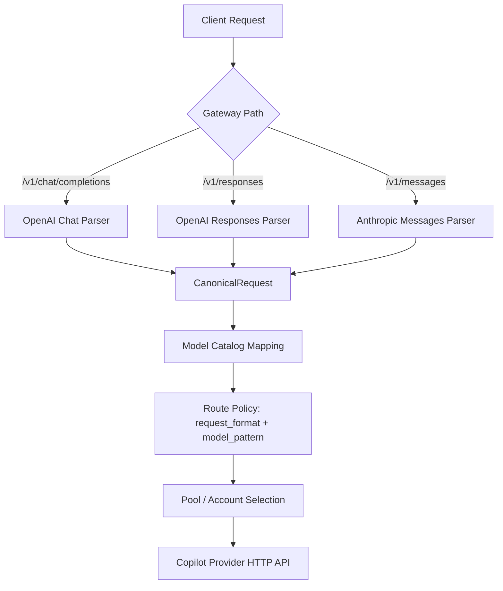
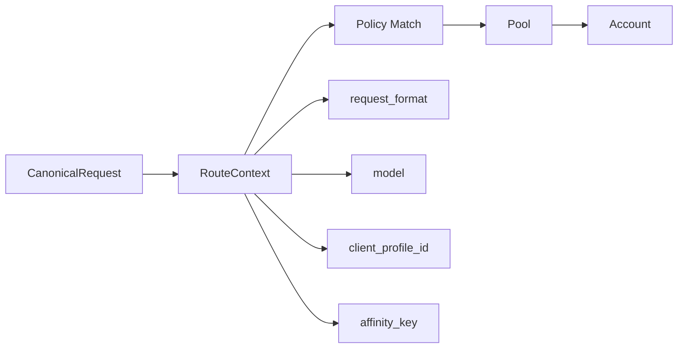
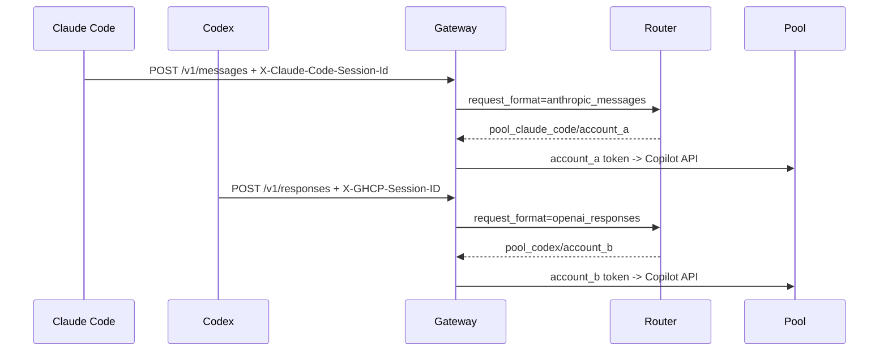

# Protocol-Aware Routing and Coding Client Setup

This document explains how the gateway identifies request protocols, how to configure different routing strategies for OpenAI Responses API / Anthropic Messages, and how to connect common coding clients such as Codex and Claude Code.

## Summary

- The gateway can route by protocol because the entry path identifies the protocol.
- Requests are normalized into canonical requests, and `request_format` is recorded in the usage ledger.
- Route policies support `request_format`; empty value or `*` means any protocol.
- Sticky affinity includes protocol by default, preventing `/v1/responses` and `/v1/messages` from accidentally sharing the same sticky account.

Protocol mapping:

| Gateway Endpoint | Request Format | Description |
| --- | --- | --- |
| `/v1/chat/completions` | `openai_chat` | OpenAI Chat-compatible clients |
| `/v1/responses` | `openai_responses` | Codex / OpenAI Responses API clients |
| `/v1/messages` | `anthropic_messages` | Claude Code / Anthropic Messages clients |

## Current Flow



The gateway already knows which protocol entrypoint received the request, so protocol-aware routing does not require an external API change. It only needs to pass that dimension into router policy matching.

## Policy Model

Route policies currently match by protocol and model. Client profile conditions can be added in a later phase.



Current `RouteContext`:

```go
type RouteContext struct {
    RequestFormat   string
    Model           string
    ClientProfileID string
}
```

Route policy fields:

| Field | Description | Example |
| --- | --- | --- |
| `request_format` | Protocol match; empty or `*` means any protocol | `anthropic_messages` |
| `model_pattern` | Model match, exact value or glob | `claude-*` |
| `pool_id` | Matched backend account pool | `pool_claude_code` |
| `load_balance_strategy` | Account selection strategy inside the matched pool; empty defaults to `risk_weighted` | `round_robin` |
| `sticky_mode` | Sticky mode | `soft` |
| `affinity_scope` | Affinity scope | `client+protocol+model+session` |
| `priority` | Lower value means higher priority | `10` |

Matching order:

1. Filter out policies with `enabled=false`.
2. Match `request_format`; empty or `*` matches all protocols.
3. Match `model_pattern`.
4. Sort by `priority`, `name`, and `id`, then take the first policy.
5. If sticky affinity is enabled and the sticky target is still eligible, reuse it.
6. Otherwise select an eligible account from the matched pool using `load_balance_strategy`.
7. If no policy matches, fall back to default pool selection.

## Protocol-Level Policy Examples

The same model name can route to different account pools depending on protocol.

| Policy | Request Format | Model Pattern | Pool | Sticky Mode | Use Case |
| --- | --- | --- | --- | --- | --- |
| `claude-code-messages` | `anthropic_messages` | `*` | `pool_claude_code` | `soft` | Claude Code long sessions, tool calls, and multi-agent work |
| `codex-responses` | `openai_responses` | `*` | `pool_codex` | `prefix` | Codex Responses API with prompt-cache affinity |
| `chat-compat` | `openai_chat` | `*` | `pool_chat_compat` | `none` | Generic Chat Completions-compatible clients |

Example policy JSON:

```json
[
  {
    "name": "claude-code-messages",
    "request_format": "anthropic_messages",
    "model_pattern": "*",
    "pool_id": "pool_claude_code",
    "sticky_mode": "soft",
    "affinity_scope": "client+protocol+model+session",
    "priority": 10,
    "enabled": true
  },
  {
    "name": "codex-responses",
    "request_format": "openai_responses",
    "model_pattern": "*",
    "pool_id": "pool_codex",
    "sticky_mode": "prefix",
    "affinity_scope": "client+protocol+model+session",
    "priority": 20,
    "enabled": true
  }
]
```

## Session Identification Fields

The gateway recognizes the following headers and body metadata in priority order to build affinity keys.

1. `X-Claude-Code-Session-Id`
2. `X-GHCP-Session-ID`
3. `X-Session-ID`
4. `X-Conversation-ID`
5. `X-Claude-Code-Agent-Id`
6. `X-Claude-Code-Parent-Agent-Id`
7. `X-GHCP-Workspace`
8. `X-GHCP-Project`
9. `metadata.session_id` / `metadata.conversation_id` / `user`
10. `system prompt + tools schema` derived key

Recommended affinity key composition:

```text
client_profile_id + request_format + model + session_or_derived_key
```

This prevents Claude Code, Codex, and generic SDK requests under the same API key from accidentally sharing a sticky target only because the model is the same.

## Claude Code Setup

Claude Code's official LLM gateway documentation notes that requests include headers useful for gateway identification.

| Header | Description |
| --- | --- |
| `X-Claude-Code-Session-Id` | Current Claude Code session ID, best for session sticky affinity |
| `X-Claude-Code-Agent-Id` | Temporary ID for subagent / teammate requests, useful for cost attribution or fine-grained observability |
| `X-Claude-Code-Parent-Agent-Id` | Parent agent ID for nested agent scenarios |

Recommended configuration:

```bash
export ANTHROPIC_BASE_URL="http://localhost:8000"
export ANTHROPIC_AUTH_TOKEN="ghcp-client-token"
export ANTHROPIC_CUSTOM_HEADERS=$'X-GHCP-Client: claude-code\nX-GHCP-Team: platform'
export CLAUDE_CODE_ENABLE_GATEWAY_MODEL_DISCOVERY=1
claude
```

Notes:

- `ANTHROPIC_BASE_URL` points to the gateway root; Claude Code calls `/v1/messages`.
- `ANTHROPIC_AUTH_TOKEN` is sent as `Authorization: Bearer ...` and can map to a GHCP client profile.
- `ANTHROPIC_CUSTOM_HEADERS` can attach low-cardinality routing labels such as team, environment, or workspace.
- `X-Claude-Code-Session-Id` is usually sent automatically by Claude Code and does not need manual configuration.

Recommended Claude Code policy:

```text
request_format = anthropic_messages
sticky_mode = soft
affinity_scope = client+protocol+model+session
pool = pool_claude_code
```

If multi-subagent concurrency is enabled, record `X-Claude-Code-Agent-Id` for cost attribution. Be careful before including agent ID in the sticky key; session-level sticky remains the default recommendation.

## Codex Setup

Codex documentation does not describe an automatic stable provider session header, but custom model providers support static headers and environment-injected headers.

Configure the provider in user-level `~/.codex/config.toml`. Project-level `.codex/config.toml` is not ideal for machine-local provider/base URL/auth settings.

```toml
model = "gpt-5.5"
model_provider = "ghcp"

[model_providers.ghcp]
name = "GHCP Pool Proxy"
base_url = "http://localhost:8000/v1"
wire_api = "responses"
env_key = "GHCP_API_KEY"
http_headers = { "X-GHCP-Client" = "codex" }
env_http_headers = {
  "X-GHCP-Session-ID" = "GHCP_SESSION_ID",
  "X-GHCP-Workspace" = "GHCP_WORKSPACE",
  "X-GHCP-Team" = "GHCP_TEAM"
}
```

Recommended startup wrapper:

```bash
#!/usr/bin/env bash
set -euo pipefail

export GHCP_API_KEY="${GHCP_API_KEY:-ghcp-client-token}"
export GHCP_SESSION_ID="${GHCP_SESSION_ID:-$(uuidgen 2>/dev/null || date +%s)-$$}"
export GHCP_WORKSPACE="${GHCP_WORKSPACE:-$(pwd | sha256sum | cut -c1-16)}"
export GHCP_TEAM="${GHCP_TEAM:-default}"

exec codex "$@"
```

Notes:

- `wire_api = "responses"` makes Codex use OpenAI Responses API-style requests.
- `base_url = "http://localhost:8000/v1"` maps to the gateway `/v1/responses` endpoint.
- `GHCP_SESSION_ID` should remain stable for one Codex session; changing it every request reduces sticky and prompt-cache effectiveness.
- `GHCP_WORKSPACE` can keep one project directory in the same affinity family, but pass a hash instead of a plaintext absolute path.

Recommended Codex policy:

```text
request_format = openai_responses
sticky_mode = prefix
affinity_scope = client+protocol+model+session
pool = pool_codex
```

## Implementation Status and Next Steps

Implemented:

- `route_policies.request_format` migration and store loading.
- Router `RouteContext` protocol matching.
- Gateway passes entrypoint protocol to the router.
- Affinity key generation recognizes headers such as `X-Claude-Code-Session-Id` and `X-GHCP-Session-ID`, and includes `request_format` by default.
- `user`, `metadata.session_id`, and `metadata.conversation_id` in OpenAI Chat/Responses bodies can be used as fallback affinity signals.

Recommended next steps:

1. Add a protocol dropdown to dashboard route policy forms: `any`, `openai_chat`, `openai_responses`, `anthropic_messages`.
2. Add Admin API route policy CRUD instead of database-only loading.
3. Add `client_profile_id` to route policies if strong tenant-level constraints are needed.
4. Use Redis atomic leases for account concurrency in multi-gateway deployments.

## Validation Suggestions

For validation, create three pools and configure three protocol-specific policies for the same model.



Expected results:

- `/v1/messages` requests hit the Claude Code pool.
- `/v1/responses` requests hit the Codex pool.
- Repeated requests with the same session ID prefer the same account.
- Changing the session ID allows load balancing to another account.
- `request_format`, `pool_id`, and `account_id` in the usage ledger match expectations.
