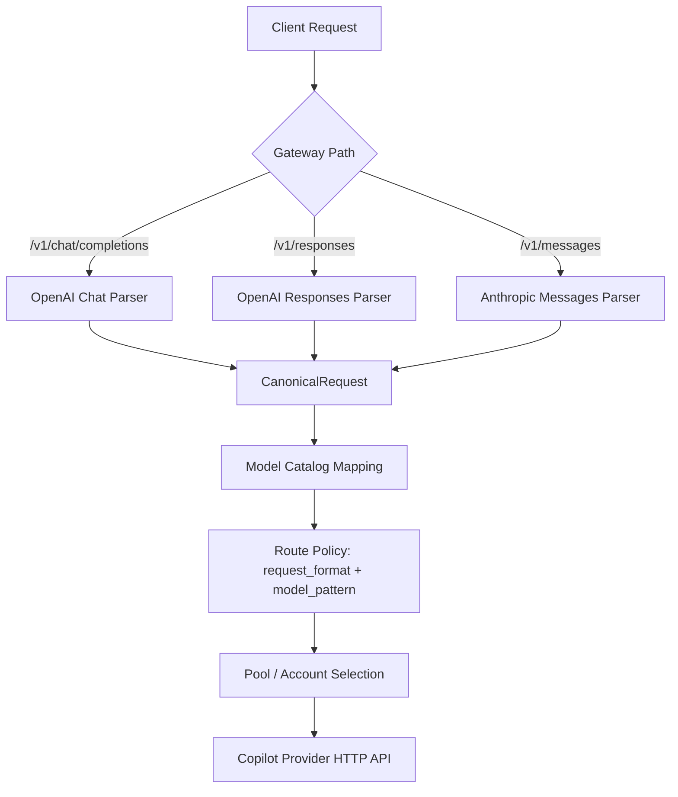
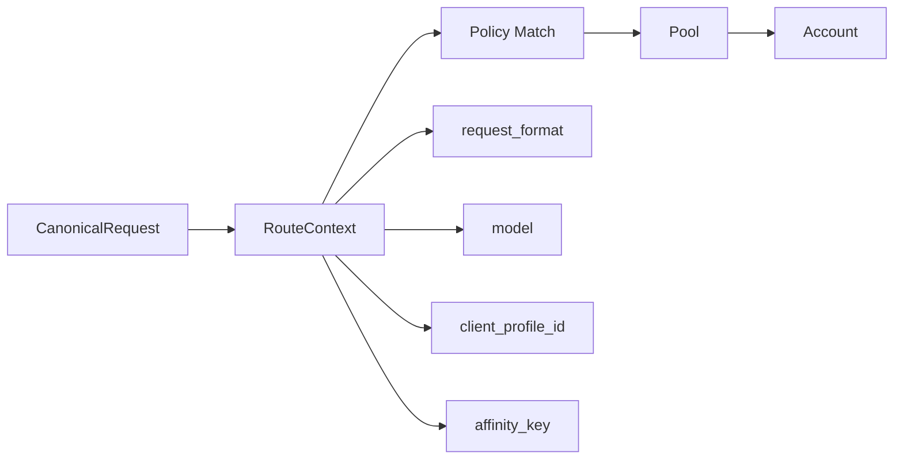
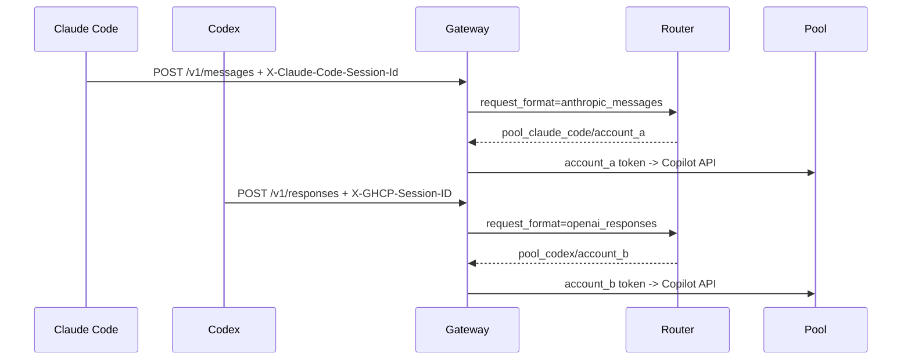

# 协议感知路由与 Coding 客户端配置

本文记录 Gateway 如何识别请求协议、如何按 OpenAI Responses API / Anthropic Messages 等协议配置不同路由策略，以及 Codex 和 Claude Code 两类常见 coding 客户端如何接入。

## 结论

- Gateway 可以按协议做不同路由策略，入口路径已经能区分协议。
- 请求会归一化为 canonical request，并把 `request_format` 记录到 usage ledger。
- route policy 支持 `request_format`，空值或 `*` 表示任意协议。
- sticky affinity 默认包含协议维度，避免 `/v1/responses` 与 `/v1/messages` 意外共享粘性账号。

协议映射

| Gateway 端点 | 请求格式 | 说明 |
| --- | --- | --- |
| `/v1/chat/completions` | `openai_chat` | OpenAI Chat 兼容客户端 |
| `/v1/responses` | `openai_responses` | OpenAI Responses API 客户端 |
| `/v1/messages` | `anthropic_messages` | Anthropic Messages 客户端 |

## 当前链路



Gateway 已经知道请求来自哪个协议入口，因此协议感知路由不需要改变外部 API，只需要把这个维度传入 router policy matching。

## 策略模型

route policy 当前按协议和模型匹配，后续可继续扩展 client profile 条件。



当前 `RouteContext`

```go
type RouteContext struct {
    RequestFormat   string
    Model           string
    ClientProfileID string
}
```

route policy 字段

| 字段 | 说明 | 示例 |
| --- | --- | --- |
| `request_format` | 协议匹配，空值或 `*` 表示任意协议 | `anthropic_messages` |
| `model_pattern` | 模型匹配，支持精确值或 glob | `claude-*` |
| `pool_id` | 命中的后端账号池 | `pool_claude_code` |
| `load_balance_strategy` | 命中池内的账号选择策略；空值默认 `risk_weighted` | `round_robin` |
| `sticky_mode` | 粘性模式 | `soft` |
| `affinity_scope` | 会话亲和范围 | `client+protocol+model+session` |
| `priority` | 数值越小越优先 | `10` |

匹配顺序

1. 过滤 `enabled=false` 的 policy。
2. 匹配 `request_format`，空值或 `*` 表示兼容所有协议。
3. 匹配 `model_pattern`。
4. 按 `priority`、`name`、`id` 排序后取第一条。
5. 如果启用了 sticky affinity 且 sticky target 仍然可用，优先复用。
6. 否则在命中池内按 `load_balance_strategy` 选择可用账号。
7. 如果没有命中 policy，回退到默认 pool 选择逻辑。

## 协议级策略示例

同一个模型名可以根据协议进入不同账号池。

| 策略 | 请求格式 | 模型模式 | 池 | 粘性模式 | 用途 |
| --- | --- | --- | --- | --- | --- |
| `claude-code-messages` | `anthropic_messages` | `*` | `pool_claude_code` | `soft` | Claude Code 长会话、工具调用、多 agent |
| `codex-responses` | `openai_responses` | `*` | `pool_codex` | `prefix` | Codex Responses API，偏 prompt cache 亲和 |
| `chat-compat` | `openai_chat` | `*` | `pool_chat_compat` | `none` | 普通 Chat Completions 兼容客户端 |

示例策略 JSON

```json
[
  {
    "name": "claude-code-messages",
    "request_format": "anthropic_messages",
    "model_pattern": "*",
    "pool_id": "pool_claude_code",
    "sticky_mode": "soft",
    "affinity_scope": "client+protocol+model+session",
    "priority": 10,
    "enabled": true
  },
  {
    "name": "codex-responses",
    "request_format": "openai_responses",
    "model_pattern": "*",
    "pool_id": "pool_codex",
    "sticky_mode": "prefix",
    "affinity_scope": "client+protocol+model+session",
    "priority": 20,
    "enabled": true
  }
]
```

## 会话识别字段

Gateway 内置按优先级识别以下 header 和 body metadata，用于生成 affinity key。

1. `X-Claude-Code-Session-Id`
2. `X-GHCP-Session-ID`
3. `X-Session-ID`
4. `X-Conversation-ID`
5. `X-Claude-Code-Agent-Id`
6. `X-Claude-Code-Parent-Agent-Id`
7. `X-GHCP-Workspace`
8. `X-GHCP-Project`
9. `metadata.session_id` / `metadata.conversation_id` / `user`
10. `system prompt + tools schema` 派生 key

建议 affinity key 组合

```text
client_profile_id + request_format + model + session_or_derived_key
```

这样同一个 API key 下，Claude Code、Codex 和普通 SDK 请求不会因为模型相同而误共享 sticky target。

## Claude Code 配置

Claude Code 官方 LLM gateway 文档说明，请求会带适合代理识别的 header。

| 请求头 | 说明 |
| --- | --- |
| `X-Claude-Code-Session-Id` | 当前 Claude Code session ID，最适合做会话 sticky |
| `X-Claude-Code-Agent-Id` | 子 agent / teammate 请求的临时 ID，适合成本归因或细粒度观测 |
| `X-Claude-Code-Parent-Agent-Id` | 嵌套 agent 场景下的父 agent ID |

推荐配置

```bash
export ANTHROPIC_BASE_URL="http://localhost:8000"
export ANTHROPIC_AUTH_TOKEN="ghcp-client-token"
export ANTHROPIC_CUSTOM_HEADERS=$'X-GHCP-Client: claude-code\nX-GHCP-Team: platform'
export CLAUDE_CODE_ENABLE_GATEWAY_MODEL_DISCOVERY=1
claude
```

说明

- `ANTHROPIC_BASE_URL` 指向 gateway 根地址，Claude Code 会调用 `/v1/messages`。
- `ANTHROPIC_AUTH_TOKEN` 会作为 `Authorization: Bearer ...` 发送，可对应 GHCP client profile。
- `ANTHROPIC_CUSTOM_HEADERS` 可附加团队、环境、工作区等低基数路由标签。
- `X-Claude-Code-Session-Id` 通常由 Claude Code 自动发送，不需要手工配置。

建议 Claude Code policy

```text
request_format = anthropic_messages
sticky_mode = soft
affinity_scope = client+protocol+model+session
pool = pool_claude_code
```

如果启用多 subagent 并行，可以记录 `X-Claude-Code-Agent-Id` 做成本归因；是否把 agent ID 纳入 sticky key 应谨慎，默认仍建议 session 级 sticky。

## Codex 配置

Codex 文档没有说明会自动发送稳定 provider session header，但 custom model provider 支持静态 header 和从环境变量注入 header。

推荐在用户级 `~/.codex/config.toml` 配置 provider。项目级 `.codex/config.toml` 不适合放 provider/base URL/auth 这类 machine-local 配置。

```toml
model = "gpt-5.5"
model_provider = "ghcp"

[model_providers.ghcp]
name = "GHCP Pool Proxy"
base_url = "http://localhost:8000/v1"
wire_api = "responses"
env_key = "GHCP_API_KEY"
http_headers = { "X-GHCP-Client" = "codex" }
env_http_headers = {
  "X-GHCP-Session-ID" = "GHCP_SESSION_ID",
  "X-GHCP-Workspace" = "GHCP_WORKSPACE",
  "X-GHCP-Team" = "GHCP_TEAM"
}
```

推荐启动 wrapper

```bash
#!/usr/bin/env bash
set -euo pipefail

export GHCP_API_KEY="${GHCP_API_KEY:-ghcp-client-token}"
export GHCP_SESSION_ID="${GHCP_SESSION_ID:-$(uuidgen 2>/dev/null || date +%s)-$$}"
export GHCP_WORKSPACE="${GHCP_WORKSPACE:-$(pwd | sha256sum | cut -c1-16)}"
export GHCP_TEAM="${GHCP_TEAM:-default}"

exec codex "$@"
```

说明

- `wire_api = "responses"` 会让 Codex 使用 OpenAI Responses API 风格请求。
- `base_url = "http://localhost:8000/v1"` 对应 Gateway 的 `/v1/responses`。
- `GHCP_SESSION_ID` 应在一个 Codex 会话生命周期内保持不变，否则会降低 sticky 和 prompt cache 效果。
- `GHCP_WORKSPACE` 可把同一项目目录稳定绑定到同一 affinity 族，但建议传 hash，不要传明文绝对路径。

建议 Codex policy

```text
request_format = openai_responses
sticky_mode = prefix
affinity_scope = client+protocol+model+session
pool = pool_codex
```

## 实现状态与后续清单

已完成

- `route_policies.request_format` 迁移与 store 加载。
- router `RouteContext` 协议匹配。
- gateway 按入口协议传入 router。
- affinity key 内置识别 `X-Claude-Code-Session-Id`、`X-GHCP-Session-ID` 等 header，并默认包含 `request_format`。
- OpenAI Chat/Responses body 中的 `user`、`metadata.session_id`、`metadata.conversation_id` 可作为 fallback affinity 信号。

后续建议

1. Dashboard route policy 表单增加协议下拉：`any`、`openai_chat`、`openai_responses`、`anthropic_messages`。
2. Admin API 增加 route policy CRUD，而不是仅从数据库加载。
3. 如果需要按租户强约束，再把 `client_profile_id` 加入 route policy。
4. 多 gateway 实例下使用 Redis 原子 lease 管理账号并发。

## 验证建议

验证时可以创建三个 pool，并为同一个模型配置三条不同协议策略。



期望结果

- `/v1/messages` 请求命中 Claude Code pool。
- `/v1/responses` 请求命中 Codex pool。
- 同一个 session ID 的重复请求优先命中同一 account。
- 改变 session ID 后允许重新负载均衡到其他 account。
- usage ledger 中 `request_format`、`pool_id`、`account_id` 与预期一致。
