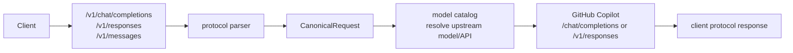

# Protocol

This is the single reference for protocol conversion: how the three client-facing endpoints are parsed, which fields are retained, discarded, or passed through, what the internal `CanonicalRequest` contains, and how the Copilot provider rebuilds a GitHub Copilot upstream Chat Completions or Responses request. Routing, account selection, sticky affinity, user binding, concurrency, and risk rules are documented in [routing.en.md](routing.en.md).

## Data Flow Boundary

The gateway does not forward client requests to Copilot as-is. Each request is parsed into an internal DTO, then rebuilt by the Copilot provider according to the upstream API selected by the model catalog.



Client headers are not forwarded verbatim to Copilot. The provider generates upstream headers itself, including the account bearer token, editor/user-agent metadata, and GitHub API version. `X-GHCP-*`, session, and workspace headers are routing inputs; see [routing.en.md](routing.en.md). The protocol layer only treats `Anthropic-Version` or Claude/Anthropic user agents specially for `/v1/models` response shape.

## Upstream API Selection

The model catalog maps the client-visible exposed model to an upstream model and may select `upstream_api`.

| Priority | Rule | Notes |
| --- | --- | --- |
| 1 | Explicit `upstream_api` | `responses`, `chat_completions`, and compatible aliases; highest priority |
| 2 | Explicit or cached `vendor` | `OpenAI` / `Azure OpenAI` normalize to OpenAI and use upstream Responses; Google, Anthropic, Microsoft, and xAI use upstream Chat Completions |
| 3 | Infer vendor from `upstream` / `name` / `exposed` | `gpt*`, `gpt-*`, and OpenAI o-series infer OpenAI; `gemini*` infers Google; `claude*`, `opus*`, `haiku*`, and `sonnet*` infer Anthropic; `MAI*` infers Microsoft; `grok*` / `xai*` infer xAI |
| 5 | No inference | Leave empty; the provider follows the downstream endpoint: `/v1/responses` uses Responses, other endpoints use Chat Completions |

The current cached Copilot model names include `GPT-5.4`, `GPT-5 mini`, `Gemini 3.1 Pro`, `Claude Opus/Sonnet/Haiku`, and `MAI-Code-1-Flash`, so inference checks the real upstream ID and display name, not only the exposed alias.

### Claude Code Custom Model Names

Claude Code can send its own `model` names in Anthropic Messages requests. The adaptation point is the model catalog, not the Copilot provider: configure the name Claude Code sends as `exposed`, and configure the real model ID returned by GitHub Copilot `/models` as `upstream`.

Example:

```json
[
  {
    "exposed": "sonnet",
    "upstream": "claude-sonnet-4-20250514",
    "vendor": "Anthropic",
    "upstream_api": "chat_completions",
    "enabled": true
  },
  {
    "exposed": "opus",
    "upstream": "claude-opus-4-20250514",
    "vendor": "Anthropic",
    "upstream_api": "chat_completions",
    "enabled": true
  }
]
```

In the Dashboard, open Models, click `Refresh from Copilot` to load the real models, then change `Exposed Model ID` to the name Claude Code should use. After saving, a Claude Code request with `model=sonnet` is mapped to `claude-sonnet-4-20250514` before it reaches Copilot.

On the Claude Code side, the model can be set with `/model <alias|name>`, the startup flag `claude --model <alias|name>`, the environment variable `ANTHROPIC_MODEL=<alias|name>`, or the `model` field in `~/.claude/settings.json` / `.claude/settings.json`. Claude Code often sends aliases rather than full Anthropic model IDs; in this gateway, those aliases should be configured as `exposed` model names.

| Claude Code model name | Recommended `model_catalog_json.exposed` | `model_catalog_json.upstream` should be | Notes |
| --- | --- | --- | --- |
| `sonnet` | `sonnet` | The Sonnet model ID returned by Copilot `/models`, for example `claude-sonnet-4-20250514` | Common daily-coding alias; route policies may match either `sonnet` or the real upstream ID |
| `sonnet[1m]` | `sonnet[1m]` | A Sonnet upstream that supports 1M context; if there is no separate 1M ID, map it to the same Sonnet ID first | Claude Code uses this name behind LLM gateways to request 1M context; actual support depends on the model capabilities Copilot exposes |
| `opus` | `opus` | The Opus model ID returned by Copilot `/models` | Complex reasoning alias |
| `opus[1m]` | `opus[1m]` | An Opus upstream that supports 1M context; if there is no separate 1M ID, map it to the same Opus ID first | Configure explicitly so the catalog does not reject the request |
| `haiku` | `haiku` | The Haiku model ID returned by Copilot `/models` | Low-latency/simple-task alias |
| `fable` | `fable` | The Fable model ID returned by Copilot `/models` | Configure only when the Copilot account can see a Fable-family model |
| `best` | `best` | Prefer Fable; map to Opus when Fable is unavailable | Claude Code's meaning is “Fable when available, otherwise latest Opus”; the gateway does not infer that automatically, so choose based on your account's visible models |
| Full model IDs, for example `claude-sonnet-5`, `claude-opus-4-8`, `claude-haiku-4-5` | The exact full ID the client sends | The matching real ID from Copilot `/models` | If Claude Code is pinned to a full model name, use that full name as `exposed`; if Copilot returns the same ID, `upstream` can be identical |
| Custom picker values, for example `my-gateway/claude-opus-4-8` | The exact custom string | The real model ID to send to Copilot | Applies to `ANTHROPIC_CUSTOM_MODEL_OPTION`; `exposed` must exactly match the string Claude Code sends |

The authoritative source for `upstream` is the Dashboard Models page after `Refresh from Copilot`, not the examples above. Different accounts, seats, regions, or Copilot backend versions may expose different IDs. For Claude/Anthropic-family models, keep `vendor="Anthropic"` or set `upstream_api="chat_completions"` explicitly.

## Reasoning Parameter Policy

`reasoning`, `reasoning_effort`, and `thinking` are not normalized across protocols. They remain protocol-native passthrough parameters in `Params` and are written to the final upstream request with their original field names. The gateway does not translate Anthropic `thinking` into OpenAI `reasoning`, and it does not translate OpenAI `reasoning_effort` into an Anthropic thinking budget.

The reason is that each model and upstream API can define different shapes, levels, and budget semantics. OpenAI Responses may use `reasoning: { ... }`, OpenAI Chat-compatible requests may use `reasoning_effort`, and Claude/Anthropic commonly uses `thinking`. The gateway preserves only what the client explicitly sends; whether the field is supported, whether a level is valid, and whether a budget is accepted is decided by the target model and GitHub Copilot upstream.

On the response side, upstream reasoning/thinking deltas are normalized into internal `StreamEvent.ReasoningDelta`, then rebuilt as OpenAI Chat `reasoning_content`, Responses reasoning summary events, or Anthropic `thinking` blocks. This affects response event shape only; it does not imply a unified request-side reasoning level.

## Client Protocol Fields

### OpenAI Chat Completions

Endpoint: `POST /v1/chat/completions`; internal `request_format=openai_chat`.

Retained and normalized:

| Request field | Canonical result | Notes |
| --- | --- | --- |
| `model` | `Model` | Later resolved to the upstream model |
| `stream` | `Stream` | Controls downstream SSE |
| `messages` | `Messages` | Preserves `role`, `content`, `tool_calls`, and `tool_call_id` |
| `tools` | `Tools` | OpenAI `function` tools become canonical tools |
| `tool_choice` | `ToolChoice` | Preserved and written upstream |
| `max_tokens` / `max_completion_tokens` | `MaxTokens` | `max_tokens` wins; otherwise `max_completion_tokens` is used |
| `user` | `Metadata.user` | Sticky fallback; `user_binding` pools prefer it as `user_id`; not written upstream as `user` |
| `session` / `metadata.session_id` / `metadata.session` / `metadata.conversation_id` | `Metadata` | Sticky fallback; `session_binding` pools use `session_id` / `session` as `session_id` |

Passed through to `Params` and written to the upstream body with the same name:

```text
temperature, top_p, stop, seed, response_format,
reasoning_effort, parallel_tool_calls, stream_options,
max_completion_tokens, presence_penalty, frequency_penalty, logit_bias,
logprobs, top_logprobs, service_tier, modalities, audio
```

`max_completion_tokens` is passed through only when the client used it and did not also send `max_tokens`; this preserves stricter o-series Chat-compatible behavior. `reasoning_effort` is passed through by name only; it is not converted to Responses `reasoning` or Anthropic `thinking`.

Discarded or rejected: unlisted body fields are discarded; `metadata` keys other than `session_id` and `conversation_id` are discarded; image URLs are rejected unless they are `http`, `https`, or `data:image/*;base64,...`; requests are rejected when they contain more than 20 image parts or an image data URL larger than 20 MiB.

### OpenAI Responses API

Endpoint: `POST /v1/responses`; internal `request_format=openai_responses`.

Retained and normalized:

| Request field | Canonical result | Notes |
| --- | --- | --- |
| `model` | `Model` | Later resolved to the upstream model |
| `stream` | `Stream` | Controls downstream Responses SSE |
| `instructions` | `System` | Stringified as system instructions |
| `input` string | `Messages` | Converts to one user message |
| `input` array | `Messages` / `System` | Conversation items are normalized; `developer`/`system` text is merged into `System` |
| `tools` | `Tools` | OpenAI/Responses tools become canonical tools |
| `tool_choice` | `ToolChoice` | Preserved and written upstream |
| `max_output_tokens` | `MaxTokens` | Written upstream as `max_output_tokens` |
| `previous_response_id` | `Metadata.previous_response_id` | Written upstream only when the upstream API is also Responses |
| `user` | `Metadata.user` | Sticky fallback; `user_binding` pools prefer it as `user_id` |
| `session` / `metadata.session_id` / `metadata.session` / `metadata.conversation_id` | `Metadata` | Sticky fallback; `session_binding` pools use `session_id` / `session` as `session_id` |

Passed through to `Params` and written to the upstream body with the same name:

```text
temperature, top_p, text, reasoning, reasoning_effort,
response_format, parallel_tool_calls, stream_options,
truncation, include, store, service_tier
```

`reasoning` and `reasoning_effort` are passed through by name only; they are not converted to Anthropic `thinking`.

For Copilot upstream, `include` drops the unsupported `reasoning.encrypted_content` value; if that leaves the list empty, `include` is omitted.

Tools from OpenAI Responses requests are first retained in the canonical tool record for diagnostics and future adapters. Before calling Copilot, the provider uses a cc-switch-style tools adapter instead of raw-passthrough for non-function tools: `function` tools are kept directly; `custom` tools are wrapped as function tools with a fixed string `input` parameter and the original definition embedded in the description; `tool_search` is wrapped as a proxy function named `tool_search`; and `namespace` expands function children into flattened `<namespace>___<tool>` function names. `tool_choice` is mapped to the converted function name as well, and omitted when it cannot target a valid upstream tool. When upstream returns a tool call, the adapter restores the downstream Responses semantics: `custom_tool_call` uses `response.custom_tool_call_input.*` events, `tool_search` is emitted as a `tool_search_call` item, and namespace child tools restore the original tool name with a `namespace` field on the `function_call` item. The Copilot upstream currently rejects OpenAI Responses remote MCP `type: "mcp"`, so remote MCP tools are still filtered until a gateway-managed MCP discovery/execution adapter is implemented. If no supported tools remain after adaptation/filtering, `tool_choice` and `parallel_tool_calls` are omitted. Use `scripts/probe_stream_mcp.py` to compare the SSE event shape for an MCP request against a no-tool baseline.

Conversions: direct top-level `input_text`, `input_image`, `text`, and `image_url` input items are grouped into a user message; `function_call` becomes an assistant tool call; `function_call_output` becomes a tool message; `input_text`, `output_text`, and `text` normalize to canonical text parts; `input_image` and `image_url` normalize to canonical `image_url`.

Discarded or rejected: unlisted body fields are discarded; `metadata` keys other than `session_id` and `conversation_id` are discarded; unsupported content parts inside `input` arrays are skipped; image validation is the same as Chat Completions.

### Anthropic Messages

Endpoint: `POST /v1/messages`; internal `request_format=anthropic_messages`.

Retained and normalized:

| Request field | Canonical result | Notes |
| --- | --- | --- |
| `model` | `Model` | Later resolved to the upstream model |
| `stream` | `Stream` | Controls downstream Anthropic SSE |
| `system` string / array | `System` | Text blocks are joined with newlines; other blocks are not retained |
| `messages` | `Messages` / `System` | `text`, `image`, `tool_use`, and `tool_result` are normalized; `role=system` messages are folded into `System` |
| `tools` | `Tools` | Preserves `name`, `description`, `input_schema`, and `cache_control` |
| `tool_choice` | `ToolChoice` | `any` maps to `required`; `tool` maps to an OpenAI function choice |
| `max_tokens` | `MaxTokens` | Written upstream as `max_tokens` for Chat and `max_output_tokens` for Responses |

Passed through to `Params`:

```text
temperature, top_p, top_k, stop, thinking, metadata
```

`stop_sequences` is renamed to `stop`. `thinking` is passed through by name only; it is not converted to OpenAI `reasoning` or `reasoning_effort`. Anthropic `metadata` remains an upstream body parameter; binding pools may also read `metadata.user_id` / `metadata.user` as `user_id` and `metadata.session_id` / `metadata.session` as `session_id`.

Conversions: `tool_use` becomes a canonical function tool call; `tool_result` becomes a tool message; `image.source.url` or `image.source.data + media_type` becomes an OpenAI-style `image_url`; `cache_control` is cleaned of undefined placeholders and retained on tools or content parts.

Discarded or rejected: unlisted body fields are discarded; non-text blocks in `system` arrays are discarded; content blocks other than `text`, `image`, `tool_use`, and `tool_result` are skipped; image validation is the same as Chat Completions.

## Canonical Layer Fields

`CanonicalRequest` is the boundary between protocol parsing and provider/router logic.

| Canonical field | OpenAI Chat source | Responses source | Anthropic source | Notes |
| --- | --- | --- | --- | --- |
| `Format` | endpoint | endpoint | endpoint | `openai_chat` / `openai_responses` / `anthropic_messages` |
| `UpstreamAPI` | model catalog | model catalog | model catalog | May be empty; provider falls back by downstream endpoint |
| `Model` | `model` | `model` | `model` | Resolved to upstream model before provider call |
| `Stream` | `stream` | `stream` | `stream` | Controls downstream response shape; provider streaming forces upstream `stream=true` |
| `System` | no separate field | `instructions` + `developer/system` input text | `system` | Upstream Chat prepends it as a system message; upstream Responses writes `instructions` |
| `Messages` | `messages` | `input` | `messages` | Content parts normalize to text/image/tool call/tool result shapes |
| `Tools` | `tools` | `tools` | `tools` | Unified as `type/name/description/input_schema/cache_control` |
| `ToolChoice` | `tool_choice` | `tool_choice` | converted `tool_choice` | Some original protocol shapes cannot be preserved exactly |
| `MaxTokens` | `max_tokens` / `max_completion_tokens` | `max_output_tokens` | `max_tokens` | Renamed according to target upstream API |
| `Params` | allowlisted passthrough fields | allowlisted passthrough fields | allowlisted passthrough fields | Not arbitrary body passthrough; reasoning/thinking keeps its protocol-native shape |
| `Metadata` | `user`, selected `metadata` | `user`, selected `metadata`, `previous_response_id` | none | Used for sticky or Responses continuation; not forwarded wholesale |

`CanonicalResponse` only retains `id`, `model`, `finish_reason/status`, text `content`, tool calls, usage, and creation time. More complex upstream response structures are not preserved completely.

## GitHub Copilot Upstream Request

The provider uses `CanonicalRequest.UpstreamAPI` to select the upstream path. If it is empty, `openai_responses` defaults to `/v1/responses`; other request formats default to `/chat/completions`.

### Upstream Chat Completions

Path: `POST https://api.githubcopilot.com/chat/completions`.

| Upstream field | Source |
| --- | --- |
| `model` | `CanonicalRequest.Model` |
| `messages` | `System` prepended as a system message, followed by `Messages` |
| `tools` | Function `Tools` rebuilt as OpenAI function tool shape; non-function tools are omitted for Chat upstream |
| `tool_choice` | `ToolChoice`, omitted when no valid tool is sent upstream |
| `max_tokens` / `max_completion_tokens` | `MaxTokens`, preserving `max_completion_tokens` when the client used that field |
| passthrough fields | `Params` copied by name |

If the valid upstream tool list is empty, `tool_choice` and `parallel_tool_calls` are omitted. Some strict upstream Chat-compatible APIs reject tool controls without tools.

### Upstream Responses

Path: `POST https://api.githubcopilot.com/v1/responses`.

| Upstream field | Source |
| --- | --- |
| `model` | `CanonicalRequest.Model` |
| `input` | `Messages` rebuilt as Responses input items |
| `instructions` | `System` |
| `tools` | `Tools` rebuilt as Responses tool shape |
| `tool_choice` | `ToolChoice`, omitted when no valid tool is sent upstream |
| `max_output_tokens` | `MaxTokens` |
| `previous_response_id` | `Metadata.previous_response_id` |
| passthrough fields | `Params` copied by name |

Content conversions during upstream rebuild:

| Canonical content | Chat upstream | Responses upstream |
| --- | --- | --- |
| text part | Message content as-is | `input_text` for user/tool, `output_text` for assistant |
| image part | `image_url` | `input_image`, preserving url/detail when present |
| assistant tool call | `tool_calls` | `function_call` input item |
| tool result | `tool` message + `tool_call_id` | `function_call_output` input item |
| `cache_control` | Retained where possible on tool/content part | Retained where possible on tool/content part |

For Copilot Responses upstream, overlong `call_id` values are deterministically shortened to stay within the upstream 64-character limit; matching `function_call_output` items use the same shortened ID.

If the valid upstream tool list is empty, `tool_choice` and `parallel_tool_calls` are omitted for Responses upstream too. Copilot Responses upstream currently rejects remote MCP tools (`type: "mcp"`), so they are filtered before this check.

## Response Adaptation

Upstream responses are parsed into `CanonicalResponse` or `StreamEvent`, then rebuilt for the original client endpoint.

| Client endpoint | Non-streaming response | Streaming response |
| --- | --- | --- |
| OpenAI Chat | `chat.completion` | `chat.completion.chunk` plus `[DONE]` |
| OpenAI Responses | `response` | `response.created`, `response.output_text.delta`, `response.completed`, and related events |
| Anthropic Messages | Anthropic message shape | `message_start`, `content_block_delta`, `message_delta`, `message_stop`, and related events |

Usage is normalized to input/output/cached/reasoning tokens, AI credits, and cost estimates, and records `request_format`, `pool_id`, and `account_id`. Responses stream usage includes OpenAI-style `input_tokens_details.cached_tokens` and `output_tokens_details.reasoning_tokens` as well as gateway cost/cache extensions.

Streaming correctness rules are explicit: Chat upstream must end with `[DONE]`; Responses upstream must emit `response.completed`, `response.incomplete`, or a terminal output event accepted for Copilot Responses variants. Downstream Responses streams start with both `response.created` and `response.in_progress`; text content parts include `annotations: []` for OpenAI client compatibility. Upstream `response.incomplete` is passed through as downstream `response.incomplete` plus `[DONE]`, while upstream `response.failed`, read errors, and EOF before a recognized completion marker become protocol-level `response.failed` plus `[DONE]` for Responses clients.

To reproduce MCP/tool streaming differences against a running local gateway:

```bash
python3 scripts/probe_stream_mcp.py --models gpt-5.5 gemini-3.5-flash claude-sonnet-4.6 --timeout 90 --dump-raw-dir /tmp/ghcp-mcp-probe
```

## Loss And Distortion Notes

- Unknown client body fields are discarded by default; they do not enter `Params` and are not forwarded to Copilot.
- Client headers are not forwarded by default; auth, sticky, and account-binding inputs affect only gateway logic.
- `user`, `session`, `metadata.session_id`, and `metadata.conversation_id` are not forwarded upstream as `user`.
- `user_binding` uses OpenAI Chat/Responses `user`, Anthropic `metadata.user_id` / `metadata.user`, or `X-GHCP-User` as `user_id`; `session_binding` uses request/metadata session fields or session headers as `session_id`.
- Responses `previous_response_id` is preserved only when the target upstream API is Responses; it is lost if the model is configured for upstream Chat Completions.
- Responses `developer`/`system` input, Anthropic `system` arrays, and Anthropic `messages` with `role=system` are merged into one `System` string, so original block boundaries and some ordering detail may be distorted.
- Anthropic `tool_choice.any` becomes OpenAI-style `required`; `tool_choice.tool` becomes a function choice.
- Anthropic `stop_sequences` is renamed to upstream `stop`.
- Unsupported Responses content parts, Anthropic content blocks, and Anthropic system blocks are skipped.
- Non-streaming upstream Responses extracts text output and `function_call` output items; other complex output item structures are not preserved across all downstream protocols.
- Streaming event conversion rebuilds protocol-compatible shapes; it does not guarantee one-to-one preservation of every original protocol event field.