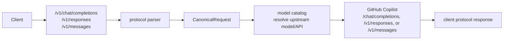

# Protocol

This is the single reference for protocol conversion: how the three client-facing endpoints are parsed, which fields are retained, discarded, or passed through, what the internal canonical DTOs contain, and how the Copilot provider rebuilds a GitHub Copilot upstream Chat Completions, Responses, or Anthropic Messages request. Routing, account selection, sticky affinity, user binding, concurrency, and risk rules are documented in [routing.en.md](routing.en.md).

## Contents

- [Data Flow Boundary](#data-flow-boundary)
- [Upstream API Selection](#upstream-api-selection)
- [Same-Protocol Semantics And Compatibility Flags](#same-protocol-semantics-and-compatibility-flags)
- [Reasoning Parameter Policy](#reasoning-parameter-policy)
- [Client Protocol Fields](#client-protocol-fields)
- [Canonical Layer Fields](#canonical-layer-fields)
- [GitHub Copilot Upstream Request](#github-copilot-upstream-request)
- [Response Adaptation](#response-adaptation)
- [Loss And Distortion Notes](#loss-and-distortion-notes)

## Data Flow Boundary

The gateway does not forward client requests to Copilot as-is. Each request is parsed into an internal DTO, then rebuilt by the Copilot provider according to the upstream API selected by the model catalog.


```mermaid
flowchart LR
  C["Client"] --> E["/v1/chat/completions\n/v1/responses\n/v1/messages"]
  E --> P["protocol parser"]
  P --> R["CanonicalRequest"]
  R --> M["model catalog\nresolve upstream model/API"]
  M --> U["GitHub Copilot\n/chat/completions, /v1/responses, or /v1/messages"]
  U --> O["client protocol response"]
```

Client headers are not forwarded verbatim to Copilot. The provider generates upstream headers itself, including the account bearer token, editor/user-agent metadata, and GitHub API version. `X-GHCP-*`, session, and workspace headers are routing inputs; see [routing.en.md](routing.en.md). Native Messages accepts only typed `Anthropic-Version` and allowlisted `Anthropic-Beta` values; arbitrary client headers never cross the provider boundary.

## Upstream API Selection

The model catalog maps the client-visible exposed model to an upstream model and may select `upstream_api`.

| Priority | Rule | Notes |
| --- | --- | --- |
| 1 | Explicit `upstream_api` | `responses`, `chat_completions`, `anthropic_messages`, and compatible aliases; highest priority |
| 2 | Explicit or cached `vendor` | `OpenAI` / `Azure OpenAI` normalize to OpenAI and use upstream Responses; Anthropic uses upstream Messages; Google, Microsoft, and xAI use upstream Chat Completions |
| 3 | Infer vendor from `upstream` / `name` / `exposed` | `gpt*`, `gpt-*`, and OpenAI o-series infer OpenAI; `gemini*` infers Google; `claude*`, `opus*`, `haiku*`, and `sonnet*` infer Anthropic; `MAI*` infers Microsoft; `grok*` / `xai*` infer xAI |
| 5 | No inference | Leave empty; the provider follows the downstream endpoint: `/v1/responses` uses Responses, other endpoints use Chat Completions |

The current cached Copilot model names include `GPT-5.4`, `GPT-5 mini`, `Gemini 3.1 Pro`, `Claude Opus/Sonnet/Haiku`, and `MAI-Code-1-Flash`, so inference checks the real upstream ID and display name, not only the exposed alias.

Model resolution is gateway-wide. It does not verify whether the account selected by routing can use the model; pools must group accounts with the same model access. See [Candidate Filtering](routing.en.md#candidate-filtering).

### Claude Code Custom Model Names

Claude Code can send its own `model` names in Anthropic Messages requests. The adaptation point is the model catalog, not the Copilot provider: configure the name Claude Code sends as `exposed`, and configure the real model ID returned by GitHub Copilot `/models` as `upstream`.

Example:

```json
[
  {
    "exposed": "sonnet",
    "upstream": "claude-sonnet-4-20250514",
    "vendor": "Anthropic",
    "upstream_api": "anthropic_messages",
    "enabled": true
  },
  {
    "exposed": "opus",
    "upstream": "claude-opus-4-20250514",
    "vendor": "Anthropic",
    "upstream_api": "anthropic_messages",
    "enabled": true
  }
]
```

In the Dashboard, open Models, click `Refresh from Copilot` to load the real models, then change `Exposed Model ID` to the name Claude Code should use. After saving, a Claude Code request with `model=sonnet` is mapped to `claude-sonnet-4-20250514` before it reaches Copilot.

On the Claude Code side, the model can be set with `/model <alias|name>`, the startup flag `claude --model <alias|name>`, the environment variable `ANTHROPIC_MODEL=<alias|name>`, or the `model` field in `~/.claude/settings.json` / `.claude/settings.json`. Claude Code often sends aliases rather than full Anthropic model IDs; in this gateway, those aliases should be configured as `exposed` model names.

| Claude Code model name | Recommended `model_catalog_json.exposed` | `model_catalog_json.upstream` should be | Notes |
| --- | --- | --- | --- |
| `sonnet` | `sonnet` | The Sonnet model ID returned by Copilot `/models`, for example `claude-sonnet-4-20250514` | Common daily-coding alias; the model catalog resolves it before the provider call |
| `sonnet[1m]` | `sonnet[1m]` | A Sonnet upstream that supports 1M context; if there is no separate 1M ID, map it to the same Sonnet ID first | Claude Code uses this name behind LLM gateways to request 1M context; actual support depends on the model capabilities Copilot exposes |
| `opus` | `opus` | The Opus model ID returned by Copilot `/models` | Complex reasoning alias |
| `opus[1m]` | `opus[1m]` | An Opus upstream that supports 1M context; if there is no separate 1M ID, map it to the same Opus ID first | Configure explicitly so the catalog does not reject the request |
| `haiku` | `haiku` | The Haiku model ID returned by Copilot `/models` | Low-latency/simple-task alias |
| `fable` | `fable` | The Fable model ID returned by Copilot `/models` | Configure only when the Copilot account can see a Fable-family model |
| `best` | `best` | Prefer Fable; map to Opus when Fable is unavailable | Claude Code's meaning is “Fable when available, otherwise latest Opus”; the gateway does not infer that automatically, so choose based on your account's visible models |
| Full model IDs, for example `claude-sonnet-5`, `claude-opus-4-8`, `claude-haiku-4-5` | The exact full ID the client sends | The matching real ID from Copilot `/models` | If Claude Code is pinned to a full model name, use that full name as `exposed`; if Copilot returns the same ID, `upstream` can be identical |
| Custom picker values, for example `my-gateway/claude-opus-4-8` | The exact custom string | The real model ID to send to Copilot | Applies to `ANTHROPIC_CUSTOM_MODEL_OPTION`; `exposed` must exactly match the string Claude Code sends |

The authoritative source for `upstream` is the Dashboard Models page after `Refresh from Copilot`, not the examples above. Different accounts, seats, regions, or Copilot backend versions may expose different IDs. Anthropic vendor inference defaults to native Messages after live text, stream, tool-loop, conversion, and cancellation validation. Set `upstream_api="chat_completions"` explicitly to roll back one model.

## Same-Protocol Semantics And Compatibility Flags

“Same protocol” means typed semantic preservation, not byte forwarding. The gateway still parses and validates the body, maps the model, selects an account, enforces budgets and concurrency, generates authentication/security headers, normalizes usage, and validates stream termination.

| Path | Preserved in the same-protocol path | Deliberately normalized |
| --- | --- | --- |
| Responses to Responses | Structured `instructions`; ordered message/reasoning/function/custom/tool-search input and output items; item/call IDs, status, namespace, `previous_response_id`; response/item IDs and indexes in SSE; completed/incomplete/failed semantics | Model ID, auth and Copilot headers, overlong call IDs, unsupported include values, and unsupported tool types |
| Messages to Messages | Ordered system/message blocks; text, image, tool use/result, `is_error`, thinking/signature, redacted thinking, cache breakpoints; native stop reason and usage; strict `message_stop` completion | Model ID, auth headers, beta allowlist, thinking/tool-choice conflict handling, and unsupported cache-control subfields |

The gateway preserves and forwards `previous_response_id`, but Copilot may reject stateful continuation. Responses tool loops should send explicit ordered `function_call` and `function_call_output` input items when that occurs.

The following PostgreSQL-backed feature flags are editable in Dashboard. They default to enabled, including when an older store has no row or a transient flag read fails; migration `015_copilot_compatibility_flags.sql` seeds explicit `true` values. Gateway caches reads for up to 60 seconds.

| Feature flag | Effect when enabled |
| --- | --- |
| `copilot_compat_anthropic_beta_enabled` | Sends only verified beta tokens: fine-grained tool streaming and interleaved thinking |
| `copilot_compat_thinking_tool_choice_enabled` | Changes a forced native Messages tool choice to `auto` when thinking is enabled |
| `copilot_compat_cache_control_enabled` | Preserves an ephemeral cache breakpoint while removing unsupported subfields |
| `copilot_compat_vision_header_enabled` | Adds `Copilot-Vision-Request: true` when typed request content contains an image |

Changing a model catalog override back to `chat_completions` rolls native Messages back without a restart or schema rollback. Disabling an individual compatibility flag affects new requests after the feature-flag cache refresh.

## Reasoning Parameter Policy

`reasoning`, `reasoning_effort`, and `thinking` are not normalized across protocols. They remain protocol-native passthrough parameters in `Params` and are written to the final upstream request with their original field names. The gateway does not translate Anthropic `thinking` into OpenAI `reasoning`, and it does not translate OpenAI `reasoning_effort` into an Anthropic thinking budget.

The reason is that each model and upstream API can define different shapes, levels, and budget semantics. OpenAI Responses may use `reasoning: { ... }`, OpenAI Chat-compatible requests may use `reasoning_effort`, and Claude/Anthropic commonly uses `thinking`. The gateway preserves only what the client explicitly sends; whether the field is supported, whether a level is valid, and whether a budget is accepted is decided by the target model and GitHub Copilot upstream.

On the response side, upstream reasoning/thinking deltas are normalized into internal `StreamEvent.ReasoningDelta`, then rebuilt as OpenAI Chat `reasoning_content`, Responses reasoning summary events, or Anthropic `thinking` blocks. This affects response event shape only; it does not imply a unified request-side reasoning level.

## Client Protocol Fields

### OpenAI Chat Completions

Endpoint: `POST /v1/chat/completions`; internal `request_format=openai_chat`.

Retained and normalized:

| Request field | Canonical result | Notes |
| --- | --- | --- |
| `model` | `Model` | Resolved to the upstream model before routing |
| `stream` | `Stream` | Controls downstream SSE |
| `messages` | `Messages` | Preserves `role`, `content`, `tool_calls`, and `tool_call_id` |
| `tools` | `Tools` | OpenAI `function` tools become canonical tools |
| `tool_choice` | `ToolChoice` | Preserved and written upstream |
| `max_tokens` / `max_completion_tokens` | `MaxTokens` | `max_tokens` wins; otherwise `max_completion_tokens` is used |
| `user` | `Metadata.user` | Secondary sticky input; `user_binding` pools prefer it as `user_id`; not written upstream as `user` |
| `session` / `metadata.session_id` / `metadata.session` / `metadata.conversation_id` | `Metadata` | Secondary sticky input; `session_binding` pools use `session_id` / `session` as `session_id` |

Passed through to `Params` and written to the upstream body with the same name:

```text
temperature, top_p, stop, seed, response_format,
reasoning_effort, parallel_tool_calls, stream_options,
max_completion_tokens, presence_penalty, frequency_penalty, logit_bias,
logprobs, top_logprobs, service_tier, modalities, audio
```

`max_completion_tokens` is passed through only when the client used it and did not also send `max_tokens`; this preserves stricter o-series Chat-compatible behavior. `reasoning_effort` is passed through by name only; it is not converted to Responses `reasoning` or Anthropic `thinking`.

Discarded or rejected: unlisted body fields are discarded; `metadata` keys other than `session_id` and `conversation_id` are discarded; image URLs are rejected unless they are `http`, `https`, or `data:image/*;base64,...`; requests are rejected when they contain more than 20 image parts or an image data URL larger than 20 MiB.

### OpenAI Responses API

Endpoint: `POST /v1/responses`; internal `request_format=openai_responses`.

Retained and normalized:

| Request field | Canonical result | Notes |
| --- | --- | --- |
| `model` | `Model` | Resolved to the upstream model before routing |
| `stream` | `Stream` | Controls downstream Responses SSE |
| `instructions` | `ResponsesInstructions` / `System` | Structured value is retained for Responses to Responses; text is also projected to `System` |
| `input` string | `SourceResponses` / `Messages` | Retained as a typed user item and projected to one user message |
| `input` array | `SourceResponses` / `Messages` / `System` | Ordered typed items retain IDs/status; a cross-protocol projection is built in parallel |
| `tools` | `Tools` | OpenAI/Responses tools become canonical tools |
| `tool_choice` | `ToolChoice` | Preserved and written upstream |
| `max_output_tokens` | `MaxTokens` | Written upstream as `max_output_tokens` |
| `previous_response_id` | `Metadata.previous_response_id` | Written upstream only when the upstream API is also Responses |
| `user` | `Metadata.user` | Secondary sticky input; `user_binding` pools prefer it as `user_id` |
| `session` / `metadata.session_id` / `metadata.session` / `metadata.conversation_id` | `Metadata` | Secondary sticky input; `session_binding` pools use `session_id` / `session` as `session_id` |

Passed through to `Params` and written to the upstream body with the same name:

```text
temperature, top_p, text, reasoning, reasoning_effort,
response_format, parallel_tool_calls, stream_options,
truncation, include, store, service_tier
```

`reasoning` and `reasoning_effort` are passed through by name only; they are not converted to Anthropic `thinking`.

For Copilot upstream, `include` drops the unsupported `reasoning.encrypted_content` value; if that leaves the list empty, `include` is omitted.

Tools from OpenAI Responses requests are retained in the canonical tool record for diagnostics and conversion metadata. Before calling Copilot, the provider uses a cc-switch-style tools adapter instead of raw-passthrough for non-function tools: `function` tools are kept directly; `custom` tools are wrapped as function tools with a fixed string `input` parameter and the original definition embedded in the description; `tool_search` is wrapped as a proxy function named `tool_search`; and `namespace` expands function children into flattened `<namespace>___<tool>` function names. `tool_choice` is mapped to the converted function name as well, and omitted when it cannot target a valid upstream tool. When upstream returns a tool call, the adapter restores the downstream Responses semantics: `custom_tool_call` uses `response.custom_tool_call_input.*` events, `tool_search` is emitted as a `tool_search_call` item, and namespace child tools restore the original tool name with a `namespace` field on the `function_call` item. OpenAI Responses remote MCP tools with `type: "mcp"` are unsupported and filtered because the gateway has no MCP discovery/execution adapter. If no supported tools remain after adaptation/filtering, `tool_choice` and `parallel_tool_calls` are omitted. Use `scripts/probe_stream_mcp.py` to compare the SSE event shape for an MCP request against a no-tool baseline.

Conversions: when the upstream is also Responses, typed message, reasoning, function/custom/tool-search call and output items are rebuilt in their original order with identity/status fields. The compatibility adapter wraps unsupported custom/tool-search/namespace tools as functions. For cross-protocol use, direct `input_text`, `input_image`, `text`, and `image_url` items are grouped into a user message; function calls become assistant tool calls and outputs become tool messages.

Discarded or rejected: unlisted body fields are discarded; `metadata` keys other than `session_id` and `conversation_id` are discarded; unsupported content parts inside `input` arrays are skipped; image validation is the same as Chat Completions.

### Anthropic Messages

Endpoint: `POST /v1/messages`; internal `request_format=anthropic_messages`.

Retained and normalized:

| Request field | Canonical result | Notes |
| --- | --- | --- |
| `model` | `Model` | Resolved to the upstream model before routing |
| `stream` | `Stream` | Controls downstream Anthropic SSE |
| `system` string / array | `SystemBlocks` / `System` | Ordered typed blocks are retained; text is also projected to `System` |
| `messages` | `SourceMessages` / `Messages` / `System` | Native blocks are retained in order and a cross-protocol text/tool projection is built in parallel |
| `tools` | `Tools` | Preserves `name`, `description`, `input_schema`, and `cache_control` |
| `tool_choice` | `ToolChoice` | `any` maps to `required`; `tool` maps to an OpenAI function choice |
| `max_tokens` | `MaxTokens` | Written upstream as `max_tokens` for Chat and `max_output_tokens` for Responses |

Passed through to `Params`:

```text
temperature, top_p, top_k, stop, thinking, metadata
```

`stop_sequences` is renamed to `stop`. `thinking` is passed through by name only; it is not converted to OpenAI `reasoning` or `reasoning_effort`. Anthropic `metadata` remains an upstream body parameter; binding pools may also read `metadata.user_id` / `metadata.user` as `user_id` and `metadata.session_id` / `metadata.session` as `session_id`.

Native preservation includes `text`, `image`, `tool_use`, `tool_result`, tool-result `is_error`, `thinking` with signature, `redacted_thinking`, and `cache_control`. Cross-protocol conversion still projects tool use/result into canonical tool calls/messages and images into OpenAI-style `image_url` content.

Discarded or rejected: unlisted body fields and unknown block types are discarded; image validation is the same as Chat Completions. Native Messages does not forward arbitrary headers or raw JSON fields.

## Canonical Layer Fields

`CanonicalRequest` is the boundary between protocol parsing and provider/router logic.

| Canonical field | OpenAI Chat source | Responses source | Anthropic source | Notes |
| --- | --- | --- | --- | --- |
| `Format` | endpoint | endpoint | endpoint | `openai_chat` / `openai_responses` / `anthropic_messages` |
| `UpstreamAPI` | model catalog | model catalog | model catalog | May be empty; provider falls back by downstream endpoint |
| `Model` | `model` | `model` | `model` | Resolved to upstream model before provider call |
| `Stream` | `stream` | `stream` | `stream` | Controls downstream response shape; provider streaming forces upstream `stream=true` |
| `System` | no separate field | `instructions` + `developer/system` input text | `system` | Upstream Chat prepends it as a system message; upstream Responses writes `instructions` |
| `Messages` | `messages` | `input` | `messages` | Content parts normalize to text/image/tool call/tool result shapes |
| `SourceResponses` / `ResponsesInstructions` | none | typed `input` items / `instructions` | none | Used only for Responses to Responses fidelity |
| `SourceMessages` / `SystemBlocks` | none | none | ordered native blocks | Used only for Messages to Messages fidelity |
| `Tools` | `tools` | `tools` | `tools` | Unified as `type/name/description/input_schema/cache_control` |
| `ToolChoice` | `tool_choice` | `tool_choice` | converted `tool_choice` | Some original protocol shapes cannot be preserved exactly |
| `MaxTokens` | `max_tokens` / `max_completion_tokens` | `max_output_tokens` | `max_tokens` | Renamed according to target upstream API |
| `Params` | allowlisted passthrough fields | allowlisted passthrough fields | allowlisted passthrough fields | Not arbitrary body passthrough; reasoning/thinking keeps its protocol-native shape |
| `Metadata` | `user`, selected `metadata` | `user`, selected `metadata`, `previous_response_id` | none | Used for sticky or Responses continuation; not forwarded wholesale |
| `Protocol` / `Compatibility` | none | none | version/beta tokens plus evaluated feature flags | Typed policy inputs, never a generic header map |

`CanonicalResponse` retains the common text/tool projection and, for native paths, ordered Anthropic content blocks or Responses output items with identity/status. `StreamEvent` carries native response/message IDs, block/item indexes, signature deltas, stop/incomplete reasons, and usage while remaining projectable to other downstream protocols.

## GitHub Copilot Upstream Request

The provider uses `CanonicalRequest.UpstreamAPI` to select the upstream path. If it is empty, `openai_responses` defaults to `/v1/responses`; other request formats default to `/chat/completions`. Native Messages therefore requires an explicit model catalog override during rollout.

### Upstream Chat Completions

Path: `POST https://api.githubcopilot.com/chat/completions`.

| Upstream field | Source |
| --- | --- |
| `model` | `CanonicalRequest.Model` |
| `messages` | `System` prepended as a system message, followed by `Messages` |
| `tools` | Function `Tools` rebuilt as OpenAI function tool shape; non-function tools are omitted for Chat upstream |
| `tool_choice` | `ToolChoice`, omitted when no valid tool is sent upstream |
| `max_tokens` / `max_completion_tokens` | `MaxTokens`, preserving `max_completion_tokens` when the client used that field |
| passthrough fields | `Params` copied by name |

If the valid upstream tool list is empty, `tool_choice` and `parallel_tool_calls` are omitted. Some strict upstream Chat-compatible APIs reject tool controls without tools.

### Upstream Responses

Path: `POST https://api.githubcopilot.com/v1/responses`.

| Upstream field | Source |
| --- | --- |
| `model` | `CanonicalRequest.Model` |
| `input` | `SourceResponses` for same-protocol requests; otherwise `Messages` projected as Responses items |
| `instructions` | Structured `ResponsesInstructions` for same-protocol requests; otherwise `System` |
| `tools` | `Tools` rebuilt as Responses tool shape |
| `tool_choice` | `ToolChoice`, omitted when no valid tool is sent upstream |
| `max_output_tokens` | `MaxTokens` |
| `previous_response_id` | `Metadata.previous_response_id` |
| passthrough fields | `Params` copied by name |

Content conversions during upstream rebuild:

| Canonical content | Chat upstream | Responses upstream |
| --- | --- | --- |
| text part | Message content as-is | `input_text` for user/tool, `output_text` for assistant |
| image part | `image_url` | `input_image`, preserving url/detail when present |
| assistant tool call | `tool_calls` | `function_call` input item |
| tool result | `tool` message + `tool_call_id` | `function_call_output` input item |
| `cache_control` | Retained where possible on tool/content part | Retained where possible on tool/content part |

For Copilot Responses upstream, overlong `call_id` values are deterministically shortened to stay within the upstream 64-character limit; matching `function_call_output` items use the same shortened ID.

If the valid upstream tool list is empty, `tool_choice` and `parallel_tool_calls` are omitted for Responses upstream too. Copilot Responses upstream currently rejects remote MCP tools (`type: "mcp"`), so they are filtered before this check.

### Upstream Anthropic Messages

Path: `POST https://api.githubcopilot.com/v1/messages`.

The provider rebuilds ordered `SystemBlocks` and `SourceMessages`, native tools/tool choice, `max_tokens`, stop sequences, thinking, and metadata. It sets `Anthropic-Version` to the typed client value or `2023-06-01`, filters beta tokens through the verified allowlist, and derives the vision header from typed image content. Authorization and Copilot identity headers remain server-generated.

## Response Adaptation

Upstream responses are parsed into `CanonicalResponse` or `StreamEvent`, then rebuilt for the original client endpoint.

| Client endpoint | Non-streaming response | Streaming response |
| --- | --- | --- |
| OpenAI Chat | `chat.completion` | `chat.completion.chunk` plus `[DONE]` |
| OpenAI Responses | `response` | `response.created`, `response.output_text.delta`, `response.completed`, and related events |
| Anthropic Messages | Anthropic message shape | `message_start`, `content_block_delta`, `message_delta`, `message_stop`, and related events |

Usage is normalized to input/output/cached/reasoning tokens, AI credits, and cost estimates, and records `request_format`, `pool_id`, and `account_id`. Responses stream usage includes OpenAI-style `input_tokens_details.cached_tokens` and `output_tokens_details.reasoning_tokens` as well as gateway cost/cache extensions.

Streaming correctness rules are explicit: Chat upstream must end with `[DONE]`; Responses upstream must emit `response.completed`, `response.incomplete`, or a terminal output event accepted for Copilot Responses variants; native Messages succeeds only after `message_stop`. Same-protocol Responses preserves upstream response/item IDs and output/content/summary indexes. Same-protocol Messages preserves block indexes, thinking signatures, tool IDs, stop reason, and usage. An incomplete Responses terminal is returned to the client and recorded as `incomplete`, not `success`. Failed events, read errors, and premature EOF become protocol-level failures rather than fabricated successful completion.

To reproduce MCP/tool streaming differences against a running local gateway:

```bash
python3 scripts/probe_stream_mcp.py --models gpt-5.5 gemini-3.5-flash claude-sonnet-4.6 --timeout 90 --dump-raw-dir /tmp/ghcp-mcp-probe
```

## Loss And Distortion Notes

- Unknown client body fields are discarded by default; they do not enter `Params` and are not forwarded to Copilot.
- Client headers are not forwarded by default; auth, sticky, and account-binding inputs affect only gateway logic.
- `user`, `session`, `metadata.session_id`, and `metadata.conversation_id` are not forwarded upstream as `user`.
- `user_binding` uses OpenAI Chat/Responses `user`, Anthropic `metadata.user_id` / `metadata.user`, or `X-GHCP-User` as `user_id`; `session_binding` uses request/metadata session fields or session headers as `session_id`.
- Responses `previous_response_id` is preserved only when the target upstream API is Responses; it is lost if the model is configured for upstream Chat Completions.
- Cross-protocol projections merge Responses `developer`/`system` input and Anthropic system text into one `System` string. Their same-protocol typed source fields retain ordered blocks/items.
- Anthropic `tool_choice.any` becomes OpenAI-style `required`; `tool_choice.tool` becomes a function choice.
- Anthropic `stop_sequences` is renamed to upstream `stop`.
- Unknown Responses item/content types and unknown Anthropic block types are skipped rather than forwarded as arbitrary JSON.
- Native non-streaming Responses preserves message, reasoning, function, custom, and tool-search output items; other item families are not preserved.
- Cross-protocol stream conversion rebuilds compatible shapes and cannot preserve every source event field. The native Responses and Messages paths preserve the documented identities and lifecycle semantics, not raw SSE bytes.