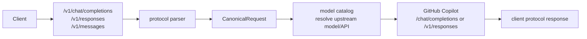

# Protocol

本文是所有协议转换相关逻辑的唯一主文档：客户端三种入口协议如何解析，哪些字段保留、丢弃或透传，内部 `CanonicalRequest` 由哪些字段组成，以及最终发往 GitHub Copilot 时如何重建为上游 Chat Completions 或 Responses 请求。路由、账号选择、sticky、user-binding、并发和风控规则见 [routing.zh.md](routing.zh.md)。

## 数据流边界

Gateway 不把客户端请求原样转发给 Copilot。所有请求都会先进入协议 parser，归一化为内部 DTO，再由 Copilot provider 根据模型目录选择的上游协议重新组装。



客户端 header 不会原样透传到 Copilot。Provider 会重新生成上游 header，包括账号 bearer token、editor/user-agent 和 GitHub API version。`X-GHCP-*`、session、workspace 等字段属于路由输入，见 [routing.zh.md](routing.zh.md)。协议层只特殊处理 `/v1/models` 的 `Anthropic-Version`/Claude user agent 返回形状。

## 上游 API 选择

模型目录先把客户端传入的 exposed model 映射为 upstream model，并可决定 `upstream_api`。

| 优先级 | 规则 | 说明 |
| --- | --- | --- |
| 1 | 显式 `upstream_api` | `responses` / `chat_completions` / 兼容别名，优先级最高 |
| 2 | 显式或缓存 `vendor` | `OpenAI` / `Azure OpenAI` 归一化为 OpenAI，走上游 Responses；Google、Anthropic、Microsoft、xAI 走上游 Chat Completions |
| 3 | 从 `upstream` / `name` / `exposed` 推断 vendor | `gpt*`、`gpt-*` 和 OpenAI o-series 归为 OpenAI；`gemini*` 归为 Google；`claude*`、`opus*`、`haiku*`、`sonnet*` 归为 Anthropic；`MAI*` 归为 Microsoft；`grok*` / `xai*` 归为 xAI |
| 5 | 未能推断 | 保持空值，由 provider 按下游入口决定：`/v1/responses` 走 Responses，其它入口走 Chat Completions |

当前缓存的 Copilot 模型名形态包括 `GPT-5.4`、`GPT-5 mini`、`Gemini 3.1 Pro`、`Claude Opus/Sonnet/Haiku` 和 `MAI-Code-1-Flash`，所以推断会同时看真实上游 ID 和展示名，而不是只看 exposed alias。

## 推理参数策略

`reasoning`、`reasoning_effort`、`thinking` 这类参数不做跨协议归一化，只作为协议原生参数进入 `Params`，再按原字段名写入最终上游请求。Gateway 不把 Anthropic `thinking` 翻译成 OpenAI `reasoning`，也不把 OpenAI `reasoning_effort` 翻译成 Anthropic thinking budget。

原因是不同模型和上游 API 对推理控制的 shape、level、budget 语义并不一致。例如 OpenAI Responses 可能使用 `reasoning: { ... }`，OpenAI Chat 兼容入口可能使用 `reasoning_effort`，Claude/Anthropic 常见的是 `thinking`。Gateway 只负责保留客户端显式传入的原生字段；字段是否支持、level 是否有效、budget 上限是否合法，由目标模型和 GitHub Copilot 上游决定。

响应方向会把上游 reasoning/thinking delta 归一化成内部 `StreamEvent.ReasoningDelta`，再按客户端入口重建为 OpenAI Chat 的 `reasoning_content`、Responses 的 reasoning summary 事件，或 Anthropic 的 `thinking` block。这只影响响应事件形状，不代表请求侧有统一 reasoning level。

## 入口协议字段

### OpenAI Chat Completions

入口：`POST /v1/chat/completions`，内部 `request_format=openai_chat`。

保留并归一化：

| 请求字段 | 归一化结果 | 说明 |
| --- | --- | --- |
| `model` | `Model` | 之后由模型目录映射为 upstream model |
| `stream` | `Stream` | 决定下游是否返回 SSE |
| `messages` | `Messages` | 保留 `role`、`content`、`tool_calls`、`tool_call_id` |
| `tools` | `Tools` | OpenAI `function` tool 转为 canonical tool |
| `tool_choice` | `ToolChoice` | 保留并写入上游请求 |
| `max_tokens` / `max_completion_tokens` | `MaxTokens` | `max_tokens` 优先；没有时使用 `max_completion_tokens` |
| `user` | `Metadata.user` | sticky fallback；user-binding pool 会优先把它作为绑定 owner；不写入上游 `user` |
| `metadata.session_id` / `metadata.conversation_id` | `Metadata` | 只作为 sticky fallback |

透传到 `Params`，并在上游请求 body 中原名写出：

```text
temperature, top_p, stop, seed, response_format,
reasoning_effort, parallel_tool_calls, stream_options,
presence_penalty, frequency_penalty, logit_bias,
logprobs, top_logprobs, service_tier, modalities, audio
```

`reasoning_effort` 只按原名透传；不会转换为 Responses `reasoning` 或 Anthropic `thinking`。

丢弃或拒绝：未列出的 body 字段会被丢弃；`metadata` 里除 `session_id`、`conversation_id` 外的键会被丢弃；图片 URL 不是 `http`、`https` 或 `data:image/*;base64,...` 时拒绝请求；图片 part 总数超过 20 或 data URL 超过 20 MiB 时拒绝请求。

### OpenAI Responses API

入口：`POST /v1/responses`，内部 `request_format=openai_responses`。

保留并归一化：

| 请求字段 | 归一化结果 | 说明 |
| --- | --- | --- |
| `model` | `Model` | 之后由模型目录映射为 upstream model |
| `stream` | `Stream` | 决定下游是否返回 Responses SSE |
| `instructions` | `System` | 字符串化为系统指令 |
| `input` string | `Messages` | 转成一条 user message |
| `input` array | `Messages` / `System` | conversation item 归一化；`developer`/`system` 文本合并到 `System` |
| `tools` | `Tools` | OpenAI/Responses tool 转为 canonical tool |
| `tool_choice` | `ToolChoice` | 保留并写入上游请求 |
| `max_output_tokens` | `MaxTokens` | 上游 Responses 写为 `max_output_tokens` |
| `previous_response_id` | `Metadata.previous_response_id` | 仅当上游也走 Responses 时写回上游请求 |
| `user` | `Metadata.user` | sticky fallback；user-binding pool 会优先把它作为绑定 owner |
| `metadata.session_id` / `metadata.conversation_id` | `Metadata` | 只作为 sticky fallback |

透传到 `Params`，并在上游请求 body 中原名写出：

```text
temperature, top_p, text, reasoning, reasoning_effort,
response_format, parallel_tool_calls, stream_options,
truncation, include, store, service_tier
```

`reasoning` 和 `reasoning_effort` 只按原名透传；不会转换为 Anthropic `thinking`。

转换：`function_call` 转为 assistant tool call；`function_call_output` 转为 tool message；`input_text`、`output_text`、`text` 统一为 canonical text part；`input_image`、`image_url` 统一为 canonical `image_url`。

丢弃或拒绝：未列出的 body 字段会被丢弃；`metadata` 除 `session_id`、`conversation_id` 外丢弃；`input` array 里不支持的 content part 会被跳过；图片校验规则与 Chat Completions 相同。

### Anthropic Messages

入口：`POST /v1/messages`，内部 `request_format=anthropic_messages`。

保留并归一化：

| 请求字段 | 归一化结果 | 说明 |
| --- | --- | --- |
| `model` | `Model` | 之后由模型目录映射为 upstream model |
| `stream` | `Stream` | 决定下游是否返回 Anthropic SSE |
| `system` string / array | `System` | array 中 text 用换行合并，其它 block 不保留 |
| `messages` | `Messages` | `text`、`image`、`tool_use`、`tool_result` 会归一化 |
| `tools` | `Tools` | 保留 `name`、`description`、`input_schema`、`cache_control` |
| `tool_choice` | `ToolChoice` | `any` 映射为 `required`；`tool` 映射为 OpenAI function choice |
| `max_tokens` | `MaxTokens` | 上游 Chat 写为 `max_tokens`；上游 Responses 写为 `max_output_tokens` |

透传到 `Params`：

```text
temperature, top_p, top_k, stop, thinking, metadata
```

其中 `stop_sequences` 会重命名为 `stop`。`thinking` 只按原名透传；不会转换为 OpenAI `reasoning` 或 `reasoning_effort`。Anthropic `metadata` 仍是上游 body 参数；在 user-binding pool 中，`metadata.user_id` 或 `metadata.user` 也可作为绑定 owner。

转换：`tool_use` 转为 canonical function tool call；`tool_result` 转为 tool message；`image.source.url` 或 `image.source.data + media_type` 转为 OpenAI 风格 `image_url`；`cache_control` 会清理 undefined 占位值后保留在 tool 或 content part 上。

丢弃或拒绝：未列出的 body 字段会被丢弃；`system` array 里非 text block 丢弃；`messages[].content` array 里除 `text`、`image`、`tool_use`、`tool_result` 外的 block 会被跳过；图片校验规则与 Chat Completions 相同。

## 归一化层字段

`CanonicalRequest` 是协议层和 provider/router 之间的边界。

| Canonical 字段 | OpenAI Chat 来源 | Responses 来源 | Anthropic 来源 | 说明 |
| --- | --- | --- | --- | --- |
| `Format` | endpoint | endpoint | endpoint | `openai_chat` / `openai_responses` / `anthropic_messages` |
| `UpstreamAPI` | 模型目录 | 模型目录 | 模型目录 | 可为空；provider 会按下游入口兜底 |
| `Model` | `model` | `model` | `model` | 写入上游前已解析为 upstream model |
| `Stream` | `stream` | `stream` | `stream` | 只决定下游响应格式；provider 流式请求会强制上游 `stream=true` |
| `System` | 无独立字段 | `instructions` + `developer/system` input 文本 | `system` | 上游 Chat 会把它前置为一条 system message；上游 Responses 写为 `instructions` |
| `Messages` | `messages` | `input` | `messages` | 内容 part 会统一为 text/image/tool call/tool result 表达 |
| `Tools` | `tools` | `tools` | `tools` | 统一为 `type/name/description/input_schema/cache_control` |
| `ToolChoice` | `tool_choice` | `tool_choice` | `tool_choice` 转换后 | 不是所有协议的原始形状都能完整保留 |
| `MaxTokens` | `max_tokens` / `max_completion_tokens` | `max_output_tokens` | `max_tokens` | 写到上游时按目标 API 改名 |
| `Params` | 白名单透传字段 | 白名单透传字段 | 白名单透传字段 | 不是 arbitrary body；只包含 parser 明确收集的字段；reasoning/thinking 保持协议原生形状 |
| `Metadata` | `user`、部分 `metadata` | `user`、部分 `metadata`、`previous_response_id` | 无 | 用于 sticky 或 Responses continuation；不会整体发往上游 |

`CanonicalResponse` 只保留 `id`、`model`、`finish_reason/status`、文本 `content`、tool calls、usage 和创建时间。更复杂的上游响应结构不会完整保留。

## 发往 GitHub Copilot

Provider 按 `CanonicalRequest.UpstreamAPI` 选择上游路径；为空时，`openai_responses` 默认走 `/v1/responses`，其它入口默认走 `/chat/completions`。

### 上游 Chat Completions

路径：`POST https://api.githubcopilot.com/chat/completions`。

| 上游字段 | 来源 |
| --- | --- |
| `model` | `CanonicalRequest.Model` |
| `messages` | `System` 前置为 system message，再追加 `Messages` |
| `tools` | `Tools` 重建为 OpenAI function tool shape |
| `tool_choice` | `ToolChoice` |
| `max_tokens` | `MaxTokens` |
| 透传字段 | `Params` 原名复制 |

### 上游 Responses

路径：`POST https://api.githubcopilot.com/v1/responses`。

| 上游字段 | 来源 |
| --- | --- |
| `model` | `CanonicalRequest.Model` |
| `input` | `Messages` 重建为 Responses input item |
| `instructions` | `System` |
| `tools` | `Tools` 重建为 Responses tool shape |
| `tool_choice` | `ToolChoice` |
| `max_output_tokens` | `MaxTokens` |
| `previous_response_id` | `Metadata.previous_response_id` |
| 透传字段 | `Params` 原名复制 |

上游重建时的内容转换：

| Canonical 内容 | Chat 上游 | Responses 上游 |
| --- | --- | --- |
| text part | 原样放入 message content | user/tool 为 `input_text`，assistant 为 `output_text` |
| image part | `image_url` | `input_image`，保留 url/detail |
| assistant tool call | `tool_calls` | `function_call` input item |
| tool result | `tool` message + `tool_call_id` | `function_call_output` input item |
| `cache_control` | 尽量保留在 tool/content part | 尽量保留在 tool/content part |

## 响应适配

上游响应先解析为 `CanonicalResponse` 或 `StreamEvent`，再按客户端原始入口重建为对应协议。

| 客户端入口 | 非流式响应 | 流式响应 |
| --- | --- | --- |
| OpenAI Chat | `chat.completion` | `chat.completion.chunk` + `[DONE]` |
| OpenAI Responses | `response` | `response.created`、`response.output_text.delta`、`response.completed` 等事件 |
| Anthropic Messages | Anthropic message shape | `message_start`、`content_block_delta`、`message_delta`、`message_stop` 等事件 |

Usage 会统一为 input/output/cached/reasoning tokens、AI credits 和成本估算，并记录 `request_format`、`pool_id`、`account_id`。

## 丢失与失真注意事项

- 客户端未知 body 字段默认丢弃，不会进入 `Params`，也不会透传给 Copilot。
- 客户端 header 默认不透传；认证、sticky、user-binding 等输入只影响 Gateway 自身逻辑。
- `user`、`metadata.session_id`、`metadata.conversation_id` 不会成为上游 `user`。
- User-binding owner 优先来自标准请求字段：OpenAI Chat/Responses 的 `user`、Anthropic `metadata.user_id` 或 `metadata.user`；`X-GHCP-User` 仅作为旧客户端兼容 fallback。
- Responses 的 `previous_response_id` 只有在目标上游 API 也是 Responses 时才会保留；如果模型被配置成上游 Chat Completions，该字段会丢失。
- Responses 的 `developer`/`system` input 和 Anthropic `system` array 会合并为单个 `System` 字符串，原始 block 边界和部分顺序信息可能失真。
- Anthropic `tool_choice.any` 会变成 OpenAI 风格 `required`；`tool_choice.tool` 会变成 function choice。
- Anthropic `stop_sequences` 会改名为上游 `stop`。
- 非支持的 Responses content part、Anthropic content block 和 system block 会被跳过。
- 非流式上游 Responses 当前主要提取文本输出；复杂 output item 的完整结构不会保留到所有下游协议。
- 多协议之间的流式事件只是兼容形状重建，不保证每个原协议事件字段一一对应。