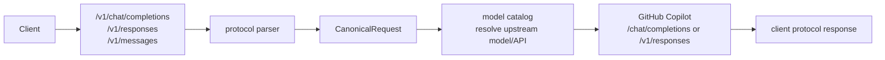

# Protocol

本文是所有协议转换相关逻辑的唯一主文档：客户端三种入口协议如何解析，哪些字段保留、丢弃或透传，内部 `CanonicalRequest` 由哪些字段组成，以及最终发往 GitHub Copilot 时如何重建为上游 Chat Completions 或 Responses 请求。路由、账号选择、sticky、user-binding、并发和风控规则见 [routing.zh.md](routing.zh.md)。

## 数据流边界

Gateway 不把客户端请求原样转发给 Copilot。所有请求都会先进入协议 parser，归一化为内部 DTO，再由 Copilot provider 根据模型目录选择的上游协议重新组装。



客户端 header 不会原样透传到 Copilot。Provider 会重新生成上游 header，包括账号 bearer token、editor/user-agent 和 GitHub API version。`X-GHCP-*`、session、workspace 等字段属于路由输入，见 [routing.zh.md](routing.zh.md)。协议层只特殊处理 `/v1/models` 的 `Anthropic-Version`/Claude user agent 返回形状。

## 上游 API 选择

模型目录先把客户端传入的 exposed model 映射为 upstream model，并可决定 `upstream_api`。

| 优先级 | 规则 | 说明 |
| --- | --- | --- |
| 1 | 显式 `upstream_api` | `responses` / `chat_completions` / 兼容别名，优先级最高 |
| 2 | 显式或缓存 `vendor` | `OpenAI` / `Azure OpenAI` 归一化为 OpenAI，走上游 Responses；Google、Anthropic、Microsoft、xAI 走上游 Chat Completions |
| 3 | 从 `upstream` / `name` / `exposed` 推断 vendor | `gpt*`、`gpt-*` 和 OpenAI o-series 归为 OpenAI；`gemini*` 归为 Google；`claude*`、`opus*`、`haiku*`、`sonnet*` 归为 Anthropic；`MAI*` 归为 Microsoft；`grok*` / `xai*` 归为 xAI |
| 5 | 未能推断 | 保持空值，由 provider 按下游入口决定：`/v1/responses` 走 Responses，其它入口走 Chat Completions |

当前缓存的 Copilot 模型名形态包括 `GPT-5.4`、`GPT-5 mini`、`Gemini 3.1 Pro`、`Claude Opus/Sonnet/Haiku` 和 `MAI-Code-1-Flash`，所以推断会同时看真实上游 ID 和展示名，而不是只看 exposed alias。

### Claude Code 自定义模型名

Claude Code 可以在 Anthropic Messages 请求中发送自己的 `model` 名称。适配点是模型目录，而不是 Copilot provider：把 Claude Code 会发送的名称配置为 `exposed`，把 GitHub Copilot `/models` 返回的真实模型 ID 配置为 `upstream`。

示例：

```json
[
  {
    "exposed": "sonnet",
    "upstream": "claude-sonnet-4-20250514",
    "vendor": "Anthropic",
    "upstream_api": "chat_completions",
    "enabled": true
  },
  {
    "exposed": "opus",
    "upstream": "claude-opus-4-20250514",
    "vendor": "Anthropic",
    "upstream_api": "chat_completions",
    "enabled": true
  }
]
```

Dashboard 中可在 Models 页点击 `Refresh from Copilot` 拉取真实模型，再把 `Exposed Model ID` 改成 Claude Code 需要的名称。保存后，Claude Code 请求里的 `model=sonnet` 会在进入 Copilot 前映射为 `claude-sonnet-4-20250514`。

Claude Code 侧可通过 `/model <alias|name>`、启动参数 `claude --model <alias|name>`、环境变量 `ANTHROPIC_MODEL=<alias|name>`，或 `~/.claude/settings.json` / `.claude/settings.json` 中的 `model` 字段设置模型。它常见会使用别名而不是完整 Anthropic model ID；在本系统里，这些别名应作为 `exposed` 名称配置。

| Claude Code model name | 建议 `model_catalog_json.exposed` | `model_catalog_json.upstream` 应填 | 说明 |
| --- | --- | --- | --- |
| `sonnet` | `sonnet` | Copilot `/models` 返回的 Sonnet 模型 ID，例如 `claude-sonnet-4-20250514` | 日常编码默认推荐别名；route policy 可直接写 `sonnet` 或真实 upstream ID |
| `sonnet[1m]` | `sonnet[1m]` | 支持 1M 上下文的 Sonnet upstream；没有单独 1M ID 时可先映射到同一个 Sonnet ID | Claude Code 在 LLM gateway 场景会用这个名字选择 1M 上下文；上游是否真的支持取决于 Copilot 返回的模型能力 |
| `opus` | `opus` | Copilot `/models` 返回的 Opus 模型 ID | 复杂推理任务别名 |
| `opus[1m]` | `opus[1m]` | 支持 1M 上下文的 Opus upstream；没有单独 1M ID 时可先映射到同一个 Opus ID | 与 `sonnet[1m]` 类似，建议显式配置，避免模型目录拒绝请求 |
| `haiku` | `haiku` | Copilot `/models` 返回的 Haiku 模型 ID | 低延迟、简单任务别名 |
| `fable` | `fable` | Copilot `/models` 返回的 Fable 模型 ID | 仅当 Copilot 账号可见 Fable 类模型时配置；不可见时不要暴露 |
| `best` | `best` | 优先映射到 Fable；没有 Fable 时映射到 Opus | Claude Code 语义是“可用时 Fable，否则最新 Opus”；网关不会自动判断，需要按你的账号可用模型手动指定 |
| 完整模型 ID，例如 `claude-sonnet-5`、`claude-opus-4-8`、`claude-haiku-4-5` | 同客户端会发送的完整 ID | Copilot `/models` 中对应的真实 ID | 如果你在 Claude Code 中钉死完整模型名，就把完整名作为 `exposed`；若 Copilot 返回 ID 完全一致，则 `upstream` 可相同 |
| 自定义 picker 选项，例如 `my-gateway/claude-opus-4-8` | 同自定义字符串 | 实际要发给 Copilot 的模型 ID | 适用于 `ANTHROPIC_CUSTOM_MODEL_OPTION`；`exposed` 必须与 Claude Code 发出的字符串精确一致 |

`upstream` 的权威来源是 Dashboard Models 页的 `Refresh from Copilot` 结果，而不是上表中的示例。不同账号、seat、地区或 Copilot 后端版本可能返回不同 ID；配置时以实际可见模型为准。对 Claude/Anthropic 家族模型，通常保留 `vendor="Anthropic"` 或显式设置 `upstream_api="chat_completions"`。

## 推理参数策略

`reasoning`、`reasoning_effort`、`thinking` 这类参数不做跨协议归一化，只作为协议原生参数进入 `Params`，再按原字段名写入最终上游请求。Gateway 不把 Anthropic `thinking` 翻译成 OpenAI `reasoning`，也不把 OpenAI `reasoning_effort` 翻译成 Anthropic thinking budget。

原因是不同模型和上游 API 对推理控制的 shape、level、budget 语义并不一致。例如 OpenAI Responses 可能使用 `reasoning: { ... }`，OpenAI Chat 兼容入口可能使用 `reasoning_effort`，Claude/Anthropic 常见的是 `thinking`。Gateway 只负责保留客户端显式传入的原生字段；字段是否支持、level 是否有效、budget 上限是否合法，由目标模型和 GitHub Copilot 上游决定。

响应方向会把上游 reasoning/thinking delta 归一化成内部 `StreamEvent.ReasoningDelta`，再按客户端入口重建为 OpenAI Chat 的 `reasoning_content`、Responses 的 reasoning summary 事件，或 Anthropic 的 `thinking` block。这只影响响应事件形状，不代表请求侧有统一 reasoning level。

## 入口协议字段

### OpenAI Chat Completions

入口：`POST /v1/chat/completions`，内部 `request_format=openai_chat`。

保留并归一化：

| 请求字段 | 归一化结果 | 说明 |
| --- | --- | --- |
| `model` | `Model` | 之后由模型目录映射为 upstream model |
| `stream` | `Stream` | 决定下游是否返回 SSE |
| `messages` | `Messages` | 保留 `role`、`content`、`tool_calls`、`tool_call_id` |
| `tools` | `Tools` | OpenAI `function` tool 转为 canonical tool |
| `tool_choice` | `ToolChoice` | 保留并写入上游请求 |
| `max_tokens` / `max_completion_tokens` | `MaxTokens` | `max_tokens` 优先；没有时使用 `max_completion_tokens` |
| `user` | `Metadata.user` | sticky fallback；`user_binding` pool 会优先把它作为 `user_id`；不写入上游 `user` |
| `session` / `metadata.session_id` / `metadata.session` / `metadata.conversation_id` | `Metadata` | sticky fallback；`session_binding` pool 使用 `session_id` / `session` 作为 `session_id` |

透传到 `Params`，并在上游请求 body 中原名写出：

```text
temperature, top_p, stop, seed, response_format,
reasoning_effort, parallel_tool_calls, stream_options,
max_completion_tokens, presence_penalty, frequency_penalty, logit_bias,
logprobs, top_logprobs, service_tier, modalities, audio
```

只有客户端使用 `max_completion_tokens` 且没有同时发送 `max_tokens` 时，才会按原字段名透传它，以保留 o-series 等严格 Chat 兼容接口需要的字段名。`reasoning_effort` 只按原名透传；不会转换为 Responses `reasoning` 或 Anthropic `thinking`。

丢弃或拒绝：未列出的 body 字段会被丢弃；`metadata` 里除 `session_id`、`conversation_id` 外的键会被丢弃；图片 URL 不是 `http`、`https` 或 `data:image/*;base64,...` 时拒绝请求；图片 part 总数超过 20 或 data URL 超过 20 MiB 时拒绝请求。

### OpenAI Responses API

入口：`POST /v1/responses`，内部 `request_format=openai_responses`。

保留并归一化：

| 请求字段 | 归一化结果 | 说明 |
| --- | --- | --- |
| `model` | `Model` | 之后由模型目录映射为 upstream model |
| `stream` | `Stream` | 决定下游是否返回 Responses SSE |
| `instructions` | `System` | 字符串化为系统指令 |
| `input` string | `Messages` | 转成一条 user message |
| `input` array | `Messages` / `System` | conversation item 归一化；`developer`/`system` 文本合并到 `System` |
| `tools` | `Tools` | OpenAI/Responses tool 转为 canonical tool |
| `tool_choice` | `ToolChoice` | 保留并写入上游请求 |
| `max_output_tokens` | `MaxTokens` | 上游 Responses 写为 `max_output_tokens` |
| `previous_response_id` | `Metadata.previous_response_id` | 仅当上游也走 Responses 时写回上游请求 |
| `user` | `Metadata.user` | sticky fallback；`user_binding` pool 会优先把它作为 `user_id` |
| `session` / `metadata.session_id` / `metadata.session` / `metadata.conversation_id` | `Metadata` | sticky fallback；`session_binding` pool 使用 `session_id` / `session` 作为 `session_id` |

透传到 `Params`，并在上游请求 body 中原名写出：

```text
temperature, top_p, text, reasoning, reasoning_effort,
response_format, parallel_tool_calls, stream_options,
truncation, include, store, service_tier
```

`reasoning` 和 `reasoning_effort` 只按原名透传；不会转换为 Anthropic `thinking`。

对于 Copilot 上游，`include` 会丢弃不支持的 `reasoning.encrypted_content`；如果列表因此为空，则省略 `include`。

OpenAI Responses 请求中的工具会先保留在 canonical tool 记录中，便于诊断和后续适配。发往 Copilot 上游时，Provider 使用 cc-switch 风格的 tools adapter，而不是把非 function tool 原样透传：`function` 直接保留；`custom` 包装成带固定 `input` 字符串参数的 function tool，并把原始定义写入 description；`tool_search` 包装成名为 `tool_search` 的 proxy function；`namespace` 会展开其中的 function 子工具，并把名称扁平化为 `<namespace>___<tool>`。`tool_choice` 会同步映射到转换后的 function 名称，无法映射到有效上游工具时会被省略。上游返回 tool call 后，adapter 会把转换后的 function 名称还原为 Responses 下游语义：`custom_tool_call` 使用 `response.custom_tool_call_input.*` 事件，`tool_search` 输出 `tool_search_call` item，namespace 子工具会恢复原始 tool 名称并在 `function_call` item 上带回 `namespace` 字段。当前 Copilot 上游会拒绝 OpenAI Responses remote MCP `type: "mcp"`，所以 remote MCP tool 仍会过滤，直到实现 gateway-managed MCP discovery/执行适配；如果适配/过滤后没有任何支持的 tool，会同时省略 `tool_choice` 和 `parallel_tool_calls`。可用 `scripts/probe_stream_mcp.py` 对比 MCP 请求和无工具 baseline 的 SSE 事件形状。

转换：顶层直接出现的 `input_text`、`input_image`、`text`、`image_url` input item 会合并成一条 user message；`function_call` 转为 assistant tool call；`function_call_output` 转为 tool message；`input_text`、`output_text`、`text` 统一为 canonical text part；`input_image`、`image_url` 统一为 canonical `image_url`。

丢弃或拒绝：未列出的 body 字段会被丢弃；`metadata` 除 `session_id`、`conversation_id` 外丢弃；`input` array 里不支持的 content part 会被跳过；图片校验规则与 Chat Completions 相同。

### Anthropic Messages

入口：`POST /v1/messages`，内部 `request_format=anthropic_messages`。

保留并归一化：

| 请求字段 | 归一化结果 | 说明 |
| --- | --- | --- |
| `model` | `Model` | 之后由模型目录映射为 upstream model |
| `stream` | `Stream` | 决定下游是否返回 Anthropic SSE |
| `system` string / array | `System` | array 中 text 用换行合并，其它 block 不保留 |
| `messages` | `Messages` / `System` | `text`、`image`、`tool_use`、`tool_result` 会归一化；`role=system` message 会折叠进 `System` |
| `tools` | `Tools` | 保留 `name`、`description`、`input_schema`、`cache_control` |
| `tool_choice` | `ToolChoice` | `any` 映射为 `required`；`tool` 映射为 OpenAI function choice |
| `max_tokens` | `MaxTokens` | 上游 Chat 写为 `max_tokens`；上游 Responses 写为 `max_output_tokens` |

透传到 `Params`：

```text
temperature, top_p, top_k, stop, thinking, metadata
```

其中 `stop_sequences` 会重命名为 `stop`。`thinking` 只按原名透传；不会转换为 OpenAI `reasoning` 或 `reasoning_effort`。Anthropic `metadata` 仍是上游 body 参数；绑定池也会读取 `metadata.user_id` / `metadata.user` 作为 `user_id`，读取 `metadata.session_id` / `metadata.session` 作为 `session_id`。

转换：`tool_use` 转为 canonical function tool call；`tool_result` 转为 tool message；`image.source.url` 或 `image.source.data + media_type` 转为 OpenAI 风格 `image_url`；`cache_control` 会清理 undefined 占位值后保留在 tool 或 content part 上。

丢弃或拒绝：未列出的 body 字段会被丢弃；`system` array 里非 text block 丢弃；`messages[].content` array 里除 `text`、`image`、`tool_use`、`tool_result` 外的 block 会被跳过；图片校验规则与 Chat Completions 相同。

## 归一化层字段

`CanonicalRequest` 是协议层和 provider/router 之间的边界。

| Canonical 字段 | OpenAI Chat 来源 | Responses 来源 | Anthropic 来源 | 说明 |
| --- | --- | --- | --- | --- |
| `Format` | endpoint | endpoint | endpoint | `openai_chat` / `openai_responses` / `anthropic_messages` |
| `UpstreamAPI` | 模型目录 | 模型目录 | 模型目录 | 可为空；provider 会按下游入口兜底 |
| `Model` | `model` | `model` | `model` | 写入上游前已解析为 upstream model |
| `Stream` | `stream` | `stream` | `stream` | 只决定下游响应格式；provider 流式请求会强制上游 `stream=true` |
| `System` | 无独立字段 | `instructions` + `developer/system` input 文本 | `system` | 上游 Chat 会把它前置为一条 system message；上游 Responses 写为 `instructions` |
| `Messages` | `messages` | `input` | `messages` | 内容 part 会统一为 text/image/tool call/tool result 表达 |
| `Tools` | `tools` | `tools` | `tools` | 统一为 `type/name/description/input_schema/cache_control` |
| `ToolChoice` | `tool_choice` | `tool_choice` | `tool_choice` 转换后 | 不是所有协议的原始形状都能完整保留 |
| `MaxTokens` | `max_tokens` / `max_completion_tokens` | `max_output_tokens` | `max_tokens` | 写到上游时按目标 API 改名 |
| `Params` | 白名单透传字段 | 白名单透传字段 | 白名单透传字段 | 不是 arbitrary body；只包含 parser 明确收集的字段；reasoning/thinking 保持协议原生形状 |
| `Metadata` | `user`、部分 `metadata` | `user`、部分 `metadata`、`previous_response_id` | 无 | 用于 sticky 或 Responses continuation；不会整体发往上游 |

`CanonicalResponse` 只保留 `id`、`model`、`finish_reason/status`、文本 `content`、tool calls、usage 和创建时间。更复杂的上游响应结构不会完整保留。

## 发往 GitHub Copilot

Provider 按 `CanonicalRequest.UpstreamAPI` 选择上游路径；为空时，`openai_responses` 默认走 `/v1/responses`，其它入口默认走 `/chat/completions`。

### 上游 Chat Completions

路径：`POST https://api.githubcopilot.com/chat/completions`。

| 上游字段 | 来源 |
| --- | --- |
| `model` | `CanonicalRequest.Model` |
| `messages` | `System` 前置为 system message，再追加 `Messages` |
| `tools` | 仅 function `Tools` 重建为 OpenAI function tool shape；Chat 上游会省略非 function tool |
| `tool_choice` | `ToolChoice`；没有有效 tool 发往上游时省略 |
| `max_tokens` / `max_completion_tokens` | `MaxTokens`；客户端使用 `max_completion_tokens` 时保留该字段名 |
| 透传字段 | `Params` 原名复制 |

如果最终有效的上游 tool 列表为空，会同时省略 `tool_choice` 和 `parallel_tool_calls`。一些严格的 Chat 兼容上游会拒绝“没有 tools 但带工具控制参数”的请求。

### 上游 Responses

路径：`POST https://api.githubcopilot.com/v1/responses`。

| 上游字段 | 来源 |
| --- | --- |
| `model` | `CanonicalRequest.Model` |
| `input` | `Messages` 重建为 Responses input item |
| `instructions` | `System` |
| `tools` | `Tools` 重建为 Responses tool shape |
| `tool_choice` | `ToolChoice`；没有有效 tool 发往上游时省略 |
| `max_output_tokens` | `MaxTokens` |
| `previous_response_id` | `Metadata.previous_response_id` |
| 透传字段 | `Params` 原名复制 |

上游重建时的内容转换：

| Canonical 内容 | Chat 上游 | Responses 上游 |
| --- | --- | --- |
| text part | 原样放入 message content | user/tool 为 `input_text`，assistant 为 `output_text` |
| image part | `image_url` | `input_image`，保留 url/detail |
| assistant tool call | `tool_calls` | `function_call` input item |
| tool result | `tool` message + `tool_call_id` | `function_call_output` input item |
| `cache_control` | 尽量保留在 tool/content part | 尽量保留在 tool/content part |

对于 Copilot Responses 上游，过长的 `call_id` 会被稳定缩短，以满足上游 64 字符限制；对应的 `function_call_output` 会使用同一个缩短后的 ID。

如果最终有效的上游 tool 列表为空，Responses 上游也会省略 `tool_choice` 和 `parallel_tool_calls`。当前 Copilot Responses 上游会拒绝 remote MCP tool（`type: "mcp"`），因此这类 tool 会在该检查前被过滤。

## 响应适配

上游响应先解析为 `CanonicalResponse` 或 `StreamEvent`，再按客户端原始入口重建为对应协议。

| 客户端入口 | 非流式响应 | 流式响应 |
| --- | --- | --- |
| OpenAI Chat | `chat.completion` | `chat.completion.chunk` + `[DONE]` |
| OpenAI Responses | `response` | `response.created`、`response.output_text.delta`、`response.completed` 等事件 |
| Anthropic Messages | Anthropic message shape | `message_start`、`content_block_delta`、`message_delta`、`message_stop` 等事件 |

Usage 会统一为 input/output/cached/reasoning tokens、AI credits 和成本估算，并记录 `request_format`、`pool_id`、`account_id`。Responses 流式 usage 会同时包含 OpenAI 风格的 `input_tokens_details.cached_tokens`、`output_tokens_details.reasoning_tokens`，以及网关扩展的 cost/cache 字段。

流式完成语义是显式的：Chat 上游必须以 `[DONE]` 结束；Responses 上游必须出现 `response.completed`、`response.incomplete`，或 Copilot Responses 变体中可接受的 terminal output 事件。下游 Responses 流会先发 `response.created` 和 `response.in_progress`；文本 content part 会带 `annotations: []` 以兼容 OpenAI 客户端。上游 `response.incomplete` 会透传为下游 `response.incomplete` + `[DONE]`；上游 `response.failed`、读错误，以及未出现可识别完成标记前的 EOF，会对 Responses 客户端输出协议级 `response.failed` + `[DONE]`。

本地 gateway 运行后，可用下面的脚本复现 MCP/tool 流式差异：

```bash
python3 scripts/probe_stream_mcp.py --models gpt-5.5 gemini-3.5-flash claude-sonnet-4.6 --timeout 90 --dump-raw-dir /tmp/ghcp-mcp-probe
```

## 丢失与失真注意事项

- 客户端未知 body 字段默认丢弃，不会进入 `Params`，也不会透传给 Copilot。
- 客户端 header 默认不透传；认证、sticky、account-binding 等输入只影响 Gateway 自身逻辑。
- `user`、`session`、`metadata.session_id`、`metadata.conversation_id` 不会成为上游 `user`。
- `user_binding` 使用 OpenAI Chat/Responses 的 `user`、Anthropic `metadata.user_id` / `metadata.user` 或 `X-GHCP-User` 作为 `user_id`；`session_binding` 使用 request/metadata session 字段或 session header 作为 `session_id`。
- Responses 的 `previous_response_id` 只有在目标上游 API 也是 Responses 时才会保留；如果模型被配置成上游 Chat Completions，该字段会丢失。
- Responses 的 `developer`/`system` input、Anthropic `system` array，以及 Anthropic `messages` 中的 `role=system` 都会合并为单个 `System` 字符串，原始 block 边界和部分顺序信息可能失真。
- Anthropic `tool_choice.any` 会变成 OpenAI 风格 `required`；`tool_choice.tool` 会变成 function choice。
- Anthropic `stop_sequences` 会改名为上游 `stop`。
- 非支持的 Responses content part、Anthropic content block 和 system block 会被跳过。
- 非流式上游 Responses 会提取文本输出和 `function_call` output item；其它复杂 output item 的完整结构不会保留到所有下游协议。
- 多协议之间的流式事件只是兼容形状重建，不保证每个原协议事件字段一一对应。