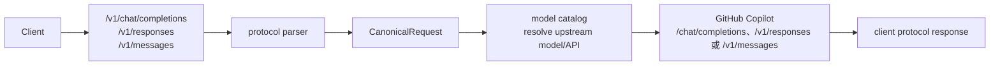

# Protocol

本文是所有协议转换相关逻辑的唯一主文档：客户端三种入口协议如何解析，哪些字段保留、归一化、拒绝或透传，内部 canonical DTO 由哪些字段组成，以及最终发往 GitHub Copilot 时如何重建为上游 Chat Completions、Responses 或 Anthropic Messages 请求。路由、账号选择、sticky、user-binding、并发和风控规则见 [routing.zh.md](routing.zh.md)。

## 目录

- [数据流边界](#数据流边界)
- [上游 API 选择](#上游-api-选择)
- [同协议语义与兼容开关](#同协议语义与兼容开关)
- [跨协议语义门禁](#跨协议语义门禁)
- [推理参数策略](#推理参数策略)
- [入口协议字段](#入口协议字段)
- [归一化层字段](#归一化层字段)
- [发往 GitHub Copilot](#发往-github-copilot)
- [响应适配](#响应适配)
- [丢失与失真注意事项](#丢失与失真注意事项)

## 数据流边界

Gateway 不把客户端请求原样转发给 Copilot。所有请求都会先进入协议 parser，归一化为内部 DTO，再由 Copilot provider 根据模型目录选择的上游协议重新组装。


```mermaid
flowchart LR
  C["Client"] --> E["/v1/chat/completions\n/v1/responses\n/v1/messages"]
  E --> P["protocol parser"]
  P --> R["CanonicalRequest"]
  R --> M["model catalog\nresolve upstream model/API"]
  M --> U["GitHub Copilot\n/chat/completions、/v1/responses 或 /v1/messages"]
  U --> O["client protocol response"]
```

客户端 header 不会原样透传到 Copilot。Provider 会重新生成上游 header，包括账号 bearer token、editor/user-agent 和 GitHub API version。`X-GHCP-*`、session、workspace 等字段属于路由输入，见 [routing.zh.md](routing.zh.md)。原生 Messages 只接收 typed `Anthropic-Version` 和白名单内的 `Anthropic-Beta`，任意客户端 header 不会跨过 provider 边界。

## 上游 API 选择

模型目录先把客户端传入的 exposed model 映射为 upstream model，并可决定 `upstream_api`。

| 优先级 | 规则 | 说明 |
| --- | --- | --- |
| 1 | 显式 `upstream_api` | `responses` / `chat_completions` / `anthropic_messages` / 兼容别名，优先级最高 |
| 2 | 显式或缓存 `vendor` | `OpenAI` / `Azure OpenAI` 归一化为 OpenAI，走上游 Responses；Anthropic 走上游 Messages；Google、Microsoft、xAI 走上游 Chat Completions |
| 3 | 从 `upstream` / `name` / `exposed` 推断 vendor | `gpt*`、`gpt-*` 和 OpenAI o-series 归为 OpenAI；`gemini*` 归为 Google；`claude*`、`opus*`、`haiku*`、`sonnet*` 归为 Anthropic；`MAI*` 归为 Microsoft；`grok*` / `xai*` 归为 xAI |
| 5 | 未能推断 | 保持空值，由 provider 按下游入口决定：`/v1/responses` 走 Responses，其它入口走 Chat Completions |

当前缓存的 Copilot 模型名形态包括 `GPT-5.4`、`GPT-5 mini`、`Gemini 3.1 Pro`、`Claude Opus/Sonnet/Haiku` 和 `MAI-Code-1-Flash`，所以推断会同时看真实上游 ID 和展示名，而不是只看 exposed alias。

模型解析是 Gateway 全局行为，不校验 Router 选中账号是否具备该模型权限；pool 必须使用模型权限相同的账号。详见[候选账号过滤](routing.zh.md#候选账号过滤)。

### Claude Code 自定义模型名

Claude Code 可以在 Anthropic Messages 请求中发送自己的 `model` 名称。适配点是模型目录，而不是 Copilot provider：把 Claude Code 会发送的名称配置为 `exposed`，把 GitHub Copilot `/models` 返回的真实模型 ID 配置为 `upstream`。

示例：

```json
[
  {
    "exposed": "sonnet",
    "upstream": "claude-sonnet-4-20250514",
    "vendor": "Anthropic",
    "upstream_api": "anthropic_messages",
    "enabled": true
  },
  {
    "exposed": "opus",
    "upstream": "claude-opus-4-20250514",
    "vendor": "Anthropic",
    "upstream_api": "anthropic_messages",
    "enabled": true
  }
]
```

Dashboard 中可在 Models 页点击 `Refresh from Copilot` 拉取真实模型，再把 `Exposed Model ID` 改成 Claude Code 需要的名称。保存后，Claude Code 请求里的 `model=sonnet` 会在进入 Copilot 前映射为 `claude-sonnet-4-20250514`。

Claude Code 侧可通过 `/model <alias|name>`、启动参数 `claude --model <alias|name>`、环境变量 `ANTHROPIC_MODEL=<alias|name>`，或 `~/.claude/settings.json` / `.claude/settings.json` 中的 `model` 字段设置模型。它常见会使用别名而不是完整 Anthropic model ID；在本系统里，这些别名应作为 `exposed` 名称配置。

| Claude Code model name | 建议 `model_catalog_json.exposed` | `model_catalog_json.upstream` 应填 | 说明 |
| --- | --- | --- | --- |
| `sonnet` | `sonnet` | Copilot `/models` 返回的 Sonnet 模型 ID，例如 `claude-sonnet-4-20250514` | 日常编码默认推荐别名；模型目录会在调用 provider 前完成解析 |
| `sonnet[1m]` | `sonnet[1m]` | 支持 1M 上下文的 Sonnet upstream；没有单独 1M ID 时可先映射到同一个 Sonnet ID | Claude Code 在 LLM gateway 场景会用这个名字选择 1M 上下文；上游是否真的支持取决于 Copilot 返回的模型能力 |
| `opus` | `opus` | Copilot `/models` 返回的 Opus 模型 ID | 复杂推理任务别名 |
| `opus[1m]` | `opus[1m]` | 支持 1M 上下文的 Opus upstream；没有单独 1M ID 时可先映射到同一个 Opus ID | 与 `sonnet[1m]` 类似，建议显式配置，避免模型目录拒绝请求 |
| `haiku` | `haiku` | Copilot `/models` 返回的 Haiku 模型 ID | 低延迟、简单任务别名 |
| `fable` | `fable` | Copilot `/models` 返回的 Fable 模型 ID | 仅当 Copilot 账号可见 Fable 类模型时配置；不可见时不要暴露 |
| `best` | `best` | 优先映射到 Fable；没有 Fable 时映射到 Opus | Claude Code 语义是“可用时 Fable，否则最新 Opus”；网关不会自动判断，需要按你的账号可用模型手动指定 |
| 完整模型 ID，例如 `claude-sonnet-5`、`claude-opus-4-8`、`claude-haiku-4-5` | 同客户端会发送的完整 ID | Copilot `/models` 中对应的真实 ID | 如果你在 Claude Code 中钉死完整模型名，就把完整名作为 `exposed`；若 Copilot 返回 ID 完全一致，则 `upstream` 可相同 |
| 自定义 picker 选项，例如 `my-gateway/claude-opus-4-8` | 同自定义字符串 | 实际要发给 Copilot 的模型 ID | 适用于 `ANTHROPIC_CUSTOM_MODEL_OPTION`；`exposed` 必须与 Claude Code 发出的字符串精确一致 |

Claude Code `2.1.238` 会把 `claude-opus-4-8` 识别为支持 adaptive thinking 的模型，而已验证账号的 Copilot 目录返回 `claude-opus-4.8`。应显式配置以下客户端/上游别名：

```json
{"exposed":"claude-opus-4-8","upstream":"claude-opus-4.8","vendor":"Anthropic","upstream_api":"anthropic_messages","enabled":true}
```

Claude Code 的 `model`、`ANTHROPIC_MODEL`，以及需要 Opus 默认值时的 `ANTHROPIC_DEFAULT_OPUS_MODEL` 都应设为 `claude-opus-4-8`。CC Switch 的 Claude provider 会把 `model` 和 `opusModel` 写入这些环境变量，因此两个字段都应使用连字符 exposed ID。其 `reasoningEffort` 字段属于 Codex provider，不能开启 Claude effort。Claude Code 根据模型 ID 判定支持 effort 后，应在 Claude Code 内选择档位或显式传入 `--effort medium`；实测 Claude Code `2.1.238` 会忽略孤立 `settings.json` 中的 `effortLevel:"medium"`，仍发送默认 `high`。

使用 `--effort medium` 时，Claude Code `2.1.238` 会发送 `thinking.type=adaptive`、`thinking.display=omitted`、`output_config.effort=medium`，以及 `mid-conversation-system-2026-04-07`、`effort-2025-11-24` 两个 beta token。该精确请求已由 Copilot 的 `claude-opus-4.8` 成功接受。客户端使用点号 ID `claude-opus-4.8` 或当前自定义 Sonnet `claude-sonnet-4.6` 时仍采用固定 manual thinking，Claude Code 不提供可调 effort。

`upstream` 的权威来源是 Dashboard Models 页的 `Refresh from Copilot` 结果，而不是上表中的示例。不同账号、seat、地区或 Copilot 后端版本可能返回不同 ID；配置时以实际可见模型为准。经过真实文本、流式、工具循环、协议转换和取消验证后，Anthropic vendor 推断默认走原生 Messages。要回滚某个模型，可显式设置 `upstream_api="chat_completions"`。

## 同协议语义与兼容开关

“同协议”指 typed 语义保真，不是字节透传。Gateway 仍会解析和校验 body、映射模型、选择账号、执行预算/并发规则、生成认证与安全 header、归一化 usage，并验证流式终态。

| 路径 | 同协议路径保留 | 明确归一化 |
| --- | --- | --- |
| Responses → Responses | 结构化 `instructions`；有序 message/reasoning/function/custom/tool-search 输入输出 item；item/call ID、status、namespace、`previous_response_id`；SSE response/item ID 与 index；completed/incomplete/failed 语义 | model ID、认证/Copilot header、过长 call ID、encrypted-reasoning include 兼容 fallback，以及 provider 不支持 tool 的前置拒绝 |
| Messages → Messages | 有序 system/message block；text、image、tool use/result、`is_error`、thinking/signature、redacted thinking、cache breakpoint；原生 stop reason、usage 和严格 `message_stop` 完成 | model ID、认证 header、beta 白名单、thinking/tool-choice 冲突处理和不支持的 cache-control 子字段 |

Gateway 会保留并转发 `previous_response_id`，但 Copilot 可能拒绝有状态续接。出现这种情况时，Responses 工具循环应显式发送有序的 `function_call` 与 `function_call_output` input item。

以下 Feature Flag 存在 PostgreSQL，可在 Dashboard 编辑。默认全部开启；旧库缺少键或临时读取失败时也按开启处理。Migration `015_copilot_compatibility_flags.sql` 会写入显式 `true`，Gateway 最长缓存 60 秒。

| Feature Flag | 开启后的作用 |
| --- | --- |
| `copilot_compat_anthropic_beta_enabled` | 只发送已验证的 fine-grained tool streaming 与 interleaved thinking beta token |
| `copilot_compat_thinking_tool_choice_enabled` | 原生 Messages 同时开启 thinking 与强制 tool choice 时，把 tool choice 改为 `auto` |
| `copilot_compat_cache_control_enabled` | 保留 ephemeral cache breakpoint，同时移除不支持的子字段 |
| `copilot_compat_vision_header_enabled` | typed 请求内容含图片时增加 `Copilot-Vision-Request: true` |

把模型目录 override 改回 `chat_completions` 即可回滚原生 Messages，无需重启或回滚 schema。单个兼容开关关闭后，在 Feature Flag cache 刷新后的新请求生效。

## 跨协议语义门禁

模型目录解析完成后，所有非原生路径必须匹配下面六个显式转换策略之一。公共 text、image、function tool、usage 和可映射终态继续投影。普通客户端以成功响应优先：无法映射到目标协议的已知顶层参数会在语义校验前删除，并记录仅含 route 与参数名的结构化日志；未知顶层参数由 JSON parser 忽略。无法安全投影的内容、角色、item/block、tool lifecycle、identity 和终态语义仍会拒绝。

| 方向 | 明确兼容的投影 | Fail-closed 示例 | 明确允许的 shape 归一化 |
| --- | --- | --- | --- |
| Chat → Responses | message、image、function tool/result、reasoning text | `message.name` 和无法保真的 typed history 扩展 | 合成 Responses item ID 与 lifecycle |
| Chat → Messages | message、image、function tool/result、公共 stop reason | `message.name`、reasoning content/delta、非文本 system/developer 内容 | 删除目标无法表达的 Chat 参数；合成 Anthropic block 与 lifecycle；纯文本 system/developer message 转为顶层 `system` |
| Responses → Chat | message/text/image、function call/output item | `previous_response_id`、结构化 instructions、reasoning/custom/tool-search/refusal item、message phase、tool namespace | 删除目标无法表达的 Responses 参数；省略 Responses item/lifecycle identity |
| Responses → Messages | message/text/image、function call/output item | 上述 Responses-only 语义，以及 Responses Lite/additional tools 和 reasoning/refusal delta | 省略 Responses item/lifecycle identity |
| Messages → Chat | text/image、普通文本 tool use/result | thinking/redacted block、signature、`is_error`、非文本 tool result、原生 cache/beta block 语义、来源 stop sequence 和非公共终态 | 删除目标无法表达的 Messages 参数；省略 Anthropic block/lifecycle identity |
| Messages → Responses | text/image、普通文本 tool use/result | thinking/redacted block、signature、`is_error`、非文本 tool result、原生 cache/beta block 语义、来源 stop sequence 和非公共终态 | 删除目标无法表达的 Messages 参数；省略 Anthropic block/lifecycle identity |

Request validator 在路由、预算 reservation 和 provider dispatch 前执行，不兼容请求返回 `400 invalid_request_error`。非流式 response validator 在 typed 上游解析后、客户端序列化前执行；不兼容时返回 `502`，且不记录 durable success。Stream validator 在每个 canonical event 进入下游 SSE writer 前执行；不兼容时写入对应入口的 stream error shape，并把 provider attempt 保留为 `outcome_unknown`。

Parser 和语义门禁错误会包含转换方向、JSON path 和稳定 reason。未知顶层请求字段会被忽略，已知但目标不可表达的参数会按固定表删除；typed Responses item/content 字段或类型、typed Anthropic block 字段或类型仍会在 canonical 边界被拒绝。

## 推理参数策略

`reasoning`、`reasoning_effort`、`thinking` 这类参数不做跨协议归一化。原生路径会把它们作为协议原生参数放入 `Params`，再按原字段名写入最终上游请求；跨协议路径只有在目标 builder 能保留相同字段语义时才接受，否则由语义门禁拒绝。Gateway 不把 Anthropic `thinking` 翻译成 OpenAI `reasoning`，也不把 OpenAI `reasoning_effort` 翻译成 Anthropic thinking budget。

原因是不同模型和上游 API 对推理控制的 shape、level、budget 语义并不一致。例如 OpenAI Responses 可能使用 `reasoning: { ... }`，OpenAI Chat 兼容入口可能使用 `reasoning_effort`，Claude/Anthropic 常见的是 `thinking`。Gateway 只负责保留客户端显式传入的原生字段；字段是否支持、level 是否有效、budget 上限是否合法，由目标模型和 GitHub Copilot 上游决定。

响应方向中，Chat reasoning text 可保留到 Chat，或重建为 Responses reasoning item。结构化 Responses reasoning item 不能降级到 Chat/Messages；Anthropic thinking 的 block/signature 合同在其它协议中没有等价表达，因此在 block-start 就会被拒绝，不会先写出 thinking delta。Message phase 以及任何会被目标 writer 丢弃的 reasoning delta 也会被拒绝。这不代表请求侧存在统一 reasoning level。

## 入口协议字段

### OpenAI Chat Completions

入口：`POST /v1/chat/completions`，内部 `request_format=openai_chat`。

保留并归一化：

| 请求字段 | 归一化结果 | 说明 |
| --- | --- | --- |
| `model` | `Model` | 之后由模型目录映射为 upstream model |
| `stream` | `Stream` | 决定下游是否返回 SSE |
| `messages` | `Messages` | 原生 Chat 保留 typed `role`、`name`、`content`、`tool_calls`、`tool_call_id`、reasoning、refusal 和 audio 字段 |
| `tools` | `Tools` | OpenAI `function` tool 转为 canonical tool |
| `tool_choice` | `ToolChoice` | 保留并写入上游请求 |
| `max_tokens` / `max_completion_tokens` | `MaxTokens` | `max_tokens` 优先；没有时使用 `max_completion_tokens` |
| `user` | `Metadata.user` | sticky 备用输入；`user_binding` pool 会优先把它作为 `user_id`；不写入上游 `user` |
| `session` / `metadata.session_id` / `metadata.session` / `metadata.conversation_id` | `Metadata` | sticky 备用输入；`session_binding` pool 使用 `session_id` / `session` 作为 `session_id` |

保留到 `Params`，并在原生 Chat 路径的上游 body 中原名写出：

```text
temperature, top_p, stop, seed, response_format,
reasoning_effort, parallel_tool_calls, stream_options,
max_completion_tokens, presence_penalty, frequency_penalty, logit_bias,
logprobs, top_logprobs, service_tier, modalities, audio
```

只有客户端使用 `max_completion_tokens` 且没有同时发送 `max_tokens` 时才保留该字段，以维持原生 Chat 的 o-series 等严格行为。跨协议 builder 使用 canonical `MaxTokens`，并确定性改名为 Responses `max_output_tokens` 或 Messages `max_tokens`。`reasoning_effort` 只按原名透传，不会转换为 Responses `reasoning` 或 Anthropic `thinking`。

拒绝或归一化：未知顶层 body 字段会被忽略；`metadata` 里除 `session_id`、`conversation_id` 外的键不会进入路由 metadata；图片 URL 不是 `http`、`https` 或 `data:image/*;base64,...` 时拒绝请求；图片 part 总数超过 20 或 data URL 超过 20 MiB 时拒绝请求。

### OpenAI Responses API

入口：`POST /v1/responses`，内部 `request_format=openai_responses`。

保留并归一化：

| 请求字段 | 归一化结果 | 说明 |
| --- | --- | --- |
| `model` | `Model` | 之后由模型目录映射为 upstream model |
| `stream` | `Stream` | 决定下游是否返回 Responses SSE |
| `instructions` | `ResponsesInstructions` / `System` | Responses → Responses 保留结构化值，同时把文本投影到 `System` |
| `input` string | `SourceResponses` / `Messages` | 保留为 typed user item，并投影为一条 user message |
| `input` array | `SourceResponses` / `Messages` / `System` | typed item 按顺序保留 ID/status，同时生成跨协议投影 |
| `input[].type=additional_tools` | `SourceResponses[].Tools` / `Protocol.ResponsesLite` | 保留 Responses Lite 嵌套的 function、custom 和 namespace 工具，并标记 typed 协议模式 |
| `tools` | `Tools` | OpenAI/Responses tool 转为 canonical tool |
| `tool_choice` | `ToolChoice` | 保留并写入上游请求 |
| `max_output_tokens` | `MaxTokens` | 上游 Responses 写为 `max_output_tokens` |
| `previous_response_id` | `Metadata.previous_response_id` | 仅当上游也走 Responses 时写回上游请求 |
| `user` | `Metadata.user` | sticky 备用输入；`user_binding` pool 会优先把它作为 `user_id` |
| `session` / `metadata.session_id` / `metadata.session` / `metadata.conversation_id` | `Metadata` | sticky 备用输入；`session_binding` pool 使用 `session_id` / `session` 作为 `session_id` |

解析到 `Params`：

```text
temperature, top_p, text, reasoning, reasoning_effort,
response_format, parallel_tool_calls, stream_options,
truncation, include, store, service_tier, context_management
```

Copilot Responses adapter 会丢弃上游端点不接受的 `temperature`；列表中的其它参数仍按原名写入上游请求 body。

`reasoning` 和 `reasoning_effort` 只按原名透传；不会转换为 Anthropic `thinking`。

Responses `context_management` 只接受 `{ "type": "compaction", "compact_threshold": <正整数> }` 组成的数组。Gateway 仅在 Responses -> Responses 路径按原名保留该字段；容器错误、未知 entry type、字段缺失、未知嵌套字段以及非正数或非整数阈值都会在 provider dispatch 前拒绝。跨协议路径会丢弃该参数，因为目标协议不能保留 Responses 服务端 compaction 语义。

Copilot Responses 请求包含 `include=reasoning.encrypted_content` 时，无论客户端是否在白名单内，都会走有界兼容 fallback。Provider 只删除这个不支持的 include 值，列表因此为空时才省略 `include`。`codex_exec/<major>.<minor>.<patch>` 家族 User-Agent 与已认证 `codex-candidate` profile 的组合仍记录为 declared downgrade；运行时白名单不再钉死一个 Codex 版本。其它客户端记录一条结构化 WARN，只包含请求标识、route 和受控的 `provider_include_filtered` reason，同时递增 `applied_compatibility_fallback` 兼容指标。精确 CLI 版本继续作为发布证据身份，不进入请求路由键；其它语义校验保持不变。

Responses Lite 客户端可通过 `X-OpenAI-Internal-Codex-Responses-Lite: true` 标记请求，并把工具放在 `input` 首部的 `additional_tools` developer item 中。Gateway 只保存这个 typed 标记，不保存任意 header map；wire mode 可由该 header、`additional_tools` 或上述 Codex 家族 User-Agent 识别，但 wire mode 与 declared-downgrade 分类相互独立。目标为上游 Responses 时，嵌套工具在原 item 中重建且标记头继续转发；目标为上游 Chat 时，嵌套工具进入同一兼容 adapter。

OpenAI Responses 请求中的工具会保留在 canonical tool 记录中，用于诊断和转换元数据。发往 Copilot 上游时，Provider 直接保留 `function`，并对 `custom`、`tool_search`、`namespace` 使用 cc-switch 风格的 adapter：`custom` 包装成带固定 `input` 字符串参数的 function tool，并把原始定义写入 description；`tool_search` 包装成名为 `tool_search` 的 proxy function；`namespace` 展开其中的 function 和 custom 子工具，并把名称扁平化为 `<namespace>___<tool>`。经过严格校验的 `web_search` 只在原生 Responses 路径保留其 typed options；preview、带日期后缀、未知或跨协议的 web-search 类型会明确拒绝，不做猜测性规范化。强制 `tool_choice` 必须能解析到实际投影后的工具，否则在 dispatch 前拒绝；没有有效工具时只会省略中性的控制项。上游返回 tool call 后，adapter 会把转换后的 function 名称还原为 Responses 下游语义：`custom_tool_call` 使用 `response.custom_tool_call_input.*` 事件，`tool_search` 输出 `tool_search_call` item，namespace 子工具恢复原始 tool 名称并带回 `namespace` 字段，原生 `web_search_call` 的 action/lifecycle 则保持 typed Responses 输出。OpenAI Responses remote MCP tool（`type: "mcp"`）不受支持；由于 Gateway 没有 MCP discovery/执行 adapter，请求会在 provider dispatch 前拒绝。Namespace 的 `tools` 与 legacy `children` 集合都会验证；MCP、未知、畸形或其它不可投影 child 会 fail closed，不再被跳过。如果适配后没有有效 tool，会同时省略中性的 `tool_choice` 和 `parallel_tool_calls`。可用 `scripts/probe_stream_mcp.py` 对比 MCP 请求和无工具 baseline 的 SSE 事件形状。

最终上游 body 在序列化前会递归检查顶层 `tools` 和 Responses Lite `additional_tools.tools`。`function`、`custom`、`tool_search`、`namespace` 的 `description` 缺失、为 `null`、空字符串或纯空白时会补稳定的非空说明；已有非空说明保持不变，MCP、web search 等其它工具类型不改写。

转换：上游同为 Responses 时，会按原顺序重建 typed message、reasoning、function/custom/tool-search call/output item，并保留 identity/status；不支持的 custom/tool-search/namespace tool 仍通过兼容 adapter 包装成 function。跨协议时，顶层 text/image item 会合并成 user message，function call 转为 assistant tool call，output 转为 tool message；其它 item 家族由语义门禁拒绝。

拒绝或归一化：未知顶层字段会被忽略；未知 item/content-part 字段或类型仍会拒绝；`metadata` 除 `session_id`、`conversation_id` 外不会进入路由 metadata；图片校验规则与 Chat Completions 相同。

### Anthropic Messages

入口：`POST /v1/messages`，内部 `request_format=anthropic_messages`。

保留并归一化：

| 请求字段 | 归一化结果 | 说明 |
| --- | --- | --- |
| `model` | `Model` | 之后由模型目录映射为 upstream model |
| `stream` | `Stream` | 决定下游是否返回 Anthropic SSE |
| `system` string / array | `SystemBlocks` / `System` | 有序 typed block 保留，text 另行投影到 `System` |
| `messages` | `SourceMessages` / `Messages` / `System` | 原生 block 按顺序保留，同时生成跨协议 text/tool 投影 |
| `tools` | `Tools` | 保留 `name`、`description`、`input_schema`、`cache_control`；布尔 `eager_input_streaming` 作为客户端 hint 消费但不转发 |
| `tool_choice` | `ToolChoice` | `any` 映射为 `required`；`tool` 映射为 OpenAI function choice |
| `max_tokens` | `MaxTokens` | 上游 Chat 写为 `max_tokens`；上游 Responses 写为 `max_output_tokens` |

透传到 `Params`：

```text
temperature, top_p, top_k, stop, thinking, context_management, metadata
```

其中 `stop_sequences` 会重命名为 `stop`。`thinking` 和 `context_management` 只在原生 Messages 中按原名透传，不会转换为 OpenAI 等价字段。Anthropic `metadata` 仍是上游 body 参数；绑定池也会读取 `metadata.user_id` / `metadata.user` 作为 `user_id`，读取 `metadata.session_id` / `metadata.session` 作为 `session_id`。

原生保真范围包括 `text`、`image`、`tool_use`、`tool_result`、tool-result `is_error`、带 signature 的 `thinking`、`redacted_thinking`、`cache_control` 和 `context_management`。跨协议只投影普通 tool use/result、图片和文本；原生 block metadata 会被拒绝。

拒绝或归一化：未知顶层字段会被忽略；未知 block/tool 字段或类型仍会拒绝。Cherry Studio 生成的布尔 `tools[].eager_input_streaming` 会被丢弃，非布尔值仍返回带字段路径的 `400`；只在 `cache_control` 位置出现的 `"[Circular]"` 序列化占位符会被清除，不影响正文或 tool schema 中的同名字符串。图片校验规则与 Chat Completions 相同。原生 Messages 不转发任意 header 或 raw JSON 字段。

## 归一化层字段

`CanonicalRequest` 是协议层和 provider/router 之间的边界。

| Canonical 字段 | OpenAI Chat 来源 | Responses 来源 | Anthropic 来源 | 说明 |
| --- | --- | --- | --- | --- |
| `Format` | endpoint | endpoint | endpoint | `openai_chat` / `openai_responses` / `anthropic_messages` |
| `UpstreamAPI` | 模型目录 | 模型目录 | 模型目录 | 可为空；provider 会按下游入口兜底 |
| `Model` | `model` | `model` | `model` | 写入上游前已解析为 upstream model |
| `Stream` | `stream` | `stream` | `stream` | 只决定下游响应格式；provider 流式请求会强制上游 `stream=true` |
| `System` | 无独立字段 | `instructions` + `developer/system` input 文本 | `system` | 上游 Chat 会把它前置为一条 system message；上游 Responses 写为 `instructions` |
| `Messages` | `messages` | `input` | `messages` | 内容 part 会统一为 text/image/tool call/tool result 表达 |
| `SourceResponses` / `ResponsesInstructions` | 无 | typed `input` item / `instructions` | 无 | 仅用于 Responses → Responses 保真 |
| `SourceMessages` / `SystemBlocks` | 无 | 无 | 有序原生 block | 仅用于 Messages → Messages 保真 |
| `Tools` | `tools` | `tools` | `tools` | 统一为 `type/name/description/input_schema/cache_control` |
| `ToolChoice` | `tool_choice` | `tool_choice` | `tool_choice` 转换后 | 不是所有协议的原始形状都能完整保留 |
| `MaxTokens` | `max_tokens` / `max_completion_tokens` | `max_output_tokens` | `max_tokens` | 写到上游时按目标 API 改名 |
| `Params` | 白名单透传字段 | 白名单透传字段 | 白名单透传字段 | 不是 arbitrary body；只包含 parser 明确收集的字段；reasoning/thinking 保持协议原生形状 |
| `Metadata` | `user`、部分 `metadata` | `user`、部分 `metadata`、`previous_response_id` | 无 | 用于 sticky 或 Responses continuation；不会整体发往上游 |
| `Protocol` / `Compatibility` | 无 | Responses Lite 标记 | version/beta token 与已计算开关 | typed policy 输入，不是通用 header map |

`CanonicalResponse` 保留公共 text/tool 投影；原生路径还保留有序 Anthropic content block 或带 identity/status 的 Responses output item。`StreamEvent` 可携带原生 response/message ID、block/item index、signature delta、stop/incomplete reason 和 usage，同时仍可投影到其它下游协议。

## 发往 GitHub Copilot

Provider 按 `CanonicalRequest.UpstreamAPI` 选择上游路径；为空时，`openai_responses` 默认走 `/v1/responses`，其它入口默认走 `/chat/completions`。因此灰度期原生 Messages 必须使用显式模型目录 override。

### 上游 Chat Completions

路径：`POST https://api.githubcopilot.com/chat/completions`。

| 上游字段 | 来源 |
| --- | --- |
| `model` | `CanonicalRequest.Model` |
| `messages` | `System` 前置为 system message，再追加 `Messages` |
| `tools` | Chat 工具直接重建；Responses 的顶层及 `additional_tools` 工具经兼容 adapter 重建为 function tool shape |
| `tool_choice` | `ToolChoice`；无工具时可省略中性的 `auto`/`none`，`required` 或具名选择必须先通过语义验证并解析到实际工具 |
| `max_tokens` / `max_completion_tokens` | `MaxTokens`；客户端使用 `max_completion_tokens` 时保留该字段名 |
| 透传字段 | `Params` 原名复制 |

如果最终有效的上游 tool 列表为空，会省略中性的 `auto`/`none` 和 `parallel_tool_calls`；没有匹配投影工具的 `required` 或具名选择已由语义验证拒绝。一些严格的 Chat 兼容上游会拒绝“没有 tools 但带工具控制参数”的请求。

### 上游 Responses

路径：`POST https://api.githubcopilot.com/v1/responses`。

| 上游字段 | 来源 |
| --- | --- |
| `model` | `CanonicalRequest.Model` |
| `input` | 同协议请求使用 `SourceResponses`，包括 Responses Lite `additional_tools`；其它请求把 `Messages` 投影为 Responses item |
| `instructions` | 同协议请求使用结构化 `ResponsesInstructions`；其它请求使用 `System` |
| `tools` | 顶层 `Tools` 重建为 Responses tool shape；Responses Lite 工具保留在 `additional_tools.tools` |
| `tool_choice` | `ToolChoice`；无工具时可省略中性的 `auto`/`none`，`required` 或 typed 选择必须先通过语义验证并解析到实际工具 |
| `max_output_tokens` | `MaxTokens` |
| `previous_response_id` | `Metadata.previous_response_id` |
| 透传字段 | `Params` 原名复制 |

上游重建时的内容转换：

| Canonical 内容 | Chat 上游 | Responses 上游 |
| --- | --- | --- |
| text part | 原样放入 message content | user/tool 为 `input_text`，assistant 为 `output_text` |
| image part | `image_url` | `input_image`，保留 url/detail |
| assistant tool call | `tool_calls` | `function_call` input item |
| tool result | `tool` message + `tool_call_id` | `function_call_output` input item |
| `cache_control` | 尽量保留在 tool/content part | 尽量保留在 tool/content part |

对于 Copilot Responses 上游，过长的 `call_id` 会被稳定缩短，以满足上游 64 字符限制；对应的 `function_call_output` 会使用同一个缩短后的 ID。

如果最终有效的上游 tool 列表为空，Responses 上游也会省略中性的 `auto`/`none` 和 `parallel_tool_calls`；没有匹配投影工具的 `required` 或 typed 选择已由语义验证拒绝。当前 Copilot Responses 上游会拒绝 remote MCP tool（`type: "mcp"`），因此 request validator 会在路由或 provider dispatch 前拒绝这类请求。

### 上游 Anthropic Messages

路径：`POST https://api.githubcopilot.com/v1/messages`。

Provider 从 `SystemBlocks` 和 `SourceMessages` 重建有序原生 block，并重建原生 tools/tool choice、`max_tokens`、stop sequences、thinking 和 metadata。`Anthropic-Version` 使用 typed 客户端值，缺省为 `2023-06-01`；beta token 经过已验证白名单；vision header 从 typed 图片内容推导。Authorization 与 Copilot identity header 始终由服务端生成。

## 响应适配

上游响应先解析为 `CanonicalResponse` 或 `StreamEvent`，再按客户端原始入口重建为对应协议。

| 客户端入口 | 非流式响应 | 流式响应 |
| --- | --- | --- |
| OpenAI Chat | `chat.completion` | `chat.completion.chunk` + `[DONE]` |
| OpenAI Responses | `response` | `response.created`、`response.output_text.delta`、`response.completed` 等事件 |
| Anthropic Messages | Anthropic message shape | `message_start`、`content_block_delta`、`message_delta`、`message_stop` 等事件 |

Usage 会统一为 input/output/cached/reasoning tokens、AI credits 和成本估算，内部来源明确为 `upstream`、`estimated` 或 `missing`，并同时持久化到 provider-attempt journal 与 usage ledger。上游缺失 usage 时，客户端 JSON 会省略该字段，不再伪造零值对象；上游显式返回的全零对象仍会保留。来源为 `missing` 时保留最大预算 reservation，不会按实际零消耗结算。Responses 流式 usage 会同时包含 OpenAI 风格的 `input_tokens_details.cached_tokens`、`output_tokens_details.reasoning_tokens`，以及网关扩展的 cost/cache 字段。

流式完成语义是显式的：Chat 只有在先收到已校验的非空最终 `finish_reason` 后才接受 `[DONE]`，EOF 也只能在已有同一终态证据时完成；Responses 上游必须出现 `response.completed` 或 `response.incomplete`，output/content/item done 事件都不能作为 response 级终态证据；原生 Messages 只有收到 `message_stop` 才成功。畸形 Chat SSE JSON 会立即终止；Messages 在接受 `message_stop` 前会校验每个 content block index 的 start/delta/stop 类型与生命周期。同协议 Responses 保留上游 response/item ID 与 output/content/summary index；同协议 Messages 保留 block index、thinking signature、tool ID、stop reason、`stop_sequence` 和 usage。Chat、Responses、Messages 非流 body 都必须只含一个 JSON 值，随后为 EOF。Responses incomplete 会返回客户端，并按 `incomplete` 而非 `success` 记账。failed event、读错误、畸形 frame、尾随 JSON 和提前 EOF 都会形成协议失败，不会伪造成功终态。

Responses refusal item 保持为原生 Responses 语义。非流式 refusal 如果路由到 Chat 或 Messages，会在序列化前拒绝；流式 refusal event 会成为上游协议失败而不是 text delta，因此不会被伪装成普通跨协议输出。

跨协议终态只在语义等价时归一化：`end_turn`/`stop_sequence` 转为 Chat `stop`，`tool_use` 转为 `tool_calls`，`max_tokens`/`length` 转为 Responses `incomplete: max_output_tokens` 或 Chat `length`。其它来源协议专属终态 fail closed。

本地 gateway 运行后，可用下面的脚本复现 MCP/tool 流式差异：

```bash
python3 scripts/probe_stream_mcp.py --models gpt-5.5 gemini-3.5-flash claude-sonnet-4.6 --timeout 90 --dump-raw-dir /tmp/ghcp-mcp-probe
```

## 丢失与失真注意事项

- 未知顶层字段会被忽略，跨协议固定表中的不可表达参数会被删除；typed item/block 字段或类型仍会带方向和 JSON path 被拒绝，不会进入 `Params` 或到达 Copilot。
- 客户端 header 默认不透传；认证、sticky、account-binding 等输入只影响 Gateway 自身逻辑。
- `user`、`session`、`metadata.session_id`、`metadata.conversation_id` 不会成为上游 `user`。
- `user_binding` 使用 OpenAI Chat/Responses 的 `user`、Anthropic `metadata.user_id` / `metadata.user` 或 `X-GHCP-User` 作为 `user_id`；`session_binding` 使用 request/metadata session 字段或 session header 作为 `session_id`。
- Responses 的 `previous_response_id` 只有在目标上游 API 也是 Responses 时才会保留；跨协议路由会在 dispatch 前拒绝。
- 跨协议投影会把 Responses `developer`/`system` input 和 Anthropic system text 合并为一个 `System` 字符串；同协议 typed source 字段仍保留有序 block/item。
- Chat 的纯文本 `system`/`developer` message 会变成 Anthropic 顶层 `system`；非文本内容会被拒绝，而不是写成非法 Anthropic message role。
- Anthropic `tool_choice.any` 会变成 OpenAI 风格 `required`；`tool_choice.tool` 会变成 function choice。
- Anthropic `stop_sequences` 会改名为上游 `stop`。
- 未知 Responses item/content type 和未知 Anthropic block type 会被拒绝，不会作为任意 JSON 透传。
- 原生非流式 Responses 保留 message、reasoning、function、custom、tool-search output item；未知上游 item 家族属于协议错误。
- 跨协议流会重建兼容 shape，并把来源 lifecycle/block/item identity 的省略声明为已知 shape 归一化；refusal、thinking/signature、redacted thinking、message phase、tool namespace/type 等不可表达语义会在 payload 写出前 fail closed。