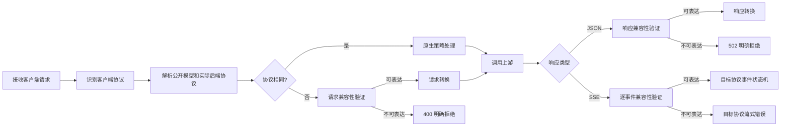

# 协议支持、转换与客户端适配说明

> 参考定位：本文保留跨项目的协议设计材料和历史示例，不是当前行为或发布状态的事实源。当前协议行为见[协议文档](../protocol.zh.md)，当前兼容性合同见[兼容矩阵](../../compatibility/README.zh.md)。

## 1. 文档定位

本文档描述当前网关在协议层面的能力边界、转换原则、客户端适配逻辑和异常语义，并给出一套可供其他项目直接采用的设计与改造方法。

本文只讨论协议、数据语义和运行逻辑，不讨论具体编程语言、框架、源码结构或部署代码。

适用读者：

- 需要把单一 OpenAI 接口改造成多协议 AI 网关的架构师和开发者；
- 需要同时接入 OpenAI SDK、Anthropic SDK、Claude Code、Codex CLI 的平台团队；
- 需要在 Azure OpenAI、Azure AI Foundry、Claude、GPT Image、Black Forest Labs 等上游之间做统一路由的团队；
- 需要评估跨协议转换是否会丢失工具调用、推理、流式事件或多模态语义的测试与运维人员。

本文所称“支持”分为四个等级：

| 等级 | 含义 |
| --- | --- |
| 原生支持 | 客户端协议与上游协议相同，协议对象和事件尽量原样保留 |
| 可转换 | 客户端协议与上游协议不同，但当前语义存在明确映射 |
| 受策略限制 | 协议能够承载，但是否放行还取决于模型、上游、字段白名单或能力声明 |
| 明确不支持 | 无法保证语义等价，必须在请求阶段或响应阶段拒绝，不能静默降级 |

“原生支持”不等于字节级透明代理。即使协议相同，网关仍可能替换模型名、重建认证头、清理无效值、应用参数策略、压缩输入图片、统计用量以及执行超时和重试控制。

### 1.1 阅读边界

- 第 2 至 29 节以当前网关的实际协议行为为主；其中使用“推荐”或“应”时，表示由当前经验归纳出的设计原则，不表示所有建议都已在当前行为中完整实现。
- 第 30 至 35 节是供另一项目采用的目标架构、实施阶段和验收门禁。
- 文中会直接标出当前已知的不对称行为或缺口。迁移项目应把这些内容视为需要修正的边界，而不是需要照搬的兼容特性。
- 端点、字段和事件名属于 wire protocol 契约；错误 code 和策略名称用于准确描述当前外部行为，另一项目可以采用不同命名。

### 1.2 GHCP Pool Proxy 当前状态

截至当前 release candidate source、兼容矩阵 `phase7c-2026-08-18.1`、候选 build `2026.08.18.1` 和 schema 19，本项目只使用 GitHub Copilot 作为模型上游。最终 freeze Git SHA 以 release manifest 与 attestation 为准。当前实现状态如下：

- 已提供 `/v1/models`、`/v1/chat/completions`、`/v1/responses` 和 `/v1/messages`。
- Codex 0.147.0 模型发现已完成，只发布精确 `gpt-5.5 -> gpt-5.5 / responses` 映射，并使用保守能力元数据；`function_tools`、parallel tools 和 app-server JSON-RPC dynamic tool callbacks 在当前 HTTP Responses route 保持关闭，矩阵等级仍为 `candidate_native`。
- Claude Code 2.1.225/2.1.226/2.1.233 均为 `unsupported`：三档 `--resume` 都请求未获合同支持的 `claude-opus-5`，所以 `format=claude-code` 不发布 Sonnet 专用映射，`count_tokens` 继续不支持。
- `/v1/messages/count_tokens`、`/v1/responses/compact` 和 `/v1/images/generations` 尚未注册，不属于当前公共协议面。
- 六方向 request/response/stream validator、三协议终态、typed tool/reasoning/web-search 语义和 usage presence/source 已按 2026-08-15 冻结合同完成；固定 Claude Code 2.1.226 与 Codex 0.147.0 文本合同测试通过。
- 固定 CLI 与目标环境的校验机制已经实现；有效 release 等级只由同一不可变 release 的外置 attestation 派生。目标环境校验属于可选人工测试，见 [人工验证](../runbooks/manual-validation.zh.md)。
- schema 19 已包含 `account_model_capabilities`、手动刷新请求与 client profile entitlement policy；Worker 持续写入带 freshness/fencing 的快照，Admin/Dashboard 提供查询与刷新，`require_fresh` profile 的 Router 和 binding 路径共享同一请求级 allowlist。发布资格只需不可变 build 上的 clean fixed-CLI report 与 attestation。

本文涉及 Azure、Foundry、直连 OpenAI/Anthropic、图片生成和 utility endpoint 的段落是通用参考或未来契约，不构成本项目当前能力声明。项目当前状态和代办以 [Phase 7 计划](../plans/compatibility-roadmap.zh.md) 与 [兼容矩阵](../../compatibility/matrix.json) 为准。

### 1.3 事实优先级与维护规则

本文既用于设计参考，也用于排障，但文档本身不是运行时证据。出现冲突时按以下顺序裁决：

1. [migrations](../../migrations/) 与 `schema_version` 决定已部署数据契约；
2. 当前代码和可复现测试决定请求、响应和流的实际行为；
3. [兼容矩阵](../../compatibility/matrix.json) 决定固定客户端、模型、profile、pool、静态能力合同和最高候选等级；release-evidence attestation 决定一个不可变 release 的有效等级；
4. [Phase 7 计划](../plans/compatibility-roadmap.zh.md) 记录范围、冻结合同、已完成切片和剩余发布门禁；
5. [协议实现说明](../../docs/protocol.zh.md) 解释当前 canonical/provider/writer 映射；
6. 本文给出跨项目可复用的原则、能力边界与调试顺序。

任何新增协议形状都必须绑定客户端版本、脱敏原始 frame、预期语义和独立 issue。不能只因官方 schema 出现新 union、某次请求返回 `200`，或测试夹具可以构造该字段，就把它追加到当前支持合同。

### 1.4 分层调试入口

排障时先确定失败发生在哪一层，不要从最终错误反向猜测整个链路：

| 现象 | 首查层 | 必须验证的不变量 |
| --- | --- | --- |
| 请求返回带 path/kind 的 `400` | parser 或方向级 validator | 不支持语义在 token lookup、账号选择后的 Provider dispatch 和网络调用前失败 |
| 模型为空、`403` 或没有候选账号 | catalog、client profile、pool entitlement | 协议支持不等于模型已发布；`require_fresh` 必须使用请求级不可变 allowlist |
| fake upstream 没收到请求 | request validator、Provider support gate | 先看 source format、target API、字段 path，再检查工具投影和强制 `tool_choice` |
| 上游 `200` 但网关返回 `502` | Provider JSON/SSE parser | envelope、identity、index、status、finish/stop reason 和完整终态必须同时成立 |
| SSE 有部分内容后失败 | source state machine 或 downstream writer | 先区分“上游事件非法”和“目标协议不可投影”；已经输出的流不能重试或伪造成功终态 |
| 文本正确但 usage、预算或健康状态异常 | usage merge 与 delivery/finalize | 区分 `upstream`、`estimated`、`missing`；取消、写失败和终态冲突不得记 durable success |
| 固定 CLI 测试通过但发布仍阻断 | compatibility evidence | 测试通过不等于已生成有效 attestation；frozen matrix、build、schema、clean fixed-CLI report 与 release manifest 必须一致 |

推荐保留一条最小可复现链：客户端版本与请求 -> source format -> exposed/upstream model -> target API -> account/profile/pool -> canonical request -> upstream envelope/events -> canonical response/events -> downstream bytes -> delivery/usage outcome。只有相邻两层之间出现事实差异时，才进入对应 parser、validator、adapter 或 writer；不要用开放式全协议审计替代局部根因定位。

---

## 2. 总体能力概览

### 2.1 对外协议面

当前对外提供以下公共协议端点：

| 方法与路径 | 客户端协议 | 主要用途 | 后端要求 |
| --- | --- | --- | --- |
| `GET /v1/models` | OpenAI、Anthropic、Claude Code 或 Codex 协商格式 | 模型发现 | 不调用模型推理协议 |
| `POST /v1/chat/completions` | OpenAI Chat Completions | 对话补全 | 可路由到 Chat、Responses 或 Messages |
| `POST /v1/responses` | OpenAI Responses | 现代 item 化生成 | 可路由到 Responses、Chat 或 Messages |
| `POST /v1/messages` | Anthropic Messages | Claude 消息生成 | 可路由到 Messages、Chat 或 Responses |

`POST /v1/responses/compact`、`POST /v1/messages/count_tokens` 和 `POST /v1/images/generations` 当前未实现。下文相关章节描述的是只有获得 GitHub Copilot 原生证据后才可采用的目标契约。

健康检查、版本信息和管理接口不属于模型协议面，本文不展开。

### 2.2 文本协议路由矩阵

三种文本协议形成一个 $3 \times 3$ 路由矩阵：

| 客户端协议 | Chat 后端 | Responses 后端 | Messages 后端 |
| --- | --- | --- | --- |
| Chat Completions | 原生近透明 | 显式转换 | 显式转换 |
| Responses | 显式转换 | 原生近透明 | 显式转换 |
| Anthropic Messages | 显式转换 | 显式转换 | 原生近透明 |

因此共有三条原生路径和六条跨协议路径。

### 2.3 核心结论

1. 原生路径是完整能力的首选路径。
2. 跨协议路径只承诺文本、常见输入图片、普通 function tool、普通工具调用与结果、基础 token 限制、基础终止原因和 usage 的交集。
3. Responses 的现代 item、服务端状态和内置工具，以及 Messages 的 thinking、document、cache control 等高级语义，不能视为可跨协议等价转换。
4. 无法无损表达的结构应被明确拒绝，不能偷偷删除后继续请求。
5. Claude Code 必须绑定原生 Messages；Codex 必须绑定原生 Responses。转换路径只能作为普通客户端的基础兼容手段，不能作为这两个客户端的生产主路径。
6. `responses/compact` 和 `messages/count_tokens` 是协议专属能力，不能由其他协议模拟。
7. 请求控制字段的转换不是完全对称的。尤其是停止序列、采样控制和供应商扩展字段，必须按具体源协议和目标协议逐方向判断。

### 2.4 当前已知边界

- 请求发往上游时会把公开模型 ID 替换为目标部署名；成功响应中的 `model` 当前通常沿用上游 payload 或事件，不保证统一改回公开模型 ID，因此客户端可能看到上游部署名。
- Chat 跨协议请求中的 `stop` 当前会在兼容性验证阶段被拒绝，即使目标 Messages 存在 `stop_sequences` 字段。
- Messages 的 `stop_sequences` 转 Chat 时可以保留；转 Responses 时由方向级 validator 在 dispatch 前拒绝，不再静默丢失。
- Responses 转 Chat 时，`service_tier`、`verbosity`、`top_k` 等字段当前会作为顶层扩展字段继续传递；这不代表标准 Chat 语义与其等价，最终是否接受由字段策略和上游决定。
- Responses 严格流终止当前对所有 Responses 上游流生效：缺少 `response.completed` 或 `response.incomplete` 会失败，不再提供把 output-done + EOF 恢复为成功的兼容开关。
- 上游 SSE 在原生和跨协议路径都会解析为 typed canonical event，再由客户端协议 writer 重建；只解释 `data:` 内容，不承诺保留上游 `event`、`id`、`retry` 或原始 frame 字节。

---

## 3. 总体架构原理

### 3.1 控制面与数据面分离

协议网关应把两类信息分开：

- 控制面：公开模型 ID、上游部署、路由覆盖、客户端兼容标记、字段策略、限流、预算、超时和错误策略；
- 数据面：实际请求体、响应体、SSE 事件、认证头和 usage。

公开模型 ID 是面向客户端的稳定别名，上游模型名或部署名是供应商侧标识。当前网关会在请求发往上游前完成公开 ID 到部署名的映射，但成功响应的 `model` 字段通常保留上游值，不保证反向映射。另一项目若要求部署细节隔离，应在原生 JSON、shim JSON 和所有 SSE 事件上统一回填公开模型 ID，并把这一点作为显式客户端契约。

### 3.2 两层协议模型

推荐使用两层协议模型，而不是把所有请求一开始就压成一个最低公分母：

1. 原生通道：同协议时保留完整原生对象，仅执行必要策略；
2. 交集通道：跨协议时才投影到受控的公共语义集合。

公共语义集合至少包括：

- 模型；
- system/developer 指令；
- user/assistant/tool 轮次；
- 文本内容；
- URL 或内联图片；
- function tool 定义；
- tool call 与 tool result；
- 输出 token 上限；
- 可映射的采样和推理参数；
- 流式开关；
- usage；
- 可映射的结束原因。

以下内容不应强行纳入公共交集：

- Responses 的 conversation、previous response、store、background 和 cache state；
- Responses 的 reasoning、compaction、MCP、computer、shell、custom tool 等专用 item；
- Anthropic 的 thinking signature、redacted thinking、document、server tool 和 cache control；
- Chat 的多 choice、音频输出、复杂 logprobs 和供应商扩展字段；
- 任一协议中的 citations、annotations 或无法验证等价性的 metadata。

### 3.3 先验证，后转换

跨协议处理必须遵循以下顺序：



请求转换前验证可以避免把客户端语义悄悄丢掉；响应转换前验证可以避免把供应商的失败、高级 item 或安全终止原因伪装成普通文本成功。

### 3.4 路由结果必须由最终地址校验

模型可以声明后端 route key，也可以声明具体上游路径。普通生成和图片请求会根据实际上游 URL 再次推断协议：

- 以 `/chat/completions` 结束，视为 Chat；
- 以 `/responses` 结束，视为 Responses；
- 以 `/messages` 结束，视为 Messages；
- 以 `/images/generations` 或供应商图片路径结束，视为图片协议；
- 无法识别时拒绝为未知后端协议。

`/responses/compact` 和 `/messages/count_tokens` 不进入上述普通分类器。网关先确认基础路由分别是原生 Responses 或原生 Messages，再由专用逻辑派生或读取 utility URL，并单独校验最终路径后缀。

这两类检查共同防止“配置名写的是 Responses，但实际地址指向 Chat”或“utility 路径指向普通生成端点”一类危险错配。

---

## 4. 一次请求的完整逻辑

### 4.1 入站阶段

1. 识别公共路径和客户端协议；
2. 校验请求体大小；
3. 从 Bearer 或约定的 API key header 中提取客户端凭据；
4. 校验客户端 key、允许模型、路由权限和治理限制；
5. 清理只供网关使用的控制字段，不把它们传给上游；
6. 解析公开模型、目标部署和后端协议；
7. 合并路由默认值、模型默认值和客户端参数，客户端显式值优先；
8. 执行请求字段白名单、黑名单和规范化；
9. 原生路径执行近透明处理，跨协议路径先验证再转换；
10. 用上游专用凭据重建认证头；
11. 调用上游，并在允许的阶段重试。

### 4.2 出站阶段

1. 判断上游返回的是 JSON、SSE 还是错误；
2. 原生成功响应尽量保留协议对象；
3. 跨协议 JSON 响应先验证再转换；
4. 跨协议 SSE 逐事件解析并驱动目标协议状态机；
5. 提取或合并 usage，避免流式事件重复计量；
6. 观察并记录上游实际模型；当前返回体中的 `model` 通常沿用上游值，不保证改回公开模型 ID；
7. 标准化错误，或在满足条件时透传原生错误；
8. 记录请求 ID、延迟、token、成本和终止状态。

### 4.3 客户端取消

客户端断开连接后，应立即取消：

- 等待上游响应头；
- 重试退避；
- SSE 读取；
- 非流式响应体读取；
- 仍在等待的上游请求。

不能因为下游已经断开而让上游生成继续占用额度和并发。

---

## 5. 入站认证与 Header 边界

### 5.1 两套凭据必须隔离

客户端访问网关的凭据和网关访问上游的凭据是两个安全域：

- 入站凭据只用于确认调用者身份和权限；
- 出站凭据由目标上游配置独立生成；
- 任何客户端 `Authorization`、`x-api-key` 或 `api-key` 都不能直接转发给上游；
- 上游返回的 cookie、认证信息和不安全 hop-by-hop header 也不能转发给客户端。

### 5.2 默认阻断的 Header 类型

至少应阻断：

- `authorization`；
- `x-api-key`；
- `api-key`；
- cookie 类 header；
- `host`、`content-length`；
- connection、transfer-encoding 等逐跳 header；
- 名称含 credential、token、secret、password 等敏感模式的 header。

### 5.3 可转发的客户端元数据

Claude Code 和 Anthropic SDK 会发送版本、运行时和 Stainless 生成器元数据。可以按受控前缀转发，例如：

- `x-claude-*`；
- `x-anthropic-*`；
- `x-stainless-*`。

即使匹配允许前缀，只要 header 名表现为凭据或 secret，仍必须拒绝。

请求关联标识可以单独白名单，例如 `x-request-id`、`x-conversation-id`、`x-session-id`。它们用于链路观测，不应参与模型会话状态语义。

---

## 6. 请求清理与参数策略

### 6.1 基础清理

请求体进入协议处理前会进行基础规范化：

- 仅在已声明的可选参数位置清理 `"[undefined]"` 占位符；普通语义字符串 `"undefined"` 保留，未知或类型错误的字段由 parser 明确拒绝，不做递归猜测性删除；
- 非 Responses 路径通常删除无意义的 `null`，Responses 因部分字段以 `null` 表示显式状态而允许保留；
- 删除网关自己的超时、重试等控制字段；
- 没有有效工具时可删除中性的 `tool_choice=auto/none`、`function_call`、`parallel_tool_calls` 等控制项；`required` 或具名/typed 强制选择必须解析到实际投影工具，否则在 dispatch 前拒绝；
- 修复或删除无法与 assistant tool call 对应的 Chat tool message，避免把破损工具历史送到上游；
- 将客户端模型别名替换为目标部署名。

### 6.2 参数策略优先级

字段策略可来自公共路由、模型和上游三个层次：

- 多个非空 allowlist 取交集；
- 任意层的 blocked field 都拥有最高优先级；
- 默认应在遇到不支持参数时返回明确的 `400`；
- 只有显式启用“删除不支持参数”时，才允许静默删除；
- 客户端显式参数应覆盖默认参数，但不能绕过 allowlist 或 blocked field。

推荐默认采用“拒绝”而不是“删除”。删除适合已知无副作用的兼容字段，不适合 reasoning、tools、response format、stop 或状态型字段。

### 6.3 现代模型规范化

常见规范化包括：

- Chat 的 `max_tokens` 在现代模型上升级为 `max_completion_tokens`；
- `top_logprobs` 存在而 `logprobs` 缺失时，补充 `logprobs: true`；
- `serviceTier` 统一为 `service_tier`；
- Chat 的 `reasoning_effort` 与 Responses 的 `reasoning` 保持各自原生字段语义，当前不会自动互相映射；
- 某些上游不接受 `xhigh` 时可按明确策略降为 `high`，但不能假设所有模型都允许该降级；
- Responses function/custom/namespace tool 缺少 description 时补充非空描述；
- 原生 Responses 只放行经过严格字段校验的 `web_search`，并原样保留其 typed options；`web_search_preview`、带日期后缀、未知或跨协议类型不做猜测性规范化，直接在 dispatch 前拒绝；
- `stream_options` 仅在流式 Chat 或 Responses 且上游能够识别时保留。

Chat 与 Anthropic 路径不会投影 `web_search`。实际使用时必须调用原生 `/v1/responses`，不能假设 Gateway 会自动提升路由或把其它 web-search 形状转换为 Responses `web_search`。

---

## 7. 原生协议能力

### 7.1 原生 Chat Completions

原生 Chat 路径适合：

- 传统 role/message 对话；
- 字符串或数组化文本内容；
- URL 和 data URL 图片；
- function tools、assistant tool calls、tool results；
- `response_format`；
- `reasoning_effort`；
- 上游支持的 logprobs、refusal、audio、reasoning 扩展；
- 单 choice 和已识别的 finish reason；多个 choice 或未知 finish reason 会 fail closed；
- Chat SSE chunk 与 `[DONE]`。

上述字段是协议层可承载能力，不代表每个模型都接受。模型和上游字段策略仍可收窄能力。

### 7.2 原生 Responses

原生 Responses 是现代 OpenAI item 模型的完整承载路径，适合：

- `message` item；
- `function_call` 与 `function_call_output`；
- custom tool 与 tool-search call；
- reasoning item；
- namespace、tool search 和 additional tools；
- 严格校验的原生 `web_search` tool 与 `web_search_call` output lifecycle；
- `previous_response_id`、conversation、store、background 等服务端状态；
- `input_image`、`input_file` 等现代输入；
- `response.created`、item/content part 生命周期、`response.completed`、`response.incomplete` 和失败事件。

这些高级能力只有在当前 parser、上游和字段策略共同放行时才成立。当前 Copilot provider 不提供 remote MCP discovery/执行，`type=mcp` 会在 dispatch 前拒绝；`web_search` 只支持固定合同内的原生 Responses shape，preview、带日期后缀、未知字段和跨协议投影会拒绝；computer、shell、compaction 等尚未进入已验证 typed 集合的 item 也会 fail closed。不能仅因 Responses 协议本身可表达就视为已支持。

### 7.3 原生 Anthropic Messages

原生 Messages 适合：

- 有序的 `text` content block；
- base64 或 URL `image` block；
- `document`；
- `thinking` 与 `redacted_thinking`；
- `tool_use` 与 `tool_result`；
- `server_tool_use`；
- cache control；
- Anthropic beta；
- `message_start`、`content_block_*`、`message_delta`、`message_stop` 等完整事件序列。

原生不表示完全不改动。Messages 请求仍可能经过 thinking 模式校验、tool choice 规范化、cache control 清洗和 beta allowlist。

---

## 8. Chat Completions 与 Responses 转换

### 8.1 Chat 请求转 Responses

#### 可映射内容

| Chat 语义 | Responses 语义 |
| --- | --- |
| system/developer message | `instructions` |
| user/assistant message | `input` 中的 message item |
| 文本 content part | `input_text` 或对应文本 part |
| `image_url` | `input_image` |
| function tool | Responses function tool |
| assistant `tool_calls` | `function_call` item |
| tool message | `function_call_output` item |
| `max_tokens` / `max_completion_tokens` | `max_output_tokens` |
| `reasoning_effort` | 仅在目标支持同名扩展时原名保留；不转换为 `reasoning.effort` |
| `response_format.json_object` | `text.format` JSON object |
| `response_format.json_schema` | `text.format` JSON schema |
| `serviceTier` | `service_tier` |

图片 URL、data URL 和可表达的 `detail` 可以保留到 Responses。

Chat 数组化 content 中的 `input_file` 还有一个单向兼容行为：目标为 Responses 时当前会把该 content part 原样透传。这不是 Chat 标准语义，也不是双向转换；只有目标 Responses 上游本身理解该结构时才可能生效。

#### 不能安全映射的内容

以下字段或结构应拒绝，或仅在有明确策略时删除：

- `n` 或 `best_of` 不为 1；
- legacy message-level `function_call`；
- 非 function 类型的 Chat tool call；
- 音频或混合输出 modality；
- assistant 的 `reasoning_content`、`refusal`、audio；
- 带 citations、annotations、logprobs、cache metadata 的内容；
- 无法在 Responses 中保持语义的 stop、penalty、seed、logit bias 等控制项。

不能把 Chat 多 choice 合并成一个 Responses output，也不能只取第一项而假装无损。

### 8.2 Responses 响应转 Chat

#### 可映射内容

- Responses message 文本转为一个 assistant message；
- `function_call` 转为 Chat `tool_calls`；
- usage 的 `input_tokens`、`output_tokens` 转为 `prompt_tokens`、`completion_tokens`；
- `incomplete.reason = max_output_tokens` 转为 Chat `finish_reason = length`；
- 存在 function call 时结束原因为 `tool_calls`；
- 普通完成转为 `stop`。

#### 必须拒绝的内容

- reasoning、compaction、web search output；
- custom tool、MCP、computer、shell 等专用 item；
- citations、annotations、logprobs；
- 无法映射的 incomplete reason；
- 需要保留服务端 conversation/cache/store 状态的响应；
- 目标需要多个 choice 的场景；
- `content_filter` 或未知终止原因。

### 8.3 Responses 请求转 Chat

#### 可映射内容

- `instructions` 转为 system/developer 指令；
- 普通 input message 转为 Chat message；
- `function_call` 转为 assistant tool call；
- `function_call_output` 转为 tool message；
- Responses function tool 转为 Chat function tool；
- `max_output_tokens` 转为 `max_completion_tokens`；
- `reasoning.effort` 转为 `reasoning_effort`；
- 受支持的 `text.format` 转为 `response_format`；
- URL 或 data URL 图片转为 `image_url`。
- `service_tier`、`verbosity`、`top_k` 等当前作为顶层扩展字段继续传给 Chat 后端；这属于兼容透传，不是协议等价映射，仍可能被 request policy 或上游拒绝。

#### 必须拒绝的内容

- `previous_response_id`、conversation、store、background、cache state；
- `max_tool_calls` 等 Chat 无等价语义的限制；
- custom tool、MCP、computer、shell、web search 等专用 item；
- `input_file` 或 file-backed image；
- Responses reasoning item 本身；
- compaction item；
- annotations、citations 和内容级 metadata；

注意：如果另一项目采用严格公共交集，应主动拒绝或显式映射上述兼容透传字段，而不是依赖 Chat 上游碰巧接受。

### 8.4 Chat 响应转 Responses

#### 可映射内容

- 第一个且唯一的 Chat choice 转为 Responses message；
- assistant 文本转为 output text；
- function tool call 转为 `function_call` item；
- Chat usage 转为 Responses usage；
- `stop`、`length`、`tool_calls` 转为可表达的 completed 或 incomplete 状态。

#### 限制

- 仅允许一个 choice；
- 数组化 assistant output、audio、refusal、reasoning extension、复杂 logprobs 或供应商 finish reason 不应被静默简化；
- Chat 的 `content_filter` 不能伪装成 Responses 正常完成。

---

## 9. Chat Completions 与 Anthropic Messages 转换

### 9.1 Chat 请求转 Messages

#### 可映射内容

| Chat 语义 | Messages 语义 |
| --- | --- |
| system/developer message | 顶层 `system` |
| user/assistant 文本 | 对应角色的 `text` block |
| data URL 图片 | base64 `image` block |
| HTTP(S) 图片 | URL `image` block |
| function tool | Anthropic tool definition |
| assistant tool call | `tool_use` block |
| tool message | `tool_result` block |
| `max_tokens` / `max_completion_tokens` | `max_tokens` |

#### 必须拒绝的内容

- `stop`；当前公共 shim 在转换前将其视为不可保留控制项，不会利用目标协议的 `stop_sequences`；
- 图片 `detail`，因为 Messages 没有完全等价表达；
- `response_format`；
- `reasoning` 或 `reasoning_effort`；
- audio、refusal、reasoning content；
- 多 choice、best-of、seed、logprobs 和采样惩罚；
- Chat `parallel_tool_calls`；
- legacy `functions` / `function_call`；
- 非 function tool；
- 带结构化 metadata 的文本；
- 无法表示为纯文本的 tool result。

### 9.2 Messages 响应转 Chat

#### 可映射内容

- `text` block 拼接为 assistant 文本；
- `tool_use` block 转为 Chat tool call；
- usage 转为 Chat usage；
- `end_turn`、`stop_sequence` 转为 `stop`；
- `max_tokens` 转为 `length`；
- `tool_use` 转为 `tool_calls`。

Thinking block 与 Chat `reasoning_content` 没有当前已验证的等价合同。无论是否携带 signature，`thinking` 和 `redacted_thinking` 在 Messages → Chat 路径都必须拒绝。

#### 必须拒绝的内容

- `document`；
- thinking 或 redacted thinking；
- citations、cache metadata；
- server-side tool block；
- 无法映射的 stop reason；
- 不能保留的 provider metadata。

### 9.3 Messages 请求转 Chat

#### 可映射内容

- 顶层 system 转为 Chat system message；
- user/assistant 文本转为 Chat messages；
- base64/URL image 转为 `image_url`；
- Anthropic tool 转为 Chat function tool；
- `tool_use` 转为 assistant tool call；
- 普通文本 `tool_result` 转为 Chat tool message；
- `max_tokens` 和 `stop_sequences` 转为对应 Chat 字段。

#### 必须拒绝的内容

- `document`；
- file-backed image；
- thinking 和 redacted thinking；
- cache control 与 citations；
- `tool_result.is_error = true`；
- 非文本或复杂 content block 的 tool result；
- `top_k`、output config、service tier、verbosity 等无等价控制；
- 带 `disable_parallel_tool_use` 的 tool choice；
- 非普通 function/custom tool；
- 需要保留的 Messages metadata。

### 9.4 Chat 响应转 Messages

#### 可映射内容

- assistant 文本转为一个或多个 `text` block；
- Chat tool calls 转为 `tool_use` blocks；
- Chat usage 转为 Messages usage；
- `stop` 转为 `end_turn`；
- `length` 转为 `max_tokens`；
- `tool_calls` 转为 `tool_use`。

#### 限制

- 只能处理单一 choice；
- audio、refusal、reasoning extension、annotations、citations、logprobs 不能伪装为普通 text；
- 未知 finish reason 必须拒绝。

---

## 10. Responses 与 Anthropic Messages 转换

Responses 与 Messages 的转换通过双方都能投影到的基础消息与 function calling 交集完成。其能力上限不会高于 Chat 这一中间语义层。

### 10.1 Responses 请求转 Messages

支持：

- `instructions` 和普通文本 input；
- URL/data URL 图片；
- function tool；
- function call 和 function call output；
- 输出 token 上限；
- 基础 tool choice 交集。

拒绝：

- Responses reasoning 配置与 reasoning item；
- structured output `text.format`；
- service tier、verbosity、top-k 等目标无法表达的控制；
- conversation、previous response、store、background、cache state；
- custom tool、MCP、computer、shell、web search item；
- input file；
- citations、annotations、logprobs；
- 非 `max_output_tokens` 的 incomplete reason。

### 10.2 Messages 响应转 Responses

支持：

- 普通 text block；
- `tool_use`；
- 可映射 usage；
- `end_turn`、`max_tokens`、`stop_sequence`、`tool_use` 的有限终止映射。

拒绝：

- document；
- thinking、redacted thinking 和 signature；
- server tool；
- cache control 和 citations；
- 未知 stop reason；
- 不能投影到 Responses 基础 item 的 content block。

### 10.3 Messages 请求转 Responses

支持：

- system 和普通文本 message；
- URL/data URL 图片；
- function tool、tool use 和普通文本 tool result；
- token 上限。

拒绝范围与 Messages 转 Chat 基本一致，并额外拒绝任何无法在 Responses 中证明等价的 reasoning 或 metadata 语义。

Messages 请求携带 `stop_sequences` 且目标为 Responses 时，会由方向级 validator 在 Provider dispatch 前以 `$.stop` 明确拒绝；当前不会接受后静默丢弃。另一项目只有在能证明等价映射时才应放宽，否则也应拒绝或要求客户端改用原生 Messages。

### 10.4 Responses 响应转 Messages

支持：

- 普通 message/output text；
- function call；
- usage；
- completed、`max_output_tokens` incomplete 和 tool call 的有限结束状态。

拒绝：

- reasoning、compaction、web search；
- custom/MCP/computer/shell item；
- citations、annotations、logprobs；
- conversation/cache/store 状态；
- 未知或不可映射的失败、incomplete reason。

---

## 11. 跨协议能力矩阵

图例：

- “原生”表示只有协议相同路径能完整保留；
- “支持”表示三协议公共交集内可转换；
- “有限”表示仅部分方向或部分形式可转换；
- “拒绝”表示跨协议必须明确报错。

| 能力 | 原生 Chat | 原生 Responses | 原生 Messages | 跨协议结论 |
| --- | --- | --- | --- | --- |
| 普通文本 | 支持 | 支持 | 支持 | 支持 |
| system/developer 指令 | 支持 | 支持 | 支持 | 支持，但角色细节可能归并 |
| URL 图片 | 支持 | 支持 | 支持 | 支持 |
| data URL/base64 图片 | 支持 | 支持 | 支持 | 支持，可能受压缩策略影响 |
| 图片 detail | 支持 | 支持 | 无等价 | Chat/Responses 间支持，转 Messages 拒绝 |
| file-backed image | 取决于扩展 | 支持 | 部分形态 | 跨协议拒绝 |
| input file | 非标准扩展 | 支持 | 无等价 | Chat→Responses 可单向透传；其他跨协议方向拒绝 |
| document block | 无等价 | 无完整等价 | 支持 | 跨协议拒绝 |
| 普通 function tool | 支持 | 支持 | 支持 | 支持 |
| 普通 tool call/result | 支持 | 支持 | 支持 | 支持，结果通常限文本 |
| 并行工具调用 | 支持 | 支持 | 支持 | 调用索引可保留；控制参数并非全方向可保留 |
| custom tool | 无完整等价 | 支持 | 部分 provider 形态 | 跨协议拒绝 |
| MCP | 无等价 | 协议可表达，当前 Provider 拒绝 | 无完整等价 | 当前所有路径拒绝 |
| computer use | 无等价 | 协议可表达，当前未验证 | provider 专用 | 当前所有路径拒绝 |
| shell/local shell | 无等价 | 协议可表达，当前未验证 | 无等价 | 当前所有路径拒绝 |
| web search item | provider 扩展 | 固定合同内原生支持 | provider 扩展 | 严格 `web_search`/`web_search_call` 仅原生 Responses；跨协议拒绝 |
| structured output | `response_format` | `text.format` | 无通用等价 | Chat 与 Responses 间有限支持 |
| reasoning effort | 支持扩展 | 支持 | thinking 不是同一语义 | Chat 与 Responses 间有限支持 |
| reasoning item | 无完整等价 | 支持 | thinking 不是同一语义 | 跨协议拒绝 |
| Anthropic thinking | 无完整等价 | 无完整等价 | 支持 | 跨协议拒绝，不按是否有 signature 放宽 |
| thinking signature | 无等价 | 无等价 | 支持 | 跨协议拒绝 |
| cache control | provider 扩展 | provider 状态 | 支持 | 跨协议拒绝 |
| previous response/conversation | 无原生等价 | 支持 | 无原生等价 | 跨协议拒绝 |
| citations/annotations | 部分扩展 | 支持 | 支持 | 跨协议拒绝 |
| logprobs | 支持 | 部分内容事件 | 无通用等价 | 跨协议通常拒绝 |
| 多 choice | 单 choice 支持；多个 fail closed | 非同一模型 | 非同一模型 | 原生 Chat 与跨协议均拒绝多个 choice，绝不静默截断 |
| 音频输出 | Chat 扩展可承载 | 模型相关 | 无通用等价 | 跨协议拒绝 |
| token usage | 支持 | 支持 | 支持 | 支持基本字段映射 |
| 精确 token counting | 非专属端点 | 非专属端点 | `count_tokens` | 仅原生 Messages utility endpoint |
| context compaction | 无专属端点 | `responses/compact` | 无等价 | 仅原生 Responses utility endpoint |

---

## 12. Function Calling 统一语义

### 12.1 三协议公共交集

普通 function calling 是三种协议最可靠的交集：

| 公共概念 | Chat | Responses | Messages |
| --- | --- | --- | --- |
| 工具定义 | `tools[].function` | function tool | `tools[]` |
| 调用标识 | tool call ID | call ID / item ID | tool use ID |
| 工具名 | function name | name | name |
| 参数 | JSON arguments | arguments | input object |
| 工具结果 | tool role message | `function_call_output` | `tool_result` |

### 12.2 调用 ID 与索引

跨协议流式工具调用必须同时维护：

- output index；
- content block index；
- tool call index；
- source item ID；
- source call ID；
- 目标协议 call ID。

这些 ID 不能混为一谈。收到参数 delta 时，工具身份可能尚未出现，因此需要先缓冲参数，等名称和稳定 call ID 可确认后再输出目标事件。

并行调用必须保留稳定索引。连续的 Responses function call 可以聚合为同一个 Chat assistant tool-call turn，但每个 call 的 ID 和参数流必须独立。

### 12.3 工具控制项

没有有效工具时只可省略中性的 `tool_choice=auto/none`、`parallel_tool_calls` 等控制项；`required` 或具名/typed 强制选择必须解析到实际投影工具，否则在 dispatch 前拒绝。不同协议的 tool choice 并非全等：

- `auto`、`none`、强制某个普通 function 通常可映射；
- Anthropic 的 `disable_parallel_tool_use` 没有稳定的跨协议等价；
- thinking 开启时强制 `any` 或指定工具，某些 Foundry Claude 模型会拒绝，可规范化为 `auto`；
- custom、server、computer、MCP 和 shell tool 必须留在原生协议路径。

---

## 13. Structured Output、Reasoning 与 Metadata

### 13.1 Structured Output

- 原生 Chat 保留 `response_format`；
- 原生 Responses 保留 `text.format`；
- `json_object` 和 `json_schema` 可在 Chat 与 Responses 之间有限双向映射；
- Messages 没有通用等价字段，因此转入 Messages 时应拒绝 structured output；
- 不能把 schema 只放入自然语言提示后宣称协议等价。

### 13.2 Reasoning 与 Thinking 不是同一概念

必须区分：

- Chat `reasoning_effort`：生成控制参数；
- Responses `reasoning.effort`：生成控制参数；
- Responses reasoning item：输出生命周期中的专用 item；
- Anthropic thinking block：具有内容块、预算、模式和可能的 signature；
- redacted thinking：不能反向构造的受保护内容。

当前实现不在 Chat `reasoning_effort` 与 Responses `reasoning.effort` 之间自动转换；只有目标明确支持同名字段时才可原名保留。不能把 Anthropic thinking 当作 OpenAI reasoning item，也不能伪造 thinking signature。

### 13.3 Metadata

metadata 应按“默认不承诺跨协议无损”处理：

- 原生路径可以按字段策略保留；
- Messages metadata 在跨协议路径明确不支持；
- Chat 与 Responses 的不透明 metadata 即使能够被转发，也不代表响应阶段可还原；
- citations、annotations、cache metadata 和 provider metadata 必须经过专门映射，否则应拒绝；
- request ID、session ID 等链路 header 是观测信息，不是模型协议 metadata。

---

## 14. SSE 流式协议

### 14.1 SSE 解析要求

流处理器应支持：

- LF 和 CRLF 分隔；
- 一个事件包含多个 `data:` 行；
- UTF-8 多字节字符被网络 chunk 拆开；
- 最后一个事件没有尾随换行；
- 原生和跨协议流都拼接并解释 `data:` 行，事件类型依赖 JSON payload 内的 typed 字段，不读取或承诺保留 SSE 的 `event`、`id`、`retry` 语义；
- 单事件有名义上的 8 MiB 缓冲上限；原生流按原始字节计数，跨协议流按解码后的字符长度计数，因此它不是统一的 8 MiB 网络字节保证；
- backpressure，不能无限缓存慢客户端数据；
- 客户端断开后取消上游 reader。

网络 chunk 不是协议事件边界，不能按每次读取直接解析 JSON。

### 14.2 三种源协议的成功终态

| 源协议 | 合法成功或完整终态 |
| --- | --- |
| Chat | 已校验的非空最终 `finish_reason` 后收到 `[DONE]`，或在已有该终态证据后 EOF |
| Responses | `response.completed` 或 `response.incomplete` |
| Messages | `message_stop` |

Chat 单独收到 `[DONE]` 不能形成成功。Responses 的 `response.failed` 和 provider error 是失败终态。Messages 收到 `[DONE]` 不能当作合法 `message_stop`；`message_stop` 前所有 content block 都必须按同一 index 完成 start/delta/stop 生命周期。

终端标记之后的额外事件应忽略，避免重复 usage、重复 tool call 或二次完成。

### 14.3 原生流

协议相同时仍经过 typed parser、canonical event 和下游 writer，不承诺原始 SSE frame 透传；同时观察：

- 首字节；
- idle timeout；
- 最大流持续时间；
- usage；
- provider error；
- 最终完成证据；
- 客户端取消。

只有在第一个上游 chunk 到达之前才允许自动重试。一旦向客户端写出任何流内容，就不能重放请求。

### 14.4 跨协议流

跨协议流不是文本替换，而是状态机转换：

#### 目标为 Chat

1. 生成 `chat.completion.chunk`；
2. 输出 role、content 或 tool call delta；
3. 输出带 `finish_reason` 的最终 chunk；
4. 输出 `data: [DONE]`。

#### 目标为 Responses

1. 生成 `response.created`；
2. 生成 `response.in_progress`；
3. 生成 output item added；
4. 生成 content part 或 function arguments delta；
5. 生成 item/content done；
6. 生成 `response.completed` 或 `response.incomplete`；
7. 按目标客户端约定结束数据流。

#### 目标为 Messages

1. 生成 `message_start`；
2. 生成 `content_block_start`；
3. 生成 text/tool/thinking 可支持类型的 delta；
4. 生成 `content_block_stop`；
5. 生成带 stop reason 和 usage 的 `message_delta`；
6. 生成 `message_stop`；
7. 不发送 `[DONE]`。

### 14.5 流式错误

如果错误发生在任何下游数据写出之前，可以返回正常 HTTP 错误状态。如果流已经开始，HTTP 状态通常已经是 `200`，此时必须用目标协议的错误事件结束：

- Chat：输出错误 SSE，并以 `[DONE]` 关闭；
- Responses：输出 `event: error`；
- Messages：输出 Anthropic `event: error`，不能伪造 `message_stop`。

流提前 EOF、空流或缺失终态不能被转换为成功：

- 完全没有可写数据的流：根据原生或 shim 处理路径，当前可能表现为 `UPSTREAM_EMPTY_STREAM` 或 `UPSTREAM_INCOMPLETE_STREAM`；
- 缺失终态：`UPSTREAM_INCOMPLETE_STREAM`；
- 不可转换事件：`unsupported_protocol_shim_stream`。

当前实现对所有 Responses 源流都要求 `response.completed` 或 `response.incomplete`，不按 Codex User-Agent 切换，也不再提供 output-done + EOF 的旧兼容回退。`response.output_item.done`、`response.output_text.done`、`response.content_part.done` 和 `[DONE]` 都不能单独证明整个 response 已完成。

---

## 15. Finish Reason 与 Stop Reason

### 15.1 可转换交集

| Chat | Responses | Messages | 含义 |
| --- | --- | --- | --- |
| `stop` | completed | `end_turn` 或 `stop_sequence` | 正常结束 |
| `length` | incomplete: `max_output_tokens` | `max_tokens` | 达到输出上限 |
| `tool_calls` | function call output lifecycle | `tool_use` | 等待工具结果 |

`stop_sequence` 转到 Chat 后只能表示为 `stop`，精确触发序列和细分原因不一定保留。

### 15.2 不可安全转换

以下终止原因不应伪装成普通成功：

- Chat `content_filter`；
- Anthropic `pause_turn`；
- Anthropic `model_context_window_exceeded`；
- Responses 非 `max_output_tokens` 的未知 incomplete reason；
- 任一供应商自定义或未知 reason。

遇到这些情况应返回协议 shim 响应错误，或在流内发送目标协议错误事件。

---

## 16. Usage、Token 与成本语义

### 16.1 基本 usage 映射

| Chat | Responses | Messages |
| --- | --- | --- |
| `prompt_tokens` | `input_tokens` | `input_tokens` |
| `completion_tokens` | `output_tokens` | `output_tokens` |
| `total_tokens` | 输入加输出 | 输入加输出 |

Anthropic cache read/create token 在投影到其他协议时可合并到输入 token，并尽可能保留 cached token breakdown。不能在总量中遗漏 cache token，也不能重复相加。

### 16.2 流式 usage 去重

同一 usage 可能出现在：

- Messages `message_start`；
- 中间 delta；
- 最终 message/response event；
- Chat 最后一个 chunk。

网关必须合并同一请求的增量，并只记账一次。目标响应可按目标协议允许的形式输出 usage，但内部成本统计不能因多事件重复计费。

### 16.3 缺失 usage

如果上游不返回 usage：

- 不应伪造 usage 字段回传客户端；
- 可以为治理和成本做本地估算；
- 估算必须标记为估算值；
- 文本字节数除以固定系数只能用于近似统计，不能充当精确 tokenizer；
- base64、图片和音频数据应从普通文本估算中排除。

### 16.4 Anthropic Token Counting

GHCP Pool Proxy 当前未注册 `POST /v1/messages/count_tokens`；以下内容是 Phase 7B 的启用条件，而不是当前能力。

`POST /v1/messages/count_tokens` 的语义是由原生 Messages 上游执行精确计数：

- 后端必须解析为 Messages；
- 可以使用显式 count 路径，也可以从原生 `/messages` 安全派生；
- 非 Messages 后端在调用上游前返回 `400`；
- 未配置且无法安全派生时返回 `501`；
- 上游必须返回非负整数 `input_tokens`；
- 错误响应结构返回 `502`；
- token counting 不计作一次普通生成 usage。

不能用 Chat/Responses shim 或字符估算模拟这个端点。

---

## 17. Responses Compaction

GHCP Pool Proxy 当前未注册 `POST /v1/responses/compact`；以下内容是 Phase 7C 的启用条件，而不是当前能力。

`POST /v1/responses/compact` 是 Responses 原生 utility endpoint：

- 后端必须解析为原生 Responses；
- 可以显式配置 compact 路径，也可以从 `/responses` 安全派生；
- 非 Responses 后端在调用前返回 `400`；
- 未配置且无法派生时返回 `501`；
- 响应必须表明它是 compaction 对象，并包含 output 数组和 usage 对象；
- 响应结构无效时返回 `502`；
- compaction item 原生保留，不能转换成普通 Chat messages 或 Anthropic Messages。

另一个项目如果要支持 Codex 的长上下文工作流，应把 compaction 作为独立协议能力实现，而不是在代理中自行摘要并冒充原生 compaction。

---

## 18. 模型发现与格式协商

### 18.1 默认 OpenAI 模型目录

普通 OpenAI SDK 或没有特殊信号的客户端访问 `/v1/models` 时，返回 OpenAI 风格：

- 顶层 `object = list`；
- `data` 为模型数组；
- 模型至少包含稳定公开 ID；
- 只列出已启用且当前 API key 有权访问的模型。

### 18.2 Anthropic 模型目录

以下任一信号可请求 Anthropic 风格目录：

- `format=anthropic`；
- `format=messages`；
- 请求包含 `anthropic-version`；
- User-Agent 表明是 Anthropic SDK 或 Claude 类客户端。

Anthropic 目录使用 Anthropic 客户端可理解的模型对象形状。普通 Anthropic SDK 可以看到较广的可访问模型集合，不应被误识别为 Claude Code 专用模式。

### 18.3 Claude Code 模型目录

当前只有以下显式信号进入 Claude Code 专用协商：

- `format=claude-code`；

由于矩阵中的 Claude Code entries 当前均为 `unsupported`，Claude Code 专用目录不返回映射。Claude/Anthropic User-Agent 和 `anthropic-version` 只选择普通 Anthropic 目录，不会把模型提升为 Claude Code 兼容。

未来开放 Claude Code 目录时，模型必须同时满足以下条件：

1. 模型已启用；
2. 当前 API key 有权访问；
3. 模型显式标记为 Claude Code 兼容；
4. 公共 Messages 路由已启用；
5. 模型最终解析为原生 Messages；
6. 上游最终路径确实是 Messages。

客户端识别只负责选择目录格式，不能把任意模型自动变成 Claude Code 兼容模型。

### 18.4 Codex 模型目录

以下信号进入 Codex 协商：

- `format=codex`；
- 非空 `client_version` 查询参数；
- User-Agent 含 Codex 标识。

显式非空 `format` 优先于 `client_version` 和 User-Agent。当前响应形状按 Codex 0.147.0 的完整 `{ "models": [...] }` 契约生成；其它 Codex 版本尚未形成兼容声明。

当前目录只包含 catalog 中精确匹配 `gpt-5.5 -> gpt-5.5` 且 `upstream_api=responses` 的条目。任意别名、不同 upstream 或跨协议条目都会被过滤。当前能力元数据只声明文本输入和单一 `medium` reasoning level，并明确关闭 verbosity、并行工具、原图 detail、search、Responses Lite 和实验工具等未充分取证能力。

后续扩展目录时仍需满足：

1. 已启用且当前 key 可访问；
2. 显式标记为 Codex 兼容；
3. 公共 Responses 路由已启用；
4. 最终解析为原生 Responses；
5. 不是图片生成或编辑模型。

Codex 模型元数据可以表达：

- `slug` 与展示名；
- context window；
- 默认 reasoning level；
- 支持的 reasoning levels；
- 是否支持 verbosity；
- 是否支持图片输入；
- 是否支持 web search；
- 是否支持并行工具；
- 是否使用 Responses lite。

这些目录字段是客户端能力声明，不应替代请求阶段的实际上游能力校验。当前 `candidate_native` 状态也不能因 model refresh 或一次 live generation 成功自动提升为 `verified_native`。

### 18.5 格式协商优先原则

建议采用以下优先级：

1. 显式 `format` 查询参数；
2. 明确的专用客户端 User-Agent；
3. Anthropic 协议 header；
4. 默认 OpenAI 格式。

显式格式有利于测试和网关场景，User-Agent 只作为兼容信号，不能作为认证或授权依据。

---

## 19. OpenAI SDK 与通用客户端适配

### 19.1 OpenAI SDK

OpenAI SDK 可以选择两条独立线路：

- `/v1/chat/completions`：适合传统消息与 function calling；
- `/v1/responses`：适合现代 item、reasoning、内置工具和会话状态。

最佳实践是让模型使用与其上游相同的原生协议：

- 原生 Chat 模型由 Chat 客户端调用；
- 原生 Responses 模型由 Responses 客户端调用；
- 只有在客户端无法升级时，才用 shim 提供基础兼容。

### 19.2 通用 OpenAI-compatible 客户端

通用客户端通常只关心：

- Base URL 以 `/v1` 结束；
- Bearer 或 API key 认证；
- `/v1/models`；
- Chat JSON/SSE；
- 标准错误状态。

网关不应根据模糊 User-Agent 猜测客户端想使用哪种生成协议。生成协议由客户端访问的公共 endpoint 决定，模型路由只决定上游协议。

### 19.3 兼容性提示

- 使用 Chat SDK 调 Responses 后端时，不要暴露 Responses-only model capability；
- 使用 Responses SDK 调 Chat 后端时，禁止发送 conversation、previous response、内置工具和现代 item；
- 客户端若依赖供应商原生错误体，应显式开启仅限原生路径的错误透传；
- 不要因为模型目录声明支持 vision 或 reasoning，就默认所有 shim 路径也支持。

---

## 20. Anthropic SDK 适配

Anthropic SDK 的完整路径是：

```text
Anthropic SDK -> /v1/messages -> 原生 Messages 上游
```

主要适配点：

- 接受 `x-api-key` 或网关定义的 Bearer 认证；
- 保留 `anthropic-version`；
- 按上游类型处理 `anthropic-beta`；
- 原生保留 ordered content blocks；
- 原生保留 Messages SSE 生命周期；
- `/v1/messages/count_tokens` 仅绑定原生 Messages；
- 客户端凭据不会被转发为上游凭据。

如果 Messages 路由到 Chat 或 Responses，普通文本和基础 function calling 可以转换，但 SDK 用户不应再期待 document、thinking、cache、server tool 或完整 stop reason。

---

## 21. Claude Code 适配

### 21.1 目标生产路径

```text
Claude Code -> /v1/messages -> 原生 Anthropic Messages 上游
```

模型必须显式标记为 Claude Code 兼容，并在配置校验阶段证明最终路由是原生 Messages。只要目标模型、route key、上游路径或公共 route 中任一项不满足，就不应进入 Claude Code 专用目录。

当前 Claude Code matrix entries 均为 `unsupported`，`format=claude-code` 不返回 Messages 映射。三档在 `--resume` 请求 `claude-opus-5`，必须先以独立 catalog/profile/pool/entitlement 和 exact workflow 证明该模型合同，不能复用 Sonnet 证据。

### 21.2 客户端配置原则

- Base URL 指向网关根地址；
- 客户端认证 token 使用网关 API key；
- 可以启用 gateway model discovery；
- 当前只有显式 `format=claude-code` 进入 Claude Code 专用目录；普通 Claude/Anthropic User-Agent 只选择 Anthropic 目录格式；
- 上游部署名由网关映射，客户端继续使用稳定公开模型 ID。

### 21.3 Header 兼容

Claude Code 会发送 `x-claude-*`、`x-anthropic-*`、`x-stainless-*` 等版本和运行时元数据。应允许安全元数据通过，同时继续屏蔽任何 credential-like header。

### 21.4 Anthropic Beta

Beta 策略应区分上游：

- 直连 Anthropic 时，为向前兼容可以保留未知 beta token；
- Azure/Foundry Claude 上游使用经过验证的 allowlist；
- allowlist 可包含 fine-grained tool streaming、interleaved thinking、context management 等已验证能力；
- 被过滤的 beta 应写入结构化观测信息，便于发现客户端升级带来的新需求。

### 21.5 为什么不能依赖 shim

Claude Code 不只是普通聊天客户端。它可能依赖：

- ordered content block；
- tool use/result 的精确顺序；
- thinking 与 signature；
- cache control；
- beta 能力；
- Messages 原生 stop reason；
- 严格的 `message_stop` 生命周期。

这些语义不能由 Chat 或 Responses 稳定重建。因此 shim 可以用于简单人工请求兼容，但不能作为 Claude Code 的生产能力声明。

---

## 22. Codex CLI 适配

### 22.1 候选生产路径

```text
Codex CLI -> /v1/responses -> 原生 OpenAI Responses 上游
```

模型必须显式标记为 Codex 兼容，并证明最终 route 和上游路径都是原生 Responses。

当前 Codex 0.147.0 + `gpt-5.5` 为静态 `candidate_native`。固定文本合同与专用模型目录已经通过，但尚未生成绑定发布级 fake CLI 和真实 Copilot report 的有效 attestation，不能派生 `verified_native`。

### 22.2 客户端 provider 原则

Codex 自定义 provider 应满足：

- Base URL 以 `/v1` 结束；
- wire API 使用 `responses`；
- 使用网关 API key，而不是要求 OpenAI 官方认证；
- 当前能力不声明 WebSocket；
- 模型目录从 `/v1/models` 的 Codex 格式读取。

### 22.3 Codex 依赖的关键语义

- Responses item 生命周期；
- stable item/call ID；
- reasoning item；
- function call arguments 增量；
- agent message；
- `response.completed` 或 `response.incomplete`；
- provider failure 不能被伪装为正常完成；
- 长上下文场景可能使用原生 compaction。

### 22.4 严格流终止

Codex 客户端要求不能把连接 EOF 或只有 `output_item.done` 当作完整成功，必须看到 Responses 的明确终态。当前网关对所有 Responses 源流执行该规则，不按单个请求的 User-Agent 切换，也没有放宽该规则的兼容开关。缺少完成事件、`[DONE]` 无终态、未知事件或上游失败都会失败；完成事件的 payload、status 与 incomplete reason 也会被校验。

### 22.5 不支持 WebSocket 的含义

当前兼容面是 HTTP JSON 与 SSE。客户端 provider 必须关闭 WebSocket 能力声明。不能因为 Responses HTTP 已支持，就自动宣称 Responses WebSocket 可用。

---

## 23. Anthropic on Azure / Foundry 适配

### 23.1 Endpoint 与 Host

Azure/Foundry 上的 Claude Messages 通常使用 `/anthropic/v1/messages` 数据面，并使用 `*.services.ai.azure.com` 主机。普通 Azure OpenAI Chat、Responses 和 GPT Image 通常使用 `*.openai.azure.com` 主机。

如果只提供 Azure resource name，网关可根据目标协议推导 host 类型；如果显式指定 host 类型，则以显式值为准。

### 23.2 认证差异

| 上游类型 | API key header | AAD scope |
| --- | --- | --- |
| Azure OpenAI Chat/Responses/Image | `api-key` | 上游配置的认知服务 scope |
| Foundry Claude Messages | `x-api-key` | `https://ai.azure.com/.default` |

Messages 请求缺少 `anthropic-version` 时，应补充稳定版本，例如 `2023-06-01`。

### 23.3 Thinking 模式校验

不同 Claude 模型接受的 thinking 类型不同，可能包括 manual enabled 或 adaptive。建议：

- 仅对已知模型能力执行严格校验；
- 未知部署别名保持透传，除非管理员显式声明允许类型；
- 手动 thinking 与强制工具选择冲突时，可按已验证策略把 `any` 或指定工具改为 `auto`；
- adaptive thinking 不应套用 manual thinking 的规则；
- 不得伪造或删除 thinking signature 后继续跨协议响应。

### 23.4 Cache Control 清洗

Foundry Claude 的 cache control 应只保留：

- 合法放置位置；
- `ephemeral` 类型；
- 上游支持的 TTL，例如 `5m` 或 `1h`；
- 明确支持的字段。

未知字段或错误 placement 可以清理，但应保留观测记录。跨协议路径则应直接拒绝 cache control，而不是清洗后转换。

---

## 24. 图片输入处理

### 24.1 支持的输入形态

协议转换共同支持的图片交集主要是：

- HTTP(S) URL；
- data URL；
- Anthropic base64 source；
- Chat `image_url`；
- Responses `input_image`。

### 24.2 内联图片策略

可以对内联 base64 图片执行：

- 最大字节数限制；
- 最大长边缩放；
- JPEG 或 WebP 重编码；
- quality 控制；
- 压缩失败时按策略保留原图或拒绝。

启用压缩后只能称为“协议语义保留”，不能称为“图片 payload 无损”。

### 24.3 远程图片策略

当前逻辑能确认的控制是：

- 是否允许远程图片；
- 允许的 host 列表。

即使配置中出现远程图片 MIME allowlist、最大下载量或下载超时，当前数据路径也不会主动下载远程资源，因而不会执行这些检查；它们不能被视为已生效的安全控制。

仅做 URL allowlist 不等于安全下载代理。另一个项目若要主动下载远程图片，还必须实现：

- DNS rebinding 防护；
- 私网、回环、link-local 和 metadata endpoint 拦截；
- 重定向次数与跨 host 校验；
- MIME sniffing；
- 下载字节上限；
- 超时；
- 解压炸弹与像素上限；
- 每次重定向后的地址重新校验。

当前协议能力不应宣称已经执行远程图片下载、MIME 或下载大小校验。

### 24.4 跨协议媒体限制

- file-backed image；
- Responses `input_file` 转向 Chat 或 Messages 时拒绝；Chat content 中的 `input_file` 仅在目标为 Responses 时按非标准扩展单向透传；
- Anthropic document；
- 音频输入/输出；
- 需要供应商文件 ID 的内容；
- 带专有 annotation 或 cache metadata 的图片。

---

## 25. 图片生成协议

GHCP Pool Proxy 当前不提供 `/v1/images/generations`，唯一模型上游仍为 GitHub Copilot。以下图片 provider adapter 内容是通用参考，不属于 Phase 7 当前范围。

### 25.1 公共入口

客户端使用 OpenAI 风格 `POST /v1/images/generations`。图片生成不进入三文本协议 shim，而是根据模型和最终上游路径选择图片 adapter。

### 25.2 GPT Image 类上游

典型适配：

- 目标 deployment 已在 URL 中时，删除 body 中的模型别名；
- `quality: standard` 映射为 `medium`；
- `quality: hd` 映射为 `high`；
- 删除上游不支持的 `style`；
- 删除不再由该接口接受的 `response_format`；
- 对 `n`、size、quality 执行模型和上游策略。

### 25.3 Black Forest Labs 类上游

典型适配：

- `size: WIDTHxHEIGHT` 拆为 `width` 和 `height`；
- 路由到 `/providers/blackforestlabs/v1/{deployment}` 类路径；
- 删除不支持的 background、input fidelity、moderation、output compression、partial images、response format、stream、style、user 等字段。

### 25.4 数量与尺寸限制

图片策略应在调用前验证：

- `n` 为正整数；
- 不超过网关或模型允许的最大数量，当前默认上限为 4；
- size 属于允许集合；
- quality 属于允许集合。

不支持的图片字段默认应明确拒绝；只有确认无副作用时才可删除。

### 25.5 当前边界

当前没有公共的 image edit、variation、multipart upload 或图片流式生成协议。不能把文生图 endpoint 的存在扩展解释为完整 OpenAI Images API。

---

## 26. 错误模型

### 26.1 默认标准化错误

默认错误 envelope 应至少包含：

- 人类可读 message；
- type；
- code；
- 是否可重试；
- proxy request ID；
- 适用时的 upstream status；
- 安全的 detail。

### 26.2 关键错误分类

| 场景 | HTTP 或流语义 | 建议 code |
| --- | --- | --- |
| 缺少或无效客户端 key | `401` | 认证错误 |
| 模型无权访问 | `403` | 模型访问拒绝 |
| 模型或 route 不存在 | `404` | 模型不存在 / route disabled |
| 请求体过大 | `413` | 请求体限制 |
| 参数被策略禁止 | `400` | `UnsupportedParameter` |
| 后端协议无法识别 | `400` | `UNSUPPORTED_PROTOCOL_ROUTE` |
| shim 请求不可无损转换 | `400` | `UnsupportedProtocolShim` |
| shim JSON 响应不可无损转换 | `502` | `UnsupportedProtocolShimResponse` |
| shim SSE 事件不可转换 | 已开流时为目标协议错误事件 | `unsupported_protocol_shim_stream` |
| token counting 非原生 Messages | `400` | `TokenCountingNotSupported` |
| compaction 非原生 Responses | `400` | `ResponseCompactionNotSupported` |
| utility route 未配置 | `501` | 对应 NotSupported |
| utility 响应结构错误 | `502` | Invalid upstream response |
| 上游 HTTP 失败 | 通常保留有意义的上游状态 | `UPSTREAM_*` |
| HTTP 200 但 payload 声明失败 | 默认标准化为 `502`；显式原生错误透传时可保留 `200` 和原始 body | `UPSTREAM_PROVIDER_RESPONSE_ERROR` 或原生错误体 |
| 完全无数据或无可识别事件的流 | `502` 或流错误 | 当前可能为 `UPSTREAM_EMPTY_STREAM` 或 `UPSTREAM_INCOMPLETE_STREAM` |
| 流提前结束 | `502` 或流错误 | `UPSTREAM_INCOMPLETE_STREAM` |

### 26.3 原生错误透传

只有同时满足以下条件时才可以透传供应商原生错误：

1. 客户端协议与上游协议相同；
2. 没有经过 shim；
3. route 或 upstream 显式启用 native error passthrough；
4. 响应 header 在安全 allowlist 中。

可保留 HTTP status、content type、retry-after、request ID 和原始错误 body。网络错误、代理自身错误和 shim 错误始终标准化。

跨协议不能透传原生错误，因为错误 body 本身也属于源协议，客户端可能无法解析。

---

## 27. 重试、超时与可靠性

### 27.1 可重试场景

典型可重试状态包括：

- `408`；
- `409`；
- `425`；
- `429`；
- `500`、`502`、`503`、`504`；
- DNS、连接重置、临时网络失败；
- 明确属于可重试阶段的 timeout。

退避应使用带 jitter 的指数策略，并受总时间和最大次数限制。

### 27.2 流式重试边界

流式请求只能在首个上游 chunk 到达前重试。首 chunk 到达后：

- 请求可能已经产生副作用或 token 消耗；
- 下游可能已看到部分文本或 tool call；
- 重放会造成重复输出、重复工具调用或重复计费。

因此首 chunk 后只能发送流错误或断开，不能自动重新请求。

### 27.3 超时层次

应分别控制：

- 等待响应头超时；
- 首字节超时；
- 流 idle timeout；
- 最大流持续时间；
- 非流式 body 读取超时；
- 重试总预算；
- 客户端可请求的超时上限。

这些网关控制值不能原样传给模型上游。

---

## 28. 治理对协议行为的影响

治理不改变协议转换本身，但会改变客户端看到的可用性和错误：

- API key 对模型的 allowlist；
- 并发限制；
- RPM；
- TPM；
- 按时间窗口的预算；
- soft limit 与 hard limit；
- usage 和成本持久化。

模型目录必须使用与实际请求相同的授权过滤，避免客户端看到无权调用的模型。

本地 token 估算只适合治理兜底，不得用于实现 Anthropic `count_tokens` 或向客户端承诺精确计费。

---

## 29. 当前明确不覆盖的协议

以下接口或能力当前不属于已支持公共协议面：

- Gemini 原生协议；
- embeddings；
- audio、speech、transcription 的独立端点；
- files 与 multipart upload；
- batches；
- assistants/threads/runs；
- fine-tuning；
- image edit 和 variation；
- Responses WebSocket；
- 跨协议 token counting；
- 跨协议 Responses compaction；
- 自动模型 fallback；
- 自动 cooldown 和主动健康路由；
- 远程图片下载代理；
- 所有模型统一的精确 tokenizer；
- 把 capability catalog 自动当作请求级强校验器。

存在配置字段或模型 metadata 不代表运行时已经实现对应能力。能力声明、路由可达性、请求策略和真实上游支持必须分别验证。

---

## 30. 供另一项目采用的目标架构

### 30.1 建议的逻辑组件

另一个项目至少应划分以下逻辑职责：

1. 客户端协议识别：由 endpoint 决定生成协议，由 query/header/User-Agent 协商模型目录格式；
2. 身份与权限：解析客户端 key、模型权限和治理额度；
3. 模型目录：公开 ID、部署映射、能力声明和客户端兼容标记；
4. 路由编译：把“客户端 route + 模型 + 上游”解析为唯一后端协议和 URL；
5. 原生策略层：同协议近透明处理；
6. shim 验证器：在转换前后识别不可表达语义；
7. 请求转换器：只处理已验证的公共交集；
8. JSON 响应转换器：重建目标 envelope 和 usage；
9. SSE 状态机：逐事件维护 item、block、call ID、usage 和终态；
10. Header/认证边界：彻底隔离入站和出站凭据；
11. 可靠性层：重试、超时、取消、body 上限和 error normalization；
12. 观测与计量：request ID、延迟、usage、成本、过滤字段和失败原因。

### 30.2 不要使用单一最低公分母对象处理原生流量

如果所有原生 Responses 或 Messages 请求都先转成简化 Chat 结构，会立即丢失：

- Responses item 和 server state；
- Anthropic block 顺序、thinking signature 和 cache control；
- 原生 SSE 生命周期；
- provider 扩展字段。

正确做法是：原生路径保留原对象，只有跨协议路径才进入公共交集。

### 30.3 建立“损失清单”

每个转换方向都应维护独立的损失清单，而不是一个笼统的 unsupported fields 列表。清单至少区分：

- 请求顶层字段；
- 输入 item/content part；
- tool definition；
- tool call/result；
- JSON 响应 item；
- stop/finish reason；
- usage；
- SSE event；
- header；
- provider error。

任何新增供应商字段默认进入“未知且拒绝”状态，经过语义评审和测试后再加入映射。

### 30.4 配置加载时做静态验证

在服务启动或配置保存时，应验证：

- 模型 ID 唯一；
- route key 与最终 URL 协议一致；
- Claude Code 模型最终为原生 Messages；
- Codex 模型最终为原生 Responses；
- utility endpoint 不指向 shim；
- route profile 已启用；
- allowlist、blocklist 和 drop policy 无冲突；
- 客户端目录不会发布不可达模型；
- placeholder URL 和缺失凭据被拒绝。

让配置错误在发布前失败，比等到真实客户端请求时失败更安全。

---

## 31. 推荐改造阶段

### 阶段 0：能力盘点

列出原项目已有的：

- 公共 endpoints；
- 客户端 SDK；
- 上游供应商；
- 模型 ID 与部署 ID；
- JSON 与 SSE；
- tools、images、reasoning、structured output；
- auth、quota、retry 和错误格式。

输出一张“客户端协议 × 上游协议 × 模型”的现状矩阵。

### 阶段 1：先完成三条原生路径

按顺序实现并验收：

1. Chat -> Chat；
2. Responses -> Responses；
3. Messages -> Messages。

原生路径先具备认证隔离、模型映射、JSON、SSE、取消、usage 和错误，再开始做 shim。

### 阶段 2：建立路由编译与配置校验

- 公开 route 与上游 route 分离；
- 模型 override 优先于默认 route；
- 最终 URL 反推协议；
- utility endpoint 原生门禁；
- Claude Code/Codex 原生绑定；
- 模型目录按权限过滤。

### 阶段 3：实现文本与图片基础交集

先支持：

- system/user/assistant 文本；
- URL/data URL 图片；
- max output tokens；
- 基础 usage；
- `stop`、`length`、`tool_calls` 终态。

此阶段明确拒绝所有高级 item、thinking、structured output 和工具。

### 阶段 4：实现普通 function calling

- 三协议 tool definition；
- tool call ID；
- arguments JSON；
- tool result；
- 多个并行调用；
- 多轮工具 transcript；
- JSON 与 SSE 的一致映射。

### 阶段 5：实现 SSE 状态机

不要把非流式转换器简单套到每个 delta 上。为每一源/目标协议对建立：

- lifecycle 状态；
- ID alias；
- index 管理；
- 参数缓冲；
- usage 合并；
- terminal evidence；
- 流中错误格式。

### 阶段 6：加入客户端适配

- `/v1/models` 多格式协商；
- Claude Code 模型过滤和 header 策略；
- Codex catalog 与严格 Responses 终态；
- Anthropic beta 策略；
- 固定版本真实 CLI smoke test。

### 阶段 7：加入高级原生能力

高级能力应优先保持原生，不要急于跨协议：

- Responses reasoning、MCP、computer、shell、web search；
- Anthropic thinking、document、cache；
- Responses compaction；
- Messages token counting；
- 图片 provider adapter。

### 阶段 8：灰度和回滚

- 每个公共 route 可独立启停；
- 每个模型可独立切换原生 route 或 shim；
- 记录 shim 使用率和拒绝原因；
- 客户端专用模型目录只发布已验证模型；
- 出现问题时按模型回退 route，不要全局关闭所有协议兼容策略。

---

## 32. 验收测试矩阵

### 32.1 最低协议矩阵

三种客户端协议到三种后端协议的九个组合都应测试：

- 非流式纯文本；
- 流式纯文本；
- 单一 function call；
- 并行 function calls；
- tool result 后续轮次；
- URL 图片；
- data URL 图片；
- usage；
- 正常结束；
- 达到 token 上限；
- 上游错误；
- 流提前 EOF；
- 客户端取消。

### 32.2 Losslessness 负向测试

每个 shim 方向至少测试拒绝：

- Responses custom/MCP/computer/shell/reasoning/compaction item；
- Responses previous response、conversation、store、background；
- Anthropic document、thinking signature、redacted thinking、cache control；
- Chat 多 choice、audio、复杂 logprobs；
- citations、annotations；
- file-backed media；
- 未知 stop reason；
- HTTP 200 但 provider payload 声明失败：默认标准化路径必须识别为失败；原生错误透传路径则应断言原始状态和错误体按显式契约保留。
- Chat、Responses、Messages 非流 body 在首个合法 JSON 后仍有第二个值或畸形尾随内容。

负向测试必须断言请求没有被静默发往上游，或响应没有被静默伪装成成功。

### 32.3 SSE 解析测试

- LF；
- CRLF；
- 多个 `data:` 行；
- 无尾随换行；
- UTF-8 字符跨 chunk；
- event 跨多个网络 chunk；
- 多个 event 在一个网络 chunk；
- 8 MiB 边界；
- backpressure；
- terminal marker 后还有事件；
- 畸形 JSON event 后又出现合法终态；
- Anthropic delta-before-start、重复 start、未开启 index 的 stop、delta/block 类型不匹配和 open block 下的 `message_stop`；
- 空流；
- 缺失终态；
- provider error；
- 首 chunk 前重试；
- 首 chunk 后禁止重试。

### 32.4 客户端契约测试

#### OpenAI SDK

- list models；
- Chat JSON/SSE；
- Responses JSON/SSE；
- structured output；
- function calling。

#### Anthropic SDK

- Anthropic 模型目录；
- Messages JSON/SSE；
- tool use/result；
- thinking 原生保留；
- count tokens；
- beta header。

#### Claude Code

- gateway model discovery；
- 只看到显式标记的原生 Messages 模型；
- x-stainless/x-claude metadata；
- 流式工具调用；
- 客户端凭据不泄漏；
- 固定版本真实 CLI smoke test。

#### Codex

- Codex model catalog；
- 只看到显式标记的原生 Responses 模型；
- reasoning metadata；
- item/call ID；
- agent message；
- 严格 completion event；
- 固定版本真实 CLI smoke test。

### 32.5 Utility 与图片测试

- count_tokens 只接受原生 Messages；
- compact 只接受原生 Responses；
- utility 响应 schema 校验；
- GPT Image quality 映射；
- Black Forest size 映射；
- 图片数量、尺寸、质量限制；
- inline 图片大小与压缩；
- 远程图片 allow/host policy。

---

## 33. 上线门禁

另一个项目在宣称“支持某协议/客户端”前，至少满足以下条件。

### 33.1 宣称支持 Chat

- JSON 和 SSE 均通过；
- `[DONE]`、finish reason 和 usage 正确；
- function calling 多轮正确；
- 客户端取消可传播；
- 模型目录可发现模型。

### 33.2 宣称支持 Responses

- 原生 item 不先降级为 Chat；
- JSON 和完整 SSE lifecycle 正确；
- function call ID 稳定；
- completed、incomplete、failed 区分正确；
- 高级 item 要么原生保留，要么明确拒绝；
- compaction 若宣传支持，必须有原生端点测试。

### 33.3 宣称支持 Messages

- ordered blocks 保留；
- message/content block 生命周期正确；
- thinking signature 不被伪造；
- tool use/result 顺序正确；
- beta、cache、version header 策略明确；
- count_tokens 若宣传支持，必须由原生端点提供。

### 33.4 宣称支持 Claude Code

- 模型原生绑定 Messages；
- 专用模型目录过滤正确；
- 真实 Claude Code 固定版本通过；
- metadata header 与凭据隔离通过；
- 工具和终态通过；
- 不以普通 Messages curl 成功代替 Claude Code 验证。

### 33.5 宣称支持 Codex

- 模型原生绑定 Responses；
- Codex catalog 字段完整；
- 真实 Codex 固定版本通过；
- SSE 严格终态通过；
- WebSocket 未实现时明确关闭；
- 不以普通 Responses curl 成功代替 Codex 验证。

---

## 34. 常见错误设计

### 34.1 静默删除未知字段

问题：客户端以为 reasoning、schema、cache 或 stop 生效，实际已被删除。

正确做法：默认返回带字段名和转换方向的明确 `400`。

### 34.2 把协议兼容等同于 endpoint 名称兼容

问题：只实现 `/v1/responses` 路径，却把请求转成 Chat 并丢弃 Responses item。

正确做法：区分 endpoint 可访问、基础 shim 可用和原生 Responses 完整支持。

### 34.3 用 Chat 作为所有原生请求的内部格式

问题：Responses 和 Messages 高级语义在进入上游前已经不可逆丢失。

正确做法：原生通道保留原对象，公共交集仅用于跨协议。

### 34.4 把 EOF 当作流成功

问题：上游异常断开会被客户端当作正常完成，并可能触发错误的工具或持久化状态。

正确做法：每个源协议必须提供匹配的 terminal evidence。

### 34.5 首 chunk 后重试

问题：重复文本、重复 tool call、重复消费和重复计费。

正确做法：只在任何下游数据写出前重试。

### 34.6 用 User-Agent 授权

问题：User-Agent 可伪造。

正确做法：User-Agent 仅用于格式协商，权限由 API key 和模型 allowlist 决定。

### 34.7 把模型 catalog 当作运行时保证

问题：目录声称 vision/reasoning/web search，但 route、shim 或上游不支持。

正确做法：目录、路由、请求策略和真实 provider 测试四层一致后才发布能力。

### 34.8 混用入站和出站凭据

问题：泄漏客户 secret，或错误地用客户端 key 访问 Azure。

正确做法：入站身份与上游认证完全重建，header 默认拒绝转发。

---

## 35. 最终实施检查表

### 协议与路由

- [ ] 明确三种公共文本协议和图片协议；
- [ ] 为九个文本路由组合定义行为；
- [ ] 最终 URL 可反推出唯一后端协议；
- [ ] 原生路径不经过最低公分母转换；
- [ ] utility endpoint 只允许原生协议；
- [ ] 未知后端协议在调用前拒绝。

### 转换安全

- [ ] 每个方向有请求兼容性清单；
- [ ] 每个方向有响应兼容性清单；
- [ ] 每个方向有 SSE event 兼容性清单；
- [ ] 未知字段默认拒绝；
- [ ] stop reason 不被伪装；
- [ ] provider failure 不被伪装为成功；
- [ ] 多 choice 不被静默截断。

### 工具与流

- [ ] function tool 三协议映射；
- [ ] tool ID、call ID、item ID 独立管理；
- [ ] 并行 tool call 索引稳定；
- [ ] arguments delta 可缓冲；
- [ ] usage 只记账一次；
- [ ] 每种源协议都有严格终态；
- [ ] 首 chunk 后不重试；
- [ ] 客户端取消传播到上游。

### 客户端适配

- [ ] OpenAI 模型目录；
- [ ] Anthropic 模型目录；
- [ ] Claude Code 专用过滤；
- [ ] Codex 专用 catalog；
- [ ] Claude Code 只绑定原生 Messages；
- [ ] Codex 只绑定原生 Responses；
- [ ] WebSocket 能力声明与实际一致；
- [ ] 真实固定版本 CLI 测试。

### 安全与可靠性

- [ ] 入站和出站凭据隔离；
- [ ] credential-like headers 全面阻断；
- [ ] body 和 SSE event 有大小上限；
- [ ] 远程图片具备 SSRF 边界或默认禁用；
- [ ] 错误中不泄漏上游凭据；
- [ ] request ID 可关联上下游；
- [ ] 429/5xx/网络错误重试有预算和 jitter；
- [ ] 原生错误透传仅显式启用且只限原生路径。

### 发布与运维

- [ ] 模型 ID 唯一；
- [ ] 模型目录按 key 权限过滤；
- [ ] route 可按模型回滚；
- [ ] 记录 shim 使用率和拒绝原因；
- [ ] 记录 beta/字段过滤；
- [ ] 估算 usage 与 provider usage 可区分；
- [ ] 能力声明有对应契约测试；
- [ ] 未实现能力在文档和客户端 metadata 中关闭。

---

## 36. 术语表

| 术语 | 含义 |
| --- | --- |
| 客户端协议 | 客户端访问网关时使用的 Chat、Responses 或 Messages |
| 后端协议 | 网关最终向模型供应商发送的协议 |
| 原生路径 | 客户端协议与后端协议相同的路径 |
| shim | 在两个不同协议之间执行验证和语义转换的兼容层 |
| 近透明 | 保留原生协议语义，但仍执行认证、模型映射和策略处理 |
| 公共交集 | 三协议之间能够明确双向表达的有限语义集合 |
| item | Responses 中的消息、工具调用、推理等输出单位 |
| content block | Anthropic Messages 中有序的文本、图片、thinking、工具等内容单位 |
| tool call ID | 关联模型工具调用与客户端工具结果的稳定标识 |
| terminal evidence | 证明 SSE 流已按源协议完整结束的事件或标记 |
| utility endpoint | token counting、compaction 等不能由普通生成协议模拟的专属端点 |
| native error passthrough | 在原生路径显式保留供应商错误体和安全 header 的策略 |
| capability catalog | 模型目录中面向客户端发布的上下文、推理、视觉、工具等能力元数据 |

---

## 37. 总结

这套协议能力的本质不是“把三个 endpoint 接到同一个模型”，而是维护三类不同的语义系统：

- Chat Completions 以 role/message/choice 为核心；
- Responses 以 item、状态和完整事件生命周期为核心；
- Anthropic Messages 以有序 content block、thinking 和工具块为核心。

可靠的多协议网关需要同时做到：

1. 原生流量不降级；
2. 跨协议只转换经过证明的公共交集；
3. 对不可表达语义明确失败；
4. JSON 与 SSE 使用同一套语义边界；
5. Claude Code 和 Codex 使用各自原生协议；
6. 模型发现、认证、路由、能力声明和真实运行行为保持一致；
7. 用负向测试证明不会静默丢失，而不只是用成功请求证明“能通”。

另一项目按本文的阶段顺序实施，可以先获得可靠的三条原生路径，再逐步扩展六条 shim，而不会为了表面兼容牺牲现代协议能力和客户端正确性。