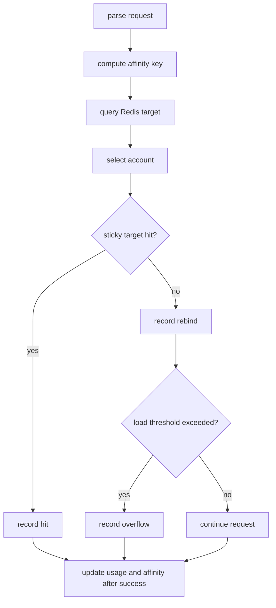
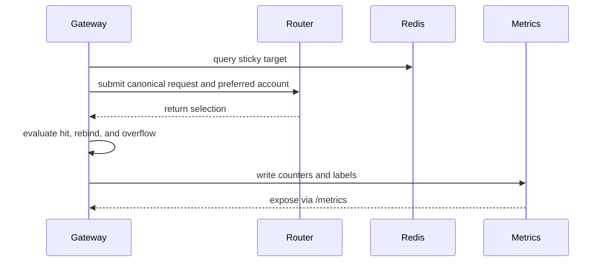

# Routing Sticky Metrics

This document explains how sticky hit, rebind, and overflow metrics are emitted, and how route policy fields are attached as metric labels.

## Purpose

These metrics help determine whether sticky affinity improves cache locality, whether rebinds happen too often, and whether account load frequently causes overflow.

## Metrics

| Metric | Description |
| --- | --- |
| `ghcp_sticky_hits_total` | Number of times the sticky target was reused successfully |
| `ghcp_sticky_rebinds_total` | Number of rebinds when the sticky target is unavailable or must move |
| `ghcp_sticky_overflows_total` | Number of overflows from an overloaded sticky target to another account |

## Rebind Labels

| Label | Description |
| --- | --- |
| `model` | Requested model |
| `pool` | Selected pool ID |
| `reason` | `target_unavailable` or `overflow` |
| `policy_id` | Route policy ID |
| `policy_name` | Route policy name |
| `model_pattern` | Matched model pattern |
| `sticky_mode` | `none`, `soft`, `strict`, or `prefix` |
| `affinity_scope` | Effective affinity scope |
| `priority` | Route policy priority |

## Overflow Labels

| Label | Description |
| --- | --- |
| `model` | Requested model |
| `pool` | Selected pool ID |
| `reason` | `load_ratio_exceeded` |
| `policy_id` | Route policy ID |
| `policy_name` | Route policy name |
| `model_pattern` | Matched model pattern |
| `sticky_mode` | Sticky mode |
| `affinity_scope` | Affinity scope |
| `priority` | Route policy priority |

## Reason Semantics

| Reason | Description |
| --- | --- |
| `target_unavailable` | The sticky target is missing, not active, has an invalid seat, is over concurrency, or cannot be selected under current constraints |
| `overflow` | The sticky target was initially selected, but rebind happened due to load-ratio overflow |
| `load_ratio_exceeded` | Overflow reason emitted when account load is above `max_sticky_load_ratio` |

## Emission Flow

## Notes

- Labels are intentionally static or low-cardinality except `policy_name` and `model_pattern`, which should still be controlled by admin policy governance.
- Detailed metrics are emitted only when `advanced_metrics_enabled` is true.
- Sticky metrics are for observability and tuning; they should never bypass health, budget, risk, or seat-validity checks.
