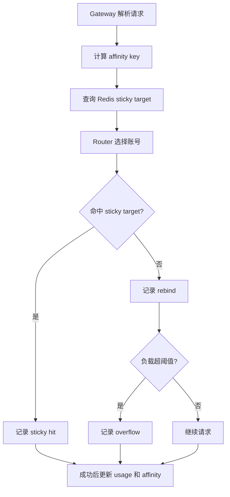
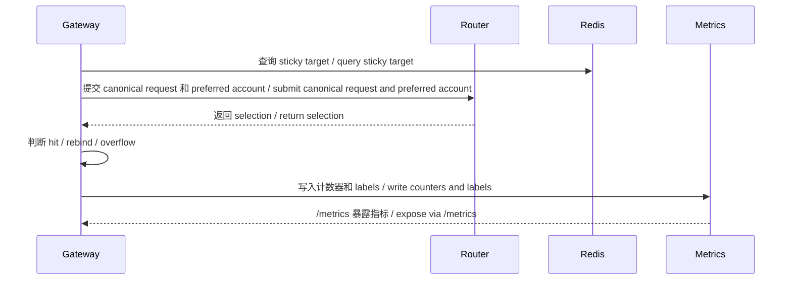

# 路由粘性指标

本文说明 sticky hit、rebind 和 overflow 指标的产生路径，以及 route policy 字段如何作为 labels 附加到指标上。

## 目的

这些指标用于判断 sticky affinity 是否真正提升缓存亲和、是否频繁重绑定，以及账号负载是否经常触发 overflow。

## 指标

| 指标 | 中文说明 | English Description |
| --- | --- | --- |
| `ghcp_sticky_hits_total` | 成功复用 sticky target 的次数 | Number of times the sticky target was reused successfully |
| `ghcp_sticky_rebinds_total` | sticky target 不可用或需要迁移时的重绑定次数 | Number of rebinds when the sticky target is unavailable or must move |
| `ghcp_sticky_overflows_total` | sticky target 因负载过高而溢出到其他账号的次数 | Number of overflows from an overloaded sticky target to another account |

## Rebind 标签

| Label | 说明 |
| --- | --- |
| `model` | 请求模型 |
| `pool` | 选中池 ID |
| `reason` | `target_unavailable` 或 `overflow` |
| `policy_id` | 路由策略 ID |
| `policy_name` | 路由策略名称 |
| `model_pattern` | 命中的模型模式 |
| `sticky_mode` | `none`、`soft`、`strict`、`prefix` |
| `affinity_scope` | 生效的亲和范围 |
| `priority` | 策略优先级 |

## Overflow 标签

| Label | 说明 |
| --- | --- |
| `model` | 请求模型 |
| `pool` | 选中池 ID |
| `reason` | `load_ratio_exceeded` |
| `policy_id` | 路由策略 ID |
| `policy_name` | 路由策略名称 |
| `model_pattern` | 命中的模型模式 |
| `sticky_mode` | 粘性模式 |
| `affinity_scope` | 亲和范围 |
| `priority` | 策略优先级 |

## Reason 语义

| Reason | 说明 |
| --- | --- |
| `target_unavailable` | 粘性目标缺失、非 active、seat 不可用、超并发，或在当前路由约束下不可选 |
| `overflow` | 初选命中粘性目标，但因负载比例过高触发重绑 |
| `load_ratio_exceeded` | 账号负载高于 `max_sticky_load_ratio` 的 overflow 原因 |

## 上报流程

## 说明

- 除 `policy_name` 与 `model_pattern` 外，其余标签应保持静态或低基数；策略命名应由管理侧治理。
- 细化指标仅在 `advanced_metrics_enabled` 为 true 时上报。
- sticky 指标用于观测和调优，不应作为绕过健康、预算、风险或 seat 有效性检查的依据。
