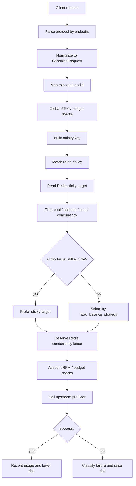
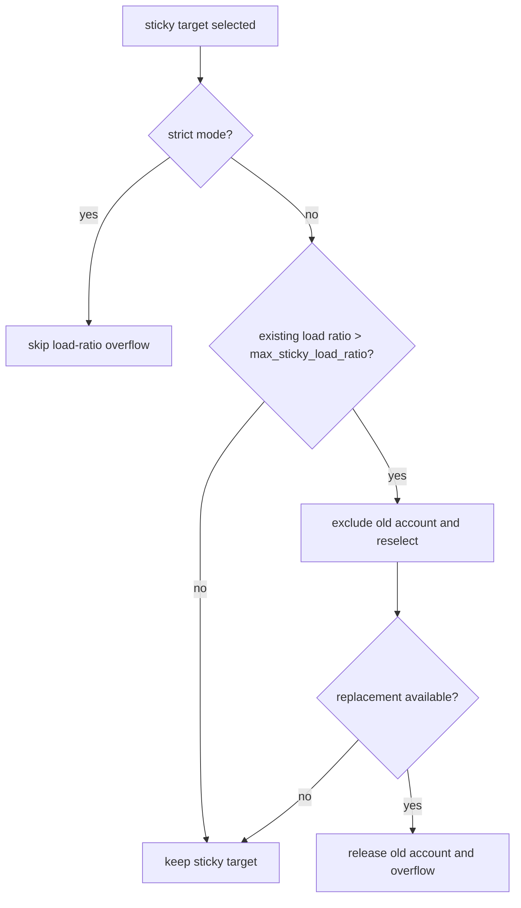

# Routing, Sticky Affinity, and Risk Score

This document explains gateway routing, sticky affinity, concurrency limits, and account risk scoring as one request path. For protocol fields and client setup examples, see [protocol-aware-routing.en.md](protocol-aware-routing.en.md). For sticky metric labels, see [routing-sticky-metrics.en.md](routing-sticky-metrics.en.md).

## Core Principles

- Health and availability win first: inactive pools, inactive accounts, invalid seats, and accounts at their concurrency limit are not eligible.
- Sticky affinity is a preference, not a safety override: a sticky target is reused only when it is still eligible.
- Risk score affects default ordering and account state. Once a state threshold is crossed, the account is removed from routing candidates.
- Budget, RPM, and token checks are performed by the gateway before and after account selection; the router itself does not read budget ledgers.
- The router's process-local concurrency counter is used for fast single-instance filtering. When Redis is available, the gateway uses lease-based concurrency reservations as the cross-instance hard gate.

## Request Routing Path



## Route Policy Matching

The gateway matches policies from `RouteContext`.

| Field | Source | Purpose |
| --- | --- | --- |
| `request_format` | Request endpoint | Distinguishes `openai_chat`, `openai_responses`, and `anthropic_messages` |
| `model` | Canonical request | Matches `model_pattern` by exact value or glob |
| `client_profile_id` | API key client profile | Pins a client to a dedicated policy when set |

Matching order:

1. Ignore policies with `enabled=false`.
2. Match `request_format`; empty value or `*` means any protocol.
3. Match `model_pattern`; exact values and globs are supported.
4. If the policy has `client_profile_id`, it must match the current client profile.
5. Sort by ascending `priority`; within the same priority, client-profile-specific policies are more specific, then `name` and `id` break ties.
6. If no policy matches, fall back to the active pool selection path.

## Candidate Account Filtering

An account must pass these checks before it can be selected.

| Check | Current behavior |
| --- | --- |
| Pool state | Missing, unregistered, or inactive pools are unavailable |
| Account state | Only `active` accounts are eligible; `degraded`, `quarantined`, and `revoked` do not receive requests |
| Seat state | Org/business/enterprise seats must be empty, `active`, or `assigned` |
| Process-local concurrency | `current_concurrency < max_concurrency`; `max_concurrency <= 0` is treated as 1 |
| Redis concurrency lease | When Redis is available, the candidate account must also reserve a lease under `concurrency_leases:{account_id}` |
| Exclusion set | Sticky overflow and rebinding can temporarily exclude the old account |

When the candidate set is empty, the gateway returns `no_available_accounts` with HTTP 503.

Redis concurrency leases use a sorted set containing `lease_id -> expires_at`. Reservation removes expired leases, atomically checks whether the current lease count is below `max_concurrency`, and writes the new lease. The request releases its own lease on completion, and long requests refresh the lease periodically. When Redis is configured but unavailable, the gateway fails the reservation instead of bypassing the cross-instance gate.

## Account Selection Strategies

`load_balance_strategy` controls sorting inside the candidate set.

| Strategy | Ordering | Use case |
| --- | --- | --- |
| `risk_weighted` | Lower risk score, lower current concurrency, higher pool weight, lower account priority | Default strategy for health-first pools |
| `least_concurrency` | Lower current concurrency, higher pool weight, lower risk score, lower account priority | Pools with similar account quality where immediate load spreading matters |
| `round_robin` | Rotate through eligible accounts | Tests, probing, or pools where risk differences are small |

If a sticky target remains in the candidate set, it is chosen before this strategy ordering. Sticky is therefore a preference over eligible accounts, not a separate account selector.

## Sticky Affinity

Sticky affinity stores a `pool + model + key -> account_id` mapping in Redis. Successful requests refresh the mapping. Redis also maintains a `sticky_account:{account_id}` reverse index so disabling an account can delete its sticky keys directly. If old sticky keys have no reverse index, cleanup still falls back to scanning `sticky:*`.

| Mode | Behavior |
| --- | --- |
| `none` | Do not build an affinity key and do not use sticky routing |
| `soft` | Default mode; prefer the sticky target but allow overflow when load is high |
| `strict` | Prefer the same account; still cannot bypass account state, seat state, or `max_concurrency` |
| `prefix` | Use a hash of the system prompt and tool schema, useful for prompt-cache affinity |

The affinity key includes client profile or client id, protocol format, model, and either a session id or prefix hash. Built-in session id sources are checked in this order:

1. Client profile `sticky_session_header`
2. `X-Claude-Code-Session-Id`
3. `X-GHCP-Session-ID`
4. `X-Session-ID`
5. `X-Conversation-ID`
6. `X-Claude-Code-Agent-Id`
7. `X-Claude-Code-Parent-Agent-Id`
8. `X-GHCP-Workspace`
9. `X-GHCP-Project`
10. Body metadata keys `session_id`, `conversation_id`, and `user`

When no session id is available, non-`none` modes try to fall back to a prefix hash. `prefix` mode uses the prefix hash directly and ignores session headers.

## Sticky Overflow

In soft sticky mode, when the sticky target is still eligible, the gateway checks whether the load ratio from concurrency that already existed before this request exceeds `max_sticky_load_ratio`. The default is `0.85`. When Redis is available, this ratio uses the Redis lease count minus the lease just written for the current request, so it reflects existing combined concurrency across gateway instances.

```text
load_ratio = existing_concurrency_before_this_request / max_concurrency
```



The current request itself is not counted in the numerator. For example, with `max_concurrency=2`, the second request sees existing concurrency 1 before it enters, so `1 / 2 = 0.5`; the default `0.85` does not overflow that request just because it fills the account. Overflow is attempted only when the sticky target is already above the threshold before the new request enters.

With `max_concurrency=1`, the first request sees existing concurrency 0 and does not trigger ratio overflow. A second concurrent request is blocked by the hard concurrency limit; ratio overflow never bypasses that limit.

## Behavior When `max_concurrency=1`

Assume one account has `max_concurrency=1`:

- Two users use it at different times: after the first request finishes, the router releases the process-local concurrency count and the Redis lease, and the second request can select the same account again.
- Two users overlap in the same time window: once the first request occupies the account, the second request sees `current_concurrency >= max_concurrency`, so that account is filtered out.
- If another active account under its limit exists in the pool, the second request is rebound or selected to that account by the load strategy.
- If no other account is available, the second request fails with `no_available_accounts` and HTTP 503.
- `strict` sticky does not bypass this limit; it only skips load-ratio overflow and never allows an account to exceed `max_concurrency`.

In multi-gateway deployments, the Redis lease is the strict concurrency gate. The process-local counter is only a fast pre-filter and local load signal. If Redis is unavailable, cross-instance concurrency cannot be decided safely, so the gateway rejects the reservation.

## Risk Score Updates

Risk score is an account-level health score. Higher values mean higher risk. Current defaults are:

| Event | Score change | Meaning |
| --- | --- | --- |
| `auth_expired` | `+20` | Upstream 401 or expired credential |
| `permission_denied` | `+20` | Upstream 403 |
| `rate_limited` | `+10` | Upstream 429 |
| `upstream_5xx` | `+5` | Upstream 500, 502, 503, or 504 |
| `network_error` / `network_timeout` | `+3` | Network error or timeout |
| Other failures | `+5` | Default for unrecognized errors |
| Successful request or probe | `-1` | Floors at 0 and resets the consecutive failure count |

On failure, the gateway classifies the provider error and uses an atomic PostgreSQL update to increment `risk_score` and `current_failure_count`, while writing `last_failure_reason` and `last_failure_at`. On success, the gateway or worker prober records success, resets `current_failure_count`, and lowers `risk_score` by 1.

State thresholds:

| Condition | Target state | Routing effect |
| --- | --- | --- |
| `risk_score >= 70` | `degraded` | Non-active, so future requests do not select this account |
| `risk_score >= 90` | `quarantined` | Non-active, waiting for recovery workflow or manual handling |
| Recovery task succeeds | `active` with risk reset to 0 | Re-enters the candidate set |

The current state machine supports `active -> degraded` and `degraded -> quarantined`, but not a direct `active -> quarantined` jump. When increasing single-failure deltas, keep the largest delta less than or equal to `quarantine_threshold - degrade_threshold`, or update the state machine at the same time. The current maximum delta is 20 and the threshold gap is also 20, so active accounts enter degraded before quarantine.

The risk config struct currently contains `SuccessDelta=-1` and `HourlyDecay=-5`, but the implemented success path always subtracts 1, and hourly decay is not implemented yet.

## Are The Current Scores Reasonable?

The defaults are reasonable as a balanced MVP profile: they do not eject an account after one 429, one 5xx, or a short network blip, but they do degrade or quarantine accounts after repeated failures.

Important tradeoffs:

- 401/403 at `+20` means 4 auth or permission failures move the account to `degraded`, and 5 move it to `quarantined`. If these errors usually mean a permanently invalid credential in your environment, raise the failure delta or lower the degrade threshold, but avoid jumping directly from active into the quarantine range with the current state machine.
- 429 at `+10` means 7 failures move the account to `degraded`. This is appropriate when 429 is a short-term rate limit. If 429 often means exhausted account quota, consider `+15` with tighter cooldown or budget handling.
- 5xx at `+5` is intentionally cautious because upstream service incidents are not always account-specific. Avoid making it too high unless those errors are known to correlate with bad accounts.
- Network errors at `+3` are mild for normal public network jitter. In a stable private network, `+5` can remove bad nodes faster.
- Success subtracting only 1 makes high-risk accounts recover slowly. After risk reaches 70, it needs many successes or a recovery task to return to a low score. If you want more automatic recovery, implement and enable hourly decay or use a success decrement in the `-2` to `-5` range.

## Threshold Configuration Guidance

The current code uses built-in defaults and does not yet expose risk config through the database or environment. If configuration is externalized later, prefer configuring it by profile, pool, or provider rather than as one global setting.

| Profile | Auth / 403 | 429 | 5xx | Network | Degrade | Quarantine | Success / decay |
| --- | --- | --- | --- | --- | --- | --- | --- |
| Conservative large pool | `+15` | `+8` | `+3` | `+2` | `80` | `95` | Success `-1`, hourly `-3` |
| Balanced default | `+20` | `+10` | `+5` | `+3` | `70` | `90` | Success `-1`, hourly `-5` |
| Aggressive protection | `+25` | `+15` | `+8` | `+5` | `60` | `85` | Success `-2`, hourly `-8` |

Tuning recommendations:

- Keep `quarantine_threshold` at least 15 to 25 points above `degrade_threshold` so the degraded state has an observation window.
- Keep the largest single-failure delta no greater than `quarantine_threshold - degrade_threshold`, unless the state machine supports direct transition from active to quarantined.
- Avoid very low degrade thresholds for pools smaller than 3 accounts, or transient errors can exhaust all capacity.
- Treat real authentication failures primarily through credential recovery or manual handling; risk score is a general health signal and should not replace the credential state machine.
- For long-lived coding-client sessions, `strict` or a higher `max_sticky_load_ratio` favors session affinity. For batch or short requests, `soft + 0.85` spreads load more proactively when existing load is already high.
- After every tuning change, observe `no_available_accounts`, sticky rebind/overflow, 429, 401/403, account state transitions, and success rate for at least one peak traffic window.