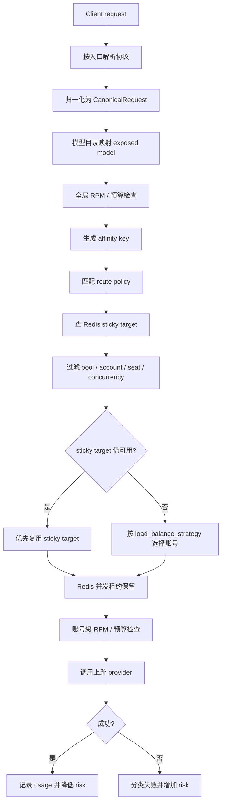
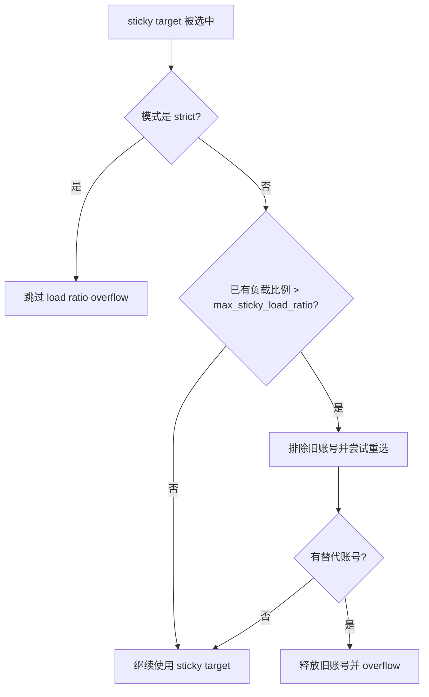

# 路由、Sticky 与 Risk Score

本文把 Gateway 的请求路由、sticky 亲和、并发限制和 risk score 账号健康逻辑放在同一条链路里说明。更细的协议字段和客户端接入示例见 [protocol-aware-routing.zh.md](protocol-aware-routing.zh.md)，sticky 指标标签见 [routing-sticky-metrics.zh.md](routing-sticky-metrics.zh.md)。

## 核心原则

- 健康和可用性优先：非 active pool、非 active account、无效 seat、已达并发上限的账号不会进入候选集。
- Sticky 是偏好，不是安全绕过：sticky target 只有仍在候选集时才会被复用。
- Risk score 影响默认排序和账号状态；状态跨过阈值后，账号会从路由候选集中移除。
- 预算、RPM 和 token 限制由 gateway 在路由前后检查；router 本身不读取预算账本。
- Router 的进程内并发计数用于单实例快速过滤；Redis 可用时，gateway 会用租约式并发保留做跨实例硬门槛。

## 请求路由链路



## Route Policy 匹配

Gateway 根据 `RouteContext` 匹配策略。

| 字段 | 来源 | 作用 |
| --- | --- | --- |
| `request_format` | 请求入口路径 | 区分 `openai_chat`、`openai_responses`、`anthropic_messages` |
| `model` | canonical request | 与 `model_pattern` 精确或 glob 匹配 |
| `client_profile_id` | API key 对应 client profile | 可把某个客户端固定到专用策略 |

匹配顺序：

1. 忽略 `enabled=false` 的策略。
2. 匹配 `request_format`；空值或 `*` 表示任意协议。
3. 匹配 `model_pattern`；支持精确值和 glob。
4. 如果策略设置了 `client_profile_id`，必须与当前 client profile 一致。
5. 按 `priority` 升序排序；同优先级下，有 client profile 约束的策略更具体，随后按 `name`、`id` 排序。
6. 没有命中策略时，回退到 active pool 的默认选择逻辑。

## 候选账号过滤

账号必须通过以下过滤后才可能被选中。

| 检查 | 当前行为 |
| --- | --- |
| Pool 状态 | pool 为空、未注册或非 active 时不可用 |
| Account 状态 | 只有 `active` 账号可进入候选；`degraded`、`quarantined`、`revoked` 不会接请求 |
| Seat 状态 | org/business/enterprise seat 只接受空值、`active` 或 `assigned` |
| 进程内并发 | `current_concurrency < max_concurrency` 才可用；`max_concurrency <= 0` 按 1 处理 |
| Redis 并发租约 | Redis 可用时，候选账号还必须成功写入 `concurrency_leases:{account_id}` 租约 |
| 排除列表 | sticky overflow 或重绑定时可临时排除旧账号 |

候选集为空时，gateway 返回 `no_available_accounts`，HTTP 状态为 503。

Redis 并发租约使用 sorted set 保存 `lease_id -> expires_at`，保留账号时会先清理过期 lease，再原子检查当前 lease 数是否小于 `max_concurrency`。请求结束会释放自己的 lease；长请求会按 TTL 周期续租。Redis 不可用时，gateway 会返回路由不可用错误，而不是绕过跨实例并发门槛。

## 账号选择策略

`load_balance_strategy` 决定候选账号之间如何排序。

| 策略 | 排序逻辑 | 适用场景 |
| --- | --- | --- |
| `risk_weighted` | 低 risk score、低当前并发、高 pool weight、低账号 priority | 默认策略，适合以健康优先为主的池 |
| `least_concurrency` | 低当前并发、高 pool weight、低 risk score、低账号 priority | 多个账号质量接近、希望摊平即时负载 |
| `round_robin` | 在候选账号之间轮转 | 测试、均匀试探或风险差异不大的池 |

注意：sticky target 如果仍在候选集中，会先于上述排序被复用。也就是说 sticky 是候选账号上的优先级偏好，而不是一个独立账号选择器。

## Sticky 亲和策略

Sticky 通过 affinity key 在 Redis 中保存 `pool + model + key -> account_id` 的映射。请求成功后会更新映射。Redis 同时维护 `sticky_account:{account_id}` 反向索引，因此账号被禁用时可以按账号快速删除相关 sticky key；如果遇到旧数据没有反向索引，仍会回退扫描 `sticky:*`。

| 模式 | 行为 |
| --- | --- |
| `none` | 不生成 affinity key，不使用 sticky |
| `soft` | 默认模式；优先 sticky target，但允许负载过高时 overflow |
| `strict` | 优先保持同一账号；仍然不能绕过账号状态、seat 或 `max_concurrency` |
| `prefix` | 使用 system prompt 和 tools schema 的哈希生成亲和键，适合 prompt cache 亲和 |

Affinity key 的输入包括 client profile 或 client id、协议格式、模型，以及 session id 或 prefix hash。内置 session header 优先级包括：

1. client profile 自定义的 `sticky_session_header`
2. `X-Claude-Code-Session-Id`
3. `X-GHCP-Session-ID`
4. `X-Session-ID`
5. `X-Conversation-ID`
6. `X-Claude-Code-Agent-Id`
7. `X-Claude-Code-Parent-Agent-Id`
8. `X-GHCP-Workspace`
9. `X-GHCP-Project`
10. body metadata 中的 `session_id`、`conversation_id`、`user`

没有 session id 时，非 `none` 模式会尝试回退到 prefix hash。`prefix` 模式直接使用 prefix hash，并忽略 session header。

## Sticky Overflow

软 sticky 模式下，gateway 会在 sticky target 仍可用时检查“接纳当前请求前已有并发”的负载比例是否超过 `max_sticky_load_ratio`。默认值是 `0.85`。Redis 可用时，这个比例使用 Redis 租约数减去当前请求刚写入的 lease，因此能反映多个 gateway 实例的合计已有并发。

```text
load_ratio = existing_concurrency_before_this_request / max_concurrency
```



这个比例不把当前请求本身算进分子。例如 `max_concurrency=2` 时，第 2 个请求进入前已有并发是 1，`1 / 2 = 0.5`，默认 `0.85` 下不会因为自己把账号打满而 overflow。只有当 sticky target 在请求进入前已经高于阈值时，才会尝试把新请求分流到其他账号。

`max_concurrency=1` 时，第一个请求进入前已有并发是 0，不会触发 ratio overflow；第二个并发请求会被硬并发限制拦住，不会走 ratio overflow 来突破限制。

## `max_concurrency=1` 的并发行为

假设一个账号 `max_concurrency=1`：

- 两个用户错开使用：第一个请求结束后 router 会释放进程内并发计数，Redis lease 也会释放；第二个请求可以再次选中同一账号。
- 两个用户同一时段重叠使用：第一个请求占用账号后，第二个请求看到该账号 `current_concurrency >= max_concurrency`，该账号会被过滤掉。
- 如果池里还有其他 active 且未超并发的账号，第二个请求会被重绑定或按负载策略选择到其他账号。
- 如果没有其他可用账号，第二个请求会失败，返回 `no_available_accounts` 和 503。
- `strict` sticky 不会突破这个限制；它只跳过 load ratio overflow，不会允许同一账号超过 `max_concurrency`。

在多 gateway 实例部署中，Redis lease 是严格并发门槛；进程内计数只负责当前进程的快速预过滤和本地负载排序。如果 Redis 不可用，跨实例并发无法安全判断，gateway 会拒绝本次保留。

## Risk Score 更新逻辑

Risk score 是账号级健康分，数值越高代表风险越高。当前默认配置如下。

| 事件 | 分值变化 | 说明 |
| --- | --- | --- |
| `auth_expired` | `+20` | 上游 401 或凭据过期 |
| `permission_denied` | `+20` | 上游 403 |
| `rate_limited` | `+10` | 上游 429 |
| `upstream_5xx` | `+5` | 上游 500、502、503、504 |
| `network_error` / `network_timeout` | `+3` | 网络错误或超时 |
| 其他失败 | `+5` | 未识别错误的默认值 |
| 成功请求或探针成功 | `-1` | 最低降到 0，并重置连续失败计数 |

失败时，gateway 会把 provider 错误分类为失败原因，并用 PostgreSQL 原子更新递增 `risk_score` 和 `current_failure_count`，同时写入 `last_failure_reason` 和 `last_failure_at`。成功时，gateway 或 worker prober 会调用成功记录，把 `current_failure_count` 归零，并把 `risk_score` 降低 1。

状态阈值：

| 条件 | 目标状态 | 路由影响 |
| --- | --- | --- |
| `risk_score >= 70` | `degraded` | 非 active，后续请求不再选择该账号 |
| `risk_score >= 90` | `quarantined` | 非 active，等待恢复流程或人工处理 |
| 恢复任务成功 | `active` 且 risk 重置为 0 | 重新进入候选集 |

当前状态机支持 `active -> degraded` 和 `degraded -> quarantined`，但不支持 `active -> quarantined` 直跳。因此调高单次失败分值时，要让最大失败增量小于或等于 `quarantine_threshold - degrade_threshold`，或者同步调整状态机。当前默认最大增量是 20，阈值间隔也是 20，所以 active 账号会先进入 degraded，再进入 quarantined。

当前实现中，`SuccessDelta=-1` 和 `HourlyDecay=-5` 出现在风险配置结构里，但实际成功路径固定按 1 分扣减，小时级衰减任务尚未实现。

## 当前分值是否合适

这组默认值适合作为 MVP 的均衡配置：它不会因为单次 429、单次 5xx 或短暂网络抖动立刻踢掉账号，同时能在多次持续失败后自动降级或隔离。

需要注意的取舍：

- 401/403 每次 `+20` 意味着 4 次认证或权限失败后进入 `degraded`，5 次后进入 `quarantined`。如果这类错误在你的环境中通常代表凭据永久失效，可以提高失败分值或降低 degrade 阈值，但要避免在当前状态机下从 active 直接跳到 quarantine 区间。
- 429 每次 `+10` 意味着 7 次后进入 `degraded`。这适合把 429 当作短期限流；如果 429 经常代表账号额度耗尽，可提高到 `+15`，并配合更短的冷却或预算逻辑。
- 5xx 每次 `+5` 比较稳妥，因为上游服务故障不一定是账号问题。除非确认某些 5xx 与账号状态强相关，否则不建议过高。
- 网络错误每次 `+3` 较温和，适合普通公网波动。内网稳定环境可以提高到 `+5`，让坏节点更快退出。
- 成功只扣 1 分会让高风险账号恢复较慢。风险分达到 70 后，即使问题解除，也需要大量成功请求或恢复任务才能回到低风险；如果希望自动恢复更灵敏，可以实现并启用 `HourlyDecay`，或把成功扣减调到 `-2` 到 `-5`。

## 阈值配置建议

当前代码使用内置默认值，尚未把 risk config 外部化到数据库或环境变量。后续如果开放配置，建议以 profile、pool 或 provider 维度配置，而不是全局一刀切。

| 场景 | Auth / 403 | 429 | 5xx | Network | Degrade | Quarantine | 成功扣减 / 衰减 |
| --- | --- | --- | --- | --- | --- | --- | --- |
| 保守大池 | `+15` | `+8` | `+3` | `+2` | `80` | `95` | 成功 `-1`，小时 `-3` |
| 均衡默认 | `+20` | `+10` | `+5` | `+3` | `70` | `90` | 成功 `-1`，小时 `-5` |
| 激进保护 | `+25` | `+15` | `+8` | `+5` | `60` | `85` | 成功 `-2`，小时 `-8` |

调参建议：

- `quarantine_threshold` 至少比 `degrade_threshold` 高 15 到 25 分，给降级态留出观察窗口。
- 最大单次失败增量不要超过 `quarantine_threshold - degrade_threshold`，除非状态机支持从 active 直接进入 quarantined。
- 账号池容量小于 3 时，不建议过低的 degrade 阈值，否则容易因为瞬时错误耗尽可用账号。
- 对真实认证失败，优先考虑直接进入恢复流程或人工处理；risk score 适合作为通用健康信号，不应替代凭据状态机。
- 对 coding 客户端长会话，`strict` 或较高的 `max_sticky_load_ratio` 更偏向保持会话亲和；对批处理和短请求，`soft + 0.85` 能在已有负载较高时更主动地摊平负载。
- 每次调整后观察 `no_available_accounts`、sticky rebind/overflow、429、401/403、账号状态变更和成功率，至少覆盖一个业务高峰窗口。