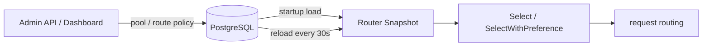
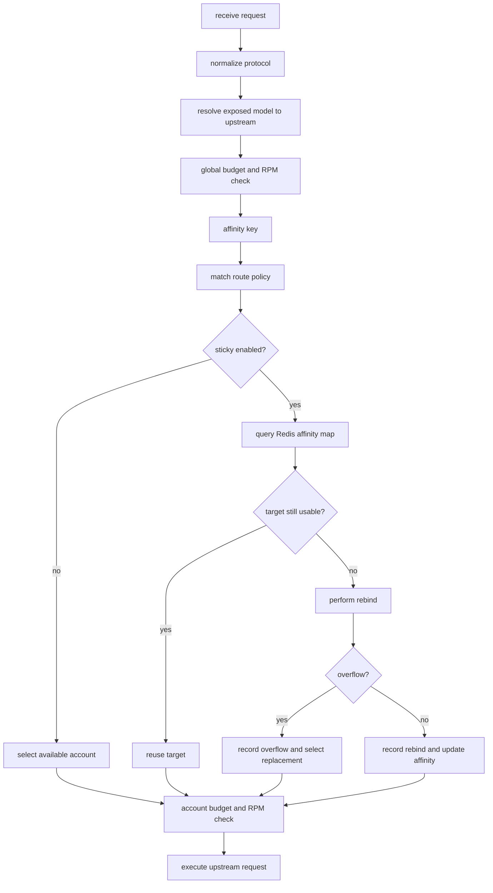
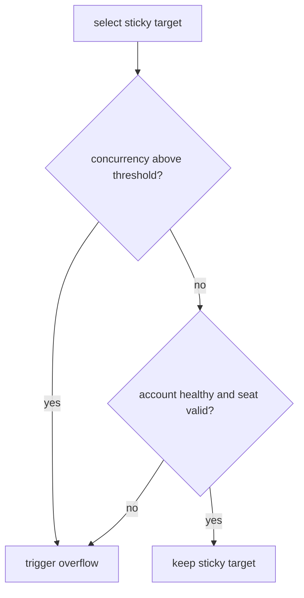
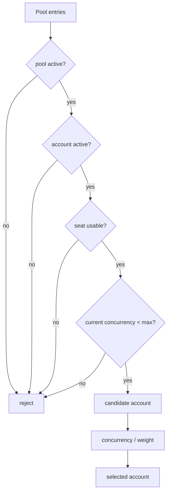
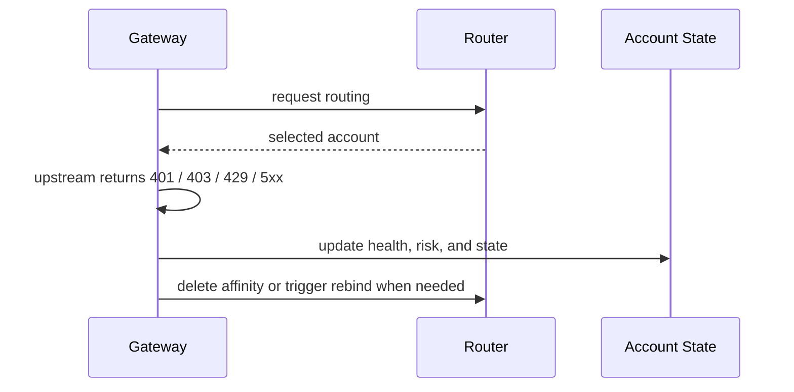

# Routing Rules

This document describes routing from model to pool, pool to account, and sticky affinity with overflow. The MVP principle is: health and availability first, sticky affinity as a soft preference.

For protocol-aware policies and Claude Code / Codex client setup, see [protocol-aware-routing.en.md](protocol-aware-routing.en.md). For the combined routing, sticky affinity, concurrency, and risk score model, see [routing-sticky-risk.en.md](routing-sticky-risk.en.md).

## Routing Inputs

- Requested model and protocol type, such as `openai_chat`, `openai_responses`, or `anthropic_messages`.
- Default model, sticky configuration, and tool-call compatibility options from client profiles.
- Route policy fields such as `request_format`, `model_pattern`, `load_balance_strategy`, pool priority, and sticky mode.
- Pool active state, account active state, concurrency, risk, priority, pool membership weight, and seat status.
- Budget checks are performed by the gateway at global and account scope; the router does not read budget ledgers directly.

## Configuration Hot Refresh

The gateway router uses in-memory snapshots for the hot path. Snapshots are loaded from PostgreSQL at startup and refreshed every 30 seconds for pools, pool account memberships, and route policies.

The model catalog is not part of the router snapshot. The gateway reads `model_catalog_json` when handling `/v1/models` and request model resolution, mapping exposed names to upstream models and optionally selecting the upstream Copilot endpoint with `upstream_api` (`chat_completions` or `responses`). Upstream endpoint selection is not globally Responses by default; it is mixed: `upstream_api` wins; Copilot-refreshed `vendor=OpenAI` models and known `gpt-5.5` use upstream Responses; other models follow the downstream request protocol, where `/v1/responses` uses Responses and Chat-compatible requests use Chat Completions.

## Routing Flow

## Rule Priority

1. Explicit route policies take priority over the default pool.
2. Policies matching both `request_format` and `model_pattern` take priority; `*` means any protocol or model.
3. Active accounts under their concurrency limit take priority over other account states.
4. Pool state, account state, seat state, concurrency, and risk take priority over sticky affinity.
5. Reuse the sticky target when it remains eligible; otherwise rebind.
6. When the sticky target is overloaded, overflow to another healthy account is allowed.
7. Account-level budget is checked after account selection; failures return rate-limit or budget errors.

## Load Balance Strategies

When sticky affinity does not provide an eligible target, the selected route policy chooses an account within its matched pool using `load_balance_strategy`.

| Strategy | Description |
| --- | --- |
| `risk_weighted` | Default behavior; prefer lower risk, lower current concurrency, higher pool weight, then lower account priority |
| `round_robin` | Rotate across eligible accounts for the same route policy, ordered by account priority then account id |
| `least_concurrency` | Prefer the eligible account with the lowest current concurrency, then higher pool weight, lower risk, and lower account priority |

## Sticky Modes

| Mode | Description |
| --- | --- |
| `none` | Sticky affinity disabled |
| `soft` | Default mode; prefer sticky target but allow automatic rebind |
| `strict` | Keep the same account when possible; rebind only when unavailable |
| `prefix` | Affinity by prefix hash, useful for batches with similar system prompts and tool schemas |

## Overflow Triggers

- Account current concurrency reaches or exceeds `max_concurrency`.
- Sticky target load ratio exceeds `max_sticky_load_ratio`.
- The account is no longer active, its seat is invalid, or its risk is too high.

## Account Selection

1. First filter inactive pools, inactive accounts, over-concurrency accounts, and unavailable org/enterprise seats.
2. Select the best account from candidates by risk score, current concurrency, pool membership weight, and account priority.
3. If the preferred sticky account remains in the candidate set, it is selected first; otherwise rebind begins.
4. The current implementation absorbs pool/account/policy changes through 30-second snapshot refreshes. Later phases can add event-driven refresh or rendezvous hashing to reduce migration.

## Affinity Key

- The affinity key is composed from tenant or client profile identifier, protocol, canonical model, session key, or prefix hash.
- Only hashes are stored; prompt plaintext is not stored.
- Different accounts, models, and protocol formats do not share affinity by default.
- Recommended Claude Code / Codex session headers are described in [protocol-aware-routing.en.md](protocol-aware-routing.en.md).

## Routing Failure Handling

- 401, 403, and seat invalidation should first trigger degradation or quarantine.
- Repeated 429 responses trigger short cooldown and lower effective weight.
- 5xx responses and timeouts primarily feed health and risk scoring.

## Metrics

The repository reserves the following sticky-related metric semantics.

- `ghcp_sticky_hits_total`
- `ghcp_sticky_rebinds_total`
- `ghcp_sticky_overflows_total`

Detailed label definitions are in [routing-sticky-metrics.en.md](routing-sticky-metrics.en.md).
