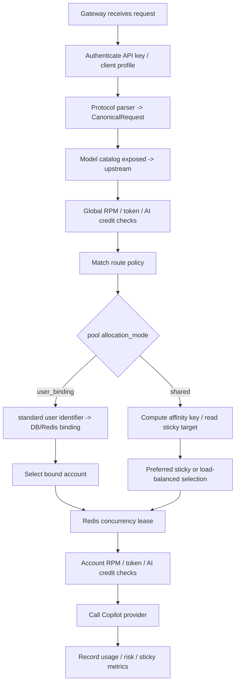

# Routing Rules

This is the primary gateway routing document. It covers route policies, pool allocation modes, sticky affinity, load balancing, concurrency, risk score, and sticky metrics. Protocol parsing, conversion, discarded fields, and upstream passthrough parameters are documented in [protocol.en.md](protocol.en.md).

## Execution Order



The routing hot path uses an in-memory snapshot sourced from PostgreSQL. The gateway loads pools, pool accounts, route policies, and active account bindings at startup, then refreshes every 30 seconds. Redis stores sticky maps, account-binding hot cache, concurrency leases, and other hot distributed state.

## Route Policy Matching

`RouteContext` contains only the fields needed by routing.

| Field | Source | Purpose |
| --- | --- | --- |
| `request_format` | Request endpoint | `openai_chat`, `openai_responses`, or `anthropic_messages` |
| `model` | Upstream model after catalog resolution, plus the original client model and client-profile aliased exposed model | Exact or glob match against `model_pattern` |
| `client_profile_id` | API key client profile | Optional client-specific routing |

Matching rules:

1. Ignore `enabled=false` policies.
2. `request_format` must match; empty or `*` means any protocol.
3. `model_pattern` must match the upstream model, original client model, or client-profile aliased exposed model; exact values and `filepath.Match`-style globs are supported.
4. If `client_profile_id` is set, it must match the current profile.
5. Sort by ascending `priority`; within equal priority, client-profile-specific policies are more specific, then `name` and `id` break ties.
6. If a matching policy points at an inactive pool, continue to the next policy.
7. If no policy matches, fallback to all active pools ordered by pool `priority`, `name`, and `id`.

## Pool Allocation Modes

| `allocation_mode` | Behavior |
| --- | --- |
| `shared` | Users share pool accounts; sticky affinity is a preference and may rebind under load or health changes |
| `user_binding` | A standard request `user_id` is bound to one account; while active, the account is exclusive to that binding |
| `session_binding` | A standard request `session_id` is bound to one account; while active, the account is exclusive to that binding |

For binding pools:

- `user_id` comes from OpenAI Chat/Responses `user`, Anthropic `metadata.user_id`, or Anthropic `metadata.user`; `X-GHCP-User` is a header fallback.
- `session_id` comes from request `session_id` / `session` or `metadata.session_id` / `metadata.session`; `X-GHCP-Session-ID` and `X-Claude-Code-Session-Id` are header fallbacks.
- Binding keys are `client_profile_id + pool_id + lower(trim(user_id))` and `client_profile_id + pool_id + lower(trim(session_id))` respectively.
- One user/session id can have only one active binding per client profile and pool.
- One account can be occupied by only one active binding at a time.
- First binding selects an unbound account ordered by low account `priority`, low `risk_score`, high pool membership `weight`, and low account `id`.
- Each hit refreshes `last_used_at` and `expires_at`; defaults are 7 idle days for `user_binding` and 5 idle minutes for `session_binding`; pool `binding_ttl_seconds` may override this.
- Binding pools use pool `binding_max_concurrency` as the effective concurrency limit, defaulting to 10, without changing the account's original `max_concurrency`.
- Release happens only by expiration or manual Dashboard `Release` from the expanded pool detail.
- If the bound account is unavailable or at concurrency limit, the request fails instead of rebinding.
- Shared pools avoid accounts occupied by active bindings.

## Candidate Filtering

All ordinary and required-account selections must pass these filters.

| Check | Current behavior |
| --- | --- |
| Pool status | Pool must exist and have empty or `active` status |
| Account status | Only `active` accounts are eligible |
| Seat status | Org/business/enterprise seats must be empty, `active`, or `assigned` |
| Reserved account | Active binding accounts are unavailable to shared pools; binding requests may use only their own required account |
| Process concurrency | `current_concurrency < effective_max_concurrency`; binding pools prefer pool `binding_max_concurrency`, otherwise account `max_concurrency`; non-positive values are treated as 1 |
| Exclusion set | Sticky overflow and concurrency rebinding may temporarily exclude the old account |

An empty candidate set enters gateway error mapping; see [operations.en.md](operations.en.md) for the client-facing status and internal routing reason mapping.

## Load Balancing

`load_balance_strategy` applies to shared-pool and fallback selection. User-binding first assignment uses its own deterministic ordering.

| Strategy | Ordering | Use case |
| --- | --- | --- |
| `risk_weighted` | Lower `risk_score`, lower current concurrency, higher membership `weight`, lower account `priority` | Default health-first routing |
| `least_concurrency` | Lower current concurrency, higher `weight`, lower `risk_score`, lower account `priority` | Similar account quality with immediate load spreading |
| `round_robin` | Rotate after sorting by account `priority` and `id` | Tests, probing, or low risk variance pools |

If a sticky target remains in the candidate set, the router selects it before strategy ordering. Sticky is therefore an eligible-account preference, not a bypass.

## Sticky Affinity

Sticky mappings are stored in Redis as:

```text
sticky:{pool_id}:{model}:{affinity_key_hash} -> account_id
```

Successful requests write or refresh the target. Redis also keeps a `sticky_account:{account_id}` reverse index so disabling an account can delete its sticky keys.

| Mode | Behavior |
| --- | --- |
| `none` | Do not build an affinity key and do not use sticky routing |
| `soft` | Default; prefer sticky target but allow load-ratio overflow |
| `strict` | Prefer the same account; still cannot bypass account state, seat validity, or hard concurrency |
| `prefix` | Use a hash of system prompt, first user context, and tool schema for prompt-cache affinity |

Session key order:

1. Client profile `sticky_session_header`
2. `X-Claude-Code-Session-Id`
3. `X-GHCP-Session-ID`
4. `X-Session-ID`
5. `X-Conversation-ID`
6. `X-Claude-Code-Agent-Id`
7. `X-Claude-Code-Parent-Agent-Id`
8. `X-GHCP-Workspace`
9. `X-GHCP-Project`
10. Body metadata keys `session_id`, `conversation_id`, and `user`

When no session key exists, non-`none` modes fallback to a prefix hash. `prefix` mode always uses the prefix hash and ignores session headers. The affinity key includes client profile, protocol, model, and session/prefix material; only hashes are stored.

## Sticky Overflow And Concurrency

Concurrency has two layers: the router's process-local counter is a fast filter and ordering signal; the Redis lease is the hard gate across gateway instances. After selecting an account, the gateway reserves a lease in `concurrency_leases:{account_id}`. A failed reservation means the account is full across instances.

In soft sticky mode, if the sticky target is eligible, the gateway checks load that existed before the current request:

```text
load_ratio = existing_concurrency_before_this_request / max_concurrency
```

When `load_ratio > max_sticky_load_ratio` and another candidate exists, the gateway releases the old account and overflows to another account. The default `max_sticky_load_ratio` is `0.85`. `strict` skips this ratio-based overflow only; it never exceeds `max_concurrency`.

If a required user/session binding account reaches its effective concurrency limit, the request fails and does not rebind.

## Risk Score And Account State

Risk score is account health. Higher means riskier. Candidate filtering accepts only `active` accounts, so `degraded`, `quarantined`, and `revoked` accounts do not receive requests.

Default deltas:

| Event | Delta |
| --- | --- |
| `auth_expired` / upstream 401 | `+20` |
| `permission_denied` / upstream 403 | `+20` |
| `rate_limited` / upstream 429 | `+10` |
| `upstream_5xx` | `+5` |
| `network_error` / `network_timeout` | `+3` |
| Other failures | `+5` |
| Successful request or probe | `-1`, floored at 0 |

Thresholds:

| Condition | Target state | Routing effect |
| --- | --- | --- |
| `risk_score >= 70` | `degraded` | Removed from candidates |
| `risk_score >= 90` | `quarantined` | Removed from candidates until recovery or manual handling |
| Recovery succeeds | `active` with reset risk | Re-enters candidates |

The current state machine supports `active -> degraded` and `degraded -> quarantined`, but not direct `active -> quarantined` jumps.

## Budgets And Limits

Before routing, the gateway checks global RPM, daily tokens, and daily AI credits. After selecting an account, it checks account-level RPM, tokens, and AI credits. Budget failures return rate-limit or budget errors and do not try another account.

The router itself does not read budget ledgers; it handles pools, policies, account status, seats, reservations, and concurrency.

## Metrics

Basic request, token, and account metrics are always available. Detailed sticky metrics require `advanced_metrics_enabled=true`.

| Metric | Meaning | Key labels |
| --- | --- | --- |
| `ghcp_sticky_hits_total` | Sticky target reused | `model`, `pool` |
| `ghcp_sticky_rebinds_total` | Sticky target missing, unavailable, or moved | `model`, `pool`, `reason`, `policy_id`, `policy_name`, `model_pattern`, `sticky_mode`, `affinity_scope`, `priority` |
| `ghcp_sticky_overflows_total` | Sticky target moved due to high load ratio | Same labels, with `reason=load_ratio_exceeded` |

Common reasons:

| Reason | Meaning |
| --- | --- |
| `target_unavailable` | Sticky target is missing, inactive, seat-invalid, over concurrency, or outside current policy constraints |
| `concurrency_limit` | Redis concurrency lease is full and rebind is attempted |
| `overflow` | Sticky target was initially selected but moved due to load ratio |
| `load_ratio_exceeded` | Concrete overflow reason |

## Tuning Guidance

- Long-lived coding-client sessions should use `soft` sticky with a stable session ID; use `strict` only when stronger affinity is worth lower flexibility.
- Batch and short requests usually work well with `soft + risk_weighted`.
- Use `user_binding` when accounts must be exclusive per user and `session_binding` when short-lived sessions need exclusive accounts; keep `user_id` / `session_id` stable and low-cardinality for the intended scope.
- Avoid very low risk thresholds for small pools, or transient errors can exhaust capacity.
- Tune after observing `no_available_accounts`, sticky hit/rebind/overflow, 429, 401/403, account state changes, and success rate.