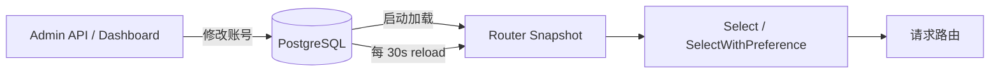
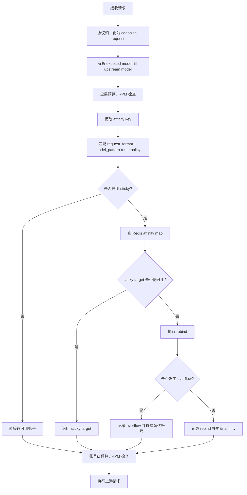
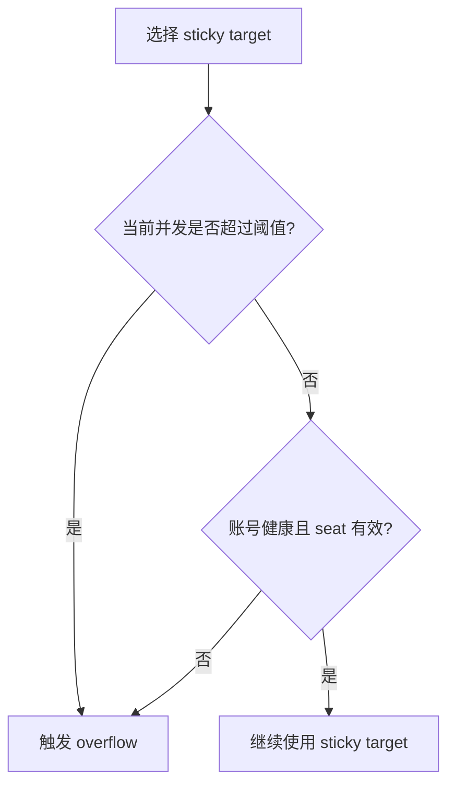
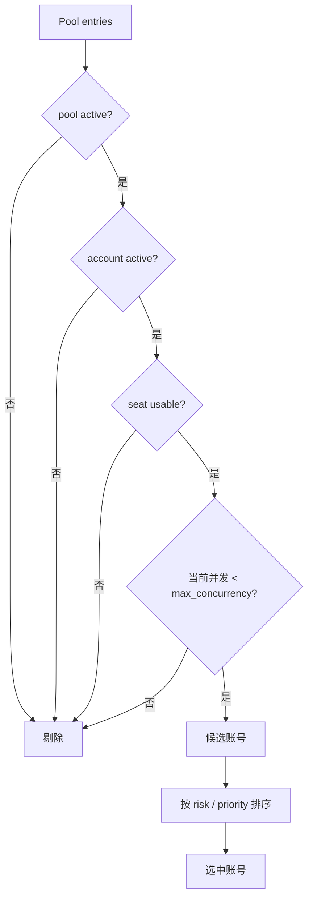
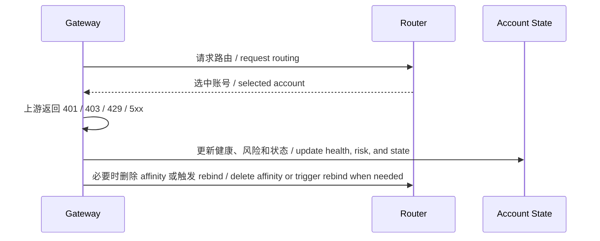

# Routing 规则

本文档描述模型到池、池到账户，以及 sticky 亲和与 overflow 的路由规则。MVP 的原则是“健康和可用性优先，sticky 亲和只做软偏好”。

协议维度的策略设计、Claude Code / Codex 客户端配置示例见 [protocol-aware-routing.zh.md](protocol-aware-routing.zh.md)。路由、sticky、并发与 risk score 的综合说明见 [routing-sticky-risk.zh.md](routing-sticky-risk.zh.md)。

## 路由输入

- 请求模型和协议类型，例如 `openai_chat`、`openai_responses`、`anthropic_messages`。
- client profile 中的默认模型、sticky 配置和工具调用兼容项。
- route policy 的 `request_format`、`model_pattern`、`load_balance_strategy`、pool priority 和 sticky mode。
- pool active 状态，账号 active 状态、并发、风险、priority、pool membership weight 和 seat 状态。
- 预算检查由 gateway 在全局维度和账号维度执行，router 不直接读取预算账本。

## 配置热刷新

Gateway 内部 router 使用内存快照处理热路径。快照来源于 PostgreSQL，进程启动时加载一次，随后每 30 秒刷新 pool、pool account membership 和 route policy。

模型目录不属于 router 快照；gateway 解析 `/v1/models` 和请求模型时读取 `model_catalog_json`，从 exposed name 映射到 upstream model，并可通过 `upstream_api` 指定上游 Copilot endpoint（`chat_completions` 或 `responses`）。上游 endpoint 不是全局默认 Responses，而是混合选择：`upstream_api` 优先；从 Copilot 刷新的 `vendor=OpenAI` 模型和已知 `gpt-5.5` 走上游 Responses；Gemini、Anthropic、Grok 等已知 chat-only vendor/model family 即使下游是 `/v1/responses` 也走上游 Chat Completions；其他模型跟随下游请求协议。

## 路由总流程

## 规则优先级

1. 显式 route policy 优先于默认池。
2. `request_format` 和 `model_pattern` 都匹配的 policy 优先；`*` 表示任意协议或模型。
3. active 且未超并发的账号优先于其他状态账号。
4. pool 状态、账号状态、seat 状态、并发和风险优先于 sticky affinity。
5. sticky target 满足条件时优先复用，否则重绑定。
6. sticky target 负载过高时允许 overflow 到其他健康账号。
7. 账号级预算在账号选定后检查；不通过时请求返回限流或预算错误。

## 负载均衡策略

当 sticky affinity 没有给出可用目标时，命中的 route policy 会用 `load_balance_strategy` 在对应池内选择账号。

| Strategy | 说明 |
| --- | --- |
| `risk_weighted` | 默认行为；优先低风险、低当前并发、高 pool membership weight，再按账号 priority |
| `round_robin` | 对同一 route policy 的可用账号轮询，排序依据是账号 priority 和账号 id |
| `least_concurrency` | 优先当前并发最低的可用账号，再按更高 weight、低风险和账号 priority |

## Sticky 模式

| Mode | 说明 |
| --- | --- |
| `none` | 不启用粘性 |
| `soft` | 默认模式，优先命中 sticky target，但允许自动重绑定 |
| `strict` | 尽量固定到同一账号，只在不可用时重绑定 |
| `prefix` | 按前缀哈希亲和，适合系统提示和工具 schema 相似的批量任务 |

## overflow 触发条件

- 账号当前并发达到或超过 `max_concurrency`。
- sticky target 的负载比例超过 `max_sticky_load_ratio`。
- 账号不再 active、seat 失效或风险过高。

## 账号选择

1. 先过滤非 active pool、非 active 账号、超并发账号和不可用 org/enterprise seat。
2. 在候选集中按 risk score、当前并发、pool membership weight、账号 priority 选择最优账号。
3. sticky preferred account 如果仍在候选集中，会优先被选中；否则进入 rebind。
4. 当前实现通过 30 秒刷新快照吸收 pool/account/policy 变更，后续可引入事件驱动刷新或 rendezvous hashing 降低迁移。

## 亲和键

- affinity key 由 tenant 或 client profile 标识、协议、canonical model、session key 或 prefix hash 组合生成。
- 只保存哈希，不保存 prompt 明文。
- 不同账号、不同模型和不同协议格式默认不共享 affinity。
- Codex 的推荐 session header 详见 [protocol-aware-routing.zh.md](protocol-aware-routing.zh.md)。

## 路由失败处理

- 401、403 和 seat 失效要优先触发降级或 quarantine。
- 连续 429 触发短期冷却和权重下降。
- 5xx 和超时主要反馈健康分和风险分。

## 指标

仓库已预留以下 sticky 相关指标语义。

- `ghcp_sticky_hits_total`
- `ghcp_sticky_rebinds_total`
- `ghcp_sticky_overflows_total`

详细 label 定义见 [routing-sticky-metrics.zh.md](routing-sticky-metrics.zh.md)。
