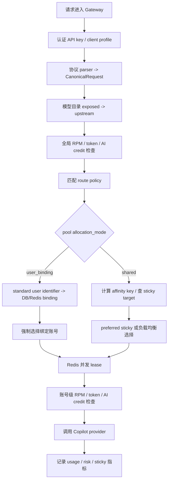

# Routing 规则

本文是 Gateway 路由的唯一主文档，覆盖 route policy、pool 分配模式、sticky、负载均衡、并发、risk score 和 sticky 指标。协议字段如何解析、转换、丢弃或透传见 [protocol.zh.md](protocol.zh.md)。

## 执行顺序



路由热路径使用内存快照，数据来源于 PostgreSQL。Gateway 启动时加载一次 pool、pool account、route policy 和 active user bindings，之后每 30 秒刷新。Redis 用于 sticky map、user-binding 热缓存、并发 lease 和分布式热状态。

## Route Policy 匹配

`RouteContext` 只包含当前路由需要的三项：

| 字段 | 来源 | 用途 |
| --- | --- | --- |
| `request_format` | 请求入口 | `openai_chat`、`openai_responses`、`anthropic_messages` |
| `model` | 模型目录转换后的 upstream model | 与 `model_pattern` 精确或 glob 匹配 |
| `client_profile_id` | API key 对应 client profile | 可把特定客户端固定到专用策略 |

策略匹配规则：

1. 忽略 `enabled=false`。
2. `request_format` 必须匹配；策略为空或 `*` 表示任意协议。
3. `model_pattern` 必须匹配；支持精确值和 `filepath.Match` 风格 glob。
4. 如果策略设置了 `client_profile_id`，必须等于当前 client profile。
5. 排序按 `priority` 升序；同优先级下，带 `client_profile_id` 的策略更具体；随后按 `name`、`id` 排序。
6. 命中策略但目标 pool 不 active 时继续找下一条策略。
7. 没有命中策略时，回退到所有 active pool，按 pool `priority`、`name`、`id` 排序尝试。

route policy 关键字段：

| 字段 | 当前行为 |
| --- | --- |
| `request_format` | 协议维度路由，支持 `*` |
| `model_pattern` | 模型匹配，必须非空 |
| `client_profile_id` | 可选客户端约束 |
| `pool_id` | 策略目标 pool |
| `load_balance_strategy` | `risk_weighted`、`least_concurrency`、`round_robin` |
| `sticky_mode` | `none`、`soft`、`strict`、`prefix` |
| `affinity_scope` | 非空时覆盖默认 sticky scope |
| `sticky_ttl_seconds` | 非 0 时覆盖 client profile TTL |

## Pool 分配模式

Pool 有两种分配模式。

| `allocation_mode` | 行为 |
| --- | --- |
| `shared` | 多用户共享池内账号；sticky 是偏好，负载和健康可以触发 rebind |
| `user_binding` | 按标准请求用户标识把用户长期绑定到一个账号；绑定 active 期间账号独占 |

### User-binding Pool

`user_binding` pool 的绑定关系以 PostgreSQL 为事实源，Redis 只做热缓存。绑定 key 是：

```text
client_profile_id + pool_id + lower(trim(user_identifier))
```

规则：

- 优先读取标准请求用户标识：OpenAI Chat/Responses 的 `user` 字段、Anthropic `metadata.user_id` 或 `metadata.user`；`X-GHCP-User` 仅作为旧客户端兼容 fallback。
- 同一 `client_profile_id + pool_id + user` 只能有一个 active binding。
- 同一账号同一时间只能被一个 active binding 占用。
- 首次绑定只从该 pool 中选择未被 active binding 占用的账号。
- 首次绑定账号排序：低账号 `priority`、低 `risk_score`、高 pool membership `weight`、低账号 `id`。
- 每次命中会刷新 `last_used_at` 和 `expires_at`；默认 7 天不用后过期。
- 解除方式只有过期或 Dashboard pool 展开详情中的手动 `Release`。
- 绑定账号不可用、seat 不可用或达到并发上限时请求失败，不会自动换到其它账号。
- 普通 `shared` pool 会避开 active binding 占用账号。

## 候选账号过滤

普通选择和绑定账号强制选择都必须通过候选过滤。

| 检查 | 当前行为 |
| --- | --- |
| Pool 状态 | pool 必须存在且 `status` 为空或 `active` |
| Account 状态 | 只有 `active` 账号可用 |
| Seat 状态 | org/business/enterprise seat 只接受空值、`active`、`assigned` |
| Reserved 账号 | active binding 占用的账号不可被 shared pool 选择；绑定请求只允许自己的 required account |
| 进程内并发 | `current_concurrency < max_concurrency`；`max_concurrency <= 0` 按 1 处理 |
| 排除列表 | sticky overflow、并发 rebind 时可临时排除旧账号 |

候选集为空时会进入 Gateway 错误映射；对外状态码与内部路由原因的对应关系见 [operations.zh.md](operations.zh.md)。

## 负载均衡策略

`load_balance_strategy` 只在 shared pool 或普通 fallback 选择中使用。user-binding 的首次绑定账号选择使用独立排序，不走这些策略。

| 策略 | 排序逻辑 | 适用场景 |
| --- | --- | --- |
| `risk_weighted` | 低 `risk_score`、低当前并发、高 membership `weight`、低账号 `priority` | 默认策略，健康优先 |
| `least_concurrency` | 低当前并发、高 `weight`、低 `risk_score`、低账号 `priority` | 账号质量接近，希望摊平即时负载 |
| `round_robin` | 按账号 `priority`、`id` 排序后轮询 | 测试、均匀试探、风险差异小的池 |

如果 sticky target 仍在候选集中，Router 会先选 sticky target，再考虑上述排序。因此 sticky 是候选集上的优先偏好，不是绕过过滤的安全通道。

## Sticky 亲和

Sticky map 存在 Redis：

```text
sticky:{pool_id}:{model}:{affinity_key_hash} -> account_id
```

请求成功后会写入或刷新 sticky target。Redis 同时维护 `sticky_account:{account_id}` 反向索引，便于账号禁用时删除相关 sticky key。

Sticky mode：

| 模式 | 行为 |
| --- | --- |
| `none` | 不生成 affinity key，不使用 sticky |
| `soft` | 默认；优先 sticky target，但允许负载过高时 overflow |
| `strict` | 尽量保持同一账号；仍不能绕过账号状态、seat 或硬并发限制 |
| `prefix` | 使用 system prompt、首个 user 上下文和 tools schema 的 hash，适合 prompt cache 亲和 |

Session key 优先级：

1. client profile 自定义 `sticky_session_header`
2. `X-Claude-Code-Session-Id`
3. `X-GHCP-Session-ID`
4. `X-Session-ID`
5. `X-Conversation-ID`
6. `X-Claude-Code-Agent-Id`
7. `X-Claude-Code-Parent-Agent-Id`
8. `X-GHCP-Workspace`
9. `X-GHCP-Project`
10. body metadata 中的 `session_id`、`conversation_id`、`user`

没有 session key 时，非 `none` 模式会尝试 fallback 到 prefix hash；`prefix` 模式直接使用 prefix hash 并忽略 session header。Affinity key 默认包含 client profile、协议、模型和 session/prefix 材料，只保存 hash，不保存 prompt 明文。

## Sticky Overflow 与并发

并发有两层：Router 的进程内计数用于快速过滤和排序；Redis lease 是多 gateway 实例下的硬门槛。Redis 可用时，Gateway 会在选中账号后写入 `concurrency_leases:{account_id}` 租约；写入失败表示账号已达到跨实例并发上限。

Soft sticky 下，如果 sticky target 可用，Gateway 会检查“当前请求进入前已有并发”的负载比例：

```text
load_ratio = existing_concurrency_before_this_request / max_concurrency
```

当 `load_ratio > max_sticky_load_ratio` 且存在替代账号时，Gateway 会释放旧账号并 overflow 到其它候选账号。默认 `max_sticky_load_ratio` 是 `0.85`。`strict` 模式只跳过这个比例型 overflow，不会突破 `max_concurrency`。

如果 required user-binding 账号达到并发上限，请求直接失败；不会 rebind。

## Risk Score 与账号状态

Risk score 是账号级健康分，数值越高风险越高。候选过滤只接受 `active` 账号，因此进入 `degraded`、`quarantined`、`revoked` 后都不会再接请求。

默认失败增量：

| 事件 | 分值变化 |
| --- | --- |
| `auth_expired` / 上游 401 | `+20` |
| `permission_denied` / 上游 403 | `+20` |
| `rate_limited` / 上游 429 | `+10` |
| `upstream_5xx` | `+5` |
| `network_error` / `network_timeout` | `+3` |
| 其它失败 | `+5` |
| 成功请求或探针成功 | `-1`，最低到 0 |

状态阈值：

| 条件 | 目标状态 | 路由影响 |
| --- | --- | --- |
| `risk_score >= 70` | `degraded` | 不再进入候选集 |
| `risk_score >= 90` | `quarantined` | 不再进入候选集，等待恢复或人工处理 |
| 恢复成功 | `active` 且 risk 重置 | 重新进入候选集 |

当前状态机支持 `active -> degraded` 和 `degraded -> quarantined`，不支持 `active -> quarantined` 直跳。调大单次失败分值时，要同时考虑阈值间距或更新状态机。

## 预算与限流

Gateway 在路由前检查全局 RPM、全局 daily tokens 和全局 daily AI credits；选中账号后再检查账号级 RPM、tokens 和 AI credits。预算不通过时请求返回 429 或预算错误，不会继续尝试其它账号。

Router 本身不读取预算账本；它只处理 pool、policy、账号状态、seat、reserved 和并发。

## 指标

基础请求、token 和账号指标始终可用。Sticky 细化指标仅在 `advanced_metrics_enabled=true` 时上报。

| 指标 | 含义 | 关键 label |
| --- | --- | --- |
| `ghcp_sticky_hits_total` | 成功复用 sticky target | `model`、`pool` |
| `ghcp_sticky_rebinds_total` | sticky target 缺失、不可用或需要迁移 | `model`、`pool`、`reason`、`policy_id`、`policy_name`、`model_pattern`、`sticky_mode`、`affinity_scope`、`priority` |
| `ghcp_sticky_overflows_total` | sticky target 因负载比例过高分流 | 同上，`reason=load_ratio_exceeded` |

常见 reason：

| Reason | 语义 |
| --- | --- |
| `target_unavailable` | sticky target 缺失、非 active、seat 不可用、超并发或不满足当前策略约束 |
| `concurrency_limit` | Redis 并发 lease 已满，尝试 rebind |
| `overflow` | 初选命中 sticky target，但因负载比例触发重绑 |
| `load_ratio_exceeded` | overflow 的具体原因 |

## 调优建议

- 长会话 coding 客户端优先使用 `soft` sticky + 稳定 session ID；账号容量很小或必须极强亲和时再考虑 `strict`。
- 批处理或短请求适合 `soft + risk_weighted`，让健康和低并发优先。
- 需要独占账号时使用 `user_binding` pool，并确保标准请求用户标识稳定且低基数；旧客户端可继续使用 `X-GHCP-User`。
- 小池不要把 risk 阈值调得过低，否则短暂错误可能耗尽所有账号。
- 观察 `no_available_accounts`、sticky hit/rebind/overflow、429、401/403、账号状态变化和成功率后再调策略。