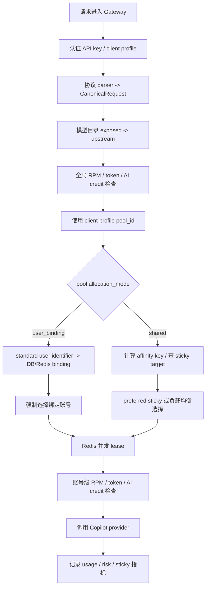

# Routing 规则

本文是 Gateway 路由的唯一主文档，覆盖固定 Client-Pool 归属、pool 分配模式、sticky、负载均衡、并发、risk score 和 sticky 指标。协议字段如何解析、转换、丢弃或透传见 [protocol.zh.md](protocol.zh.md)。

## 目录

- [执行顺序](#执行顺序)
- [固定 Pool 归属](#固定-pool-归属)
- [Pool 分配模式](#pool-分配模式)
- [候选账号过滤](#候选账号过滤)
- [负载均衡策略](#负载均衡策略)
- [Sticky 亲和](#sticky-亲和)
- [Sticky Overflow 与并发](#sticky-overflow-与并发)
- [Risk Score 与账号状态](#risk-score-与账号状态)
- [预算与限流](#预算与限流)
- [指标](#指标)
- [调优建议](#调优建议)

## 执行顺序


```mermaid
flowchart TD
  A["请求进入 Gateway"] --> B["认证 API key / client profile"]
  B --> C["协议 parser -> CanonicalRequest"]
  C --> D["模型目录 exposed -> upstream"]
  D --> E["全局 RPM / token / AI credit 检查"]
  E --> F["使用 client profile pool_id"]
  F --> G{"pool allocation_mode"}
  G -->|"user_binding"| H["standard user identifier -> DB/Redis binding"]
  G -->|"shared"| I["计算 affinity key / 查 sticky target"]
  H --> J["强制选择绑定账号"]
  I --> K["preferred sticky 或负载均衡选择"]
  J --> L["Redis 并发 lease"]
  K --> L
  L --> M["账号级 RPM / token / AI credit 检查"]
  M --> N["调用 Copilot provider"]
  N --> O["记录 usage / risk / sticky 指标"]
```

路由热路径使用内存快照，数据来源于 PostgreSQL。Gateway 启动时加载一次 pool、pool account 和 active account bindings，之后每 30 秒刷新。Redis 用于 sticky map、account-binding 热缓存、并发 lease 和分布式热状态。

## 固定 Pool 归属

路由只有一条确定的归属链：

```text
API key -> enabled client profile -> 一个具体 pool -> 一个可用账号
```

规则：

1. 每个 client profile 必须有 `pool_id`。API key 只有解析到 enabled profile 和具体 pool 后才能路由。
2. 指定 pool 必须存在且 active。pool 缺失、disabled 或容量耗尽时 fail closed；Gateway 不会回退到其它 pool。
3. 协议和模型目录只负责请求格式与模型映射，不参与选 pool。同一 Client 的 Chat Completions、Responses 和 Anthropic Messages 请求始终进入同一个 pool。
4. 每个账号只能属于零个或一个 pool，PostgreSQL 使用账号 membership 唯一约束保证这一点。
5. 移动账号必须调用带 `expected_pool_id` 的 batch assignment API。移动在一个事务中完成；stale membership 会回滚整批操作；active user/session binding 会阻止移动，必须先 Release。
6. `RouteContext` 只携带已分配的 `pool_id` 和解析后的 model；Router 只在这个 pool 内选账号。

## Pool 分配模式

Pool 有三种分配模式。

| `allocation_mode` | 行为 |
| --- | --- |
| `shared` | 多用户共享池内账号；sticky 是偏好，负载和健康可以触发 rebind |
| `user_binding` | 按标准请求 `user_id` 把用户绑定到一个账号；绑定 active 期间账号独占 |
| `session_binding` | 按标准请求 `session_id` 把会话绑定到一个账号；绑定 active 期间账号独占 |

### Binding Pool

`user_binding` 和 `session_binding` pool 的绑定关系以 PostgreSQL 为事实源，Redis 只做热缓存。绑定 key 分别是：

```text
user_binding: client_profile_id + pool_id + lower(trim(user_id))
session_binding: client_profile_id + pool_id + lower(trim(session_id))
```

规则：

- `user_id` 优先读取 OpenAI Chat/Responses 的 `user` 字段、Anthropic `metadata.user_id` 或 `metadata.user`；`X-GHCP-User` 可作为 header fallback。
- `session_id` 优先读取请求 `session_id` / `session` 或 `metadata.session_id` / `metadata.session`；`X-GHCP-Session-ID` 和 `X-Claude-Code-Session-Id` 可作为 header fallback。
- 同一 `client_profile_id + pool_id + user_id/session_id` 只能有一个 active binding。
- 同一账号同一时间只能被一个 active binding 占用。
- 首次绑定只从该 pool 中选择未被 active binding 占用的账号。
- 首次绑定账号排序：低账号 `priority`、低 `risk_score`、高 pool membership `weight`、低账号 `id`。
- 每次命中会刷新 `last_used_at` 和 `expires_at`；默认 `user_binding` 7 天不用后过期，`session_binding` 5 分钟不用后过期；pool 的 `binding_ttl_seconds` 可覆盖默认值。
- 绑定池使用 pool 的 `binding_max_concurrency` 作为有效并发上限，默认值是 10，不修改账号原始 `max_concurrency`。
- 解除方式只有过期或 Dashboard pool 展开详情中的手动 `Release`。
- 绑定账号不可用、seat 不可用或达到并发上限时请求失败，不会自动换到其它账号。
- 普通 `shared` pool 会避开 active binding 占用账号。

## 候选账号过滤

普通选择和绑定账号强制选择都必须通过候选过滤。

| 检查 | 当前行为 |
| --- | --- |
| Pool 状态 | pool 必须存在且 `status` 为空或 `active` |
| Account 状态 | 只有 `active` 账号可用 |
| Seat 状态 | org/business/enterprise seat 只接受空值、`active`、`assigned` |
| Reserved 账号 | active binding 占用的账号不可被 shared pool 选择；绑定请求只允许自己的 required account |
| 进程内并发 | `current_concurrency < effective_max_concurrency`；绑定池优先使用 pool 的 `binding_max_concurrency`，否则使用账号 `max_concurrency`；非正数按 1 处理 |
| 排除列表 | sticky overflow、并发 rebind 时可临时排除旧账号 |
| 账号级模型权限 | 不检查；解析后的 model 不参与账号候选集过滤 |

候选集为空时会进入 Gateway 错误映射；对外状态码与内部路由原因的对应关系见 [operations.zh.md](operations.zh.md)。

模型目录控制 Gateway 对外暴露的模型，但不保存或校验单个账号的模型权限。同一 pool 中的账号需要具备相同的可用上游模型集合。如果把模型权限不同的账号放入同一 pool，Router 可能选中不支持请求模型的账号；Provider 调用会失败，Gateway 不会把该请求切换到另一个账号重试。模型权限不同时应拆分到不同 pool，并把 client profile 分配到兼容的 pool。上游 `403` 会被分类为 `permission_denied`，可能影响被选账号的 risk 状态。

## 负载均衡策略

`load_balance_strategy` 归 pool 所有，只在指定 pool 内的普通选择中使用。user/session binding 的首次绑定账号选择使用独立排序，不走这些策略。

| 策略 | 排序逻辑 | 适用场景 |
| --- | --- | --- |
| `risk_weighted` | 低 `risk_score`、低当前并发、高 membership `weight`、低账号 `priority` | 默认策略，健康优先 |
| `least_concurrency` | 低当前并发、高 `weight`、低 `risk_score`、低账号 `priority` | 账号质量接近，希望摊平即时负载 |
| `round_robin` | 按账号 `priority`、`id` 排序后轮询 | 测试、均匀试探、风险差异小的池 |

如果 sticky target 仍在候选集中，Router 会先选 sticky target，再考虑上述排序。因此 sticky 是候选集上的优先偏好，不是绕过过滤的安全通道。

## Sticky 亲和

Sticky map 存在 Redis：

```text
sticky:{pool_id}:{model}:{affinity_key_hash} -> account_id
```

请求成功后会写入或刷新 sticky target。Redis 同时维护 `sticky_account:{account_id}` 反向索引，便于账号禁用时删除相关 sticky key。

Sticky policy（`sticky_mode`）：

| 策略 | 行为 |
| --- | --- |
| `none` | 不生成 affinity key，不使用 sticky |
| `soft` | 默认；优先 sticky target，但允许负载过高时 overflow |
| `strict` | 尽量保持同一账号；仍不能绕过账号状态、seat 或硬并发限制 |

Affinity strategy（`affinity_strategy`）：

| 策略 | 行为 |
| --- | --- |
| `session_then_prefix` | 默认；优先使用第一个可用的 session key，没有时 fallback 到 prompt prefix hash |
| `prefix_only` | 忽略 session key，始终使用 system prompt、首个 user 上下文和 tools schema 的 hash，适合 prompt cache 亲和 |

Session key 优先级：

1. client profile 自定义 `sticky_session_header`
2. `X-Claude-Code-Session-Id`
3. `X-GHCP-Session-ID`
4. `X-Session-ID`
5. `X-Conversation-ID`
6. `X-Claude-Code-Agent-Id`
7. `X-Claude-Code-Parent-Agent-Id`
8. `X-GHCP-Workspace`
9. `X-GHCP-Project`
10. body metadata 中的 `session_id`、`conversation_id`、`user`

`session_then_prefix` 没有 session key 时会 fallback 到 prefix hash；`prefix_only` 始终使用 prefix hash 并忽略 session header。Affinity key 默认包含 client profile、协议、模型和 session/prefix 材料，只保存 hash，不保存 prompt 明文。为了兼容旧 API，历史值 `sticky_mode=prefix` 会归一化为 `sticky_mode=soft` 与 `affinity_strategy=prefix_only`。

## Sticky Overflow 与并发

并发有两层：Router 的进程内计数用于快速过滤和排序；Redis lease 是多 gateway 实例下的硬门槛。Redis 可用时，Gateway 会在选中账号后写入 `concurrency_leases:{account_id}` 租约；写入失败表示账号已达到跨实例并发上限。

Soft sticky 下，如果 sticky target 可用，Gateway 会检查“当前请求进入前已有并发”的负载比例：

```text
load_ratio = existing_concurrency_before_this_request / max_concurrency
```

当 `load_ratio > max_sticky_load_ratio` 且存在替代账号时，Gateway 会释放旧账号并 overflow 到其它候选账号。默认 `max_sticky_load_ratio` 是 `0.85`。`strict` 模式只跳过这个比例型 overflow，不会突破 `max_concurrency`。

如果 required user/session binding 账号达到有效并发上限，请求直接失败；不会 rebind。

## Risk Score 与账号状态

Risk score 是账号级健康分，数值越高风险越高。候选过滤只接受 `active` 账号，因此进入 `degraded`、`quarantined`、`revoked` 后都不会再接请求。

默认失败增量：

| 事件 | 分值变化 |
| --- | --- |
| `auth_expired` / 上游 401 | `+20` |
| `permission_denied` / 上游 403 | `+20` |
| `rate_limited` / 上游 429 | `+10` |
| `upstream_5xx` | `+5` |
| `network_error` / `network_timeout` | `+3` |
| 其它失败 | `+5` |
| 成功请求或探针成功 | `-1`，最低到 0 |

状态阈值：

| 条件 | 目标状态 | 路由影响 |
| --- | --- | --- |
| `risk_score >= 70` | `degraded` | 不再进入候选集 |
| `risk_score >= 90` | `quarantined` | 不再进入候选集，等待恢复或人工处理 |
| 恢复成功 | `active` 且 risk 重置 | 重新进入候选集 |

当前状态机支持 `active -> degraded` 和 `degraded -> quarantined`，不支持 `active -> quarantined` 直跳。调大单次失败分值时，要同时考虑阈值间距或更新状态机。

## 预算与限流

Gateway 在路由前检查全局 RPM、全局 daily tokens 和全局 daily AI credits；选中账号后再检查账号级 RPM、tokens 和 AI credits。预算不通过时请求返回 429 或预算错误，不会继续尝试其它账号。

Daily token 和 AI Credits 预算默认关闭。可在 Dashboard Config 页配置，或将 `BUDGET_MAX_DAILY_TOKENS_PER_ACCOUNT`、`BUDGET_MAX_DAILY_TOKENS_GLOBAL`、`BUDGET_MAX_DAILY_NANO_AIU_PER_ACCOUNT`、`BUDGET_MAX_DAILY_NANO_AIU_GLOBAL` 设置为大于 `0` 的值启用对应上限。RPM 保护默认开启：`BUDGET_MAX_RPM_PER_ACCOUNT=60`，100 账号聚合上限为 `BUDGET_MAX_RPM_GLOBAL=6000`；任一值设为 `0` 可关闭对应 RPM 检查。RPM 使用 Redis 原子滑动窗口；窗口满时直接返回 429，不在 Gateway 内等待，被该窗口拒绝的尝试不会继续占用该窗口额度。Gateway 会周期性刷新 Dashboard 保存的预算设置，环境变量只是启动默认值；数据库中已保存的值仍优先。

Router 本身不读取预算账本；它只处理指定 pool、账号状态、seat、reserved 和并发。

## 指标

基础请求、token 和账号指标始终可用。Sticky 细化指标仅在 `advanced_metrics_enabled=true` 时上报。

| 指标 | 含义 | 关键 label |
| --- | --- | --- |
| `ghcp_sticky_hits_total` | 成功复用 sticky target | `model`、`pool` |
| `ghcp_sticky_rebinds_total` | sticky target 缺失、不可用、已满或需要迁移 | `model`、`pool` |
| `ghcp_sticky_overflows_total` | sticky target 因负载比例过高分流 | `model`、`pool` |

## 调优建议

- 长会话 coding 客户端优先使用 `soft` sticky + 稳定 session ID；账号容量很小或必须极强亲和时再考虑 `strict`。
- 批处理或短请求适合 `soft + risk_weighted`，让健康和低并发优先。
- 需要按用户独占账号时使用 `user_binding` pool，并确保 `user_id` 稳定且低基数；需要短会话独占时使用 `session_binding` pool，并确保 `session_id` 能随会话稳定传入。
- 小池不要把 risk 阈值调得过低，否则短暂错误可能耗尽所有账号。
- 观察 `no_available_accounts`、sticky hit/rebind/overflow、429、401/403、账号状态变化和成功率后再调策略。