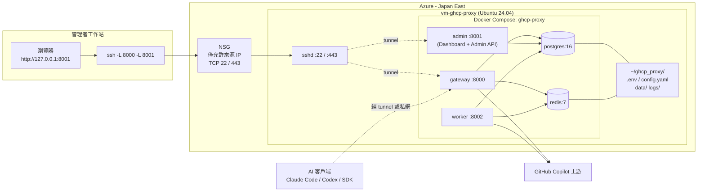
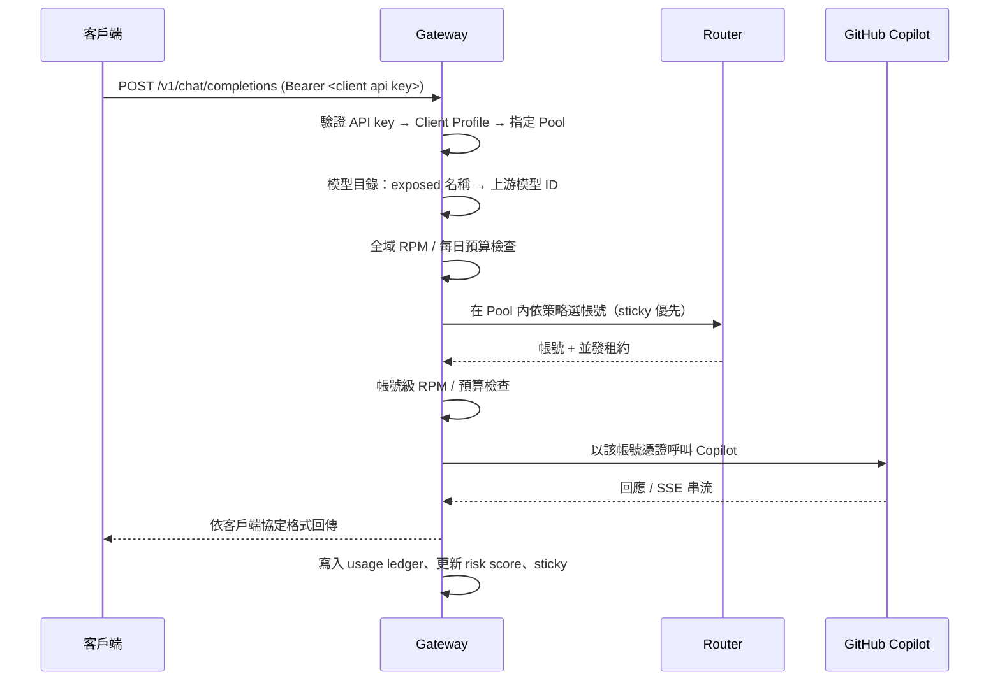
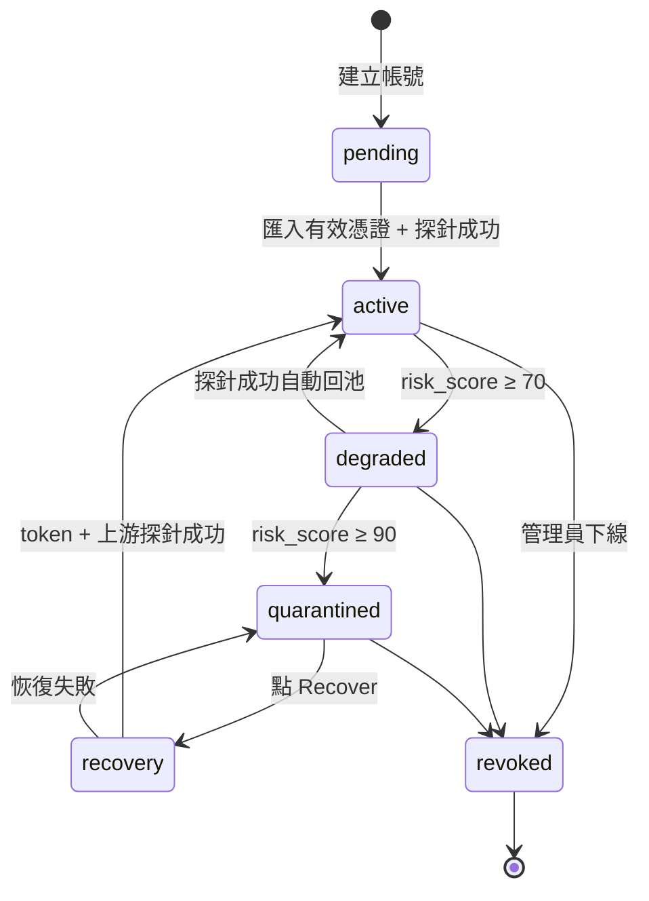

# GHCP Pool Proxy — Azure VM 部署與操作手冊（繁體中文）

本手冊說明如何在 Azure 上以單台 Linux VM + Docker Compose 的方式部署與維運 GHCP Pool Proxy，內容涵蓋：方案介紹、Azure 資源建置、服務部署、Dashboard 日常操作、客戶端接入、監控排障與安全建議。所有指令皆以本次實際部署（Japan East、`rg-ghcp-pool-proxy`、`vm-ghcp-proxy`）為例，讀者可依自身環境替換名稱。

> 適用對象：負責維運 GHCP Pool Proxy 的系統管理員、平台工程師。
> 前置知識：基本 Linux / SSH / Docker 操作、Azure Portal 或 Azure CLI 使用經驗。

---

## 目錄

1. [方案介紹](#1-方案介紹)
2. [架構與元件](#2-架構與元件)
3. [部署前準備](#3-部署前準備)
4. [建立 Azure 資源](#4-建立-azure-資源)
5. [在 VM 上部署服務](#5-在-vm-上部署服務)
6. [連線到 Dashboard](#6-連線到-dashboard)
7. [Dashboard 操作指南](#7-dashboard-操作指南)
8. [客戶端接入](#8-客戶端接入)
9. [日常維運](#9-日常維運)
10. [監控與告警](#10-監控與告警)
11. [常見問題排除](#11-常見問題排除)
12. [安全強化建議](#12-安全強化建議)
13. [升級、備份與回滾](#13-升級備份與回滾)
14. [附錄](#14-附錄)

---

## 1. 方案介紹

### 1.1 什麼是 GHCP Pool Proxy

GHCP Pool Proxy 是一個 **GitHub Copilot 帳號池代理網關**。它把多個 GitHub Copilot 帳號集中管理成「帳號池（Pool）」，對外提供與 **OpenAI / Anthropic 相容的 API**，讓 Claude Code、Codex、Cursor、各種 SDK 等客戶端不需知道背後使用哪個 Copilot 帳號，即可透過統一入口存取模型。

核心價值：

| 能力 | 說明 |
| --- | --- |
| **協定相容** | 支援 OpenAI Chat Completions (`/v1/chat/completions`)、OpenAI Responses (`/v1/responses`)、Anthropic Messages (`/v1/messages`) 與模型列表 (`/v1/models`) |
| **帳號池與路由** | 依健康度、風險分數、並發、權重自動選擇帳號；支援 sticky 親和、user/session 綁定 |
| **健康管理** | 自動探測帳號 token 與上游可用性；失敗帳號自動降級、隔離、恢復 |
| **預算與限流** | 全域 / 帳號級 RPM、每日 token、AI Credits 上限 |
| **可觀測性** | 用量帳本、費用估算、cache 命中率、Prometheus 指標、審計事件 |
| **控制面 Dashboard** | Web UI 管理帳號、Pool、Client、模型目錄、設定與事件 |

### 1.2 為什麼選擇 Azure VM 部署

本 repo 提供三種部署形態：

| 形態 | 適用情境 | 資料庫 |
| --- | --- | --- |
| **Linux VM + Docker Compose**（本手冊） | 單機、快速上線、中小規模（≤100 帳號） | 容器內 PostgreSQL / Redis，資料持久化在 VM 磁碟 |
| Kind 單節點 Kubernetes | 本機開發測試 | 叢集內拋棄式 PostgreSQL / Redis |
| AKS + Azure PostgreSQL + Managed Redis | 生產多副本、高可用 | Azure PaaS |

VM 形態的優點是**部署最簡單、成本最低、排障最直接**；所有狀態都在 `~/ghcp_proxy` 目錄下，備份與搬遷容易。缺點是單點、無自動擴縮，適合團隊內部使用或作為 PoC / 中小型生產。

### 1.3 本次部署摘要

| 項目 | 值 |
| --- | --- |
| 租戶 / 訂閱 | MTG Lab / Azure subscription 1 (`6ff8a07e-d9f6-4c7a-9e02-198ebc6930e4`) |
| 區域 | Japan East（東京） |
| 資源群組 | `rg-ghcp-pool-proxy` |
| VM 名稱 | `vm-ghcp-proxy` |
| 作業系統 | Ubuntu 24.04 LTS |
| 規格 | Standard_D2s_v5（2 vCPU / 8 GiB） |
| OS 磁碟 | 64 GB Premium SSD |
| 公有 IP | `20.191.191.173`（靜態） |
| 管理者帳號 | `azureuser` |
| SSH 金鑰 | 工作站 `~/.ssh/ghcp-proxy`（ed25519） |
| SSH 連接埠 | 22 與 443（因辦公網路封鎖出站 22） |
| NSG 規則 | 只允許指定來源 IP 存取 22 / 443 |
| 應用資料目錄 | VM 上 `/home/azureuser/ghcp_proxy` |
| 程式碼目錄 | VM 上 `/home/azureuser/ghcp-pool-proxy` |
| Gateway | `127.0.0.1:8000`（僅 VM 本機） |
| Admin / Dashboard | `127.0.0.1:8001`（僅 VM 本機） |

---

## 2. 架構與元件

### 2.1 整體架構



### 2.2 五個容器的職責

| 容器 | 映像 | 職責 |
| --- | --- | --- |
| `ghcp-proxy-gateway-1` | `pczhao1210/ghcp-pool-proxy:gateway-latest` | 對外 API 入口（8000）。協定解析、認證、路由選帳號、預算檢查、轉發到 Copilot、串流回傳、記錄用量 |
| `ghcp-proxy-admin-1` | `pczhao1210/ghcp-pool-proxy:admin-latest` | 控制面（8001）。提供 Dashboard 靜態頁面與 `/admin/*` API：帳號、憑證、Pool、Client、設定、模型目錄、審計 |
| `ghcp-proxy-worker-1` | `pczhao1210/ghcp-pool-proxy:worker-latest` | 背景任務。健康探針、帳號恢復、憑證到期提醒、用量 rollup、資料保留清理、能力同步 |
| `ghcp-proxy-postgres-1` | `postgres:16-alpine` | 事實來源。帳號、憑證（加密）、Pool、Client、預算、審計、用量帳本、系統設定 |
| `ghcp-proxy-redis-1` | `redis:7-alpine` | 熱狀態。並發租約、sticky 親和、限流滑動視窗、分散式鎖、快取失效事件 |

另有一個一次性 `migration` 容器（`migration-latest`），每次 `start` 時執行資料庫 schema 遷移後退出。

### 2.3 請求流程



### 2.4 資料目錄佈局（VM）

```
/home/azureuser/
├── ghcp-pool-proxy/            # 程式碼（runtime release）
│   ├── deploy/deploy.sh        # VM 部署主腳本
│   ├── deploy/docker-compose.vm.yml
│   ├── migrations/             # 資料庫遷移 SQL
│   ├── release-manifest.env    # 固定映像 digest
│   └── docs/                   # 文件
└── ghcp_proxy/                 # 持久化資料（千萬不要刪）
    ├── .env                    # 密鑰、連接埠、路徑（0600）
    ├── config.yaml             # 應用啟動設定（0644）
    ├── data/postgres/          # PostgreSQL 資料
    ├── data/redis/             # Redis AOF
    ├── logs/                   # 每小時一檔，保留 30 天
    └── run/                    # 執行期暫存
```

---

## 3. 部署前準備

### 3.1 工作站工具

| 工具 | 用途 | 安裝 |
| --- | --- | --- |
| Azure CLI ≥ 2.60 | 建立與管理 Azure 資源 | `winget install Microsoft.AzureCLI` 或 <https://aka.ms/installazurecli> |
| OpenSSH 客戶端 | SSH 連線與通道 | Windows 10/11 內建；`ssh -V` 確認 |
| Git（選用） | 取得 repo | `winget install Git.Git` |

### 3.2 Azure 權限

登入帳號需對目標訂閱擁有 **Contributor**（或更高）角色，才能建立資源群組、VM、網路資源。

### 3.3 網路需求

| 方向 | 需求 |
| --- | --- |
| 工作站 → VM | TCP 22 或 443（SSH）。若辦公網路封鎖出站 22，請使用 443 |
| VM → 網際網路 | Docker Hub（拉映像）、`github.com` / `api.github.com`（Copilot 認證與模型 API）、Ubuntu apt 源 |

> **注意：** 若工作站經由代理或 Zscaler 類服務上網，實際出口 IP 可能不只一個。用 `curl https://api.ipify.org` 與 `curl https://ifconfig.me` 兩個服務分別確認，NSG 要全部放行。

### 3.4 準備 SSH 金鑰

```powershell
ssh-keygen -t ed25519 -f $HOME\.ssh\ghcp-proxy -N '""' -C "ghcp-proxy"
```

會產生 `~/.ssh/ghcp-proxy`（私鑰，請妥善保管）與 `~/.ssh/ghcp-proxy.pub`（公鑰，寫入 VM）。

---

## 4. 建立 Azure 資源

### 4.1 登入並選擇訂閱

```powershell
az login                                  # 瀏覽器互動登入（需 MFA）
az account list -o table                  # 列出可用訂閱
az account set --subscription 6ff8a07e-d9f6-4c7a-9e02-198ebc6930e4
az account show -o table                  # 確認目前訂閱
```

> 若無法彈出瀏覽器，改用 `az login --use-device-code`，在任何裝置開 <https://login.microsoft.com/device> 輸入代碼。
> 若租戶強制 MFA 且已存在舊 token，`az logout` 後再 `az login`。

### 4.2 建立資源群組

```powershell
az group create -n rg-ghcp-pool-proxy -l japaneast
```

### 4.3 確認 VM 規格可用

```powershell
az vm list-skus -l japaneast --size Standard_D2s_v5 --query "[0].{name:name,restr:restrictions[0].reasonCode}" -o json
```

`restr` 為 `null` 表示無限制。

### 4.4 建立 VM

```powershell
az vm create `
  -g rg-ghcp-pool-proxy -n vm-ghcp-proxy -l japaneast `
  --image Ubuntu2404 --size Standard_D2s_v5 `
  --admin-username azureuser --ssh-key-values $HOME\.ssh\ghcp-proxy.pub `
  --os-disk-size-gb 64 --storage-sku Premium_LRS `
  --public-ip-sku Standard --public-ip-address-allocation static `
  --nsg-rule NONE
```

參數說明：

| 參數 | 說明 |
| --- | --- |
| `--nsg-rule NONE` | 不自動開任何入站規則，稍後手動加上受限來源的 SSH 規則 |
| `--public-ip-address-allocation static` | 固定公有 IP，重開機不變 |
| `--storage-sku Premium_LRS` | Premium SSD，PostgreSQL 寫入延遲較穩定 |

輸出中的 `publicIpAddress` 即為連線位址。

### 4.5 設定 NSG（只允許自己的 IP）

```powershell
$myip = (Invoke-RestMethod https://api.ipify.org).Trim()
az network nsg rule create -g rg-ghcp-pool-proxy --nsg-name vm-ghcp-proxyNSG `
  -n AllowSSHFromMyIP --priority 100 --direction Inbound --access Allow --protocol Tcp `
  --source-address-prefixes "$myip/32" --destination-port-ranges 22
```

若之後 IP 改變，更新規則：

```powershell
az network nsg rule update -g rg-ghcp-pool-proxy --nsg-name vm-ghcp-proxyNSG `
  -n AllowSSHFromMyIP --source-address-prefixes 1.2.3.4/32 5.6.7.8/32
```

### 4.6（選用）讓 sshd 同時監聽 443

當辦公網路封鎖出站 22 時使用。Ubuntu 24.04 的 sshd 由 systemd socket 啟動，需覆寫 socket 設定：

```powershell
az vm run-command invoke -g rg-ghcp-pool-proxy -n vm-ghcp-proxy --command-id RunShellScript --scripts @"
mkdir -p /etc/systemd/system/ssh.socket.d
printf '[Socket]\nListenStream=\nListenStream=0.0.0.0:22\nListenStream=0.0.0.0:443\n' > /etc/systemd/system/ssh.socket.d/ports.conf
systemctl daemon-reload && systemctl restart ssh.socket
ss -ltnp | grep -E ':(22|443) '
"@ --query "value[0].message" -o tsv

az network nsg rule create -g rg-ghcp-pool-proxy --nsg-name vm-ghcp-proxyNSG `
  -n AllowSSH443FromMyIP --priority 110 --direction Inbound --access Allow --protocol Tcp `
  --source-address-prefixes "$myip/32" --destination-port-ranges 443
```

> `az vm run-command` 透過 Azure 管理平面在 VM 內以 root 執行指令，不需要 SSH 通道，是 SSH 不通時的救援手段。

### 4.7 驗證連線

```powershell
Test-NetConnection 20.191.191.173 -Port 443
ssh -i $HOME\.ssh\ghcp-proxy -p 443 azureuser@20.191.191.173 "uname -a; nproc; free -h"
```

---

## 5. 在 VM 上部署服務

### 5.1 允許 azureuser 無密碼 sudo

`deploy.sh` 需要 sudo 安裝 Docker。Azure Ubuntu 映像的 cloud-init 已建立 `/etc/sudoers.d/90-cloud-init-users` 給 azureuser NOPASSWD，但**在非互動 shell（如 run-command、nohup）中 `sudo -v` 仍可能要求終端**。若遇到 `sudo: a terminal is required`，加上 `!authenticate`：

```bash
sudo tee /etc/sudoers.d/91-azureuser <<'EOF'
Defaults:azureuser !authenticate
azureuser ALL=(ALL) NOPASSWD:ALL
EOF
sudo chmod 440 /etc/sudoers.d/91-azureuser
sudo visudo -c -f /etc/sudoers.d/91-azureuser
```

### 5.2 取得程式碼

```bash
cd ~
git clone https://github.com/pczhao1210/ghcp-pool-proxy.git
cd ghcp-pool-proxy
chmod +x deploy/deploy.sh
```

> 若要鎖定特定版本，`git checkout <tag 或 commit>`。`release-manifest.env` 內的映像 digest 決定實際執行的版本，與 git commit 綁定。

### 5.3（建議）先產生設定檔並檢視

```bash
deploy/deploy.sh generate-config
cat ~/ghcp_proxy/config.yaml
```

`config.yaml` 為**非敏感啟動設定**（超時、連線池、探針頻率、GitHub OAuth 端點等）。首次部署使用預設值即可。修改後需要 `deploy/deploy.sh start` 重啟才生效。

> **已知問題與修正：** 舊版 `generate-config` 把 `github.opencode_device_flow_enabled` 與 `health.enabled` 寫成帶引號字串 `"false"` / `"true"`，gateway 載入時報 `cannot unmarshal !!str into bool` 並導致 `start` 失敗（`ERROR: invalid application config`）。本 repo 已修正為輸出無引號布林值。若使用舊版腳本產生過檔案，手動改為 `false` / `true`（不加引號）即可。

### 5.4 啟動

```bash
deploy/deploy.sh start --install-missing
```

`--install-missing` 允許腳本非互動地安裝 Docker Engine / Compose / curl 等缺失元件。啟動流程：

1. 偵測 x86_64 Linux 與發行版，安裝 Docker，把 azureuser 加入 docker 群組
2. 建立 `~/ghcp_proxy/{.env,config.yaml,data,logs}`；`.env` 內自動產生 `POSTGRES_PASSWORD`、`ADMIN_TOKEN`、`CREDENTIAL_MASTER_KEY`
3. 驗證 `release-manifest.env` 與 `migrations/` schema 版本一致
4. 以 digest 拉取 gateway / admin / worker / migration 映像與 postgres / redis
5. 啟動 PostgreSQL、Redis 並等待健康
6. 執行 migration 容器套用 schema
7. 啟動 gateway、admin、worker
8. 等待 `/healthz`、`/readyz`、Dashboard、worker 健康全部通過
9. 啟動每小時日誌收集器

成功時輸出：

```
VM stack is ready.
  Gateway:       http://localhost:8000
  Admin UI:      http://localhost:8001/
  Provider:      copilot
  Host data dir: /home/azureuser/ghcp_proxy
  ...
```

### 5.5 驗證

```bash
docker ps --format 'table {{.Names}}\t{{.Status}}'
curl -s localhost:8000/healthz          # ok
curl -s localhost:8000/readyz           # ok
curl -s localhost:8000/version          # {"version":"...","build_time":"..."}
curl -s -o /dev/null -w '%{http_code}\n' localhost:8001/   # 200
```

預期五個容器皆 `Up`，postgres / redis / worker 顯示 `(healthy)`。

### 5.6 取得 Admin Token

```bash
grep ADMIN_TOKEN ~/ghcp_proxy/.env
```

這是登入 Dashboard 與呼叫 `/admin/*` API 的唯一憑證，**請視為最高權限密鑰保管**。

---

## 6. 連線到 Dashboard

Gateway（8000）與 Admin（8001）預設**只綁定 VM 的 127.0.0.1**，不對網際網路開放。這是刻意的安全設計：Admin Token 若在明文 HTTP 上外洩，等同整套帳號池被接管。

### 6.1 建立 SSH 通道（每次使用前）

在工作站 PowerShell 或命令提示字元執行（保持該視窗開啟）：

```powershell
ssh -i $HOME\.ssh\ghcp-proxy -p 443 -N `
  -L 8000:127.0.0.1:8000 `
  -L 8001:127.0.0.1:8001 `
  azureuser@20.191.191.173
```

| 參數 | 說明 |
| --- | --- |
| `-p 443` | 使用 443 連接埠（若網路允許 22 可省略） |
| `-N` | 不開遠端 shell，只做轉發 |
| `-L 8001:127.0.0.1:8001` | 把工作站的 8001 轉到 VM 內的 8001 |

第一次連線會詢問是否信任主機指紋，輸入 `yes`。連上後視窗停住不動是正常的。

### 6.2 開啟 Dashboard

瀏覽器開 <http://127.0.0.1:8001/>，在登入畫面貼上 Admin Token。

### 6.3（選用）將通道做成一鍵腳本

儲存為 `ghcp-tunnel.ps1`：

```powershell
Write-Host "GHCP Pool Proxy tunnel: Dashboard http://127.0.0.1:8001  Gateway http://127.0.0.1:8000"
ssh -i $HOME\.ssh\ghcp-proxy -p 443 -N -o ServerAliveInterval=30 -o ExitOnForwardFailure=yes `
  -L 8000:127.0.0.1:8000 -L 8001:127.0.0.1:8001 azureuser@20.191.191.173
```

`ServerAliveInterval=30` 可避免閒置被中斷。

---

## 7. Dashboard 操作指南

Dashboard 是全部日常操作的主要介面。以下按上線順序說明每個頁面。

### 7.1 Overview（總覽）

登入後的首頁，顯示：帳號狀態分佈（active / degraded / quarantined 等）、Pool 數量、近期請求量、成功率、錯誤趨勢、用量與費用估算。**每日巡檢先看這裡**。

### 7.2 Accounts（帳號）— 匯入 Copilot 帳號

這是整個方案的基礎：沒有 active 帳號，任何請求都無法路由。

#### 7.2.1 帳號生命週期



| 狀態 | 意義 | 是否接請求 |
| --- | --- | --- |
| `pending` | 剛建立，尚無憑證 | ✗ |
| `active` | 憑證有效、探針通過 | ✓ |
| `degraded` | 近期失敗較多，風險升高 | ✗（等待自動回池） |
| `recovery` | 恢復任務執行中 | ✗ |
| `quarantined` | 風險過高或恢復失敗，需人工處理 | ✗ |
| `revoked` | 永久下線 | ✗ |

#### 7.2.2 新增帳號（Device Flow，推薦）

1. **Accounts → New Account**，輸入顯示名稱（例如 `copilot-user-01`）、可選 `max_concurrency`（預設 6）與 `priority`。
2. 在帳號列點 **Login / Device Flow → VS Code**。
3. Dashboard 顯示一組 **user code** 與 GitHub 網址（`https://github.com/login/device`）。
4. 用該 Copilot 帳號的擁有者身份在瀏覽器開該網址、輸入 code、授權。
5. 回到 Dashboard 點 **Complete**。若顯示 `authorization_pending` 代表尚未授權完成，稍後再點；`expired_token` 則重新開始。
6. 成功後 Admin 會把 GitHub OAuth token 兌換成 Copilot bearer 並**加密**存入 PostgreSQL（明文不落庫）。
7. Worker 在數秒至一分鐘內執行首次探針；通過後狀態變 `active`。

> **VS Code vs OpenCode profile：** 預設只啟用 VS Code 身份。OpenCode 身份需在 `config.yaml` 設 `github.opencode_device_flow_enabled: true` 並重啟。兩者只影響上游憑證形式，與客戶端使用的協定無關。

#### 7.2.3 手動匯入憑證

若已有 GitHub OAuth token，可在帳號的 **Import Credential** 貼上。系統同樣加密保存。

#### 7.2.4 帳號操作

| 操作 | 用途 |
| --- | --- |
| **Recover** | 對 `quarantined` 帳號建立恢復任務；Worker 驗證 token 並做最小化上游探針，成功則回 `active` 並重置 risk |
| **Quarantine** | 手動暫停該帳號路由（暫時下線） |
| **Revoke** | 永久下線，不再自動恢復 |
| **Delete** | 級聯刪除憑證、Pool 關係與 sticky 記錄 |
| **Model Capabilities / Refresh** | 查看或重新探測該帳號對各模型的可用性證據（`fresh` / `stale` / `unknown` / `mismatch`） |

#### 7.2.5 帳號欄位建議

| 欄位 | 預設 | 建議 |
| --- | --- | --- |
| `max_concurrency` | 6 | 交互式編程用預設即可；批次負載可調低避免單帳號被限流 |
| `priority` | 0 | 數字越小越優先；可讓主力帳號優先、備援帳號墊後 |

### 7.3 Pools（帳號池）

Pool 是路由的基本單位。**每個 Client 必須綁定一個 Pool；每個帳號最多屬於一個 Pool。**

#### 7.3.1 建立 Pool

**Pools → New Pool**，設定：

| 欄位 | 選項 | 說明 |
| --- | --- | --- |
| `name` | — | 例如 `team-a-shared` |
| `allocation_mode` | `shared` | 多人共享，sticky 為偏好，可 overflow。**一般情境選這個** |
|  | `user_binding` | 依請求 `user` 把每個使用者固定綁一個帳號，綁定期間該帳號獨佔。適合需要「一人一帳號」審計 |
|  | `session_binding` | 依 `session_id` 綁定，5 分鐘無使用自動釋放。適合短會話獨佔 |
| `load_balance_strategy` | `risk_weighted` | 預設。低風險、低並發優先 |
|  | `least_concurrency` | 帳號品質相近時攤平負載 |
|  | `round_robin` | 均勻輪詢，測試用 |
| `binding_max_concurrency` | 10 | 僅 binding 模式有效 |
| `binding_ttl_seconds` | user 7 天 / session 5 分鐘 | 覆寫預設過期 |
| `status` | `active` | 設為非 active 時 Pool 內帳號不再接請求 |

#### 7.3.2 加入帳號

在 Pool 詳情頁 **Assign Accounts**，勾選帳號並設定：

- `weight`：權重，越高越常被選（在同等風險與並發下）
- 移動帳號到別的 Pool 時，若該帳號有 active binding 需先 **Release**

#### 7.3.3 查看綁定

binding 模式的 Pool 展開後可見目前 user/session → account 對應與到期時間，可手動 **Release**。

### 7.4 Clients（客戶端 Profile）— 發放 API Key

Client Profile 決定「誰能呼叫 Gateway、用哪個 Pool、有什麼限制」。

**Clients → New Client**：

| 欄位 | 說明 |
| --- | --- |
| `name` | 例如 `claude-code-team-a` |
| `pool_id` | **必填**，該 Client 所有請求只在此 Pool 內路由 |
| `enabled` | 停用即立刻拒絕該 key |
| `sticky_mode` | `soft`（預設）/ `strict` / `none` |
| `affinity_strategy` | `session_then_prefix`（預設）/ `prefix_only` |
| `sticky_session_header` | 自訂 session header 名稱（選用） |
| `max_sticky_load_ratio` | 預設 0.85；sticky 目標負載超過此比例時 overflow |
| `model_entitlement_policy` | `allow_unknown`（預設，相容）/ `require_fresh`（只路由到有新鮮模型證據的帳號） |

建立後系統產生一組 **API Key**，**只顯示一次**，請立即複製交付給使用者。之後可 **Rotate** 產生新 key（舊 key 立即失效）。

> 建議每個團隊 / 用途一個 Client，方便在 Usage 頁按 Client 分帳與停用。

### 7.5 Models（模型目錄）

模型目錄是**全域**設定，決定 `GET /v1/models` 回傳什麼、客戶端可請求哪些模型名稱、對應到 Copilot 的哪個上游模型與 API。

#### 7.5.1 從 Copilot 重新整理

**Models → Refresh from Copilot**：用任一 active 帳號查詢 Copilot `/models`，匯入模型 ID、顯示名稱、vendor、token limits（context window、max prompt、max output）。

#### 7.5.2 欄位

| 欄位 | 說明 |
| --- | --- |
| `exposed` | 客戶端看到的名稱（可自訂別名，如 `claude-sonnet`） |
| `upstream` | 實際送到 Copilot 的模型 ID（如 `claude-sonnet-4-20250514`） |
| `upstream_api` | `chat_completions` / `responses` / `anthropic_messages`；留空由 vendor 推斷（OpenAI→responses、Anthropic→anthropic_messages） |
| `enabled` | 是否對外暴露 |
| limits | 唯讀展示，不影響路由 |

#### 7.5.3 常見操作

- **隱藏模型**：`enabled=false`，客戶端請求會得到 `400 invalid_model`
- **別名**：新增一列 `exposed=gpt-4o`、`upstream=gpt-4o-2024-11-20`
- **回退協定**：某 Anthropic 模型在 Messages 有相容問題時，將 `upstream_api` 改為 `chat_completions`

儲存時伺服器嚴格校驗：重複 exposed、空 ID、未知欄位、非法 API 都會被拒絕。

### 7.6 Config / Settings（設定）

可**熱更新**（不需重啟）的設定，存在 PostgreSQL：

| 分類 | 項目 | 預設 | 說明 |
| --- | --- | --- | --- |
| **限流** | `budget_max_rpm_per_account` | 60 | 單帳號每分鐘請求數；0 關閉 |
|  | `budget_max_rpm_global` | 6000 | 全域每分鐘請求數；0 關閉 |
| **每日預算** | `budget_max_daily_tokens_per_account` / `_global` | 0（關閉） | >0 啟用 |
|  | `budget_max_daily_nano_aiu_per_account` / `_global` | 0（關閉） | AI Credits 上限 |
|  | `budget_max_reservation_input_tokens` / `_output_tokens` | — | 啟用每日預算後的單請求保留上界；輸出上界須 ≥ 客戶端最大 `max_tokens` |
| **相容開關** | `copilot_compat_anthropic_beta_enabled` 等四項 | true | 已審查的 Copilot 相容規則，建議保持開啟 |
| **功能** | `advanced_metrics_enabled` | false | 開啟 sticky 細化指標 |
|  | `copilot_metrics_sync_enabled` | false | GitHub Org Copilot Metrics 定時同步（需 `ORG_SYNC_ENABLED=true` 與 `GITHUB_TOKEN_FILE`） |
| **保留** | raw / hourly / daily retention | 7 天 / 90 天 / 13 月 | 用量帳本分區保留；縮短會永久刪除舊分區 |
| **其他** | Gateway Public URL | — | Dashboard 顯示用 |

> **重要：** 環境變數與 YAML 只是啟動 fallback；Dashboard 儲存過的值優先。若曾在 Dashboard 存過 `budget_max_rpm_global=600`，即使升級到新版預設 6000 也不會自動改變。

### 7.7 Usage（用量與費用）

- 按時間 / Client / 模型 / 帳號檢視請求數、輸入輸出 token、cache 命中、估算費用
- 用於分帳、容量規劃、找出異常客戶端
- 資料來源為 `usage_ledger`（raw 保留 7 天）與 hourly / daily rollup

### 7.8 Events（審計事件）

- 預設 **Changes** 視圖：帳號狀態變更、設定修改、Pool / Client 異動、恢復任務結果等
- **All events** 含例行通知（憑證即將到期、自動回池啟動）
- 每個事件含操作者、時間、目標與前後值；排障與稽核的第一站

### 7.9 GitHub Orgs（選用）

啟用 `ORG_SYNC_ENABLED=true` 後可同步 GitHub 組織的 Copilot seat 與 Metrics。需在 `.env` 設定 `GITHUB_TOKEN_FILE` 指向具備 org 讀取權限的 token 檔案。未啟用時相關 API 回 404。

---

## 8. 客戶端接入

### 8.1 網路前提

Gateway 只在 VM 本機 8000 監聽。客戶端接入方式：

| 方式 | 適用 |
| --- | --- |
| **SSH 通道**（`-L 8000:127.0.0.1:8000`） | 個人使用、少量開發者 |
| **私有反向代理 + TLS** | 團隊使用。把 `.env` 的 `GATEWAY_BIND_ADDR` 改為私網 IP，前面放 Nginx / Caddy / Azure Application Gateway 終止 TLS，NSG 只放行內網 |
| **Azure VNet / VPN / Bastion** | 企業內網整合 |

> **絕對不要**把 8000 / 8001 直接以明文暴露到公網。

### 8.2 通用 OpenAI 相容（curl）

```bash
export GHCP_BASE=http://127.0.0.1:8000
export GHCP_KEY=<Client API Key>

# 列出模型
curl -s $GHCP_BASE/v1/models -H "Authorization: Bearer $GHCP_KEY" | jq '.data[].id'

# Chat Completions
curl -s $GHCP_BASE/v1/chat/completions \
  -H "Authorization: Bearer $GHCP_KEY" -H "Content-Type: application/json" \
  -d '{"model":"gpt-4o","messages":[{"role":"user","content":"hello"}]}'

# 串流
curl -N $GHCP_BASE/v1/chat/completions \
  -H "Authorization: Bearer $GHCP_KEY" -H "Content-Type: application/json" \
  -d '{"model":"gpt-4o","stream":true,"messages":[{"role":"user","content":"hello"}]}'
```

### 8.3 Anthropic Messages 相容

```bash
curl -s $GHCP_BASE/v1/messages \
  -H "x-api-key: $GHCP_KEY" -H "anthropic-version: 2023-06-01" -H "Content-Type: application/json" \
  -d '{"model":"claude-sonnet","max_tokens":1024,"messages":[{"role":"user","content":"hello"}]}'
```

### 8.4 Claude Code

```bash
export ANTHROPIC_BASE_URL=http://127.0.0.1:8000
export ANTHROPIC_AUTH_TOKEN=<Client API Key>
export ANTHROPIC_MODEL=claude-sonnet          # 須為模型目錄中 enabled 的 exposed 名稱
claude
```

Claude Code 會自動帶 `X-Claude-Code-Session-Id`，Gateway 用它做 sticky 親和，同一對話盡量落在同一帳號以提升 prompt cache 命中。

### 8.5 OpenAI Codex CLI

```bash
export OPENAI_BASE_URL=http://127.0.0.1:8000/v1
export OPENAI_API_KEY=<Client API Key>
codex
```

Codex 使用 Responses API（`/v1/responses`），模型目錄中對應模型的 `upstream_api` 應為 `responses`。

### 8.6 OpenAI Python SDK

```python
from openai import OpenAI
client = OpenAI(base_url="http://127.0.0.1:8000/v1", api_key="<Client API Key>")
resp = client.chat.completions.create(
    model="gpt-4o",
    messages=[{"role": "user", "content": "hello"}],
    user="alice",          # user_binding Pool 需要此欄位
)
print(resp.choices[0].message.content)
```

Anthropic SDK 同理，只需覆寫 `base_url`：

```python
from anthropic import Anthropic
client = Anthropic(base_url="http://127.0.0.1:8000", api_key="<Client API Key>")
resp = client.messages.create(
    model="claude-sonnet-5", max_tokens=1024,
    metadata={"user_id": "alice"},          # user_binding Pool 需要此欄位
    messages=[{"role": "user", "content": "hello"}],
)
print("".join(b.text for b in resp.content if b.type == "text"))
```

### 8.7 程式直接呼叫（不用 SDK）

Gateway 就是一般 HTTP API，任何語言的 HTTP client 都能呼叫。要點：

1. `Authorization: Bearer <Client API Key>`（Anthropic 端點也接受 `x-api-key`）
2. `user_binding` Pool 一律帶 `X-GHCP-User` header 最省事，兩種 API 都適用
3. **模型選 API**：`gpt-*` / `gemini-*` / `grok-*` 走 `/v1/chat/completions`；**`claude-*` 走 `/v1/messages`**（原因見 8.9）
4. Anthropic 回應 `content` 是區塊陣列，只取 `type == "text"` 的區塊；`thinking` 區塊可忽略
5. 出錯時記下回應 header `X-Request-ID`，管理員可用它在 gateway log 對應到內部原因

Node.js 18+（內建 `fetch`，不需安裝套件）：

```javascript
const BASE = "http://127.0.0.1:8000", KEY = "<Client API Key>", USER = "alice";
const H = { Authorization: `Bearer ${KEY}`, "Content-Type": "application/json", "X-GHCP-User": USER };

// OpenAI 相容：gpt / gemini / grok
async function chatOpenAI(model, prompt) {
  const r = await fetch(`${BASE}/v1/chat/completions`, { method: "POST", headers: H,
    body: JSON.stringify({ model, messages: [{ role: "user", content: prompt }], max_tokens: 4096 }) });
  if (!r.ok) throw new Error(`${r.status} ${r.headers.get("x-request-id")} ${await r.text()}`);
  return (await r.json()).choices[0].message.content;
}

// Anthropic 相容：claude
async function chatClaude(model, prompt) {
  const r = await fetch(`${BASE}/v1/messages`, { method: "POST",
    headers: { ...H, "anthropic-version": "2023-06-01" },
    body: JSON.stringify({ model, messages: [{ role: "user", content: prompt }], max_tokens: 4096 }) });
  if (!r.ok) throw new Error(`${r.status} ${r.headers.get("x-request-id")} ${await r.text()}`);
  return (await r.json()).content.filter(b => b.type === "text").map(b => b.text).join("");
}

const ask = (model, prompt) => model.startsWith("claude") ? chatClaude(model, prompt) : chatOpenAI(model, prompt);
console.log(await ask("claude-sonnet-5", "用一句話介紹台北"));
```

串流：Chat Completions 加 `"stream": true`，回應為 SSE（每行 `data: {...}`，結尾 `data: [DONE]`），逐行 `JSON.parse` 後取 `choices[0].delta.content`。

Python 3 標準庫版（`urllib.request`）結構相同：組 JSON、`Request(url, data, headers, method="POST")`、`urlopen` 後 `json.loads`；PowerShell 用 `Invoke-WebRequest` 再以 UTF-8 解碼 `RawContentStream`，避免中文亂碼。

### 8.8 綁定模式所需欄位

| Pool 模式 | 必須提供 | 來源 |
| --- | --- | --- |
| `user_binding` | `user_id` | OpenAI `user` 欄位、Anthropic `metadata.user_id`，或 header `X-GHCP-User` |
| `session_binding` | `session_id` | body `session_id` / `metadata.session_id`，或 header `X-GHCP-Session-ID` / `X-Claude-Code-Session-Id` |

缺少時回 `400 invalid_request_error`（`user identifier is required`）。

### 8.9 客戶端會看到的錯誤

| HTTP | code | 意義 | 客戶端應對 |
| --- | --- | --- | --- |
| 401 | — | API key 無效或 Client 停用 | 檢查 key |
| 400 | `invalid_model` | 模型不在目錄或未啟用 | 用 `/v1/models` 確認 |
| 400 | `invalid_request_error` | 缺 user/session id、請求體 > 32 MiB | 補欄位或縮小請求 |
| 429 | `rate_limited` | RPM 命中或**無可用帳號** | 指數退避重試 |
| 429 | `budget_exhausted` | 每日 token / Credits 用盡 | 隔日或請管理員調整 |
| 502 | `upstream_error` | Copilot 上游錯誤，**或協定轉換失敗**（見下） | 重試；持續發生請通知管理員 |
| 503 | `service_unavailable` | Pool 未設定或依賴不可用 | 通知管理員 |

每個回應都帶 `X-Request-ID`，回報問題時請附上。

**Claude 模型走 `/v1/chat/completions` 常見的 `502 model provider error`**：Claude 對開放式問題（如「你可以做什麼」）會先輸出 *thinking* 區塊；Gateway 把 Anthropic 回應轉回 OpenAI 格式時無法對應此區塊，會安全失敗並回 `502 upstream_error`（gateway log 顯示 `internal_message: semantic_compatibility_error`）。串流時則表現為 `stream_error`。簡單問題通常不會觸發，所以症狀是「時好時壞」。解法擇一：

1. **Claude 模型改用 `/v1/messages`**（推薦，原生協定不需轉換）
2. 該用途改用 `gpt-*` 等非 Claude 模型
3. 管理員在 **Dashboard → Models** 把該模型的 `upstream_api` 改為 `chat_completions`（Copilot 端直接以 OpenAI 格式服務，不會產生 thinking 區塊，但可能損失部分 Claude 功能）

---

## 9. 日常維運

### 9.1 deploy.sh 指令總覽

在 VM 上 `cd ~/ghcp-pool-proxy` 後執行：

| 指令 | 作用 | 資料影響 |
| --- | --- | --- |
| `deploy/deploy.sh start` | 拉映像、遷移、啟動（或重啟）全部服務 | 無 |
| `deploy/deploy.sh stop` | 停止全部容器與日誌收集器 | 無，資料保留 |
| `deploy/deploy.sh logs` | 追蹤最新的每小時日誌檔 | — |
| `deploy/deploy.sh logs --tail-lines 500` | 顯示更多行 | — |
| `deploy/deploy.sh generate-config` | 只產生 `config.yaml`（不覆寫既有） | — |
| `GHCP_RESET_CONFIRM=reset deploy/deploy.sh reset` | **刪除 PostgreSQL 與 Redis 資料**，保留 `.env` / `config.yaml` | ⚠️ 不可逆 |

### 9.2 常用 Docker 指令

```bash
docker ps                                          # 容器狀態
docker logs -f --tail 200 ghcp-proxy-gateway-1     # 即時看 gateway 日誌
docker logs -f --tail 200 ghcp-proxy-worker-1
docker stats --no-stream                           # CPU / 記憶體
docker compose -p ghcp-proxy -f deploy/docker-compose.vm.yml restart gateway   # 只重啟一個服務
```

### 9.3 修改設定

| 想改什麼 | 改哪裡 | 如何生效 |
| --- | --- | --- |
| 預算、限流、模型目錄、功能開關、保留期 | Dashboard Config / Models | 即時（gateway 週期性刷新，≤60 秒） |
| 超時、連線池、探針頻率、GitHub OAuth 端點、OpenCode 開關、日誌等級 | `~/ghcp_proxy/config.yaml` | `deploy/deploy.sh start` 重啟 |
| 連接埠、綁定位址、Admin Token、資料目錄、`ORG_SYNC_ENABLED`、`GITHUB_TOKEN_FILE` | `~/ghcp_proxy/.env` | `deploy/deploy.sh start` 重啟 |

> **切勿更換 `CREDENTIAL_MASTER_KEY`**：已存的帳號憑證是用它加密的，換掉後全部憑證無法解密，需重新 Device Flow 登入所有帳號。

### 9.4 更換 Admin Token

```bash
NEW=$(openssl rand -hex 32)
sed -i "s/^ADMIN_TOKEN=.*/ADMIN_TOKEN=$NEW/" ~/ghcp_proxy/.env
cd ~/ghcp-pool-proxy && deploy/deploy.sh start
echo "New token: $NEW"
```

### 9.5 日誌

| 位置 | 內容 | 保留 |
| --- | --- | --- |
| `~/ghcp_proxy/logs/ghcp-proxy-YYYYMMDD-HH.log` | 五個服務合併，每小時一檔 | `LOG_RETENTION_DAYS`（預設 30 天） |
| `docker logs <container>` | 單容器 json-file | 每容器最多約 50 MB × 3 |

依 request ID 查問題：

```bash
grep -R --fixed-strings '<X-Request-ID>' ~/ghcp_proxy/logs
```

Gateway 錯誤日誌事件 `gateway error mapped` 含 `internal_code`、`account_id`、`pool_id`，可判斷是容量、綁定或並發原因。成功請求預設只採樣 1%（`logging.success_sample_rate: 0.01`）。

### 9.6 VM 層維護

```powershell
# 停止 / 啟動 VM（停止並解除配置可省運算費，公有 IP 為靜態不會變）
az vm deallocate -g rg-ghcp-pool-proxy -n vm-ghcp-proxy
az vm start -g rg-ghcp-pool-proxy -n vm-ghcp-proxy

# 重開機
az vm restart -g rg-ghcp-pool-proxy -n vm-ghcp-proxy

# 調整規格（需先 deallocate）
az vm resize -g rg-ghcp-pool-proxy -n vm-ghcp-proxy --size Standard_D4s_v5

# 擴大 OS 磁碟（需先 deallocate；VM 內 Ubuntu cloud-init 會自動擴 partition）
az disk update -g rg-ghcp-pool-proxy -n <os-disk-name> --size-gb 128
```

Docker 有 `restart: unless-stopped`（由 compose 設定），VM 重開機後容器會自動啟動。若未自動起來，執行 `deploy/deploy.sh start`。

系統更新：

```bash
sudo apt update && sudo apt upgrade -y
sudo reboot     # 若核心有更新
```

### 9.7 每日 / 每週巡檢清單

**每日（5 分鐘）**

- [ ] Dashboard Overview：active 帳號數是否符合預期、成功率、429 / 5xx 趨勢
- [ ] Events Changes：有無非預期的狀態變更（帳號降級、隔離）
- [ ] `docker ps` 五個容器皆 Up / healthy

**每週**

- [ ] Accounts：憑證 `expires_at` 即將到期者提前重新登入
- [ ] Usage：各 Client 用量是否異常
- [ ] VM 磁碟：`df -h /`，使用率 > 70% 需處理
- [ ] `docker stats` 記憶體是否持續 > 75%
- [ ] `apt list --upgradable` 安全更新

---

## 10. 監控與告警

### 10.1 健康端點

| 端點 | 說明 |
| --- | --- |
| `GET :8000/healthz` | Gateway 存活 |
| `GET :8000/readyz` | Gateway 就緒（Redis / PostgreSQL 可用）；Redis 故障回 503 |
| `GET :8000/version` | 版本與建置時間 |
| `GET :8000/metrics` | Prometheus 指標，需 `Authorization: Bearer <ADMIN_TOKEN>` |
| `GET :8001/` | Dashboard 200 |
| `GET :8002/healthz` | Worker 健康（VM 內 127.0.0.1） |

### 10.2 關鍵指標

| 指標 | 關注點 |
| --- | --- |
| 請求成功率、4xx / 5xx 比例 | 基本可用性 |
| `ghcp_copilot_active_streams` | 4C8G 持續 > 80 需排查；接近 128 應考慮擴容 |
| `ghcp_sticky_hits_total` / `rebinds_total` / `overflows_total` | sticky 命中率（需 `advanced_metrics_enabled`） |
| active 帳號數 | 突然下降 = 憑證或上游問題 |
| Redis p95 延遲 | > 5 ms 需排查 |
| usage writer queue 深度 / drops | 任何 drop 皆需處理 |
| VM CPU / 記憶體 / 磁碟 IOPS | 持續 10–15 分鐘超閾值再擴容，不看一分鐘尖峰 |

### 10.3 Azure Monitor 建議

```powershell
# 為 VM 開啟 Azure Monitor Agent 與基本 metrics alert（範例：CPU > 80% 持續 15 分鐘）
az monitor metrics alert create -g rg-ghcp-pool-proxy -n ghcp-vm-cpu-high `
  --scopes $(az vm show -g rg-ghcp-pool-proxy -n vm-ghcp-proxy --query id -o tsv) `
  --condition "avg Percentage CPU > 80" --window-size 15m --evaluation-frequency 5m `
  --action <action-group-id>
```

同理可對 `OS Disk Used Percentage`、`Available Memory Bytes` 設告警。

### 10.4 告警優先級

| 等級 | 情境 | 處置 |
| --- | --- | --- |
| **High** | active 帳號不足、gateway 5xx、Redis / PostgreSQL 不可用、seat 失效 | 立即處理，先恢復帳號或依賴 |
| **Medium** | sticky 命中率低、rebind / overflow 異常、Metrics 同步延遲 | 工作時間內排查 |
| **Low** | Dashboard 顯示異常、非關鍵統計延遲 | 排入待辦 |

---

## 11. 常見問題排除

### 11.1 SSH 連不上

| 症狀 | 原因 | 處置 |
| --- | --- | --- |
| `Connection timed out` 到 22 | 辦公網路封鎖出站 22 | 改 `-p 443`（見 4.6） |
| `Connection timed out` 到 443 | NSG 未放行目前出口 IP | 用 `curl https://api.ipify.org` 與 `curl https://ifconfig.me` 確認 IP，更新 NSG |
| `Permission denied (publickey)` | 私鑰路徑錯或用錯帳號 | 確認 `-i ~/.ssh/ghcp-proxy` 與 `azureuser` |
| 完全無法 SSH 但需操作 VM | — | 用 `az vm run-command invoke ... --command-id RunShellScript --scripts "..."` 以 root 執行 |

### 11.2 `deploy.sh start` 失敗

| 錯誤訊息 | 原因 | 處置 |
| --- | --- | --- |
| `sudo: a terminal is required to read the password` | 非互動 shell 下 sudo 要求終端 | 見 5.1 加 `Defaults:azureuser !authenticate` |
| `ERROR: invalid application config: ~/ghcp_proxy/config.yaml` | YAML 布林值帶引號（舊版 bug） | 把 `opencode_device_flow_enabled: "false"` → `false`、`enabled: "true"` → `true`；或更新到已修正版本 |
| `required variable GATEWAY_IMAGE is missing` | 直接手動跑 `docker compose` 而非透過 `deploy.sh` | 一律用 `deploy.sh`，它會注入映像變數 |
| 拉映像失敗 / timeout | VM 無法連 Docker Hub | 檢查 NSG 出站規則、VM DNS |
| `release manifest schema mismatch` | `release-manifest.env` 與 `migrations/` 不一致 | 確認 git checkout 完整、未混用不同版本檔案 |
| `partial schema ... fail-closed` | 資料庫 schema 處於不完整狀態 | 查 `system_settings.schema_version`；必要時從備份還原 |

### 11.3 帳號無法路由（客戶端一直 429 `rate_limited`）

依序檢查：

1. **Accounts**：該 Pool 內是否有 `active` 帳號？全部 `degraded` / `quarantined` 就會 429
2. **並發**：`ghcp_copilot_active_streams` 是否已達帳號 `max_concurrency` 總和
3. **RPM**：Config 的 `budget_max_rpm_*` 是否過低（曾存過舊值 600？）
4. **Pool 狀態**：Pool `status` 是否 active；Client 的 `pool_id` 是否正確
5. **日誌**：`grep 'gateway error mapped'` 看 `internal_code`（`no_available_accounts` / `account_rate_limited` / `user_binding_exhausted`）

### 11.4 帳號頻繁 degraded

- 看 Events 中該帳號的錯誤類型：`401` → 憑證過期，重新 Device Flow；`403` → 該帳號無此模型權限或 seat 失效；`429` → 上游限流，調低 `max_concurrency` 或加帳號
- risk 加分規則：401/403 +20、429 +10、5xx +5、網路 +3、成功 −1；≥70 降級、≥90 隔離
- 小池不要把並發設太高，短暫錯誤可能一次拖垮所有帳號

### 11.5 Dashboard 打不開

1. SSH 通道視窗是否還在？（斷線後需重連）
2. 工作站 `Test-NetConnection 127.0.0.1 -Port 8001` 是否 True
3. VM 上 `curl -s -o /dev/null -w '%{http_code}' localhost:8001/` 是否 200
4. `docker logs ghcp-proxy-admin-1 --tail 50`

### 11.6 Dashboard 登入後顯示 401

Admin Token 錯誤。重新 `grep ADMIN_TOKEN ~/ghcp_proxy/.env` 確認，注意不要複製到多餘空白。

### 11.7 磁碟快滿

```bash
df -h /
du -sh ~/ghcp_proxy/data/postgres ~/ghcp_proxy/data/redis ~/ghcp_proxy/logs
docker system df
```

- 日誌：調低 `.env` 的 `LOG_RETENTION_DAYS` 後重啟
- 用量帳本：在 Dashboard Config 縮短 raw / hourly retention（會刪舊分區）
- Docker：`docker image prune -a`（保留正在使用的）
- 根本解法：擴大磁碟（9.6）

### 11.8 Device Flow 卡在 `authorization_pending`

使用者尚未在 GitHub 頁面完成授權。確認是用**正確的 GitHub 帳號**（有 Copilot 授權的那個）登入 GitHub 後輸入 code。code 有效期約 15 分鐘，過期後重新 start。

### 11.9 Claude 模型回 `502 model provider error`，但 gpt 正常

1. 用回應的 `X-Request-ID` 查 gateway log：

   ```bash
   sudo docker logs ghcp-proxy-gateway-1 2>&1 | grep 'gateway error mapped' | grep <request-id>
   ```

2. 若 `internal_message` 為 `semantic_compatibility_error`（串流為 `stream_error`），表示客戶端用 **Chat Completions** 呼叫 Claude、而模型回了 thinking 區塊，Gateway 無法轉換而安全失敗——不是帳號或 Copilot 故障。
3. 處置：請客戶端改走 `/v1/messages`；或在 Dashboard → Models 將該模型 `upstream_api` 設為 `chat_completions`。詳見 8.9。
4. 若 `internal_message` 是其他值（如上游 5xx、帳號 401），才依 11.3 / 11.4 檢查帳號狀態。

---

## 12. 安全強化建議

| 面向 | 目前狀態 | 建議 |
| --- | --- | --- |
| **網路入口** | NSG 只允許特定 IP 的 22 / 443；8000 / 8001 只綁 loopback | 維持；IP 變動時更新 NSG 而非開放 `*` |
| **SSH** | 金鑰認證、`azureuser` | 在 `/etc/ssh/sshd_config.d/` 設 `PasswordAuthentication no`、`PermitRootLogin no`；考慮 Azure Bastion 或 Just-In-Time VM Access 取代長期開放 |
| **Admin Token** | 隨機 64 hex | 只透過 SSH 通道使用；定期輪替（9.4）；不要寫進共享文件 |
| **Client API Key** | 每 Client 一組 | 每團隊 / 用途獨立 Client；離職或外洩立即 Rotate 或 disable |
| **憑證加密** | `CREDENTIAL_MASTER_KEY` 加密 Copilot 憑證 | 把 `.env` 備份到安全位置（Azure Key Vault）；絕不提交到 git |
| **TLS** | 目前經 SSH 加密 | 若開放給團隊，前置 Nginx / Caddy 或 Azure Application Gateway 終止 TLS，並用私網 IP 綁定 |
| **系統更新** | — | 啟用 `unattended-upgrades`；每月重開機套用核心更新 |
| **Azure 層** | — | 啟用 Microsoft Defender for Servers；資源加 tag（owner、env、cost-center） |
| **稽核** | Dashboard Events | 定期匯出；重大操作前後截圖留存 |
| **最小權限** | — | 日常操作用 Dashboard；`/admin/*` API 自動化時用專用 token 並限制來源 |

---

## 13. 升級、備份與回滾

### 13.1 備份

需備份的只有 `~/ghcp_proxy` 目錄（含 `.env`、`config.yaml`、PostgreSQL、Redis）。

**方法一：PostgreSQL 邏輯備份（建議每日）**

```bash
mkdir -p ~/backups
docker exec ghcp-proxy-postgres-1 pg_dump -U ghcp -d ghcp -Fc > ~/backups/ghcp-$(date +%F).dump
cp ~/ghcp_proxy/.env ~/ghcp_proxy/config.yaml ~/backups/
```

可放進 cron 並 rsync / azcopy 到 Azure Blob Storage。

**方法二：Azure 磁碟快照（整機）**

```powershell
$disk = az vm show -g rg-ghcp-pool-proxy -n vm-ghcp-proxy --query storageProfile.osDisk.managedDisk.id -o tsv
az snapshot create -g rg-ghcp-pool-proxy -n ghcp-os-$(Get-Date -Format yyyyMMdd) --source $disk
```

或啟用 **Azure Backup** 對 VM 做排程備份。

**還原 PostgreSQL**

```bash
cd ~/ghcp-pool-proxy && deploy/deploy.sh stop
GHCP_RESET_CONFIRM=reset deploy/deploy.sh reset     # 清空資料
deploy/deploy.sh start                               # 建立空庫並套 schema
docker exec -i ghcp-proxy-postgres-1 pg_restore -U ghcp -d ghcp --clean --if-exists < ~/backups/ghcp-YYYY-MM-DD.dump
deploy/deploy.sh start                               # 重啟應用讀取資料
```

> `.env` 中的 `CREDENTIAL_MASTER_KEY` 必須與備份時相同，否則憑證無法解密。

### 13.2 升級版本

```bash
cd ~/ghcp-pool-proxy
git fetch --all --tags
git checkout <新版本 tag 或 commit>     # release-manifest.env 會一併更新
deploy/deploy.sh start                 # 自動拉新 digest、跑 migration、滾動重啟
```

升級前務必先做 13.1 備份。`start` 會先執行資料庫遷移再啟動服務，遷移是 fail-closed，失敗時不會啟動新版。

### 13.3 回滾

**優先回退設定**：Dashboard 上改回 Client 的 Pool、預算、模型目錄。

**回退版本**：

```bash
git checkout <舊版本>
deploy/deploy.sh start
```

若新版有向前不相容的 schema 遷移，需用 13.1 的備份還原資料庫。

回滾後確認：成功率、路由分佈（Usage）、帳號狀態（Accounts）。

### 13.4 搬遷到新 VM

1. 新 VM 依第 4–5 章建立並 `start` 一次（產生空環境）
2. `stop` 新 VM 服務，把舊 VM 的整個 `~/ghcp_proxy` 目錄 `rsync` 過去（含 `.env`）
3. 新 VM `start`
4. 更新客戶端 / 通道指向新 IP

---

## 14. 附錄

### 14.1 本次部署使用的 Azure CLI 完整指令

```powershell
# 登入與訂閱
az login
az account set --subscription 6ff8a07e-d9f6-4c7a-9e02-198ebc6930e4

# SSH 金鑰
ssh-keygen -t ed25519 -f $HOME\.ssh\ghcp-proxy -N '""' -C "ghcp-proxy"

# 資源群組
az group create -n rg-ghcp-pool-proxy -l japaneast

# VM
az vm create -g rg-ghcp-pool-proxy -n vm-ghcp-proxy -l japaneast `
  --image Ubuntu2404 --size Standard_D2s_v5 `
  --admin-username azureuser --ssh-key-values $HOME\.ssh\ghcp-proxy.pub `
  --os-disk-size-gb 64 --storage-sku Premium_LRS `
  --public-ip-sku Standard --public-ip-address-allocation static --nsg-rule NONE

# NSG：SSH 22 與 443，僅允許指定 IP
az network nsg rule create -g rg-ghcp-pool-proxy --nsg-name vm-ghcp-proxyNSG -n AllowSSHFromMyIP `
  --priority 100 --direction Inbound --access Allow --protocol Tcp `
  --source-address-prefixes 1.173.174.88/32 136.226.240.249/32 --destination-port-ranges 22
az network nsg rule create -g rg-ghcp-pool-proxy --nsg-name vm-ghcp-proxyNSG -n AllowSSH443FromMyIP `
  --priority 110 --direction Inbound --access Allow --protocol Tcp `
  --source-address-prefixes 1.173.174.88/32 136.226.240.249/32 --destination-port-ranges 443

# sshd 加聽 443
az vm run-command invoke -g rg-ghcp-pool-proxy -n vm-ghcp-proxy --command-id RunShellScript --scripts `
  "mkdir -p /etc/systemd/system/ssh.socket.d; printf '[Socket]\nListenStream=\nListenStream=0.0.0.0:22\nListenStream=0.0.0.0:443\n' > /etc/systemd/system/ssh.socket.d/ports.conf; systemctl daemon-reload; systemctl restart ssh.socket"
```

### 14.2 VM 內一次性初始化腳本

```bash
#!/usr/bin/env bash
set -e
# 允許非互動 sudo
sudo tee /etc/sudoers.d/91-azureuser >/dev/null <<'EOF'
Defaults:azureuser !authenticate
azureuser ALL=(ALL) NOPASSWD:ALL
EOF
sudo chmod 440 /etc/sudoers.d/91-azureuser
# 取碼並部署
cd ~ && git clone https://github.com/pczhao1210/ghcp-pool-proxy.git
cd ghcp-pool-proxy && chmod +x deploy/deploy.sh
deploy/deploy.sh start --install-missing
grep ADMIN_TOKEN ~/ghcp_proxy/.env
```

### 14.3 `.env` 主要欄位

| 欄位 | 說明 |
| --- | --- |
| `SCHEMA_VERSION` | 目標 schema 版本，由 deploy.sh 寫入 |
| `POSTGRES_USER` / `POSTGRES_PASSWORD` / `POSTGRES_DB` | 容器內 PostgreSQL 帳密 |
| `POSTGRES_DATA_DIR` / `REDIS_DATA_DIR` | 宿主機 bind mount 路徑 |
| `GATEWAY_BIND_ADDR` / `GATEWAY_PORT` | 預設 `127.0.0.1` / `8000` |
| `ADMIN_BIND_ADDR` / `ADMIN_PORT` | 預設 `127.0.0.1` / `8001` |
| `WORKER_METRICS_PORT` | 預設 `8002` |
| `ADMIN_TOKEN` | Dashboard / Admin API 憑證 |
| `CREDENTIAL_KEY_VERSION` / `CREDENTIAL_MASTER_KEY` | 憑證加密金鑰，**勿更換** |
| `ORG_SYNC_ENABLED` | GitHub Org 同步，預設 `false` |
| `LOG_RETENTION_DAYS` | 小時日誌保留天數，預設 30 |
| `GITHUB_TOKEN_FILE` | （選用）metrics-sync 用的 GitHub token 檔路徑 |

### 14.4 `config.yaml` 主要區段

| 區段 | 重點欄位 | 預設 |
| --- | --- | --- |
| `gateway` | `read_timeout` / `write_timeout` / `idle_timeout` | 30s / 0s（允許長 SSE）/ 120s |
| `provider` | `type` / `base_url` / `timeout` | copilot / 空 / 120s |
| `github` | `opencode_device_flow_enabled` / `oauth_client_id` / `oauth_scopes` | false / 內建 / read:user |
| `health` | `enabled` / 探針間隔與並發 / `degrade_threshold` 70 / `quarantine_threshold` 90 | 見檔案註解 |
| `postgres_pool` | `max_open_connections` | 12 |
| `usage_writer` | `queue_size` / `batch_size` / `flush_threshold` / `flush_interval` | 10000 / 500 / 100 / 250ms |
| `maintenance` | raw / hourly / daily retention fallback | 7 天 / 90 天 / 13 月 |
| `logging` | `level` / `format` / `success_sample_rate` | info / json / 0.01 |

### 14.5 容量規劃參考

| 規格 | 適用 |
| --- | --- |
| 2 vCPU / 4 GiB（B2s） | 開發、試運行，≤ 20 條活躍請求 |
| **2 vCPU / 8 GiB（D2s_v5，目前）** | 小團隊、≤ 30 條活躍請求 |
| 4 vCPU / 8 GiB（D4s_v5 或 D2s_v5→D4s_v5） | 100 帳號推薦基線，20–80 條活躍請求 |
| 16 vCPU / 32 GiB | 100 RPS 壓測驗證後 |

擴容順序：先升 VM 與擴磁碟 → 若資料庫寫延遲是瓶頸則搬 PostgreSQL 到獨立磁碟或 Azure Database for PostgreSQL → 若 CPU / SSE 連線數是瓶頸則改用 AKS 多 gateway 副本。

### 14.6 相關文件

| 文件 | 內容 |
| --- | --- |
| [`README.zh.md`](../../README.zh.md) | 發布包總覽與快速開始 |
| [`docs/architecture.zh.md`](../architecture.zh.md) | 架構設計、分層職責、存儲分工 |
| [`docs/operations.zh.md`](../operations.zh.md) | 完整運維說明、100 帳號規格、錯誤映射、用量觀測 |
| [`docs/routing.zh.md`](../routing.zh.md) | 路由規則、Pool 模式、sticky、risk score、預算 |
| [`docs/protocol.zh.md`](../protocol.zh.md) | 協定欄位轉換細節 |
| [`deploy/k8s/README.zh.md`](../../deploy/k8s/README.zh.md) | Kubernetes / AKS 部署 |

---

*文件版本：2026-09-04，對應 release `2026.08.18.1`（schema 19）。*
